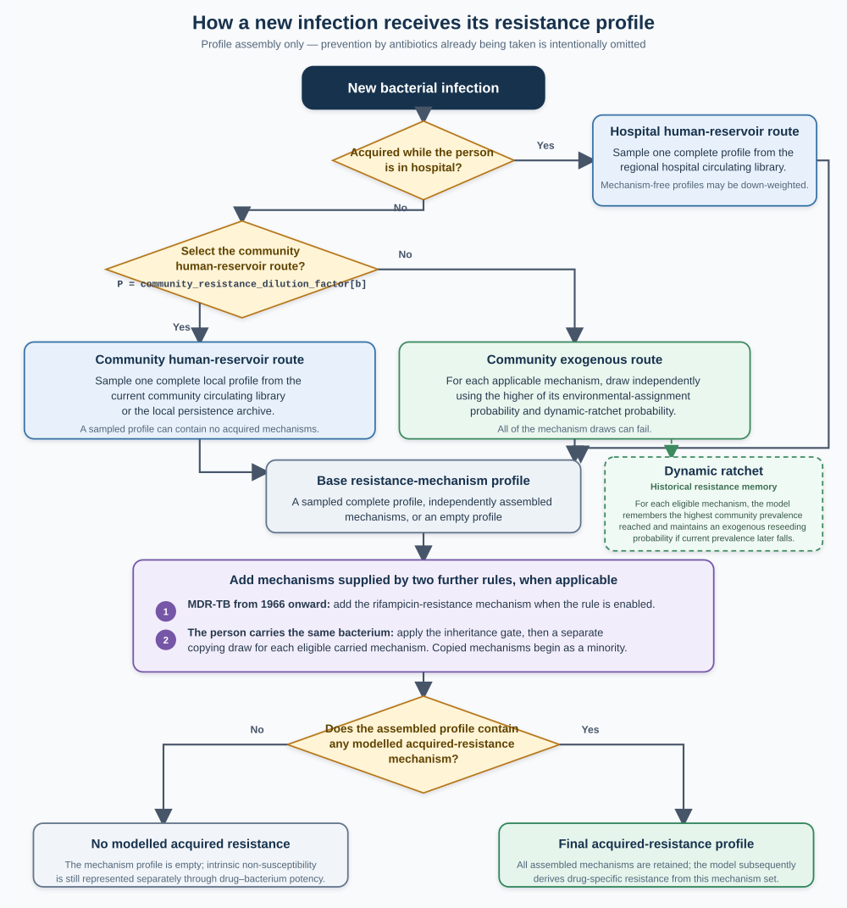
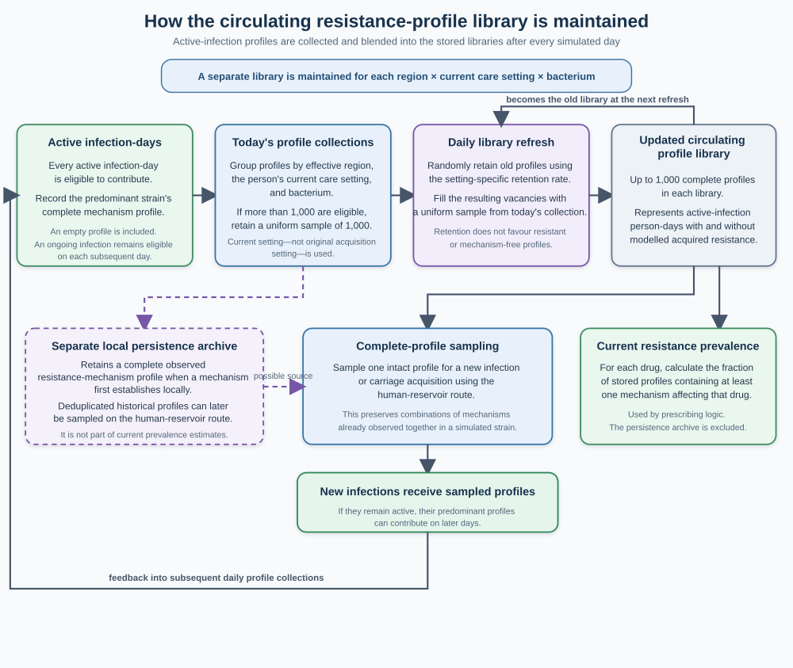

# AMR Simulation — Technical Model Description


## Contents

1. [Overview](#1-overview)
2. [Population and Demographics](#2-population-and-demographics)
3. [Infection Acquisition and Resistance at Establishment](#3-infection-acquisition-and-resistance-at-establishment)
4. [Clinical Progression](#4-clinical-progression)
5. [Diagnostic Testing](#5-diagnostic-testing)
6. [Antibiotic Treatment](#6-antibiotic-treatment)
7. [Resistance Dynamics](#7-resistance-dynamics)
8. [Microbiome and Carriage](#8-microbiome-and-carriage)
9. [Horizontal Gene Transfer](#9-horizontal-gene-transfer-hgt)
10. [Mortality](#10-mortality)
11. [Potential future model uses](#11-potential-future-model-uses)
12. [Limitations](#12-limitations)
- [Appendix A — Bacteria, Drugs, Mechanisms and Categorical Variables](#appendix-a-bacteria-drugs-mechanisms-and-categorical-variables)
- [Appendix B — Parameter Reference](#appendix-b-parameter-reference)
  - [B.1 Global Numeric Parameters](#b1-global-numeric-parameters)
  - [B.2 Drug Properties](#b2-drug-properties)
  - [B.3 Bacteria Properties](#b3-bacteria-properties)
  - [B.4 Drug–Bacteria Potency Matrix](#b4-drugbacteria-potency-matrix)
  - [B.5 Regional Parameters](#b5-regional-parameters)
  - [B.6 Age-Dependent Parameters](#b6-age-dependent-parameters)
  - [B.7 Syndrome Parameters](#b7-syndrome-parameters)
  - [B.8 Clearance Parameters](#b8-clearance-parameters)
  - [B.9 Immunodeficiency, Sex, and Vaccination Parameters](#b9-immunodeficiency-sex-and-vaccination-parameters)
  - [B.10 Resistance Mechanisms](#b10-resistance-mechanisms)
  - [B.11 Horizontal Gene Transfer Matrix](#b11-horizontal-gene-transfer-matrix)
- [Appendix C — Output Specification](#appendix-c-output-specification)
- [Appendix D — Individual-level Variable Dictionary](#appendix-d-individual-level-variable-dictionary)
- [References](#references)

---


## 1. Overview

**In this section**

- [1.1 Framework structure](#11-framework-structure)
- [1.2 Document structure](#12-document-structure)

### 1.1 Framework structure

We present a **framework** in the form of an **individual-based model** that simulates infection incidence, antibacterial use, resistance emergence, sepsis, and death. In the current configuration, we simulate a representative sample of the global population from 1930, before antibacterial use, through 2025 in **daily** time steps; full policy comparison runs can extend through 2035 and beyond. We typically simulate 10 million people who are alive at some point during the configured horizon. The framework code is open source, and we encourage others to use and further develop it to investigate how resistance has emerged over time, including through counterfactuals, to augment the calibration, and to predict the effects of potential policies on antibacterial resistance and infection-related mortality. These policies may aim directly to limit resistance, or may involve wider antibacterial use whose potential resistance costs need to be weighed against other benefits.

As currently structured, the framework tracks 42 bacterial species, 62 antibiotics (grouped into 39 drug classes), and 46 resistance mechanisms. The population is distributed across 6 world regions (North America, Europe, Asia, Oceania, South America, Africa), each with distinct epidemiological, travel, hospitalisation, and healthcare profiles.

The framework captures how bacterial resistance in the population of currently or previously actively infected people affects resistance in those newly infected in the same region, while also accounting for movement between regions. Infection acquisition hazards are externally parameterised by bacterium, age, region, vaccination, carriage, hospital status, sanitation, and selected organism-specific calendar-era effects, so the framework does not dynamically model infection transmission.

**Meaning of potency and resistance.** In this document, *potency* is a dimensionless model quantity for the baseline activity of a particular drug against a particular bacterial species when no modelled acquired resistance mechanism is present. It ranges from 0 (no baseline activity) to 1 (maximum baseline activity). Low or zero potency represents intrinsic or baseline non-susceptibility. Treatment activity also depends on systemic drug exposure, penetration to the infection site, and acquired resistance.

Throughout this document, *resistance* means resistance conferred by the acquired resistance mechanisms represented in the model. An infection may already carry these mechanisms when it is acquired: "acquired" does not imply that they necessarily arose during the current infection or within the current person. Intrinsic non-susceptibility is represented through potency and is not included in `any_r` or the model's resistance-prevalence estimates.

The simulation advances in discrete daily steps. Each simulated day, every living person in the population is processed through a sequence of mechanistic rules. These rules govern the events that can happen to a person on any given day and include:

- Demographic processes (ageing, births, background mortality)
- Infection acquisition from community, hospital, or endogenous sources
- Infection progression, including potential development of sepsis
- Diagnostic testing — bacterial identification followed by antimicrobial susceptibility testing
- Antibiotic initiation, continuation, and cessation
- Resistance emergence via de novo mutation or horizontal gene transfer
- Mortality from infection, sepsis, or drug toxicity

**Order of events within a simulated day.** In the current model, `apply_rules()` evaluates: age and vaccination status; clearing of daily microbiome indicators; immunodeficiency onset or recovery; hospital admission and discharge; travel; sepsis onset or clearance for currently active infections; antibiotic stopping, pharmacokinetic decay, and new drug initiation and selection; toxicity and treatment-failure or restart checks; mortality and sepsis recovery; and then, separately for each bacterium, new acquisition, microbiome acquisition or clearance, resistance emergence, reversion and floors, infection growth, symptoms, clearance, testing, and horizontal gene transfer (HGT). Thus sepsis onset is evaluated before new infections acquired later that same day, and new acquisition is evaluated separately for each bacterium rather than skipped because the person already has another active infection.

**Stochastic processes.** The model does not deterministically assign events such as infection, testing, treatment, or death. Instead, it calculates a *probability* for each event and then samples whether that event occurs. Repeated runs therefore produce somewhat different trajectories.

**Calibration.** As laid out below, the framework contains thousands of parameters. In the current configuration we have just a single value for each parameter which provide approximate calibration to review-informed estimates. Resistance calibration uses evidence-informed estimates drawing on named surveillance systems and burden studies (including WHO GLASS, ECDC EARS-Net, CDC AR Threats, and GRAM/GBD). We recognise that there is uncertainty over most of the parameter values, sometimes large uncertainty. Future users of the framework are likely to want to identify multiple sets of parameter values that produce an acceptable calibration in order to express parameter uncertainty when comparing future policy options.

**Resistance calibration quantities.** Figure 2 in the main paper defines simulated resistance prevalence as the proportion of active-infection person-days for which the bacteria has any acquired drug resistance to the drug (i.e. the `any_r` value is greater than zero). Resistance severity is represented separately by the mean `any_r` among those positive infection-days.  We note that many of the evidence sources informing the
review-informed resistance estimates are based on cultured clinical isolates and may overrepresent infections that are tested, severe, persistent, invasive, or healthcare-associated relative to all simulated active-infection person-days. The framework does not assign drug-specific concentration units or attempt to reproduce organism-drug MIC values, because we consider that the additional complexity would be disproportionate to its all-bacteria policy-comparison purpose.


### 1.2 Document structure

The document is organised to follow the progression of an individual through the simulation:

| Section | Content |
|---------|---------------|
| **2. Population** | Who the simulated people are — age, sex, region, immunodeficiency status |
| **3. Infection Acquisition and Resistance at Establishment** | How potential new infections arise, acquire resistance-mechanism profiles, and either become established or are prevented by existing therapy |
| **4. Clinical Progression** | What happens once infected — symptoms, syndromes, sepsis |
| **5. Diagnostic Testing** | When and how bacteria and resistance are identified |
| **6. Antibiotic Treatment** | How drugs are started, chosen, dosed, and stopped (empiric and targeted prescribing) |
| **7. Resistance Dynamics** | How bacteria become resistant and how resistance spreads (biology of AMR — mechanisms, selection pressure) |
| **8. Microbiome & Carriage** | Asymptomatic bacterial colonisation |
| **9. Horizontal Gene Transfer** | Bacteria sharing resistance genes (plasmid transfer between species) |
| **10. Mortality** | Case fatality rates, sepsis mortality |
| **11. Potential future model uses** | Illustrative scientific and policy questions that the framework could support |
| **12. Limitations** | What the framework does not capture / caveats for interpretation |
| **Appendices** | Reference tables of bacteria, drugs, parameters, individual-level variables, and outputs |


Each section describes the modelling choices, their rationale, and the specific rules and parameter values. Sections 2–10 also identify the principal individual-level variables at the start of the section where they are first treated in detail. Exact identifiers are included in parentheses for traceability to [Appendix D](#appendix-d-individual-level-variable-dictionary), which provides the complete variable dictionary and update-rule catalogue. Variables used only for output counting or to prevent duplicate reporting remain only in Appendices C and D.

---


## 2. Population and Demographics

**In this section**

- [2.1 Initialisation](#21-initialisation)
- [2.2 Ageing and age categories](#22-ageing-and-age-categories)
- [2.3 Immunodeficiency](#23-immunodeficiency)
- [2.4 Hospitalisation](#24-hospitalisation)
- [2.5 Travel](#25-travel)

This section describes the virtual people in the model — who they are, where they live, and the health states they can be in. These characteristics determine each individual's risk of infection, treatment probability, and mortality. Since AMR outcomes differ substantially by age, geography, immunodeficiency status, and care setting, these host attributes are required for realistic policy evaluation. The host layer is deliberately parsimonious: it represents the host differences most likely to matter for policy questions, rather than a full comorbidity-level clinical phenotyping framework.  Future users may wish to add further details (variables) for each individual.

**Individual-level variables introduced in this section.** Each person has an identifier (`id`), age in days (`age`), sex at birth (`sex_at_birth`), a home region (`region_living`), and a current region that can change during travel (`region_cur_in`, with `days_visiting` recording the duration of a visit). Current care setting is represented by `hospital_status` and `days_hospitalized`, and severe temporary or chronic immunodeficiency by `immunodeficiency_type`. Daily transition probabilities determine changes in immunodeficiency, hospital admission, and travel (`immunodeficiency_transition_probability`, `hospitalization_probability`, and `travel_probability`). Full definitions and update rules are provided in [Appendix D](#appendix-d-individual-level-variable-dictionary).

### 2.1 Initialisation

The population is created at day 0 (representing the calendar year 1930). Each individual is assigned:

- **Age**: Drawn from a continuous demographic distribution that encodes both living individuals and future births. Negative age values at initialisation represent individuals who have not yet been born; they enter the simulation exactly when their age reaches zero. This is how the model handles births over the configured simulation horizon without needing a separate birth process.
- **Birth sex**: Male or female, assigned with equal probability.
- **Region**: Sampled from demographic weights reflecting the global population distribution.

The six regions and their approximate population shares determine the starting geographical distribution:

Where a table in this document includes a **Citation / source** column, that citation should usually be read as support for the presence, direction, or broad ordering of the modelled effect rather than as a claim that the exact tuned numeric value is taken directly from a single empirical estimate.

| Region | Population Share |
|--------|------------------|
| Asia | ~55% |
| Europe | ~15% |
| Africa | ~12% |
| North America | ~9% |
| South America | ~6% |
| Oceania | ~3% |

*Table source: UN DESA Population Division, 2024.*

These shares are intended as a coarse world-population partition for simulation purposes rather than a literal census reconstruction of any single year. Their ordering and approximate magnitudes are consistent with the United Nations World Population Prospects 2024, which provides official demographic estimates and projections across global regions and countries.

The regions differ in antibiotic availability, hospital capacity, testing rates, and the prevalence of specific pathogens. A person's region shapes nearly every aspect of their simulated clinical journey.

### 2.2 Ageing and age categories

Each day, every individual's age increments by one day. The model groups people into age categories that determine their risk profiles, reflecting the reality that risk of infection, presentation, and outcome differ substantially across the age spectrum.

**General age categories** (used for most risk calculations):

| Age Category | Age Range | Clinical relevance |
|--------------|-----------|-------------------|
| Infant | 0–1 year | Immature immune system, high infection susceptibility |
| Preschool | 1–5 years | Frequent respiratory and enteric infections |
| School Age | 5–18 years | Generally lowest infection risk |
| Young Adult | 18–50 years | Reference group for most risk calculations |
| Middle Age | 50–70 years | Increasing comorbidities |
| Elderly | 70+ years | Immunosenescence, highest mortality risk |


Within the broad 0–1 year category, the neonatal period (0–28 days) carries especially high infection risk and infection-attributable mortality. We keep neonates inside the general infant category for most risk calculations, but treat them separately where that distinction is most clinically important, namely sepsis onset and infection-related mortality (GBD 2019 Lower Respiratory Infections Collaborators, 2022).

Likewise, the broad 70+ category compresses clinically important heterogeneity within later life: the risk of poor infection outcomes rises further with increasing age, especially above age 80. We retain a single elderly category, while continuous age effects and the separate sepsis/mortality classification capture part of that additional late-life risk.


**Sepsis/mortality age categories** :

Neonates (0–28 days) have dramatically different case-fatality rates compared to older infants and the model uses a separate age classification for sepsis onset and infection-related mortality:

| Category | Age Range |
|----------|-----------|
| Neonatal | 0–28 days |
| Paediatric | 28 days–18 years |
| Young Adult | 18–65 years |
| Elderly | 65+ years |


### 2.3 Immunodeficiency

Since immunocompromised hosts — from HIV, chemotherapy, transplantation, advanced frailty — face substantially greater clinical vulnerability (Fishman JA, 2007; Taplitz RA et al., 2018), the model captures selected consequences through two types of immunosuppression. The current acquisition equation does not include a direct immunodeficiency term; the state instead affects testing, treatment initiation, infection growth and clearance, sepsis, and mortality.

**Temporary immunosuppression** represents medium-duration higher-risk episodes more compatible with prolonged corticosteroid exposure, chemotherapy or radiotherapy-related suppression, or other treatment-associated immunosuppression lasting weeks to months than with a brief viral illness or only a few post-operative days.   In the initial set-up we are presenting here people enter this state at a rate of `0.00005` per day and recover at `0.01` per day (average duration ~100 days).

Pregnancy is not currently represented as a separate maternal immunologic state within this immunosuppression framework, but future users of the framework may wish to incorporate this. 

**Chronic immunosuppression** represents long-term conditions like HIV/AIDS with low CD4 count, solid organ transplant, or autoimmune disease requiring ongoing immunosuppressive therapy. It develops at `0.00006` per day and recovers much more slowly at `0.0012` per day.

At simulation start, a configurable fraction (currently 5%) of the population are allocated to having immmunodeficiency (e.g. Martinson ML et al., 2024).

When a new immunodeficiency episode occurs in the model, the following age-band probabilities determine whether that episode is typed as **chronic** rather than **temporary**. They are therefore best read as a structural mapping from age to chronic-vs-temporary assignment, not as literal age-specific prevalence estimates of diagnosed immunodeficiency in the underlying population:

These immunodeficiency probabilities should be read as part of a **composite infection-vulnerability state**, not as literal prevalence estimates of formal immunodeficiency diagnoses. The model therefore aggregates classic immunodeficiency, transplant medicine, chemotherapy-related neutropenia, advanced HIV, frailty, and other clinically important causes of impaired host defence into one tractable state variable (Fishman JA, 2007; Taplitz RA et al., 2018). 

**How immunodeficiency affects the clinical risks:**

The table below summarises all the ways immunosuppression changes a person's trajectory through the model. Each effect has a real-world clinical rationale:

| Effect | Parameter | Value | Clinical effect |
|--------|-----------|-------|-----------------------------|
| Weaker direct empiric-start trigger in the absence of symptoms | `antibiotic_initiation_log_odds_immunodeficiency` | +0.2 | Immunodeficiency alone does not usually trigger treatment in the current model; symptoms, sepsis, and test results drive most starts |
| More diagnostic testing | `testing_immunosuppressed_multiplier` | ×2.5 | Clinicians investigate more aggressively in immunocompromised hosts |
| Higher sepsis risk | `log_odds_sepsis_onset_immunosuppressed` | +0.7 | ~2× higher daily risk of developing sepsis for a given bacteria level |
| Harder to recover from sepsis | `sepsis_recovery_log_odds_immunosuppressed` | −1.0 | ~2.7× lower odds of daily recovery, reflecting poor immune clearance |
| Higher mortality from sepsis | sepsis death log-odds | +1.5 | ~4.5× higher risk of dying during sepsis |
| Higher mortality from drug toxicity | `toxicity_immunosuppressed_multiplier` | ×2.5 | Higher risk reflecting drug interactions and organ dysfunction |
| Higher background mortality | `log_odds_mortality_immunosuppressed` | +0.916 | ~2.5× overall mortality uplift |


Clinically, severely immunocompromised patients often also receive broader empiric antibiotic cover, sometimes extending to agents such as carbapenems or aminoglycosides because of opportunistic pathogens, resistant organisms, repeated prior antibiotic exposure, and heavier healthcare contact. The current model does not encode a separate immunodeficiency-specific bonus for broad-spectrum drug selection. Instead, that real-world tendency is captured indirectly through the model's general empiric preference for broader-spectrum therapy, increased testing, higher sepsis risk, higher hospitalisation exposure, and a small constrained prophylaxis pool for some immunocompromised hosts.

***Log-odds**. Many sections of this document describe probabilities using log-odds (also called logit values), which is standard in medical statistics. In parameter names, effects of covariates are labelled `log_odds`, although these additive effects are strictly log odds ratios:


### 2.4 Hospitalisation

Given the concentration of resistant organisms, broad-spectrum antibiotic use, and vulnerable patients in hospital settings (Magill SS et al., 2018), the model simulates daily admission decisions, length of stay, and the elevated risks of nosocomial infection.

**Admission criteria.** Each day, the model calculates a probability of hospital admission for every individual using a logistic model. The key factors are:

| Factor | Log-odds contribution | Interpretation |
|--------|----------------------|---------------|
| Baseline (healthy person) | −10.4 | Very low daily risk (~0.003%) |
| Age | +0.02 per year | Older patients are progressively more likely to be admitted |
| Symptomatic infection (severity > 3.0) | +9.5 | Severe symptomatic infection materially increases admission probability even without sepsis |
| Sepsis | +13.0 | Sepsis is a strong driver of admission, producing near-immediate inpatient escalation in most cases |
| Regional healthcare access | varies | Reflects real-world differences in hospital capacity |


Independent of this baseline logistic admission process, starting a **hospital-managed antibiotic** also triggers inpatient management. In the current model this includes a broad set of parenteral hospital drugs plus a narrow oral reserve subset (`linezolid`, `tedizolid`) used as a proxy for infections that would usually be managed in hospital. This is a simplification: in real practice, some prolonged IV courses are delivered through outpatient parenteral antimicrobial therapy (OPAT), especially in higher-income settings and particularly for infections such as bone and joint disease that may require 4-6 weeks of IV treatment.


**Length of stay:** Once admitted, patients face a baseline discharge hazard of `0.28` per day (average stay ~3.6 days), with a hard maximum of 30 days. This baseline applies only to relatively uncomplicated admissions. Patients with active sepsis, any still-active infection above the model threshold, or a current **hospital-managed antibiotic** cannot be discharged; in the current model, septic patients therefore remain admitted until the sepsis episode has resolved, the infection has cleared below the discharge threshold, and any hospital-managed treatment course has finished.  The `0.28` figure should therefore be interpreted as an **effective all-cause discharge hazard for clinically stable inpatients**, not as a claim that sepsis admissions average only 3.6 days or that every real-world admission has the same geometric length-of-stay distribution.

**Regional healthcare access:**

Hospital access varies substantially across regions. The model uses regional modifiers that adjust the admission threshold:

| Region | Modifier | Interpretation |
|--------|----------|----------------|
| Europe | +0.6 | Highest access (universal healthcare systems) |
| North America | +0.5 | Good access |
| Oceania | +0.4 | Good access in developed areas |
| Asia | 0.0 | Reference baseline (mixed access) |
| South America | −0.2 | Variable access |
| Africa | −0.5 | Most limited hospital capacity |

*Table sources: WHO UHC fact sheet, 2025; World Bank, `SH.MED.BEDS.ZS`.*

The ranking is consistent with broad cross-country differences in service coverage and infrastructure documented by WHO's universal health coverage monitoring framework and the World Bank's hospital-bed indicator, which show persistent between-country variation in effective access to care and inpatient capacity even as global service coverage has improved over time.  People who cannot access hospital care may not receive appropriate antibiotics or diagnostics, whereas international sepsis-care programmes have associated better structured in-hospital and ICU bundle delivery with lower hospital mortality (Evans L et al., 2021; Levy MM et al., 2010).


**Nosocomial (hospital-acquired) risks:**

The model captures pathogen-specific increased risk of infection acquisition for hospitalised people:

| Pathogen group | Current pattern in the reference configuration | Clinical context |
|----------|-----------------------------------------|-----------------|
| Nosocomial opportunists | Strongly positive bacterium-specific hospital-acquisition terms | *A. baumannii*, *P. aeruginosa*, *S. maltophilia*, and related device-associated pathogens remain heavily hospital-enriched |
| Hospital-enriched Enterobacterales and enterococci | Moderate-to-strong positive bacterium-specific hospital-acquisition terms | Reflects line infections, postoperative infections, ICU outbreaks, and ward-level amplification |
| Mixed hospital/community organisms | Small positive or near-neutral tuned values depending on calibration | Captures organisms such as *S. aureus*, *E. coli*, and respiratory pathogens that remain important in both settings |
| Primarily community or STI pathogens | Neutral or only modestly positive tuned values | These organisms are still more often acquired in community transmission networks than from ward ecology |


Hospital patients also face higher baseline mortality (+0.262 log-odds, ~1.3×) and higher sepsis onset risk (+0.5 log-odds, ~1.6×), but they also have a higher probability of *recovering* from sepsis (+0.8 log-odds) because of access to intensive care. The background-mortality term here should be read as a residual inpatient case-mix / frailty adjustment, not as a hospital-acquired-infection term; HCAI pressure is modelled separately through the hospital-acquisition modifiers above.


### 2.5 Travel

Since international travel is a well-established vector for AMR importation — as illustrated by ESBL-producing *E. coli* acquired by European travellers in South and South-East Asia (Arcilla MS et al., 2017) — the framework has a cross-region mixing mechanism.

The framework simulates this by giving each person a daily probability of travelling to another region (`0.0002` per day).  Travel frequency varies by region of origin, reflecting real-world patterns:

| Region | Travel multiplier |
|--------|------------------|
| Europe | ×3.5 |
| North America | ×3.0 |
| Oceania | ×2.5 |
| Asia | ×1.5 |
| South America | ×0.8 |
| Africa | ×0.3 |

Source:  UN Tourism, 2025; World Bank, `ST.INT.DPRT`; World Bank, `IS.AIR.PSGR` 


When a person travels, they are temporarily exposed to the infection risks and drug availability of the destination region. This can mean acquiring bacteria with resistance patterns typical of that region. In the current model, travel can only start while the person is at home and not hospitalised. A trip lasts 30 days, then the person returns to their home region. Destinations are sampled from a fixed origin-specific matrix.

**Age-specific travel risk.** Age-specific modifiers capture the higher risk of travel-related enteric diseases in younger adults — for example, young European adults travelling to endemic areas face elevated risk of *Salmonella enterica* serovar Typhi (+0.8 log-odds) and *Shigella* spp. (+0.5 log-odds), while *V. cholerae* risk is suppressed (−1.0) for these demographics unless visiting highly endemic zones. These modifiers reflect both behavioural factors (young adults engaging in higher-risk food/water exposure, street food consumption, water sports) and biological factors (previously unexposed immune systems). Older travellers and children show different risk profiles, with older adults generally having lower risk for enteric infections (likely due to prior exposure immunity, more conservative food/water behaviour, and sometimes reduced travel frequency) and very young children having elevated risk for multiple enteric pathogens.

---


## 3. Infection Acquisition and Resistance at Establishment

**In this section**

- [3.1 Community acquisition](#31-community-acquisition)
- [3.2 Hospital acquisition](#32-hospital-acquisition)
- [3.3 Carrier-derived infection](#33-carrier-derived-infection)
- [3.4 Resistance at establishment](#34-resistance-at-establishment)

This section describes how candidate bacterial infections arise and whether they become established. A candidate can originate from the community (e.g. human contacts, food, water), the hospital environment (e.g., ventilators, catheters, or other patients), or the person's own asymptomatic carriage. Before establishment, the model assembles the candidate infection's resistance-mechanism profile and evaluates whether any antibiotics the person is already taking prevent it. The model captures these distinctions through a deliberately compressed architecture suited to long-run AMR policy analysis rather than representing every route-specific exposure mechanism.

A person-bacterium pair is eligible for candidate acquisition only when its previous infection episode has retired at infection level zero. Every positive infection level remains owned by the existing episode, including a fading level at or below `INFECTION_EPS`; such an episode continues within-host progression and can rebound without being counted as a new acquisition.

Every resistance-mechanism profile in this section contains modelled acquired resistance mechanisms only. A resistance-mechanism profile with no mechanisms therefore means no modelled acquired resistance; it does not imply that every necessarily drug has baseline activity against the bacterium, because baseline activity is represented separately by potency.

**Individual-level variables introduced in this section.** For each bacterium, the model records vaccination status (`vaccination_status[b]`), the calculated daily acquisition risk (`predicted_infection_risk[b]`), and the temporary probability used to generate a candidate infection (`infection_acquisition_probability[b]`). A successful episode records its start day and acquisition setting (`date_last_infected[b]`, `date_last_infected_keep[b]`, and `infection_hospital_acquired[b]`). For a candidate infection, `incoming_infection_mechanism_mask[b]` represents its prospective resistance-mechanism profile; if it becomes established, `mechanism_any[b]` records mechanisms present in any of the infecting bacteria strains, `mechanism_majority[b]` records resistance mechanisms in the predominant strain, and `resistances[b][d].any_r` records the resulting (acquired) resistance level for each drug. The model also records the probability and occurrence of prevention by existing therapy (`existing_therapy_prevention_probability[b]` and `infection_prevented_by_drug[b]`). Full definitions and update rules are provided in [Appendix D](#appendix-d-individual-level-variable-dictionary).


### 3.1 Community acquisition

Each day, the model evaluates each of the 42 bacterial species separately. A person can acquire a bacterium if they are not already actively infected with that same bacterium; having another active infection does not block acquisition. Co-infections are therefore possible. The model calculates a separate probability for each species using a logistic model that combines:

- **Baseline acquisition rate** for the specific bacterium — some bacteria (e.g., *E. coli*) cause infections far more frequently than others (e.g., *L. monocytogenes*)
- **Region** — infection rates vary by geography due to climate, sanitation, and population density
- **Age** — infants and the elderly are more susceptible to most infections; sexually transmitted infections peak in young adults
- **Vaccination and same-bacterium carriage** — vaccination reduces acquisition odds, while existing carriage can increase the chance of endogenous infection
- **Hospital status and sanitation** — care setting and regional sanitation modify exposure
- **Calendar era for selected organisms** — explicit era multipliers alter MDR-TB and gonorrhoea acquisition


| Variable pattern | Function |
|------------------|-----------------|
| `{bacterium}_acquisition_log_odds_baseline` | Baseline acquisition log-odds for the bacterium |
| `{region}_{bacterium}_acquisition_log_odds` | Regional adjustment for the bacterium |
| `{bacterium}_log_odds_{age_category}` | Bacterium-specific age adjustment |
| `{bacterium}_{region}_log_odds_{age_category}` | Bacterium × region × age adjustment; the region-age value is used when no bacterium-specific value is supplied |

#### Vaccination

Vaccination is represented as a per-bacterium prevention intervention that acts before infection or carriage is acquired. Each person therefore has a yes/no vaccination record (`vaccination_status` in the code) for every bacterium.  We make the simplifying assumption of vaccination being at birth, considering the vaccines available in that year, and with a probability determined by the vaccine's rollout progress. Once vaccination has been assigned, that status remains for the rest of the simulation; there is currently no waning, revaccination, booster, or catch-up campaign explicitly modelled.

The vaccine layer supports four bacterial vaccines. The acquisition effects are informed by evidence on disease and carriage, while recognising that the model uses a single compressed effect for each target bacterium (Cutts et al., 2005; Dagan et al., 2002; Daugla et al., 2014; Eskola et al., 1990; Giufrè et al., 2015; Read et al., 2014; Warfel et al., 2014).

| Vaccine | Target bacterium | Availability year | Target birth-cohort coverage | Rollout (years) | Acquisition log-odds effect | Reduction in acquisition odds |
| --- | --- | ---: | ---: | ---: | ---: | ---: |
| Pneumococcal | *Streptococcus pneumoniae* | 2000 | 75% | 20 | -1.4 | 75.3% |
| Meningococcal | *Neisseria meningitidis* | 1981 | 55% | 20 | -2.0 | 86.5% |
| Hib | *Haemophilus influenzae* | 1985 | 85% | 15 | -1.8 | 83.5% |
| Pertussis | *Bordetella pertussis* | 1948 | 82% | 20 | -1.4 | 75.3% |

Vaccination affects acquisition in two places:

- **Infection acquisition**: if an individual is vaccinated against bacterium *b*, the model adds `log_odds_vaccinated` for that bacterium to the infection-acquisition log-odds.
- **Microbiome / carriage acquisition**: the same log-odds adjustment is applied when modelling asymptomatic carriage acquisition.

The organism-specific effects in the table are model-scale parameters, not direct estimates of clinical vaccine efficacy for a single product, serotype, endpoint, or dosing schedule. This distinction is particularly important because the model represents all *H. influenzae*, rather than Hib alone, and applies the pertussis effect to acquisition even though acellular pertussis vaccination can protect against disease more strongly than against colonisation. Vaccination does **not** directly modify bacterial growth after infection has started, symptom onset, sepsis progression, mortality, treatment choice, or transmission. It is therefore best interpreted as a static reduction in susceptibility rather than a full immune-history or herd-immunity model.


#### Age and region interactions

The current acquisition calculation uses additive log-odds across six age bands (`infant`, `preschool`, `school`, `young_adult`, `middle_age`, and `elderly`). Each bacterium can have its own age profile, and each region can further replace the age adjustment for a particular bacterium. This preserves broad patterns such as childhood enteric disease, vulnerability at the extremes of age, and young-adult concentration of sexually transmitted infections without applying a generic syndrome template as an active multiplier. Appendix B.6 lists the bacterium-age and bacterium-region-age values.

**2026 enteric-incidence recalibration.** The active-infection acquisition intercepts for *E. coli*, *Shigella* spp., and *C. jejuni* were increased by `ln(new incidence target / previous incidence target)`: +0.247, +0.773, and +1.085 log-odds, respectively. Their configured baselines are therefore -11.353, -11.827, and -11.915. Because the same baseline also enters the separate carriage-acquisition calculation, each organism's `{bacterium}_log_odds_microbiome_vs_infection` value was reduced by the same amount. This leaves its combined carriage intercept unchanged while making the intended first-order change to active-infection acquisition. Realised incidence is still nonlinear because the rule also includes age, region, vaccination, existing carriage, hospital status, and prevention by current treatment, so the new targets require verification in fresh stochastic calibration runs.

### 3.2 Hospital acquisition

Since hospitals concentrate nosocomial pathogens the model uses separate hospital-specific acquisition parameters (`{bacteria}_log_odds_hospital_acquired`) for each species.  Healthcare-associated pathogen mixes differ systematically from community mixes, but with large between-country differences in sampling intensity, bed capacity, case mix, and laboratory coverage (World Health Organization GLASS dashboard, accessed 2026; World Health Organization Global antibiotic resistance surveillance report, 2025).

For pathogens whose transmission is overwhelmingly sexual or foodborne, the current configuration assumes effectively zero hospital acquisition risk.  So while organisms such as *C. trachomatis*, *N. gonorrhoeae*, *M. genitalium*, *T. pallidum*, and *Campylobacter* can still be diagnosed while a patient is in hospital, the model treats those episodes as infections acquired in the community rather than true nosocomial transmission.


### 3.3 Carrier-derived infection

Asymptomatic carriage (see Section 8) can give rise to endogenous infection when commensal organisms transition to an active infection site. This pathway is important for AMR because:

- The carried bacteria may already contain acquired resistance mechanisms (having been selected by previous antibiotic courses)
- Resistance mechanisms in the person's carriage resistance-mechanism profile can pass from carriage to infection, with each mechanism present in the carriage compartment considered independently for transfer to the prospective infection

This pathway is governed by two parameters:

| Parameter | Value | Interpretation |
|-----------|-------|---------------|
| `carrier_resistance_inheritance_probability` | 0.50 | 50% chance that the carrier-inheritance pathway is applied; when it is, individual mechanisms are copied from the microbiome to the infection compartment |
| `infection_from_microbiome_dampening` | 0.70 | Per-mechanism transfer probability: each mechanism in the microbiome has a 70% chance of being copied to the infection site, reflecting that not all colonising lineages successfully transition to the infection site |

If the pathway is applied, only mechanisms already present in the person's carriage compartment are eligible, and successful transfers are added to the prospective infection's record of mechanisms present in any represented strain. This link is evaluated after the initial infection-acquisition draw succeeds but before the candidate infection is tested against existing therapy and established, provided the person is already carrying the same organism. It is distinct from sampling from the regional stored resistance-mechanism profile library during acquisition (Section 7.3), because it uses the person's own carriage resistance-mechanism profile rather than importing a resistance-mechanism profile from the surrounding community or hospital pool. The individual-level carriage variables are introduced in Section 8.


### 3.4 Resistance at establishment

The initial acquisition calculation determines whether a candidate active infection is generated before a resistance-mechanism profile is assigned. Resistance nevertheless affects which candidate infections ultimately become established, because the model evaluates existing antibiotic therapy against the candidate's prospective resistance mechanisms.

The sequence is:

1. **Candidate acquisition.** The model calculates the bacterium-specific acquisition probability and samples whether a candidate infection arises. This probability depends on the epidemiological factors described in Sections 3.1–3.3, not on the resistance-mechanism profile that will subsequently be assigned.
2. **Resistance source.** After a candidate arises, the model selects the applicable source pathway. A candidate may inherit a complete resistance-mechanism profile from the local human circulating reservoir, including its bounded local persistence archive, or follow an exogenous route on which configured environmental or historical reseeding probabilities may assign mechanisms. Candidate hospital infections use the local human-reservoir pathway with any configured hospital enrichment. Section 7.3 describes these population-level resistance sources.
3. **Completion of the prospective resistance-mechanism profile.** The model adds any mechanisms supplied by the MDR-TB rule and, where the person carries the same organism, by the same-person carriage pathway described in Section 3.3. These mechanisms remain prospective at this stage and are not yet stored as an active infection.
4. **Prevention by existing therapy.** For each antibiotic the person is already taking, the model calculates effective activity from baseline potency, current drug level, and the acquired resistance implied by the prospective resistance-mechanism profile. A sufficiently active drug can prevent establishment according to `antibiotic_infection_prevention_efficacy` (0.70). Acquired resistance can reduce activity and thereby permit breakthrough infection.
5. **Establishment.** If prevention occurs, the candidate infection and its prospective resistance mechanisms are discarded and no infection-acquisition event is recorded. Otherwise, the infection becomes established: `mechanism_any` and `mechanism_majority` are stored, and the drug-specific resistance measure `any_r` is calculated from the mechanisms in `mechanism_any` as described in Sections 7.2 and 7.3.

The initial candidate-acquisition probability is therefore independent of the assigned resistance-mechanism profile, but successful establishment is not. The corresponding prevention check is not applied to carriage acquisition.

---


## 4. Clinical Progression

**In this section**

- [4.1 Syndrome assignment](#41-syndrome-assignment)
- [4.2 Infection dynamics](#42-infection-dynamics)
- [4.3 Sepsis](#43-sepsis)
- [4.4 Natural clearance and microbiome dynamics](#44-natural-clearance-and-microbiome-dynamics)

Once a person has acquired a bacterial infection, the model simulates the clinical course: which body site is affected, how the infection grows, whether it progresses to sepsis, and whether the body can clear it without treatment. The level of syndromic and host detail is chosen to support policy comparisons around antibiotic resistance rather than attempting to model the clinical course of each infection in high level detail.

**Individual-level variables introduced in this section.** For each active infection, the model records the clinical syndrome (`infectious_syndrome[b]`), infection intensity (`level[b]`), and whether symptoms or another clinical-testing indication have occurred (`infection_has_caused_symptoms[b]`). Immune clearance is represented by a daily clearance probability and the first eligible clearance day (`clearance_hazard[b]` and `clearance_ready_day[b]`). Sepsis status and timing are recorded in `sepsis[b]` and `sepsis_onset_day[b]`. Daily intermediate variables govern symptom onset, sepsis onset and recovery, and the proposed next infection intensity (`symptom_onset_probability[b]`, `sepsis_onset_probability[b]`, `sepsis_recovery_probability[b]`, and `new_bacteria_level[b]`). Full definitions and update rules are provided in [Appendix D](#appendix-d-individual-level-variable-dictionary).

Infection episode ownership and clinical activity use deliberately different predicates. A positive `level[b]` belongs to the current episode and continues growth, treatment-activity and clearance updates. A level above `INFECTION_EPS` is reportably active and eligible for symptom, sepsis and diagnostic processes. At exact zero the episode is retired atomically, its episode-local state is cleared, and a later acquisition starts a new episode.


### 4.1 Syndrome assignment

When a person develops an active infection, the model assigns one of ten **anatomical clinical syndromes** (IDs 1–10). This assignment is consequential because syndrome determines:

- **Empiric drug choice** (prescribing guidelines differ by site — see Section 6.2)
- **Drug penetration** (varies by tissue — see Section 6.4)
- **Replication rate** (e.g. bloodstream supports rapid growth; bone does not)
- **Sepsis and mortality risk** (e.g. bloodstream infections are more dangerous than skin infections)

The ten clinical syndromes correspond to the major infectious disease presentations encountered in clinical microbiology:

| Syndrome | Index | Examples in clinical practice |
|----------|-------|------------------------------|
| UTI | 1 | Simple UTI, pyelonephritis — the most common bacterial infection |
| Skin/soft tissue | 2 | Cellulitis, wound infections, abscesses |
| Respiratory | 3 | Community-acquired and hospital-acquired pneumonia |
| Bloodstream | 4 | Bacteraemia, line-related infections |
| Intra-abdominal | 5 | Peritonitis, appendicitis, diverticulitis, cholangitis |
| CNS | 6 | Meningitis, brain abscess — drugs must cross the blood-brain barrier |
| Gastrointestinal | 7 | Gastroenteritis, food poisoning |
| Genital/pelvic | 8 | Sexually transmitted infections, pelvic inflammatory disease |
| Bone/joint | 9 | Osteomyelitis, septic arthritis — slow to resolve, needs prolonged treatment |
| Other | 10 | Device-related infections, undifferentiated febrile illness |

**Reserved value 0 — no observed clinical syndrome.** ID 0 is not an eleventh clinical syndrome and should not be confused with “Other” (ID 10). It has two technical uses. In `infectious_syndrome[b]`, 0 is the initial or reset value meaning that no active syndrome is recorded. In drug selection, the syndrome-0 template provides background prescribing weights when an antibiotic is started without an observed symptomatic syndrome—for example, with no active modelled infection or with an active but asymptomatic infection. When an active but asymptomatic infection follows this background path, its stored anatomical syndrome and causative bacterium are not supplied to empiric selection. Immunodeficiency prophylaxis uses a separate process.


#### How syndromes affect disease behaviour

Each syndrome modifies two key aspects of the infection:

- **Syndrome antibiotic-initiation odds ratio** — how strongly symptoms at that site increase the odds of antibiotic initiation once the infection has become symptomatic. A patient with bacteraemia (×16) or meningitis (×14) is much more likely to start antibiotics than a patient with a simple UTI (×6).
- **Bacterial growth rate multiplier** — how fast the bacteria replicate at that body site; e.g. bacteria in the bloodstream (×1.4) multiply faster than bacteria embedded in bone (×0.85).

| Syndrome | Antibiotic-initiation odds ratio | Growth multiplier | Clinical rationale |
|----------|-----------------------------|--------------------|-------------------|
| UTI | ×6.0 | ×1.0 | Common symptomatic outpatient presentation; dysuria and fever usually prompt treatment once symptoms emerge |
| Skin | ×6.0 | ×1.1 | Painful cellulitis, wound infection, and abscesses are commonly brought for treatment |
| Respiratory | ×10.0 | ×1.2 | Dyspnoea and fever drive rapid presentation |
| Bloodstream | ×16.0 | ×1.4 | Systemic toxicity and rapid incapacitation create a near-immediate treatment imperative |
| Intra-abdominal | ×10.0 | ×1.15 | Severe pain and systemic upset usually drive prompt review even if progression is not as explosive as bacteraemia |
| CNS | ×14.0 | ×1.3 | Severe headache, altered mental status, meningism, and neurological compromise should trigger urgent assessment |
| GI | ×8.0 | ×1.1 | Diarrhoea, vomiting, abdominal pain, and dehydration drive presentation |
| Genital | ×12.0 | ×0.9 | Symptomatic urethritis, cervicitis, PID, and genital ulcer disease often prompt treatment, but an infection must first enter the model's clinically apparent state |
| Bone/joint | ×4.0 | ×0.85 | Important to treat once recognised, but many bone and joint infections are slow to fully emerge |
| Other | ×4.0 | ×1.0 | Catch-all for clinically recognised infections that usually merit treatment but lack a more urgent syndrome-specific cue |


### 4.2 Infection dynamics

To reflect the continuum from initial infection to sepsis, the model tracks a numerical **infection level** — an abstract measure of bacterial burden — that rises and falls over time, rather than using a binary infected/uninfected state.

- **Starting level**: When a person first acquires an infection, the bacterial load is low (`initial_infection_level` = 0.01).
- **Growth**: Each day, the bacteria multiply. The growth rate depends on the specific bacterium, the syndrome site (see above), and whether antibiotics are present and, if so, their activity level.
- **Symptom onset**: Symptoms are sampled probabilistically once the infection has lasted at least the bacterium-specific `symptom_onset_delay_days` and its level is at least `symptom_onset_threshold_level`. The daily log-odds combine `symptom_onset_base_log_odds` with `symptom_onset_log_odds_per_level_unit` for burden above that threshold. The reference values are a 1-day delay, threshold 0.5, baseline log-odds −1.73, and +0.5 per additional level unit, with organism-specific values where configured. Once symptoms begin, `infection_has_caused_symptoms` remains present for the rest of that infection episode.

This mechanism matters for AMR because there is a window between acquiring an infection and becoming symptomatic during which bacteria can replicate before treatment is initiated.


### 4.3 Sepsis

Sepsis — the dysregulated host response to infection carrying high mortality (Singer M et al., 2016; Evans L et al., 2021) — is modelled as a distinct state that substantially increases both treatment urgency and death risk.

Each day, for each active infection that is not already septic, the model calculates the probability of progression to sepsis using a logistic model. The daily log-odds of sepsis onset combine organism virulence, bacterial burden, infection duration, infection site/syndrome, host vulnerability, region, and medical-care status. These terms are additive on the log-odds scale.

| Component | Parameter(s) | Current value / pattern | Interpretation |
|-----------|--------------|-------------------------|----------------|
| Per-bacterium baseline sepsis propensity | `<bacterium>_sepsis_baseline_log_odds`; otherwise `sepsis_baseline_log_odds` | When no organism-specific value is supplied, the model uses −12.0. Explicit organism values range from values that represent effectively no sepsis propensity, such as *H. pylori* (−500.0) and MDR-TB (−38.0), through low-sepsis organisms, to high-risk invasive pathogens such as *P. aeruginosa* (−5.0) and *S. pyogenes* (−6.0). | Captures organism-level invasive potential and virulence at a given bacterial burden. This is separate from the syndrome/site term below: it says how septic this organism tends to be, not where the infection is. |
| Bacterial burden | `<bacterium>_log_odds_sepsis_infection_level`; otherwise `log_odds_sepsis_infection_level` | Reference value +0.93 per unit of infection level. Configured organism-specific values include smaller level effects for *S. epidermidis* (+0.04) and *S. maltophilia* (+0.08). | Higher simulated bacterial burden increases daily sepsis-onset risk. |
| Duration of infection | `<bacterium>_log_odds_sepsis_infection_duration`; otherwise `log_odds_sepsis_infection_duration` | Reference value +0.005 per day since acquisition. Configured organism-specific values include *S. epidermidis* (+0.005) and *S. maltophilia* (+0.012). | Longer-standing infections gradually become more dangerous, especially if not brought under control. |
| Age and bacterium-age interaction | `sepsis_age_log_odds_baseline`, `sepsis_age_log_odds_neonatal`, `sepsis_age_log_odds_pediatric`, `sepsis_age_log_odds_young_adult`, `sepsis_age_log_odds_elderly`, plus `<bacterium>_<age_category>_sepsis_log_odds` | General age terms: baseline 0.0; neonatal (≤28 days) +1.10; paediatric (>28 days to 18 years) +0.18; young adult (>18 to 65 years) 0.0; elderly (>65 years) +0.69. Selected organisms add extra age-specific deltas, e.g. neonatal GBS, neonatal *E. coli*, paediatric pneumococcus/*H. influenzae*/*N. meningitidis*, elderly pneumococcus/*E. coli*/*Klebsiella*/*Pseudomonas*/*Acinetobacter*/VRE/*S. aureus*, and young-adult meningococcus/*S. aureus*. | Captures both general host vulnerability and pathogen-specific age patterns. The detailed organism-age terms are review-informed estimates rather than direct empirical case-fatality estimates. |
| Syndrome / infection site | `log_odds_syndrome_<id>_sepsis` | No-syndrome/unspecified (0): 0.0 by code path. UTI (1): −2.0; skin/soft tissue (2): −1.0; respiratory (3): 0.0; bloodstream (4): +1.5; intra-abdominal (5): +0.8; CNS (6): +1.2; gastrointestinal (7): −0.5; genital (8): −1.5; bone/joint (9): +0.5; other (10): defaults to 0.0 because no explicit sepsis value is configured. | Allows the same bacterium to carry different sepsis risk depending on the clinical syndrome: for example, *E. coli* bacteraemia is very different from uncomplicated lower UTI. |
| Region | `log_odds_sepsis_onset_region_<region>`; `Region::Home` fixed as neutral | North America −0.5; Europe −0.6; Oceania −0.5; Asia −0.1; South America 0.0; Africa +0.1; Home 0.0. | Represents broad differences in early recognition, healthcare access, sanitation, treatment delay, and resource availability. These are calibrated regional modifiers, not direct measured sepsis rates. |
| Immunodeficiency | `log_odds_sepsis_onset_immunosuppressed` | +0.7 if the person currently has an immunodeficiency state; otherwise 0.0. | Immunocompromised people have higher daily risk of progressing from infection to sepsis. |
| Hospitalisation | `log_odds_sepsis_onset_hospitalized` | +0.5 if the person is currently hospitalised; otherwise 0.0. | Hospitalised people are a higher-risk case mix and often have more severe or device-associated infections. |
| Not currently under medical care | `log_odds_sepsis_onset_not_under_care` | +1.0 unless the person is taking any antibiotic, is hospitalised, or has a bacterium identified for a still-active infection; otherwise 0.0. This is a person-level supportive-care proxy and does not require the antibiotic or test to concern the particular bacterium whose sepsis risk is being evaluated. | Represents the nonspecific benefits of clinical attention, monitoring, oxygen, fluids, and other supportive care in addition to antimicrobial treatment. |
| Special *H. pylori* handling | Fixed onset rule in `apply_rules()` plus `helicobacter_pylori_sepsis_baseline_log_odds` | If *H. pylori* is the only active infection, its daily sepsis-onset probability is fixed at 0.0. Its baseline is also set to −500.0, so it has effectively no intrinsic sepsis propensity in normal model use. | Represents *H. pylori* as a localised gastric infection rather than a classic invasive sepsis pathogen. Other active organisms in polymicrobial infection can still cause sepsis through their own calculations. |

The result is converted to a daily probability using the logistic function. These terms are calibrated model components designed to preserve plausible clinical ordering; the exact numeric values should not be read as direct empirical estimates of portable sepsis risk.


### 4.4 Natural clearance and microbiome dynamics

This part of the model describes clearance in two distinct states: clearance of asymptomatic microbiome carriage and clearance of active infection. These are governed by separate calculations.

- **Microbiome or carriage clearance**: `default_microbiome_clearance_probability_per_day` = 0.01 is the reference daily chance of losing asymptomatic carriage from the microbiome reservoir, with bacteria-specific values for organisms that are known to persist much longer or clear more quickly. If applied alone as a constant daily probability, 1% per day would correspond to an average carriage duration of approximately 100 days. It is not the expected duration under the full model, because carriage duration and antibiotic activity also modify the daily clearance probability.
- **Duration penalty on carriage clearance**: `carriage_duration_log_odds_coefficient` = −0.01 per day, capped by `carriage_duration_max_log_odds_effect` = −2.0, applies to microbiome carriage. The rationale is that long-established colonisation becomes harder to dislodge because organisms have had time to occupy a stable niche, form biofilms, and adapt to the host environment (Trampuz A et al., 2005), reflecting that a bacterium that has been carried for 200 days is substantially harder to clear spontaneously than one only acquired 1 day ago.
- **Antibiotic effects on carriage clearance**: Antibiotics affect carriage clearance through two pathways. First, while carriage is present, activity from each antibiotic is calculated from its current level, baseline potency against the bacterium, and resistance in the carriage compartment. Activity above 0.1 increases the ordinary daily carriage-clearance log-odds by `antibiotic_clearance_log_odds_per_unit_activity` = 0.5 per unit of effective activity. Second, if an active infection resolves through drug-assisted clearance while the same bacterium remains in the carriage compartment, `microbiome_clearance_probability_on_drug_treatment` = 0.80 gives an additional 80% probability of clearing that carriage. If this additional draw does not clear carriage, the carriage compartment remains subject to the ordinary daily clearance calculation.
- **Antibiotic-associated carriage acquisition and reporting**: Active antibiotic exposure adds drug-specific disruption increments to `microbiome_disruption_level`. This disruption reservoir decays over time and increases the log-odds of acquiring carriage, representing ecological opportunities such as *Clostridioides difficile* overgrowth in an antibiotic-disrupted microbiome. The separate `microbiome_acquired_on_drug_today` indicator records whether a carriage acquisition occurred while an antibiotic level exceeded 0.1. It is a reporting indicator and does not itself alter the acquisition probability.

**Active-infection immune clearance** is a separate daily logistic hazard. In the current model its log-odds are

$$-4.2 + \text{bacterium adjustment} + \text{age adjustment} - 0.69\,I(\text{immunodeficient}) - 0.3\times\text{infection level} + 0.25\times\text{duration in days}.$$

All current bacterium and age adjustments are zero. The daily immune-clearance probability is evaluated from the day the infection is acquired, with infection duration counted from that day. Consequently, an infection can undergo immune clearance on its first simulated day.

**Infection resolution.** Infection level changes each day through configured bacterial growth, host characteristics that modify that growth, and any active antibiotic effect. Immune clearance is evaluated separately as a daily all-or-nothing event rather than as gradual host-driven suppression of the infection level. An infection resolves when the calculated bacterial level reaches zero, or when an immune-clearance event occurs. A positive level at or below `INFECTION_EPS` remains a fading state of the same episode and continues within-host progression. *H. pylori* uses this same infection-clearance pathway but has no separate microbiome/carriage state.

There can be a delay between infection acquisition and symptom-driven treatment. During that interval, infection level follows the untreated growth calculation. Acquired resistance mechanisms may already be present in the resistance-mechanism profile assigned at infection establishment, and eligible mechanisms can subsequently be transferred through horizontal gene transfer. However, the model's de novo emergence of resistance mechanisms and promotion of minority mechanisms require active applicable antibiotic pressure. It therefore does not apply antibiotic selection before antibiotic exposure begins.

---


## 5. Diagnostic Testing

**In this section**

- [5.1 Historical introduction](#51-historical-introduction)
- [5.2 The testing process](#52-the-testing-process)
- [5.3 Testing eligibility and daily probabilities](#53-testing-eligibility-and-daily-probabilities)
- [5.4 Serious resistance marker drugs](#54-serious-resistance-marker-drugs)

Since the transition from empiric to targeted prescribing depends on laboratory turnaround — culture followed by AST, often taking days during which empiric therapy continues — the model simulates the decision to send a test, the delay in getting results, the possibility of laboratory errors, and the historical availability of testing technology. In modern laboratories, species identification from a blood-culture bottle that has flagged positive and some genotypic resistance calls can often be available within hours rather than days, but the current model collapses that heterogeneity into a single simplified turnaround parameter.

We do not attempt to reproduce the full heterogeneity of specimen quality, breakpoint revision, platform-specific AST performance, MIC levels, or local reporting conventions; instead we include the parts of the laboratory pathway most likely to alter prescribing and therefore policy-relevant resistance dynamics.

Within this simplified pathway, AST is an error-prone report of the model's mechanism-derived acquired resistance.  A zero reported resistance value (any_r = 0) therefore means that no modelled acquired resistance was reported for that drug; it does not in itself establish that the drug has baseline activity against the bacterium or will be clinically effective as that also depends on the potency of the drug against the bacteria.

**Individual-level variables introduced in this section.** For each active infection, `test_identified_infection[b]` records whether bacterial identification is complete, while `test_for_resistance[b]` records whether the antimicrobial susceptibility testing (AST) panel is available and `resistance_test_initiated_day[b]` records when AST began. The corresponding daily identification and AST-initiation probabilities, `bacterial_identification_probability[b]` and `resistance_testing_probability[b]`, are temporary calculated quantities rather than stored individual state. Once available, `resistances[b][d].test_r` records the reported acquired-resistance result for each drug; `serious_resistance_test_positive` indicates whether the completed panel reports resistance to at least one of the organism-specific marker drugs listed in [Section 5.4](#54-serious-resistance-marker-drugs). Full definitions and update rules are provided in [Appendix D](#appendix-d-individual-level-variable-dictionary).


### 5.1 Historical introduction

The framework treats routine bacterial identification and antimicrobial susceptibility testing as unavailable at the 1930 epoch and activates them at configured dates:

| Technology | Available from Calendar year | Clinical context |
|------------|---------------|-----------------|-----------------|
| **Bacterial culture** | ~1945 | Basic culture techniques became routine in the mid-20th century |
| **Antimicrobial susceptibility testing (AST)** | ~1955 | Standardised AST methods (e.g., disc diffusion) followed about a decade later (Bauer AW et al., 1966) |


Before these dates, all prescribing in the model is entirely empiric — clinicians have no laboratory information to guide drug choice. This represents the early antibiotic era, when penicillin was prescribed without knowing the susceptibility of the infecting organism.


### 5.2 The testing process

The model does not store a separate culture-order or culture-pending state. Instead, once an infection becomes eligible for bacterial testing, a successful daily identification draw represents presentation, specimen collection, culture and identification in aggregate. The three-day identification delay is measured from infection acquisition, not from a separately simulated specimen-collection date. AST is represented in more detail: it has separate not-initiated, pending, and result-ready states.

The simplified laboratory workflow is:

| Step | Parameter | Value | Interpretation |
|------|-----------|-------|-------------|
| **Bacterial identification delay** | `test_delay_days` | 3 days | Bacterial identification cannot be recorded until 3 days after infection acquisition. This is a simplified aggregate representation of symptom development, presentation, specimen collection, culture, and identification. |
| **AST result delay** | `resistance_test_result_delay_days` | 2 days | Once AST is ordered following bacterial identification, its result panel remains pending for 2 days. Treatment selection cannot use that panel during the pending interval. |
| **Reporting error rate** | `test_r_error_probability` | 2% per drug result | Each drug entry in a completed AST panel independently receives an error draw. If the simulated `any_r` is effectively zero, an error reports `test_r_error_value = 0.25`; if `any_r` is positive, an error reports 0.0. Otherwise the reported value equals `any_r`. The parameter is a simplified false-positive/false-negative process rather than a platform-specific measurement-error model. |


AST has three explicit states: not ordered, ordered but pending, and result ready. A ready panel with no detected modelled acquired resistance contains zero resistance values, so panel readiness is recorded separately and is not inferred from whether any reported resistance value is positive. Reporting error is sampled once when the complete panel becomes ready, and those reported results are retained unchanged until the infection clears. Until bacterial identification and the subsequent AST delay have elapsed, treatment proceeds without patient-specific susceptibility information.


### 5.3 Testing eligibility and daily probabilities

**Eligibility for bacterial identification.** A bacterium receives a daily identification draw only when its infection is still active, has caused symptoms or another represented indication for testing, has not already been identified, and is at least three days old. General bacterial testing and any configured bacterium-specific identification date must also have been reached. Asymptomatic carriage and asymptomatic active infection are therefore not tested through this pathway.

**Eligibility for AST.** Once bacterial identification has succeeded and AST is historically available, the model begins daily AST-initiation draws. The first such draw can occur on the same simulated day as bacterial identification. If it succeeds, the panel becomes pending and is reported two days later; no further initiation draw is made while it is pending.

For either bacterial identification or AST initiation, the conditional daily probability is

$$
\text{adjusted base probability}(x)
= \min\left(1,\;\max\left(0,\;\text{base probability}(x)
\times \text{policy multiplier}(x)\right)\right),
$$

followed by

$$
p(x,t) = \min\left(1,\;
\text{adjusted base probability}(x)
\times \text{temporal multiplier}(x,t)
\times \text{hospital multiplier}(x)
\times \text{regional multiplier}
\times \text{immunodeficiency multiplier}
\times \text{sepsis multiplier}
\right),
$$

where $x$ denotes bacterial identification or AST initiation. A policy multiplier first modifies the base probability, with that intermediate value restricted to the interval from 0 to 1. The clinical, regional and temporal factors then multiply it, and the final probability also cannot exceed 1. Because either restriction can be reached, a multiplier should not be interpreted as producing the same proportional change in every clinical context.

| Component | Bacterial identification | AST initiation after identification | Clinical interpretation and evidence |
|---|---:|---:|---|
| Base daily probability | 15% | 95% | Calibrated conditional values. They are not estimates of the proportion of all infections cultured or of all isolates receiving AST. Testing practice varies by syndrome and setting; uncomplicated outpatient infections may be managed selectively, while culture and susceptibility testing are more important in severe or complicated infection.<sup>1</sup> |
| Hospital multiplier | ×8.0 | ×5.0 | Represents greater access to specimen collection and microbiology services in hospital. The ordering is evidence-informed, but the numerical multipliers are calibrated.<sup>2</sup> |
| Sepsis multiplier | ×4.0 | ×4.0 | Represents urgent microbiological investigation in sepsis. Guidelines recommend obtaining appropriate cultures before antimicrobials when this does not materially delay treatment; the model multiplier is not a measured guideline effect size.<sup>3</sup> |
| Immunodeficiency multiplier | ×2.5 | ×2.5 | Represents more intensive investigation of high-risk immunocompromised patients, informed by diagnostic recommendations for contexts such as fever and neutropenia. The model applies one composite multiplier across all represented immunodeficiency states.<sup>4</sup> |
| Temporal adoption | Configured lower component 0.10 and maximum 1.0; fixed 40-year sigmoid after 1945 | Configured lower component 0.05 and maximum 1.0; fixed 50-year sigmoid after 1955 | Coarse historical diffusion of laboratory capacity. These are model assumptions rather than estimates fitted to a historical testing series. |

1. Gupta K et al. (2011) illustrates that microbiological testing needs differ even within UTI, with greater reliance on culture and susceptibility results for pyelonephritis than for uncomplicated cystitis. The model does not attempt to encode syndrome-specific ordering rules.
2. The broad hospital and resource-capacity rationale is supported by descriptions of diagnostic bacteriology constraints in district hospitals and WHO guidance on laboratory systems (Jacobs J et al., 2019; World Health Organization GLASS guidance, 2020). These sources do not supply the ×8.0 or ×5.0 values.
3. Sepsis guidance stresses prompt investigation alongside urgent treatment (Evans L et al., 2021). It does not estimate a universal fourfold increase in culture ordering or AST initiation.
4. Guidance for fever and neutropenia supports prompt, risk-stratified investigation and treatment in a clinically important immunocompromised population (Freifeld AG et al., 2011). The model's broader composite immunodeficiency state is not equivalent to chemotherapy-induced neutropenia.

These are **repeated daily probabilities conditional on eligibility**. For example, if the unmodified identification probability remained 15% for five eligible days, the cumulative probability of identification during that interval would be $1-(1-0.15)^5=55.6\%$, not 15%. In the full model the probability can change from day to day as hospitalisation, sepsis, region, immunodeficiency, policy, and historical adoption change. A failed identification draw leaves no stored negative-test event; an eligible active infection can receive another draw the next day.

**Regional differences.** The same regional multiplier applies to bacterial identification and AST initiation. Laboratory capacity varies substantially within as well as between world regions; the six values below are deliberately coarse effective-capacity inputs:

| Region | Testing multiplier | Model interpretation |
|--------|-------------------|---------|
| Europe | ×1.2 | Highest effective testing capacity |
| North America | ×1.1 | High effective testing capacity |
| Oceania | ×0.8 | High-resource systems combined with geographic dispersion and regional heterogeneity |
| Asia | ×0.7 | Highly heterogeneous access and capacity |
| South America | ×0.6 | Variable access and capacity |
| Africa | ×0.3 | Major bacteriology-access constraints in many settings |

*Evidence note:* Jacobs J et al. (2019), WHO GLASS, and WHO laboratory-strengthening guidance document major inequities in bacteriology and AST capacity, specimen transport, quality systems and reporting infrastructure. They support representing capacity differences but do not provide these regional multipliers. The values should not be read as literal regional culture rates, and they conceal substantial country-level and within-region variation (World Health Organization GLASS guidance, 2020; World Health Organization GLASS dashboard, accessed 2026).

Lower testing access can prolong empiric treatment, including ineffective treatment, because organism identification and patient-specific AST results are less often available to guide therapy. The model does not separately represent specimen type, specimen quality, contamination, culture-negative sampling, laboratory queueing, platform-specific sensitivity, or failure to communicate a completed result.


### 5.4 Serious resistance marker drugs

In this model, "serious resistance" is a deliberately simple **organism-specific sentinel outcome**: it means that modelled acquired resistance is present to the marker drug listed for that organism. It is not a clinical susceptibility-breakpoint classification, a definition of multidrug or extensively drug-resistant infection, a WHO or CDC priority category, or a claim that the organism is resistant to all usual treatment options. Intrinsic lack of activity is not sufficient; the outcome uses the modelled acquired-resistance state for the marker drug.

For outputs describing resistance at infection acquisition or during active infection, the classification uses the underlying modelled resistance state and does not require diagnostic testing. In the hospital-admission rule, by contrast, resistance to a marker contributes only after an AST panel is available and reports it. The same organism-to-marker mapping is used in the Rust simulation and in the Python output analysis.

| Organism group or species | Marker drug |
|---------------------------|-------------|
| Enterobacterales and selected Gram-negative nosocomial pathogens: *E. coli*, *K. pneumoniae*, *Enterobacter*, *Citrobacter*, *Serratia*, *Morganella*, *Proteus*, *P. stuartii*, *A. baumannii*, *P. aeruginosa*, *B. cepacia* complex, *B. fragilis*<sup>1</sup> | `meropenem` |
| *S. maltophilia*<sup>2</sup> | `trim_sulf` |
| Staphylococci<sup>3</sup> | `flucloxacillin` |
| Enterococci and *C. difficile*<sup>4</sup> | `vancomycin` |
| *S. pneumoniae*, *S. agalactiae*, *T. pallidum*<sup>5</sup> | `penicillin_g` |
| *S. pyogenes*<sup>5</sup> | `erythromycin` |
| *H. influenzae*<sup>1</sup> | `amoxicillin_clavulanate` |
| Macrolide-treated respiratory, atypical, STI, and cholera organisms: *M. catarrhalis*, *M. pneumoniae*, *L. pneumophila*, *B. pertussis*, *V. cholerae*, *C. trachomatis*, *M. genitalium*<sup>6</sup> | `azithromycin` |
| Fluoroquinolone-treated enteric organisms: *C. jejuni*, *S. Typhi*, *S. Paratyphi A*, *Shigella* spp., *Y. enterocolitica*<sup>7</sup> | `ciprofloxacin` |
| iNTS, *N. gonorrhoeae*, *N. meningitidis*<sup>8</sup> | `ceftriaxone` |
| *L. monocytogenes*<sup>8</sup> | `ampicillin` |
| *H. pylori*<sup>9</sup> | `clarithromycin` |

1. WHO's 2024 priority list and CDC's 2019 threats report support the importance of carbapenem resistance in *A. baumannii*, Enterobacterales and *P. aeruginosa*, and of acquired beta-lactam resistance in *H. influenzae*. They do not define these model rows: WHO separately identifies third-generation-cephalosporin-resistant Enterobacterales and ampicillin-resistant *H. influenzae*. Extending one meropenem sentinel across the broader group, and using amoxicillin-clavulanate for *H. influenzae*, are harmonising model choices (World Health Organization bacterial priority pathogens list, 2024; CDC AR Threats, 2019).
2. *S. maltophilia* has broad intrinsic beta-lactam resistance, making a carbapenem marker inappropriate. TMP-SMX is one important active option, but current IDSA guidance for invasive infection places it within combination therapy rather than treating it as a universally preferred monotherapy. Its use here identifies a clinically consequential loss of activity; it is not a treatment recommendation (Brooke JS, 2012; IDSA, 2026).
3. Flucloxacillin is the model's proxy for the anti-staphylococcal-penicillin phenotype affected by *mec*-mediated methicillin resistance. Clinical laboratories generally infer this phenotype with agents or tests such as cefoxitin, oxacillin, *mecA* or PBP2a, so the model marker should not be read as the literal laboratory definition of MRSA or methicillin-resistant coagulase-negative staphylococci (Hartman BJ & Tomasz A, 1984; EUCAST, 2023; CDC AR Threats, 2019).
4. Vancomycin-resistant *E. faecium* is an established priority resistance phenotype. For *C. difficile*, oral vancomycin is a core treatment option, but vancomycin resistance is not being invoked here as the same formal surveillance category as VRE; it is a treatment-relevance sentinel chosen by the model (CDC AR Threats, 2019; McDonald LC et al., 2018).
5. These rows deliberately combine distinct clinical rationales rather than one shared surveillance definition. WHO's 2024 list distinguishes penicillin-resistant group B streptococci, macrolide-resistant group A streptococci and macrolide-resistant pneumococci. Penicillin remains the reference treatment for syphilis, while CDC reports no clinical group A streptococcal isolate resistant to penicillin or cephalosporins; erythromycin therefore represents clinically relevant resistance among alternative therapies for *S. pyogenes* (World Health Organization bacterial priority pathogens list, 2024; Workowski KA et al., 2021; CDC group A streptococcal guidance, 2025).
6. Azithromycin has clinically important but different roles across this deliberately broad group, including respiratory or atypical infection, pertussis, cholera and selected STI pathways. In particular, macrolide resistance substantially changes *M. genitalium* management. The shared marker is a modelling convention, not a claim that azithromycin is universally first-line or that one cross-organism surveillance category exists (Metlay JP et al., 2019; Workowski KA et al., 2021; CDC pertussis guidance, 2025; WHO Regional Office for Africa, 2023).
7. Fluoroquinolone resistance in *Campylobacter*, *S.* Typhi, non-typhoidal *Salmonella* and *Shigella* is prominent in WHO or CDC priority assessments. The model applies ciprofloxacin as a common enteric sentinel and extends that convention to *S.* Paratyphi A and *Y. enterocolitica*; those extensions are model choices rather than a single formal priority category (World Health Organization bacterial priority pathogens list, 2024; CDC AR Threats, 2019).
8. Ceftriaxone is a critical third-generation-cephalosporin treatment option for gonorrhoea, invasive non-typhoidal salmonellosis and bacterial meningitis; ampicillin is added when *Listeria* is a concern. These marker choices represent loss of a clinically important treatment option, not a claim that ceftriaxone-resistant meningococcus or ampicillin-resistant *Listeria* is common (Workowski KA et al., 2021; CDC Yellow Book, 2024; World Health Organization meningitis guidelines, 2025; van de Beek D et al., 2012).
9. Clarithromycin resistance materially affects *H. pylori* eradication-regimen selection. Contemporary consensus guidance emphasises local resistance patterns and susceptibility-guided treatment where available. WHO included clarithromycin-resistant *H. pylori* in its 2017 priority list but did not retain it in the 2024 list; the model keeps it as a treatment-relevance sentinel (Savoldi A et al., 2018; Malfertheiner P et al., 2022; World Health Organization bacterial priority pathogens list, 2024).

MDR *M. tuberculosis* is excluded from this classification because rifampicin resistance is part of the definition of MDR-TB. Additional resistance within MDR-TB would require a separate measure.

---


## 6. Antibiotic Treatment

**In this section**

- [6.1 Treatment initiation — deciding to start antibiotics](#61-treatment-initiation-deciding-to-start-antibiotics)
- [6.2 Drug selection — choosing which antibiotic to use](#62-drug-selection-choosing-which-antibiotic-to-use)
- [6.3 Drug pharmacokinetics](#63-drug-pharmacokinetics)
- [6.4 Drug penetration by syndrome](#64-drug-penetration-by-syndrome)
- [6.5 Drug potency matrix](#65-drug-potency-matrix)
- [6.6 Drug availability by region and era](#66-drug-availability-by-region-and-era)
- [6.7 Drug toxicity](#67-drug-toxicity)
- [6.8 Antibiotic infection prevention](#68-antibiotic-infection-prevention)

This section covers the antibiotic prescribing process — from the decision to start an antibiotic, including initial drug selection, possible modification of treatment and stopping the course. Antibiotic use drives the selection pressure that causes resistance to first emerge.  We aim to reproduce aspects such as imperfect decisions, regional variation in drug access, and the distinction between empiric therapy (before microbiology results are available) and targeted therapy (guided by culture and susceptibility results). The intent is to represent the prescribing features most likely to change AMR trajectories under different policy environments.

**Individual-level variables introduced in this section.** Prescribing can depend on perceived penicillin allergy (`perceived_penicillin_allergy`) and on the person's current clinical and care context. For each drug, current use, treatment context, systemic exposure, initiation date, and prior use are recorded in `cur_use_drug[d]`, `drug_use_context[d]`, `cur_level_drug[d]`, `date_drug_initiated[d]`, and `ever_taken_drug[d]`; `current_number_of_drugs` records concurrent treatment.  Effective activity against each infection is recorded in `resistances[b][d].activity_r`. Treatment response is followed through infection intensity at treatment start, days on treatment, failure assessment, and the individual response multiplier (`bacteria_level_at_drug_start[b]`, `days_on_current_treatment[b]`, `treatment_failure_assessed[b]`, and `drug_activity_response_multiplier[b]`), with additional variables recording cessation and restart eligibility. Drug toxicity is represented by `drug_toxicity_reservoir[d]`. Full definitions and update rules are provided in [Appendix D](#appendix-d-individual-level-variable-dictionary).


### 6.1 Treatment initiation — deciding to start antibiotics

Each day, the model decides whether to start a new antibiotic course for each person, using a logistic model (see Section 1.2). The probability of starting antibiotics depends on the person's clinical state:

| Factor | Log-odds | Rationale |
|--------|----------|-----------|
| Baseline (no symptoms) | −5.5 (baseline odds 0.0041) | Represents the fact that the person may not have presented for care, so represents background prescribing without a clear indication, including non-specific or precautionary use seen in ambulatory care (Fleming-Dutra KE et al., 2016) |
| Symptomatic infection | +6.2 (odds ratio 500) | Once a patient has an indication for testing or treatment, prescribing becomes likely |
| Sepsis | +6.5 (odds ratio 650) | Sepsis is a medical emergency |
| Hospitalised | +0.7 (odds ratio 2.0 ) | Inpatient care increases access to and opportunity for treatment |
| Immunodeficiency | +0.2 (odds ratio 1.25) | Weak positive effect in isolation |
| No clinical indication | −1.1 (odds ratio 0.33) | Background prescribing remains possible without an active modelled bacterial infection |
| Lab-confirmed infection | +0.92 (odds ratio 2.5 ) | Positive culture results prompt targeted therapy |
| Already on an antibiotic | +0.18 (odds ratio 1.2 ) | People taking an antibiotic may be started on an additional agent (combination therapy) |
| UTI syndrome | +1.79 (odds ratio 6.0) | Common symptomatic outpatient presentation |
| Skin/soft-tissue syndrome | +1.79 (odds ratio 6.0) | Cellulitis, wounds, and abscesses commonly prompt treatment |
| Respiratory syndrome | +2.30 (odds ratio 10.0) | Pneumonia-like presentations often prompt antibiotics |
| Bloodstream syndrome | +2.77 (odds ratio 16.0) | Bacteraemia creates a strong treatment imperative |
| Intra-abdominal syndrome | +2.30 (odds ratio 10.0) | Severe abdominal infection usually requires prompt systemic treatment |
| CNS syndrome | +2.64 (odds ratio 14.0) | Meningitis or brain abscess should trigger urgent antibiotics |
| GI syndrome | +2.08 (odds ratio 8.0) | Severe diarrhoeal illness and dehydration drive presentation |
| Genital/pelvic syndrome | +2.48 (odds ratio 12.0) | STI/PID syndromes often have guideline-driven treatment |
| Bone/joint syndrome | +1.39 (odds ratio 4.0) | Important but often less immediately explosive |
| Other syndrome | +1.39 (odds ratio 4.0) | Modest increase for recognised infectious presentations |

If more than one infectious syndrome is active, the model applies only the largest syndrome odds ratio. These effects influence whether any antibiotic is started; the separate drug–bacterium `initiation_multiplier` values in Section 6.2 influence which drug is selected.


**Regional variation in antibiotic access:**

 The model captures the large global gradients in antibiotic access (Klein EY et al., 2018):

| Region | Log-odds modifier | Effect on prescribing | 
|--------|------------------|----------------------|-----------|
| North America, Europe, Oceania | 0.0 | Reference | 
| Asia | −0.5 | ~38% reduction | 
| South America | −0.8 | ~55% reduction | 
| Africa | −1.4 | ~75% reduction | 


### 6.2 Drug selection — choosing which antibiotic to use

 The choice of drug depends on the information available at the time of prescribing and on the reason the start was triggered.

**Diagnostic information stages:**

1. **Empiric therapy** — the treater (or individual self-treating in some situations) has no lab results and must choose a drug on syndromic (and availability) grounds. The model assigns syndrome-specific scores for each drug representing the relative probability they would be expected to be chosen, and then selects a drug at random taking these into account.

2. **Bacterium identified, AST pending** — the treater can use the identified bacterium, knowledge of the potency of each drug against the bacteria (when no resistance present), organism-specific prescribing preferences, and relevant regional resistance surveillance information. It does not use the bacterium's underlying modelled acquired resistance without an AST result being available.

3. **Susceptibility-informed therapy** — once AST is available, the reported results are added to the information used for drug selection. A drug reported as resistant is excluded from consideration. The underlying modelled resistance remains distinct from the reported result (which is subject to some possible error) and is not supplied directly to prescribing.

The second and third stages are both recorded as `Targeted` treatment in the current output categories. Identified treatment strongly rewards narrow-spectrum choices (×5.0 bonus for narrow-spectrum drugs) and penalises unnecessary broad-spectrum use (×0.45 penalty), reflecting the principle of antibiotic de-escalation and stewardship guidance (Barlam TF et al., 2016; Schuts EC et al., 2016; Lee CF et al., 2018).

**Drug scoring algorithm:**

For each eligible candidate drug, the model calculates a score, *s*. It converts this to a selection weight using `w = s^(1/T)`, where *T* is `drug_selection_temperature`, and samples a drug in proportion to these weights. At *T* = 1, the scores are used directly as weights. The current value, 0.55, increases the influence of score differences; lower values concentrate selection further on high-scoring drugs, whereas higher values produce more varied choices.

The empiric syndrome-drug score values are listed in [Appendix B.7](#non-default-syndrome-empiric-drug-scores), with their [historical values](#time-varying-syndrome-empiric-score-values). Identified-organism drug-choice multipliers are in the `Init multiplier` column of [Appendix B.4](#b4-drugbacteria-potency-matrix), followed by their [historical values](#time-varying-drug-initiation-values).

For identified-organism drug-choice multipliers, 1 is neutral, values below 1 reduce the score, 0 excludes the drug, and values above 1 increase the score. If more than one bacterium is identified, the largest applicable multiplier is used.

The model also records the **context** in which a course starts:

- A symptomatic infection without organism identification is recorded as `Empiric` and uses the active syndrome templates.
- A symptomatic, identified infection is recorded as `Targeted` and uses organism-specific potency and prescribing preferences, with reported susceptibility results added when available.
- An immunodeficient person without symptomatic infection enters a small `Prophylaxis` pool rather than the general empiric pool.
- A person with an active modelled bacterial infection that has not caused symptoms can still start treatment through the background prescribing template (internally, syndrome 0), but the course is recorded as `OtherActiveAsymptomaticModelledBacterialInfection`. The unobserved infection syndrome is not supplied to drug selection.
- A start with **no active modelled bacterial infection** and no prophylaxis indication is recorded as `OtherNoActiveModelledInfection` and uses the same background prescribing template.

As introduced in [Section 4.1](#41-syndrome-assignment), syndrome 0 is a background prescribing distribution for situations such as diagnostic uncertainty, viral-like illness, non-modelled infections, self-medication, and pharmacy supply without prescription.

**Historical empiric syndrome-era scores.** Empiric prescribing templates can also have time-varying syndrome-drug values of the form `syndrome_<id>_empiric_drug_<drug>_score_before_<YYYY>`. These are used only in the empiric scenario, before organism identification. They allow the model to represent historical syndromic prescribing practice. For example, genital/STI syndrome prescribing can favour sulfonamides, penicillin, tetracyclines, fluoroquinolones, cephalosporins, or azithromycin in the eras when those drugs were used empirically for urethritis/cervicitis/PID or suspected gonorrhoea.

**Considerations in candidate-drug scoring.** Candidate drugs may first be excluded because they are unavailable in the region or era, are inappropriate for the person's age, allergy or treatment context, have inadequate intrinsic activity against an identified bacterium, or have a reported resistant AST result. Among eligible drugs, scores take account of syndrome- and era-specific empiric practice; the identified bacterium and baseline potency; usual first- or second-line role; spectrum breadth; regional resistance surveillance; documented treatment failure; reserve-drug status; previous toxicity; care setting; and availability. Some drugs also have explicit restrictions to their clinically plausible uses, as described below.


**Restricted niche agents:** Some drugs are not used at all outside their clinical niche:.

- **Retapamulin** is restricted to **skin/soft-tissue prescribing contexts only**. It is excluded from undifferentiated prophylaxis, no-syndrome empiric starts, sepsis, bloodstream infections, and all non-skin systemic syndromes. In targeted (organism-identified) therapy, it is only allowed when the pathogen is *Staphylococcus aureus* or *Streptococcus pyogenes* and the syndrome is skin/soft-tissue. This reflects retapamulin's approval and clinical use as a topical agent for impetigo and other superficial skin infections (Stevens DL et al., 2014).

- **Fusidic acid** is excluded from sepsis, bloodstream infection, and undifferentiated/no-syndrome starts, but in targeted therapy it is allowed for anti-staphylococcal **skin/soft-tissue infections** and also for **bone/joint infections** (reflecting its use in osteomyelitis when combined with other agents). This gives fusidic acid a somewhat broader niche than retapamulin while still preventing it from competing as a generic systemic therapy (Koning S et al., 2012).

- **Nitrofurantoin** is restricted to genuine lower-UTI (urinary tract infection) contexts. It is excluded from sepsis, bloodstream infection, systemic infections, and non-UTI syndromes. This reflects its renal concentration and low systemic bioavailability (Brunton LL et al., 2018).

- **Fosfomycin** is also kept within lower-UTI prescribing contexts in the current model, including situations where prior cultures or resistance history would make ESBL-active oral cover attractive (e.g., ESBL-producing *E. coli* UTI where oral options are limited). Both nitrofurantoin and fosfomycin remain excluded from sepsis, bloodstream infection, and undifferentiated/no-syndrome starts (Gupta K et al., 2011).

- **Furazolidone** is modelled as a **GI-local agent** rather than a urinary agent. It is only eligible in gastrointestinal syndromes and is excluded from sepsis, bloodstream infection, and all non-GI prescribing contexts.

**Immunodeficiency prophylaxis.** A separate constrained prophylaxis path is evaluated when a person has immunodeficiency but no symptomatic infection. It is not a general empiric-treatment pool and it does not use syndrome 0. The candidate pool comprises `trim_sulf`, `azithromycin`, `ciprofloxacin`, `levofloxacin`, and `amoxicillin`. This is an aggregate representation of antibacterial prophylaxis across the model's composite immunodeficiency state. Fluoroquinolone prophylaxis is blocked for people younger than 18 years.

**Regional resistance surveillance:** If population-level resistance data shows that a drug class is failing frequently in the region, the model suppresses empiric use of that drug. For symptomatic empiric treatment, surveillance is restricted to bacteria in the model's clinical-presentation table that can plausibly cause the person's observed syndromes. Prophylaxis, asymptomatic active infection, and background/no-active-infection starts have no observed syndrome and therefore do not receive this syndrome-based resistance adjustment. Once a bacterium is identified but AST is still pending, surveillance instead uses the identified active organism or organisms. 

| Local acquired resistance prevalence | Empiric score penalty | Clinical parallel |
|----------------------|----------------------|------------------|
| >60% resistant | ×0.3 | Drug dropped from guidelines (e.g., ciprofloxacin for *E. coli* UTI in South-East Asia) |
| >45% resistant | ×0.5 | Drug used cautiously, alternatives preferred |
| >10% resistant | ×0.8 | Drug still used but with awareness of resistance risk |


#### Treatment cessation — daily stopping probability

The model does not assign a fixed or scheduled antibiotic-course length. Instead, each active drug is subject to a Bernoulli stopping decision on each eligible day. While a relevant active infection remains, the daily stopping probability is

$$
p_{\mathrm{stop}} = \min\left(0.99,\;
p_{\mathrm{bacterium}}
\times m_{\mathrm{region}}
\times m_{\mathrm{syndrome}}
\times m_{\mathrm{policy}}
\right).
$$

Here, $p_{\mathrm{bacterium}}$ is the base probability for the highest-level active bacterium for which the drug has positive baseline potency. The regional multipliers are 0.80 for Europe, 0.85 for North America and Oceania, 1.15 for Asia, 1.25 for South America, and 1.40 for Africa. The syndrome-duration multiplier is 0.50 for bloodstream infection, 0.80 for intra-abdominal infection, 0.30 for central nervous system infection, 0.50 for genital/pelvic infection, 0.15 for bone/joint infection, and 1.0 for other syndromes. These multipliers and the base probabilities are calibrated model inputs, not estimates taken directly from the cited clinical literature. An active policy can additionally modify the stopping probability.

If no relevant active infection remains for the drug, the model instead uses

$$
p_{\mathrm{stop}} = \min\left(0.99,\;0.15 \times m_{\mathrm{policy}}\right),
$$

so treatment usually stops relatively quickly after infection resolution or when no active infection is relevant to that drug. The regional and syndrome multipliers are not applied on this branch.

Selected base inputs are shown below; Appendix B.3 gives the complete bacterium-specific table. The survival illustrations assume that the base probability remains constant, all multipliers equal 1, and the infection state does not change. If $p$ is the daily stopping probability, the proportion still receiving the drug after $n$ eligible stopping decisions is $(1-p)^n$.

| Model context | Base daily stopping probability | Conditional survival illustration | Clinical rationale and limitations |
|---|---:|---:|---|
| Default, when no bacterium-specific override applies | 0.45% | 93.9% remain on treatment after 14 eligible decisions | Calibrated fallback. Evidence that treatment duration should reflect indication and response supports avoiding a universal fixed course, but does not determine this probability.<sup>1</sup> |
| No relevant active infection remains for the drug | 15% | 44.4% remain after 5 eligible decisions; 8.7% after 15 | Represents relatively rapid cessation after recovery or reassessment; the numerical probability is calibrated rather than a guideline-derived treatment duration.<sup>1</sup> |
| *Vibrio cholerae* or *Escherichia coli* | 2.5% | 88.1% remain after 5 eligible decisions | Cholera and uncomplicated cystitis provide clinical examples of very short treatment courses.<sup>2</sup> The *E. coli* value is nevertheless organism-specific in the model and therefore applies to every *E. coli* syndrome, not only gastrointestinal infection or UTI. |
| *Streptococcus pneumoniae*, *Staphylococcus aureus*, *Streptococcus pyogenes*, *Haemophilus influenzae*, *Mycoplasma pneumoniae*, *Campylobacter jejuni*, or *Streptococcus agalactiae* | 1.5% | 90.0% remain after 7 eligible decisions | Shorter courses for uncomplicated pneumonia and skin/soft-tissue infection support the broad acute-infection rationale.<sup>3</sup> The shared organism-level value is calibrated; invasive disease can require substantially longer treatment, partly represented by the syndrome multipliers above. |
| MDR *Mycobacterium tuberculosis* | 0.06% | 89.8% remain after 180 eligible decisions | Represents persistence on prolonged multidrug treatment, not a programmed six-month course. Current WHO guidance includes 6-month and modified 9-month regimens, with longer regimens for selected patients.<sup>4</sup> |

1. The clinical literature supports individualising duration by infection, source control, clinical response and treatment setting, and often supports shorter courses than were historically used (Llewelyn MJ et al., 2017). It does **not** provide direct estimates of these daily Bernoulli probabilities.
2. WHO cholera guidance includes single-dose regimens for patients requiring antibiotics (WHO Regional Office for Africa, 2023), while guidance for acute uncomplicated cystitis includes short regimens commonly used for *E. coli* infection (Gupta K et al., 2011). These examples support the relative short-course ordering, not the organism-wide 2.5% value.
3. Guideline examples include minimum five-day treatment for clinically stable community-acquired pneumonia and short courses for uncomplicated skin/soft-tissue infection (Metlay JP et al., 2019; Stevens DL et al., 2014).
4. WHO's current drug-resistant-TB recommendations include regimens of markedly different duration according to resistance pattern, eligibility and clinical circumstances (World Health Organization, 2025).

The stopping draw cannot discontinue a drug on the day after it was initiated; the first possible stochastic cessation is two simulation days after initiation. Thereafter, the process has no fixed end date. A course continues until a stopping draw succeeds, the infection resolves and activates the higher no-relevant-infection probability, or another rule stops or changes treatment, such as treatment failure or toxicity. Consequently, the 0.45% default does **not** imply an average or programmed 14-day course: 14 days is only a conditional-survival illustration.


#### Syndrome-specific empiric scoring templates

The empiric drug scores (defined in `src/config.rs` under `empiric_syndrome_templates`) are shown in Appendix B.7. The current UTI template, for example, strongly favours nitrofurantoin and fosfomycin, while retaining lower scores for alternative oral and hospital agents. These are relative prescribing weights before availability, age, syndrome restrictions, regional access, resistance surveillance, targeted-therapy modifiers, reserve-drug eligibility conditions, toxicity avoidance, and the final weighted probabilistic draw are applied.

#### Species-specific and time-varying prescribing multipliers

The syndrome-specific empiric prescribing scores described above and listed in Appendix B.7 represent relative drug-choice preferences before the causative bacterium has been identified. If and when a bacterium is identified, the model modifies candidate-drug scores using organism-specific prescribing multipliers (drug_<drug>_for_bacteria_<bacterium>_initiation_multiplier). These multipliers influence which eligible drug is selected.

**Time-varying era-specific values.** For many organisms the preferred drug changed substantially during the simulation period — not because of drug licensing (that is handled separately by `DRUG_INTRODUCTION_DATES`) but because of guideline shifts driven by accumulating clinical evidence or emerging resistance. The model represents this using `_before_YYYY` suffix keys, such as `drug_ciprofloxacin_for_bacteria_neisseria_gonorrhoeae_initiation_multiplier_before_2007`. For a given drug-organism pair, the model uses the earliest cutoff year that is still later than the current simulation year; if no cutoff applies, the base multiplier is used. This allows one configuration to describe a continuous temporal arc without adding separate year-by-year rules to the prescribing calculation.

Selected era changes currently encoded are shown below. They are relative prescribing weights, not probabilities, treatment-effect estimates, or quantities reported by the cited sources. The references support the broad historical ordering and reasons for change; the numerical weights and cut-off years are calibrated, deliberately coarse global model inputs. Drug-introduction gates, and any configured organism-recognition gates, still apply, so an earlier-era multiplier cannot make a drug available before its introduction year or a configured organism-recognition year. No organism-recognition years are currently configured (Appendix B.3). Appendix B.4 gives the complete current matrix and all time-varying overrides.

| Organism | Drug | Earlier-era multiplier(s) | Encoded era or cut-off | Current base multiplier | Historical rationale |
|---|---|---:|---|---:|---|
| *N. gonorrhoeae*<sup>1</sup> | penicillin G | 35.0 | before 1987 | 2.0 | Penicillins were dominant historical treatments; rising plasmid-mediated and chromosomal resistance ended routine empiric use |
| *N. gonorrhoeae*<sup>1</sup> | doxycycline | 80.0 | before 1987 | 0.25 | Tetracycline-class therapy was an important historical alternative; the large weight compresses historical tetracycline selection pressure |
| *N. gonorrhoeae*<sup>1</sup> | TMP–SMX | 150.0 | before 1990 | 0.04 | Proxy for older sulfonamide and later TMP–SMX selection pressure, rather than a claim that one regimen dominated throughout this whole era |
| *N. gonorrhoeae*<sup>1</sup> | ciprofloxacin | 0.5 / 120.0 | before 1987 / 1987–2006 | 3.0 | Minimal pre-introduction use, followed by a high fluoroquinolone-use era; ciprofloxacin was one of several recommended regimens, not the sole first-line treatment |
| *N. gonorrhoeae*<sup>1</sup> | ofloxacin | 70.0 | before 2007, after introduction | 2.0 | Additional recommended fluoroquinolone option during the high-use era |
| *N. gonorrhoeae*<sup>1</sup> | ceftriaxone | 2.0 | before 2007 | 6.0 | Already a recommended option during the fluoroquinolone era and increasingly the treatment backbone after fluoroquinolones were withdrawn |
| *S.* Typhi / *S.* Paratyphi A<sup>2</sup> | chloramphenicol | 20.0 / 14.0 / 2.0 | before 1975 / 1975–1989 / 1990–2009 | 2.0 | Dominant early therapy, with use falling after multidrug resistance emerged |
| *S.* Typhi / *S.* Paratyphi A<sup>2</sup> | ciprofloxacin | 14.0 | before 2010, after introduction | 4.0 / 2.0 | Fluoroquinolones became widely used after resistance to older first-line drugs; use then declined as fluoroquinolone non-susceptibility spread |
| *S.* Typhi / *S.* Paratyphi A<sup>2</sup> | ceftriaxone | 1.0 / 3.0 | before 1990 / 1990–2009 | 4.0 | Increasingly used where fluoroquinolone treatment became unreliable |
| *S.* Typhi / *S.* Paratyphi A<sup>2</sup> | azithromycin | 2.0 | before 2010, after introduction | 8.0 | Increasingly used as an oral option where fluoroquinolone non-susceptibility is common; 2010 is a coarse transition, not the onset of XDR typhoid |
| *S.* Typhi / *S.* Paratyphi A<sup>2</sup> | ampicillin | 6.0 | before 2000 | 1.0 | Historical alternative to chloramphenicol, later restricted by multidrug resistance |
| *S.* Typhi / *S.* Paratyphi A<sup>2</sup> | TMP–SMX | 7.0 | before 2000 | 0.04 | Historical alternative to chloramphenicol, later restricted by multidrug resistance |
| *Shigella* spp.<sup>3</sup> | ampicillin / TMP–SMX | 7.0 / 7.0 | before 2000 | 1.0 / 0.04 | Important older treatments whose empiric usefulness fell as resistance became widespread |
| *Shigella* spp.<sup>3</sup> | ciprofloxacin | 14.0 | before 2010, after introduction | 4.0 | Replaced older resistant regimens as a widely recommended first-line treatment; subsequent resistance reduced its reliability |
| *Shigella* spp.<sup>3</sup> | azithromycin | 6.0 | before 2010, after introduction | 10.0 | Alternative for resistant infection; the post-2010 increase is a modelled shift rather than a universal guideline date |
| *Campylobacter jejuni*<sup>4</sup> | ciprofloxacin | 10.0 | before 2010, after introduction | 4.0 | Fluoroquinolones were used for severe or empirically treated bacterial diarrhoea, but resistance increasingly limited empiric use; macrolides remain preferred when treatment is indicated |
| *E. faecalis* / *E. faecium*<sup>5</sup> | vancomycin | 0.3 | before 1985 | 4.0 / 5.0 | Low early weight followed by increased hospital glycopeptide use as MRSA became more prevalent; the resulting selection context contributed to VRE emergence |
| *C. difficile*<sup>6</sup> | metronidazole | 12.0 | before 2017, after drug introduction | 5.0 | Historically a principal treatment after *C. difficile* was implicated in antibiotic-associated colitis in the late 1970s; the 2017 IDSA/SHEA update moved routine initial treatment toward oral vancomycin or fidaxomicin |
| *C. difficile*<sup>6</sup> | vancomycin (oral) | 4.0 | before 2017, after drug introduction | 10.0 | Previously weighted more strongly for severe or refractory disease, then promoted for initial episodes in the 2017 update |
| *S. aureus*<sup>7</sup> | ciprofloxacin | 10.0 | before 2000, after introduction | 2.0 | Early enthusiasm included possible MRSA treatment, but resistance emerged rapidly; the high historical weight is not a claim of universal guideline endorsement |
| *M. genitalium*<sup>8</sup> | doxycycline | 8.0 | before 1991 | 1.5 | Represents empirical treatment of non-gonococcal urethritis before organism-specific PCR detection; doxycycline monotherapy has limited microbiological cure but remains useful for reducing organism load before another agent |
| *T. pallidum*<sup>9</sup> | erythromycin / azithromycin / clarithromycin | 3.0 / 3.5 / 1.5 | before 2010 | 0.75 / 0.5 / 0.25 | Historical oral alternatives when penicillin was avoided or unavailable; use fell after macrolide treatment failures and 23S-rRNA resistance mutations were documented |
| *E. coli*<sup>10</sup> | `nalidixic_acid` | 7.0 | before 1990, after introduction | 0.0 | Represents documented historical urinary-tract use and associated early quinolone selection pressure |
| *Shigella* spp.<sup>10</sup> | `nalidixic_acid` | 12.0 | before 1990, after introduction | 0.0 | Represents historical dysentery use; the 1990 cut-off is an earlier coarse model transition than WHO's eventual withdrawal of nalidixic acid |
| *Campylobacter jejuni*<sup>10</sup> | `nalidixic_acid` | 8.0 | before 1990, after introduction | 0.0 | Coarse early quinolone-class selection proxy, not a claim that nalidixic acid was standard organism-specific therapy |
| *S.* Typhi / *S.* Paratyphi A / iNTS<sup>10</sup> | `nalidixic_acid` | 8.0 | before 1990, after introduction | 0.0 | Coarse early quinolone-class reservoir proxy, not a claim that nalidixic acid was the routine first-line treatment for enteric fever |

*Table evidence notes:*

1. Historical reviews document successive gonococcal resistance to sulfonamides, penicillins, tetracyclines, and fluoroquinolones. The 1993 CDC guideline recommended ceftriaxone, cefixime, ciprofloxacin, or ofloxacin concurrently; CDC stopped recommending fluoroquinolones in 2007 as resistance became widespread. The model's 1987 and 2007 cut-offs therefore define broad prescribing eras rather than exact worldwide guideline transitions (Centers for Disease Control and Prevention, 1993; Centers for Disease Control and Prevention, 2007; Unemo M & Shafer WM, 2014).
2. WHO describes multidrug-resistant *S.* Typhi resistant to chloramphenicol, ampicillin, and TMP–SMX emerging in the late 1980s, followed by widespread fluoroquinolone use, increasing fluoroquinolone non-susceptibility during the 1990s and 2000s, and greater reliance on cephalosporins and azithromycin. This supports the sequence, not the exact 1990, 2000, or 2010 model cut-offs or multiplier magnitudes (World Health Organization typhoid position paper, 2018).
3. WHO's 2005 shigellosis guidance records widespread resistance to ampicillin, TMP–SMX, and nalidixic acid, recommends ciprofloxacin as first-line treatment, and lists azithromycin as an alternative. The model deliberately compresses geographically variable transitions into global eras (World Health Organization, 2005).
4. Reviews document clinical fluoroquinolone use, rapid selection of quinolone resistance, and the continued preference for macrolides when antimicrobial treatment of campylobacteriosis is indicated. They do not estimate the model's 2010 cut-off or weights (Luangtongkum T et al., 2009).
5. Vancomycin use rose in hospitals during the late 1980s alongside increasing MRSA prevalence, while VRE emerged and spread. The low pre-1985 and higher later weights are model abstractions of that change, not measured enterococcal prescribing frequencies (Rice LB, 2001).
6. Experimental evidence implicated a toxin-producing *Clostridium* in antibiotic-associated colitis in 1977. The 2017 IDSA/SHEA update recommended vancomycin or fidaxomicin over metronidazole for an initial episode and restricted metronidazole to selected non-severe episodes where access to those agents was limited. These sources support the historical rationale and direction of the 2017 shift; the relative weights remain calibrated (Bartlett JG et al., 1977; McDonald LC et al., 2018). The current configuration has no lower organism-recognition gate, so the pre-2017 multipliers technically become eligible when each drug is introduced, rather than precisely in 1977.
7. Ciprofloxacin was investigated as a possible treatment for MRSA and MSSA, but one prospective hospital study found high-level ciprofloxacin resistance in MRSA rise from none to 79% over one year after introduction. This supports strong early selection followed by restricted usefulness, not a universal 1988–2000 prescribing pattern (Blumberg HM et al., 1991).
8. *M. genitalium* was discovered in 1980–1981, while reliable clinical detection became possible only after PCR methods were developed. Doxycycline had already been a standard empirical treatment for non-gonococcal urethritis but was often microbiologically inadequate for *M. genitalium*. More recent guidance uses doxycycline first in resistance-guided sequential therapy because it reduces organism load before the second agent. The 1991 cut-off represents the start of organism detectability, not immediate worldwide routine testing (Taylor-Robinson D & Jensen JS, 2011; Workowski KA et al., 2021).
9. Macrolides were used as convenient oral alternatives for syphilis, but clinical azithromycin failures were linked to 23S-rRNA mutations and resistant strains became widespread. The 2010 transition is a coarse model date; penicillin remains the preferred treatment (Lukehart SA et al., 2004).
10. Nalidixic acid entered clinical use as an early quinolone for urinary infection and was also used for shigellosis before resistance led WHO to withdraw it. Direct historical support is strongest for the *E. coli*/urinary and *Shigella*/dysentery rows. The *Campylobacter* and *Salmonella* values deliberately supply coarse early quinolone-class selection pressure and should not be interpreted as reconstructed organism-specific prescription frequencies (Ronald AR et al., 1966; World Health Organization, 2005).

Nalidixic acid is grouped with fluoroquinolones in the model's policy-scale drug-class table, but its historical exposure is wired specifically to the first-step `MutationGyrAPrimary` route. It does not directly select the high-level `MutationGyrAParCSecondary` or `ProtectionQnr` routes. The existing 0.40 class effect is retained for this coarse representation; it should not be interpreted as a literal nalidixic-acid MIC shift.

For *M. genitalium*, the current calibration treats macrolide resistance as primarily a 23S-rRNA mutation problem, with `erm_b` retained only as a low-probability alternative MLS co-resistance pathway rather than a dominant pathway. This avoids forcing an implausibly strong mobile-element-style mechanism in an organism whose macrolide resistance is usually explained by chromosomal 23S substitutions.
The tetracycline side is handled similarly: `tet_m` is retained only as a small historical non-gonococcal-urethritis / doxycycline-era signal, not as a dominant modern resistance mechanism.

**Additional current prescribing rules.** Targeted therapy uses organism-specific first- and second-line drug lists for common pathogens such as *P. aeruginosa*, *S. aureus*, *S. maltophilia*, pneumococcus, *E. coli*, *K. pneumoniae*, Enterococcus spp., *A. baumannii*, AmpC-risk Enterobacterales, gonorrhoea, Shigella, MDR-TB, and others. Drugs outside those lists are heavily penalised once an organism is identified. High-potency drugs receive graded increases, organism-drug initiation multipliers add disease-specific preferences, and regional resistance surveillance penalises choices with high local failure signals unless a susceptibility result supports them.

Reserve agents have separate eligibility conditions. In targeted therapy, reserve drugs are strongly discouraged unless there is recent treatment failure or a severe hospitalised Gram-negative context. In empiric therapy, reserve use is stricter: recent failure or severe hospitalised Gram-negative disease must be present, and population resistance pressure can still prevent escalation. After this eligibility check, the global reserve penalty is applied (`reserve_drug_score_penalty = 0.35`).

Drug choice also remembers recent drug toxicities. If toxicity stops a drug (toxicity as modelled is non-specific), that drug receives an approximately 1000-fold avoidance penalty for the configured avoidance window. When targeted therapy starts, ineffective existing drugs are stopped if they have been found to have no activity against any identified active infection. In non-severe empiric starts, a new empiric drug generally replaces existing empiric therapy rather than stacking indefinitely; people with sepsis can still retain combination therapy.

Starting hospital-managed therapy can itself trigger admission. Always-inpatient drugs and hospital-restricted reserve drugs force admission and block discharge while active. OPAT-eligible drugs such as selected cephalosporins, ertapenem, dalbavancin, and vancomycin trigger admission probabilistically (`opat_admission_probability = 0.70`) but do not block discharge once the patient is otherwise eligible.

#### Treatment modification after inadequate response

The model can modify treatment when an active infection has not fallen sufficiently from its intensity at the start of treatment. Failure is assessed once for each tracked treatment episode. The usual assessment is after four days; selected acute syndromes are assessed after two to three days, *H. pylori* and syndrome 9 after at least six days, and MDR-TB after at least ten days. Treatment is considered to have failed if infection intensity remains at least 50% of its starting value.

Clinical non-response can therefore prompt a treatment change before bacterial identification or AST. The replacement drug is selected using only the information available at that time: syndrome-based empiric information before identification, bacterium-specific information after identification, and reported resistance only after AST is available. The hidden causative bacterium and its underlying modelled acquired resistance are not used to choose a pre-identification replacement.

When immediate replacement is indicated, the model selects another drug without repeating the ordinary daily decision about whether to initiate treatment. Drugs in the failed regimen, and drugs used within the preceding 14 days, are excluded from the replacement candidates. Once an alternative is selected, the active regimen is replaced as a whole because drugs are not attributed to individual concurrent infections. If no eligible alternative is available, the existing regimen continues. For *H. pylori*, the configured 80% probability of no immediate second-line treatment instead stops the failed regimen without starting a replacement.

If treatment was stopped while infection remained active, subsequent persistence or worsening can prompt a return to treatment during the configured restart window. Restarted treatment passes through the same diagnostic information stages. The previously stopped drug is preferred only if it remains eligible under the information currently available; otherwise another eligible drug is selected.

### 6.3 Drug pharmacokinetics

The model uses a simplified pharmacokinetic representation in which each drug has a **half-life** and a **starting level** at administration. Since the mutant selection window — where sub-therapeutic concentrations select for resistance rather than clearing it — is a key driver of emergence (see Section 7.4), the shape of the drug-level decay matters for downstream resistance dynamics.

| Parameter | Default | What it represents |
|-----------|---------|-------------------|
| `drug_{name}_half_life_days` | Drug-specific | How quickly the drug is cleared from the body |
| `drug_{name}_initial_level` | 10.0 | Drug level immediately after dosing |
| `drug_{name}_double_dose_multiplier` | 2.0 | Level when a double dose is given |
| `drug_{name}_spectrum_breadth` | 3.0 | Ordinal antibacterial-spectrum category used in drug-choice scoring; it does not itself determine microbiome disruption |


#### Selected drug half-lives

Half-lives vary enormously — from penicillin G (cleared within an hour, needing frequent dosing) to dalbavancin (which persists for two weeks, enabling single-dose therapy):

| Drug | Half-life (days) | Clinical note | Citation / source |
|------|-----------------|---------------|-------------------|
| colistin | 0.08 (~2 hours) | Very short — rapidly cleared by kidneys; poor CNS penetration (0.05) except in meningitis; reserved for pan-resistant Gram-negatives; toxicity includes nephrotoxicity and neurotoxicity (rare dosing-related; rare pre-existing) | Li J et al., 2006 |
| penicillin_g | 0.042 (~1 hour) | Very short — needs IV infusion or frequent dosing | Brunton LL et al., 2018 |
| ampicillin | 0.063 (~1.5 hours) | Short-acting penicillin | Brunton LL et al., 2018 |
| meropenem | 0.042 (~1 hour) | Short — given as IV infusion TDS | Brunton LL et al., 2018 |
| cefiderocol | 0.10 (~2.4 hours) | Short-acting novel siderophore cephalosporin | Wunderink RG et al., 2021 |
| ciprofloxacin | 0.17 (~4 hours) | Moderate — allows twice-daily oral dosing | Brunton LL et al., 2018 |
| nalidixic_acid | 0.08 (~2 hours) | Short — first-generation quinolone; rapid renal elimination; only renally/GI concentrated | Brunton LL et al., 2018 |
| linezolid | 0.21 (~5 hours) | Moderate | Brunton LL et al., 2018 |
| vancomycin | 0.25 (~6 hours) | Requires therapeutic drug monitoring | Rybak MJ et al., 2020 |
| sulfanilamide | 0.29 (~7 hours) | Historical agent | Brunton LL et al., 2018 |
| ceftriaxone | 0.33 (~8 hours) | Long enough for once-daily dosing | Brunton LL et al., 2018 |
| doxycycline | 0.75 (~18 hours) | Long — convenient once or twice-daily oral | Brunton LL et al., 2018 |
| azithromycin | 2.92 (~70 hours) | Very long tissue half-life — enables 3–5 day courses | Brunton LL et al., 2018 |
| dalbavancin | 14.0 (2 weeks) | Ultra-long — allows single-dose outpatient treatment | Dunne MW et al., 2016 |


#### Spectrum breadth — stewardship scoring and separate ecological disruption

Antibacterial spectrum is the range of bacterial groups against which a drug has useful activity. It matters when choosing broad empirical cover and when de-escalating to a narrower agent after the pathogen is known. It is related to, but not interchangeable with, measured disruption of the gut microbiome or risk of *C. difficile* infection.

The model therefore has two separate parameters:

1. `spectrum_breadth` is an ordinal stewardship-facing property used only in drug-choice scoring.
2. `microbiome_disruption_log_odds` is the per-day increment added to the persistent ecological-disruption state described in Section 8. That state decays over time and raises the log-odds of later microbiome acquisition.

Published spectrum scores demonstrate that antibacterial breadth can be represented numerically, but they use different organism groups, local susceptibility assumptions and score ranges, and can rank the same drugs differently. The model's 1–5 scale is therefore a deliberately compact, expert-assigned ordinal scale. It is not a rescaled published antibiotic spectrum index, and a one-unit difference should not be interpreted as a fixed biological or clinical effect (Gerber JS et al., 2017; Ilges D et al., 2023).

The Rust code uses the scores at category thresholds rather than as a continuous multiplier:

| Prescribing context | Spectrum category | Drug-score multiplier |
|---|---|---:|
| Targeted treatment, with adequate activity against the identified bacterium | ≤2.5 | 5.0 (narrow-spectrum bonus) |
| Targeted treatment, with adequate activity against the identified bacterium | ≥4.0 | 0.45 (broad-spectrum penalty) |
| Empirical treatment, outside prophylaxis, with a positive syndrome-drug score | ≤2.0 | 1.2 |
| Empirical treatment, outside prophylaxis, with a positive syndrome-drug score | ≥3.5 | 1.15 (broad-coverage bonus) |
| Prophylaxis | ≤3.5 | 1.25 |
| Prophylaxis | ≥4.0 | 0.10 |

Scores between the stated thresholds receive no spectrum multiplier in that context. Consequently, for example, ciprofloxacin at 4.5 and meropenem at 5.0 fall into the same operational category in every current spectrum rule; their numerical difference does not produce a graded difference in prescribing score.

Illustrative `spectrum_breadth` values are shown below. Drugs without a specific override use the default value of 3.0.

| Drug | Model score | Clinical-spectrum rationale |
|------|-------------|-----------------------------|
| nitrofurantoin<sup>2</sup> | 1.0 (minimal) | A lower-urinary-tract niche agent with low systemic exposure; its score primarily distinguishes it from systemic broad-cover agents |
| penicillin_g<sup>1</sup> | 2.0 (narrow) | Classic narrow-spectrum penicillin with important organism-specific activity but many Gram-negative and beta-lactamase-mediated gaps |
| linezolid<sup>1</sup> | 2.0 (narrow) | Activity is principally against Gram-positive organisms, including resistant staphylococci and enterococci |
| vancomycin<sup>1</sup> | 2.5 (narrow–medium) | Systemic activity is principally Gram-positive; Gram-negative outer membranes exclude the drug |
| trim_sulf<sup>1</sup> | 3.5 (medium–broad) | Activity spans selected Gram-positive and Gram-negative organisms but has important gaps, including *Pseudomonas* and anaerobes |
| azithromycin<sup>1</sup> | 4.0 (broad model category) | The high model category reflects use across respiratory, atypical, enteric and STI contexts; it does not imply reliable activity across all Gram-positive, Gram-negative and anaerobic groups |
| ceftriaxone<sup>1,3</sup> | 4.0 (broad) | Broad activity across many clinically important Gram-positive and Gram-negative organisms, with important gaps such as *Pseudomonas*, enterococci and *Listeria* |
| ciprofloxacin<sup>1</sup> | 4.5 (very broad) | Wide aerobic Gram-negative activity, including *Pseudomonas*, plus selected Gram-positive activity; anaerobic activity remains limited |
| meropenem<sup>1</sup> | 5.0 (very broad) | Very broad Gram-positive, Gram-negative and anaerobic activity, but not universal coverage; important gaps include MRSA, VRE and *S. maltophilia* |

*Table evidence notes:*

1. The qualitative activity descriptions are based on standard pharmacology and on the organism-group approach used in published spectrum scoring systems. These sources support the broad ordering, not the model's exact values or decision thresholds (Brunton LL et al., 2018; Gerber JS et al., 2017; Ilges D et al., 2023).
2. Nitrofurantoin's urinary pharmacokinetics support its lower-UTI niche. A small prospective metagenomic study found no significant faecal-microbiota impact other than a temporary increase in *Bifidobacterium*, but that ecological observation does not determine either of the model parameters (Huttner A et al., 2019; Vervoort J et al., 2015).
3. Third-generation cephalosporin exposure is associated with healthcare-facility-onset *C. difficile* infection. This supports concern about collateral ecological effects but does not estimate ceftriaxone's spectrum score or the model's separate microbiome-disruption coefficient (Slimings C & Riley TV, 2021).

In the current configuration, `microbiome_disruption_log_odds` does not vary by drug: every drug uses the default value of 0.3 because no drug-specific overrides are configured. On each day that a drug's model level exceeds 0.1, it adds 0.3 to the disruption state; concurrent qualifying drugs each add an increment. The state then decays with a 30-day half-life. Thus `spectrum_breadth` currently changes drug selection but does **not** make a broader drug cause a larger ecological-disruption increment. The ecological effect varies through exposure duration and the number of concurrent drugs, not through the breadth scores in this table. Drug-specific ecological effects could be represented in future by configuring separate `drug_{name}_microbiome_disruption_log_odds` values and calibrating them against suitable evidence.


### 6.4 Drug penetration by syndrome

The model assigns a `penetration` coefficient to each drug-class–syndrome pair. Despite the retained parameter name, this is best interpreted as a **dimensionless site-availability modifier** applied to the model's standardised drug level. It is not a measured tissue:plasma concentration ratio, an MIC, or a drug-specific concentration. In a few settings it also represents route-dependent local availability (for example, high colonic exposure after oral fidaxomicin or vancomycin) or loss of local activity (for example, daptomycin in lung surfactant).

The coefficients range from 0.0 (no useful modelled activity at the site) to 1.0 (the neutral reference: the standardised drug level is not reduced). Their qualitative ordering is informed by pharmacokinetic and pharmacological evidence, but the exact numerical values are calibrated model inputs and should not be read as estimates reported by the cited studies. The distinctions most relevant to AMR include:

- **CNS (meningitis):** The blood-brain barrier normally blocks most antibiotics, but bacterial meningitis causes substantial BBB inflammation that increases drug permeability. The penetration coefficients for CNS syndrome therefore reflect the *inflamed* BBB state rather than healthy-CNS values. Even so, drugs with very poor lipid solubility, large molecular weight, or active efflux transport (particularly aminoglycosides, polymyxins, and lipopeptides) remain inadequate at the site, while agents such as ceftriaxone, metronidazole, chloramphenicol, and linezolid achieve therapeutic CSF levels under these conditions.
- **Bone/joint:** Distribution is heterogeneous across cortical and cancellous bone, synovial fluid, implants, and biofilm. The relatively high `rifamycins`, `oxa`, and `fq` coefficients are modelling choices for useful site activity, not measured bone:plasma ratios; in particular, rifampicin's clinical role in implant-associated infection should not be equated with uniformly high bone exposure.
- **Bloodstream:** A coefficient of 1.0 is used for every drug as the model's reference compartment. This is a modelling convention: systemic exposure is already represented by the standardised drug level, so the penetration term applies no additional reduction. It does not assert identical pharmacokinetics for all drugs.

The table uses the model's internal drug-class keys; the full mapping is in Appendix A.3, but the keys used here are:

| Key | Meaning | Examples |
|-----|---------|----------|
| `fq` | Fluoroquinolones | ciprofloxacin, levofloxacin, moxifloxacin, ofloxacin |
| `sulf` | Sulfonamides | sulfanilamide, trim_sulf |
| `nitrofurans` | Nitrofurans | nitrofurantoin, furazolidone |
| `phosphonic_acids` | Phosphonic acids | fosfomycin |
| `mls` | Macrolides | erythromycin, azithromycin, clarithromycin |
| `lincosamides` | Lincosamides | clindamycin |
| `lipopeptides` | Lipopeptides | daptomycin |
| `oxa` | Oxazolidinones, not oxacillin | linezolid, tedizolid |
| `ag_group1` / `ag_group2` | Aminoglycosides | gentamicin/tobramycin; amikacin |
| `nitroimidazoles` | Nitroimidazoles | metronidazole |
| `carb_group1` / `carb_group2` | Carbapenems | ertapenem; meropenem/imipenem_c |
| `chl` | Chloramphenicol class | chloramphenicol |
| `poly` | Polymyxins | colistin |
| `macrocycles` | Macrocycles | fidaxomicin |
| `glyc` / `lipoglycopeptides` | Glycopeptides and lipoglycopeptides | vancomycin; teicoplanin/dalbavancin |
| `rifamycins` | Rifamycins | rifampicin |

| Syndrome | Higher model coefficients | Lower model coefficients |
|----------|---------------------------|--------------------------|
| UTI (1)<sup>1</sup> | `fq`, `sulf`, `nitrofurans`, `phosphonic_acids` (up to 1.0) | `mls` (0.4), `lincosamides` (0.3), `lipopeptides` (0.1) |
| Skin (2)<sup>2</sup> | `lipopeptides` (0.95), `fq` (0.9), `oxa` (0.9) | `nitrofurans` (0.2) |
| Respiratory (3)<sup>3</sup> | `mls` (0.95), `fq` (0.95), `oxa` (0.9) | `lipopeptides` (0.0), `ag_group1`/`ag_group2` (0.4) |
| Bloodstream (4)<sup>4</sup> | All 1.0 (reference compartment) | — |
| Intra-abdominal (5)<sup>5</sup> | `nitroimidazoles` (0.9), `fq` (0.75), `carb_group1`/`carb_group2` (0.75) | `ag_group1`/`ag_group2` (0.3) |
| CNS (6)<sup>6</sup> | `nitroimidazoles` (0.80), `oxa` (0.70), `chl` (0.70) | `ag_group1`/`ag_group2` (0.05), `poly` (0.05), `lipopeptides` (0.05) |
| GI (7)<sup>7</sup> | `macrocycles` (1.0), `nitroimidazoles` (0.95), oral `glyc` (0.90) | IV `glyc`/`lipoglycopeptides` (0.35) |
| Genital (8)<sup>8</sup> | `fq` (0.9), `nitroimidazoles` (0.8), `sulf` (0.8) | `ag_group1`/`ag_group2` (0.35) |
| Bone/joint (9)<sup>9</sup> | `rifamycins` (0.80), `oxa` (0.75), `fq` (0.70) | `ag_group1`/`ag_group2` (0.25), `poly` (0.2) |

1. Nitrofurantoin and oral fosfomycin produce high urinary exposure, supporting their high lower-UTI modifiers (Huttner A et al., 2019; Wijma RA et al., 2018). The syndrome is a compressed urinary-site category: these coefficients must not be interpreted as renal-parenchymal exposure or suitability for pyelonephritis.
2. Daptomycin enters inflammatory fluid, and linezolid distributes into soft tissues, supporting relatively high skin-site modifiers (Wise R et al., 2002; Lovering AM et al., 2002). The precise class ordering remains calibrated.
3. Linezolid reaches pulmonary epithelial lining fluid, whereas pulmonary surfactant inhibits daptomycin (Honeybourne D et al., 2003; Silverman JA et al., 2005). Thus the daptomycin value of 0.0 represents local loss of activity, not failure of the molecule to enter lung tissue.
4. Bloodstream 1.0 is the neutral model reference described above and is not a literature-derived universal exposure ratio.
5. Meropenem has been measured in peritoneal fluid during severe peritonitis, supporting meaningful intra-abdominal availability (Karjagin J et al., 2008). Intra-abdominal infection is anatomically heterogeneous, so the class values are calibrated syndrome-level summaries.
6. Human studies show appreciable and variable CNS exposure for linezolid and metronidazole, while daptomycin CSF exposure is low (Luque S et al., 2014; Frasca D et al., 2014; Kullar R et al., 2011). The coefficients aggregate drug properties, inflammation, and the modelled meningitis context rather than reproducing any one study's concentration ratios.
7. Oral fidaxomicin and vancomycin produce high faecal concentrations with limited systemic absorption, supporting high route-specific GI modifiers (Sears P et al., 2012; Gonzales M et al., 2010). The lower IV glycopeptide modifier represents less direct luminal availability.
8. Metronidazole has been measured in female reproductive tissues (Männistö PT et al., 1984). Because the syndrome combines several genital infection sites and patient anatomies, its exact class coefficients are broad calibration choices.
9. Linezolid enters bone, but bone exposure varies substantially by agent and anatomical site (Lovering AM et al., 2002). Modern PET measurements found rifampicin bone exposure lower than previously assumed (Gordon O et al., 2021), reinforcing that the model's `rifamycins` value is a calibrated site-activity modifier rather than a bone:plasma ratio.


These modifiers directly affect treatment outcomes in the model: a drug with a 0.05 CNS coefficient will contribute very little activity in meningitis even if its baseline potency is high and the bacterium has no modelled acquired resistance.


### 6.5 Drug potency matrix

The model encodes **potency** as a 42×62 matrix (42 bacteria × 62 named drugs). Each cell represents the baseline activity of that drug against that bacterial species when no modelled acquired resistance mechanism is present. Resistance mechanisms are applied separately through the 39-class enhancement system described in Section 7.2.

Potency values range from 0.0 (no baseline activity) to 1.0 (maximum baseline activity). They are dimensionless model quantities informed by published MIC data, clinical breakpoints, microbiological knowledge, and clinical use; they are not MICs or breakpoint classifications. Potency does not include the person's drug exposure or penetration to the infection site. Effective activity during treatment combines potency with those factors and with the remaining susceptibility after acquired resistance is applied.

For an organism–drug pair with intrinsic or baseline non-susceptibility (baseline potency $< 0.15$, the `minimal_potency_threshold_for_drug_selection` parameter), the default applicability rule prevents an acquired resistance mechanism from adding a further resistance effect for that pair unless an explicit override is configured. For example, PBP mechanisms do not create additional penicillin resistance in *Mycoplasma*, which lacks a cell wall.

Prescribing preference signals are represented through the `initiation_multiplier` parameter (e.g., fidaxomicin for *C. difficile* receives `initiation_multiplier = 1.05`).

A key modelling principle is that intrinsic or baseline non-susceptibility is represented exclusively through low or zero potency, rather than through the acquired-resistance variables. The table gives representative **zero and near-zero** rules from the current matrix; Appendix B.3 gives every organism–drug value. The cited evidence supports the qualitative biological exclusion or low-activity ordering, while the exact dimensionless values are model calibrations.

| Drug or class | Organisms | Current model setting | Biological or modelling basis |
|---|---|---:|---|
| Vancomycin<sup>1</sup> | Modelled Gram-negative bacteria | 0.0 | The Gram-negative outer membrane excludes conventional vancomycin, producing intrinsic lack of activity |
| Metronidazole<sup>2</sup> | Most modelled aerobic and facultative organisms | Usually 0.0–0.10 | Productive reductive activation is favoured at low redox potential; oxygen can reoxidise and quench the nitro radical. Explicit exceptions, including *H. pylori*, are configured separately |
| Aztreonam<sup>3</sup> | Most modelled Gram-positive organisms | 0.0–0.10 | Aztreonam's narrow Gram-negative spectrum is represented through poor baseline activity against essential Gram-positive PBPs, not through absence of an outer-membrane entry route |
| Aminoglycosides<sup>4</sup> | *C. difficile*, *B. fragilis* | 0.0–0.10 | Energy-dependent aminoglycoside uptake relies on membrane potential and electron transport and is greatly impaired under anaerobic conditions |
| Sulfanilamide<sup>5</sup> | *B. fragilis* | 0.05 | Low activity of the early single-sulfonamide proxy. The current TMP–SMX value is 0.30 and is **not** zeroed; historical in-vitro results varied with the component ratio and test conditions |
| Nitrofurantoin<sup>6</sup> | *S. maltophilia* | 0.0 | A model-scope exclusion reflecting the absence of an established clinical treatment role; it should not be read as a claim that one universal molecular mechanism has been demonstrated |
| Penicillins, first-/second-generation cephalosporins, carbapenems, macrolides, clindamycin, and aztreonam<sup>7</sup> | *S. maltophilia* | Mostly 0.01–0.05 | Multiple intrinsic determinants—including L1/L2 β-lactamases and class-dependent efflux and permeability effects—support broadly low activity; the contribution of each determinant differs by drug class (exact pair values are in Appendix B.3) |

1. Conventional vancomycin is intrinsically inactive against Gram-negative bacteria because it does not cross the outer membrane; membrane-active analogues can overcome that barrier experimentally (Yarlagadda V et al., 2016).
2. Metronidazole radical formation is suppressed by oxygen, although activation and susceptibility depend on organism-specific redox and nitroreductase biology rather than a simple binary aerobe label (Lloyd D & Pedersen JZ, 1985; Goodwin A et al., 1998).
3. Monobactam antibacterial spectra track binding to essential PBPs; the aztreonam rule therefore represents target-affinity and spectrum, correcting the misleading suggestion that Gram-positive bacteria lack a required outer-membrane route (Georgopapadakou NH et al., 1983).
4. Experimental work links streptomycin and gentamicin uptake to membrane energetics and electron transport (Bryan LE & Kwan S, 1983). The model values are near zero rather than uniformly zero, and “greatly impaired” is more accurate than “completely abolished.”
5. Historical *B. fragilis* studies found low trimethoprim susceptibility from an insensitive dihydrofolate reductase but susceptibility to sulfamethoxazole, with combination results dependent on drug ratio, medium, and inoculum (Then RL & Angehrn P, 1979; Phillips I & Warren C, 1976). These data do not support the previous blanket statement that TMP–SMX is intrinsically inactive.
6. The nitrofurantoin rule is a deliberate boundary of the treatment model. Reviews of *S. maltophilia* treatment and resistance support its restricted treatment repertoire but do not establish the specific universal nitrofurantoin mechanism previously implied (Brooke JS, 2012).
7. Genomic and experimental studies document the dense intrinsic resistance repertoire of *S. maltophilia*, including L1/L2 β-lactamases and the broad SmeDEF efflux system (Crossman LC et al., 2008; Alonso A & Martínez JL, 2000; Brooke JS, 2012). These sources support broad low susceptibility, not each exact value in the matrix.

An exact value of 0.0 means that the pair has no baseline activity in the model. Near-zero values below `minimal_potency_threshold_for_drug_selection` (0.15) have a similar operational consequence for default drug selection and acquired-mechanism applicability, while preserving small differences among organism–drug pairs.

Key examples:

- Meropenem vs *E. coli*: 0.95 (very high potency — carbapenem against susceptible Gram-negative)
- Vancomycin vs *S. aureus*: 0.95 (first-line MRSA therapy)
- Vancomycin vs *E. coli*: 0.0 (outer membrane blocks access — intrinsic, not acquired)
- Metronidazole vs *C. difficile*: 0.90 (obligate anaerobe — activated drug reaches target)
- Metronidazole vs *S. aureus*: 0.10 (the modelled facultative/aerobic context gives only near-zero productive activation)
- Ceftriaxone vs *S. pneumoniae*: 0.95 (standard treatment for pneumococcal meningitis)
- Aztreonam vs *P. aeruginosa*: 0.80 (monobactam active against Gram-negatives including Pseudomonas)
- Aztreonam vs *S. aureus*: 0.0 (poor activity against essential Gram-positive PBPs — intrinsic spectrum exclusion)


### 6.6 Drug availability by region and era

The model makes antibiotics available from their configured introduction days. Sulfanilamide is the first available agent, nalidixic acid provides an early quinolone-era exposure before the later fluoroquinolones, and newer reserve agents enter only near the end of the historical horizon. This sequencing is essential for reproducing the emergence of resistance over the 20th and early 21st centuries; the exact model day for each introduction is generated in Appendix B.2.

**Regional availability:** Even after a drug is introduced globally, not all regions have equal access. Newer, more expensive drugs may be unavailable or rarely used in lower-income settings:

| Region | Access pattern |
|--------|---------------|
| North America | Full access to all drugs |
| Europe | Full access to all drugs |
| Asia | Most drugs available; limited access to tedizolid, ceftaroline (30%) |
| Oceania | Good access; limited novel agents (50%) |
| South America | Limited newer drugs (tedizolid 10%, linezolid 50%, carbapenems 60–70%) |
| Africa | Basic antibiotics available (80–100%); ceftriaxone 60%; vancomycin 30%; carbapenems 10–20%; most novel drugs 0–10% |


This has major implications for AMR: in Africa, where carbapenems are rarely available, carbapenem resistance may emerge more slowly — but when it does arrive (via travel or HGT), there are no last-resort drugs available to treat it.

These availability tiers should be interpreted as qualitative access strata rather than audited procurement shares. They summarise broad world patterns in which older essential antibiotics are much more widely available than newer reserve agents, and in which stewardship, financing, regulatory approval, supply-chain reliability, and laboratory support jointly determine whether a drug is realistically usable in practice (World Health Organization GLASS-AMU report, 2025; World Health Organization UHC fact sheet, 2025).


#### Drug introduction dates

Antibiotic availability is controlled by a per-drug introduction day measured from the 1930 epoch. Before that day a drug cannot be selected; afterwards it remains subject to regional access and all other prescribing restrictions. Appendix B.2 is generated from `DRUG_INTRODUCTION_DATES` and lists the exact introduction day used by the current model for all 62 drugs. Keeping that table generated is important because historical prescribing-era values do not themselves make a drug available before its configured introduction day.

**Historical special case — colistin withdrawal and reintroduction.** Colistin was introduced in 1952 but experienced a clinical eclipse between approximately 1970 and 1995 due to severe nephrotoxicity and the availability of better-tolerated agents. The framework reflects this by reducing colistin availability to **5% of normal** during the withdrawal window (1970–1995 in calendar terms), modelling the situation where colistin was rarely prescribed outside select research and compassionate-use contexts. From 1995 onward, colistin availability returns to its regional baseline, reflecting its reintroduction as a last-resort agent for multi-drug-resistant Gram-negative bacteria (Li J et al., 2006).


### 6.7 Drug toxicity

Some drugs — particularly `ag_group1`/`ag_group2` agents (nephrotoxicity, ototoxicity) and `poly` (`colistin`, nephrotoxicity) — carry significant toxicity risks. The model simulates drug toxicity as a **reservoir** that accumulates with continued use and decays when the drug is stopped.

Toxicity can cause two outcomes:

**1. Drug discontinuation (sub-lethal toxicity):** When toxicity accumulates, the treating clinician may stop the drug. This is the more common outcome; for example, rising creatinine during gentamicin exposure may prompt a switch to a less nephrotoxic alternative. The model implements this as a **threshold check**: each day, the combined daily toxicity death risk (see below) is computed; if it exceeds a sub-lethal threshold, the drug with the highest toxicity reservoir is discontinued.

| Factor | Parameter | Value | Effect |
|--------|-----------|-------|--------|
| Sub-lethal threshold | `toxicity_discontinuation_threshold` | 0.00001 | When the daily toxicity death risk exceeds this level, the (most-toxic) drug is stopped |
| Recent toxicity avoidance | Avoidance penalty | ×0.001 (1000× penalty) | After stopping a drug for toxicity, it receives a strong prescribing penalty during the avoidance window |
| Avoidance window | `toxicity_discontinuation_avoidance_days` | 30 days | How long the prescriber avoids re-prescribing the toxicity-stopped drug |


**2. Drug-related death (lethal toxicity):** Rarely, severe drug toxicity can be fatal — for example, acute kidney injury from colistin leading to multiorgan failure.  The model uses a **multiplicative hazard** model: each drug has a per-unit daily hazard rate (typically in the 10⁻⁸ range), and the total risk is the sum of (drug level × drug-specific hazard) across all active drugs, multiplied by patient-specific vulnerability factors.

| Factor | Parameter | Value | Effect |
|--------|-----------|-------|--------|
| Drug-specific hazard | Per-drug hazard rate | ~10⁻⁸ (varies by drug) | Colistin and aminoglycosides carry the highest per-unit hazard |
| Infant vulnerability | `toxicity_age_multiplier_infant` | ×1.8 | Neonates more vulnerable to drug toxicity |
| Child vulnerability | `toxicity_age_multiplier_child` | ×1.2 | Moderate additional risk |
| Adult (reference) | `toxicity_age_multiplier_adult` | ×1.0 | Reference group |
| Elderly vulnerability | `toxicity_age_multiplier_elderly` | ×2.2 | Highest toxicity vulnerability — reduced renal clearance, polypharmacy |
| Immunosuppressed | `toxicity_immunosuppressed_multiplier` | ×2.5 | Immune compromise increases toxicity risk |
| Hospitalised | `toxicity_hospital_multiplier` | ×1.3 | Hospitalised patients are often sicker but also monitored |


### 6.8 Antibiotic infection prevention

Patients who are already receiving an effective antibiotic are partially protected against candidate new infections becoming established (Bratzler DW et al., 2013). After the initial infection-acquisition draw and assembly of the prospective resistance mechanisms, the model evaluates each current drug using its potency against the bacterium, the person's current drug level, and the acquired resistance implied by those mechanisms. Each drug with effective activity above 0.5 has a 70% chance of preventing establishment (`antibiotic_infection_prevention_efficacy` = 0.7). Acquired resistance reduces effective activity and can therefore allow breakthrough, so patients taking antibiotics are selectively more likely to establish infections carrying acquired resistance mechanisms than infections carrying none. This prevention check acts after, rather than as a multiplier on, the initial acquisition probability.


---


## 7. Resistance Dynamics

**In this section**

- [7.1 Resistance mechanisms](#71-resistance-mechanisms)
- [7.2 Mechanism–drug-class enhancement multipliers](#72-mechanismdrug-class-enhancement-multipliers)
- [7.3 Resistance at acquisition](#73-resistance-at-acquisition)
- [7.4 Resistance emergence](#74-resistance-emergence)
- [7.5 Resistance reversion and fitness costs](#75-resistance-reversion-and-fitness-costs)
- [7.6 Local finite-population mechanism persistence](#76-local-finite-population-mechanism-persistence)
- [7.7 Mechanism-derived cross-drug effects](#77-mechanism-derived-cross-drug-effects)
- [7.8 Environmental and Exogenous Mechanism Floors](#78-environmental-and-exogenous-mechanism-floors)
- [7.9 Dynamic ratchet floor](#79-dynamic-ratchet-floor)

This section describes how the model represents the biology of resistance emergence and spread. The model tracks resistance at the level of individual **mechanisms**.  The level of detail to which we model mechanisms (and therefore how many we include) is a balance betweeen needing to reflect important realities that change the effects of some policies and a need to avoid going down an ultimately unproductive route of trying to model every detail of everything.

All resistance terms in this section refer to acquired, mechanism-mediated resistance. This includes mechanisms already present in a resistance-mechanism profile sampled when infection or carriage is acquired. Intrinsic or baseline non-susceptibility is encoded through low or zero **potency** and is **not** part of the mechanism records, `any_r`, or `microbiome_r`.

**Individual-level variables used in this section.** The active-infection mechanism records (`mechanism_any[b]`, `mechanism_majority[b]`) and derived drug resistance `resistances[b][d].any_r` introduced in Section 3 are updated as resistance changes. Mechanisms represented in carriage and their derived drug-specific resistance are recorded in `mechanism_microbiome[b]` and `resistances[b][d].microbiome_r`; the wider carriage state is described in Section 8. At acquisition, `local_profile_sampling_probability[b]` is the probability of sampling a resistance-mechanism profile from the local circulating library or persistence archive. This section also introduces the daily probabilities that an absent mechanism emerges, that a minority mechanism becomes predominant, and that an unselected mechanism is lost (`de_novo_emergence_probability[b,m]`, `minority_promotion_probability[b,m]`, and `mechanism_reversion_probability[b,m]`). Full definitions and update rules for the individual-level variables are provided in [Appendix D](#appendix-d-individual-level-variable-dictionary).

**Mechanism-centred architecture.** For each person and bacterium, the model records which resistance mechanisms are present in the active infection and in any bacteria being carried / in the microbiome. Drug-level resistance is then calculated from those mechanisms. In the code, these three records are `mechanism_any` (at least a minority of the infecting bacteria have this mechanism), `mechanism_majority` (the majority of infecting bacteria have this mechanism), and `mechanism_microbiome` (the bacteria in the microbiome carry this mechanism), while the derived drug-level resistance measures are `any_r` (on a scale of 0-1 the extent to which the underling potency of the drug against the actively-infecting bacteria is undermined by the resistance mechanisms present) and `microbiome_r` (the same for bacteria in the microbiome). At population level, MechanismCache maintains the circulating resistance-mechanism profile library, the bounded local establishment archive, and the historical peak-prevalence records used by the "ratchet" (see below).


### 7.1 Resistance mechanisms

The model explicitly tracks **46** distinct resistance mechanisms. Each mechanism represents a specific biological pathway: an enzyme that destroys the drug, a mutation that changes the drug's target, a pump that ejects the drug from the cell, or a barrier that prevents the drug entering.

The table below lists every mechanism, the drugs it affects, and which bacterial groups can acquire it. It is intended as a reference table. The key point is that each mechanism has a defined scope: ESBL enzymes (rows 1–3) relate to `pen`, `c1_2g`, `c3g`, `c4g`, and related monobactam-active entries but not `carb_group1`/`carb_group2`, while KPC and NDM/VIM (rows 7–8) compromise the carbapenem classes as well, for example.

The final column gives representative evidence for the core molecular mechanism and its clinically relevant drug relationship. It does **not** imply that one source validates every drug or host listed in that row. The explicit drug lists and broad bacterial-class labels are the model's reviewed, compressed implementation correspondence: individual variants can have narrower or wider substrate profiles, and host eligibility is restricted further by organism-specific rules in the code. These entries are therefore mechanism-level modelling categories rather than MIC, breakpoint, or species-exhaustive classifications.


  | Mechanism | Variable name | Description | Explicit Drugs Affected | Bacterial Classes Affected | Representative evidence |
  |-----------|--------------|-------------|-------------------------|----------------------------|-------------------------|
   | ESBL CTX-M | `enzyme_esbl_ctx_m` | Extended-spectrum β-lactamase | `penicillin_g`, `ampicillin`, `amoxicillin`, `piperacillin`, `ticarcillin`, `flucloxacillin`, `cephalexin`, `cefazolin`, `cefuroxime`, `ceftriaxone`, `ceftazidime`, `cefixime`, `cefepime`, `ceftaroline`, `aztreonam` | Enterobacterales, Nonfermenters, Enteric Pathogens, Fastidious, Anaerobes | Bauernfeind A et al., 1990 |
   | ESBL TEM | `enzyme_esbl_tem` | Extended-spectrum β-lactamase | `penicillin_g`, `ampicillin`, `amoxicillin`, `piperacillin`, `ticarcillin`, `flucloxacillin`, `cephalexin`, `cefazolin`, `cefuroxime`, `ceftriaxone`, `ceftazidime`, `cefixime`, `cefepime`, `ceftaroline`, `aztreonam` | Enterobacterales, Nonfermenters, Enteric Pathogens, Fastidious, Anaerobes | Sougakoff W et al., 1988 |
   | ESBL SHV | `enzyme_esbl_shv` | Extended-spectrum β-lactamase | `penicillin_g`, `ampicillin`, `amoxicillin`, `piperacillin`, `ticarcillin`, `flucloxacillin`, `cephalexin`, `cefazolin`, `cefuroxime`, `ceftriaxone`, `ceftazidime`, `cefixime`, `cefepime`, `ceftaroline`, `aztreonam` | Enterobacterales, Nonfermenters, Enteric Pathogens, Fastidious, Anaerobes | Knothe H et al., 1983 |
   | AmpC CMY | `enzyme_ampc_cmy` | Plasmid-mediated AmpC β-lactamase | `penicillin_g`, `ampicillin`, `amoxicillin`, `piperacillin`, `ticarcillin`, `flucloxacillin`, `amoxicillin_clavulanate`, `ampicillin_sulbactam`, `piperacillin_tazobactam`, `ticarcillin_clavulanate`, `cephalexin`, `cefazolin`, `cefuroxime`, `ceftriaxone`, `ceftazidime`, `cefixime`, `cefepime`, `ceftaroline`, `ceftolozane_tazobactam`, `aztreonam` | Enterobacterales, Nonfermenters, Enteric Pathogens, Fastidious, Anaerobes | Morosini MI et al., 2000; Partridge SR et al., 2018 |
   | AmpC DHA | `enzyme_ampc_dha` | Plasmid-mediated AmpC β-lactamase | `penicillin_g`, `ampicillin`, `amoxicillin`, `piperacillin`, `ticarcillin`, `flucloxacillin`, `amoxicillin_clavulanate`, `ampicillin_sulbactam`, `piperacillin_tazobactam`, `ticarcillin_clavulanate`, `cephalexin`, `cefazolin`, `cefuroxime`, `ceftriaxone`, `ceftazidime`, `cefixime`, `cefepime`, `ceftaroline`, `ceftolozane_tazobactam`, `aztreonam` | Enterobacterales, Nonfermenters, Enteric Pathogens, Fastidious, Anaerobes | Morosini MI et al., 2000; Partridge SR et al., 2018 |
  | AmpC derepression | `mutation_ampc_derepression` | Chromosomal AmpC derepression (*ampC* regulatory mutations in SPACE organisms: *Enterobacter*, *Citrobacter*, *Serratia*, *Morganella*, *Providencia*) — chromosomal, non-transferable | `penicillin_g`, `ampicillin`, `amoxicillin`, `piperacillin`, `ticarcillin`, `flucloxacillin`, `amoxicillin_clavulanate`, `ampicillin_sulbactam`, `piperacillin_tazobactam`, `ticarcillin_clavulanate`, `cephalexin`, `cefazolin`, `cefuroxime`, `ceftriaxone`, `ceftazidime`, `cefixime`, `cefepime`, `ceftaroline`, `ceftolozane_tazobactam`, `aztreonam` | Enterobacterales | Morosini MI et al., 2000 |
   | KPC | `enzyme_kpc` | *K. pneumoniae* carbapenemase | `penicillin_g`, `ampicillin`, `amoxicillin`, `piperacillin`, `ticarcillin`, `flucloxacillin`, `amoxicillin_clavulanate`, `piperacillin_tazobactam`, `ampicillin_sulbactam`, `ticarcillin_clavulanate`, `cephalexin`, `cefazolin`, `cefuroxime`, `ceftriaxone`, `ceftazidime`, `cefixime`, `cefepime`, `ceftaroline`, `ceftolozane_tazobactam`, `ceftazidime_avibactam`, `meropenem_vaborbactam`, `aztreonam_avibactam`, `aztreonam`, `meropenem`, `imipenem_c`, `ertapenem` | Enterobacterales, Nonfermenters, Enteric Pathogens, Fastidious, Anaerobes | Yigit H et al., 2001 |
   | NDM/VIM | `enzyme_ndm_vim` | Metallo-β-lactamases | `penicillin_g`, `ampicillin`, `amoxicillin`, `piperacillin`, `ticarcillin`, `flucloxacillin`, `amoxicillin_clavulanate`, `piperacillin_tazobactam`, `ampicillin_sulbactam`, `ticarcillin_clavulanate`, `cephalexin`, `cefazolin`, `cefuroxime`, `ceftriaxone`, `ceftazidime`, `cefixime`, `cefepime`, `ceftaroline`, `ceftolozane_tazobactam`, `ceftazidime_avibactam`, `meropenem_vaborbactam`, `meropenem`, `imipenem_c`, `ertapenem` | Enterobacterales, Nonfermenters, Enteric Pathogens, Fastidious, Anaerobes | Yong D et al., 2009; Lauretti L et al., 1999 |
   | OXA-48 | `enzyme_oxa_48` | Oxacillinase-type carbapenemase | `penicillin_g`, `ampicillin`, `amoxicillin`, `piperacillin`, `ticarcillin`, `flucloxacillin`, `amoxicillin_clavulanate`, `piperacillin_tazobactam`, `ampicillin_sulbactam`, `ticarcillin_clavulanate`, `cephalexin`, `cefazolin`, `cefuroxime`, `ceftriaxone`, `ceftazidime`, `cefixime`, `cefepime`, `ceftaroline`, `ceftazidime_avibactam`, `meropenem`, `imipenem_c`, `ertapenem`, `meropenem_vaborbactam` | Enterobacterales, Nonfermenters, Enteric Pathogens, Fastidious, Anaerobes | Poirel L et al., 2004 |
   | OXA-Acinetob. | `enzyme_oxa_acinetobacter` | OXA-23/40/58 carbapenemases (*A. baumannii*) | `meropenem`, `imipenem_c`, `ertapenem`, `ceftazidime`, `cefepime`, `ceftazidime_avibactam` | Nonfermenters | Poirel L et al., 2005 |
  | blaZ | `enzyme_bla_z` | Inhibitor-susceptible staphylococcal penicillinase | `penicillin_g`, `ampicillin`, `amoxicillin`, `piperacillin`, `ticarcillin` | *S. aureus*, *S. epidermidis* | Partridge SR et al., 2018 |
  | Narrow-spectrum Gram-negative penicillinase | `enzyme_narrow_spectrum_gram_negative_penicillinase` | Policy-scale inhibitor-susceptible route representing TEM-1 and, where explicitly assigned, related ROB/BRO enzymes | `penicillin_g`, `ampicillin`, `amoxicillin`, `piperacillin`, `ticarcillin` | Reviewed Enterobacterales/enteric hosts, *N. gonorrhoeae*, *H. influenzae*, *M. catarrhalis* | Livermore DM & Seetulsingh P, 1991; Partridge SR et al., 2018 |
   | PBP2a/MecA | `target_site_pbp2a_meca` | PBP alteration (MRSA) | `penicillin_g`, `ampicillin`, `amoxicillin`, `piperacillin`, `ticarcillin`, `amoxicillin_clavulanate`, `piperacillin_tazobactam`, `ampicillin_sulbactam`, `ticarcillin_clavulanate`, `cephalexin`, `cefazolin`, `cefuroxime`, `ceftriaxone`, `ceftazidime`, `cefixime`, `cefepime`, `ceftolozane_tazobactam`, `ceftazidime_avibactam`, `meropenem_vaborbactam`, `aztreonam`, `aztreonam_avibactam`, `meropenem`, `imipenem_c`, `ertapenem` | *S. aureus*, *S. epidermidis* | Hartman BJ & Tomasz A, 1984 |
   | VanA | `target_site_van_a` | High-level vancomycin resistance | `vancomycin`, `teicoplanin`, `dalbavancin` | Staphylococci, Streptococci | Foucault ML et al., 2010 |
   | VanB | `target_site_van_b` | Variable-level vancomycin resistance | `vancomycin` | Staphylococci, Streptococci | Baptista M et al., 1999 |
   | GyrA (pri.) | `mutation_gyra_primary` | DNA gyrase mutation (step 1) | `nalidixic_acid`, `ciprofloxacin`, `ofloxacin` | All | Marcusson LL et al., 2009 |
   | GyrA + ParC | `mutation_gyra_parc_secondary` | Additional topoisomerase mutation | `ciprofloxacin`, `ofloxacin`, `levofloxacin`, `moxifloxacin` | All | Marcusson LL et al., 2009 |
   | Qnr | `protection_qnr` | Quinolone resistance protein | `ciprofloxacin`, `ofloxacin`, `levofloxacin`, `moxifloxacin` | Enterobacterales, Nonfermenters, Enteric Pathogens, Fastidious, Anaerobes | Martínez-Martínez L et al., 1998 |
   | 16S rRMT | `enzyme_16s_rrmt` | 16S rRNA methyltransferase | `gentamicin`, `tobramycin`, `amikacin` | Enterobacterales, Nonfermenters, Enteric Pathogens, Fastidious, Anaerobes | Lioy VS et al., 2014 |
   | AAC/APH/ANT | `enzyme_aac_aph` | Aminoglycoside-modifying enzymes | `gentamicin`, `tobramycin`, `amikacin`, `streptomycin`, `neomycin` | Enterobacterales, Nonfermenters, Enteric Pathogens, Fastidious, Staphylococci, Streptococci | Thacharodi A & Lamont IL, 2022 |
   | ErmB | `target_site_erm_b` | Erythromycin ribosome methylase | `erythromycin`, `azithromycin`, `clarithromycin`, `clindamycin` | Staphylococci, Streptococci, Anaerobes, Fastidious, *C. jejuni*; excluded for *H. pylori* | Arthur M et al., 1987 |
   | MphA | `enzyme_mph_a` | Mobile macrolide phosphotransferase | `azithromycin`, `erythromycin`, `clarithromycin` | Enterobacterales, Enteric Pathogens | Salah M et al., 2019 |
   | 23S rRNA | `mutation_23s_rrna` | 23S rRNA point mutation | `erythromycin`, `azithromycin`, `clarithromycin` | Helicobacter, Enteric Pathogens, Fastidious, Streptococci | Versalovic J et al., 1996 |
  | 23S rRNA (oxa) | `mutation_23s_rrna_oxazolidinone` | 23S rRNA domain V mutation conferring linezolid/tedizolid resistance — chromosomal, non-transferable | `linezolid`, `tedizolid` | Staphylococci, Streptococci | Billal DS et al., 2011 |
   | Cfr | `target_site_cfr` | 23S rRNA methyltransferase | `linezolid`, `tedizolid`, `chloramphenicol`, `clindamycin`, `retapamulin` | Staphylococci, Streptococci, Anaerobes, Fastidious, *C. jejuni*; excluded for *H. pylori* | Long KS et al., 2006 |
   | CAT | `enzyme_cat` | Chloramphenicol acetyltransferase | `chloramphenicol` | All | Partridge SR et al., 2018 |
   | MCR-1 | `modification_mcr_1` | Mobilised colistin resistance | `colistin` | Enterobacterales, Nonfermenters, Enteric Pathogens, Fastidious, Anaerobes | Yang Q et al., 2017 |
  | Polymyxin regulatory | `mutation_polymyxin_regulatory` | Chromosomal polymyxin resistance (*mgrB*, *pmrAB*, *phoPQ*, *lpx* mutations) — chromosomal, non-transferable | `colistin` | Enterobacterales, Nonfermenters | Beceiro A et al., 2014 |
   | AcrAB-TolC | `efflux_acrab_tolc` | Gram-negative efflux pump | `tetracycline`, `doxycycline`, `minocycline`, `tigecycline`, `chloramphenicol`, `ciprofloxacin` | Enterobacterales, Nonfermenters, Enteric Pathogens, Fastidious, Anaerobes | Langevin AM & Dunlop MJ, 2018 |
   | MexXY-OprM | `efflux_mexxy_oprm` | Pseudomonas-specific efflux pump | `tetracycline`, `doxycycline`, `minocycline`, `gentamicin`, `tobramycin`, `amikacin`, `chloramphenicol`, `ciprofloxacin` | Enterobacterales, Nonfermenters, Enteric Pathogens, Fastidious, Anaerobes | Lau CHF et al., 2014 |
   | Global eff. | `global_efflux_pump` | Non-specific efflux upregulation | `tetracycline`, `doxycycline`, `minocycline`, `tigecycline`, `chloramphenicol`, `ciprofloxacin` | All | Langevin AM & Dunlop MJ, 2018; Andersson DI & Hughes D, 2010 |
   | TetA/B/C | `efflux_tet_abc` | Gram-negative tetracycline efflux | `tetracycline`, `doxycycline` | Enterobacterales, Nonfermenters, Enteric Pathogens, Fastidious | McMurry L et al., 1980 |
   | TetM/TetO | `protection_tet_m` | Ribosomal protection | `tetracycline`, `doxycycline`, `minocycline` | All eligible hosts except *H. pylori* | Yadav K et al., 2021 |
  | 16S rRNA (tetracycline) | `mutation_16s_rrna_tetracycline` | Chromosomal 16S rRNA target-site mutation in both *H. pylori* rRNA copies | `tetracycline`, `doxycycline`, `minocycline` | *H. pylori* only | Gerrits MM et al., 2002 |
   | OmpK35/36 | `porin_loss_ompk35_36` | Combined loss of the two major *K. pneumoniae* outer-membrane porins | `penicillin_g`, `ampicillin`, `amoxicillin`, `piperacillin`, `ticarcillin`, `amoxicillin_clavulanate`, `ampicillin_sulbactam`, `piperacillin_tazobactam`, `ticarcillin_clavulanate`, `ceftriaxone`, `ceftazidime`, `cefixime`, `cefepime`, `ceftaroline`, `ceftazidime_avibactam`, `meropenem_vaborbactam`, `aztreonam`, `aztreonam_avibactam`, `meropenem`, `imipenem_c`, `ertapenem` | *K. pneumoniae* only | Tsai YK et al., 2011 |
   | OprD | `porin_loss_oprd` | Loss of the carbapenem uptake porin in *P. aeruginosa* | `meropenem`, `imipenem_c`, `meropenem_vaborbactam` | *P. aeruginosa* only | Epp SF et al., 2001; Skurnik D et al., 2013 |
   | Folate path | `mutation_folate_pathway` | Compressed folate-pathway target category spanning altered dihydropteroate synthase (DHPS) for sulfonamides and altered dihydrofolate reductase (DHFR) for trimethoprim | `sulfanilamide`, `trim_sulf` | All | Gibreel A & Sköld O, 1999; Pikis A et al., 1998 |
   | Nitroreduct | `mutation_nitroreductase` | Compressed nitroreductase-loss category spanning organism-specific nitrodrug-activation pathways (for example, *nfsA/nfsB* for nitrofurantoin and *rdxA/frxA* for metronidazole in *H. pylori*) | `metronidazole`, `nitrofurantoin`, `furazolidone` | Staphylococci, Streptococci, Enterobacterales, Enteric Pathogens, Anaerobes, Fastidious, Helicobacter | Sandegren L et al., 2008; Goodwin A et al., 1998 |
   | FosA/FosB | `enzyme_fos` | Fosfomycin-modifying enzyme (FosA: Gram-negative; FosB: Gram-positive) | `fosfomycin` | Staphylococci, Streptococci, Enterobacterales, Nonfermenters, Enteric Pathogens | Guo Q et al., 2016; Partridge SR et al., 2018 |
   | MprF | `mutation_mpr_f` | Membrane charge modification | `daptomycin` | Staphylococci | Roch M et al., 2017 |
  | LiaFSR/Cls | `mutation_liafsr_cls` | Enterococcal daptomycin resistance via *liaFSR/cls* cell-envelope remodeling — chromosomal, non-transferable | `daptomycin` | Streptococci | Arias CA et al., 2011 |
   | RpoB | `mutation_rpo_b` | RNA polymerase mutation | `fidaxomicin`, `rifampicin` | All | Gagneux S et al., 2006 |
   | FusB | `protection_fus_b` | Fusidic acid resistance determinant | `fusidic_a` | Staphylococci | Cox G et al., 2013 |
  | PBP mosaic | `mutation_pbp_mosaic` | Penicillin-binding protein mosaic mutations (PBP2x/2b/1a in pneumococcus, *penA* in gonococci, PBP3 in *H. influenzae*) — reduced β-lactam affinity | `penicillin_g`, `ampicillin`, `amoxicillin`, `piperacillin`, `ticarcillin`, `flucloxacillin`, `amoxicillin_clavulanate`, `ampicillin_sulbactam`, `piperacillin_tazobactam`, `ticarcillin_clavulanate`, `cephalexin`, `cefazolin`, `cefuroxime`, `ceftriaxone`, `ceftazidime`, `cefixime`, `cefepime`, `ceftaroline`, `ceftolozane_tazobactam`, `ceftazidime_avibactam`, `aztreonam`, `aztreonam_avibactam` | All | Dowson CG et al., 1989; Spratt BG, 1988; Ubukata K et al., 2001 |
  | mtrCDE efflux | `efflux_mtr_cde` | Compressed broad-efflux category spanning *mtrCDE* in *Neisseria* and related clinically relevant pumps such as *CmeABC* in *Campylobacter* | `erythromycin`, `azithromycin`, `clarithromycin`, `penicillin_g`, `ampicillin`, `amoxicillin`, `piperacillin`, `ticarcillin`, `tetracycline`, `doxycycline`, `minocycline`, `chloramphenicol` | Fastidious, Enteric Pathogens | Hagman KE et al., 1995; Lin J et al., 2002 |
  | Siderophore uptake | `mutation_siderophore_uptake` | Chromosomal alteration or loss of ferric-siderophore uptake used by cefiderocol | `cefiderocol` | Enterobacterales and Nonfermenters | Egge SL et al., 2024; U.S. Food and Drug Administration, 2025 |

For each bacterium–mechanism pair, the current code assigns one of four implementation statuses using the reviewed host–mechanism correspondence, the configured de novo emergence coefficient, and whether the mechanism is generically HGT-transferable:

`ExcludedHost`: the pair is outside the current biological/model scope. Host-eligibility checks prevent the mechanism from being introduced, transferred or used to derive resistance for that bacterium.
`EligibleNoDeNovo`: the host is eligible, but the configured de novo coefficient is zero and the mechanism is not HGT-transferable. The mechanism can nevertheless be present if supplied by a compatible circulating profile or a separately configured exogenous or special source.
`HgtOnly`: the host is eligible, the configured de novo coefficient is zero, and the mechanism is HGT-transferable. Actual HGT additionally requires a donor carrying the mechanism, a shared compartment and a positive configured donor–recipient HGT probability. The mechanism may also be supplied by another configured source, so this status does not establish that HGT is its only route or that a reachable donor exists.
`DeNovo`: the host is eligible and has a positive configured de novo emergence coefficient. Other configured acquisition routes may also operate, including HGT where the mechanism is transferable.

Environmental and ratchet floors, configured donor–recipient HGT probabilities, and the special MDR-TB rifampicin-resistance rule are evaluated separately and do not contribute to this four-state status. Circulating-profile sampling, carriage inheritance, local persistence and ratchet reseeding are restricted by host compatibility, but the current code does not calculate overall source reachability. The statuses therefore enforce host scope and de novo eligibility, rather than providing a complete classification of all possible mechanism sources.

#### Selected organism-specific implementation notes

**Stenotrophomonas maltophilia.** Intrinsic non-susceptibility to carbapenems, unprotected penicillins, first-/second-generation cephalosporins, macrolides, and most aminoglycosides is encoded directly as near-zero potency values (`potency_when_no_r` ≤ 0.05). Acquired resistance to TMP–SMX, fluoroquinolones, and tetracyclines is generated and maintained through the standard emergence, carriage, HGT, complete-profile transmission, local persistence, ratchet, and explicit exogenous pathways where applicable.

**Helicobacter pylori.** Resistance is driven primarily by the standard chromosomal de novo and selection pathways during active infection and antibiotic exposure. The configured `helicobacter_pylori_treatment_failure_no_second_line_probability = 0.80` has a narrower role than its name can suggest: after an eligible treatment failure, a successful draw stops the current active drugs and bypasses immediate selection of an alternative drug. It does not create a chronic-infection state, disable immune clearance, or guarantee that the infection persists. *H. pylori* has no separate microbiome/carriage compartment, and its active episodes remain subject to the generic immune-clearance probability described in Section 4.4.

Population-level persistence of *H. pylori* resistance instead arises through the same predominant-strain resistance-mechanism profile library, local historical archive, ratchet, inheritance, and repeated-acquisition processes used for other active infections. Drug–bacterium initiation multipliers favour drugs associated with *H. pylori* treatment once the organism is identified, but the drug-scoring calculation is a compressed representation and does not treat named triple or quadruple regimens as indivisible treatment units. Incidental exposure to applicable drugs prescribed for other indications can also contribute selection pressure while an *H. pylori* episode is active.

The organism-specific target routes are explicit: PBP1A-dominant changes use `MutationPbpMosaic` for amoxicillin resistance, 23S rRNA mutations use `Mutation23sRrna` for clarithromycin-class resistance, and 16S rRNA mutations use `Mutation16sRrnaTetracycline` for tetracycline-class resistance. Staphylococcal `mecA/PBP2a`, acquired `ErmB`/`Cfr`, VanA/VanB, and TetM/TetO are not used as *H. pylori* proxies. The 16S route is non-transferable and restricted to *H. pylori*.

**Enterococcus faecium.** VRE clonal lineages such as CC17 are globally disseminated hospital-adapted strains. Glycopeptide resistance is maintained through the standard selection, carriage, HGT, complete-profile transmission, local persistence, and other explicit pathways.

### 7.2 Mechanism–drug-class enhancement multipliers

Each mechanism a bacterium has **reduces** drug efficacy by a specific amount. The "enhancement multiplier" (0.0–1.0) represents by **how much** a drug's effectiveness is considered to be reduced (i.e. by what proportion the drug activity is reduced as a result of the mechanism being present):

- **0.0** = the mechanism has no effect on this drug (e.g., a tetracycline efflux pump does nothing against meropenem)
- **0.95** = the mechanism eliminates 95% of the drug's activity  (e.g., NDM metallo-β-lactamase virtually destroys carbapenem efficacy)
- **1.0** = complete acquired resistance - the mechanism being present removes all of the drug's baseline activity (the same final loss of activity as a potency of 0)

There are 46 mechanisms × 39 drug classes = 1,794 underlying mechanism-class values. A non-zero value affects a simulated bacterium-drug pair only when the mechanism is permitted for the bacterial host and the drug-specific `mechanism_applies_to_drug` condition is met. Values for non-applicable pairs have no effect. The table below shows the **global reference** multiplier for the major mechanisms discussed most often in the text (used when a specific per-class value has not been directly specified).  Below we discuss a few examples.

The two narrow-spectrum penicillinase routes use an explicit `0.90` effect for the plain-penicillin class and a general value of zero when no class-specific value is supplied. Their BLI-class values are also explicitly zero. Ordinary TEM-1, ROB/BRO proxies, and blaZ therefore do not by themselves create resistance to beta-lactamase-inhibitor combinations, flucloxacillin, cephalosporins, monobactams, or carbapenems.   The protected beta-lactam combinations use mechanism-specific substrate logic. NDM/VIM has a `0.95` effect against both ceftazidime-avibactam and meropenem-vaborbactam because neither inhibitor blocks a class B metallo-beta-lactamase and the partner beta-lactams remain vulnerable. NDM/VIM has no direct effect on plain or avibactam-protected aztreonam. OXA-48 has the same `0.70` model effect against meropenem-vaborbactam as against group-2 carbapenems because vaborbactam does not inhibit OXA-48; its direct aztreonam-avibactam effect is zero. Co-produced mechanisms continue to combine independently, so these protected-aztreonam exceptions do not imply perfect activity against every multi-mechanism strain.

Plasmid CMY, plasmid DHA, and derepressed chromosomal AmpC have strong effects against plain aztreonam (`0.80`, `0.75`, and `0.80`, respectively), aligned with their oxyimino-cephalosporin bands. This does not extend to aztreonam-avibactam: ordinary class C enzymes are inhibited by avibactam and are not standalone resistance routes for that combination.

ErmB is a macrolide-lincosamide mechanism in the current mechanism-drug correspondence. Although it affects the streptogramin-B component quinupristin, it is not sufficient by itself to confer resistance to the combined quinupristin-dalfopristin product, so its explicit streptogramin-class effect is zero and that drug is outside ErmB applicability. The model currently has no separate complementary streptogramin-A mechanism. Existing quinupristin-dalfopristin prevalence benchmarks are therefore retained as active targets that the model cannot currently represent: their zero simulated prevalence contributes to resistance-fit statistics as an explicit structural model gap rather than forcing an incorrect ErmB phenotype.

Cefiderocol uses one compressed, non-transferable `mutation_siderophore_uptake` route with an effect of `0.60`. The route represents chromosomal receptor or regulatory changes that reduce ferric-siderophore uptake. Existing beta-lactamases are not treated as sufficient cefiderocol-resistance mechanisms by themselves because cefiderocol often retains activity against isolates carrying these enzymes and clinically important resistance commonly reflects combinations of beta-lactamases, uptake changes, and other alterations. PBP2a/MecA and OmpK35/36 loss do not project cefiderocol resistance. This abstraction follows the FDA Fetroja prescribing information while avoiding an unsupported MIC-level or epistatic submodel.

Baseline cefiderocol potency is correspondingly limited to susceptible aerobic Gram-negative bacteria. *S. maltophilia* and the *B. cepacia* complex use a conservative active value of `0.55`, matching the existing *P. aeruginosa* and *A. baumannii* model bucket, because activity is supported principally by in vitro and animal data rather than established clinical efficacy. Gram-positive bacteria, *B. fragilis*, *C. jejuni*, and intracellular *L. pneumophila* receive poor-activity values. The categories follow the FDA spectrum statement and primary susceptibility data and are not direct MIC or breakpoint conversions.

Ceftolozane/tazobactam retains direct model routes through KPC, NDM/VIM, high-level plasmid or chromosomal AmpC adaptation, and PBP target alteration. For *P. aeruginosa*, the non-transferable mechanism category `mutation_ampc_derepression` is a compressed representation of chromosomal AmpC overexpression plus structural PDC adaptation rather than expression change alone. Ordinary ESBL carriage, OXA-48, OprD loss, efflux up-regulation, and OmpK35/36 loss are not sufficient standalone routes. In particular, experimental *K. pneumoniae* work found that porin loss alone did not materially affect ceftolozane/tazobactam activity, although it could confer non-susceptibility in combination with CTX-M-15. Because by default the model currently does not represent interactions between mechanisms, this interaction is not converted into a positive standalone `any_r` phenotype.


The final column gives representative evidence for the mechanism–drug relationship and the qualitative interpretation of resistance magnitude. The cited studies do **not** directly determine the numerical multiplier: these are model calibration values, not MIC ratios or breakpoint conversions. Phenotypic effects vary with the bacterial species and strain, resistance-gene variant or mutation, expression level, inoculum, drug, coexisting mechanisms, and test method. Drug-class-specific values and the applicability rules described above take precedence over the global reference multiplier where they are specified.

| Mechanism | Multiplier | Clinical interpretation | Representative evidence |
|-----------|-----------|-------------------------|-------------------------|
| NDM/VIM | 0.95 | Broad hydrolysis of penicillins, cephalosporins, and carbapenems. Aztreonam is a substrate exception for NDM and should not be read as protected from co-produced mechanisms. | Yong D et al., 2009; Lauretti L et al., 1999 |
| VanA | 0.99 | High-level vancomycin resistance produced by inducible replacement of the glycopeptide target. | Foucault ML et al., 2010 |
| KPC | 0.95 | Broad serine carbapenemase activity affecting carbapenems and many other β-lactams; inhibitor activity is combination-specific. | Yigit H et al., 2001 |
| PBP2a/MecA | 0.99 | Low-affinity PBP defining methicillin resistance and markedly reducing the activity of most conventional β-lactams; anti-MRSA β-lactams require drug-specific treatment. | Hartman BJ & Tomasz A, 1984 |
| ESBL CTX-M | 0.80 | Extended-spectrum activity, especially against cefotaxime and related oxyimino-cephalosporins; inhibitor-combination activity varies by enzyme and drug. | Bauernfeind A et al., 1990 |
| VanB | 0.99 | High-level vancomycin resistance that ordinarily retains teicoplanin susceptibility unless regulatory changes broaden induction. | Baptista M et al., 1999 |
| GyrA + ParC | 0.95 | Stepwise target mutations can produce high-level fluoroquinolone resistance; the phenotype depends on the alleles, organism, and drug. | Marcusson LL et al., 2009 |
| 16S rRMT | 0.95 | Acquired 16S rRNA methylation can confer high-level resistance across clinically important aminoglycosides. | Lioy VS et al., 2014 |
| ESBL TEM | 0.60 | Extended-spectrum TEM variants broaden resistance to later-generation cephalosporins; magnitude and substrate profile are variant-dependent. | Sougakoff W et al., 1988 |
| OXA-48 | 0.60 | Hydrolyses penicillins and carbapenems more readily than expanded-spectrum cephalosporins; the observed carbapenem phenotype varies with expression and permeability. | Poirel L et al., 2004 |
| ErmB | 0.90 | 23S rRNA methylation producing the macrolide–lincosamide–streptogramin B phenotype, with inducible or constitutive expression depending on the element. | Arthur M et al., 1987 |
| RpoB | 0.95 | RNA-polymerase target mutations can confer high-level rifampicin resistance; effect and fitness cost vary by allele and background. | Gagneux S et al., 2006 |
| ESBL SHV | 0.60 | Extended-spectrum SHV variants broaden resistance to oxyimino-cephalosporins; the phenotype varies by variant and substrate. | Knothe H et al., 1983 |
| Cfr | 0.95 | 23S rRNA methylation producing cross-resistance to phenicols, lincosamides, oxazolidinones, pleuromutilins, and streptogramin A. | Long KS et al., 2006 |
| AmpC CMY/DHA | 0.70 | Plasmid-mediated class C cephalosporinase effect; magnitude depends on the substrate, expression level, permeability, and the particular inhibitor combination. | Morosini MI et al., 2000; Partridge SR et al., 2018 |
| CAT | 0.90 | Enzymatic acetylation and inactivation of chloramphenicol. | Partridge SR et al., 2018 |
| blaZ | 0.90 against plain penicillins | Staphylococcal penicillinase acting primarily on susceptible penicillins; inhibitor combinations are treated separately. | Partridge SR et al., 2018 |
| Narrow-spectrum Gram-negative penicillinase | 0.90 against plain penicillins | Compressed TEM-1 and policy-equivalent ROB/BRO route affecting susceptible penicillins; inhibitor response depends partly on enzyme amount and the particular combination. | Livermore DM & Seetulsingh P, 1991; Partridge SR et al., 2018 |
| GyrA primary | 0.40 | First-step quinolone target mutation producing nalidixic-acid resistance and a smaller, allele-dependent effect on fluoroquinolones. | Marcusson LL et al., 2009 |
| Folate pathway | 0.85 | Acquired *sul* and *dfr* determinants reduce sulfonamide and trimethoprim activity and commonly travel on mobile resistance elements. | Partridge SR et al., 2018 |
| FusB | 0.70 | Target protection through direct interaction with elongation factor G, reducing fusidic-acid inhibition. | Cox G et al., 2013 |
| FosA | 0.80 | Glutathione transferase-mediated inactivation of fosfomycin; resistance magnitude varies among FosA variants and host backgrounds. | Guo Q et al., 2016 |
| TetM/TetO | 0.90 | Ribosomal protection against classical tetracyclines; the achieved resistance level depends on the determinant, expression, host, and drug. | Yadav K et al., 2021 |
| 16S rRNA (tetracycline) | 0.90 | *H. pylori* 16S rRNA target-site substitutions, particularly when present in both rRNA gene copies, can confer tetracycline resistance. | Gerrits MM et al., 2002 |
| MCR-1 | 0.85 | Phosphoethanolamine modification of lipid A reduces colistin susceptibility; expression and host background shape the final phenotype. | Yang Q et al., 2017 |
| Nitroreductase | 0.70 | Loss of *nfsA*/*nfsB*-mediated activation produces stepwise nitrofurantoin resistance in *E. coli*. | Sandegren L et al., 2008 |
| OprD | 0.80 | Loss or alteration of the *P. aeruginosa* carbapenem-uptake porin is strongly associated with imipenem resistance; its meropenem effect is more variable and often depends on additional mechanisms. | Epp SF et al., 2001; Skurnik D et al., 2013 |
| MprF | 0.60 | Membrane phospholipid remodelling associated with reduced daptomycin susceptibility; effects are allele- and background-dependent and may be modest alone. | Roch M et al., 2017 |
| OmpK35/36 | 0.25-0.40 by β-lactam class | Reduced β-lactam influx in *K. pneumoniae*; larger phenotypes commonly arise when porin loss combines with β-lactamases. | Tsai YK et al., 2011 |
| Qnr | 0.20 | Low-level quinolone target protection that can facilitate selection of additional chromosomal resistance mutations. | Martínez-Martínez L et al., 1998 |
| MexXY-OprM | 0.30 | *P. aeruginosa* efflux system contributing particularly to aminoglycoside resistance and, depending on expression and context, other substrates. | Lau CHF et al., 2014 |
| AcrAB-TolC | 0.30 | Broad Gram-negative efflux system whose resistance benefit depends on substrate, expression, and the surrounding stress environment. | Langevin AM & Dunlop MJ, 2018 |
| Global efflux | 0.20 | Compressed model category for non-specific efflux upregulation rather than one molecular determinant; no single universal resistance magnitude is implied. | Langevin AM & Dunlop MJ, 2018; Andersson DI & Hughes D, 2010 |
| AmpC derepression | 0.75 | Chromosomal AmpC overproduction broadens resistance across multiple β-lactams; magnitude depends on expression, substrate, permeability, and inhibitor combination. | Morosini MI et al., 2000 |
| Polymyxin regulatory | 0.90 | Chromosomal *mgrB*, *pmrAB*, *phoPQ*, or *lpx* changes alter or remove lipid A; resistance magnitude differs substantially among routes and backgrounds. | Beceiro A et al., 2014 |
| LiaFSR/Cls | 0.75 | Enterococcal cell-envelope stress-response and phospholipid-remodelling pathway implicated in daptomycin resistance, often with additional adaptive changes. | Arias CA et al., 2011 |
| 23S rRNA (oxa) | 0.85 | Domain V 23S rRNA mutations confer oxazolidinone resistance; allele, mutated-copy burden, and compensatory changes influence the phenotype. | Billal DS et al., 2011 |
| MphA | 0.85 | Macrolide phosphotransferase associated with substantially raised azithromycin MICs in *Shigella* and other Enterobacterales; magnitude varies among isolates and genetic contexts. | Salah M et al., 2019 |


### 7.3 Resistance at acquisition

Section 3.4 describes the individual-level sequence from a candidate infection to successful establishment. This subsection describes the population-level resistance sources used to assemble the candidate infection's resistance-mechanism profile.



*Resistance-profile assignment for a newly acquired bacterial infection. A profile with no represented mechanisms means no modelled acquired resistance; intrinsic non-susceptibility remains encoded separately through drug–bacterium potency. Prevention by antibiotics already being taken is intentionally omitted.*

#### Selection of the resistance source

Once a candidate infection has arisen, a community infection follows one of two resistance-source pathways. The bacterium-specific `community_human_reservoir_profile_probability` is the probability of attempting to inherit a complete resistance-mechanism profile from the local human circulating resistance-mechanism profile library. On that route, the individual-level probability of sampling from the circulating library or its persistence archive is represented by `local_profile_sampling_probability[b]`. Otherwise, the candidate follows the exogenous route described below.

Candidate hospital infections use the local human-reservoir pathway, with any configured hospital enrichment, rather than this community source choice. For community carriage acquisition, the same bacterium-specific factor contributes to the probability of sampling from the human-reservoir resistance-mechanism profile library, but carriage has no direct exogenous-floor assignment step. Hospital carriage uses the hospital resistance-mechanism profile source.

The configured source probabilities use broad ecological groupings. These groupings are not mutually exclusive biological classifications: several organisms can occupy human, healthcare, animal, food, water, or wider environmental reservoirs. They specify how the model weights the source of a community acquisition. The numerical human-reservoir probability ranges are calibration choices, not direct empirical estimates of the fraction of infections attributable to each source; the evidence notes support the qualitative ecological rationale rather than the exact values.

| Category | Human-reservoir profile probability | Example bacteria | Interpretation |
|----------|---------------:|------------------|----------------|
| Environmental or waterborne<sup>1</sup> | 0.30 | *A. baumannii*, *Pseudomonas*, *Stenotrophomonas*, *Burkholderia*, *Legionella*, *V. cholerae* | Community acquisition has a substantial exogenous component |
| Food-, water-, or mixed exogenous acquisition<sup>2</sup> | 0.30–0.95 | *Campylobacter*, iNTS, *Yersinia*, *Listeria*, *S. Typhi*, *S. Paratyphi*, *Shigella* | Food, water, animal, or other acquisition sources outside the current local human-infection profile library remain important, to differing degrees |
| Healthcare-associated<sup>3</sup> | 0.30–0.50 | *C. difficile*, *Enterobacter*, *Citrobacter*, *Serratia*, *Morganella*, *Proteus*, *P. stuartii*, *S. epidermidis*, *K. pneumoniae*, *E. faecium*, *E. faecalis* | Community acquisitions retain a material exogenous component while resistance is amplified in hospitals |
| Endogenous flora or human-associated<sup>4</sup> | 0.60–1.00 | *E. coli*, *S. aureus*, *S. pneumoniae*, *B. fragilis*, *H. influenzae*, *H. pylori* | Community strains substantially reflect recent human ecology; *H. pylori* has no separate modelled carriage compartment |
| Obligate human pathogen or STI<sup>5</sup> | 1.00 | *N. gonorrhoeae*, *Chlamydia*, *Mycoplasma*, *Treponema*, MDR-TB, *Bordetella* | The community source is treated as the human circulating reservoir |

*Table evidence notes:*

1. Environmental and water-associated persistence or acquisition is documented across these opportunistic and enteric organisms, although their relative contributions differ substantially by organism and setting (Eveillard M et al., 2013; Ferranti G et al., 2014; Brooke JS, 2012; Vezzulli L et al., 2010).
2. Global foodborne-disease assessments support important food, water, animal, and other exogenous transmission pathways across enteric pathogens. For strictly human-adapted organisms such as *S. Typhi*, *S. Paratyphi*, and *Shigella*, “exogenous” means acquisition outside the model's current local human-infection profile library; it does not imply a non-human reservoir (Havelaar AH et al., 2015; Majowicz SE et al., 2026).
3. Healthcare surveillance and organism-specific studies support hospital amplification and circulation of resistant healthcare-associated pathogens, while also demonstrating that some—particularly *K. pneumoniae* and enterococci—can have important human carriage reservoirs (Magill SS et al., 2018; Gorrie CL et al., 2017; Werner G et al., 2008).
4. Human microbiome and organism-specific carriage studies support persistent gut, nasal, nasopharyngeal, or gastric association for representative organisms in this group (Human Microbiome Project Consortium, 2012; Wertheim HFL et al., 2005; Bogaert D et al., 2004; Giufrè M et al., 2015; Hooi JKY et al., 2017).
5. Surveillance and burden estimates support predominantly person-to-person transmission for the STI and human-adapted examples. The model consequently treats their community source as the human circulating reservoir rather than creating a separate exogenous profile source (Rowley J et al., 2019; Unemo M & Shafer WM, 2014; World Health Organization STI fact sheet, 2025; World Health Organization Global tuberculosis report, 2025).

Bacterium-specific values are listed in Appendix B.3.

#### Circulating resistance-mechanism profile library and prevalence

After every simulated day, the model refreshes a stored library of circulating resistance-mechanism profiles (`MechanismCache` in the code) for each combination of region × current care setting (community or hospital) × bacterium. Each active infection-day is eligible to be represented by the resistance-mechanism profile of its predominant strain in the corresponding daily collection. Each region/care-setting/bacteria-specific profile contains up to 1,000 entries. Once there are 1,000 entries, only a small proportion (currently 1 per 1000 for both hospital and community libraries; see below) are randomly selected to be replaced each day, and a random selection of eligible profiles are selected to fill those slots.   A persistent infection is eligible to contribute on each successive day that it remains active.

A predominant strain carrying none of the acquired resistance mechanisms represented in the model is included as a resistance-mechanism profile with no modelled acquired resistance. The library therefore represents active-infection person-days with and without modelled acquired resistance, rather than a collection restricted to resistant infections, tested infections, clinical isolates, or unique people.

For any drug, the model estimates prevalence from the fraction of stored resistance-mechanism profiles containing at least one mechanism that affects that drug. The same library therefore supplies resistance-mechanism profiles for acquisition and prevalence estimates used by prescribing logic. The bounded local mechanism-persistence archive described in Section 7.6 is stored separately and does not contribute directly to these current prevalence estimates.



*Daily construction and use of the circulating resistance-mechanism profile libraries. Each library is specific to a region, current care setting, and bacterium. The local persistence archive is maintained separately: it can supply a complete historical profile during acquisition but does not contribute to estimates of current resistance prevalence.*

#### Complete resistance-mechanism profile sampling

When the human-reservoir route is used, the model samples one complete resistance-mechanism profile rather than sampling each mechanism independently. All mechanisms in that resistance-mechanism profile are added together to the new infection, so this is identical to the mechanism profile of a formerly or concurrently infected simulated person, representing its circulation in the population. This preserves correlations such as ESBL CTX-M occurring with fluoroquinolone resistance in the same circulating lineage (Partridge SR et al., 2018). The local mechanism-persistence archive, when selected, likewise supplies one complete resistance-mechanism profile.

For a new community infection, the current community collection for the relevant region and bacterium is used. During the early model warm-up years, if that collection is empty, the model can use the corresponding hospital collection rather than constructing a synthetic resistance-mechanism profile.

For a candidate hospital infection, `hospital_resistance_prune_susceptible_percent` can enrich sampling for resistance-mechanism profiles by removing profiles with no resistance mechanisms present, representing how resistant infections may be concentrated in hospital settings.  The default removal percentage is 50%, with higher bacterium-specific values for selected healthcare-associated pathogens.

Carriage sampling is related but does not apply the hospital removal step. A hospital carriage acquisition uses the current hospital collection. A sampled carriage resistance-mechanism profile is recorded in `mechanism_microbiome` and used to calculate `microbiome_r`; it does not directly create active-infection resistance. 

#### Exogenous assignment and completion of the prospective resistance-mechanism profile

When a candidate community infection follows the exogenous route, each eligible mechanism is evaluated using the larger of its configured environmental assignment probability and its dynamic ratchet assignment probability. These probabilities provide resistance reseeding on individual exogenous acquisitions; they do not impose lower bounds on overall resistance prevalence. Sections 7.8 and 7.9 describe the environmental and ratchet pathways in detail. The separate local persistence archive in Section 7.6 acts only on the human-reservoir route.

Two further pathways can add mechanisms before the candidate infection is evaluated against existing therapy:

- **MDR-TB rifampicin rule.** For MDR-TB candidate acquisitions from 1966 onward, the model adds the applicable `rpoB` rifampicin-resistance mechanism to both the prospective `mechanism_any` and `mechanism_majority` records when the rule is enabled. Any positive value of `mdr_mycobacterium_tuberculosis_guaranteed_rifampicin_resistance` enables this fixed rule; the value is not used as a probability. A counterfactual resistance multiplier of 0.0 disables it.
- **Same-person carriage inheritance.** If the person already carries the same organism, `carrier_resistance_inheritance_probability` determines whether this pathway is applied. Each eligible mechanism in the person's carriage resistance-mechanism profile is then considered using `infection_from_microbiome_dampening`. Successful transfers are added to prospective `mechanism_any`. Section 3.3 describes this bridge from carriage to infection.

After the prospective resistance-mechanism profile has been completed (and presence of a drug with activity against the bacteria excluded) the infection happens, as described in Section 3.4. An established infection stores `mechanism_any` and `mechanism_majority`. The model then derives drug-specific `any_r` from all applicable mechanisms in `mechanism_any`:

$$\text{any\_r} = 1 - \prod_{m : \text{mechanism\_any}_m = \text{true}} (1 - e_m),$$

bounded between 0 and 1, where $e_m$ is the enhancement multiplier for mechanism $m$ against the drug. At establishment, the value is recalculated from the complete stored mechanism set. Later mechanism additions cannot reduce the derived value; explicit mechanism reversion instead recalculates it from the mechanisms that remain.

---


### 7.4 Resistance emergence

This subsection concerns **de novo resistance emergence during treatment** which is the original source of all resistance which occurs. 

**Sub-therapeutic exposure and resistance emergence:**

Given the familiar mutant selection window framework (Drlica K et al., 2007), the model parameterises emergence probability as a function of drug concentration that peaks at intermediate exposure:

- **Very low drug levels:** Minimal selective pressure; resistant and susceptible subpopulations have little differential advantage.
- **Sub-therapeutic levels:** Susceptible bacteria are differentially suppressed while resistant mutants retain a survival advantage — the peak of the emergence curve.
- **Full therapeutic levels:** Both susceptible and resistant bacteria are strongly suppressed.

Within the current standardized-exposure representation, incomplete courses can extend time in the sub-therapeutic selection window through cessation followed by drug-level decay. Poor adherence and underdosing are not separately represented unless a scenario changes the standardized drug level or course duration.

#### Organism-specific emergence calculation

De novo resistance emergence is parameterised directly at the **bacterium-mechanism** level. Each organism therefore has its own baseline emergence profile across the various mechanisms. The route classification described above determines whether a zero means an excluded host, an HGT-only route, or an eligible non-transferable mechanism with no de novo attempt; the numerical coefficient alone is not used as an indicator of host eligibility.

For an eligible absent mechanism in an active infection under antibiotic exposure, first define the basic unbounded emergence score

$$
q_{b,m,t}=r_{b,m}\left(1+B_{b,t}\right)D_{b,m,t}C_{b,m,t},
$$

where $b$ denotes the bacterium, $m$ the resistance mechanism, and $t$ the simulated day. The daily emergence probability is the score restricted to the interval from zero to one:

$$
p_{b,m,t}=
\begin{cases}
0, & q_{b,m,t}\leq 0,\\\\[2pt]
q_{b,m,t}, & 0<q_{b,m,t}<1,\\\\[2pt]
1, & q_{b,m,t}\geq 1.
\end{cases}
$$

All factors are constrained to be non-negative, so in normal model use only the upper limit at 1 changes the unbounded score.

| Term | Role in the model |
|------|---------------------------|
| `mechanism_rate` ($r_{b,m}$) | Unbounded bacterium–mechanism baseline coefficient. It is not itself a probability; the complete expression, bounded to `[0,1]`, gives the daily emergence probability |
| `bacteria_level_factor` ($B_{b,t}$) | Log-scaled increase with within-host bacterial burden, bounded by the configured maximum effect |
| `max_emergence_drug_factor` ($D_{b,m,t}$) | Largest exposure-window factor among positive-site-exposure drugs applicable to the mechanism; it is highest at intermediate standardized site levels and low at fully suppressive levels |
| `multi_drug_penalty_factor` ($C_{b,m,t}$) | Suppression of emergence when two or more drugs have both positive standardized site exposure and non-negligible susceptible-organism potency (at least `minimal_potency_threshold_for_drug_selection`, currently 0.15), and the candidate mechanism covers only part of that regimen |

The bacterial-burden factor is

$$
B_{b,t}=M_B
\begin{cases}
0, & L_{b,t}\leq L_{\min},\\\\[4pt]
\dfrac{\log_{10}(L_{b,t})-\log_{10}(L_{\min})}
      {\log_{10}(L_{b,\max})-\log_{10}(L_{\min})},
   & L_{\min}<L_{b,t}<L_{b,\max},\\\\[10pt]
1, & L_{b,t}\geq L_{b,\max},
\end{cases}
$$

where $L_{b,t}$ is the current abstract infection level, $L_{b,\max}$ is the configured maximum level for bacterium $b$, $L_{\min}=0.0001$, and $M_B$ is `resistance_emergence_bacteria_level_multiplier` (currently 9). Thus $B_{b,t}$ ranges from 0 to 9 under the current configuration, and the multiplier $(1+B_{b,t})$ ranges from 1 to 10. The logarithmic scaling gives proportionally more resolution at low bacterial burdens than a linear relationship would.

For drug $d$, standardized site exposure is

$$
x_d=\min\left(10,\frac{\text{current drug level}_d}{\text{initial drug level}_d}
\times \text{syndrome penetration}_d\right).
$$

Drug levels and penetration are non-negative, so $x_d$ cannot be negative; values above 10 are set to 10 for numerical stability.

The exposure-window factor is

$$
F_d=
\begin{cases}
0, & x_d=0,\\\\[4pt]
0.01+0.99\exp\left[-\dfrac{(x_d-0.5)^2}{2(0.2)^2}\right], & x_d>0.
\end{cases}
$$

The denominator $2(0.2)^2$ is the conventional form for a Gaussian curve with width parameter 0.2. It makes selection decline smoothly on either side of the peak at the intermediate standardized level $x_d=0.5$: at 0.2 units from the peak the Gaussian component is about 61% of its maximum, and at 0.4 units it is about 14%. Thus 0.2 determines how narrowly the model concentrates selection around intermediate exposure; it is not an MIC or drug-specific concentration.

This preserves the standardized mutant-selection window: no site exposure produces no selection, the factor peaks at $x_d=0.5$, and high standardized exposure produces a low factor. Each absent mechanism receives at most one daily draw, using the largest $F_d$ among its applicable drugs. A mechanism with no applicable drug having positive standardized site exposure is skipped. As shown in the piecewise definition of $p_{b,m,t}$ above, an emergence score of 1 or greater gives a daily emergence probability of 1.

**Minority-to-majority evolution.** A mechanism newly present in `mechanism_any` but not yet in `mechanism_majority` receives one daily possibility to shift to the majority with probability `majority_r_evolution_rate_per_day_when_drug_present` (default 0.18) whenever at least one drug with a positive current level is applicable to that bacterium-mechanism pair. Concurrent applicable drugs do not create additional attempts. A successful transition affects the predominant-strain resistance-mechanism profile contributed to the circulating resistance-mechanism profile library and the mechanism's HGT donor strength; it does not change the already mechanism-derived `any_r` value.

**Microbiome pathway.** While a bacterium is carried, each absent applicable mechanism receives one daily emergence attempt whenever at least one active drug has a positive current level and is applicable to that bacterium-mechanism pair. Concurrent applicable drugs do not create additional attempts. The probability uses the same organism-mechanism baseline table but it does not use the infection-burden, concentration-window, or multidrug-penalty terms described above. Current drug pressure is therefore a binary trigger in this pathway.

The bacterium–mechanism coefficients should therefore be read as **effective, unbounded calibration coefficients**, not literal mutation-rate measurements or probabilities. They absorb biology, treatment ecology, and calibration targets jointly through explicit organism-mechanism parameterisation rather than through a separate incidence-band layer. Only the complete bounded expression is the daily Bernoulli probability.


### 7.5 Resistance reversion and fitness costs

Since fitness costs mean resistant bacteria often replicate more slowly than susceptible competitors in the absence of antibiotic pressure (Andersson DI & Hughes D, 2010), resistance can gradually decline when drug use is reduced. The model assigns each mechanism a daily **reversion rate**, used as an effective probability of removing the mechanism from carriage or demoting it from the dominant active-infection strain ("majority") when no selecting antibiotic is present. Higher rates represent faster effective turnover; lower rates represent greater persistence.

Reversion operates in **both** compartments, but not in exactly the same way. In the active infection, fitness-cost loss removes a mechanism from `mechanism_majority`, so it no longer contributes to predominant-strain surveillance or seeding of newly acquired infections; `mechanism_any` is retained for the currently infected individual. In the microbiome compartment, reversion removes the mechanism from `mechanism_microbiome`, after which `microbiome_r` is recalculated from the updated carriage indicators. In each compartment, a mechanism can only revert on a given day if no antibiotic with selective pressure for that mechanism is currently present. Carriage mechanisms are evaluated independently, so a drug selecting one mechanism does not preserve unrelated mechanisms. Both compartments use the same precomputed bacterium-drug-mechanism eligibility rule and require a positive drug level. This eligibility rule starts from the molecular mechanism-to-drug correspondence, applies any explicitly specified values, and excludes pairs whose susceptible-organism potency is below the model's non-negligible threshold unless they are explicitly retained. A class-associated but intrinsically inactive drug therefore does not preserve a mechanism that provides no additional modelled advantage.

Key patterns:
- **Most stable:** Single point mutations (e.g., *gyrA* fluoroquinolone resistance, reversion 0.0001/day) — the mutation barely affects the bacterium's fitness, so it persists for years even without ciprofloxacin pressure
- **Least stable:** Complex multi-gene cassettes (e.g., VanA/VanB vancomycin resistance, reversion 0.002/day; *rpoB* rifampicin resistance, 0.002/day) — these impose significant metabolic costs and are lost relatively quickly without glycopeptide or rifampicin exposure

The full reversion rates by mechanism category are shown below. The final column gives representative evidence for the mechanism description and for qualitative statements about biological cost or persistence. These sources do **not** provide the numerical daily probabilities: the exact reversion rates are review-informed model calibration values. Measured fitness effects commonly vary by bacterial species, strain background, allele, expression level, mobile element, and compensatory evolution.

#### Enzymatic Inactivation
| Mechanism | Reversion Rate (per day) | Clinical Notes | Representative evidence |
| :--- | :--- | :--- | :--- |
| **KPC** (*bla*KPC) | `0.001` | Usually plasmid-encoded carbapenemase; persistence costs depend on the plasmid, host background, and compensatory evolution. | Partridge SR et al., 2018; San Millán A & MacLean RC, 2017 |
| **NDM / VIM** | `0.0015` | Metallo-β-lactamases commonly carried on mobile genetic elements, often alongside other resistance determinants. | Partridge SR et al., 2018; San Millán A & MacLean RC, 2017 |
| **OXA-48** | `0.0005` | Class D carbapenemase commonly disseminated on mobile plasmids; its persistence is plasmid–host dependent. | Partridge SR et al., 2018; San Millán A & MacLean RC, 2017 |
| **ESBL CTX-M / TEM / SHV** | `0.0006` | Extended-spectrum β-lactamases frequently carried on plasmids and transposable elements. | Partridge SR et al., 2018; San Millán A & MacLean RC, 2017 |
| **AmpC DHA** | `0.0006` | Plasmid-mediated AmpC β-lactamase; expression and mobile-element carriage can impose host-dependent costs. | Morosini MI et al., 2000; Partridge SR et al., 2018 |
| **AmpC CMY** | `0.0001` | Plasmid-mediated AmpC cephalosporinase; persistence depends on the mobile element and bacterial background. | Morosini MI et al., 2000; Partridge SR et al., 2018 |
| **AmpC derepression** | `0.0002` | Chromosomal regulatory change causing increased *ampC* expression in inducible-AmpC organisms; the cost depends strongly on expression level. | Morosini MI et al., 2000 |
| **FosA** | `0.0005` | Fosfomycin-inactivating glutathione transferase; clinically relevant variants may be chromosomal or mobile. | Partridge SR et al., 2018 |
| **CAT** | `0.0005` | Chloramphenicol acetyltransferase, frequently carried on mobile resistance elements. | Partridge SR et al., 2018 |
| **16S rRMTase** | `0.0005` | Acquired 16S rRNA methyltransferases confer high-level aminoglycoside resistance and can alter translation efficiency and host fitness. | Lioy VS et al., 2014 |


#### Target Site Alterations
| Mechanism | Reversion Rate (per day) | Clinical Notes | Representative evidence |
| :--- | :--- | :--- | :--- |
| **PBP2a / *mecA*** | `0.0009` | SCC*mec* carries *mecA*, which encodes PBP2a; cassette carriage and *mecA* expression can impose context-dependent fitness costs. | Noto MJ et al., 2008 |
| ***erm(B)*** | `0.002` | Mobile 23S rRNA methylase conferring macrolide-lincosamide-streptogramin B resistance; persistence depends on expression and its associated element. | Partridge SR et al., 2018 |
| **VanA / VanB** | `0.002` | Inducible replacement of D-Ala-D-Ala with low-affinity peptidoglycan precursors; constitutive expression or newly acquired resistance elements can be costly, whereas tight regulation and adaptation reduce that cost. | Foucault ML et al., 2010; Starikova I et al., 2013 |
| **CFR** | `0.0005` | Mobile 23S rRNA methyltransferase producing oxazolidinone, phenicol, lincosamide, pleuromutilin, and streptogramin A cross-resistance. | Long KS et al., 2006 |
| **LiaFSR/Cls** | `0.0015` | Enterococcal cell-envelope stress-response and phospholipid-remodelling pathway implicated in daptomycin resistance. | Arias CA et al., 2011 |
| **23S rRNA (oxazolidinone)** | `0.001` | Domain V target-site mutations confer oxazolidinone resistance; cost rises with allele and mutated-copy burden and can be partly compensated. | Billal DS et al., 2011 |


#### Structural Mutations
| Mechanism | Reversion Rate (per day) | Clinical Notes | Representative evidence |
| :--- | :--- | :--- | :--- |
| ***gyrA* (Primary)** | `0.0001` | Primary fluoroquinolone target mutation; some common alleles are nearly fitness-neutral, while effects vary by allele and genetic background. | Marcusson LL et al., 2009 |
| ***parC* (Secondary)** | `0.0002` | Topoisomerase IV mutation contributing to stepwise high-level fluoroquinolone resistance; combined fitness effects are genotype dependent. | Marcusson LL et al., 2009 |
| **Folate Pathway** | `0.0001` | *sul* and *dfrA* determinants are commonly carried in integrons or other mobile elements, allowing persistence through linkage and co-selection. | Partridge SR et al., 2018 |
| **Nitroreductase** | `0.0003` | Loss-of-function changes in *nfsA* or *nfsB* reduce nitrofurantoin activation and have produced measurable growth costs in *E. coli*. | Sandegren L et al., 2008 |
| ***mprF*** | `0.001` | Daptomycin-resistance-associated *mprF* changes alter membrane phospholipids and surface charge; resistant clinical backgrounds can carry substantial fitness costs. | Roch M et al., 2017 |
| ***rpoB*** | `0.002` | Rifampicin-resistance mutations alter RNA polymerase; their competitive costs vary by allele and strain and may be reduced by compensatory evolution. | Gagneux S et al., 2006 |


#### Target Protection & Target Modification
| Mechanism | Reversion Rate (per day) | Clinical Notes | Representative evidence |
| :--- | :--- | :--- | :--- |
| ***mcr-1*** | `0.0015` | Plasmid-mediated phosphoethanolamine transferase that modifies lipid A; expression level creates a trade-off between colistin protection and bacterial fitness. | Yang Q et al., 2017 |
| **Polymyxin regulatory** | `0.0015` | Chromosomal *mgrB*, *pmrAB*, *phoPQ*, or *lpx* changes modify or remove lipid A; biological costs differ substantially among routes. | Beceiro A et al., 2014 |
| **Tet(M)** | `0.0005` | Ribosomal protection protein frequently carried on Tn*916*-family elements; acquisition cost depends on host and insertion site and may subsequently be ameliorated. | Starikova I et al., 2013 |
| **Qnr** | `0.0001` | Plasmid-mediated quinolone target-protection protein producing low-level resistance that can facilitate selection of additional changes. | Martínez-Martínez L et al., 1998 |
| **FusB** | `0.0005` | FusB-family proteins protect elongation factor G from fusidic acid by direct target interaction. | Cox G et al., 2013 |


#### Porin Loss & Efflux Pumps
| Mechanism | Reversion Rate (per day) | Clinical Notes | Representative evidence |
| :--- | :--- | :--- | :--- |
| **OprD Loss** | `0.0005` | Chromosomal loss of the *P. aeruginosa* carbapenem uptake channel; fitness effects are environment dependent and can be neutral or advantageous in vivo. | Skurnik D et al., 2013 |
| **OmpK35 / OmpK36 Loss** | `0.0005` | Chromosomal loss of major *K. pneumoniae* porins reduces antibiotic influx; combined loss can impair growth and virulence. | Tsai YK et al., 2011 |
| **AcrAB-TolC** | `0.0005` | Overexpression of a major RND-family efflux complex; its benefit and expression cost depend on the stress environment. | Langevin AM & Dunlop MJ, 2018 |
| **MexXY-OprM** | `0.0005` | Endogenous *P. aeruginosa* efflux system whose upregulation contributes particularly to aminoglycoside resistance. | Lau CHF et al., 2014 |
| **Global / Generic Efflux** | `0.0005` | Compressed category for broad efflux upregulation; expression and proton-motive-force demands can create context-dependent costs. | Langevin AM & Dunlop MJ, 2018; Andersson DI & Hughes D, 2010 |

#### Bacterium-specific community reversion

The mechanism rates above are multiplied by the run-level reversion sensitivity multiplier and, outside hospital, by a bacterium-specific `community_mechanism_reversion_multiplier`. Hospitalised people use a setting multiplier of 1.0. A reversion draw is attempted only when the person has no active drug that selects for the mechanism. The final daily probability is clamped to the interval 0–1.

On the active-infection side, a successful event removes the mechanism from `mechanism_majority` but leaves minority persistence in `mechanism_any`; in carriage it removes the mechanism from `mechanism_microbiome`. The process is therefore an effective loss from the transmissible/dominant or carriage state. It need not represent literal reversal of the underlying determinant, and its numerical values are model parameters rather than measured decolonisation half-lives.

The current global community multiplier is **0.1**. Most bacteria use that value, so an unselected mechanism is lost at one tenth of its configured hospital/base rate while the person is in the community. This slows finite-population loss of established resistance outside hospital. Four bacteria have explicitly specified values:

| Organism | Community multiplier | Effect relative to the same mechanism's base/hospital rate | Interpretation |
|---|---:|---:|---|
| *Acinetobacter baumannii*<sup>1</sup> | 3.0 | 3× faster | Effective community turnover of predominantly healthcare-associated resistance-mechanism profiles |
| *Stenotrophomonas maltophilia*<sup>1</sup> | 3.0 | 3× faster | Effective loss of healthcare/device-associated resistance-mechanism profiles outside their main ecological niche |
| *Enterococcus faecium*<sup>1</sup> | 3.0 | 3× faster | Maintains a hospital-community contrast for hospital-adapted VRE lineages |
| *Neisseria gonorrhoeae*<sup>2</sup> | 0.01 | 100× slower | Strong persistence of resistant gonococcal lineages after the original selecting pressure falls |

*Table evidence notes:*

1. The three `3.0` values are compressed ecological calibration terms used to preserve plausible hospital–community contrasts. Outside-hospital reservoirs of *A. baumannii*, the predominantly opportunistic healthcare/device ecology of *S. maltophilia*, and the hospital-adapted spread of VRE lineages support the qualitative direction of these contrasts; general evidence also shows that resistance costs and persistence vary strongly with the organism, determinant, genetic background, and compensatory evolution (Eveillard M et al., 2013; Brooke JS, 2012; Werner G et al., 2008; Andersson DI & Hughes D, 2010; San Millán A & MacLean RC, 2017). No cited source estimates the multiplier `3.0`. It is 30 times the ordinary `0.1` community multiplier but only three times the same mechanism's hospital/base rate, and it applies to every eligible mechanism for the organism rather than only to carbapenemases or VanA/VanB.
2. The `0.01` value is a calibration motivated by durable population-level persistence of fluoroquinolone-resistant gonococcal lineages after fluoroquinolones were withdrawn from treatment guidelines (Unemo M & Shafer WM, 2014; Unemo M et al., 2021). Neither source estimates the multiplier `0.01`. The multiplier applies to every eligible gonococcal mechanism, although *gyrA*/*parC* resistance is the motivating example.


The `mutation_siderophore_uptake` mechanism is the explicit category for chromosomal receptor or regulatory changes that reduce ferric-siderophore uptake.

### 7.6 Local finite-population mechanism persistence

#### Concept in brief

Because the simulation contains a finite number of people and retains only a finite sample of circulating resistance profiles, a mechanism that has previously appeared locally can disappear from the simulated reservoir by chance. The **local persistence archive** gives the model a limited memory of such previously observed resistance.

When a mechanism is first observed in a particular region, care setting, and bacterial species, the model remembers the **complete resistance-mechanism profile** in which it occurred. Later, when a new infection or carriage episode is already going to obtain a profile from the local human reservoir, there is a small, capped probability that one of these remembered profiles is used instead of a profile from the current circulating library.

The archive can therefore reintroduce previously observed resistance occasionally. It does **not** cause an infection or carriage episode, guarantee that resistance remains prevalent, or impose a minimum resistance prevalence.

```text
LOCAL MEMORY IS CREATED

A complete resistance profile is observed locally
                         |
                         v
The first profile containing each newly observed mechanism is remembered
for that region × care setting × bacterial species
                         |
                         v
The profile can remain in the archive even if it later disappears
from the finite current circulating library


LATER RESISTANCE-SOURCE ASSIGNMENT

A future infection or carriage episode reaches resistance-source assignment
                         |
              +----------+----------+
              |                     |
              v                     v
Local human-reservoir          Exogenous route
profile draw                   (community active infections only)
              |                     |
       +------+-------+             v
       |              |       For each eligible mechanism, use the larger of:
       v              v
Small archive     Otherwise     - Environmental and Exogenous Mechanism Floors
draw succeeds    sample the       (Section 7.8)
       |         current local
       |         library        - Dynamic ratchet floor (Section 7.9)
       |              |                |
       +------+-------+                v
              v                 Mechanisms are assigned independently
Copy one selected complete
profile into the new episode
```

For a community active infection, the human-reservoir and exogenous routes in the sketch are alternatives. Hospital acquisitions use the human-reservoir route. Carriage can obtain a complete profile from the human reservoir but does not receive mechanisms directly from the exogenous floor calculation.

#### Key terms

| Term | Meaning in this section |
|------|-------------------------|
| Resistance mechanism | One represented determinant or pathway, such as CTX-M or a GyrA mutation |
| Resistance-mechanism profile | The complete set of represented acquired mechanisms carried together by one modelled strain |
| Current circulating profile library | The finite, rolling collection of profiles recently observed for a particular region × care setting × bacterium |
| Local persistence archive | A permanent record of selected complete profiles that have previously been observed in the same local stratum |
| Local stratum | One exact region × care setting (community or hospital) × bacterial species combination |

#### Stage 1: remembering a previously observed profile

At each daily refresh of the circulating profile library, the model examines the complete profiles observed during that day. For each mechanism not previously recorded in that local stratum, it stores the first complete profile in which the mechanism appears.

“Established” therefore has a precise operational meaning here: **the mechanism has been observed at least once in that stratum**. There is no minimum prevalence or repeated-observation requirement. The archive is a memory device representing resistance that may remain somewhere in the larger population outside the finite simulation; it is not a separately simulated population of persistent strains.

The archive records complete profiles so that linkage among mechanisms is retained. For example, if the first locally observed profile containing mechanism A is `{A, B}`, the remembered candidate contains both A and B. That single profile can establish the archive record for both mechanisms and is retained as one candidate, not two. Identical remembered profiles are deduplicated, and later observations do not replace the first profile recorded for a mechanism.

#### Stage 2: occasionally reusing an archived profile

The archive is considered only when an infection or carriage acquisition has already reached the step that samples a complete resistance profile from the **local human reservoir**. It does not make acquisition more likely and does not operate on the exogenous source pathway.

At that profile-sampling step, the model first makes one archive draw:

- If it succeeds, one distinct archived profile is selected uniformly and returned in full.
- If it fails, the model samples from the ordinary current circulating profile library.

There is one archive draw for the complete profile—not one draw per mechanism or per drug—and archived mechanisms are not combined with a separately sampled current profile. Once an archived profile has entered an active infection, that infection can later contribute its predominant-strain profile to the ordinary circulating library just like any other active infection.

#### How often the archive is selected

| Parameter | Default | Function |
|-----------|--------:|----------|
| `local_mechanism_persistence_enabled` | 1.0 | Enables or disables use of the historical archive during profile sampling |
| `local_mechanism_persistence_virtual_profile_mass` | 10.0 | Total virtual sampling mass, $K$, shared by the entire archive in one local stratum |
| `local_mechanism_persistence_max_sampling_probability` | 0.10 | Maximum probability, $p_{max}$, that the archive supplies a profile at one eligible draw |

Let:

- $N$ be the number of profiles in the current candidate pool at that sampling call;
- $M$ be the number of distinct complete profiles in the relevant archive; and
- $K$ be the archive's total virtual mass.

If the archive is enabled and $M > 0$, the probability that the archive supplies the profile is:

$$p_{archive} = \min\left(p_{max}, \frac{K}{N + K}\right).$$

If the archive is disabled or $M = 0$, $p_{archive}=0$. Here $N$ means the current setting-specific candidate pool used by that sampling call, including any configured fallback or hospital bootstrap pool where applicable. The mass $K$ belongs to the archive as a whole; it is **not** assigned separately to every archived profile.

With the configured values $K=10$ and $p_{max}=0.10$:

- beside 1,000 current profiles, $p_{archive}=10/(1{,}000+10)\approx0.99\%$;
- beside 100 current profiles, $p_{archive}=10/(100+10)\approx9.09\%$; and
- in a sparse or empty current stratum, the probability never exceeds 10%.

For a worked example, suppose $N=100$ and the archive contains $M=4$ distinct profiles. The archive supplies the profile with probability 9.09%. Conditional on that occurring, each archived profile is selected with probability $1/4$, so each has an unconditional probability of approximately $9.09\%/4=2.27\%$ of being returned at that eligible draw.

#### Scope and distinction from the other profile sources

| Pathway | What it stores or supplies | Acquisition pathway where it acts | Direct contribution to current prevalence estimates? |
|---------|----------------------------|-----------------------------------|:-----------------------------------------------:|
| Current circulating profile library | Recently observed complete profiles | Local human-reservoir acquisition | Yes |
| Local persistence archive | First locally observed complete profiles | Local human-reservoir acquisition | No |
| Static environmental/exogenous floor (Section 7.8) | Configured marginal probabilities for individual mechanisms | Exogenous active-infection acquisition | No |
| Dynamic ratchet (Section 7.9) | Probabilities derived from historical peak marginal mechanism prevalence | Exogenous active-infection acquisition | No |

The archive is specific to region, bacterium, and community/hospital setting; observations do not cross those strata. It follows the same counterfactual scenario control as ordinary profile inheritance and can contribute to both infection and carriage. Archived profiles do not themselves count towards current circulating prevalence, prescribing knowledge, or ratchet peak calculations. Their only indirect effect on those quantities begins after a remembered profile is incorporated into an actual infection and subsequently re-enters ordinary circulation.

Static environmental floors and the dynamic ratchet are independent exogenous pathways and do not add profiles to the local persistence archive.

#### Diagnostics

`local_persistence_profile_incorporations_total` is the sum of `local_persistence_profile_incorporations_infection` and `local_persistence_profile_incorporations_carriage` in each output timestep. The infection count is incremented only after the candidate infection survives the existing-therapy prevention check. The carriage count is incremented after the archived profile is recorded in the carriage compartment. Profiles rejected by the counterfactual scenario control are not counted.


### 7.7 Mechanism-derived cross-drug effects

The mechanism-to-drug map described in Section 7.1 is the sole source of cross-drug resistance effects. Whenever a mechanism is acquired, inherited, transferred, promoted, or reverted, the model recalculates `any_r` and/or `microbiome_r` for every drug to which that mechanism is applicable. Multiple applicable mechanisms combine on the susceptible fraction, with mechanism- and drug-class-specific enhancement values determining the resulting resistance magnitude (ie the value of `any_r` / `microbiome_r`).

Drug resistance therefore always has a recorded mechanism basis. Potency still controls baseline therapeutic activity, while the filtered applicability map controls whether an acquired mechanism can modify resistance for a bacterium-drug pair.


---

### 7.8 Environmental and Exogenous Mechanism Floors

The model includes a dedicated family of **environmental / exogenous mechanism floors** that apply only to the non-human fraction of community acquisition. These are distinct from the local human-reservoir persistence archive in Section 7.6.

**What they represent.** The environmental floors are used when resistance can be maintained outside the local human circulating pool. In the classic case, this means agricultural, food-chain, wastewater, or other exogenous reservoirs that keep resistance present even when direct human treatment of that bacterium is weak. In the current configuration they also cover a small number of explicitly modelled non-agricultural exogenous pathways, most notably the rifampicin `rpoB` floors discussed below.

**Where they act.** Each community active-infection acquisition is assigned to the human-circulating pathway with probability `community_human_reservoir_profile_probability`; the complementary probability, `1 − community_human_reservoir_profile_probability`, assigns it to the exogenous pathway. If the infection is drawn from the exogenous fraction, the model evaluates each mechanism independently using the configured floor probability for that bacteria-mechanism pair. These are marginal mechanism probabilities: independent draws do not themselves represent plasmid linkage or other correlation among mechanisms within a resistance-mechanism profile. Once a resulting resistance-mechanism profile enters the human circulating resistance-mechanism profile library, later resistance-mechanism profile sampling can propagate that realised combination. In the current model this environmental/ratchet floor calculation is applied at active-infection acquisition; carriage acquisition has its own eligibility condition for resistance-mechanism profile sampling and does not directly apply this exogenous floor calculation.

Despite the parameter name, a configured value is therefore a Bernoulli mechanism-assignment probability on an exogenous active-infection acquisition, not a guaranteed lower bound on prevalence in infections, carriage, or the population. The resulting prevalence also depends on how often acquisition follows the exogenous path, the competing human circulating resistance-mechanism profile pathway, subsequent transmission and selection, and mechanism loss.

**How they are configured.** These floors use the keys:

```
bacteria_{slug}_mechanism_{mechanism_key}_environmental_floor
bacteria_{slug}_mechanism_{mechanism_key}_environmental_floor_before_{YYYY}
```

Era-specific `_before_{YYYY}` values allow the exogenous reservoir to change through time. Co-selection between organisms is represented through the model's explicit HGT and complete resistance-mechanism profile pathways rather than a second static-floor suffix that would have the same effect.

**Which organisms currently use them.** The current configuration contains explicit environmental-floor values for:

1. Agricultural or food-chain dominated organisms: *Escherichia coli*, *Campylobacter jejuni*, and invasive non-typhoidal *Salmonella* spp.
2. Globally circulating MDR-plasmid support in *Shigella* spp., where the exogenous fraction helps preserve historically established resistant clone backbones.
3. A broader `rpoB` block representing rifampicin-associated bystander or exogenous maintenance pathways for a wider set of organisms, including several Enterobacterales and selected respiratory or enteric pathogens.

The environmental-floor parameters represent explicitly specified agricultural, food-chain, wastewater, and other exogenous pathways that can reseed resistance when the local human circulating resistance-mechanism profile library alone would be insufficient.

Every configured positive static floor is required to have an eligible bacterium-mechanism host, at least one potency-qualified drug phenotype, and a non-zero default exogenous acquisition fraction.

---

### 7.9 Dynamic ratchet floor

**Motivation.** During model calibration, the circulating resistance-mechanism profile library, local persistence archive and configured exogenous probabilities were insufficient to reproduce some historically established resistance levels for particular bacterium–mechanism combinations. Resistance could decline too far after the selecting pressure weakened, even for mechanisms expected to persist at relatively low effective fitness cost. The dynamic ratchet was introduced as a parsimonious history-dependent correction for this residual calibration problem. It remembers the highest well-supported local prevalence generated by the simulation and uses a coarse fraction of that history to support subsequent reseeding. It is therefore both a calibration mechanism and a simplified representation of persistence through lineages, co-selection, transfer and incompletely modelled reservoirs.

**Design principle.** The dynamic ratchet is *self-calibrating from the simulation's own sampled history*. Within each region, it records the highest annually sampled community prevalence of each mechanism, rounds that peak down to a 10-percentage-point step, and uses the result as a mechanism-assignment probability on subsequent exogenous acquisitions in the same region. It does not prevent active-infection, carriage, or population prevalence from falling below the recorded percentage. The biological motivation is that low-effective-cost mechanisms can remain available for reseeding through persistent lineages, co-selection, HGT, and reservoirs after use of the originally selecting drug declines. The implemented ratchet is a deliberately simplified population-level approximation of those processes, not a model of global importation.

**Annual update.** Once per simulated year, after that day's circulating resistance-mechanism profile library update, the model computes marginal mechanism prevalence separately in every region × bacterium community resistance-mechanism profile stratum. Hospital resistance-mechanism profiles are excluded because the ratchet acts only on exogenous community acquisitions. A regional bacterium stratum must contain at least 100 retained community resistance-mechanism profiles before that annual observation can increase its permanent peak; evidence from different regions is not pooled to meet this threshold. Every retained resistance-mechanism profile in the qualifying local stratum contributes equally. The `peak_mechanism_prevalence[region][bacteria][mechanism]` table can increase, but not decrease, using values recorded at qualifying annual observations: once a local sampled peak has been recorded, it is not allowed to fall. Exogenous acquisition uses only the current region's peak. Genuinely global importation from outside the model must therefore be represented by an explicit static exogenous probability rather than inferred from another region's history.

In the exogenous acquisition path (`!from_human_reservoir`), the effective floor for each mechanism is:

$$\text{effective\_floor} = \max(\text{static\_floor}, \text{ratchet\_floor})$$

where:

$$\text{ratchet\_floor} = \begin{cases} 0 & \text{if reversion\_rate} > 0.001 \text{ /day and mechanism is not RpoB} \\ \lfloor \text{peak\_prev} / 0.10 \rfloor \times 0.10 & \text{otherwise} \end{cases}$$

capped at 0.50. Here `ratchet_floor` is a probability used when assigning mechanisms during exogenous acquisition. For example, a recorded local peak of 12% yields a 10% assignment probability and a peak of 23% yields a 20% probability in that region. The per-region evidence threshold of 100 resistance-mechanism profiles prevents a handful of retained resistance-mechanism profiles from establishing permanent memory. Annual sampling and 10-point steps further reduce sensitivity to small fluctuations, but they do not eliminate sampling noise; because a recorded peak cannot decrease, a qualifying sampled threshold crossing has a lasting effect.

**Eligibility condition — base reversion rate ≤ 0.001/day, plus RpoB.** The ratchet applies to mechanisms whose configured base reversion rate is at most 0.001/day. `MutationRpoB` is retained as an explicit historical-persistence exception at 0.002/day. This is an acquisition-path eligibility rule; it deliberately uses the mechanism's base rate rather than the bacterium- and run-specific effective rate used by the separate reversion pathway. Seven active mechanisms above the threshold are excluded: NDM/VIM, MCR-1, polymyxin regulatory mutation, LiaFSR/Cls, ErmB, VanA, and VanB.

| Mechanism | Reversion rate | Ratchet-eligible y/n |
|-----------|---------------|-----------------------------------|
| GyrA primary (*gyrA*) | 0.0001/day | ✓ |
| GyrA+ParC secondary | 0.0002/day | ✓ |
| Qnr | 0.0001/day | ✓ |
| AcrAB-TolC | 0.0005/day | ✓ |
| Global efflux | 0.0005/day | ✓ |
| CAT | 0.0005/day | ✓ |
| 16S rRMT | 0.0005/day | ✓ |
| TetM/TetO | 0.0005/day | ✓ |
| 16S rRNA tetracycline mutation | 0.0005/day | ✓ |
| TetA/B/C efflux | ~0.0001/day | ✓ |
| Folate pathway (sul/dfrA) | 0.0001/day | ✓ |
| AAC/APH | ~0.0001/day | ✓ |
| MphA | ~0.0001/day | ✓ |
| NDM/VIM | 0.0015/day | no |
| MCR-1 | 0.0015/day | no |
| Polymyxin regulatory | 0.0015/day | no |
| LiaFSR/Cls | 0.0015/day | no |
| ErmB | 0.002/day | no |
| VanA/VanB | 0.002/day | no |
| RpoB | 0.002/day | yes — explicit exception |

In conceptual terms, a static environmental floor is a configured exogenous reseeding probability, whereas the ratchet is a history-derived exogenous reseeding probability based on prior prevalence in the circulating resistance-mechanism profile library.

**Relationship to static floors.** Era-specific static environmental probabilities can provide exogenous seeding during configured historical periods, including periods when the finite circulating resistance-mechanism profile library might otherwise build a resistant reservoir slowly. The ratchet has no universal takeover date. At each eligible exogenous acquisition, the model uses the larger of the static and ratchet probabilities. For example, if a *Shigella* mechanism has a current static probability of 0.45 and a recorded peak from the resistance-mechanism profile library produces a ratchet probability of 0.40, the effective assignment probability remains 0.45. Neither value implies 45% or 40% total resistance prevalence.

**Practical calibration framework for resistance shortfalls.** When the model under-shoots a resistance calibration benchmark, the preferred response is *not* to keep inflating mechanism emergence coefficients. For stewardship-policy purposes, the model instead treats most persistent shortfalls as belonging to one of four interpretable categories:

1. **Ratchet reseeding:** use when a mechanism plausibly built up historically under human selection, meets the configured reversion-rate eligibility condition, and should retain an acquisition-side historical memory after selection falls.
2. **Environmental / exogenous floor:** use when resistance is continually re-seeded from outside the local human transmission pool, for example through agriculture, food-chain exposure, wastewater, travel-associated importation, or other exogenous reservoirs.
3. **Additional drug exposure outside the model:** use when the real selecting drug pressure exists but is not explicitly represented in the treatment pathways already simulated. A representative example is rifampicin exposure arising from drug-sensitive tuberculosis treatment or other non-modelled indications, which can impose bystander selection on carriage organisms even if those organisms are not themselves the treatment target in the simulation.
4. **Co-selection / linked resistance-mechanism profiles:** use when the missing feature is not the amount of resistance generated, but the fact that mechanisms tend to arrive together on lineages, integrons, cassettes, or plasmids. Complete resistance-mechanism profile sampling is the model's current representation of this joint structure. If that proves insufficient, an extension should preserve empirically supported joint or conditional resistance-mechanism profiles for the relevant organism and setting; independently completing a sampled resistance-mechanism profile from globally observed marginal mechanisms is not an appropriate calibration lever.

**Which lever to prefer.** The intended order of thought is: first ask whether the mechanism needs a history-derived exogenous reseeding probability (ratchet); if not, ask whether it is repeatedly imported from outside the modelled human pool (static environmental probability); if not, ask whether the model is missing a real source of selection pressure (additional off-model drug use); and only then ask whether the main problem is missing correlation structure between mechanisms (co-selection or linked resistance-mechanism profiles). This keeps the model aligned with its purpose as a policy model rather than pushing it towards unnecessary (and costly) molecular detail.

**Implication for future calibration work.** As a working rule, mechanism emergence coefficients above 1.0 should be treated as a signal to review whether one or more of these four levers is the more appropriate explanation for the observed prevalence. High coefficients can still be used where justified, but they should not be the default catch-all for persistence, reseeding, missing selection pressure, or linked resistance ecology. Because the final daily probability is capped at 1.0, coefficient values that keep the complete product above the cap are operationally indistinguishable under those conditions.

---

## 8. Microbiome and Carriage

**In this section**

- [8.1 Carriage compartments](#81-carriage-compartments)
- [8.2 Resistance in the microbiome](#82-resistance-in-the-microbiome)

Since the commensal microbiome is the principal reservoir in which resistance is stored, selected by bystander antibiotic exposure, and exchanged between species (Werner G et al., 2008; van Schaik W, 2015; McInnes RS et al., 2020), the model tracks microbiome carriage as a distinct compartment from active infection. A patient treated with ciprofloxacin weeks earlier may still carry fluoroquinolone-resistant *E. coli* in the gut; if that strain subsequently causes a UTI, empiric therapy may fail.

As throughout the model, the microbiome layer is intentionally simplified. We represent the main ecological reservoirs and the policy-relevant consequences of bystander selection, endogenous infection, and within-host persistence, but not the full organism-by-organism spatial ecology that would be required for a dedicated colonisation model.

**Individual-level variables used and introduced in this section.** For each bacterium, carriage presence and its start day are recorded in `presence_microbiome[b]` and `date_microbiome_acquired[b]`, while `microbiome_disruption_level` represents accumulated ecological disruption from antibiotics. The carriage mechanism and drug-resistance records introduced in Section 7 (`mechanism_microbiome[b]` and `resistances[b][d].microbiome_r`) describe resistance within this compartment. Daily intermediate variables govern carriage acquisition and clearance (`microbiome_acquisition_probability[b]` and `microbiome_clearance_probability[b]`), and `effective_carriage_activity[b,d]` represents antibiotic activity used in the carriage-clearance calculation. Full definitions and update rules are provided in [Appendix D](#appendix-d-individual-level-variable-dictionary).


### 8.1 Carriage compartments

Each bacterium has one designated carriage-compartment label. For bacteria with a separately modelled carriage state, that label identifies the principal compartment used by the carriage and HGT logic; *H. pylori* is the current exception and has no separate carriage state. This is a simplified representation of a principal body site or asymptomatic state, not a claim that the organism occupies only that site or that all listed states are biologically equivalent forms of commensal carriage.

| Compartment | Example bacteria | Clinical relevance |
|-------------|-----------------|-------------------|
| Gut<sup>1</sup> | *E. coli*, *K. pneumoniae*, *Enterococcus spp.*, *Shigella*, *Salmonella*, *C. difficile* | Major resistance and endogenous-infection reservoir; antibiotic exposure can disrupt community composition and select resistance |
| Respiratory<sup>2</sup> | *S. pneumoniae*, *H. influenzae*, *P. aeruginosa*, *A. baumannii*, *M. catarrhalis* | Nasopharyngeal or airway colonisation can precede disease, with the relationship differing by organism and host setting |
| Respiratory (latent proxy)<sup>3</sup> | MDR *M. tuberculosis* | Uses the general respiratory carriage compartment as a compressed latent-reservoir proxy; the current model does not include a separate LTBI reactivation hazard or detailed tuberculosis natural-history model |
| Skin/Soft tissue<sup>4</sup> | *S. aureus*, *S. epidermidis* | Nasal or skin staphylococcal carriage increases the risk of subsequent infection, including surgical-site infection |
| Genitourinary<sup>5</sup> | *N. gonorrhoeae*, *C. trachomatis*, *M. genitalium*, *T. pallidum*, *S. agalactiae* | STI organisms are represented as potentially asymptomatic infection rather than commensal carriage; *S. agalactiae* instead represents genitourinary colonisation, including the reservoir relevant to vertical exposure |

*Table evidence notes:*

1. The human gut is an important reservoir for acquired resistance and for organisms that can subsequently cause endogenous infection. Antibiotic exposure can reshape the gut community and resistome; gastrointestinal carriage has also been linked directly to later *K. pneumoniae* infection (Human Microbiome Project Consortium, 2012; Forslund K et al., 2013; van Schaik W, 2015; Gorrie CL et al., 2017).
2. Nasopharyngeal carriage is central to pneumococcal disease and is documented for *H. influenzae*. The assignment of opportunists such as *P. aeruginosa* and *A. baumannii* to the same model compartment is a broader airway-reservoir abstraction rather than a claim that their colonisation epidemiology is identical (Bogaert D et al., 2004; Giufrè M et al., 2015).
3. WHO defines latent tuberculosis infection as persistent immune response to *M. tuberculosis* antigens without evidence of clinically manifest active TB and recognises subsequent progression to active disease. The model's respiratory carriage state is only a computational proxy for that distinct natural history; it does not reproduce latency, reactivation, or preventive treatment (World Health Organization, 2018).
4. Nasal carriage of *S. aureus* is a recognised risk factor and source for subsequent infection. The model compresses nasal and wider skin carriage, and does not separately represent colonisation sites or perioperative decolonisation (Wertheim HFL et al., 2005).
5. Many STIs can be present without recognised symptoms and remain transmissible; this model state does not imply equal infectiousness across organisms or disease stages. *S. agalactiae* is biologically different: maternal gastrointestinal or genitourinary colonisation is the relevant reservoir for perinatal exposure (Rowley J et al., 2019; World Health Organization STI fact sheet, 2025; Verani JR et al., 2010).


These compartment assignments are simplified ecological defaults rather than a full atlas of colonisation niches. They mainly provide the model with the right qualitative reservoirs for bystander selection, endogenous infection, and HGT opportunity.


### 8.2 Resistance in the microbiome

As mentioned above, the microbiome serves as a reservoir of acquired resistance. For each organism carried asymptomatically, the model records which acquired resistance mechanisms are present in the carriage compartment. It then calculates a drug-level microbiome acquired-resistance measure from those mechanisms using the same multiplicative susceptibility formula used for active infection (Section 7.2). In the code, the carriage mechanism record is `mechanism_microbiome`, the active-infection record is `mechanism_any`, and the derived carriage resistance measure is `microbiome_r`. This keeps carriage and infection resistance biologically aligned rather than tracking them as separate unrelated numerical scores. Intrinsic or baseline non-susceptibility remains represented by potency. Clearing a carriage episode resets `mechanism_microbiome` and `microbiome_r` together without altering active-infection mechanisms or `any_r`.

Key dynamics:

| Process | Parameter | Value | Effect |
|---------|-----------|-------|---------------|
| Resistance-mechanism profile sampling on acquisition | `community_human_reservoir_profile_probability` | Organism specific | A new hospital carriage episode samples a resistance-mechanism profile from the local hospital profile library. In the community, the per-bacterium probability determines whether a new carriage episode samples from the local community profile library. If no profile is sampled or the selected library is empty, the carriage episode begins without an acquired resistance mechanism from this route. |
| Established colonies harder to clear | `carriage_duration_log_odds_coefficient` | −0.01/day (caps at −2.0) | The longer a resistant strain has been carried, the harder it is to eradicate — mature colonies are ~7× harder to clear than newly acquired ones |
| Mechanism-level reversion | Mechanism-specific reversion rates | Mechanism specific | Per-mechanism reversion operates in the microbiome compartment using the same rates and potency-filtered eligibility rule as in the infection compartment (Section 7.5). Each mechanism can only revert when no positive-level active drug is clinically applicable to that bacterium–mechanism pair; selection for another mechanism does not block reversion. |
| De-novo emergence under treatment | `bacteria_{bacterium}_mechanism_{mechanism}_emergence_rate` | Organism-mechanism specific | When at least one positive-level active drug applies to an absent carriage mechanism, that mechanism receives one daily emergence attempt via the microbiome pathway (Section 7.4), using the organism-mechanism baseline and counterfactual scaling. Concurrent applicable drugs do not add attempts. Emergence writes directly to `mechanism_microbiome`; transfer into infection occurs through the separate bridge pathways below. |
| Carrier → infection bridge | `carrier_resistance_inheritance_probability` | 0.50 | When a new same-organism infection is established in a carrier, each mechanism in `mechanism_microbiome` is independently considered for transfer to `mechanism_any` (see Section 3.3) |
| Infection ↔ microbiome transfer | `microbiome_resistance_transfer_probability_per_day` | 0.0001 | When both compartments are present and contain different mechanisms, a daily random probability check can trigger copying in both directions so that `mechanism_any` and `mechanism_microbiome` end up containing the combined resistance-mechanism profile. The drug-level resistance measures are then recalculated. |
| HGT into the microbiome | (see Section 9) | — | When a horizontal gene transfer event occurs, the mechanism is assigned only to recipient compartments where that bacterium is present: `mechanism_microbiome` for carriage and `mechanism_any` for active infection |


## 9. Horizontal Gene Transfer (HGT)

**In this section**

- [9.1 Transfer compatibility](#91-transfer-compatibility)
- [9.2 The HGT process](#92-the-hgt-process)

Horizontal gene transfer (HGT) — the interspecies sharing of resistance determinants, as seen when the same ESBL plasmids appear across *E. coli*, *Klebsiella*, and *Proteus*  — is a major driver of resistance spread and is modelled explicitly.

The HGT layer is necessarily schematic. We preserve the major ecological compatibilities and the main amplifiers of transfer risk, but we do not attempt plasmid-by-plasmid reconstruction or incompatibility typing.

**Individual-level variable introduced in this section.** For each eligible recipient bacterium and resistance mechanism, `hgt_probability[recipient_b,m]` is the daily probability of horizontal transfer from compatible bacteria present in the same person. Successful transfer updates the recipient's active-infection or carriage mechanism record introduced in Sections 3 and 8. Full definitions and update rules are provided in [Appendix D](#appendix-d-individual-level-variable-dictionary).


### 9.1 Transfer compatibility

Not all bacteria can exchange genes equally. Each bacterium group is assigned to a **plasmid pool**, and the baseline pairwise HGT hazard is generated from that pool structure before the Section 9.2 multipliers are applied.

The pool mapping is:

- **GramPositive pool**: Staphylococci and Streptococci — both gram-positive groups share this pool; cross-group (Staph↔Strep) HGT operates at the lower cross-group rate (10× below within-group), and `TargetSitePbp2aMecA`/`EnzymeBlaZ` are restricted to Staphylococci so mecA cannot transfer into Streptococci regardless of HGT rate
- **EntericGramNegative pool**: Enterobacterales, non-fermenters, and enteric pathogens
- **RespiratoryGramNegative pool**: fastidious respiratory/genitourinary organisms
- **Anaerobe pool**: anaerobes
- **No-transfer structural exclusion**: spirochetes, helicobacters, and mycobacteria are assigned to `None` and therefore have baseline HGT probability `0.0`. This is a model-scope exclusion from the plasmid/mobile acquired-mechanism transfer network, not a claim that these organisms undergo no horizontal genetic exchange. In particular, *H. pylori* is naturally competent and undergoes transformation and homologous recombination, but the model does not represent those chromosomal events as donor–recipient plasmid transfer (Hofreuter D et al., 2000). For *M. tuberculosis*, evidence for clinically important mobile resistance genes remains limited (Borger AL et al., 2023). Chromosomal resistance in these excluded groups is represented through effective emergence and inherited-profile pathways rather than this HGT matrix. *Campylobacter* is not structurally excluded: it remains in the EntericGramNegative pool.

The baseline compatibility assignments are shown below. The values are effective daily within-model probabilities. Evidence supports the qualitative importance of plasmid host range, phylogenetic barriers, and shared ecology; the numerical spacing between rows is a calibration choice.

| Donor-recipient relationship | Baseline pairwise HGT probability |
|-----------------------------|-----------------------------------|
| Same plasmid pool, same bacteria group<sup>1</sup> | `1e-5` |
| Same plasmid pool, different bacteria group<sup>1</sup> | `1e-6` |
| Enteric Gram-negative ↔ respiratory Gram-negative<sup>2</sup> | `3e-8` |
| Enteric Gram-negative ↔ anaerobe<sup>2</sup> | `3e-7` |
| Anaerobe ↔ anaerobe<sup>3</sup> | `1e-5` |
| All other cross-pool combinations<sup>4</sup> | `0.0` |

*Table evidence notes:*

1. Recent gene exchange is enriched among bacteria sharing ecological niches, while plasmid host range, cellular compatibility, restriction systems, and recombination barriers constrain transfer. These findings support higher compatibility within a shared pool and bacteria group, but do not estimate `1e-5`, `1e-6`, or the tenfold difference between them (Thomas CM & Nielsen KM, 2005; Smillie CS et al., 2011; Redondo-Salvo S et al., 2020).
2. Broad-host-range plasmids and co-residence within a host or body site make occasional transfer across related Gram-negative or gut-associated lineages biologically plausible. The two weak cross-pool bridges and their relative ordering are deliberately compressed modelling choices rather than empirically measured pairwise probabilities (Carattoli A, 2009; McInnes RS et al., 2020; Redondo-Salvo S et al., 2020).
3. Extensive resistance-gene exchange has been documented among *Bacteroides* species and between *Bacteroides* and other colonic genera, supporting a comparatively permissive shared-anaerobe route. The value `1e-5` remains a calibration parameter, not the transfer frequency reported by that study (Shoemaker NB et al., 2001).
4. `0.0` denotes a structural exclusion in the current model, not proof that transfer is biologically impossible. Natural HGT barriers generally reduce rather than absolutely prevent gene acquisition, and exceptional routes are outside this coarse pool matrix (Thomas CM & Nielsen KM, 2005).


### 9.2 The HGT process

Each day, after all bacteria have been evaluated, the model evaluates potential gene transfer events among bacteria present in the same person, whether as active infection, asymptomatic carriage, or both. The model evaluates HGT separately for each resistance mechanism, allowing different plasmids or chromosomal determinants (for example KPC and *mcr-1*) to transfer independently rather than as a single all-or-nothing package. Donor eligibility is determined from the compartments in which the organism is actually present: `mechanism_any` supplies active-infection mechanisms and `mechanism_microbiome` supplies carriage mechanisms. Bacteria do not restrict donation only to the dominant active-infection strain; minority active-infection mechanisms and carriage mechanisms can also donate, but they receive the configured minority-donor multiplier because carriage has no separate indicator of the predominant resistance-mechanism profile.

When an HGT event occurs, the mechanism must be classified as transferable and permitted for both the donor and recipient bacteria. A zero de novo emergence coefficient does not block receipt when the pair is `HgtOnly`; `ExcludedHost` does block both donation and receipt. Donor mechanism presence and predominant-strain status are recorded before the day's HGT pair evaluations begin and remain fixed throughout those evaluations. A mechanism received during that phase can therefore be donated from the following simulation day, but cannot cascade through further bacteria on the same day merely because of the order in which bacteria are evaluated. The transferred mechanism is recorded in each compartment where the recipient organism is present: `mechanism_any` for an active infection and `mechanism_microbiome` for asymptomatic carriage. If the recipient is present in both, both records are updated. A carriage-only transfer does not create a corresponding active-infection mechanism when no active infection is present.

| Step | Parameter | Value | Clinical or biological interpretation |
|------|-----------|-------|---------------------------------------|
| Base pairwise transfer probability | `hgt_prob_{donor}_to_{recipient}` matrix (defaults from Section 9.1) | `0.0` to `1e-5` | Baseline daily compatibility probability determined by plasmid-pool ecology and donor-recipient pairing before context multipliers are applied. |
| Amplification during antibiotic therapy<sup>1</sup> | `hgt_antibiotic_pressure_multiplier` | 1.50 (×1.5) | Represents antibiotic-associated conditions that can promote transfer or subsequent establishment of mobile resistance elements; it is not a claim of a universal measured 50% increase. |
| Hospitalisation boost<sup>2</sup> | `hgt_hospital_multiplier` | 4.0 (×4.0) | Represents the concentration of antibiotic exposure, resistant lineages, colonised patients, and shared healthcare environments that can increase opportunities for within-host and hospital-level plasmid dissemination. |
| Co-infection boost<sup>3</sup> | `hgt_coinfection_multiplier` | 1.25 (×1.25) | Calibrated uplift when donor and recipient organisms are both represented as active infections, used as a coarse proxy for greater co-location or bacterial activity. |
| Microbiome-only penalty<sup>4</sup> | `hgt_microbiome_only_penalty` | 0.65 (×0.65) | Calibrated down-weight for carriage-only pairs because the model does not resolve strain abundance, inflammation, or activity within carriage; it does not imply that asymptomatic carriage is intrinsically unfavourable to HGT. |
| Gut compartment boost<sup>4</sup> | `hgt_gut_compartment_multiplier` | 2.0 (×2.0) | Represents the gut as a dense reservoir in which donor and recipient lineages can coexist and plasmid transfer has been observed. |
| Minority donor penalty<sup>5</sup> | `hgt_minority_donor_multiplier` | 0.20 (×0.20) | Approximates lower transfer opportunity when the mechanism is outside the predominant active-infection strain, or is present in carriage where predominant-strain abundance is not represented; it is not a measured universal 80% reduction. |

*Table evidence notes:*

1. Ciprofloxacin-induced SOS signalling increased transfer of the SXT integrating conjugative element in *Vibrio cholerae*, demonstrating one mechanism by which particular antibiotic–element combinations can promote HGT. The effect is context dependent; the model's ×1.5 multiplier is a calibration value, not the estimate reported by that experiment (Beaber JW et al., 2004).
2. Genomic epidemiology in hospitalised patients documented pervasive within-patient transfer of a pOXA-48-like plasmid in the gut, together with hospital dissemination hotspots at ward and room level. This supports treating hospital care as an opportunity-rich HGT context, but does not estimate the model's ×4.0 multiplier (León-Sampedro R et al., 2021).
3. In-vivo co-colonisation experiments have demonstrated rapid exchange of mobile genetic elements when distinct bacterial lineages coexist. The model uses simultaneous active infection only as a tractable proxy for such ecological overlap; it does not explicitly model bacterial density, physical contact, or the anatomical relationship between infection sites, and ×1.25 is calibrated (McCarthy AJ et al., 2014).
4. The gut can support extensive within-host plasmid transfer, particularly when inflammation or ecological disruption produces blooms of compatible donor and recipient organisms. These findings support the qualitative gut uplift, while also showing why the carriage-only penalty must not be interpreted as a general biological ranking of carriage below infection. Both ×2.0 and ×0.65 are model calibration choices (Stecher B et al., 2012; León-Sampedro R et al., 2021).
5. Conjugation requires donor-recipient encounter, so the abundance and spatial overlap of the relevant populations affect transfer opportunity. Because the model records mechanism presence and predominant-strain status rather than within-compartment frequencies, ×0.20 is a structural approximation for lower effective donor abundance, not a directly observed effect size (Stecher B et al., 2012).

`microbiome_resistance_transfer_probability_per_day` is a separate parameter used for within-host infection↔microbiome mechanism exchange (Section 8.2), not for inter-species HGT.

The numerical modifiers in this table are review-informed calibration choices. The cited studies support the biological plausibility or direction of an effect, but none estimates the corresponding model multiplier. After the applicable baseline probability and multipliers are combined, the mechanism-specific daily HGT probability is limited to a maximum of 1. The absolute probabilities are intentionally low and their main purpose is to preserve a plausible relative ordering between lower-opportunity community contexts, antibiotic-affected microbiomes, and higher-opportunity hospital environments.

## 10. Mortality

**In this section**

- [10.1 Background mortality](#101-background-mortality)
- [10.2 Sepsis mortality](#102-sepsis-mortality)
- [10.3 Non-sepsis infection death](#103-non-sepsis-infection-death)
- [10.4 Infection mortality — syndrome multipliers](#104-infection-mortality-syndrome-multipliers)

The model tracks mortality from three sources: background (non-infection) causes, **bacterial infection induced sepsis**, and **non-sepsis (bacterial) infection death** (direct tissue damage, toxin production, or chronic complications of infection that do not involve the sepsis cascade). This dual-pathway architecture reflects the clinical reality that different pathogens kill through fundamentally different mechanisms (Rudd KE et al., 2020).

**Individual-level variables introduced in this section.** The model records the current daily background and infection-related death risks (`background_all_cause_mortality_rate` and `current_infection_related_death_risk`). Temporary probabilities separately represent death from background causes, drug toxicity, non-sepsis infection, and sepsis (`background_death_probability`, `toxicity_death_probability`, `non_sepsis_infection_death_probability`, and `sepsis_death_probability`). A resolved infection is assigned an `infection_resolution_type[b]`; a death records its simulation day and classified cause in `date_of_death` and `cause_of_death`. Full definitions and update rules are provided in [Appendix D](#appendix-d-individual-level-variable-dictionary).

### 10.1 Background mortality

Every individual faces a baseline daily death risk shaped by age, sex, region, immune status, and the simulated calendar year. The probability is computed via a logistic model whose total log-odds sum the following components:

| Factor | Parameter | Default value | Effect |
|--------|-----------|--------------|-------|
| Baseline intercept | `background_mortality_baseline_log_odds` | -14.3 | Global anchor for the daily risk |
| Historical improvement | `mortality_baseline_1930_multiplier` / `mortality_baseline_2035_multiplier` / `mortality_improvement_half_life_years` | ×3 / ×1 / 35 yrs | Normalised exponential decline from a 3× higher 1930 rate to the configured 2035 reference rate exactly; half-life controls how front-loaded that improvement is |
| Linear age effect | `log_odds_mortality_per_year_of_age` | 0.055 | Each year of age adds a constant increment to log-odds (≈ ×1.06/year on the odds scale) |
| Elderly frailty acceleration | `log_odds_mortality_per_year_of_age_squared` | 0.008 | Quadratic term applied **only above age 80** — steepens mortality in the very elderly without making age-90 mortality implausibly extreme |
| Region | `log_odds_mortality_region_{name}` | N. America 0; S. America +0.26; Africa +0.69; Asia +0.18; Europe −0.11; Oceania 0 | Reflects broad differences in background mortality environment, healthcare access, and non-communicable disease burden |
| Sex | `log_odds_mortality_sex_male` / `_female` | +0.095 / −0.105 | Male ≈ ×1.1, female ≈ ×0.9 all-cause mortality differential |
| Immunosuppression | `log_odds_mortality_immunosuppressed` | +0.916 | ≈ ×2.5 higher risk when `immunodeficiency_type` is set |
| Hospital status | `log_odds_mortality_hospitalized` | +0.262 | ≈ ×1.3 higher risk while in hospital (captures inpatient case-mix and residual non-infectious acuity rather than HCAI, which is modelled separately) |

All parameters operate on a log-odds scale and sum additively before the logistic transform, so their effects multiply on the probability scale.

They should be read as effective demographic mortality-shape terms rather than direct life-table fits for any single country or year. Their role is to preserve the globally familiar pattern of sharply rising all-cause mortality with age and frailty while allowing the simulation's infection-specific pathways to add the AMR-relevant excess risk on top.

In the current model, the sex term is a lifelong multiplicative shift rather than an age-specific late-life modifier. That is a simplification: real male-female mortality gaps vary by age, cause, and setting.

Background mortality is treated as a competing risk alongside infection-specific death pathways rather than being added on top of them. Each day, the model checks for death in the following order: sepsis, drug toxicity, non-sepsis infection death, then background mortality. This means acute infectious deaths displace some deaths that would otherwise have been labelled as background mortality, ensuring each person receives at most one cause of death per time step.

Once a death is recorded, processing for that person stops immediately for the current day. Infection, sepsis, treatment, carriage, resistance, testing, and resolution states therefore remain as they were at the moment of death, and no later rules consume random draws for that person.


### 10.2 Sepsis mortality

Sepsis is the primary death pathway for classic invasive bacterial pathogens. When an individual's infection progresses to sepsis (see Section 4.3), the model applies an escalated daily death risk using a logistic model. The probability of dying from sepsis each day depends on age, immune status, bacterial burden, and access to hospital care. Without effective antibiotics, sepsis is rapidly fatal, and resistant organisms that are untreatable with empiric therapy represent the principal scenario of concern (Murray CJL et al., 2022).

The mortality model also applies the existing `sepsis_death_log_odds_not_under_care` penalty (+1.4) when none of the three person-level care signals is present: current antibiotic use, hospitalisation, or bacterial identification for a still-active infection. This term represents nonspecific medical and supportive care rather than organism-specific antimicrobial effectiveness. Effective antibiotics additionally alter bacterial activity, burden, and clearance through the separate treatment pathways described in Section 6.

Since sepsis mortality varies enormously by organism — from near-zero for non-invasive STI pathogens to >30% for *S. aureus* bacteraemia (Tong SYC et al., 2015) — the model assigns per-bacterium sepsis baseline log-odds. The current configured values are:

| Bacterium | Sepsis baseline log odds | Clinical rationale |
|-----------|----------------|-------------------|
| *Acinetobacter baumannii* | -4.4 | Healthcare-associated invasive pathogen, especially ventilator-associated pneumonia and ICU bacteraemia; often severe and drug-resistant |
| *Citrobacter* spp. | -7.9 | Opportunistic Enterobacterales; can cause invasive infection but less commonly than *E. coli* or *Klebsiella* |
| *Enterobacter* spp. | -5.3 | Opportunistic hospital-associated Enterobacterales with meaningful bloodstream-infection potential |
| *Enterococcus faecalis* | -4.5 | Endocarditis and line-related bacteraemia |
| *Enterococcus faecium* | -3.5 | Hospital-acquired bloodstream infections, especially VRE |
| *Escherichia coli* | -9.8 | Most common Gram-negative bloodstream isolate; UTI-source sepsis usually less severe than highly invasive ICU pathogens (Poolman JT et al., 2016) |
| *Klebsiella pneumoniae* | -7.4 | Gram-negative sepsis; carbapenem-resistant strains carry high mortality (Xu L et al., 2017) |
| *Morganella* spp. | -6.4 | Opportunistic Enterobacterales associated with urinary, wound, and healthcare-associated invasive infection |
| *Proteus* spp. | -6.1 | UTI-associated Enterobacterales with potential for urosepsis, especially in older or catheterised patients |
| *Serratia* spp. | -6.6 | Opportunistic healthcare-associated Enterobacterales with bloodstream-infection potential |
| *Providencia stuartii* | -11.3 (global value) | No organism-specific value configured; uses the global sepsis baseline |
| *Pseudomonas aeruginosa* | -4.3 | High mortality in ICU infections; often in immunocompromised hosts (Bassetti M et al., 2018) |
| *Stenotrophomonas maltophilia* | -6.6 | Opportunistic non-fermenter, mainly in severely ill or immunocompromised patients |
| *Staphylococcus aureus* | -8.6 | Aggressive bloodstream pathogen; 20-30% mortality in bacteraemia (Tong SYC et al., 2015) |
| *Staphylococcus epidermidis* | -6.6 | Device-associated and line-related infection; lower virulence than *S. aureus* but clinically important in hospitalised patients |
| *Streptococcus pneumoniae* | -9.2 | Invasive pneumococcal disease can cause sepsis, but many infections are respiratory and non-bacteraemic |
| *Salmonella enterica* serovar Typhi | -7.7 | Enteric fever with potential for systemic invasive disease |
| *Salmonella enterica* serovar Paratyphi A | -8.0 | Enteric fever with occasional septic complications |
| Invasive non-typhoidal *Salmonella* spp. | -7.8 | Invasive non-typhoidal salmonellosis; high mortality in sub-Saharan Africa (Stanaway JD et al., 2019) |
| *Shigella* spp. | -21.8 | Primarily dysentery/dehydration mortality; sepsis is not the dominant pathway |
| *Neisseria gonorrhoeae* | -22.6 | Disseminated gonococcal infection is rare |
| *Streptococcus pyogenes* | -5.3 | Invasive GAS disease including necrotising fasciitis and toxic shock; STSS can be highly lethal (Carapetis JR et al., 2005) |
| *Streptococcus agalactiae* | -5.4 | Neonatal and pregnancy-associated sepsis (Seale AC et al., 2013) |
| *Haemophilus influenzae* | -7.8 | Invasive respiratory pathogen, especially in young children, older adults, and unvaccinated populations |
| *Chlamydia trachomatis* | -17.6 | STI; essentially never causes classic bacterial sepsis |
| *Mycoplasma genitalium* | -11.3 (global value) | No organism-specific value configured; uses the global sepsis baseline |
| *Vibrio cholerae* | -6.3 | Mortality is usually dehydration-mediated, but severe systemic illness is possible in vulnerable hosts |
| *Neisseria meningitidis* | -6.5 | Meningococcal disease; rapid sepsis progression with purpura fulminans and DIC (Tunkel AR et al., 2004; van de Beek D et al., 2012) |
| *Listeria monocytogenes* | -6.6 | Invasive disease in neonates, pregnancy, older adults, and immunocompromised patients |
| *Clostridioides difficile* | -9.1 | Deaths are often toxin-mediated colitis rather than classic bloodstream sepsis |
| *Bacteroides fragilis* | -11.3 (global value) | No organism-specific value configured; uses the global sepsis baseline |
| *Campylobacter jejuni* | -19.5 | Usually enteritis; bacteraemia/sepsis is rare |
| *Enterobacter cloacae* | -5.3 | Opportunistic hospital-associated Enterobacterales with bloodstream-infection potential |
| *Yersinia enterocolitica* | -8.1 | Rare sepsis, mainly in iron-overload or immunosuppressed patients |
| *Moraxella catarrhalis* | -11.7 | Usually respiratory mucosal infection; invasive sepsis is uncommon |
| *Treponema pallidum* | -9.6 | Syphilis mortality is typically chronic, congenital, or cardiovascular/neurologic rather than acute sepsis |
| *Bordetella pertussis* | -499.3 | Classic sepsis is suppressed; pertussis mortality is represented through the non-sepsis respiratory-failure pathway |
| *Helicobacter pylori* | -499.3 | Gastric pathogen; a fixed model rule sets sepsis risk to zero when this is the sole active infection |
| MDR *Mycobacterium tuberculosis* | -37.3 | Chronic mycobacterial disease rather than acute bacterial sepsis |
| *Mycoplasma pneumoniae* | -17.3 | Atypical respiratory pathogen; acute bacterial sepsis is uncommon |
| *Legionella pneumophila* | -11.3 (global value) | No organism-specific value configured; uses the global sepsis baseline |
| *Burkholderia cepacia* complex | -11.3 (global value) | No organism-specific value configured; uses the global sepsis baseline |

Rows marked as using the global value use `sepsis_baseline_log_odds = -11.3` because no organism-specific `{bacterium}_sepsis_baseline_log_odds` value is configured in `src/config.rs`. To align sepsis incidence calibration with the updated bacterial-sepsis target, all entry intercepts were increased by 0.7 relative to the preceding calibration, multiplying sepsis-onset odds by approximately `exp(0.7) = 2.01`. The global sepsis-death intercept was reduced from -5.2 to -5.9 at the same time, multiplying daily death odds conditional on the other predictors by approximately `exp(-0.7) = 0.50`. Because both models are logistic and sepsis duration and competing outcomes also change, these are odds multipliers rather than guarantees that realised incidence doubles or case fatality halves.


These per-bacterium sepsis baselines are qualitative severity orderings anchored to widely observed differences between invasive and non-invasive pathogens, not claims of portable case-fatality estimates across all settings. Real-world sepsis mortality depends heavily on time-to-treatment, ICU access, comorbidity structure, and health-system capacity, so the model uses these terms mainly to maintain defensible ranking and then lets care access, treatment effectiveness, and syndrome site shape realised mortality in each simulated scenario (Rudd KE et al., 2020; Murray CJL et al., 2022).


#### Per-organism sepsis case-fatality adjustment

In addition to the per-bacterium sepsis entry baseline (Section 10.2), the model supports an **additive per-organism log-odds adjustment to the daily death probability given sepsis** (parameter name: `{organism}_sepsis_death_log_odds_override`). This term is added on top of all other factors in the sepsis death calculation — age, region, bacterial burden, medical-care status, and immunosuppression. Where multiple bacteria are simultaneously septic, the largest organism-specific adjustment takes effect.

Three organisms currently receive non-zero adjustments:

| Bacterium | CFR adjustment | Relative CFR | Clinical rationale |
|-----------|---------------|--------------|-------------------|
| *N. meningitidis* | +0.69 | ≈×2 | Purpura fulminans and DIC; meningococcal sepsis has among the highest 24-hour CFR of any bacterial pathogen (Tunkel AR et al., 2004; van de Beek D et al., 2012) |
| *S. aureus* | +0.41 | ≈×1.5 | Infective endocarditis and MRSA bacteraemia; 30-day mortality 20–30% even with appropriate therapy (Tong SYC et al., 2015) |
| *A. baumannii* | +0.69 | ≈×2 | XDR ventilator-associated pneumonia and bloodstream infection; attributable mortality >30% in carbapenem-resistant strains (Bassetti M et al., 2018) |

All other organisms default to 0.0 (no adjustment).


### 10.3 Non-sepsis infection death

Not all infection-related deaths involve sepsis. Many pathogens kill through tissue-specific mechanisms: *V. cholerae* through fatal dehydration (Ali M et al., 2015), *B. pertussis* through infantile respiratory failure (Yeung KHT et al., 2017), *T. pallidum* through tertiary and congenital syphilis (Korenromp EL et al., 2019), and *C. difficile* through toxic megacolon (Guh AY et al., 2020). Such deaths would not be captured by the sepsis pathway alone. The model also contains effective organism terms motivated by chronic sequelae, including *H. pylori*-attributable gastric cancer, but it does not simulate latency, cancer development, or delayed post-infection deaths explicitly.

The model evaluates a **daily non-sepsis infection death probability** for every active infection that is *not* already progressing through the sepsis pathway. The probability is computed via a logistic model:

$$P(\text{non-sepsis death}) = \frac{1}{1 + \exp(-\text{log-odds})}$$

where the total log-odds combines:

| Component | Default | What it captures |
|-----------|---------|-----------------|
| Base (`infection_non_sepsis_base_log_odds`) | −9.0 | Global intercept — very low daily risk |
| Per-bacterium adjustment | 0.0 (default) | How lethal this organism is via non-sepsis mechanisms |
| Per-syndrome adjustment | 0.0 (default) | How dangerous this body site is |
| Bacterial level × coefficient | level × 0.0 | Higher burden → higher risk |
| Age adjustment | varies | Infants and elderly at higher risk |
| Hospital adjustment | 0.0 | Modified risk in hospital |
| Immunosuppression | 0.0 | Additional risk for immunocompromised |


The per-bacterium adjustments are the primary calibration lever. **Negative values** reduce non-sepsis death (used for organisms whose deaths are over-represented at the base rate), while **positive values** increase it (used for organisms whose real-world deaths come from non-sepsis mechanisms that would otherwise be invisible to the model):

| Bacterium | Adjustment | Rationale |
|-----------|-----------|-----------|
| *C. trachomatis* | −5.0 | STI with near-zero real-world mortality; base rate produced 128× over-death |
| *M. genitalium* | −4.5 | STI with essentially no deaths; base rate produced 66× over-death |
| *N. gonorrhoeae* | −2.5 | Gonorrhoea is rarely fatal; base rate produced 11.6× over-death |
| *M. pneumoniae* | −0.7 | Low-mortality respiratory pathogen |
| *C. jejuni* | −0.5 | Self-limiting gastroenteritis in most cases |
| *S. epidermidis* | −6.0 | Predominantly indolent, device-associated infection; acute sepsis is uncommon. Untreated prosthetic valve endocarditis carries ~20–30% mortality, but this is a subacute process partially captured by non-sepsis death parameters rather than the acute sepsis baseline |
| *S. maltophilia* | −4.0 | Some mortality via pneumonia progression, but limited |
| *B. pertussis* | +1.0 | Deaths from respiratory failure in infants, not sepsis (Yeung KHT et al., 2017) |
| *T. pallidum* | +3.5 | Tertiary/congenital syphilis deaths (Korenromp EL et al., 2019) |
| *V. cholerae* | +2.5 | Death from dehydration, not bacteraemia (Ali M et al., 2015) |
| *C. difficile* | +2.0 | Colitis and toxic megacolon deaths (Guh AY et al., 2020) |
| *S. pyogenes* | +3.0 | STSS and superantigen (SPE-A/C/SMEZ)-mediated rapid death independent of bacterial burden, plus rheumatic heart disease and post-streptococcal complications (Carapetis JR et al., 2005; Watkins DA et al., 2017) |
| *B. fragilis* | +1.5 | Intra-abdominal abscess mortality |
| *H. pylori* | +1.7 | Effective non-sepsis mortality proxy applied only while an active gastric-infection episode exists; the model does not explicitly simulate gastric-cancer latency or progression, and *H. pylori* deaths are excluded from the main reportable infection-death calibration output (Plummer M et al., 2015) |
| *Shigella* spp. | +1.0 | Dysentery deaths in children; sepsis pathway contributes minimally (Troeger C et al., 2018) |


This dual-pathway design means that the model can reproduce both the typical sepsis mortality pattern (where broad-spectrum antibiotics and ICU care determine survival) and the non-sepsis mortality pattern (where the primary driver may be dehydration, organ-specific damage, or chronic sequelae).

The non-sepsis adjustments are therefore best viewed as compensating structural terms for important death pathways that a pure sepsis model would miss, rather than as direct organism-specific fatality estimates. That is especially important for globally important syndromes such as cholera, pertussis, diarrhoeal disease, and chronic-sequelae-associated infections. For the last group, the model includes only a contemporaneous active-infection proxy and should not be interpreted as a mechanistic natural-history model.


### 10.4 Infection mortality — syndrome multipliers

Both death pathways are modulated by the anatomical site of infection. The syndrome multipliers reflect how dangerous each body site is:

| Syndrome | Multiplier | Rationale |
|----------|-----------|-----------|
| Genital | 0.05 | Rarely fatal (localised mucosal infections) |
| Skin / Ear | 0.1 | Low systemic risk unless secondary bacteraemia |
| UTI | 0.5 | Usually self-limiting, but untreated or inadequately treated UTI — particularly in the elderly, pregnant women, or those with structural abnormalities — can ascend to urosepsis and carries meaningful mortality in that context |
| Bone/Joint | 0.8 | Serious but often slow-progressing; mortality arises from surgical complications, but also from haematogenous spread — bacteraemia, sepsis, and seeding of distant sites (e.g. vertebral osteomyelitis seeding cardiac valves) |
| Intra-abdominal | 1.5 | Peritonitis carries high mortality even with surgery |
| Respiratory | 1.5 | Pneumonia — leading infectious cause of death globally (GBD 2019 Lower Respiratory Infections Collaborators, 2022) |
| CNS | 3.0 | Meningitis/brain abscess — poor penetration of many antibiotics (Tunkel AR et al., 2004) |
| Bloodstream | 4.0 | Bacteraemia/sepsis — the most immediately life-threatening |


These syndrome multipliers encode the broad global ordering in which bloodstream and CNS infections are most lethal, respiratory and intra-abdominal infections are high-risk, and genital or superficial infections are usually much less fatal unless they progress, which is the main pattern needed for policy comparisons in the model.

---

## 11. Potential future model uses

Although the initial application focuses exclusively on reconstruction of global emergence of resistance, the model architecture is designed to support **policy comparison** by simulating alternative policy scenarios from a shared starting point. Potential future applications include comparing antibiotic stewardship packages (e.g., narrower empiric prescribing, expanded susceptibility testing, shorter course durations), evaluating the trade-off between restricting reserve drugs and preserving last-resort efficacy, and quantifying the projected impact of improved point-of-care diagnostics on resistance trajectories and mortality over multi-decade horizons.

---


## 12. Limitations

**In this section**

- [12.1 Calibration target provenance and interpretation](#121-calibration-target-provenance-and-interpretation)
- [12.2 Optional historical comparison overlays](#122-optional-historical-comparison-overlays)
- [12.3 Abstract drug levels](#123-abstract-drug-levels)
- [12.4 No explicit strain competition](#124-no-explicit-strain-competition)
- [12.5 No within-host spatial structure](#125-no-within-host-spatial-structure)
- [12.6 Static vaccine model](#126-static-vaccine-model)
- [12.7 Broad regional groupings](#127-broad-regional-groupings)
- [12.8 No person-to-person transmission network](#128-no-person-to-person-transmission-network)
- [12.9 Constant infection acquisition rates for most organisms and simplified *H. pylori* natural history](#129-constant-infection-acquisition-rates-for-most-organisms-and-simplified-h-pylori-natural-history)
- [12.10 Simplified historical gonorrhoea incidence decline](#1210-simplified-historical-gonorrhoea-incidence-decline)
- [12.11 Exogenous resistance reservoirs are approximated rather than explicitly modelled](#1211-exogenous-resistance-reservoirs-are-approximated-rather-than-explicitly-modelled)
- [12.12 No explicit background rifampicin exposure pathway for non-target organisms](#1212-no-explicit-background-rifampicin-exposure-pathway-for-non-target-organisms)
- [12.13 Residual high-emergence-coefficient mechanisms as coarse-grained parameters](#1213-residual-high-emergence-coefficient-mechanisms-as-coarse-grained-parameters)
- [12.14 No systematic asymptomatic diagnostic screening](#1214-no-systematic-asymptomatic-diagnostic-screening)
- [12.15 Resistance-effect prevalence versus phenotypic resistance](#1215-resistance-effect-prevalence-versus-phenotypic-resistance)

The central design judgement has been to retain the features most likely to matter for stewardship, diagnostics, access, and mortality questions, while omitting layers of nuance that would make a model of this scope difficult to calibrate, computationally too burdensome, or unnecessarily difficult to interpret. The main limitations are therefore not incidental omissions but deliberate trade-offs made in order to keep the model usable for the policy questions it is intended to address:

Several of the appendices that follow list exact configuration values and definitions of categorical variables (called enums in the code). Those tables are included for transparency and reproducibility, but they should still be read in the context established above: many values are reference settings, calibration targets, or structural model choices rather than direct empirical measurements. Where this document presents an exact value, that should not automatically be interpreted as implying an equivalent degree of empirical certainty.

### 12.1 Calibration target provenance and interpretation

The calibration summary generated by the code reports a small number of headline targets plus larger per-organism and per-drug target families. These values are used to set the order of magnitude and relative structure of the model. Some are close to directly observed surveillance quantities, but many are derived calibration benchmarks that combine multiple evidence streams and should not be read as single observed global statistics.

| Target block | Target value or target family | Main source(s) | Direct estimate vs derived calibration benchmark | Important caveat |
|--------------|-------------------------------|----------------|----------------------------------------------|------------------|
| Infection deaths | 7.7 million deaths associated with 33 bacterial pathogens (95% uncertainty interval 5.7-10.2 million) | Ikuta KS et al., 2022 | Published GBD 2019 estimate used as a pragmatic calibration benchmark | The estimate is for 2019 but is used unchanged as a benchmark for the Figure 1 2025 model output. The person-level simulation numerator is sepsis plus non-sepsis infection deaths with at least one contributing infection other than H. pylori or MDR-TB. The model organism set and taxonomic resolution differ slightly from GBD; these differences are disclosed rather than encoded as a small numerical adjustment. This is bacterial-pathogen-associated mortality, not AMR-attributable mortality. |
| People on antibiotics on an average day | 100 million people (derived plausible range 70-150 million) | World Health Organization ATC/DDD Toolkit, accessed 2026; WHO Collaborating Centre for Drug Statistics Methodology, accessed 2026; Browne AJ et al., 2021; Klein EY et al., 2018; ECDC ESAC-Net, 2024; World Health Organization GLASS-AMU report, 2025 | Derived person-day calibration benchmark | Browne et al. estimated 14.3 DDD per 1,000 people per day globally in 2018 (95% uncertainty interval 13.2-15.6), equivalent to about 117 million DDD per day at a population of 8.2 billion. WHO describes DDD per 1,000 people per day as only a rough proxy for people treated. The 100 million target is an explicit conversion to unique daily users allowing for prescribed dose intensity, combination treatment, stock-versus-use differences, and wastage; it is not a published unique-user estimate. |
| Annual bacterial infection incidence | 20% of world population per year (derived plausible range 15-30%) | WHO FERG 2021-2025 / Majowicz SE et al., 2026; GBD/GRAM burden estimates; WHO STI estimates; WHO Global Tuberculosis Report 2025 | Derived calibration benchmark with high uncertainty | The 42 organism targets sum to 22.34% after selectively updating *E. coli*, *Shigella*, and *Campylobacter*. The person-level headline counts at most one acquisition day per person and therefore allows for same-day polymicrobial acquisitions. It is not a published all-bacteria incidence estimate. |
| Incident bacterial sepsis | 70 million cases per year (derived plausible range 50-100 million) | GBD 2021 Global Sepsis Collaborators, 2025 | Derived bacterial-subset assumption | GBD estimated 166 million all-cause sepsis cases in 2021 (95% uncertainty interval 135-201 million). The model simulates bacterial infections only and does not represent the full sepsis burden complicating non-infectious disease, so the 70 million target and 50-100 million range are explicit model-scope assumptions rather than a published GBD bacterial-sepsis estimate or interval. The headline numerator counts each person once when they transition from no active sepsis to active sepsis; per-bacterium onset counters remain separate descriptive outputs. The 2021 estimate is used as a pragmatic benchmark for 2025 model output. |
| Per-bacteria infection incidence | Per-organism annual infection targets in the calibration summary | Majowicz SE et al., 2026; Ikuta KS et al., 2022; Murray CJL et al., 2022; Rowley J et al., 2019; WHO STI fact sheet, 2025; Havelaar AH et al., 2015; WHO Global Tuberculosis Report 2025 | Mix of direct disease estimates and derived calibration benchmarks | WHO FERG 2021 estimates selectively inform *Shigella* (426 million illnesses), *Campylobacter* (291 million), and *E. coli* through a conservative ETEC floor (260 million). The source covers thermotolerant *Campylobacter* spp. and ETEC, whereas the corresponding model categories are *C. jejuni* and broader all-syndrome *E. coli*. Smaller healthcare-associated organisms retain placeholders with high uncertainty. |
| Per-bacteria mortality | Per-organism death targets in the calibration summary | Primarily Ikuta KS et al., 2022; supplemented by WHO and organism-specific literature for organisms outside the GBD 33-pathogen analysis | Published GBD estimates where definitions align; documented allocations or proxies where taxonomies differ; review-informed estimates for model-only organisms | Direct matches retain the published GBD central estimate and 95% uncertainty interval. Broader GBD categories are allocated or used as proxies where necessary. Model bacterium-specific death counters can attribute one polymicrobial death to multiple organisms, so these rows are not expected to sum to the person-level headline. H. pylori and MDR-TB are shown separately and excluded from that headline. |
| Carriage prevalence | Per-organism carriage target percentages | Human Microbiome Project Consortium, 2012; Wertheim HFL et al., 2005; Bogaert D et al., 2004; Gorrie CL et al., 2017; Verani JR et al., 2010; Forslund K et al., 2013 | Mix of colonisation estimates and model-design benchmarks | Some entries are model-design zeros or structural reservoirs rather than direct carriage prevalence estimates; microbiome resistance prevalence is a simulated state, not a direct target for every species. |
| Drug-class shares | Drug-use and class-share targets | Browne AJ et al., 2021; Klein EY et al., 2018; van Boeckel TP et al., 2014; ECDC ESAC-Net, 2024; World Health Organization GLASS-AMU report, 2025 | Derived consumption benchmark | Sales and DDD/1000/day data inform relative exposure but do not map one-to-one to active simulated users or syndrome-specific prescribing decisions. |
| Bacteria/drug resistance benchmarks | Evidence-informed prevalence benchmarks and expert-assigned conditional mean-`any_r` model benchmarks | World Health Organization Global antibiotic resistance surveillance report, 2025; World Health Organization GLASS dashboard, accessed 2026; ECDC EARS-Net, 2024; CDC AR Threats, 2019; CDC COVID-19 Special Report, 2022; Murray CJL et al., 2022; WHO Global Tuberculosis Report 2025; Unemo M et al., 2021; WHO STI fact sheet, 2025 | Transformed calibration benchmarks and model-design benchmarks, not a matrix of direct observed estimates | The prevalence matrix is informed by surveillance and organism-specific literature, but does not contain cell-level citations or harmonised denominator definitions. Routine clinical isolates also overrepresent tested, severe, and healthcare-associated infections compared with all simulated infections. |

The companion registry `data/calibration_target_ranges_v1.csv` records display-only plausible
ranges for the four headline targets, 28 drug-class shares, and all bacterium-specific incidence,
carriage, and mortality targets. It distinguishes a published uncertainty range from a derived
plausible range, an expert plausible range, and a fixed design constraint. An expert or derived
plausible range is not a 95% confidence interval. The registry repeats each central value only so
automated checks can detect unintended differences from the reference target files; it does not replace those files
and its bounds do not enter the calibration score. For mortality, the canonical
`data/deaths_by_bacteria.csv` file additionally records the GBD pathogen category and mapping
method for each model organism, making direct matches, allocated categories, proxies, and
non-GBD review-informed targets explicit.

For the headline metrics, the first registry version uses the published GBD 2019 bacterial
mortality estimate of 7.7 million deaths with its 5.7-10.2 million 95% uncertainty interval,
70-150 million people taking antibiotics on an average day, 15-30% annual bacterial infection
incidence, and 50-100 million incident bacterial sepsis cases around a 70 million central target. The infection-death estimate and
interval are retained unchanged; the difference between the 2019 GBD organism set and the model's
2025 reporting scope is handled as an interpretation caveat rather than a precision-implying
numerical correction. The sepsis target and range are explicit model-scope assumptions informed by
the GBD 2021 estimate of 166 million all-cause cases (95% uncertainty interval 135-201 million), not
a published estimate or interval for bacterial sepsis. The all-bacteria-incidence range is a
source-informed derived range around a 20% central target: organism-specific targets sum to 22.34%,
while the person-level headline counts same-day polymicrobial acquisitions once. The antibiotic-use
bounds remain an expert plausible range because their model numerator has no direct global observed
counterpart.

For target rows without a recoverable interval, the registry applies documented broad range tiers
and explicit organism-level values where the reference target note contains a quantitative
range. These tiers communicate evidential imprecision; they are not intended to make a poorly
fitting simulation appear calibrated. Drug-class ranges are marginal ranges and do not form a
joint compositional confidence region. Figures 1, 3, 4, and 5 show these target ranges separately
from the 95% confidence interval around the mean across stochastic simulation replicates.

For resistance, this distinction is particularly important. The prevalence component compares the
simulated proportion of active-infection person-days with `any_r > 0` against evidence-informed
calibration benchmarks. Until cell-level provenance is reconstructed, these values are treated as
transformed or expert-assigned comparisons rather than direct global surveillance estimates. The
second component compares mean unitless `any_r` among resistant-positive infection-days with
expert-assigned model benchmarks. That conditional model quantity has no direct clinical
surveillance or MIC counterpart. These values should therefore be described as expert best-guess
model placeholders, not empirical measurements. In particular, 48 reserve-drug cells use coarse
conditional-severity placeholders of 0.60 for cefiderocol and 0.70 for
ceftolozane/tazobactam. Five 0.60 values paired with zero prevalence benchmarks are explicit
rare-positive structural priors: they define conditional severity if the simulation produces a
positive phenotype and do not assert nonzero observed prevalence. A missing benchmark means that
no comparison value was assigned;
it does not by itself mean that the drug has negligible model potency. Potency-based exclusions are
recorded separately from benchmark availability. When no host-eligible mechanism with a positive
effect can produce resistance for a bacterium-drug pair, a numeric prevalence benchmark remains
active: the zero simulated prevalence contributes to the plots and resistance-fit statistics as a
structural model gap. Such rows are marked `active_target_model_unrepresentable`, with
representability generated directly from the Rust mechanism applicability and effect matrices.
Conditional-severity benchmarks above the maximum `any_r` obtainable even if every applicable
mechanism is present remain excluded, as do conditional-severity benchmarks for pairs in which no
positive phenotype can exist, because the mean among resistant-positive infection-days is then
unattainable or undefined.
Conditional-severity values that lack a paired prevalence benchmark are likewise retained for
provenance but excluded from scoring until the pair is completed.

The versioned long-form target set records a provenance class, source ID, and rationale ID for
every cell. Its current classes distinguish direct empirical estimates with recovered cell-level
sources, evidence-informed benchmarks whose cell-level provenance has not been recovered,
expert-informed placeholders, structural priors, and unassigned cells. Version 1 contains no cell
in the first category; the category is retained so later source reconstruction cannot silently
upgrade a benchmark. The calibration report carries these identifiers into its detailed table and
reports configured, score-eligible, and run-usable row counts plus the unadjusted score weight by provenance
class. Evidence-quality weights are blank throughout version 1 and are not used in scoring. The
configured 4:1 prevalence-to-conditional-severity weights are model-design weights, not claims of
relative evidential confidence. A SHA-256 manifest links the long-form targets, source table,
file-format definition, wide-format matrices, Rust-derived potency matrix, and Rust-derived
resistance-reachability matrix; analysis stops if those checked files disagree.

The resistance target file provides `uncertainty_lower` and `uncertainty_upper` fields,
but they remain blank in version 1. Generic intervals have deliberately not been generated for
these cells: the large matrix needs cell-level source reconstruction before target whiskers can be
presented as evidence-based uncertainty. Figure 2 therefore shows point calibration
benchmarks while displaying stochastic uncertainty around the simulation mean.

### 12.2 Optional historical comparison overlays

The large `data/empirical/calibration_*_empirical.csv` files are optional plotting aids and are
separate from the compact calibration inputs used for grouped Figures 1-5 and the calibration
score. Their numerical patterns are retained because they can be useful during exploratory model
diagnosis, but the historical files do not preserve sufficient row-level citations to call their
values observed empirical estimates. Known algorithmic rows are classified as **generated
best-guess placeholders**. Rows carrying a surveillance, sales, trial, or study-family label but
lacking recoverable observation provenance are classified as **source-informed best-guess
placeholders with unverified provenance**.

Both placeholder classes are hidden by default. They can be displayed only by explicitly enabling
`show_best_guess_placeholder_overlays`, and figures label them as best-guess placeholders rather
than observed data. A future row can qualify as an observed comparison only if it explicitly states
that it was not generated and records a source identifier, URL or DOI, reference year, uncertainty
interpretation, rationale, and review date. An authoritative-looking source-family name alone does
not qualify. The separate WHO-, ECDC-, Australian-, and ResistanceMap-shaped files produced by the
acquisition utility are generated pattern datasets subject to the same provenance requirements;
their names describe the intended column structure, not downloaded observations.

### 12.3 Abstract drug levels

Antibiotic concentrations are modelled as dimensionless units rather than true pharmacokinetic concentrations (mg/L). This allows the model to capture the *relative* dynamics of drug accumulation and clearance, but it means model values cannot be compared directly with MIC breakpoints, therapeutic drug monitoring results, or compartment-specific pharmacokinetic measurements from clinical microbiology or pharmacology practice. In particular, the model does not implement pharmacokinetic/pharmacodynamic (PK/PD) target-attainment analysis — it does not compute AUC/MIC or T>MIC indices, nor does it model the Cmax and distribution volume differences between patient subgroups (e.g., critically ill patients with altered volumes of distribution, or renal impairment affecting aminoglycoside and vancomycin clearance). Full mechanistic PK/PD frameworks can generate organism-specific probability-of-target-attainment curves and inform optimal dosing regimens (Nielsen EI & Friberg LE, 2013), which is beyond the scope of this policy-comparison model. The practical consequence is that the model's drug-level dynamics can reproduce the broad direction of resistance selection associated with sub-therapeutic exposure, but cannot support dosing-optimisation analyses or precisely model regimens where PK/PD target attainment drives clinical outcome.

### 12.4 No explicit strain competition

Within the microbiome, resistant and susceptible strains do not explicitly compete for ecological resources. The model therefore cannot represent scenarios in which clonal replacement, compensatory evolution, or near-cost-free resistance leads to durable dominance of resistant strains in the absence of ongoing antibiotic selection. That said, the model does capture several distinct mechanisms by which antibiotic use promotes resistance in the microbiome: (i) a *microbiome disruption reservoir* that accumulates while drugs are active and decays with a configurable half-life (`antibiotic_disruption_decay_half_life_days`), raising future colonisation risk; (ii) *de novo resistance emergence* in the microbiome, where each absent applicable mechanism receives one daily attempt under binary positive-level drug pressure using the organism-mechanism baseline; (iii) *selective maintenance* of existing resistance — mechanisms only revert when no selecting drug is active, so ongoing treatment blocks loss of resistance; (iv) daily bidirectional *infection–microbiome resistance spillover* governed by `microbiome_resistance_transfer_probability_per_day`; and (v) *horizontal gene transfer amplified by antibiotic pressure* through `hgt_antibiotic_pressure_multiplier`. Together these five pathways mean that antibiotic exposure promotes and sustains microbiome resistance through multiple complementary routes, even though the model does not track explicit clonal competition between resistant and susceptible lineages.

### 12.5 No within-host spatial structure

Infections are treated as homogeneous within a body compartment. Biofilm formation, abscess walling-off, source control, and planktonic-versus-sessile distinctions are not modelled. The model therefore cannot reproduce the full treatment implications of deep-seated infection architecture, even though such structure is often decisive in real clinical microbiology and infectious diseases practice.

### 12.6 Static vaccine model

Vaccinated individuals have a fixed proportional reduction in infection risk. Vaccine effects do not depend on background prevalence (no herd immunity dynamics), and vaccine-driven serotype or lineage replacement is not captured. The vaccine layer should therefore be interpreted as a simplified background modifier on acquisition risk rather than a full transmission model of vaccine ecology. Vaccination is assigned to birth cohorts; herd effects, serotype replacement, waning, boosters, and catch-up campaigns are not modelled.

### 12.7 Broad regional groupings

The model uses continental-level regions (e.g., "Europe", "Africa") rather than country-level or hospital-level variation. Antibiotic consumption patterns, testing capacity, pathogen mix, and resistance rates can vary dramatically between countries and institutions within the same region. The regional layer should therefore be read as a coarse structuring device for global comparisons, not as a substitute for country-specific or centre-specific epidemiology.

### 12.8 No person-to-person transmission network

Community and hospital infection hazards are driven by externally parameterised organism-specific log-odds, not by direct contacts between simulated individuals. Hospital status changes acquisition through bacterium-specific hospital terms, but neither current pathogen prevalence nor the current hospital census feeds back into incidence. There is no explicit transmission network, no basic reproduction number (R₀), and no herd-immunity dynamic. The absence of a transmission model means the simulation cannot reproduce epidemic waves, outbreak amplification, or the impact of interventions — such as isolation, contact tracing, or infection-control procedures — that primarily work through blocking transmission chains. It also means community resistance prevalence is driven by selection, reversion, HGT, and calibrated acquisition rates rather than by strain spread from person to person. This is a deliberate trade-off: adding a full population-transmission layer for 42 organisms would require extensive additional parameterisation and would substantially increase runtime, while the primary policy questions addressed here (prescribing, stewardship, diagnostics, and access) are primarily mediated through selection pressure rather than transmission dynamics.

### 12.9 Constant infection acquisition rates for most organisms and simplified *H. pylori* natural history

With the exception of a global sanitation-improvement adjustment that raises all community-acquisition log-odds by approximately +1 in 1930 and declines to zero by 1950, bacterial infection acquisition rates are treated as constant over the simulation period. Two organisms are especially important caveats. First, birth-cohort *Helicobacter pylori* prevalence in high-income countries was substantially higher among people who grew up before 1960 than among later cohorts, following improvements in sanitation and reduced intrafamilial transmission. The model does not represent lifelong gastric colonisation as a separate carriage state: *H. pylori* is represented by repeated active-infection acquisition episodes subject to the generic active-infection clearance hazard. Accordingly, the calibration field labelled `Infection simulation (%)` is an acquisition-event incidence measure, not *H. pylori* point prevalence, even though prevalence evidence helps inform its target. This compressed natural history can misrepresent the size and age structure of the pool exposed to clarithromycin and metronidazole after those therapies became common. Second, *Campylobacter jejuni* community incidence in high-income countries rose approximately 4–6-fold between 1960 and 1990 alongside intensification of industrial poultry farming (Blaser MJ, 1997). The model therefore applies nalidixic-acid selection pressure to a *Campylobacter* population that is implicitly larger than it would have been during 1963–1975, which may overestimate early quinolone-driven GyrA selection. Both limitations should be considered when interpreting historical resistance trajectories; neither is an explicit transmission or cohort model.

### 12.10 Simplified historical gonorrhoea incidence decline

Gonorrhoea incidence in high-income countries was approximately 3-fold higher in the 1960s–1970s than in the present day, before sexual health programmes, contact tracing, and partner notification services substantially reduced transmission. The model applies coarse historical acquisition multipliers for *N. gonorrhoeae* so that the pre-1980 and transitional pre-2000 eras generate a larger organism pool than the modern era, which better aligns the volume of penicillin, tetracycline, sulfonamide, and early fluoroquinolone treatment with the historical period that seeded the major resistance layers. This is a compressed approximation rather than a full epidemiological reconstruction: the era multipliers are global and intentionally simple, so resistance trajectories for *N. gonorrhoeae* should be interpreted as reflecting the broad timing and scale of historical selection rather than an exact quantitative reconstruction of country-specific gonorrhoea incidence.

### 12.11 Exogenous resistance reservoirs are approximated rather than explicitly modelled

The environmental/exogenous floor system (§7.7) applies background mechanism probabilities to the non-human fraction of community acquisition instead of explicitly simulating livestock populations, wastewater ecology, food-chain contamination, or other external reservoirs. In the current configuration this includes both classic agricultural pathways and a few explicitly parameterised non-agricultural exogenous pathways such as the rifampicin `rpoB` block. The floor values are therefore calibrated surrogates rather than direct measurements of source-reservoir prevalence. They can encode historically realistic persistence, but they do not respond endogenously to interventions targeted at those outside-human reservoirs unless the corresponding parameters are changed.

### 12.12 No explicit background rifampicin exposure pathway for non-target organisms

Outside directly modelled treatment-linked uses such as staphylococcal combination therapy and selected ICU combination regimens, the simulation does not currently place people on rifampicin simply because they are receiving TB treatment or another non-modelled indication. As a result, bystander selection of `rpoB` resistance in coincident gut or enteric carriage is only represented indirectly through the existing floor and persistence processes, not through an explicit infection-independent rifampicin-use process. This can lead the model to understate rifampicin resistance prevalence for some non-target organisms, but that limitation is currently accepted because it is unlikely to materially alter the main stewardship-policy comparisons the model is being used for.

### 12.13 Residual high-emergence-coefficient mechanisms as coarse-grained parameters

The bacteria–mechanism pairs with nominal `emergence_rate > 1.0` use coarse, unbounded baseline coefficients alongside other model abstractions, including simplified exogenous reservoirs, coarse historical incidence trajectories, and omitted off-model drug exposures. Gonorrhoea has a simplified historical acquisition-volume correction, syphilis has explicit historical macrolide alternative-treatment pressure, and *M. genitalium* does not treat `erm_b` or `tet_m` as dominant pathways. These high-emergence settings should be read as limitations of the policy-scale representation rather than as direct mechanistic rate or probability estimates. The complete expression is capped at a daily probability of 1.0.

### 12.14 No systematic asymptomatic diagnostic screening

Bacterial identification currently requires an active infection to have met the modelled duration and burden eligibility conditions and then sampled symptom onset. The corresponding state, `infection_has_caused_symptoms`, remains true until that infection clears, so it is best interpreted as "symptomatic or another indication for testing or treatment" rather than necessarily reporting symptoms on the current day. The subsequent daily testing probability compresses presentation, access to care, specimen collection, and test ordering into one process; there is no separate healthcare-presentation event. An active infection that has never entered this clinically apparent state can coincide with background or prophylactic antibiotic use, but it cannot be identified by bacterial testing. Routine asymptomatic screening, contact tracing, antenatal screening, and incidental testing are therefore not represented, and diagnostic-policy results apply only to infections that have first become clinically apparent.

### 12.15 Resistance-effect prevalence versus phenotypic resistance

The default acquired-resistance-prevalence output records the proportion of active-infection person-days for which at least one represented acquired resistance mechanism produces a non-zero effect on a drug (`any_r > 0`). Intrinsic or baseline non-susceptibility encoded through potency is not included. This output is not equivalent to the proportion of laboratory isolates classified resistant using organism–drug MIC or zone-diameter breakpoints. A shared mechanism can consequently produce the same positive-prevalence estimate for two drugs while having markedly different enhancement values and therefore different effects on treatment activity. The circulating resistance-mechanism profile prevalence used in regional prescribing feedback follows a related mechanism-presence definition. The reference configuration is therefore intended for broad policy-scale resistance comparisons; applications that depend on categorical susceptibility distinctions between closely related drugs may require an alternative mapping from mechanism-derived resistance to phenotype, or additional mechanism granularity.

---


## Appendix A — Bacteria, Drugs, Mechanisms and Categorical Variables

**In this appendix**

- [A.1 Bacteria (42 species)](#a1-bacteria-42-species)
- [A.2 Antibiotics (62 drugs)](#a2-antibiotics-62-drugs)
- [A.3 Drug Classes (39 model categories corresponding to `DrugClass`)](#a3-drug-classes-39-model-categories-corresponding-to-drugclass)
- [A.4 Resistance Mechanisms (46)](#a4-resistance-mechanisms-46)
- [A.5 Categorical Variables](#a5-categorical-variables)

This appendix lists every entity in the model. Use it as a reference when you encounter a specific bacterium, drug, or mechanism identifier in the main text.

The appendix provides a correspondence between scientific concepts and their representation in the model. Names, groupings, and categorical labels (called enums in the code) are the simulation's internal vocabulary for representing major clinical categories; they are not meant to imply that every organism, drug, or ecological niche is exhaustively or uniquely represented by a single real-world classification scheme. They are included so that readers can see exactly how clinically familiar categories were operationalised inside a policy-scale simulation.


### A.1 Bacteria (42 species)

| Index | Species | Group | Carriage compartment |
|-------|---------|-------|---------------------|
| 0 | Acinetobacter baumannii | NonFermenter | Respiratory |
| 1 | Citrobacter spp. | Enterobacterales | Gut |
| 2 | Enterobacter spp. (excluding *E. cloacae* complex) | Enterobacterales | Gut |
| 3 | Enterococcus faecalis | Streptococci | Gut |
| 4 | Enterococcus faecium | Streptococci | Gut |
| 5 | Escherichia coli | Enterobacterales | Gut |
| 6 | Klebsiella pneumoniae | Enterobacterales | Gut |
| 7 | Morganella spp. | Enterobacterales | Gut |
| 8 | Proteus spp. | Enterobacterales | Gut |
| 9 | Serratia spp. | Enterobacterales | Gut |
| 10 | Providencia stuartii | Enterobacterales | Genitourinary |
| 11 | Pseudomonas aeruginosa | NonFermenter | Respiratory |
| 12 | Stenotrophomonas maltophilia | NonFermenter | Respiratory |
| 13 | Staphylococcus aureus | Staphylococci | Skin/Soft Tissue |
| 14 | Staphylococcus epidermidis | Staphylococci | Skin/Soft Tissue |
| 15 | Streptococcus pneumoniae | Streptococci | Respiratory |
| 16 | Salmonella enterica serovar Typhi | Enterobacterales | Gut |
| 17 | Salmonella enterica serovar Paratyphi A | Enterobacterales | Gut |
| 18 | Invasive non-typhoidal Salmonella spp. | Enterobacterales | Gut |
| 19 | Shigella spp. | Enterobacterales | Gut |
| 20 | Neisseria gonorrhoeae | Fastidious | Genitourinary |
| 21 | Streptococcus pyogenes | Streptococci | Respiratory |
| 22 | Streptococcus agalactiae | Streptococci | Genitourinary |
| 23 | Haemophilus influenzae | Fastidious | Respiratory |
| 24 | Chlamydia trachomatis | Fastidious | Genitourinary |
| 25 | Mycoplasma genitalium | Fastidious | Genitourinary |
| 26 | Vibrio cholerae | EntericPathogen | Gut |
| 27 | Neisseria meningitidis | Fastidious | Respiratory |
| 28 | Listeria monocytogenes | Streptococci | Gut |
| 29 | Clostridioides difficile | Anaerobe | Gut |
| 30 | Bacteroides fragilis | Anaerobe | Gut |
| 31 | Campylobacter jejuni | Helicobacter | Gut |
| 32 | *Enterobacter cloacae* complex | Enterobacterales | Gut |
| 33 | Yersinia enterocolitica | Enterobacterales | Gut |
| 34 | Moraxella catarrhalis | Fastidious | Respiratory |
| 35 | Treponema pallidum | Spirochete | Genitourinary |
| 36 | Bordetella pertussis | Fastidious | Respiratory |
| 37 | Helicobacter pylori | Helicobacter | Gut assignment; no separate carriage state |
| 38 | MDR Mycobacterium tuberculosis | Mycobacteria | Respiratory |
| 39 | Mycoplasma pneumoniae | Fastidious | Respiratory |
| 40 | Legionella pneumophila | Fastidious | Respiratory |
| 41 | Burkholderia cepacia complex | NonFermenter | Respiratory |


### A.2 Antibiotics (62 drugs)

The class labels in this table mirror the model's current internal `DrugClass` mapping rather than broader textbook umbrella categories.

| Drug | Class |
|------|-------|
| sulfanilamide | Sulfonamides |
| penicillin_g | Penicillins |
| ampicillin | Penicillins |
| amoxicillin | Penicillins |
| piperacillin | Penicillins |
| ticarcillin | Penicillins |
| flucloxacillin | Penicillins |
| cephalexin | Cephalosporins 1–2G |
| cefazolin | Cephalosporins 1–2G |
| cefuroxime | Cephalosporins 1–2G |
| ceftriaxone | Cephalosporins 3G |
| cefixime | Cephalosporins 3G |
| ceftazidime | Cephalosporins 3G |
| cefepime | Cephalosporins 4G |
| ceftaroline | Anti-MRSA Cephalosporins (5G) |
| ceftolozane_tazobactam | Cephalosporins 3G/BLI |
| cefiderocol | Siderophore Cephalosporins |
| meropenem | Carbapenems Group 2 |
| imipenem_c | Carbapenems Group 2 |
| ertapenem | Carbapenems Group 1 |
| aztreonam | Monobactams |
| erythromycin | Macrolides |
| azithromycin | Macrolides |
| clarithromycin | Macrolides |
| clindamycin | Lincosamides |
| gentamicin | Aminoglycosides Group 1 |
| tobramycin | Aminoglycosides Group 1 |
| amikacin | Aminoglycosides Group 2 |
| ciprofloxacin | Fluoroquinolones |
| levofloxacin | Fluoroquinolones |
| moxifloxacin | Fluoroquinolones |
| ofloxacin | Fluoroquinolones |
| nalidixic_acid | Fluoroquinolones |
| tetracycline | Tetracyclines |
| doxycycline | Tetracyclines |
| minocycline | Tetracyclines |
| tigecycline | Glycylcyclines |
| vancomycin | Glycopeptides |
| teicoplanin | Lipoglycopeptides |
| dalbavancin | Lipoglycopeptides |
| linezolid | Oxazolidinones |
| tedizolid | Oxazolidinones |
| daptomycin | Lipopeptides |
| quinu_dalfo | Streptogramins |
| trim_sulf | Sulfonamides |
| chloramphenicol | Chloramphenicol |
| nitrofurantoin | Nitrofurans |
| fosfomycin | Phosphonic Acids |
| retapamulin | Pleuromutilins |
| fusidic_a | Steroid Antibacterials |
| metronidazole | Nitroimidazoles |
| fidaxomicin | Macrocycles |
| furazolidone | Nitrofurans |
| rifampicin | Rifamycins |
| amoxicillin_clavulanate | BLI Combinations |
| piperacillin_tazobactam | BLI Anti-Pseudomonal |
| ampicillin_sulbactam | BLI Sulbactam |
| ticarcillin_clavulanate | BLI Combinations |
| ceftazidime_avibactam | Ceftazidime-Avibactam |
| meropenem_vaborbactam | Meropenem-Vaborbactam |
| aztreonam_avibactam | Aztreonam-Avibactam |
| colistin | Polymyxins |


### A.3 Drug Classes (39 model categories corresponding to `DrugClass`)

| Code | Internal category name | Meaning | Included drugs |
|------|--------------|---------|-----------------|
| `pen` | `Penicillins` | Penicillins | `penicillin_g`, `ampicillin`, `amoxicillin`, `piperacillin`, `ticarcillin`, `flucloxacillin` |
| `bli` | `BliCombinations` | Beta-lactam/beta-lactamase inhibitor combinations | `amoxicillin_clavulanate`, `ticarcillin_clavulanate` |
| `bli_anti_pseudomonal` | `BliAntiPseudomonal` | Anti-pseudomonal beta-lactam/BLI combinations | `piperacillin_tazobactam` |
| `bli_sulbactam` | `BliSulbactam` | Sulbactam-containing beta-lactam/BLI combinations | `ampicillin_sulbactam` |
| `c1_2g` | `Cephalosporins1_2` | First- and second-generation cephalosporins | `cephalexin`, `cefazolin`, `cefuroxime` |
| `c3g` | `Cephalosporins3` | Third-generation cephalosporins | `ceftriaxone`, `ceftazidime`, `cefixime` |
| `c3g_bli` | `Cephalosporins3Bli` | Third-generation cephalosporin/BLI combinations | `ceftolozane_tazobactam` |
| `c4g` | `Cephalosporins4` | Fourth-generation cephalosporins | `cefepime` |
| `anti_mrsa_ceph` | `AntiMrsaCephalosporins` | Anti-MRSA cephalosporins | `ceftaroline` |
| `siderophore_ceph` | `SiderophoreCephalosporins` | Siderophore cephalosporins | `cefiderocol` |
| `cft_avi` | `CeftazidimeAvibactam` | Ceftazidime-avibactam class | `ceftazidime_avibactam` |
| `mer_vab` | `MeropenemVaborbactam` | Meropenem-vaborbactam class | `meropenem_vaborbactam` |
| `azt_avi` | `AztreonamAvibactam` | Aztreonam-avibactam class | `aztreonam_avibactam` |
| `carb_group1` | `CarbapenemsGroup1` | Carbapenems lacking non-fermenter coverage | `ertapenem` |
| `carb_group2` | `CarbapenemsGroup2` | Broad carbapenems with non-fermenter coverage | `meropenem`, `imipenem_c` |
| `mono` | `Monobactams` | Monobactams | `aztreonam` |
| `fq` | `Fluoroquinolones` | Fluoroquinolones | `ciprofloxacin`, `levofloxacin`, `moxifloxacin`, `ofloxacin`, `nalidixic_acid` |
| `ag_group1` | `AminoglycosidesGroup1` | Aminoglycosides group 1 | `gentamicin`, `tobramycin` |
| `ag_group2` | `AminoglycosidesGroup2` | Aminoglycosides group 2 | `amikacin` |
| `mls` | `Macrolides` | Macrolides | `erythromycin`, `azithromycin`, `clarithromycin` |
| `lincosamides` | `Lincosamides` | Lincosamides | `clindamycin` |
| `glyc` | `Glycopeptides` | Glycopeptides | `vancomycin` |
| `lipoglycopeptides` | `Lipoglycopeptides` | Lipoglycopeptides | `teicoplanin`, `dalbavancin` |
| `tet` | `Tetracyclines` | Tetracyclines | `tetracycline`, `doxycycline`, `minocycline` |
| `glycylcyclines` | `Glycylcyclines` | Glycylcyclines | `tigecycline` |
| `poly` | `Polymyxins` | Polymyxins | `colistin` |
| `oxa` | `Oxazolidinones` | Oxazolidinones | `linezolid`, `tedizolid` |
| `chl` | `Chloramphenicol` | Chloramphenicol class | `chloramphenicol` |
| `sulf` | `Sulfonamides` | Sulfonamides | `sulfanilamide`, `trim_sulf` |
| `lipopeptides` | `Lipopeptides` | Lipopeptides | `daptomycin` |
| `streptogramins` | `Streptogramins` | Streptogramins | `quinu_dalfo` |
| `nitrofurans` | `Nitrofurans` | Nitrofurans | `nitrofurantoin`, `furazolidone` |
| `phosphonic_acids` | `PhosphonicAcids` | Phosphonic acids | `fosfomycin` |
| `nitroimidazoles` | `Nitroimidazoles` | Nitroimidazoles | `metronidazole` |
| `rifamycins` | `Rifamycins` | Rifamycins | `rifampicin` |
| `macrocycles` | `Macrocycles` | Macrocycles | `fidaxomicin` |
| `steroid_antibacterials` | `SteroidAntibacterials` | Steroid antibacterials | `fusidic_a` |
| `pleuromutilins` | `Pleuromutilins` | Pleuromutilins | `retapamulin` |
| `other` | `Other` | Catch-all class | none currently in `DRUG_SHORT_NAMES`; used only if a future drug lacks an explicitly specified class |


### A.4 Resistance Mechanisms (46)

See [Section 7.1](#71-resistance-mechanisms) for the full table.


### A.5 Categorical Variables

The code represents the following finite sets of categories as enumerations, or `enum` types. The plain-language descriptions below define their meaning in the model.


#### BacteriaGroup (10 groups)

| Group | Description |
|-------|-------------|
| `Staphylococci` | *S. aureus* and *S. epidermidis* |
| `Enterobacterales` | Gram-negative enteric rods |
| `NonFermenter` | Non-fermenting Gram-negatives |
| `EntericPathogen` | Selected enteric pathogens |
| `Fastidious` | Fastidious bacteria and intracellular/atypical organisms |
| `Anaerobe` | Obligate anaerobes |
| `Spirochete` | Spirochetes (T. pallidum) |
| `Helicobacter` | Helicobacter/Campylobacter |
| `Mycobacteria` | Mycobacteria (M. tuberculosis) |
| `Streptococci` | Streptococci, enterococci, and *L. monocytogenes* in the model's compressed host grouping |


#### CarriageCompartment (5)

`Gut`, `Respiratory`, `SkinSoftTissue`, `Genitourinary`, `Systemic`


#### ResistanceAcquisitionType (5)

| Type | Description |
|------|-------------|
| `AtInfectionCommunity` | Complete resistance-mechanism profile acquired with a new infection from the circulating or exogenous acquisition pathways |
| `AtInfectionTB` | Acquired at MDR-TB infection event; rifampicin resistance (`rpoB`) is pre-seeded deterministically because MDR-TB is by definition rifampicin-resistant |
| `Hgt` | Horizontal gene transfer |
| `FromMicrobiomeR` | Resistance inherited from the person's same-bacterium carriage compartment |
| `DeNovoInfection` | De novo emergence in an active infection |


#### InfectionResolutionType (6)

`ImmuneClearance`, `DrugAssistedClearance`, `DeathFromSepsis`, `DeathFromInfectionNonSepsis`, `DeathFromBackground`, `DeathFromToxicity`


#### ImmunodeficiencyType (2)

`Temporary`, `Chronic`


#### AgeCategory (7)

`Prenatal`, `Age0To1`, `Age1To5`, `Age5To18`, `Age18To50`, `Age50To70`, `Age70Plus`


#### HospitalStatus (2)

`InHospital`, `NotInHospital`


#### Region (7)

`NorthAmerica`, `Europe`, `Asia`, `Oceania`, `SouthAmerica`, `Africa`, `Home` (`Home` is used when no geographic region applies)


#### MicrobiomeResistanceLevel (4)

`NoMicrobiome`, `MicrobiomePresentNoResistance`, `MicrobiomeMinorityResistance`, `MicrobiomeMajorityResistance`


#### AntibioticUseContext (7)

`None`, `Empiric`, `Targeted`, `Prophylaxis`, `Other`, `OtherNoActiveModelledInfection`, `OtherActiveAsymptomaticModelledBacterialInfection`

---


## Appendix B — Parameter Reference

This appendix is auto-generated from the live Rust configuration. Parameters are organised thematically into resolved tables derived from the internal data structures. All values shown are the effective defaults used by the reference configuration. Where a family has a uniform fallback, the fallback is stated and only explicit exceptions are listed. Dynamically parsed era overrides and environmental floors are included. Raw compatibility keys that are loaded nowhere in the executable rules are intentionally excluded.

### B.1 Global Scalar Parameters

Scalar parameters that govern cross-cutting model behaviour. Grouped thematically; each row gives the parameter name and its default value.

See: [§6.1 Treatment initiation](#61-treatment-initiation-deciding-to-start-antibiotics), [§6.2 Drug selection](#62-drug-selection-choosing-which-antibiotic-to-use), [§6.3 Drug pharmacokinetics](#63-drug-pharmacokinetics), [§6.7 Drug toxicity](#67-drug-toxicity), [§2.4 Hospitalisation](#24-hospitalisation), [§2.5 Travel](#25-travel), [§4.3 Sepsis](#43-sepsis), [§7.3 Resistance emergence](#73-resistance-emergence), [§7.4 Resistance reversion](#74-resistance-reversion-and-fitness-costs), [§8 Microbiome and Carriage](#8-microbiome-and-carriage), [§9 Horizontal Gene Transfer](#9-horizontal-gene-transfer-hgt), [§10 Mortality](#10-mortality).

#### Treatment Initiation (logistic model)

| Parameter | Value |
| --- | ---: |
| antibiotic_initiation_base_log_odds | -5.5 |
| antibiotic_initiation_log_odds_symptomatic_infection | 6.2 |
| antibiotic_initiation_log_odds_test_identified | 0.92 |
| antibiotic_initiation_log_odds_already_on_drug | 0.18 |
| antibiotic_initiation_log_odds_immunodeficiency | 0.2 |
| antibiotic_initiation_log_odds_sepsis | 6.5 |
| antibiotic_initiation_log_odds_hospitalized | 0.7 |
| antibiotic_initiation_log_odds_no_indication | -1.1 |

#### Drug Activity and Cessation

| Parameter | Value |
| --- | ---: |
| drug_activity_to_bacteria_level_multiplier | 0.75 |
| drug_activity_slow_clearance_probability | 0.25 |
| drug_activity_slow_clearance_multiplier | 0.2 |
| double_dose_probability_if_identified_infection | 0.25 |
| random_drug_cessation_probability | 0.0045 |
| random_drug_cessation_probability_if_no_active_infection | 0.15 |
| antibiotic_infection_prevention_efficacy | 0.7 |

#### Drug Selection

| Parameter | Value |
| --- | ---: |
| minimal_potency_threshold_for_drug_selection | 0.15 |
| drug_selection_temperature | 0.55 |
| reserve_drug_score_penalty | 0.35 |

#### Treatment Failure and Restart

| Parameter | Value |
| --- | ---: |
| treatment_failure_enabled | 1 |
| treatment_failure_assessment_day | 4 |
| treatment_failure_threshold | 0.5 |
| drug_failure_memory_days | 14 |
| restart_window_enabled | 1 |
| restart_window_days | 5 |
| restart_bacteria_level_threshold | 1.5 |
| restart_window_probability | 0.3 |
| drug_evaluation_days_post_infection | 7 |

#### Hospitalisation

| Parameter | Value |
| --- | ---: |
| hospitalization_base_log_odds | -10.4 |
| hospitalization_log_odds_per_age_year | 0.02 |
| hospitalization_log_odds_sepsis | 13 |
| hospitalization_log_odds_symptomatic_infection | 9.5 |
| hospitalization_log_odds_serious_resistance_test_positive | 2 |
| hospitalization_symptomatic_infection_level_threshold | 3 |
| hospital_recovery_rate_per_day | 0.28 |
| hospital_max_days | 30 |
| hospital_prevent_discharge_with_sepsis | 1 |

#### Resistance Emergence and Decay

| Parameter | Value |
| --- | ---: |
| max_resistance_level | 1 |
| resistance_emergence_bacteria_level_multiplier | 9 |
| multi_drug_penalty_threshold_num_drugs | 2 |
| resistance_development_inhibition_single_drug | 0.05 |
| resistance_development_inhibition_partial_cross | 0.3 |
| mechanism_assignment_probability_on_any_r_gain | 0.8 |
| community_profile_cache_retention | 0.999 |
| hospital_profile_cache_retention | 0.999 |
| local_mechanism_persistence_enabled | 1 |
| local_mechanism_persistence_virtual_profile_mass | 10 |
| local_mechanism_persistence_max_sampling_probability | 0.1 |
| debug_seed_hospital_cache_resistant_profiles | 0 |

#### Microbiome Dynamics

| Parameter | Value |
| --- | ---: |
| microbiome_resistance_transfer_probability_per_day | 1e-4 |
| antibiotic_disruption_decay_half_life_days | 30 |
| infection_from_microbiome_dampening | 0.7 |
| carriage_duration_log_odds_coefficient | -0.01 |
| carriage_duration_max_log_odds_effect | -2 |
| antibiotic_clearance_log_odds_per_unit_activity | 0.5 |
| carrier_resistance_inheritance_probability | 0.5 |
| community_human_reservoir_profile_probability | 0.3 |

#### Horizontal Gene Transfer Modifiers

| Parameter | Value |
| --- | ---: |
| hgt_hospital_multiplier | 4 |
| hgt_antibiotic_pressure_multiplier | 1.5 |
| hgt_coinfection_multiplier | 1.25 |
| hgt_microbiome_only_penalty | 0.65 |
| hgt_gut_compartment_multiplier | 2 |
| hgt_minority_donor_multiplier | 0.2 |

#### Travel

| Parameter | Value |
| --- | ---: |
| travel_probability_per_day | 2e-4 |

#### Bacteria Growth Age Multipliers

| Parameter | Value |
| --- | ---: |
| bacteria_growth_age_multiplier_infant | 1.3 |
| bacteria_growth_age_multiplier_child | 1 |
| bacteria_growth_age_multiplier_adult | 1 |
| bacteria_growth_age_multiplier_elderly | 1.2 |
| bacteria_growth_immunodeficiency_multiplier | 1.5 |

#### Sepsis Onset

| Parameter | Value |
| --- | ---: |
| sepsis_minimum_duration_days | 1 |
| log_odds_sepsis_onset_immunosuppressed | 0.7 |
| log_odds_sepsis_onset_hospitalized | 0.5 |
| log_odds_sepsis_onset_not_under_care | 1 |
| log_odds_sepsis_onset_region_north_america | -0.5 |
| log_odds_sepsis_onset_region_europe | -0.6 |
| log_odds_sepsis_onset_region_oceania | -0.5 |
| log_odds_sepsis_onset_region_asia | -0.1 |
| log_odds_sepsis_onset_region_south_america | 0 |
| log_odds_sepsis_onset_region_africa | 0.1 |

#### Sepsis Recovery

| Parameter | Value |
| --- | ---: |
| sepsis_recovery_base_log_odds_per_day | 0 |
| sepsis_recovery_log_odds_bacteria_level | -0.3 |
| sepsis_recovery_log_odds_in_hospital | 0.8 |
| sepsis_recovery_log_odds_age_infant | -0.5 |
| sepsis_recovery_log_odds_age_child | 0.4 |
| sepsis_recovery_log_odds_age_adult | 0 |
| sepsis_recovery_log_odds_age_elderly | -0.7 |
| sepsis_recovery_log_odds_immunosuppressed | -1 |

#### Sepsis Death

| Parameter | Value |
| --- | ---: |
| sepsis_death_base_log_odds | -6.2 |
| sepsis_death_log_odds_age_infant | 1.1 |
| sepsis_death_log_odds_age_child | -0.7 |
| sepsis_death_log_odds_age_adult | 0 |
| sepsis_death_log_odds_age_elderly | 0.9 |
| sepsis_death_log_odds_immunosuppressed | 1.5 |
| sepsis_death_log_odds_bacteria_level | 0.35 |
| sepsis_death_log_odds_duration | 0.04 |
| sepsis_death_log_odds_early_phase | 0.8 |
| sepsis_death_early_phase_days | 3 |
| sepsis_death_log_odds_not_under_care | 1.4 |

#### Non-Sepsis Infection Mortality

| Parameter | Value |
| --- | ---: |
| infection_non_sepsis_base_log_odds | -9 |
| infection_non_sepsis_log_odds_per_level | 0 |
| infection_non_sepsis_log_odds_age_infant | 0 |
| infection_non_sepsis_log_odds_age_child | 0 |
| infection_non_sepsis_log_odds_age_adult | 0 |
| infection_non_sepsis_log_odds_age_elderly | 0 |
| infection_non_sepsis_log_odds_immunosuppressed | 0 |
| infection_non_sepsis_log_odds_in_hospital | 0 |
| infection_non_sepsis_minimum_bacteria_level | 0.5 |

#### Background Mortality

| Parameter | Value |
| --- | ---: |
| background_mortality_baseline_log_odds | -14.3 |
| mortality_baseline_1930_multiplier | 3 |
| mortality_baseline_2035_multiplier | 1 |
| mortality_improvement_half_life_years | 35 |
| log_odds_mortality_per_year_of_age | 0.055 |
| log_odds_mortality_per_year_of_age_squared | 0.008 |
| log_odds_mortality_immunosuppressed | 0.916 |
| log_odds_mortality_hospitalized | 0.262 |

#### Drug Toxicity

| Parameter | Value |
| --- | ---: |
| default_toxicity_reservoir_half_life_days | 1.5 |
| toxicity_age_multiplier_infant | 1.8 |
| toxicity_age_multiplier_child | 1.2 |
| toxicity_age_multiplier_adult | 1 |
| toxicity_age_multiplier_elderly | 2.2 |
| toxicity_immunosuppressed_multiplier | 2.5 |
| toxicity_hospital_multiplier | 1.3 |
| toxicity_discontinuation_threshold | 1e-5 |
| toxicity_discontinuation_avoidance_days | 30 |

#### Regional Resistance Scoring

| Parameter | Value |
| --- | ---: |
| regional_resistance_threshold_very_high | 0.6 |
| regional_resistance_threshold_high | 0.45 |
| regional_resistance_threshold_moderate | 0.1 |
| regional_resistance_penalty_very_high | 0.3 |
| regional_resistance_penalty_high | 0.5 |
| regional_resistance_penalty_moderate | 0.8 |

#### Therapy Scoring

| Parameter | Value |
| --- | ---: |
| targeted_therapy_narrow_spectrum_bonus | 5 |
| targeted_therapy_broad_spectrum_penalty | 0.45 |
| targeted_therapy_ineffective_drug_penalty | 0.001 |
| effective_potency_threshold_for_targeted_therapy | 0.1 |
| empiric_therapy_broad_spectrum_bonus | 1.15 |
| empiric_therapy_ineffective_penalty | 0.001 |

#### MDR-TB Era Multipliers

| Parameter | Value |
| --- | ---: |
| mdr_tb_pre_antibiotic_era_multiplier | 0 |
| mdr_tb_early_antibiotic_era_multiplier | 0 |
| mdr_tb_modern_era_multiplier | 1 |

#### Gonorrhoea Acquisition Era Multipliers

| Parameter | Value |
| --- | ---: |
| neisseria_gonorrhoeae_pre_1980_acquisition_multiplier | 10 |
| neisseria_gonorrhoeae_pre_2000_acquisition_multiplier | 5 |
| neisseria_gonorrhoeae_modern_acquisition_multiplier | 1 |

#### Diagnostic Testing

| Parameter | Value |
| --- | ---: |
| bacterial_testing_available_from_day | 5478 |
| resistance_testing_available_from_day | 9131 |
| test_delay_days | 3 |
| resistance_test_result_delay_days | 2 |
| test_r_error_probability | 0.02 |
| test_r_error_value | 0.25 |
| bacterial_testing_base_rate_per_day | 0.15 |
| bacterial_testing_initial_adoption_rate | 0.1 |
| bacterial_testing_max_temporal_multiplier | 1 |
| bacterial_testing_hospital_multiplier | 8 |
| resistance_testing_base_rate_per_day | 0.95 |
| resistance_testing_initial_adoption_rate | 0.05 |
| resistance_testing_max_temporal_multiplier | 1 |
| resistance_testing_hospital_multiplier | 5 |
| testing_immunosuppressed_multiplier | 2.5 |
| testing_sepsis_multiplier | 4 |

#### Additional Resistance and Treatment Controls

| Parameter | Value |
| --- | ---: |
| microbiome_majority_threshold | 0.5 |
| majority_r_evolution_rate_per_day_when_drug_present | 0.18 |
| microbiome_clearance_probability_on_drug_treatment | 0.8 |
| mdr_mycobacterium_tuberculosis_multi_drug_synergy_threshold | 2 |
| mdr_mycobacterium_tuberculosis_multi_drug_synergy_multiplier | 2.5 |
| mdr_mycobacterium_tuberculosis_background_drug_effectiveness | 0.8 |
| mdr_mycobacterium_tuberculosis_guaranteed_rifampicin_resistance | 0.9 |

### B.2 Drug Properties

Pharmacokinetic and clinical properties for each of the 62 modelled antimicrobial agents. The introduction time step is measured in days from 1 January 1930.

See: [§6.3 Drug pharmacokinetics](#63-drug-pharmacokinetics), [§6.5 Drug potency matrix](#65-drug-potency-matrix), [§6.6 Drug availability](#66-drug-availability-by-region-and-era), [§6.7 Drug toxicity](#67-drug-toxicity), [§6.8 Antibiotic infection prevention](#68-antibiotic-infection-prevention).

| Drug | Class | Intro (days) | Init level | t½ (days) | 2× dose mult | Spectrum | Tox hazard | Tox t½ (days) | Microbiome disrupt |
| --- | ---: | ---: | ---: | ---: | ---: | ---: | ---: | ---: | ---: |
| sulfanilamide | folate_antagonists | 2555 | 10 | 0.45 | 2 | 3 | 0 | 1.5 | 0.3 |
| penicillin_g | penicillins | 3555 | 10 | 0.04 | 2 | 2 | 5e-10 | 1.5 | 0.3 |
| ampicillin | penicillins | 11315 | 10 | 0.04 | 2 | 3 | 5e-10 | 1.5 | 0.3 |
| amoxicillin | penicillins | 13780 | 10 | 0.04 | 2 | 3 | 4e-10 | 1.5 | 0.3 |
| piperacillin | penicillins | 16065 | 10 | 0.04 | 2 | 3 | 5e-10 | 1.5 | 0.3 |
| ticarcillin | penicillins | 14600 | 10 | 0.046 | 2 | 3 | 0 | 1.5 | 0.3 |
| cephalexin | cephalosporins_1_2 | 14605 | 10 | 0.04 | 2 | 3 | 4e-10 | 1.5 | 0.3 |
| cefazolin | cephalosporins_1_2 | 15700 | 10 | 0.08 | 2 | 3 | 4e-10 | 1.5 | 0.3 |
| cefuroxime | cephalosporins_1_2 | 17525 | 10 | 0.05 | 2 | 3 | 4e-10 | 1.5 | 0.3 |
| ceftriaxone | cephalosporins_3_4 | 19715 | 10 | 0.33 | 2 | 4 | 5e-10 | 1.5 | 0.3 |
| ceftazidime | cephalosporins_3_4 | 20080 | 10 | 0.08 | 2 | 3 | 4e-10 | 1.5 | 0.3 |
| cefepime | cephalosporins_3_4 | 24195 | 10 | 0.08 | 2 | 4 | 1e-9 | 1.5 | 0.3 |
| ceftaroline | cephalosporins_3_4 | 29305 | 10 | 0.11 | 2 | 3 | 5e-10 | 1.5 | 0.3 |
| ceftolozane_tazobactam | cephalosporins_3_4 | 30295 | 10 | 0.125 | 2 | 3 | 0 | 1.5 | 0.3 |
| cefiderocol | cephalosporins_3_4 | 33510 | 10 | 0.1 | 2 | 3 | 0 | 1.5 | 0.3 |
| meropenem | carbapenems | 24195 | 10 | 0.04 | 2 | 5 | 6e-10 | 1.5 | 0.3 |
| imipenem_c | carbapenems | 20080 | 10 | 0.04 | 2 | 3 | 1e-9 | 1.5 | 0.3 |
| ertapenem | carbapenems | 25920 | 10 | 0.17 | 2 | 3 | 6e-10 | 1.5 | 0.3 |
| aztreonam | cephalosporins_3_4 | 20445 | 10 | 0.08 | 2 | 3 | 0 | 1.5 | 0.3 |
| erythromycin | macrolides | 8025 | 10 | 0.08 | 2 | 3 | 2e-9 | 1.5 | 0.3 |
| azithromycin | macrolides | 22260 | 10 | 2.8 | 2 | 4 | 1.5e-9 | 1.5 | 0.3 |
| clarithromycin | macrolides | 21895 | 10 | 0.25 | 2 | 3 | 1.5e-9 | 1.5 | 0.3 |
| clindamycin | macrolides | 13870 | 10 | 0.125 | 2 | 3 | 1e-9 | 1.5 | 0.3 |
| gentamicin | aminoglycosides | 12045 | 10 | 0.08 | 2 | 3 | 1.5e-8 | 1.5 | 0.3 |
| tobramycin | aminoglycosides | 16325 | 10 | 0.08 | 2 | 3 | 1.3e-8 | 1.5 | 0.3 |
| amikacin | aminoglycosides | 16690 | 10 | 0.08 | 2 | 3 | 1.7e-8 | 1.5 | 0.3 |
| ciprofloxacin | fluoroquinolones | 20805 | 10 | 0.17 | 2 | 4.5 | 3e-9 | 1.5 | 0.3 |
| levofloxacin | fluoroquinolones | 24195 | 10 | 0.33 | 2 | 3 | 3e-9 | 1.5 | 0.3 |
| moxifloxacin | fluoroquinolones | 25290 | 10 | 0.5 | 2 | 3 | 5e-9 | 1.5 | 0.3 |
| ofloxacin | fluoroquinolones | 21895 | 10 | 0.25 | 2 | 3 | 3e-9 | 1.5 | 0.3 |
| tetracycline | tetracyclines | 6575 | 10 | 0.33 | 2 | 3 | 1e-9 | 1.5 | 0.3 |
| doxycycline | tetracyclines | 13505 | 10 | 0.75 | 2 | 3 | 1e-9 | 1.5 | 0.3 |
| minocycline | tetracyclines | 14965 | 10 | 0.67 | 2 | 3 | 1.5e-9 | 1.5 | 0.3 |
| tigecycline | tetracyclines | 28040 | 10 | 1.75 | 2 | 3 | 0 | 1.5 | 0.3 |
| vancomycin | glycopeptides | 10215 | 10 | 0.25 | 2 | 2.5 | 6e-9 | 1.5 | 0.3 |
| teicoplanin | lipoglycopeptides | 21170 | 10 | 3.5 | 2 | 3 | 0 | 1.5 | 0.3 |
| dalbavancin | lipoglycopeptides | 30660 | 10 | 10 | 2 | 3 | 0 | 1.5 | 0.3 |
| linezolid | oxazolidinones | 25550 | 10 | 0.21 | 2 | 2 | 8e-9 | 1.5 | 0.3 |
| tedizolid | oxazolidinones | 30660 | 10 | 0.5 | 2 | 3 | 4e-9 | 1.5 | 0.3 |
| daptomycin | unknown | 27375 | 10 | 0.33 | 2 | 3 | 0 | 1.5 | 0.3 |
| quinu_dalfo | unknown | 25290 | 10 | 0.5 | 2 | 3 | 0 | 1.5 | 0.3 |
| trim_sulf | folate_antagonists | 13870 | 10 | 0.5 | 2 | 3.5 | 2e-9 | 1.5 | 0.3 |
| chloramphenicol | unknown | 6935 | 10 | 0.125 | 2 | 3 | 1e-8 | 1.5 | 0.3 |
| nitrofurantoin | unknown | 8395 | 10 | 0.017 | 2 | 1 | 3e-9 | 1.5 | 0.3 |
| fosfomycin | unknown | 10590 | 10 | 0.15 | 2 | 3 | 0 | 1.5 | 0.3 |
| retapamulin | unknown | 28405 | 10 | 0.25 | 2 | 3 | 0 | 1.5 | 0.3 |
| fusidic_a | unknown | 11680 | 10 | 0.375 | 2 | 3 | 0 | 1.5 | 0.3 |
| metronidazole | nitroimidazoles | 10965 | 10 | 0.33 | 2 | 3 | 2e-9 | 1.5 | 0.3 |
| fidaxomicin | unknown | 29565 | 10 | 0.5 | 2 | 3 | 0 | 1.5 | 0.3 |
| furazolidone | unknown | 9125 | 10 | 0.25 | 2 | 3 | 0 | 1.5 | 0.3 |
| rifampicin | unknown | 13140 | 10 | 0.25 | 2 | 3 | 4e-9 | 1.5 | 0.3 |
| amoxicillin_clavulanate | penicillins | 16425 | 10 | 0.04 | 2 | 3 | 6e-10 | 1.5 | 0.3 |
| piperacillin_tazobactam | penicillins | 19715 | 10 | 0.04 | 2 | 3 | 6e-10 | 1.5 | 0.3 |
| ampicillin_sulbactam | penicillins | 18250 | 10 | 0.04 | 2 | 3 | 0 | 1.5 | 0.3 |
| ticarcillin_clavulanate | penicillins | 18250 | 10 | 0.046 | 2 | 3 | 0 | 1.5 | 0.3 |
| ceftazidime_avibactam | cephalosporins_3_4 | 27740 | 10 | 0.08 | 2 | 3 | 0 | 1.5 | 0.3 |
| meropenem_vaborbactam | carbapenems | 32045 | 10 | 0.04 | 2 | 3 | 0 | 1.5 | 0.3 |
| colistin | polymyxins | 8020 | 10 | 0.08 | 2 | 4 | 2.5e-8 | 1.5 | 0.3 |
| flucloxacillin | penicillins | 14600 | 10 | 0.04 | 2 | 1.6 | 1e-8 | 1.5 | 0.3 |
| aztreonam_avibactam | cephalosporins_3_4 | 34675 | 10 | 0.08 | 2 | 3 | 0 | 1.5 | 0.3 |
| cefixime | cephalosporins_3_4 | 21535 | 10 | 0.125 | 2 | 2.8 | 5e-10 | 1.5 | 0.3 |
| nalidixic_acid | fluoroquinolones | 12045 | 10 | 0.08 | 2 | 2 | 4e-9 | 1.5 | 0.3 |

#### Non-Default Regional Drug Availability

Regional availability defaults to 1.0. Only configured values that differ from that default are shown. The separate time-aware availability rules described in Section 6.6 are implementation rules rather than entries in this table.

| Region | Drug | Availability multiplier |
| --- | ---: | ---: |
| south_america | cefepime | 0.8 |
| south_america | ceftaroline | 0.1 |
| south_america | teicoplanin | 0.3 |
| south_america | linezolid | 0.5 |
| south_america | tedizolid | 0.1 |
| africa | sulfanilamide | 0.1 |
| africa | piperacillin | 0.1 |
| africa | ticarcillin | 0.1 |
| africa | cephalexin | 0.9 |
| africa | cefazolin | 0.9 |
| africa | cefuroxime | 0.7 |
| africa | ceftriaxone | 0.6 |
| africa | ceftazidime | 0.4 |
| africa | cefepime | 0.6 |
| africa | ceftaroline | 0 |
| africa | ceftolozane_tazobactam | 0.1 |
| africa | cefiderocol | 0.1 |
| africa | meropenem | 0.6 |
| africa | imipenem_c | 0.6 |
| africa | ertapenem | 0.5 |
| africa | aztreonam | 0.1 |
| africa | erythromycin | 0.8 |
| africa | azithromycin | 0.8 |
| africa | clarithromycin | 0.1 |
| africa | clindamycin | 0.1 |
| africa | gentamicin | 0.8 |
| africa | tobramycin | 0.4 |
| africa | amikacin | 0.4 |
| africa | ciprofloxacin | 0.7 |
| africa | levofloxacin | 0.5 |
| africa | moxifloxacin | 0.2 |
| africa | ofloxacin | 0.1 |
| africa | tetracycline | 0.9 |
| africa | doxycycline | 0.9 |
| africa | minocycline | 0.4 |
| africa | tigecycline | 0.1 |
| africa | vancomycin | 0.3 |
| africa | teicoplanin | 0 |
| africa | dalbavancin | 0.1 |
| africa | linezolid | 0.1 |
| africa | tedizolid | 0 |
| africa | daptomycin | 0.1 |
| africa | quinu_dalfo | 0.1 |
| africa | trim_sulf | 0.9 |
| africa | chloramphenicol | 0.8 |
| africa | nitrofurantoin | 0.6 |
| africa | fosfomycin | 0.1 |
| africa | retapamulin | 0.2 |
| africa | fusidic_a | 0.2 |
| africa | metronidazole | 0.9 |
| africa | fidaxomicin | 0.1 |
| africa | furazolidone | 0.3 |
| africa | rifampicin | 0.1 |
| africa | amoxicillin_clavulanate | 0.1 |
| africa | piperacillin_tazobactam | 0.1 |
| africa | ampicillin_sulbactam | 0.1 |
| africa | ticarcillin_clavulanate | 0.1 |
| africa | ceftazidime_avibactam | 0.1 |
| africa | meropenem_vaborbactam | 0.1 |
| africa | colistin | 0.1 |
| africa | flucloxacillin | 0.1 |
| africa | aztreonam_avibactam | 0.1 |
| africa | cefixime | 0.1 |
| africa | nalidixic_acid | 0.1 |
| asia | ceftaroline | 0.3 |
| asia | teicoplanin | 0.7 |
| asia | tedizolid | 0.3 |
| oceania | ceftaroline | 0.5 |
| oceania | tedizolid | 0.5 |

### B.3 Bacteria Properties

Per-bacteria parameters governing acquisition, growth, symptom onset, and clinical outcomes for each of the 42 bacterial species.

See: [§3.1 Community acquisition](#31-community-acquisition), [§4.2 Infection dynamics](#42-infection-dynamics), [§4.3 Sepsis](#43-sepsis), [§4.4 Natural clearance and microbiome dynamics](#44-natural-clearance-and-microbiome-dynamics), [§8.1 Carriage compartments](#81-carriage-compartments).

#### Acquisition, Growth, and Carriage

| Bacteria | Acq log-odds | Vaccinated log-odds | Carriage-present log-odds | Hospital-acquired log-odds | Init level | Delta level/day | Max level | Carriage clearance/day | Carriage vs infection log-odds | Separate carriage state |
| --- | ---: | ---: | ---: | ---: | ---: | ---: | ---: | ---: | ---: | ---: |
| acinetobacter_baumannii | -17.7 | -2 | 0.5 | 5.6 | 0.01 | 0.55 | 5 | 0.1 | 8 | yes |
| citrobacter_spp. | -16.3 | -2 | 0.5 | 4.6 | 0.01 | 0.5 | 5 | 0.08 | 9.8 | yes |
| enterobacter_spp. | -16.3 | -2 | 0.5 | 5.2 | 0.01 | 0.5 | 5 | 0.07 | 10.6 | yes |
| enterococcus_faecalis | -17.1 | -2 | 0.5 | 5.3 | 0.01 | 0.48 | 5 | 0.003 | 11 | yes |
| enterococcus_faecium | -17.7 | -2 | 0.5 | 6 | 0.01 | 0.48 | 5 | 0.008 | 8.5 | yes |
| escherichia_coli | -11.4 | -2 | 0.5 | 4 | 0.01 | 0.5 | 5 | 0.005 | 6.3 | yes |
| klebsiella_pneumoniae | -14.2 | -2 | 0.5 | 5 | 0.01 | 0.52 | 5 | 0.03 | 7.4 | yes |
| morganella_spp. | -17.2 | -2 | 0.5 | 5 | 0.01 | 0.48 | 5 | 0.1 | 10 | yes |
| proteus_spp. | -16.1 | -2 | 0.5 | 4.4 | 0.01 | 0.5 | 5 | 0.08 | 8.5 | yes |
| serratia_spp. | -17.3 | -2 | 0.5 | 5 | 0.01 | 0.48 | 5 | 0.1 | 10 | yes |
| p_stuartii | -17.5 | -2 | 0.5 | 6 | 0.01 | 0.5 | 5 | 0.09 | 8.7 | yes |
| pseudomonas_aeruginosa | -16 | -2 | 0.5 | 4.6 | 0.01 | 0.55 | 5 | 0.12 | 7.7 | yes |
| stenotrophomonas_maltophilia | -18 | -2 | 0.5 | 6 | 0.01 | 0.45 | 5 | 0.06 | 7 | yes |
| staphylococcus_aureus | -12.9 | -2 | 0.5 | 4.5 | 0.01 | 0.6 | 5 | 0.05 | 7.1 | yes |
| staphylococcus_epidermidis | -16.7 | -2 | 0.5 | 6.5 | 0.01 | 0.35 | 4 | 0.015 | 13.5 | yes |
| streptococcus_pneumoniae | -12.31 | -1.4 | 0.5 | 3.5 | 0.01 | 0.6 | 5 | 0.05 | 7 | yes |
| salmonella_enterica_serovar_typhi | -17.3 | -2 | 0.5 | 3 | 0.01 | 0.45 | 5 | 0.003 | -8 | yes |
| salmonella_enterica_serovar_paratyphi_a | -16.8 | -2 | 0.5 | 2.5 | 0.01 | 0.45 | 5 | 0.15 | -1 | yes |
| invasive_non-typhoidal_salmonella_spp. | -17.8 | -2 | 0.5 | 3.5 | 0.01 | 0.5 | 5 | 0.12 | 3.2 | yes |
| shigella_spp. | -11.827 | -2 | 0.5 | 2 | 0.01 | 0.55 | 5 | 0.15 | -1.573 | yes |
| neisseria_gonorrhoeae | -13.5 | -2 | 0.5 | -8 | 0.01 | 0.55 | 5 | 0.2 | 3 | yes |
| streptococcus_pyogenes | -14.4 | -2 | 0.5 | 3.5 | 0.01 | 0.7 | 5 | 0.08 | 8 | yes |
| streptococcus_agalactiae | -15.9 | -2 | 0.5 | 4.5 | 0.01 | 0.52 | 5 | 0.06 | 10.2 | yes |
| haemophilus_influenzae | -16.5 | -1.8 | 0.5 | 3 | 0.01 | 0.55 | 5 | 0.06 | 14 | yes |
| chlamydia_trachomatis | -12.8 | -2 | 0.5 | -8.5 | 0.01 | 0.25 | 5 | 0.2 | 4.2 | yes |
| mycoplasma_genitalium | -12.1 | -2 | 0.5 | -8 | 0.01 | 0.28 | 5 | 0.18 | 4.7 | yes |
| vibrio_cholerae | -18.7 | -2 | 0.5 | 2 | 0.01 | 0.7 | 5 | 0.15 | 0.3 | yes |
| neisseria_meningitidis | -18.5 | -2 | 0.5 | 4.2 | 0.01 | 0.65 | 5 | 0.05 | 10.9 | yes |
| listeria_monocytogenes | -19 | -2 | 0.5 | 2 | 0.01 | 0.25 | 5 | 0.1 | 12.5 | yes |
| clostridioides_difficile | -15.2 | -2 | 0.5 | 5.3 | 0.01 | 0.55 | 5 | 0.02 | 6 | yes |
| bacteroides_fragilis | -15.1 | -2 | 0.5 | 5 | 0.01 | 0.42 | 5 | 0.004 | 9.9 | yes |
| campylobacter_jejuni | -12.1 | -2 | 0.5 | -7.5 | 0.01 | 0.52 | 5 | 0.12 | 1.415 | yes |
| enterobacter_cloacae | -17.3 | -2 | 0.5 | 6.8 | 0.01 | 0.5 | 5 | 0.04 | 10.5 | yes |
| yersinia_enterocolitica | -16.6 | -2 | 0.5 | 2 | 0.01 | 0.45 | 5 | 0.25 | 5.5 | yes |
| moraxella_catarrhalis | -14.6 | -2 | 0.5 | 3.6 | 0.01 | 0.55 | 5 | 0.05 | 10.4 | yes |
| treponema_pallidum | -12.7 | -2 | 0.5 | -9 | 0.01 | 0.18 | 5 | 0.35 | 5.5 | yes |
| bordetella_pertussis | -12.3 | -1.4 | 0.5 | 3 | 0.01 | 0.42 | 5 | 0.2 | 2.5 | yes |
| helicobacter_pylori | -13.8 | -2 | 0.5 | 0 | 0.01 | 0.2 | 5 | 0.001 | 6.65 | no |
| mdr_mycobacterium_tuberculosis | -16.5 | -2 | 0.5 | 2 | 0.01 | 0.15 | 5 | 0.0015 | -2 | yes |
| mycoplasma_pneumoniae | -12 | -2 | 0.5 | 2.5 | 0.01 | 0.35 | 5 | 0.01 | 0.1 | yes |
| legionella_pneumophila | -15.5 | -2 | 0.5 | 3.7 | 0.01 | 0.55 | 5 | 0.01 | -3 | yes |
| burkholderia_cepacia_complex | -17.7 | -2 | 0.5 | 5.5 | 0.01 | 0.45 | 5 | 0.01 | 0.5 | yes |

#### Symptoms and Treatment Tracking

| Bacteria | Symptom base log-odds | Symptom threshold | Symptom delay (days) | Symptom log-odds/level | Drug cessation probability | Treatment recognition year | Failure: no immediate second line |
| --- | ---: | ---: | ---: | ---: | ---: | ---: | ---: |
| acinetobacter_baumannii | -1.73 | 0.5 | 1 | 0.5 | 0.0075 | none | 0 |
| citrobacter_spp. | -1.73 | 0.5 | 1 | 0.5 | 0.0045 | none | 0 |
| enterobacter_spp. | -1.73 | 0.5 | 1 | 0.5 | 0.0045 | none | 0 |
| enterococcus_faecalis | -1.73 | 0.5 | 1 | 0.5 | 0.0075 | none | 0 |
| enterococcus_faecium | -1.73 | 0.5 | 1 | 0.5 | 0.0075 | none | 0 |
| escherichia_coli | -1.73 | 0.5 | 1 | 0.5 | 0.025 | none | 0 |
| klebsiella_pneumoniae | -1.73 | 0.5 | 1 | 0.5 | 0.0075 | none | 0 |
| morganella_spp. | -1.73 | 0.5 | 1 | 0.5 | 0.0045 | none | 0 |
| proteus_spp. | -1.73 | 0.5 | 1 | 0.5 | 0.0045 | none | 0 |
| serratia_spp. | -1.73 | 0.5 | 1 | 0.5 | 0.0045 | none | 0 |
| p_stuartii | 0.2 | 0.75 | 1 | 0.5 | 0.0045 | none | 0 |
| pseudomonas_aeruginosa | -1.4 | 0.8 | 1 | 0.5 | 0.0075 | none | 0 |
| stenotrophomonas_maltophilia | -0.6 | 0.9 | 2.5 | 0.5 | 0.0045 | none | 0 |
| staphylococcus_aureus | 0.4 | 0.5 | 1 | 0.5 | 0.015 | none | 0 |
| staphylococcus_epidermidis | -1.4 | 1 | 3 | 0.5 | 0.0045 | none | 0 |
| streptococcus_pneumoniae | 1.4 | 0.5 | 1 | 0.5 | 0.015 | none | 0 |
| salmonella_enterica_serovar_typhi | -0.4 | 0.5 | 1 | 0.5 | 0.0045 | none | 0 |
| salmonella_enterica_serovar_paratyphi_a | -0.4 | 0.5 | 1 | 0.5 | 0.0045 | none | 0 |
| invasive_non-typhoidal_salmonella_spp. | -1.73 | 0.5 | 1 | 0.5 | 0.0045 | none | 0 |
| shigella_spp. | 0.4 | 0.5 | 1 | 0.5 | 0.0045 | none | 0 |
| neisseria_gonorrhoeae | -1.1 | 0.5 | 1 | 0.5 | 0.0045 | none | 0 |
| streptococcus_pyogenes | 0.85 | 0.5 | 1 | 0.5 | 0.015 | none | 0 |
| streptococcus_agalactiae | -1.73 | 0.5 | 1 | 0.5 | 0.015 | none | 0 |
| haemophilus_influenzae | -1.73 | 0.5 | 1 | 0.5 | 0.015 | none | 0 |
| chlamydia_trachomatis | -3.5 | 0.8 | 1 | 0.5 | 0.007 | none | 0 |
| mycoplasma_genitalium | -2 | 0.9 | 5 | 0.5 | 0.0045 | none | 0 |
| vibrio_cholerae | 0 | 0.5 | 1 | 0.5 | 0.025 | none | 0 |
| neisseria_meningitidis | -1.1 | 3 | 1 | 0.5 | 0.01 | none | 0 |
| listeria_monocytogenes | -1.73 | 0.5 | 1 | 0.5 | 0.0045 | none | 0 |
| clostridioides_difficile | -1.73 | 0.5 | 1 | 0.5 | 0.005 | none | 0 |
| bacteroides_fragilis | -0.2 | 1.2 | 2 | 0.5 | 0.0045 | none | 0 |
| campylobacter_jejuni | 0 | 0.5 | 1 | 0.5 | 0.015 | none | 0 |
| enterobacter_cloacae | -1.73 | 0.5 | 1 | 0.5 | 0.0045 | none | 0 |
| yersinia_enterocolitica | -1.73 | 0.5 | 1 | 0.5 | 0.0045 | none | 0 |
| moraxella_catarrhalis | -2.9 | 2 | 1 | 0.5 | 0.0045 | none | 0 |
| treponema_pallidum | -2.4 | 0.6 | 1 | 0.5 | 0.0045 | none | 0 |
| bordetella_pertussis | -0.6 | 0.5 | 1 | 0.5 | 0.0075 | none | 0 |
| helicobacter_pylori | -2 | 1.5 | 30 | 0.5 | 0.005 | none | 0.8 |
| mdr_mycobacterium_tuberculosis | -6.9 | 2 | 1 | 0.5 | 6e-4 | none | 0 |
| mycoplasma_pneumoniae | -1.73 | 0.5 | 1 | 0.5 | 0.015 | none | 0 |
| legionella_pneumophila | -1.73 | 0.5 | 1 | 0.5 | 0.0085 | none | 0 |
| burkholderia_cepacia_complex | -1.73 | 0.5 | 1 | 0.5 | 0.0075 | none | 0 |

#### Clinical Outcomes and Resistance Ecology

| Bacteria | Sepsis base log-odds | Sepsis log-odds/level | Sepsis log-odds/day | Non-sepsis death log-odds | Sepsis-death override | Mechanismless reversion/day | Community human-profile probability | Hospital susceptible prune % | Community mechanism-reversion multiplier |
| --- | ---: | ---: | ---: | ---: | ---: | ---: | ---: | ---: | ---: |
| acinetobacter_baumannii | -3.9 | 0.93 | 0.005 | 0 | 0.69 | 4e-4 | 0.3 | 75 | 3 |
| citrobacter_spp. | -6.7 | 0.93 | 0.005 | 0 | 0 | 4e-4 | 0.35 | 65 | 0.1 |
| enterobacter_spp. | -3 | 0.93 | 0.005 | 0 | 0 | 4e-4 | 0.3 | 75 | 0.1 |
| enterococcus_faecalis | -2.5 | 0.93 | 0.005 | 0 | 0 | 4e-4 | 0.8 | 75 | 0.1 |
| enterococcus_faecium | -1.5 | 0.93 | 0.005 | 0 | 0 | 4e-4 | 0.8 | 75 | 1.5 |
| escherichia_coli | -9.7 | 0.93 | 0.005 | 0 | 0 | 4e-4 | 0.75 | 50 | 0.1 |
| klebsiella_pneumoniae | -7.2 | 0.93 | 0.005 | 0 | 0 | 4e-4 | 0.45 | 75 | 0.1 |
| morganella_spp. | -5.9 | 0.93 | 0.005 | 0 | 0 | 4e-4 | 0.35 | 65 | 0.1 |
| proteus_spp. | -5.6 | 0.93 | 0.005 | 0 | 0 | 4e-4 | 0.35 | 65 | 0.1 |
| serratia_spp. | -5 | 0.93 | 0.005 | 0 | 0 | 4e-4 | 0.3 | 65 | 0.1 |
| p_stuartii | -10.5 | 0.93 | 0.005 | 0 | 0 | 4e-4 | 0.35 | 65 | 0.1 |
| pseudomonas_aeruginosa | -2.6 | 0.93 | 0.005 | 0 | 0 | 4e-4 | 0.3 | 75 | 0.1 |
| stenotrophomonas_maltophilia | -6.1 | 0.08 | 0.012 | -4 | 0 | 4e-4 | 0.3 | 75 | 3 |
| staphylococcus_aureus | -8.5 | 0.93 | 0.005 | 0 | 0.4 | 4e-4 | 0.8 | 65 | 0.1 |
| staphylococcus_epidermidis | -6.1 | 0.04 | 0.005 | -6 | 0 | 4e-4 | 0.5 | 65 | 0.1 |
| streptococcus_pneumoniae | -7.7 | 0.93 | 0.005 | 0 | 0 | 4e-4 | 0.95 | 50 | 0.1 |
| salmonella_enterica_serovar_typhi | -6.7 | 0.93 | 0.005 | 0 | 0 | 4e-4 | 0.95 | 20 | 0.1 |
| salmonella_enterica_serovar_paratyphi_a | -7.9 | 0.93 | 0.005 | 0 | 0 | 4e-4 | 0.75 | 20 | 0.1 |
| invasive_non-typhoidal_salmonella_spp. | -6.5 | 0.93 | 0.005 | 0 | 0 | 4e-4 | 0.3 | 65 | 0.1 |
| shigella_spp. | -20 | 0.93 | 0.005 | -0.5 | 0 | 4e-4 | 0.72 | 25 | 0.1 |
| neisseria_gonorrhoeae | -50 | 0.93 | 0.005 | -2.5 | 0 | 4e-4 | 1 | 50 | 0.01 |
| streptococcus_pyogenes | -5 | 0.93 | 0.005 | 1 | 0 | 4e-4 | 0.75 | 50 | 0.1 |
| streptococcus_agalactiae | -3.7 | 0.93 | 0.005 | 0 | 0 | 4e-4 | 0.6 | 50 | 0.1 |
| haemophilus_influenzae | -7.7 | 0.93 | 0.005 | 0 | 0 | 4e-4 | 0.65 | 50 | 0.1 |
| chlamydia_trachomatis | -17.1 | 0.93 | 0.005 | -5 | 0 | 4e-4 | 1 | 50 | 0.1 |
| mycoplasma_genitalium | -10.5 | 0.93 | 0.005 | -4.5 | 0 | 4e-4 | 1 | 50 | 0.1 |
| vibrio_cholerae | -5.8 | 0.93 | 0.005 | 2.5 | 0 | 4e-4 | 0.3 | 50 | 0.1 |
| neisseria_meningitidis | -5 | 0.93 | 0.005 | 0 | 0.69 | 4e-4 | 1 | 50 | 0.1 |
| listeria_monocytogenes | -6.1 | 0.93 | 0.005 | 0 | 0 | 4e-4 | 0.3 | 50 | 0.1 |
| clostridioides_difficile | -8.6 | 0.93 | 0.005 | 2 | 0 | 4e-4 | 0.3 | 55 | 0.1 |
| bacteroides_fragilis | -10.5 | 0.93 | 0.005 | 1.5 | 0 | 4e-4 | 0.65 | 50 | 0.1 |
| campylobacter_jejuni | -19 | 0.93 | 0.005 | -0.5 | 0 | 4e-4 | 0.9 | 25 | 0.1 |
| enterobacter_cloacae | -4 | 0.93 | 0.005 | 0 | 0 | 4e-4 | 0.3 | 75 | 0.1 |
| yersinia_enterocolitica | -7.6 | 0.93 | 0.005 | 0 | 0 | 4e-4 | 0.3 | 50 | 0.1 |
| moraxella_catarrhalis | -11.5 | 0.93 | 0.005 | 0 | 0 | 4e-4 | 0.6 | 50 | 0.1 |
| treponema_pallidum | -9.1 | 0.93 | 0.005 | 3.5 | 0 | 4e-4 | 1 | 50 | 0.1 |
| bordetella_pertussis | -8.8 | 0.93 | 0.005 | 1 | 0 | 4e-4 | 1 | 50 | 0.1 |
| helicobacter_pylori | -500 | 0.93 | 0.005 | 0.2 | 0 | 4e-4 | 1 | 50 | 0.1 |
| mdr_mycobacterium_tuberculosis | -37 | 0.93 | 0.005 | 0 | 0 | 4e-4 | 1 | 50 | 0.1 |
| mycoplasma_pneumoniae | -16.8 | 0.93 | 0.005 | -0.7 | 0 | 4e-4 | 1 | 50 | 0.1 |
| legionella_pneumophila | -10.5 | 0.93 | 0.005 | 0 | 0 | 4e-4 | 0.3 | 50 | 0.1 |
| burkholderia_cepacia_complex | -10.5 | 0.93 | 0.005 | 0 | 0 | 4e-4 | 0.3 | 75 | 0.1 |

#### Bacterium-Specific Testing Availability Years

Only explicit bacterium-specific overrides are shown; all other organisms use the general bacterial-testing availability date in B.1.

| Parameter | Year |
| --- | ---: |

### B.4 Drug–Bacteria Potency Matrix

Baseline potency (MIC-derived effectiveness when no resistance is present) and initiation multiplier (stewardship weighting for drug selection) for each drug–bacteria pair. 42 bacteria × 62 drugs = 2604 entries.

See: [§6.5 Drug potency matrix](#65-drug-potency-matrix), [§6.2 Drug selection](#62-drug-selection-choosing-which-antibiotic-to-use).

| Bacteria | Drug | Potency (no R) | Init multiplier |
| --- | ---: | ---: | ---: |
| acinetobacter_baumannii | sulfanilamide | 0.1 | 0.02 |
| acinetobacter_baumannii | penicillin_g | 0.05 | 0.01 |
| acinetobacter_baumannii | ampicillin | 0.05 | 0.01 |
| acinetobacter_baumannii | amoxicillin | 0.05 | 0.01 |
| acinetobacter_baumannii | piperacillin | 0.6 | 1 |
| acinetobacter_baumannii | ticarcillin | 0.5 | 1 |
| acinetobacter_baumannii | cephalexin | 0.05 | 0.3 |
| acinetobacter_baumannii | cefazolin | 0.05 | 0.3 |
| acinetobacter_baumannii | cefuroxime | 0.1 | 0.3 |
| acinetobacter_baumannii | ceftriaxone | 0.1 | 0.2 |
| acinetobacter_baumannii | ceftazidime | 0.6 | 2 |
| acinetobacter_baumannii | cefepime | 0.7 | 2 |
| acinetobacter_baumannii | ceftaroline | 0.1 | 0.002 |
| acinetobacter_baumannii | ceftolozane_tazobactam | 0.1 | 1 |
| acinetobacter_baumannii | cefiderocol | 0.55 | 1 |
| acinetobacter_baumannii | meropenem | 0.85 | 60 |
| acinetobacter_baumannii | imipenem_c | 0.8 | 40 |
| acinetobacter_baumannii | ertapenem | 0.1 | 0.5 |
| acinetobacter_baumannii | aztreonam | 0.1 | 0.003 |
| acinetobacter_baumannii | erythromycin | 0 | 1 |
| acinetobacter_baumannii | azithromycin | 0 | 1 |
| acinetobacter_baumannii | clarithromycin | 0 | 1 |
| acinetobacter_baumannii | clindamycin | 0 | 1 |
| acinetobacter_baumannii | gentamicin | 0.75 | 10 |
| acinetobacter_baumannii | tobramycin | 0.7 | 10 |
| acinetobacter_baumannii | amikacin | 0.8 | 15 |
| acinetobacter_baumannii | ciprofloxacin | 0.7 | 1 |
| acinetobacter_baumannii | levofloxacin | 0.7 | 1 |
| acinetobacter_baumannii | moxifloxacin | 0.6 | 1 |
| acinetobacter_baumannii | ofloxacin | 0.6 | 1 |
| acinetobacter_baumannii | tetracycline | 0.1 | 0.25 |
| acinetobacter_baumannii | doxycycline | 0.15 | 0.25 |
| acinetobacter_baumannii | minocycline | 0.55 | 0.25 |
| acinetobacter_baumannii | tigecycline | 0.55 | 1 |
| acinetobacter_baumannii | vancomycin | 0 | 1 |
| acinetobacter_baumannii | teicoplanin | 0 | 1 |
| acinetobacter_baumannii | dalbavancin | 0 | 0.5 |
| acinetobacter_baumannii | linezolid | 0 | 0.5 |
| acinetobacter_baumannii | tedizolid | 0 | 0.5 |
| acinetobacter_baumannii | daptomycin | 0.1 | 1 |
| acinetobacter_baumannii | quinu_dalfo | 0 | 0.5 |
| acinetobacter_baumannii | trim_sulf | 0.15 | 0.04 |
| acinetobacter_baumannii | chloramphenicol | 0.15 | 1 |
| acinetobacter_baumannii | nitrofurantoin | 0.1 | 1 |
| acinetobacter_baumannii | fosfomycin | 0.4 | 1 |
| acinetobacter_baumannii | retapamulin | 0 | 1 |
| acinetobacter_baumannii | fusidic_a | 0 | 1 |
| acinetobacter_baumannii | metronidazole | 0 | 1 |
| acinetobacter_baumannii | fidaxomicin | 0.1 | 1 |
| acinetobacter_baumannii | furazolidone | 0.1 | 1 |
| acinetobacter_baumannii | rifampicin | 0.6 | 4 |
| acinetobacter_baumannii | amoxicillin_clavulanate | 0.05 | 1 |
| acinetobacter_baumannii | piperacillin_tazobactam | 0.7 | 11 |
| acinetobacter_baumannii | ampicillin_sulbactam | 0.7 | 1 |
| acinetobacter_baumannii | ticarcillin_clavulanate | 0.6 | 3 |
| acinetobacter_baumannii | ceftazidime_avibactam | 0.7 | 0.5 |
| acinetobacter_baumannii | meropenem_vaborbactam | 0.8 | 0.5 |
| acinetobacter_baumannii | colistin | 0.9 | 0.5 |
| acinetobacter_baumannii | flucloxacillin | 0.01 | 1 |
| acinetobacter_baumannii | aztreonam_avibactam | 0.1 | 0.04 |
| acinetobacter_baumannii | cefixime | 0.1 | 0.2 |
| acinetobacter_baumannii | nalidixic_acid | 0 | 0 |
| citrobacter_spp. | sulfanilamide | 0.5 | 0.02 |
| citrobacter_spp. | penicillin_g | 0.1 | 1 |
| citrobacter_spp. | ampicillin | 0.1 | 1 |
| citrobacter_spp. | amoxicillin | 0.1 | 1 |
| citrobacter_spp. | piperacillin | 0.8 | 1 |
| citrobacter_spp. | ticarcillin | 0.75 | 1 |
| citrobacter_spp. | cephalexin | 0.1 | 0.3 |
| citrobacter_spp. | cefazolin | 0.1 | 0.3 |
| citrobacter_spp. | cefuroxime | 0.8 | 0.3 |
| citrobacter_spp. | ceftriaxone | 0.85 | 0.2 |
| citrobacter_spp. | ceftazidime | 0.8 | 0.2 |
| citrobacter_spp. | cefepime | 0.9 | 0.35 |
| citrobacter_spp. | ceftaroline | 0.1 | 0.002 |
| citrobacter_spp. | ceftolozane_tazobactam | 0.8 | 1 |
| citrobacter_spp. | cefiderocol | 0.8 | 1 |
| citrobacter_spp. | meropenem | 0.95 | 40 |
| citrobacter_spp. | imipenem_c | 0.95 | 0.5 |
| citrobacter_spp. | ertapenem | 0.9 | 30 |
| citrobacter_spp. | aztreonam | 0.85 | 0.003 |
| citrobacter_spp. | erythromycin | 0.1 | 1 |
| citrobacter_spp. | azithromycin | 0.1 | 1 |
| citrobacter_spp. | clarithromycin | 0.1 | 1 |
| citrobacter_spp. | clindamycin | 0.1 | 1 |
| citrobacter_spp. | gentamicin | 0.85 | 10 |
| citrobacter_spp. | tobramycin | 0.8 | 1 |
| citrobacter_spp. | amikacin | 0.9 | 1 |
| citrobacter_spp. | ciprofloxacin | 0.9 | 1 |
| citrobacter_spp. | levofloxacin | 0.85 | 1 |
| citrobacter_spp. | moxifloxacin | 0.7 | 1 |
| citrobacter_spp. | ofloxacin | 0.8 | 1 |
| citrobacter_spp. | tetracycline | 0.8 | 0.25 |
| citrobacter_spp. | doxycycline | 0.85 | 0.25 |
| citrobacter_spp. | minocycline | 0.85 | 0.25 |
| citrobacter_spp. | tigecycline | 0.55 | 1 |
| citrobacter_spp. | vancomycin | 0.1 | 1 |
| citrobacter_spp. | teicoplanin | 0.1 | 1 |
| citrobacter_spp. | dalbavancin | 0.1 | 0.5 |
| citrobacter_spp. | linezolid | 0.1 | 0.5 |
| citrobacter_spp. | tedizolid | 0.1 | 0.5 |
| citrobacter_spp. | daptomycin | 0.1 | 1 |
| citrobacter_spp. | quinu_dalfo | 0.1 | 0.5 |
| citrobacter_spp. | trim_sulf | 0.9 | 0.04 |
| citrobacter_spp. | chloramphenicol | 0.85 | 1 |
| citrobacter_spp. | nitrofurantoin | 0.8 | 1 |
| citrobacter_spp. | fosfomycin | 0.4 | 1 |
| citrobacter_spp. | retapamulin | 0.05 | 1 |
| citrobacter_spp. | fusidic_a | 0.05 | 1 |
| citrobacter_spp. | metronidazole | 0.05 | 1 |
| citrobacter_spp. | fidaxomicin | 0.1 | 1 |
| citrobacter_spp. | furazolidone | 0.1 | 1 |
| citrobacter_spp. | rifampicin | 0.7 | 1 |
| citrobacter_spp. | amoxicillin_clavulanate | 0.9 | 6 |
| citrobacter_spp. | piperacillin_tazobactam | 0.9 | 10 |
| citrobacter_spp. | ampicillin_sulbactam | 0.85 | 1 |
| citrobacter_spp. | ticarcillin_clavulanate | 0.8 | 1 |
| citrobacter_spp. | ceftazidime_avibactam | 0.9 | 0.5 |
| citrobacter_spp. | meropenem_vaborbactam | 0.95 | 0.5 |
| citrobacter_spp. | colistin | 0.7 | 0.5 |
| citrobacter_spp. | flucloxacillin | 0.01 | 1 |
| citrobacter_spp. | aztreonam_avibactam | 1 | 0.003 |
| citrobacter_spp. | cefixime | 0.8 | 0.2 |
| citrobacter_spp. | nalidixic_acid | 0.55 | 0 |
| enterobacter_spp. | sulfanilamide | 0.5 | 0.02 |
| enterobacter_spp. | penicillin_g | 0.1 | 1 |
| enterobacter_spp. | ampicillin | 0.1 | 1 |
| enterobacter_spp. | amoxicillin | 0.1 | 1 |
| enterobacter_spp. | piperacillin | 0.75 | 1 |
| enterobacter_spp. | ticarcillin | 0.7 | 1 |
| enterobacter_spp. | cephalexin | 0.1 | 0.3 |
| enterobacter_spp. | cefazolin | 0.1 | 0.3 |
| enterobacter_spp. | cefuroxime | 0.6 | 0.3 |
| enterobacter_spp. | ceftriaxone | 0.5 | 0.2 |
| enterobacter_spp. | ceftazidime | 0.8 | 0.2 |
| enterobacter_spp. | cefepime | 0.85 | 2.5 |
| enterobacter_spp. | ceftaroline | 0.1 | 0.002 |
| enterobacter_spp. | ceftolozane_tazobactam | 0.8 | 1 |
| enterobacter_spp. | cefiderocol | 0.8 | 1 |
| enterobacter_spp. | meropenem | 0.95 | 50 |
| enterobacter_spp. | imipenem_c | 0.95 | 30 |
| enterobacter_spp. | ertapenem | 0.9 | 30 |
| enterobacter_spp. | aztreonam | 0.8 | 0.003 |
| enterobacter_spp. | erythromycin | 0 | 1 |
| enterobacter_spp. | azithromycin | 0 | 1 |
| enterobacter_spp. | clarithromycin | 0 | 1 |
| enterobacter_spp. | clindamycin | 0 | 1 |
| enterobacter_spp. | gentamicin | 0.85 | 10 |
| enterobacter_spp. | tobramycin | 0.8 | 1 |
| enterobacter_spp. | amikacin | 0.9 | 8 |
| enterobacter_spp. | ciprofloxacin | 0.9 | 1 |
| enterobacter_spp. | levofloxacin | 0.85 | 1 |
| enterobacter_spp. | moxifloxacin | 0.7 | 1 |
| enterobacter_spp. | ofloxacin | 0.8 | 1 |
| enterobacter_spp. | tetracycline | 0.8 | 0.25 |
| enterobacter_spp. | doxycycline | 0.85 | 0.25 |
| enterobacter_spp. | minocycline | 0.85 | 0.25 |
| enterobacter_spp. | tigecycline | 0.55 | 1 |
| enterobacter_spp. | vancomycin | 0 | 1 |
| enterobacter_spp. | teicoplanin | 0 | 1 |
| enterobacter_spp. | dalbavancin | 0 | 0.5 |
| enterobacter_spp. | linezolid | 0 | 0.5 |
| enterobacter_spp. | tedizolid | 0 | 0.5 |
| enterobacter_spp. | daptomycin | 0.1 | 1 |
| enterobacter_spp. | quinu_dalfo | 0 | 0.5 |
| enterobacter_spp. | trim_sulf | 0.85 | 0.04 |
| enterobacter_spp. | chloramphenicol | 0.8 | 1 |
| enterobacter_spp. | nitrofurantoin | 0.7 | 1 |
| enterobacter_spp. | fosfomycin | 0.5 | 1 |
| enterobacter_spp. | retapamulin | 0 | 1 |
| enterobacter_spp. | fusidic_a | 0 | 1 |
| enterobacter_spp. | metronidazole | 0 | 1 |
| enterobacter_spp. | fidaxomicin | 0.1 | 1 |
| enterobacter_spp. | furazolidone | 0.1 | 1 |
| enterobacter_spp. | rifampicin | 0.6 | 1 |
| enterobacter_spp. | amoxicillin_clavulanate | 0.7 | 6 |
| enterobacter_spp. | piperacillin_tazobactam | 0.85 | 10 |
| enterobacter_spp. | ampicillin_sulbactam | 0.7 | 1 |
| enterobacter_spp. | ticarcillin_clavulanate | 0.8 | 1 |
| enterobacter_spp. | ceftazidime_avibactam | 0.9 | 0.5 |
| enterobacter_spp. | meropenem_vaborbactam | 0.95 | 0.5 |
| enterobacter_spp. | colistin | 0.7 | 0.5 |
| enterobacter_spp. | flucloxacillin | 0.01 | 1 |
| enterobacter_spp. | aztreonam_avibactam | 1 | 0.003 |
| enterobacter_spp. | cefixime | 0.8 | 0.2 |
| enterobacter_spp. | nalidixic_acid | 0.5 | 0 |
| enterococcus_faecalis | sulfanilamide | 0.1 | 0.02 |
| enterococcus_faecalis | penicillin_g | 0.8 | 1 |
| enterococcus_faecalis | ampicillin | 0.9 | 6 |
| enterococcus_faecalis | amoxicillin | 0.9 | 1 |
| enterococcus_faecalis | piperacillin | 0.75 | 1 |
| enterococcus_faecalis | ticarcillin | 0.7 | 1 |
| enterococcus_faecalis | cephalexin | 0.1 | 0.3 |
| enterococcus_faecalis | cefazolin | 0.1 | 0.3 |
| enterococcus_faecalis | cefuroxime | 0.1 | 0.3 |
| enterococcus_faecalis | ceftriaxone | 0.1 | 0.2 |
| enterococcus_faecalis | ceftazidime | 0.1 | 0.2 |
| enterococcus_faecalis | cefepime | 0.1 | 0.35 |
| enterococcus_faecalis | ceftaroline | 0.1 | 0.002 |
| enterococcus_faecalis | ceftolozane_tazobactam | 0.05 | 1 |
| enterococcus_faecalis | cefiderocol | 0.05 | 1 |
| enterococcus_faecalis | meropenem | 0.3 | 0.5 |
| enterococcus_faecalis | imipenem_c | 0.45 | 0.5 |
| enterococcus_faecalis | ertapenem | 0.1 | 0.5 |
| enterococcus_faecalis | aztreonam | 0 | 0.003 |
| enterococcus_faecalis | erythromycin | 0.7 | 1 |
| enterococcus_faecalis | azithromycin | 0.7 | 1 |
| enterococcus_faecalis | clarithromycin | 0.7 | 1 |
| enterococcus_faecalis | clindamycin | 0.7 | 1 |
| enterococcus_faecalis | gentamicin | 0.1 | 20 |
| enterococcus_faecalis | tobramycin | 0.1 | 1 |
| enterococcus_faecalis | amikacin | 0.1 | 1 |
| enterococcus_faecalis | ciprofloxacin | 0.7 | 1 |
| enterococcus_faecalis | levofloxacin | 0.7 | 1 |
| enterococcus_faecalis | moxifloxacin | 0.7 | 1 |
| enterococcus_faecalis | ofloxacin | 0.7 | 1 |
| enterococcus_faecalis | tetracycline | 0.8 | 0.25 |
| enterococcus_faecalis | doxycycline | 0.8 | 0.25 |
| enterococcus_faecalis | minocycline | 0.85 | 0.25 |
| enterococcus_faecalis | tigecycline | 0.65 | 1 |
| enterococcus_faecalis | vancomycin | 0.95 | 4 |
| enterococcus_faecalis | teicoplanin | 0.9 | 5 |
| enterococcus_faecalis | dalbavancin | 0.9 | 0.5 |
| enterococcus_faecalis | linezolid | 0.9 | 4 |
| enterococcus_faecalis | tedizolid | 0.9 | 0.5 |
| enterococcus_faecalis | daptomycin | 0.8 | 3 |
| enterococcus_faecalis | quinu_dalfo | 0.1 | 0.5 |
| enterococcus_faecalis | trim_sulf | 0.1 | 0.04 |
| enterococcus_faecalis | chloramphenicol | 0.8 | 1 |
| enterococcus_faecalis | nitrofurantoin | 0.9 | 20 |
| enterococcus_faecalis | fosfomycin | 0.6 | 15 |
| enterococcus_faecalis | retapamulin | 0.1 | 1 |
| enterococcus_faecalis | fusidic_a | 0.1 | 1 |
| enterococcus_faecalis | metronidazole | 0.1 | 1 |
| enterococcus_faecalis | fidaxomicin | 0.1 | 1 |
| enterococcus_faecalis | furazolidone | 0.1 | 1 |
| enterococcus_faecalis | rifampicin | 0.2 | 1 |
| enterococcus_faecalis | amoxicillin_clavulanate | 0.9 | 14 |
| enterococcus_faecalis | piperacillin_tazobactam | 0.75 | 1 |
| enterococcus_faecalis | ampicillin_sulbactam | 0.9 | 1 |
| enterococcus_faecalis | ticarcillin_clavulanate | 0.7 | 1 |
| enterococcus_faecalis | ceftazidime_avibactam | 0.1 | 0.5 |
| enterococcus_faecalis | meropenem_vaborbactam | 0.75 | 0.5 |
| enterococcus_faecalis | colistin | 0 | 0.5 |
| enterococcus_faecalis | flucloxacillin | 0.05 | 1 |
| enterococcus_faecalis | aztreonam_avibactam | 0.01 | 0.003 |
| enterococcus_faecalis | cefixime | 0.05 | 0.2 |
| enterococcus_faecalis | nalidixic_acid | 0 | 0 |
| enterococcus_faecium | sulfanilamide | 0.1 | 0.02 |
| enterococcus_faecium | penicillin_g | 0.1 | 1 |
| enterococcus_faecium | ampicillin | 0.3 | 1 |
| enterococcus_faecium | amoxicillin | 0.3 | 1 |
| enterococcus_faecium | piperacillin | 0.1 | 1 |
| enterococcus_faecium | ticarcillin | 0.1 | 1 |
| enterococcus_faecium | cephalexin | 0.1 | 0.3 |
| enterococcus_faecium | cefazolin | 0.1 | 0.3 |
| enterococcus_faecium | cefuroxime | 0.1 | 0.3 |
| enterococcus_faecium | ceftriaxone | 0.1 | 0.2 |
| enterococcus_faecium | ceftazidime | 0.1 | 0.2 |
| enterococcus_faecium | cefepime | 0.1 | 0.35 |
| enterococcus_faecium | ceftaroline | 0.1 | 0.002 |
| enterococcus_faecium | ceftolozane_tazobactam | 0.05 | 1 |
| enterococcus_faecium | cefiderocol | 0.05 | 1 |
| enterococcus_faecium | meropenem | 0.1 | 0.5 |
| enterococcus_faecium | imipenem_c | 0.1 | 0.5 |
| enterococcus_faecium | ertapenem | 0.1 | 0.5 |
| enterococcus_faecium | aztreonam | 0 | 0.003 |
| enterococcus_faecium | erythromycin | 0.7 | 1 |
| enterococcus_faecium | azithromycin | 0.7 | 1 |
| enterococcus_faecium | clarithromycin | 0.7 | 1 |
| enterococcus_faecium | clindamycin | 0.7 | 1 |
| enterococcus_faecium | gentamicin | 0.75 | 1 |
| enterococcus_faecium | tobramycin | 0.1 | 1 |
| enterococcus_faecium | amikacin | 0.1 | 1 |
| enterococcus_faecium | ciprofloxacin | 0.7 | 1 |
| enterococcus_faecium | levofloxacin | 0.7 | 1 |
| enterococcus_faecium | moxifloxacin | 0.7 | 1 |
| enterococcus_faecium | ofloxacin | 0.7 | 1 |
| enterococcus_faecium | tetracycline | 0.8 | 0.25 |
| enterococcus_faecium | doxycycline | 0.8 | 0.25 |
| enterococcus_faecium | minocycline | 0.85 | 0.25 |
| enterococcus_faecium | tigecycline | 0.65 | 1 |
| enterococcus_faecium | vancomycin | 0.9 | 5 |
| enterococcus_faecium | teicoplanin | 0.85 | 5 |
| enterococcus_faecium | dalbavancin | 0.85 | 0.5 |
| enterococcus_faecium | linezolid | 0.9 | 5 |
| enterococcus_faecium | tedizolid | 0.9 | 0.5 |
| enterococcus_faecium | daptomycin | 0.8 | 4 |
| enterococcus_faecium | quinu_dalfo | 0.7 | 0.5 |
| enterococcus_faecium | trim_sulf | 0.6 | 0.04 |
| enterococcus_faecium | chloramphenicol | 0.7 | 1 |
| enterococcus_faecium | nitrofurantoin | 0.6 | 15 |
| enterococcus_faecium | fosfomycin | 0.45 | 1 |
| enterococcus_faecium | retapamulin | 0.1 | 1 |
| enterococcus_faecium | fusidic_a | 0.1 | 1 |
| enterococcus_faecium | metronidazole | 0.1 | 1 |
| enterococcus_faecium | fidaxomicin | 0.1 | 1 |
| enterococcus_faecium | furazolidone | 0.1 | 1 |
| enterococcus_faecium | rifampicin | 0.2 | 1 |
| enterococcus_faecium | amoxicillin_clavulanate | 0.8 | 1 |
| enterococcus_faecium | piperacillin_tazobactam | 0.1 | 1 |
| enterococcus_faecium | ampicillin_sulbactam | 0.85 | 1 |
| enterococcus_faecium | ticarcillin_clavulanate | 0.1 | 1 |
| enterococcus_faecium | ceftazidime_avibactam | 0.1 | 0.5 |
| enterococcus_faecium | meropenem_vaborbactam | 0.1 | 0.5 |
| enterococcus_faecium | colistin | 0 | 0.5 |
| enterococcus_faecium | flucloxacillin | 0.05 | 1 |
| enterococcus_faecium | aztreonam_avibactam | 0.01 | 0.003 |
| enterococcus_faecium | cefixime | 0.05 | 0.2 |
| enterococcus_faecium | nalidixic_acid | 0 | 0 |
| escherichia_coli | sulfanilamide | 0.5 | 0.02 |
| escherichia_coli | penicillin_g | 0.1 | 1 |
| escherichia_coli | ampicillin | 0.8 | 1 |
| escherichia_coli | amoxicillin | 0.8 | 6 |
| escherichia_coli | piperacillin | 0.85 | 1 |
| escherichia_coli | ticarcillin | 0.8 | 1 |
| escherichia_coli | cephalexin | 0.7 | 0.3 |
| escherichia_coli | cefazolin | 0.75 | 1.5 |
| escherichia_coli | cefuroxime | 0.8 | 0.3 |
| escherichia_coli | ceftriaxone | 0.9 | 1.5 |
| escherichia_coli | ceftazidime | 0.9 | 0.2 |
| escherichia_coli | cefepime | 0.9 | 2 |
| escherichia_coli | ceftaroline | 0.65 | 0.002 |
| escherichia_coli | ceftolozane_tazobactam | 0.8 | 1 |
| escherichia_coli | cefiderocol | 0.8 | 1 |
| escherichia_coli | meropenem | 0.95 | 80 |
| escherichia_coli | imipenem_c | 0.95 | 40 |
| escherichia_coli | ertapenem | 0.95 | 50 |
| escherichia_coli | aztreonam | 0.9 | 0.003 |
| escherichia_coli | erythromycin | 0 | 1 |
| escherichia_coli | azithromycin | 0 | 1 |
| escherichia_coli | clarithromycin | 0 | 1 |
| escherichia_coli | clindamycin | 0 | 1 |
| escherichia_coli | gentamicin | 0.9 | 20 |
| escherichia_coli | tobramycin | 0.85 | 8 |
| escherichia_coli | amikacin | 0.9 | 12 |
| escherichia_coli | ciprofloxacin | 0.95 | 5 |
| escherichia_coli | levofloxacin | 0.9 | 2.5 |
| escherichia_coli | moxifloxacin | 0.8 | 1 |
| escherichia_coli | ofloxacin | 0.9 | 3 |
| escherichia_coli | tetracycline | 0.8 | 0.25 |
| escherichia_coli | doxycycline | 0.8 | 2.5 |
| escherichia_coli | minocycline | 0.85 | 0.25 |
| escherichia_coli | tigecycline | 0.6 | 1 |
| escherichia_coli | vancomycin | 0 | 1 |
| escherichia_coli | teicoplanin | 0 | 1 |
| escherichia_coli | dalbavancin | 0 | 0.5 |
| escherichia_coli | linezolid | 0 | 0.5 |
| escherichia_coli | tedizolid | 0 | 0.5 |
| escherichia_coli | daptomycin | 0.1 | 1 |
| escherichia_coli | quinu_dalfo | 0 | 0.5 |
| escherichia_coli | trim_sulf | 0.9 | 0.06 |
| escherichia_coli | chloramphenicol | 0.85 | 1 |
| escherichia_coli | nitrofurantoin | 0.95 | 40 |
| escherichia_coli | fosfomycin | 0.9 | 20 |
| escherichia_coli | retapamulin | 0 | 1 |
| escherichia_coli | fusidic_a | 0 | 1 |
| escherichia_coli | metronidazole | 0 | 1 |
| escherichia_coli | fidaxomicin | 0.1 | 1 |
| escherichia_coli | furazolidone | 0.1 | 1 |
| escherichia_coli | rifampicin | 0.7 | 1 |
| escherichia_coli | amoxicillin_clavulanate | 0.9 | 14 |
| escherichia_coli | piperacillin_tazobactam | 0.97 | 12 |
| escherichia_coli | ampicillin_sulbactam | 0.9 | 1 |
| escherichia_coli | ticarcillin_clavulanate | 0.9 | 3 |
| escherichia_coli | ceftazidime_avibactam | 0.95 | 0.5 |
| escherichia_coli | meropenem_vaborbactam | 0.95 | 0.5 |
| escherichia_coli | colistin | 0.7 | 0.5 |
| escherichia_coli | flucloxacillin | 0.01 | 1 |
| escherichia_coli | aztreonam_avibactam | 1 | 0.003 |
| escherichia_coli | cefixime | 0.8 | 0.2 |
| escherichia_coli | nalidixic_acid | 0.65 | 0 |
| klebsiella_pneumoniae | sulfanilamide | 0.5 | 0.02 |
| klebsiella_pneumoniae | penicillin_g | 0.1 | 1 |
| klebsiella_pneumoniae | ampicillin | 0.1 | 1 |
| klebsiella_pneumoniae | amoxicillin | 0.1 | 1 |
| klebsiella_pneumoniae | piperacillin | 0.8 | 1 |
| klebsiella_pneumoniae | ticarcillin | 0.75 | 1 |
| klebsiella_pneumoniae | cephalexin | 0.5 | 0.3 |
| klebsiella_pneumoniae | cefazolin | 0.5 | 1.5 |
| klebsiella_pneumoniae | cefuroxime | 0.7 | 0.3 |
| klebsiella_pneumoniae | ceftriaxone | 0.9 | 1.5 |
| klebsiella_pneumoniae | ceftazidime | 0.85 | 0.2 |
| klebsiella_pneumoniae | cefepime | 0.92 | 2 |
| klebsiella_pneumoniae | ceftaroline | 0.55 | 0.002 |
| klebsiella_pneumoniae | ceftolozane_tazobactam | 0.8 | 1 |
| klebsiella_pneumoniae | cefiderocol | 0.8 | 1 |
| klebsiella_pneumoniae | meropenem | 0.94 | 80 |
| klebsiella_pneumoniae | imipenem_c | 0.95 | 40 |
| klebsiella_pneumoniae | ertapenem | 0.94 | 50 |
| klebsiella_pneumoniae | aztreonam | 0.85 | 0.005 |
| klebsiella_pneumoniae | erythromycin | 0 | 1 |
| klebsiella_pneumoniae | azithromycin | 0 | 1 |
| klebsiella_pneumoniae | clarithromycin | 0 | 1 |
| klebsiella_pneumoniae | clindamycin | 0 | 1 |
| klebsiella_pneumoniae | gentamicin | 0.9 | 15 |
| klebsiella_pneumoniae | tobramycin | 0.85 | 8 |
| klebsiella_pneumoniae | amikacin | 0.9 | 12 |
| klebsiella_pneumoniae | ciprofloxacin | 0.9 | 4 |
| klebsiella_pneumoniae | levofloxacin | 0.85 | 1 |
| klebsiella_pneumoniae | moxifloxacin | 0.7 | 1 |
| klebsiella_pneumoniae | ofloxacin | 0.8 | 1 |
| klebsiella_pneumoniae | tetracycline | 0.8 | 0.25 |
| klebsiella_pneumoniae | doxycycline | 0.8 | 0.25 |
| klebsiella_pneumoniae | minocycline | 0.85 | 0.25 |
| klebsiella_pneumoniae | tigecycline | 0.6 | 1 |
| klebsiella_pneumoniae | vancomycin | 0 | 1 |
| klebsiella_pneumoniae | teicoplanin | 0 | 1 |
| klebsiella_pneumoniae | dalbavancin | 0 | 0.5 |
| klebsiella_pneumoniae | linezolid | 0 | 0.5 |
| klebsiella_pneumoniae | tedizolid | 0 | 0.5 |
| klebsiella_pneumoniae | daptomycin | 0.1 | 1 |
| klebsiella_pneumoniae | quinu_dalfo | 0 | 0.5 |
| klebsiella_pneumoniae | trim_sulf | 0.9 | 0.04 |
| klebsiella_pneumoniae | chloramphenicol | 0.85 | 1 |
| klebsiella_pneumoniae | nitrofurantoin | 0.05 | 25 |
| klebsiella_pneumoniae | fosfomycin | 0.55 | 10 |
| klebsiella_pneumoniae | retapamulin | 0 | 1 |
| klebsiella_pneumoniae | fusidic_a | 0 | 1 |
| klebsiella_pneumoniae | metronidazole | 0 | 1 |
| klebsiella_pneumoniae | fidaxomicin | 0.1 | 1 |
| klebsiella_pneumoniae | furazolidone | 0.1 | 1 |
| klebsiella_pneumoniae | rifampicin | 0.6 | 1 |
| klebsiella_pneumoniae | amoxicillin_clavulanate | 0.85 | 14 |
| klebsiella_pneumoniae | piperacillin_tazobactam | 0.92 | 12 |
| klebsiella_pneumoniae | ampicillin_sulbactam | 0.75 | 4.5 |
| klebsiella_pneumoniae | ticarcillin_clavulanate | 0.75 | 3 |
| klebsiella_pneumoniae | ceftazidime_avibactam | 0.95 | 0.5 |
| klebsiella_pneumoniae | meropenem_vaborbactam | 0.95 | 0.5 |
| klebsiella_pneumoniae | colistin | 0.7 | 0.5 |
| klebsiella_pneumoniae | flucloxacillin | 0.01 | 1 |
| klebsiella_pneumoniae | aztreonam_avibactam | 1 | 0.005 |
| klebsiella_pneumoniae | cefixime | 0.8 | 0.2 |
| klebsiella_pneumoniae | nalidixic_acid | 0.55 | 0 |
| morganella_spp. | sulfanilamide | 0.5 | 0.02 |
| morganella_spp. | penicillin_g | 0.1 | 1 |
| morganella_spp. | ampicillin | 0.5 | 1 |
| morganella_spp. | amoxicillin | 0.5 | 1 |
| morganella_spp. | piperacillin | 0.75 | 1 |
| morganella_spp. | ticarcillin | 0.7 | 1 |
| morganella_spp. | cephalexin | 0.5 | 0.3 |
| morganella_spp. | cefazolin | 0.5 | 0.3 |
| morganella_spp. | cefuroxime | 0.6 | 0.3 |
| morganella_spp. | ceftriaxone | 0.8 | 0.2 |
| morganella_spp. | ceftazidime | 0.8 | 0.2 |
| morganella_spp. | cefepime | 0.85 | 0.35 |
| morganella_spp. | ceftaroline | 0.1 | 0.002 |
| morganella_spp. | ceftolozane_tazobactam | 0.8 | 1 |
| morganella_spp. | cefiderocol | 0.8 | 1 |
| morganella_spp. | meropenem | 0.95 | 40 |
| morganella_spp. | imipenem_c | 0.95 | 0.5 |
| morganella_spp. | ertapenem | 0.9 | 0.5 |
| morganella_spp. | aztreonam | 0.8 | 0.003 |
| morganella_spp. | erythromycin | 0.1 | 1 |
| morganella_spp. | azithromycin | 0.1 | 1 |
| morganella_spp. | clarithromycin | 0.1 | 1 |
| morganella_spp. | clindamycin | 0.1 | 1 |
| morganella_spp. | gentamicin | 0.85 | 10 |
| morganella_spp. | tobramycin | 0.8 | 1 |
| morganella_spp. | amikacin | 0.9 | 1 |
| morganella_spp. | ciprofloxacin | 0.9 | 1 |
| morganella_spp. | levofloxacin | 0.85 | 1 |
| morganella_spp. | moxifloxacin | 0.7 | 1 |
| morganella_spp. | ofloxacin | 0.8 | 1 |
| morganella_spp. | tetracycline | 0.1 | 0.25 |
| morganella_spp. | doxycycline | 0.1 | 0.25 |
| morganella_spp. | minocycline | 0.1 | 0.25 |
| morganella_spp. | tigecycline | 0.1 | 1 |
| morganella_spp. | vancomycin | 0.1 | 1 |
| morganella_spp. | teicoplanin | 0.1 | 1 |
| morganella_spp. | dalbavancin | 0.1 | 0.5 |
| morganella_spp. | linezolid | 0.1 | 0.5 |
| morganella_spp. | tedizolid | 0.1 | 0.5 |
| morganella_spp. | daptomycin | 0.1 | 1 |
| morganella_spp. | quinu_dalfo | 0.1 | 0.5 |
| morganella_spp. | trim_sulf | 0.8 | 0.04 |
| morganella_spp. | chloramphenicol | 0.85 | 1 |
| morganella_spp. | nitrofurantoin | 0.05 | 1 |
| morganella_spp. | fosfomycin | 0.4 | 1 |
| morganella_spp. | retapamulin | 0.05 | 1 |
| morganella_spp. | fusidic_a | 0.05 | 1 |
| morganella_spp. | metronidazole | 0.05 | 1 |
| morganella_spp. | fidaxomicin | 0.1 | 1 |
| morganella_spp. | furazolidone | 0.1 | 1 |
| morganella_spp. | rifampicin | 0.6 | 1 |
| morganella_spp. | amoxicillin_clavulanate | 0.7 | 6 |
| morganella_spp. | piperacillin_tazobactam | 0.85 | 10 |
| morganella_spp. | ampicillin_sulbactam | 0.7 | 1 |
| morganella_spp. | ticarcillin_clavulanate | 0.8 | 1 |
| morganella_spp. | ceftazidime_avibactam | 0.9 | 0.5 |
| morganella_spp. | meropenem_vaborbactam | 0.95 | 0.5 |
| morganella_spp. | colistin | 0.7 | 0.5 |
| morganella_spp. | flucloxacillin | 0.01 | 1 |
| morganella_spp. | aztreonam_avibactam | 1 | 0.003 |
| morganella_spp. | cefixime | 0.8 | 0.2 |
| morganella_spp. | nalidixic_acid | 0.55 | 0 |
| proteus_spp. | sulfanilamide | 0.5 | 0.02 |
| proteus_spp. | penicillin_g | 0.1 | 1 |
| proteus_spp. | ampicillin | 0.8 | 1 |
| proteus_spp. | amoxicillin | 0.8 | 1 |
| proteus_spp. | piperacillin | 0.85 | 1 |
| proteus_spp. | ticarcillin | 0.8 | 1 |
| proteus_spp. | cephalexin | 0.7 | 0.3 |
| proteus_spp. | cefazolin | 0.75 | 0.3 |
| proteus_spp. | cefuroxime | 0.8 | 0.3 |
| proteus_spp. | ceftriaxone | 0.95 | 0.2 |
| proteus_spp. | ceftazidime | 0.9 | 0.2 |
| proteus_spp. | cefepime | 0.9 | 0.35 |
| proteus_spp. | ceftaroline | 0.1 | 0.002 |
| proteus_spp. | ceftolozane_tazobactam | 0.8 | 1 |
| proteus_spp. | cefiderocol | 0.8 | 1 |
| proteus_spp. | meropenem | 0.95 | 40 |
| proteus_spp. | imipenem_c | 0.95 | 0.5 |
| proteus_spp. | ertapenem | 0.95 | 30 |
| proteus_spp. | aztreonam | 0.9 | 0.003 |
| proteus_spp. | erythromycin | 0 | 1 |
| proteus_spp. | azithromycin | 0 | 1 |
| proteus_spp. | clarithromycin | 0 | 1 |
| proteus_spp. | clindamycin | 0 | 1 |
| proteus_spp. | gentamicin | 0.8 | 10 |
| proteus_spp. | tobramycin | 0.75 | 1 |
| proteus_spp. | amikacin | 0.85 | 1 |
| proteus_spp. | ciprofloxacin | 0.9 | 4 |
| proteus_spp. | levofloxacin | 0.85 | 1 |
| proteus_spp. | moxifloxacin | 0.7 | 1 |
| proteus_spp. | ofloxacin | 0.8 | 1 |
| proteus_spp. | tetracycline | 0.1 | 0.25 |
| proteus_spp. | doxycycline | 0.1 | 0.25 |
| proteus_spp. | minocycline | 0.85 | 0.25 |
| proteus_spp. | tigecycline | 0.1 | 1 |
| proteus_spp. | vancomycin | 0 | 1 |
| proteus_spp. | teicoplanin | 0 | 1 |
| proteus_spp. | dalbavancin | 0 | 0.5 |
| proteus_spp. | linezolid | 0 | 0.5 |
| proteus_spp. | tedizolid | 0 | 0.5 |
| proteus_spp. | daptomycin | 0.1 | 1 |
| proteus_spp. | quinu_dalfo | 0 | 0.5 |
| proteus_spp. | trim_sulf | 0.9 | 0.04 |
| proteus_spp. | chloramphenicol | 0.85 | 1 |
| proteus_spp. | nitrofurantoin | 0.05 | 0.05 |
| proteus_spp. | fosfomycin | 0.6 | 1 |
| proteus_spp. | retapamulin | 0 | 1 |
| proteus_spp. | fusidic_a | 0 | 1 |
| proteus_spp. | metronidazole | 0 | 1 |
| proteus_spp. | fidaxomicin | 0.1 | 1 |
| proteus_spp. | furazolidone | 0.1 | 1 |
| proteus_spp. | rifampicin | 0.7 | 1 |
| proteus_spp. | amoxicillin_clavulanate | 0.9 | 14 |
| proteus_spp. | piperacillin_tazobactam | 0.95 | 10 |
| proteus_spp. | ampicillin_sulbactam | 0.9 | 1 |
| proteus_spp. | ticarcillin_clavulanate | 0.9 | 3 |
| proteus_spp. | ceftazidime_avibactam | 0.95 | 0.5 |
| proteus_spp. | meropenem_vaborbactam | 0.95 | 0.5 |
| proteus_spp. | colistin | 0.7 | 0.5 |
| proteus_spp. | flucloxacillin | 0.01 | 1 |
| proteus_spp. | aztreonam_avibactam | 1 | 0.003 |
| proteus_spp. | cefixime | 0.8 | 0.2 |
| proteus_spp. | nalidixic_acid | 0.6 | 0 |
| serratia_spp. | sulfanilamide | 0.5 | 0.02 |
| serratia_spp. | penicillin_g | 0.1 | 1 |
| serratia_spp. | ampicillin | 0.1 | 1 |
| serratia_spp. | amoxicillin | 0.1 | 1 |
| serratia_spp. | piperacillin | 0.75 | 1 |
| serratia_spp. | ticarcillin | 0.7 | 1 |
| serratia_spp. | cephalexin | 0.1 | 0.3 |
| serratia_spp. | cefazolin | 0.1 | 0.3 |
| serratia_spp. | cefuroxime | 0.6 | 0.3 |
| serratia_spp. | ceftriaxone | 0.8 | 0.2 |
| serratia_spp. | ceftazidime | 0.85 | 0.2 |
| serratia_spp. | cefepime | 0.85 | 0.35 |
| serratia_spp. | ceftaroline | 0.1 | 0.002 |
| serratia_spp. | ceftolozane_tazobactam | 0.8 | 1 |
| serratia_spp. | cefiderocol | 0.8 | 1 |
| serratia_spp. | meropenem | 0.95 | 40 |
| serratia_spp. | imipenem_c | 0.95 | 0.5 |
| serratia_spp. | ertapenem | 0.9 | 30 |
| serratia_spp. | aztreonam | 0.85 | 0.003 |
| serratia_spp. | erythromycin | 0.1 | 1 |
| serratia_spp. | azithromycin | 0.1 | 1 |
| serratia_spp. | clarithromycin | 0.1 | 1 |
| serratia_spp. | clindamycin | 0.1 | 1 |
| serratia_spp. | gentamicin | 0.85 | 10 |
| serratia_spp. | tobramycin | 0.8 | 1 |
| serratia_spp. | amikacin | 0.9 | 8 |
| serratia_spp. | ciprofloxacin | 0.85 | 1 |
| serratia_spp. | levofloxacin | 0.8 | 1 |
| serratia_spp. | moxifloxacin | 0.7 | 1 |
| serratia_spp. | ofloxacin | 0.75 | 1 |
| serratia_spp. | tetracycline | 0.1 | 0.25 |
| serratia_spp. | doxycycline | 0.1 | 0.25 |
| serratia_spp. | minocycline | 0.85 | 0.25 |
| serratia_spp. | tigecycline | 0.1 | 1 |
| serratia_spp. | vancomycin | 0.1 | 1 |
| serratia_spp. | teicoplanin | 0.1 | 1 |
| serratia_spp. | dalbavancin | 0.1 | 0.5 |
| serratia_spp. | linezolid | 0.1 | 0.5 |
| serratia_spp. | tedizolid | 0.1 | 0.5 |
| serratia_spp. | daptomycin | 0.1 | 1 |
| serratia_spp. | quinu_dalfo | 0.1 | 0.5 |
| serratia_spp. | trim_sulf | 0.85 | 0.04 |
| serratia_spp. | chloramphenicol | 0.8 | 1 |
| serratia_spp. | nitrofurantoin | 0.05 | 1 |
| serratia_spp. | fosfomycin | 0.4 | 1 |
| serratia_spp. | retapamulin | 0.05 | 1 |
| serratia_spp. | fusidic_a | 0.05 | 1 |
| serratia_spp. | metronidazole | 0.05 | 1 |
| serratia_spp. | fidaxomicin | 0.1 | 1 |
| serratia_spp. | furazolidone | 0.1 | 1 |
| serratia_spp. | rifampicin | 0.6 | 1 |
| serratia_spp. | amoxicillin_clavulanate | 0.7 | 6 |
| serratia_spp. | piperacillin_tazobactam | 0.85 | 10 |
| serratia_spp. | ampicillin_sulbactam | 0.7 | 1 |
| serratia_spp. | ticarcillin_clavulanate | 0.75 | 1 |
| serratia_spp. | ceftazidime_avibactam | 0.9 | 0.5 |
| serratia_spp. | meropenem_vaborbactam | 0.95 | 0.5 |
| serratia_spp. | colistin | 0.7 | 0.5 |
| serratia_spp. | flucloxacillin | 0.01 | 1 |
| serratia_spp. | aztreonam_avibactam | 1 | 0.003 |
| serratia_spp. | cefixime | 0.8 | 0.2 |
| serratia_spp. | nalidixic_acid | 0.5 | 0 |
| p_stuartii | sulfanilamide | 0.1 | 0.02 |
| p_stuartii | penicillin_g | 0.05 | 1 |
| p_stuartii | ampicillin | 0.05 | 1 |
| p_stuartii | amoxicillin | 0.05 | 1 |
| p_stuartii | piperacillin | 0.35 | 1 |
| p_stuartii | ticarcillin | 0.3 | 1 |
| p_stuartii | cephalexin | 0.1 | 0.3 |
| p_stuartii | cefazolin | 0.1 | 0.3 |
| p_stuartii | cefuroxime | 0.2 | 0.3 |
| p_stuartii | ceftriaxone | 0.45 | 0.2 |
| p_stuartii | ceftazidime | 0.75 | 0.2 |
| p_stuartii | cefepime | 0.85 | 0.35 |
| p_stuartii | ceftaroline | 0.1 | 0.002 |
| p_stuartii | ceftolozane_tazobactam | 0.8 | 1 |
| p_stuartii | cefiderocol | 0.8 | 1 |
| p_stuartii | meropenem | 0.9 | 0.5 |
| p_stuartii | imipenem_c | 0.9 | 0.5 |
| p_stuartii | ertapenem | 0.85 | 0.5 |
| p_stuartii | aztreonam | 0.65 | 0.003 |
| p_stuartii | erythromycin | 0.05 | 1 |
| p_stuartii | azithromycin | 0.05 | 1 |
| p_stuartii | clarithromycin | 0.05 | 1 |
| p_stuartii | clindamycin | 0.05 | 1 |
| p_stuartii | gentamicin | 0.45 | 1 |
| p_stuartii | tobramycin | 0.5 | 1 |
| p_stuartii | amikacin | 0.75 | 1 |
| p_stuartii | ciprofloxacin | 0.55 | 1 |
| p_stuartii | levofloxacin | 0.6 | 1 |
| p_stuartii | moxifloxacin | 0.6 | 1 |
| p_stuartii | ofloxacin | 0.55 | 1 |
| p_stuartii | tetracycline | 0.2 | 0.25 |
| p_stuartii | doxycycline | 0.3 | 0.25 |
| p_stuartii | minocycline | 0.35 | 0.25 |
| p_stuartii | tigecycline | 0.1 | 1 |
| p_stuartii | vancomycin | 0.05 | 1 |
| p_stuartii | teicoplanin | 0.05 | 1 |
| p_stuartii | dalbavancin | 0.05 | 0.5 |
| p_stuartii | linezolid | 0.05 | 0.5 |
| p_stuartii | tedizolid | 0.05 | 0.5 |
| p_stuartii | daptomycin | 0.1 | 1 |
| p_stuartii | quinu_dalfo | 0.05 | 0.5 |
| p_stuartii | trim_sulf | 0.3 | 0.04 |
| p_stuartii | chloramphenicol | 0.25 | 1 |
| p_stuartii | nitrofurantoin | 0.05 | 1 |
| p_stuartii | fosfomycin | 0.4 | 1 |
| p_stuartii | retapamulin | 0.05 | 1 |
| p_stuartii | fusidic_a | 0.05 | 1 |
| p_stuartii | metronidazole | 0.05 | 1 |
| p_stuartii | fidaxomicin | 0.1 | 1 |
| p_stuartii | furazolidone | 0.05 | 1 |
| p_stuartii | rifampicin | 0.1 | 1 |
| p_stuartii | amoxicillin_clavulanate | 0.2 | 1 |
| p_stuartii | piperacillin_tazobactam | 0.75 | 1 |
| p_stuartii | ampicillin_sulbactam | 0.2 | 1 |
| p_stuartii | ticarcillin_clavulanate | 0.45 | 1 |
| p_stuartii | ceftazidime_avibactam | 0.9 | 0.5 |
| p_stuartii | meropenem_vaborbactam | 0.95 | 0.5 |
| p_stuartii | colistin | 0.05 | 0.5 |
| p_stuartii | flucloxacillin | 0.01 | 1 |
| p_stuartii | aztreonam_avibactam | 1 | 0.003 |
| p_stuartii | cefixime | 0.8 | 0.2 |
| p_stuartii | nalidixic_acid | 0.45 | 0 |
| pseudomonas_aeruginosa | sulfanilamide | 0.1 | 0.02 |
| pseudomonas_aeruginosa | penicillin_g | 0.05 | 0.01 |
| pseudomonas_aeruginosa | ampicillin | 0.05 | 0.01 |
| pseudomonas_aeruginosa | amoxicillin | 0.05 | 0.01 |
| pseudomonas_aeruginosa | piperacillin | 0.8 | 1 |
| pseudomonas_aeruginosa | ticarcillin | 0.7 | 1 |
| pseudomonas_aeruginosa | cephalexin | 0.05 | 0.3 |
| pseudomonas_aeruginosa | cefazolin | 0.05 | 0.3 |
| pseudomonas_aeruginosa | cefuroxime | 0.1 | 0.3 |
| pseudomonas_aeruginosa | ceftriaxone | 0.1 | 0.2 |
| pseudomonas_aeruginosa | ceftazidime | 0.85 | 3 |
| pseudomonas_aeruginosa | cefepime | 0.9 | 3 |
| pseudomonas_aeruginosa | ceftaroline | 0.1 | 0.002 |
| pseudomonas_aeruginosa | ceftolozane_tazobactam | 0.65 | 1 |
| pseudomonas_aeruginosa | cefiderocol | 0.55 | 1 |
| pseudomonas_aeruginosa | meropenem | 0.9 | 50 |
| pseudomonas_aeruginosa | imipenem_c | 0.85 | 30 |
| pseudomonas_aeruginosa | ertapenem | 0.1 | 0.5 |
| pseudomonas_aeruginosa | aztreonam | 0.8 | 0.05 |
| pseudomonas_aeruginosa | erythromycin | 0 | 1 |
| pseudomonas_aeruginosa | azithromycin | 0 | 1 |
| pseudomonas_aeruginosa | clarithromycin | 0 | 1 |
| pseudomonas_aeruginosa | clindamycin | 0 | 1 |
| pseudomonas_aeruginosa | gentamicin | 0.85 | 12 |
| pseudomonas_aeruginosa | tobramycin | 0.9 | 15 |
| pseudomonas_aeruginosa | amikacin | 0.9 | 15 |
| pseudomonas_aeruginosa | ciprofloxacin | 0.9 | 5 |
| pseudomonas_aeruginosa | levofloxacin | 0.8 | 1 |
| pseudomonas_aeruginosa | moxifloxacin | 0.5 | 1 |
| pseudomonas_aeruginosa | ofloxacin | 0.7 | 1 |
| pseudomonas_aeruginosa | tetracycline | 0.1 | 0.25 |
| pseudomonas_aeruginosa | doxycycline | 0.1 | 0.25 |
| pseudomonas_aeruginosa | minocycline | 0.1 | 0.25 |
| pseudomonas_aeruginosa | tigecycline | 0.1 | 1 |
| pseudomonas_aeruginosa | vancomycin | 0 | 1 |
| pseudomonas_aeruginosa | teicoplanin | 0 | 1 |
| pseudomonas_aeruginosa | dalbavancin | 0 | 0.5 |
| pseudomonas_aeruginosa | linezolid | 0 | 0.5 |
| pseudomonas_aeruginosa | tedizolid | 0 | 0.5 |
| pseudomonas_aeruginosa | daptomycin | 0.1 | 1 |
| pseudomonas_aeruginosa | quinu_dalfo | 0 | 0.5 |
| pseudomonas_aeruginosa | trim_sulf | 0.1 | 0.04 |
| pseudomonas_aeruginosa | chloramphenicol | 0.1 | 1 |
| pseudomonas_aeruginosa | nitrofurantoin | 0.05 | 0.01 |
| pseudomonas_aeruginosa | fosfomycin | 0.6 | 0.05 |
| pseudomonas_aeruginosa | retapamulin | 0 | 1 |
| pseudomonas_aeruginosa | fusidic_a | 0 | 1 |
| pseudomonas_aeruginosa | metronidazole | 0 | 1 |
| pseudomonas_aeruginosa | fidaxomicin | 0.1 | 1 |
| pseudomonas_aeruginosa | furazolidone | 0.05 | 1 |
| pseudomonas_aeruginosa | rifampicin | 0.1 | 1 |
| pseudomonas_aeruginosa | amoxicillin_clavulanate | 0.05 | 1 |
| pseudomonas_aeruginosa | piperacillin_tazobactam | 0.9 | 12 |
| pseudomonas_aeruginosa | ampicillin_sulbactam | 0.05 | 1 |
| pseudomonas_aeruginosa | ticarcillin_clavulanate | 0.8 | 3 |
| pseudomonas_aeruginosa | ceftazidime_avibactam | 0.95 | 0.5 |
| pseudomonas_aeruginosa | meropenem_vaborbactam | 0.9 | 0.5 |
| pseudomonas_aeruginosa | colistin | 0.85 | 0.02 |
| pseudomonas_aeruginosa | flucloxacillin | 0.01 | 1 |
| pseudomonas_aeruginosa | aztreonam_avibactam | 0.9 | 0.04 |
| pseudomonas_aeruginosa | cefixime | 0.1 | 0.2 |
| pseudomonas_aeruginosa | nalidixic_acid | 0 | 0 |
| stenotrophomonas_maltophilia | sulfanilamide | 0.6 | 0.02 |
| stenotrophomonas_maltophilia | penicillin_g | 0.02 | 0.05 |
| stenotrophomonas_maltophilia | ampicillin | 0.02 | 0.05 |
| stenotrophomonas_maltophilia | amoxicillin | 0.02 | 0.05 |
| stenotrophomonas_maltophilia | piperacillin | 0.02 | 1 |
| stenotrophomonas_maltophilia | ticarcillin | 0.02 | 1 |
| stenotrophomonas_maltophilia | cephalexin | 0.02 | 0.3 |
| stenotrophomonas_maltophilia | cefazolin | 0.02 | 0.3 |
| stenotrophomonas_maltophilia | cefuroxime | 0.02 | 0.3 |
| stenotrophomonas_maltophilia | ceftriaxone | 0.05 | 0.2 |
| stenotrophomonas_maltophilia | ceftazidime | 0.15 | 0.2 |
| stenotrophomonas_maltophilia | cefepime | 0.05 | 0.35 |
| stenotrophomonas_maltophilia | ceftaroline | 0.02 | 0.002 |
| stenotrophomonas_maltophilia | ceftolozane_tazobactam | 0.05 | 1 |
| stenotrophomonas_maltophilia | cefiderocol | 0.55 | 1 |
| stenotrophomonas_maltophilia | meropenem | 0.01 | 0.01 |
| stenotrophomonas_maltophilia | imipenem_c | 0.05 | 0.01 |
| stenotrophomonas_maltophilia | ertapenem | 0.01 | 1 |
| stenotrophomonas_maltophilia | aztreonam | 0.05 | 0.003 |
| stenotrophomonas_maltophilia | erythromycin | 0.02 | 0.05 |
| stenotrophomonas_maltophilia | azithromycin | 0.02 | 0.05 |
| stenotrophomonas_maltophilia | clarithromycin | 0.02 | 0.05 |
| stenotrophomonas_maltophilia | clindamycin | 0.01 | 1 |
| stenotrophomonas_maltophilia | gentamicin | 0.05 | 1 |
| stenotrophomonas_maltophilia | tobramycin | 0.05 | 1 |
| stenotrophomonas_maltophilia | amikacin | 0.05 | 1 |
| stenotrophomonas_maltophilia | ciprofloxacin | 0.55 | 1 |
| stenotrophomonas_maltophilia | levofloxacin | 0.6 | 3.5 |
| stenotrophomonas_maltophilia | moxifloxacin | 0.8 | 1 |
| stenotrophomonas_maltophilia | ofloxacin | 0.6 | 1 |
| stenotrophomonas_maltophilia | tetracycline | 0.35 | 0.25 |
| stenotrophomonas_maltophilia | doxycycline | 0.85 | 4.5 |
| stenotrophomonas_maltophilia | minocycline | 0.95 | 6 |
| stenotrophomonas_maltophilia | tigecycline | 0.1 | 1 |
| stenotrophomonas_maltophilia | vancomycin | 0 | 1 |
| stenotrophomonas_maltophilia | teicoplanin | 0.05 | 1 |
| stenotrophomonas_maltophilia | dalbavancin | 0.05 | 0.5 |
| stenotrophomonas_maltophilia | linezolid | 0.05 | 0.5 |
| stenotrophomonas_maltophilia | tedizolid | 0.05 | 0.5 |
| stenotrophomonas_maltophilia | daptomycin | 0.1 | 1 |
| stenotrophomonas_maltophilia | quinu_dalfo | 0.05 | 0.5 |
| stenotrophomonas_maltophilia | trim_sulf | 1 | 5 |
| stenotrophomonas_maltophilia | chloramphenicol | 0.4 | 1 |
| stenotrophomonas_maltophilia | nitrofurantoin | 0 | 1 |
| stenotrophomonas_maltophilia | fosfomycin | 0.2 | 1 |
| stenotrophomonas_maltophilia | retapamulin | 0.05 | 1 |
| stenotrophomonas_maltophilia | fusidic_a | 0.05 | 1 |
| stenotrophomonas_maltophilia | metronidazole | 0.05 | 1 |
| stenotrophomonas_maltophilia | fidaxomicin | 0.1 | 1 |
| stenotrophomonas_maltophilia | furazolidone | 0.05 | 1 |
| stenotrophomonas_maltophilia | rifampicin | 0.2 | 1 |
| stenotrophomonas_maltophilia | amoxicillin_clavulanate | 0.02 | 0.05 |
| stenotrophomonas_maltophilia | piperacillin_tazobactam | 0.05 | 0.05 |
| stenotrophomonas_maltophilia | ampicillin_sulbactam | 0.02 | 1 |
| stenotrophomonas_maltophilia | ticarcillin_clavulanate | 0.02 | 1 |
| stenotrophomonas_maltophilia | ceftazidime_avibactam | 0.05 | 0.5 |
| stenotrophomonas_maltophilia | meropenem_vaborbactam | 0.05 | 0.5 |
| stenotrophomonas_maltophilia | colistin | 0 | 0.5 |
| stenotrophomonas_maltophilia | flucloxacillin | 0.02 | 1 |
| stenotrophomonas_maltophilia | aztreonam_avibactam | 0.05 | 0.003 |
| stenotrophomonas_maltophilia | cefixime | 0.02 | 0.2 |
| stenotrophomonas_maltophilia | nalidixic_acid | 0 | 0 |
| staphylococcus_aureus | sulfanilamide | 0.1 | 0.02 |
| staphylococcus_aureus | penicillin_g | 0.95 | 1 |
| staphylococcus_aureus | ampicillin | 0.1 | 1 |
| staphylococcus_aureus | amoxicillin | 0.1 | 6 |
| staphylococcus_aureus | piperacillin | 0.7 | 1 |
| staphylococcus_aureus | ticarcillin | 0.6 | 1 |
| staphylococcus_aureus | cephalexin | 0.8 | 5 |
| staphylococcus_aureus | cefazolin | 0.85 | 5 |
| staphylococcus_aureus | cefuroxime | 0.7 | 3 |
| staphylococcus_aureus | ceftriaxone | 0.7 | 0.2 |
| staphylococcus_aureus | ceftazidime | 0.1 | 0.2 |
| staphylococcus_aureus | cefepime | 0.6 | 0.35 |
| staphylococcus_aureus | ceftaroline | 0.95 | 0.005 |
| staphylococcus_aureus | ceftolozane_tazobactam | 0.1 | 1 |
| staphylococcus_aureus | cefiderocol | 0.05 | 1 |
| staphylococcus_aureus | meropenem | 0.7 | 0.5 |
| staphylococcus_aureus | imipenem_c | 0.7 | 0.5 |
| staphylococcus_aureus | ertapenem | 0.7 | 0.5 |
| staphylococcus_aureus | aztreonam | 0 | 0.003 |
| staphylococcus_aureus | erythromycin | 0.8 | 1 |
| staphylococcus_aureus | azithromycin | 0.8 | 1 |
| staphylococcus_aureus | clarithromycin | 0.8 | 1 |
| staphylococcus_aureus | clindamycin | 0.8 | 1 |
| staphylococcus_aureus | gentamicin | 0.7 | 15 |
| staphylococcus_aureus | tobramycin | 0.7 | 1 |
| staphylococcus_aureus | amikacin | 0.7 | 1 |
| staphylococcus_aureus | ciprofloxacin | 0.5 | 2 |
| staphylococcus_aureus | levofloxacin | 0.5 | 1 |
| staphylococcus_aureus | moxifloxacin | 0.5 | 1 |
| staphylococcus_aureus | ofloxacin | 0.5 | 1 |
| staphylococcus_aureus | tetracycline | 0.5 | 0.25 |
| staphylococcus_aureus | doxycycline | 0.5 | 0.25 |
| staphylococcus_aureus | minocycline | 0.5 | 0.25 |
| staphylococcus_aureus | tigecycline | 0.65 | 1 |
| staphylococcus_aureus | vancomycin | 0.95 | 5 |
| staphylococcus_aureus | teicoplanin | 0.9 | 4 |
| staphylococcus_aureus | dalbavancin | 0.9 | 0.5 |
| staphylococcus_aureus | linezolid | 0.9 | 7 |
| staphylococcus_aureus | tedizolid | 0.9 | 0.5 |
| staphylococcus_aureus | daptomycin | 0.95 | 4 |
| staphylococcus_aureus | quinu_dalfo | 0.85 | 0.5 |
| staphylococcus_aureus | trim_sulf | 0.7 | 0.04 |
| staphylococcus_aureus | chloramphenicol | 0.8 | 1 |
| staphylococcus_aureus | nitrofurantoin | 0.1 | 8 |
| staphylococcus_aureus | fosfomycin | 0.65 | 6 |
| staphylococcus_aureus | retapamulin | 0.9 | 1 |
| staphylococcus_aureus | fusidic_a | 0.85 | 1 |
| staphylococcus_aureus | metronidazole | 0.1 | 1 |
| staphylococcus_aureus | fidaxomicin | 0.1 | 1 |
| staphylococcus_aureus | furazolidone | 0.1 | 1 |
| staphylococcus_aureus | rifampicin | 0.4 | 3.5 |
| staphylococcus_aureus | amoxicillin_clavulanate | 0.85 | 14 |
| staphylococcus_aureus | piperacillin_tazobactam | 0.7 | 1 |
| staphylococcus_aureus | ampicillin_sulbactam | 0.8 | 1 |
| staphylococcus_aureus | ticarcillin_clavulanate | 0.6 | 1 |
| staphylococcus_aureus | ceftazidime_avibactam | 0.1 | 0.5 |
| staphylococcus_aureus | meropenem_vaborbactam | 0.7 | 0.5 |
| staphylococcus_aureus | colistin | 0 | 0.5 |
| staphylococcus_aureus | flucloxacillin | 0.95 | 4 |
| staphylococcus_aureus | aztreonam_avibactam | 0.01 | 0.003 |
| staphylococcus_aureus | cefixime | 0.75 | 0.2 |
| staphylococcus_aureus | nalidixic_acid | 0 | 0 |
| staphylococcus_epidermidis | sulfanilamide | 0.1 | 0.02 |
| staphylococcus_epidermidis | penicillin_g | 0.05 | 1 |
| staphylococcus_epidermidis | ampicillin | 0.05 | 1 |
| staphylococcus_epidermidis | amoxicillin | 0.05 | 6 |
| staphylococcus_epidermidis | piperacillin | 0.2 | 1 |
| staphylococcus_epidermidis | ticarcillin | 0.2 | 1 |
| staphylococcus_epidermidis | cephalexin | 0.2 | 0.3 |
| staphylococcus_epidermidis | cefazolin | 0.15 | 0.3 |
| staphylococcus_epidermidis | cefuroxime | 0.2 | 0.3 |
| staphylococcus_epidermidis | ceftriaxone | 0.1 | 0.2 |
| staphylococcus_epidermidis | ceftazidime | 0.1 | 0.2 |
| staphylococcus_epidermidis | cefepime | 0.15 | 0.35 |
| staphylococcus_epidermidis | ceftaroline | 0.5 | 0.005 |
| staphylococcus_epidermidis | ceftolozane_tazobactam | 0.1 | 1 |
| staphylococcus_epidermidis | cefiderocol | 0.05 | 1 |
| staphylococcus_epidermidis | meropenem | 0.25 | 0.5 |
| staphylococcus_epidermidis | imipenem_c | 0.3 | 0.5 |
| staphylococcus_epidermidis | ertapenem | 0.4 | 0.5 |
| staphylococcus_epidermidis | aztreonam | 0.05 | 0.003 |
| staphylococcus_epidermidis | erythromycin | 0.45 | 1 |
| staphylococcus_epidermidis | azithromycin | 0.5 | 1 |
| staphylococcus_epidermidis | clarithromycin | 0.5 | 1 |
| staphylococcus_epidermidis | clindamycin | 0.6 | 1 |
| staphylococcus_epidermidis | gentamicin | 0.2 | 1 |
| staphylococcus_epidermidis | tobramycin | 0.65 | 1 |
| staphylococcus_epidermidis | amikacin | 0.7 | 1 |
| staphylococcus_epidermidis | ciprofloxacin | 0.5 | 1 |
| staphylococcus_epidermidis | levofloxacin | 0.55 | 1 |
| staphylococcus_epidermidis | moxifloxacin | 0.6 | 1 |
| staphylococcus_epidermidis | ofloxacin | 0.5 | 1 |
| staphylococcus_epidermidis | tetracycline | 0.5 | 0.25 |
| staphylococcus_epidermidis | doxycycline | 0.75 | 0.25 |
| staphylococcus_epidermidis | minocycline | 0.8 | 0.25 |
| staphylococcus_epidermidis | tigecycline | 0.1 | 1 |
| staphylococcus_epidermidis | vancomycin | 1 | 4 |
| staphylococcus_epidermidis | teicoplanin | 0.95 | 4 |
| staphylococcus_epidermidis | dalbavancin | 0.95 | 0.5 |
| staphylococcus_epidermidis | linezolid | 0.95 | 5 |
| staphylococcus_epidermidis | tedizolid | 0.95 | 0.5 |
| staphylococcus_epidermidis | daptomycin | 0.9 | 3 |
| staphylococcus_epidermidis | quinu_dalfo | 0.9 | 4 |
| staphylococcus_epidermidis | trim_sulf | 0.75 | 1.2 |
| staphylococcus_epidermidis | chloramphenicol | 0.6 | 1 |
| staphylococcus_epidermidis | nitrofurantoin | 0.2 | 8 |
| staphylococcus_epidermidis | fosfomycin | 0.55 | 6 |
| staphylococcus_epidermidis | retapamulin | 0.8 | 1 |
| staphylococcus_epidermidis | fusidic_a | 0.85 | 1 |
| staphylococcus_epidermidis | metronidazole | 0.05 | 1 |
| staphylococcus_epidermidis | fidaxomicin | 0.1 | 1 |
| staphylococcus_epidermidis | furazolidone | 0.05 | 1 |
| staphylococcus_epidermidis | rifampicin | 0.9 | 1 |
| staphylococcus_epidermidis | amoxicillin_clavulanate | 0.2 | 14 |
| staphylococcus_epidermidis | piperacillin_tazobactam | 0.4 | 1 |
| staphylococcus_epidermidis | ampicillin_sulbactam | 0.2 | 1 |
| staphylococcus_epidermidis | ticarcillin_clavulanate | 0.25 | 1 |
| staphylococcus_epidermidis | ceftazidime_avibactam | 0.1 | 0.5 |
| staphylococcus_epidermidis | meropenem_vaborbactam | 0.4 | 0.5 |
| staphylococcus_epidermidis | colistin | 0 | 0.5 |
| staphylococcus_epidermidis | flucloxacillin | 0.85 | 3 |
| staphylococcus_epidermidis | aztreonam_avibactam | 0.01 | 0.003 |
| staphylococcus_epidermidis | cefixime | 0.75 | 0.2 |
| staphylococcus_epidermidis | nalidixic_acid | 0 | 0 |
| streptococcus_pneumoniae | sulfanilamide | 0.7 | 0.1 |
| streptococcus_pneumoniae | penicillin_g | 0.95 | 6 |
| streptococcus_pneumoniae | ampicillin | 0.95 | 6 |
| streptococcus_pneumoniae | amoxicillin | 0.95 | 6 |
| streptococcus_pneumoniae | piperacillin | 0.9 | 1 |
| streptococcus_pneumoniae | ticarcillin | 0.9 | 1 |
| streptococcus_pneumoniae | cephalexin | 0.85 | 0.3 |
| streptococcus_pneumoniae | cefazolin | 0.9 | 0.3 |
| streptococcus_pneumoniae | cefuroxime | 0.9 | 3 |
| streptococcus_pneumoniae | ceftriaxone | 0.95 | 3 |
| streptococcus_pneumoniae | ceftazidime | 0.25 | 0.2 |
| streptococcus_pneumoniae | cefepime | 0.8 | 0.35 |
| streptococcus_pneumoniae | ceftaroline | 0.95 | 0.015 |
| streptococcus_pneumoniae | ceftolozane_tazobactam | 0.75 | 1 |
| streptococcus_pneumoniae | cefiderocol | 0.1 | 1 |
| streptococcus_pneumoniae | meropenem | 0.95 | 0.5 |
| streptococcus_pneumoniae | imipenem_c | 0.95 | 0.5 |
| streptococcus_pneumoniae | ertapenem | 0.95 | 0.5 |
| streptococcus_pneumoniae | aztreonam | 0 | 0.003 |
| streptococcus_pneumoniae | erythromycin | 0.8 | 5 |
| streptococcus_pneumoniae | azithromycin | 0.85 | 7 |
| streptococcus_pneumoniae | clarithromycin | 0.85 | 7 |
| streptococcus_pneumoniae | clindamycin | 0.8 | 1 |
| streptococcus_pneumoniae | gentamicin | 0.1 | 1 |
| streptococcus_pneumoniae | tobramycin | 0.1 | 1 |
| streptococcus_pneumoniae | amikacin | 0.1 | 1 |
| streptococcus_pneumoniae | ciprofloxacin | 0.9 | 1 |
| streptococcus_pneumoniae | levofloxacin | 0.95 | 5 |
| streptococcus_pneumoniae | moxifloxacin | 0.95 | 5 |
| streptococcus_pneumoniae | ofloxacin | 0.9 | 1 |
| streptococcus_pneumoniae | tetracycline | 0.8 | 0.25 |
| streptococcus_pneumoniae | doxycycline | 0.85 | 0.25 |
| streptococcus_pneumoniae | minocycline | 0.85 | 0.25 |
| streptococcus_pneumoniae | tigecycline | 0.55 | 1 |
| streptococcus_pneumoniae | vancomycin | 0.95 | 3 |
| streptococcus_pneumoniae | teicoplanin | 0.9 | 1 |
| streptococcus_pneumoniae | dalbavancin | 0.9 | 0.5 |
| streptococcus_pneumoniae | linezolid | 0.9 | 0.5 |
| streptococcus_pneumoniae | tedizolid | 0.9 | 0.5 |
| streptococcus_pneumoniae | daptomycin | 0.3 | 1 |
| streptococcus_pneumoniae | quinu_dalfo | 0.85 | 0.5 |
| streptococcus_pneumoniae | trim_sulf | 0.7 | 3 |
| streptococcus_pneumoniae | chloramphenicol | 0.8 | 1 |
| streptococcus_pneumoniae | nitrofurantoin | 0.1 | 1 |
| streptococcus_pneumoniae | fosfomycin | 0.3 | 1 |
| streptococcus_pneumoniae | retapamulin | 0.1 | 1 |
| streptococcus_pneumoniae | fusidic_a | 0.1 | 1 |
| streptococcus_pneumoniae | metronidazole | 0.1 | 1 |
| streptococcus_pneumoniae | fidaxomicin | 0.1 | 1 |
| streptococcus_pneumoniae | furazolidone | 0.1 | 1 |
| streptococcus_pneumoniae | rifampicin | 0.8 | 1 |
| streptococcus_pneumoniae | amoxicillin_clavulanate | 0.95 | 14 |
| streptococcus_pneumoniae | piperacillin_tazobactam | 0.9 | 1 |
| streptococcus_pneumoniae | ampicillin_sulbactam | 0.95 | 1 |
| streptococcus_pneumoniae | ticarcillin_clavulanate | 0.9 | 1 |
| streptococcus_pneumoniae | ceftazidime_avibactam | 0.95 | 0.5 |
| streptococcus_pneumoniae | meropenem_vaborbactam | 0.95 | 0.5 |
| streptococcus_pneumoniae | colistin | 0 | 0.5 |
| streptococcus_pneumoniae | flucloxacillin | 0.8 | 1 |
| streptococcus_pneumoniae | aztreonam_avibactam | 0.01 | 0.003 |
| streptococcus_pneumoniae | cefixime | 0.75 | 0.2 |
| streptococcus_pneumoniae | nalidixic_acid | 0 | 0 |
| salmonella_enterica_serovar_typhi | sulfanilamide | 0.7 | 0.02 |
| salmonella_enterica_serovar_typhi | penicillin_g | 0.1 | 1 |
| salmonella_enterica_serovar_typhi | ampicillin | 0.8 | 1 |
| salmonella_enterica_serovar_typhi | amoxicillin | 0.8 | 1 |
| salmonella_enterica_serovar_typhi | piperacillin | 0.85 | 1 |
| salmonella_enterica_serovar_typhi | ticarcillin | 0.8 | 1 |
| salmonella_enterica_serovar_typhi | cephalexin | 0.7 | 0.3 |
| salmonella_enterica_serovar_typhi | cefazolin | 0.75 | 0.3 |
| salmonella_enterica_serovar_typhi | cefuroxime | 0.8 | 0.3 |
| salmonella_enterica_serovar_typhi | ceftriaxone | 0.95 | 4 |
| salmonella_enterica_serovar_typhi | ceftazidime | 0.9 | 0.2 |
| salmonella_enterica_serovar_typhi | cefepime | 0.9 | 0.35 |
| salmonella_enterica_serovar_typhi | ceftaroline | 0.1 | 0.002 |
| salmonella_enterica_serovar_typhi | ceftolozane_tazobactam | 0.75 | 1 |
| salmonella_enterica_serovar_typhi | cefiderocol | 0.75 | 1 |
| salmonella_enterica_serovar_typhi | meropenem | 0.95 | 0.5 |
| salmonella_enterica_serovar_typhi | imipenem_c | 0.95 | 0.5 |
| salmonella_enterica_serovar_typhi | ertapenem | 0.95 | 0.5 |
| salmonella_enterica_serovar_typhi | aztreonam | 0.9 | 0.003 |
| salmonella_enterica_serovar_typhi | erythromycin | 0.1 | 1 |
| salmonella_enterica_serovar_typhi | azithromycin | 0.1 | 8 |
| salmonella_enterica_serovar_typhi | clarithromycin | 0.1 | 1 |
| salmonella_enterica_serovar_typhi | clindamycin | 0 | 1 |
| salmonella_enterica_serovar_typhi | gentamicin | 0.85 | 1 |
| salmonella_enterica_serovar_typhi | tobramycin | 0.8 | 1 |
| salmonella_enterica_serovar_typhi | amikacin | 0.9 | 1 |
| salmonella_enterica_serovar_typhi | ciprofloxacin | 0.8 | 4 |
| salmonella_enterica_serovar_typhi | levofloxacin | 0.8 | 2 |
| salmonella_enterica_serovar_typhi | moxifloxacin | 0.7 | 1 |
| salmonella_enterica_serovar_typhi | ofloxacin | 0.8 | 2 |
| salmonella_enterica_serovar_typhi | tetracycline | 0.8 | 0.25 |
| salmonella_enterica_serovar_typhi | doxycycline | 0.85 | 0.25 |
| salmonella_enterica_serovar_typhi | minocycline | 0.85 | 0.25 |
| salmonella_enterica_serovar_typhi | tigecycline | 0.7 | 1 |
| salmonella_enterica_serovar_typhi | vancomycin | 0 | 1 |
| salmonella_enterica_serovar_typhi | teicoplanin | 0 | 1 |
| salmonella_enterica_serovar_typhi | dalbavancin | 0 | 0.5 |
| salmonella_enterica_serovar_typhi | linezolid | 0 | 0.5 |
| salmonella_enterica_serovar_typhi | tedizolid | 0 | 0.5 |
| salmonella_enterica_serovar_typhi | daptomycin | 0.1 | 1 |
| salmonella_enterica_serovar_typhi | quinu_dalfo | 0 | 0.5 |
| salmonella_enterica_serovar_typhi | trim_sulf | 0.9 | 0.04 |
| salmonella_enterica_serovar_typhi | chloramphenicol | 0.85 | 2 |
| salmonella_enterica_serovar_typhi | nitrofurantoin | 0.1 | 1 |
| salmonella_enterica_serovar_typhi | fosfomycin | 0.1 | 1 |
| salmonella_enterica_serovar_typhi | retapamulin | 0 | 1 |
| salmonella_enterica_serovar_typhi | fusidic_a | 0 | 1 |
| salmonella_enterica_serovar_typhi | metronidazole | 0 | 1 |
| salmonella_enterica_serovar_typhi | fidaxomicin | 0.1 | 1 |
| salmonella_enterica_serovar_typhi | furazolidone | 0.1 | 1 |
| salmonella_enterica_serovar_typhi | rifampicin | 0.7 | 1 |
| salmonella_enterica_serovar_typhi | amoxicillin_clavulanate | 0.9 | 1 |
| salmonella_enterica_serovar_typhi | piperacillin_tazobactam | 0.95 | 1 |
| salmonella_enterica_serovar_typhi | ampicillin_sulbactam | 0.9 | 1 |
| salmonella_enterica_serovar_typhi | ticarcillin_clavulanate | 0.9 | 1 |
| salmonella_enterica_serovar_typhi | ceftazidime_avibactam | 0.95 | 0.5 |
| salmonella_enterica_serovar_typhi | meropenem_vaborbactam | 0.95 | 0.5 |
| salmonella_enterica_serovar_typhi | colistin | 0.7 | 0.5 |
| salmonella_enterica_serovar_typhi | flucloxacillin | 0.01 | 1 |
| salmonella_enterica_serovar_typhi | aztreonam_avibactam | 0.9 | 0.003 |
| salmonella_enterica_serovar_typhi | cefixime | 0.75 | 3 |
| salmonella_enterica_serovar_typhi | nalidixic_acid | 0.65 | 0 |
| salmonella_enterica_serovar_paratyphi_a | sulfanilamide | 0.7 | 0.02 |
| salmonella_enterica_serovar_paratyphi_a | penicillin_g | 0.1 | 1 |
| salmonella_enterica_serovar_paratyphi_a | ampicillin | 0.8 | 1 |
| salmonella_enterica_serovar_paratyphi_a | amoxicillin | 0.8 | 1 |
| salmonella_enterica_serovar_paratyphi_a | piperacillin | 0.85 | 1 |
| salmonella_enterica_serovar_paratyphi_a | ticarcillin | 0.8 | 1 |
| salmonella_enterica_serovar_paratyphi_a | cephalexin | 0.7 | 0.3 |
| salmonella_enterica_serovar_paratyphi_a | cefazolin | 0.75 | 0.3 |
| salmonella_enterica_serovar_paratyphi_a | cefuroxime | 0.8 | 0.3 |
| salmonella_enterica_serovar_paratyphi_a | ceftriaxone | 0.95 | 4 |
| salmonella_enterica_serovar_paratyphi_a | ceftazidime | 0.9 | 0.2 |
| salmonella_enterica_serovar_paratyphi_a | cefepime | 0.9 | 0.35 |
| salmonella_enterica_serovar_paratyphi_a | ceftaroline | 0.1 | 0.002 |
| salmonella_enterica_serovar_paratyphi_a | ceftolozane_tazobactam | 0.75 | 1 |
| salmonella_enterica_serovar_paratyphi_a | cefiderocol | 0.75 | 1 |
| salmonella_enterica_serovar_paratyphi_a | meropenem | 0.95 | 0.5 |
| salmonella_enterica_serovar_paratyphi_a | imipenem_c | 0.95 | 0.5 |
| salmonella_enterica_serovar_paratyphi_a | ertapenem | 0.95 | 0.5 |
| salmonella_enterica_serovar_paratyphi_a | aztreonam | 0.9 | 0.003 |
| salmonella_enterica_serovar_paratyphi_a | erythromycin | 0.1 | 1 |
| salmonella_enterica_serovar_paratyphi_a | azithromycin | 0.1 | 8 |
| salmonella_enterica_serovar_paratyphi_a | clarithromycin | 0.1 | 1 |
| salmonella_enterica_serovar_paratyphi_a | clindamycin | 0 | 1 |
| salmonella_enterica_serovar_paratyphi_a | gentamicin | 0.85 | 1 |
| salmonella_enterica_serovar_paratyphi_a | tobramycin | 0.8 | 1 |
| salmonella_enterica_serovar_paratyphi_a | amikacin | 0.9 | 1 |
| salmonella_enterica_serovar_paratyphi_a | ciprofloxacin | 0.9 | 2 |
| salmonella_enterica_serovar_paratyphi_a | levofloxacin | 0.85 | 2 |
| salmonella_enterica_serovar_paratyphi_a | moxifloxacin | 0.7 | 1 |
| salmonella_enterica_serovar_paratyphi_a | ofloxacin | 0.8 | 2 |
| salmonella_enterica_serovar_paratyphi_a | tetracycline | 0.8 | 0.25 |
| salmonella_enterica_serovar_paratyphi_a | doxycycline | 0.85 | 0.25 |
| salmonella_enterica_serovar_paratyphi_a | minocycline | 0.85 | 0.25 |
| salmonella_enterica_serovar_paratyphi_a | tigecycline | 0.7 | 1 |
| salmonella_enterica_serovar_paratyphi_a | vancomycin | 0 | 1 |
| salmonella_enterica_serovar_paratyphi_a | teicoplanin | 0 | 1 |
| salmonella_enterica_serovar_paratyphi_a | dalbavancin | 0 | 0.5 |
| salmonella_enterica_serovar_paratyphi_a | linezolid | 0 | 0.5 |
| salmonella_enterica_serovar_paratyphi_a | tedizolid | 0 | 0.5 |
| salmonella_enterica_serovar_paratyphi_a | daptomycin | 0.1 | 1 |
| salmonella_enterica_serovar_paratyphi_a | quinu_dalfo | 0 | 0.5 |
| salmonella_enterica_serovar_paratyphi_a | trim_sulf | 0.9 | 0.04 |
| salmonella_enterica_serovar_paratyphi_a | chloramphenicol | 0.85 | 2 |
| salmonella_enterica_serovar_paratyphi_a | nitrofurantoin | 0.1 | 1 |
| salmonella_enterica_serovar_paratyphi_a | fosfomycin | 0.1 | 1 |
| salmonella_enterica_serovar_paratyphi_a | retapamulin | 0 | 1 |
| salmonella_enterica_serovar_paratyphi_a | fusidic_a | 0 | 1 |
| salmonella_enterica_serovar_paratyphi_a | metronidazole | 0 | 1 |
| salmonella_enterica_serovar_paratyphi_a | fidaxomicin | 0.1 | 1 |
| salmonella_enterica_serovar_paratyphi_a | furazolidone | 0.1 | 1 |
| salmonella_enterica_serovar_paratyphi_a | rifampicin | 0.7 | 1 |
| salmonella_enterica_serovar_paratyphi_a | amoxicillin_clavulanate | 0.9 | 1 |
| salmonella_enterica_serovar_paratyphi_a | piperacillin_tazobactam | 0.95 | 1 |
| salmonella_enterica_serovar_paratyphi_a | ampicillin_sulbactam | 0.9 | 1 |
| salmonella_enterica_serovar_paratyphi_a | ticarcillin_clavulanate | 0.9 | 1 |
| salmonella_enterica_serovar_paratyphi_a | ceftazidime_avibactam | 0.95 | 0.5 |
| salmonella_enterica_serovar_paratyphi_a | meropenem_vaborbactam | 0.95 | 0.5 |
| salmonella_enterica_serovar_paratyphi_a | colistin | 0.7 | 0.5 |
| salmonella_enterica_serovar_paratyphi_a | flucloxacillin | 0.01 | 1 |
| salmonella_enterica_serovar_paratyphi_a | aztreonam_avibactam | 0.9 | 0.003 |
| salmonella_enterica_serovar_paratyphi_a | cefixime | 0.75 | 0.2 |
| salmonella_enterica_serovar_paratyphi_a | nalidixic_acid | 0.65 | 0 |
| invasive_non-typhoidal_salmonella_spp. | sulfanilamide | 0.7 | 0.02 |
| invasive_non-typhoidal_salmonella_spp. | penicillin_g | 0.1 | 1 |
| invasive_non-typhoidal_salmonella_spp. | ampicillin | 0.8 | 1 |
| invasive_non-typhoidal_salmonella_spp. | amoxicillin | 0.8 | 1 |
| invasive_non-typhoidal_salmonella_spp. | piperacillin | 0.85 | 1 |
| invasive_non-typhoidal_salmonella_spp. | ticarcillin | 0.8 | 1 |
| invasive_non-typhoidal_salmonella_spp. | cephalexin | 0.7 | 0.3 |
| invasive_non-typhoidal_salmonella_spp. | cefazolin | 0.75 | 0.3 |
| invasive_non-typhoidal_salmonella_spp. | cefuroxime | 0.8 | 0.3 |
| invasive_non-typhoidal_salmonella_spp. | ceftriaxone | 0.95 | 3 |
| invasive_non-typhoidal_salmonella_spp. | ceftazidime | 0.9 | 0.2 |
| invasive_non-typhoidal_salmonella_spp. | cefepime | 0.9 | 0.35 |
| invasive_non-typhoidal_salmonella_spp. | ceftaroline | 0.1 | 0.002 |
| invasive_non-typhoidal_salmonella_spp. | ceftolozane_tazobactam | 0.75 | 1 |
| invasive_non-typhoidal_salmonella_spp. | cefiderocol | 0.75 | 1 |
| invasive_non-typhoidal_salmonella_spp. | meropenem | 0.95 | 0.5 |
| invasive_non-typhoidal_salmonella_spp. | imipenem_c | 0.95 | 0.5 |
| invasive_non-typhoidal_salmonella_spp. | ertapenem | 0.95 | 0.5 |
| invasive_non-typhoidal_salmonella_spp. | aztreonam | 0.9 | 0.003 |
| invasive_non-typhoidal_salmonella_spp. | erythromycin | 0.1 | 1 |
| invasive_non-typhoidal_salmonella_spp. | azithromycin | 0.1 | 1 |
| invasive_non-typhoidal_salmonella_spp. | clarithromycin | 0.1 | 1 |
| invasive_non-typhoidal_salmonella_spp. | clindamycin | 0.1 | 1 |
| invasive_non-typhoidal_salmonella_spp. | gentamicin | 0.85 | 1 |
| invasive_non-typhoidal_salmonella_spp. | tobramycin | 0.8 | 1 |
| invasive_non-typhoidal_salmonella_spp. | amikacin | 0.9 | 1 |
| invasive_non-typhoidal_salmonella_spp. | ciprofloxacin | 0.75 | 1 |
| invasive_non-typhoidal_salmonella_spp. | levofloxacin | 0.85 | 1 |
| invasive_non-typhoidal_salmonella_spp. | moxifloxacin | 0.7 | 1 |
| invasive_non-typhoidal_salmonella_spp. | ofloxacin | 0.8 | 1 |
| invasive_non-typhoidal_salmonella_spp. | tetracycline | 0.8 | 0.25 |
| invasive_non-typhoidal_salmonella_spp. | doxycycline | 0.85 | 0.25 |
| invasive_non-typhoidal_salmonella_spp. | minocycline | 0.85 | 0.25 |
| invasive_non-typhoidal_salmonella_spp. | tigecycline | 0.7 | 1 |
| invasive_non-typhoidal_salmonella_spp. | vancomycin | 0.1 | 1 |
| invasive_non-typhoidal_salmonella_spp. | teicoplanin | 0.1 | 1 |
| invasive_non-typhoidal_salmonella_spp. | dalbavancin | 0.1 | 0.5 |
| invasive_non-typhoidal_salmonella_spp. | linezolid | 0.1 | 0.5 |
| invasive_non-typhoidal_salmonella_spp. | tedizolid | 0.1 | 0.5 |
| invasive_non-typhoidal_salmonella_spp. | daptomycin | 0.1 | 1 |
| invasive_non-typhoidal_salmonella_spp. | quinu_dalfo | 0.1 | 0.5 |
| invasive_non-typhoidal_salmonella_spp. | trim_sulf | 0.9 | 0.04 |
| invasive_non-typhoidal_salmonella_spp. | chloramphenicol | 0.85 | 1 |
| invasive_non-typhoidal_salmonella_spp. | nitrofurantoin | 0.1 | 1 |
| invasive_non-typhoidal_salmonella_spp. | fosfomycin | 0.1 | 1 |
| invasive_non-typhoidal_salmonella_spp. | retapamulin | 0.05 | 1 |
| invasive_non-typhoidal_salmonella_spp. | fusidic_a | 0.05 | 1 |
| invasive_non-typhoidal_salmonella_spp. | metronidazole | 0 | 1 |
| invasive_non-typhoidal_salmonella_spp. | fidaxomicin | 0.1 | 1 |
| invasive_non-typhoidal_salmonella_spp. | furazolidone | 0.1 | 1 |
| invasive_non-typhoidal_salmonella_spp. | rifampicin | 0.7 | 1 |
| invasive_non-typhoidal_salmonella_spp. | amoxicillin_clavulanate | 0.9 | 1 |
| invasive_non-typhoidal_salmonella_spp. | piperacillin_tazobactam | 0.95 | 1 |
| invasive_non-typhoidal_salmonella_spp. | ampicillin_sulbactam | 0.9 | 1 |
| invasive_non-typhoidal_salmonella_spp. | ticarcillin_clavulanate | 0.9 | 1 |
| invasive_non-typhoidal_salmonella_spp. | ceftazidime_avibactam | 0.95 | 0.5 |
| invasive_non-typhoidal_salmonella_spp. | meropenem_vaborbactam | 0.95 | 0.5 |
| invasive_non-typhoidal_salmonella_spp. | colistin | 0.7 | 0.5 |
| invasive_non-typhoidal_salmonella_spp. | flucloxacillin | 0.01 | 1 |
| invasive_non-typhoidal_salmonella_spp. | aztreonam_avibactam | 0.9 | 0.003 |
| invasive_non-typhoidal_salmonella_spp. | cefixime | 0.75 | 0.2 |
| invasive_non-typhoidal_salmonella_spp. | nalidixic_acid | 0.6 | 0 |
| shigella_spp. | sulfanilamide | 0.5 | 0.02 |
| shigella_spp. | penicillin_g | 0.1 | 1 |
| shigella_spp. | ampicillin | 0.7 | 1 |
| shigella_spp. | amoxicillin | 0.7 | 1 |
| shigella_spp. | piperacillin | 0.75 | 1 |
| shigella_spp. | ticarcillin | 0.7 | 1 |
| shigella_spp. | cephalexin | 0.6 | 0.3 |
| shigella_spp. | cefazolin | 0.65 | 0.3 |
| shigella_spp. | cefuroxime | 0.7 | 0.3 |
| shigella_spp. | ceftriaxone | 0.9 | 0.2 |
| shigella_spp. | ceftazidime | 0.85 | 0.2 |
| shigella_spp. | cefepime | 0.85 | 0.35 |
| shigella_spp. | ceftaroline | 0.1 | 0.002 |
| shigella_spp. | ceftolozane_tazobactam | 0.75 | 1 |
| shigella_spp. | cefiderocol | 0.75 | 1 |
| shigella_spp. | meropenem | 0.9 | 0.5 |
| shigella_spp. | imipenem_c | 0.9 | 0.5 |
| shigella_spp. | ertapenem | 0.9 | 0.5 |
| shigella_spp. | aztreonam | 0.8 | 0.003 |
| shigella_spp. | erythromycin | 0.7 | 1 |
| shigella_spp. | azithromycin | 0.85 | 10 |
| shigella_spp. | clarithromycin | 0.75 | 1 |
| shigella_spp. | clindamycin | 0 | 1 |
| shigella_spp. | gentamicin | 0.8 | 1 |
| shigella_spp. | tobramycin | 0.75 | 1 |
| shigella_spp. | amikacin | 0.85 | 1 |
| shigella_spp. | ciprofloxacin | 0.75 | 4 |
| shigella_spp. | levofloxacin | 0.75 | 2 |
| shigella_spp. | moxifloxacin | 0.8 | 1 |
| shigella_spp. | ofloxacin | 0.9 | 3 |
| shigella_spp. | tetracycline | 0.8 | 0.25 |
| shigella_spp. | doxycycline | 0.85 | 0.25 |
| shigella_spp. | minocycline | 0.85 | 0.25 |
| shigella_spp. | tigecycline | 0.7 | 1 |
| shigella_spp. | vancomycin | 0 | 1 |
| shigella_spp. | teicoplanin | 0 | 1 |
| shigella_spp. | dalbavancin | 0 | 0.5 |
| shigella_spp. | linezolid | 0 | 0.5 |
| shigella_spp. | tedizolid | 0 | 0.5 |
| shigella_spp. | daptomycin | 0.1 | 1 |
| shigella_spp. | quinu_dalfo | 0 | 0.5 |
| shigella_spp. | trim_sulf | 0.9 | 0.04 |
| shigella_spp. | chloramphenicol | 0.85 | 1 |
| shigella_spp. | nitrofurantoin | 0.1 | 1 |
| shigella_spp. | fosfomycin | 0.1 | 1 |
| shigella_spp. | retapamulin | 0 | 1 |
| shigella_spp. | fusidic_a | 0 | 1 |
| shigella_spp. | metronidazole | 0 | 1 |
| shigella_spp. | fidaxomicin | 0.1 | 1 |
| shigella_spp. | furazolidone | 0.1 | 1 |
| shigella_spp. | rifampicin | 0.7 | 1 |
| shigella_spp. | amoxicillin_clavulanate | 0.8 | 1 |
| shigella_spp. | piperacillin_tazobactam | 0.85 | 1 |
| shigella_spp. | ampicillin_sulbactam | 0.8 | 1 |
| shigella_spp. | ticarcillin_clavulanate | 0.85 | 1 |
| shigella_spp. | ceftazidime_avibactam | 0.9 | 0.5 |
| shigella_spp. | meropenem_vaborbactam | 0.9 | 0.5 |
| shigella_spp. | colistin | 0.7 | 0.5 |
| shigella_spp. | flucloxacillin | 0.01 | 1 |
| shigella_spp. | aztreonam_avibactam | 0.9 | 0.003 |
| shigella_spp. | cefixime | 0.75 | 0.2 |
| shigella_spp. | nalidixic_acid | 0.7 | 0 |
| neisseria_gonorrhoeae | sulfanilamide | 0.7 | 0.02 |
| neisseria_gonorrhoeae | penicillin_g | 0.9 | 2 |
| neisseria_gonorrhoeae | ampicillin | 0.85 | 1 |
| neisseria_gonorrhoeae | amoxicillin | 0.85 | 2.5 |
| neisseria_gonorrhoeae | piperacillin | 0.8 | 1 |
| neisseria_gonorrhoeae | ticarcillin | 0.8 | 1 |
| neisseria_gonorrhoeae | cephalexin | 0.7 | 0.3 |
| neisseria_gonorrhoeae | cefazolin | 0.75 | 0.3 |
| neisseria_gonorrhoeae | cefuroxime | 0.85 | 0.3 |
| neisseria_gonorrhoeae | ceftriaxone | 0.95 | 6 |
| neisseria_gonorrhoeae | ceftazidime | 0.9 | 0.2 |
| neisseria_gonorrhoeae | cefepime | 0.9 | 0.35 |
| neisseria_gonorrhoeae | ceftaroline | 0.1 | 0.002 |
| neisseria_gonorrhoeae | ceftolozane_tazobactam | 0.8 | 1 |
| neisseria_gonorrhoeae | cefiderocol | 0.8 | 1 |
| neisseria_gonorrhoeae | meropenem | 0.9 | 0.5 |
| neisseria_gonorrhoeae | imipenem_c | 0.9 | 0.5 |
| neisseria_gonorrhoeae | ertapenem | 0.9 | 0.5 |
| neisseria_gonorrhoeae | aztreonam | 0.9 | 0.003 |
| neisseria_gonorrhoeae | erythromycin | 0.7 | 1 |
| neisseria_gonorrhoeae | azithromycin | 0.7 | 12 |
| neisseria_gonorrhoeae | clarithromycin | 0.7 | 1 |
| neisseria_gonorrhoeae | clindamycin | 0 | 1 |
| neisseria_gonorrhoeae | gentamicin | 0.7 | 2 |
| neisseria_gonorrhoeae | tobramycin | 0.7 | 1 |
| neisseria_gonorrhoeae | amikacin | 0.7 | 1 |
| neisseria_gonorrhoeae | ciprofloxacin | 0.9 | 3 |
| neisseria_gonorrhoeae | levofloxacin | 0.85 | 1 |
| neisseria_gonorrhoeae | moxifloxacin | 0.8 | 1 |
| neisseria_gonorrhoeae | ofloxacin | 0.85 | 2 |
| neisseria_gonorrhoeae | tetracycline | 0.8 | 0.25 |
| neisseria_gonorrhoeae | doxycycline | 0.9 | 0.25 |
| neisseria_gonorrhoeae | minocycline | 0.85 | 0.25 |
| neisseria_gonorrhoeae | tigecycline | 0.1 | 1 |
| neisseria_gonorrhoeae | vancomycin | 0 | 1 |
| neisseria_gonorrhoeae | teicoplanin | 0 | 1 |
| neisseria_gonorrhoeae | dalbavancin | 0 | 0.5 |
| neisseria_gonorrhoeae | linezolid | 0 | 0.5 |
| neisseria_gonorrhoeae | tedizolid | 0 | 0.5 |
| neisseria_gonorrhoeae | daptomycin | 0.1 | 1 |
| neisseria_gonorrhoeae | quinu_dalfo | 0 | 0.5 |
| neisseria_gonorrhoeae | trim_sulf | 0.75 | 0.04 |
| neisseria_gonorrhoeae | chloramphenicol | 0.8 | 1 |
| neisseria_gonorrhoeae | nitrofurantoin | 0.1 | 1 |
| neisseria_gonorrhoeae | fosfomycin | 0.1 | 1 |
| neisseria_gonorrhoeae | retapamulin | 0 | 1 |
| neisseria_gonorrhoeae | fusidic_a | 0 | 1 |
| neisseria_gonorrhoeae | metronidazole | 0 | 1 |
| neisseria_gonorrhoeae | fidaxomicin | 0.1 | 1 |
| neisseria_gonorrhoeae | furazolidone | 0.1 | 1 |
| neisseria_gonorrhoeae | rifampicin | 0.7 | 1 |
| neisseria_gonorrhoeae | amoxicillin_clavulanate | 0.85 | 1 |
| neisseria_gonorrhoeae | piperacillin_tazobactam | 0.85 | 1 |
| neisseria_gonorrhoeae | ampicillin_sulbactam | 0.8 | 1 |
| neisseria_gonorrhoeae | ticarcillin_clavulanate | 0.8 | 1 |
| neisseria_gonorrhoeae | ceftazidime_avibactam | 0.9 | 0.5 |
| neisseria_gonorrhoeae | meropenem_vaborbactam | 0.9 | 0.5 |
| neisseria_gonorrhoeae | colistin | 0.05 | 0.5 |
| neisseria_gonorrhoeae | flucloxacillin | 0.01 | 1 |
| neisseria_gonorrhoeae | aztreonam_avibactam | 0.8 | 0.003 |
| neisseria_gonorrhoeae | cefixime | 0.55 | 5 |
| neisseria_gonorrhoeae | nalidixic_acid | 0.5 | 0 |
| streptococcus_pyogenes | sulfanilamide | 0.1 | 0.02 |
| streptococcus_pyogenes | penicillin_g | 0.95 | 6 |
| streptococcus_pyogenes | ampicillin | 0.95 | 6 |
| streptococcus_pyogenes | amoxicillin | 0.95 | 6 |
| streptococcus_pyogenes | piperacillin | 0.9 | 1 |
| streptococcus_pyogenes | ticarcillin | 0.9 | 1 |
| streptococcus_pyogenes | cephalexin | 0.9 | 4 |
| streptococcus_pyogenes | cefazolin | 0.9 | 0.3 |
| streptococcus_pyogenes | cefuroxime | 0.95 | 0.3 |
| streptococcus_pyogenes | ceftriaxone | 0.95 | 0.2 |
| streptococcus_pyogenes | ceftazidime | 0.25 | 0.2 |
| streptococcus_pyogenes | cefepime | 0.8 | 0.35 |
| streptococcus_pyogenes | ceftaroline | 0.95 | 0.002 |
| streptococcus_pyogenes | ceftolozane_tazobactam | 0.75 | 1 |
| streptococcus_pyogenes | cefiderocol | 0.1 | 1 |
| streptococcus_pyogenes | meropenem | 0.95 | 0.5 |
| streptococcus_pyogenes | imipenem_c | 0.95 | 0.5 |
| streptococcus_pyogenes | ertapenem | 0.95 | 0.5 |
| streptococcus_pyogenes | aztreonam | 0 | 0.003 |
| streptococcus_pyogenes | erythromycin | 0.9 | 1 |
| streptococcus_pyogenes | azithromycin | 0.9 | 5 |
| streptococcus_pyogenes | clarithromycin | 0.9 | 4.5 |
| streptococcus_pyogenes | clindamycin | 0.85 | 1 |
| streptococcus_pyogenes | gentamicin | 0.1 | 1 |
| streptococcus_pyogenes | tobramycin | 0.1 | 1 |
| streptococcus_pyogenes | amikacin | 0.1 | 1 |
| streptococcus_pyogenes | ciprofloxacin | 0.8 | 1 |
| streptococcus_pyogenes | levofloxacin | 0.9 | 1 |
| streptococcus_pyogenes | moxifloxacin | 0.9 | 1 |
| streptococcus_pyogenes | ofloxacin | 0.85 | 1 |
| streptococcus_pyogenes | tetracycline | 0.8 | 0.25 |
| streptococcus_pyogenes | doxycycline | 0.85 | 0.25 |
| streptococcus_pyogenes | minocycline | 0.85 | 0.25 |
| streptococcus_pyogenes | tigecycline | 0.5 | 1 |
| streptococcus_pyogenes | vancomycin | 0.95 | 2 |
| streptococcus_pyogenes | teicoplanin | 0.9 | 1 |
| streptococcus_pyogenes | dalbavancin | 0.9 | 0.5 |
| streptococcus_pyogenes | linezolid | 0.9 | 0.5 |
| streptococcus_pyogenes | tedizolid | 0.9 | 0.5 |
| streptococcus_pyogenes | daptomycin | 0.85 | 1 |
| streptococcus_pyogenes | quinu_dalfo | 0.85 | 0.5 |
| streptococcus_pyogenes | trim_sulf | 0.7 | 0.04 |
| streptococcus_pyogenes | chloramphenicol | 0.8 | 1 |
| streptococcus_pyogenes | nitrofurantoin | 0.1 | 1 |
| streptococcus_pyogenes | fosfomycin | 0.3 | 1 |
| streptococcus_pyogenes | retapamulin | 0.1 | 1 |
| streptococcus_pyogenes | fusidic_a | 0.1 | 1 |
| streptococcus_pyogenes | metronidazole | 0.1 | 1 |
| streptococcus_pyogenes | fidaxomicin | 0.1 | 1 |
| streptococcus_pyogenes | furazolidone | 0.1 | 1 |
| streptococcus_pyogenes | rifampicin | 0.8 | 1 |
| streptococcus_pyogenes | amoxicillin_clavulanate | 0.95 | 14 |
| streptococcus_pyogenes | piperacillin_tazobactam | 0.9 | 1 |
| streptococcus_pyogenes | ampicillin_sulbactam | 0.95 | 1 |
| streptococcus_pyogenes | ticarcillin_clavulanate | 0.9 | 1 |
| streptococcus_pyogenes | ceftazidime_avibactam | 0.95 | 0.5 |
| streptococcus_pyogenes | meropenem_vaborbactam | 0.95 | 0.5 |
| streptococcus_pyogenes | colistin | 0 | 0.5 |
| streptococcus_pyogenes | flucloxacillin | 0.8 | 1 |
| streptococcus_pyogenes | aztreonam_avibactam | 0.01 | 0.003 |
| streptococcus_pyogenes | cefixime | 0.75 | 0.2 |
| streptococcus_pyogenes | nalidixic_acid | 0 | 0 |
| streptococcus_agalactiae | sulfanilamide | 0.1 | 0.02 |
| streptococcus_agalactiae | penicillin_g | 0.95 | 6 |
| streptococcus_agalactiae | ampicillin | 0.95 | 6 |
| streptococcus_agalactiae | amoxicillin | 0.95 | 6 |
| streptococcus_agalactiae | piperacillin | 0.9 | 1 |
| streptococcus_agalactiae | ticarcillin | 0.9 | 1 |
| streptococcus_agalactiae | cephalexin | 0.9 | 4 |
| streptococcus_agalactiae | cefazolin | 0.9 | 0.3 |
| streptococcus_agalactiae | cefuroxime | 0.95 | 0.3 |
| streptococcus_agalactiae | ceftriaxone | 0.95 | 0.2 |
| streptococcus_agalactiae | ceftazidime | 0.25 | 0.2 |
| streptococcus_agalactiae | cefepime | 0.8 | 0.35 |
| streptococcus_agalactiae | ceftaroline | 0.95 | 0.002 |
| streptococcus_agalactiae | ceftolozane_tazobactam | 0.75 | 1 |
| streptococcus_agalactiae | cefiderocol | 0.1 | 1 |
| streptococcus_agalactiae | meropenem | 0.95 | 0.5 |
| streptococcus_agalactiae | imipenem_c | 0.95 | 0.5 |
| streptococcus_agalactiae | ertapenem | 0.95 | 0.5 |
| streptococcus_agalactiae | aztreonam | 0 | 0.003 |
| streptococcus_agalactiae | erythromycin | 0.8 | 1 |
| streptococcus_agalactiae | azithromycin | 0.85 | 1 |
| streptococcus_agalactiae | clarithromycin | 0.85 | 1 |
| streptococcus_agalactiae | clindamycin | 0.8 | 1 |
| streptococcus_agalactiae | gentamicin | 0.1 | 1 |
| streptococcus_agalactiae | tobramycin | 0.1 | 1 |
| streptococcus_agalactiae | amikacin | 0.1 | 1 |
| streptococcus_agalactiae | ciprofloxacin | 0.8 | 1 |
| streptococcus_agalactiae | levofloxacin | 0.9 | 1 |
| streptococcus_agalactiae | moxifloxacin | 0.9 | 1 |
| streptococcus_agalactiae | ofloxacin | 0.85 | 1 |
| streptococcus_agalactiae | tetracycline | 0.8 | 0.25 |
| streptococcus_agalactiae | doxycycline | 0.85 | 0.25 |
| streptococcus_agalactiae | minocycline | 0.85 | 0.25 |
| streptococcus_agalactiae | tigecycline | 0.5 | 1 |
| streptococcus_agalactiae | vancomycin | 0.95 | 2 |
| streptococcus_agalactiae | teicoplanin | 0.9 | 1 |
| streptococcus_agalactiae | dalbavancin | 0.9 | 0.5 |
| streptococcus_agalactiae | linezolid | 0.9 | 0.5 |
| streptococcus_agalactiae | tedizolid | 0.9 | 0.5 |
| streptococcus_agalactiae | daptomycin | 0.85 | 1 |
| streptococcus_agalactiae | quinu_dalfo | 0.85 | 0.5 |
| streptococcus_agalactiae | trim_sulf | 0.7 | 0.04 |
| streptococcus_agalactiae | chloramphenicol | 0.8 | 1 |
| streptococcus_agalactiae | nitrofurantoin | 0.1 | 1 |
| streptococcus_agalactiae | fosfomycin | 0.3 | 1 |
| streptococcus_agalactiae | retapamulin | 0.1 | 1 |
| streptococcus_agalactiae | fusidic_a | 0.1 | 1 |
| streptococcus_agalactiae | metronidazole | 0.1 | 1 |
| streptococcus_agalactiae | fidaxomicin | 0.1 | 1 |
| streptococcus_agalactiae | furazolidone | 0.1 | 1 |
| streptococcus_agalactiae | rifampicin | 0.8 | 1 |
| streptococcus_agalactiae | amoxicillin_clavulanate | 0.95 | 14 |
| streptococcus_agalactiae | piperacillin_tazobactam | 0.9 | 1 |
| streptococcus_agalactiae | ampicillin_sulbactam | 0.95 | 1 |
| streptococcus_agalactiae | ticarcillin_clavulanate | 0.9 | 1 |
| streptococcus_agalactiae | ceftazidime_avibactam | 0.95 | 0.5 |
| streptococcus_agalactiae | meropenem_vaborbactam | 0.95 | 0.5 |
| streptococcus_agalactiae | colistin | 0 | 0.5 |
| streptococcus_agalactiae | flucloxacillin | 0.8 | 1 |
| streptococcus_agalactiae | aztreonam_avibactam | 0.01 | 0.003 |
| streptococcus_agalactiae | cefixime | 0.75 | 0.2 |
| streptococcus_agalactiae | nalidixic_acid | 0 | 0 |
| haemophilus_influenzae | sulfanilamide | 0.1 | 0.02 |
| haemophilus_influenzae | penicillin_g | 0.4 | 1 |
| haemophilus_influenzae | ampicillin | 0.8 | 6 |
| haemophilus_influenzae | amoxicillin | 0.9 | 6 |
| haemophilus_influenzae | piperacillin | 0.85 | 1 |
| haemophilus_influenzae | ticarcillin | 0.8 | 1 |
| haemophilus_influenzae | cephalexin | 0.7 | 0.3 |
| haemophilus_influenzae | cefazolin | 0.75 | 0.3 |
| haemophilus_influenzae | cefuroxime | 0.85 | 3 |
| haemophilus_influenzae | ceftriaxone | 0.95 | 3 |
| haemophilus_influenzae | ceftazidime | 0.9 | 0.2 |
| haemophilus_influenzae | cefepime | 0.9 | 0.35 |
| haemophilus_influenzae | ceftaroline | 0.3 | 0.002 |
| haemophilus_influenzae | ceftolozane_tazobactam | 0.8 | 1 |
| haemophilus_influenzae | cefiderocol | 0.8 | 1 |
| haemophilus_influenzae | meropenem | 0.95 | 0.5 |
| haemophilus_influenzae | imipenem_c | 0.95 | 0.5 |
| haemophilus_influenzae | ertapenem | 0.95 | 0.5 |
| haemophilus_influenzae | aztreonam | 0.9 | 0.003 |
| haemophilus_influenzae | erythromycin | 0.7 | 6 |
| haemophilus_influenzae | azithromycin | 0.9 | 7 |
| haemophilus_influenzae | clarithromycin | 0.85 | 7 |
| haemophilus_influenzae | clindamycin | 0 | 1 |
| haemophilus_influenzae | gentamicin | 0.7 | 1 |
| haemophilus_influenzae | tobramycin | 0.7 | 1 |
| haemophilus_influenzae | amikacin | 0.7 | 1 |
| haemophilus_influenzae | ciprofloxacin | 0.9 | 1 |
| haemophilus_influenzae | levofloxacin | 0.85 | 4 |
| haemophilus_influenzae | moxifloxacin | 0.8 | 4 |
| haemophilus_influenzae | ofloxacin | 0.85 | 1 |
| haemophilus_influenzae | tetracycline | 0.85 | 0.25 |
| haemophilus_influenzae | doxycycline | 0.85 | 0.25 |
| haemophilus_influenzae | minocycline | 0.85 | 0.25 |
| haemophilus_influenzae | tigecycline | 0.5 | 1 |
| haemophilus_influenzae | vancomycin | 0 | 1 |
| haemophilus_influenzae | teicoplanin | 0 | 1 |
| haemophilus_influenzae | dalbavancin | 0 | 0.5 |
| haemophilus_influenzae | linezolid | 0 | 0.5 |
| haemophilus_influenzae | tedizolid | 0 | 0.5 |
| haemophilus_influenzae | daptomycin | 0.1 | 1 |
| haemophilus_influenzae | quinu_dalfo | 0 | 0.5 |
| haemophilus_influenzae | trim_sulf | 0.85 | 0.04 |
| haemophilus_influenzae | chloramphenicol | 0.8 | 1 |
| haemophilus_influenzae | nitrofurantoin | 0.1 | 1 |
| haemophilus_influenzae | fosfomycin | 0.1 | 1 |
| haemophilus_influenzae | retapamulin | 0 | 1 |
| haemophilus_influenzae | fusidic_a | 0 | 1 |
| haemophilus_influenzae | metronidazole | 0 | 1 |
| haemophilus_influenzae | fidaxomicin | 0.1 | 1 |
| haemophilus_influenzae | furazolidone | 0.1 | 1 |
| haemophilus_influenzae | rifampicin | 0.7 | 1 |
| haemophilus_influenzae | amoxicillin_clavulanate | 0.9 | 16 |
| haemophilus_influenzae | piperacillin_tazobactam | 0.85 | 10 |
| haemophilus_influenzae | ampicillin_sulbactam | 0.9 | 2.5 |
| haemophilus_influenzae | ticarcillin_clavulanate | 0.8 | 1 |
| haemophilus_influenzae | ceftazidime_avibactam | 0.95 | 0.5 |
| haemophilus_influenzae | meropenem_vaborbactam | 0.95 | 0.5 |
| haemophilus_influenzae | colistin | 0.05 | 0.5 |
| haemophilus_influenzae | flucloxacillin | 0.01 | 1 |
| haemophilus_influenzae | aztreonam_avibactam | 0.8 | 0.003 |
| haemophilus_influenzae | cefixime | 0.8 | 0.2 |
| haemophilus_influenzae | nalidixic_acid | 0.3 | 0 |
| chlamydia_trachomatis | sulfanilamide | 0.1 | 0.02 |
| chlamydia_trachomatis | penicillin_g | 0 | 1 |
| chlamydia_trachomatis | ampicillin | 0 | 1 |
| chlamydia_trachomatis | amoxicillin | 0 | 1 |
| chlamydia_trachomatis | piperacillin | 0 | 1 |
| chlamydia_trachomatis | ticarcillin | 0 | 1 |
| chlamydia_trachomatis | cephalexin | 0 | 0.3 |
| chlamydia_trachomatis | cefazolin | 0 | 0.3 |
| chlamydia_trachomatis | cefuroxime | 0 | 0.3 |
| chlamydia_trachomatis | ceftriaxone | 0 | 0.2 |
| chlamydia_trachomatis | ceftazidime | 0 | 0.2 |
| chlamydia_trachomatis | cefepime | 0 | 0.35 |
| chlamydia_trachomatis | ceftaroline | 0 | 0.002 |
| chlamydia_trachomatis | ceftolozane_tazobactam | 0.01 | 1 |
| chlamydia_trachomatis | cefiderocol | 0.01 | 1 |
| chlamydia_trachomatis | meropenem | 0 | 0.5 |
| chlamydia_trachomatis | imipenem_c | 0 | 0.5 |
| chlamydia_trachomatis | ertapenem | 0 | 0.5 |
| chlamydia_trachomatis | aztreonam | 0 | 0.003 |
| chlamydia_trachomatis | erythromycin | 0.8 | 1 |
| chlamydia_trachomatis | azithromycin | 0.95 | 5 |
| chlamydia_trachomatis | clarithromycin | 0.9 | 1 |
| chlamydia_trachomatis | clindamycin | 0.25 | 1 |
| chlamydia_trachomatis | gentamicin | 0.1 | 1 |
| chlamydia_trachomatis | tobramycin | 0.1 | 1 |
| chlamydia_trachomatis | amikacin | 0.1 | 1 |
| chlamydia_trachomatis | ciprofloxacin | 0.65 | 1 |
| chlamydia_trachomatis | levofloxacin | 0.7 | 1 |
| chlamydia_trachomatis | moxifloxacin | 0.85 | 1 |
| chlamydia_trachomatis | ofloxacin | 0.8 | 3 |
| chlamydia_trachomatis | tetracycline | 0.95 | 2 |
| chlamydia_trachomatis | doxycycline | 0.95 | 1.5 |
| chlamydia_trachomatis | minocycline | 0.9 | 0.25 |
| chlamydia_trachomatis | tigecycline | 0.85 | 1 |
| chlamydia_trachomatis | vancomycin | 0.1 | 1 |
| chlamydia_trachomatis | teicoplanin | 0.1 | 1 |
| chlamydia_trachomatis | dalbavancin | 0.1 | 0.5 |
| chlamydia_trachomatis | linezolid | 0.1 | 0.5 |
| chlamydia_trachomatis | tedizolid | 0.1 | 0.5 |
| chlamydia_trachomatis | daptomycin | 0.1 | 1 |
| chlamydia_trachomatis | quinu_dalfo | 0.1 | 0.5 |
| chlamydia_trachomatis | trim_sulf | 0.1 | 0.04 |
| chlamydia_trachomatis | chloramphenicol | 0.8 | 1 |
| chlamydia_trachomatis | nitrofurantoin | 0.1 | 1 |
| chlamydia_trachomatis | fosfomycin | 0.1 | 1 |
| chlamydia_trachomatis | retapamulin | 0.1 | 1 |
| chlamydia_trachomatis | fusidic_a | 0.1 | 1 |
| chlamydia_trachomatis | metronidazole | 0.1 | 1 |
| chlamydia_trachomatis | fidaxomicin | 0.1 | 1 |
| chlamydia_trachomatis | furazolidone | 0.1 | 1 |
| chlamydia_trachomatis | rifampicin | 0.1 | 1 |
| chlamydia_trachomatis | amoxicillin_clavulanate | 0 | 1 |
| chlamydia_trachomatis | piperacillin_tazobactam | 0 | 1 |
| chlamydia_trachomatis | ampicillin_sulbactam | 0 | 1 |
| chlamydia_trachomatis | ticarcillin_clavulanate | 0 | 1 |
| chlamydia_trachomatis | ceftazidime_avibactam | 0 | 0.5 |
| chlamydia_trachomatis | meropenem_vaborbactam | 0 | 0.5 |
| chlamydia_trachomatis | colistin | 0.1 | 0.5 |
| chlamydia_trachomatis | flucloxacillin | 0.01 | 1 |
| chlamydia_trachomatis | aztreonam_avibactam | 0.01 | 0.003 |
| chlamydia_trachomatis | cefixime | 0.01 | 0.2 |
| chlamydia_trachomatis | nalidixic_acid | 0 | 0 |
| mycoplasma_genitalium | sulfanilamide | 0.05 | 0.02 |
| mycoplasma_genitalium | penicillin_g | 0 | 1 |
| mycoplasma_genitalium | ampicillin | 0 | 1 |
| mycoplasma_genitalium | amoxicillin | 0 | 1 |
| mycoplasma_genitalium | piperacillin | 0 | 1 |
| mycoplasma_genitalium | ticarcillin | 0 | 1 |
| mycoplasma_genitalium | cephalexin | 0 | 0.3 |
| mycoplasma_genitalium | cefazolin | 0 | 0.3 |
| mycoplasma_genitalium | cefuroxime | 0 | 0.3 |
| mycoplasma_genitalium | ceftriaxone | 0 | 0.2 |
| mycoplasma_genitalium | ceftazidime | 0 | 0.2 |
| mycoplasma_genitalium | cefepime | 0 | 0.35 |
| mycoplasma_genitalium | ceftaroline | 0 | 0.002 |
| mycoplasma_genitalium | ceftolozane_tazobactam | 0.01 | 1 |
| mycoplasma_genitalium | cefiderocol | 0.01 | 1 |
| mycoplasma_genitalium | meropenem | 0 | 0.5 |
| mycoplasma_genitalium | imipenem_c | 0 | 0.5 |
| mycoplasma_genitalium | ertapenem | 0 | 0.5 |
| mycoplasma_genitalium | aztreonam | 0 | 0.003 |
| mycoplasma_genitalium | erythromycin | 0.8 | 1 |
| mycoplasma_genitalium | azithromycin | 0.9 | 3 |
| mycoplasma_genitalium | clarithromycin | 0.9 | 1 |
| mycoplasma_genitalium | clindamycin | 0.2 | 1 |
| mycoplasma_genitalium | gentamicin | 0.05 | 1 |
| mycoplasma_genitalium | tobramycin | 0.05 | 1 |
| mycoplasma_genitalium | amikacin | 0.05 | 1 |
| mycoplasma_genitalium | ciprofloxacin | 0.55 | 1 |
| mycoplasma_genitalium | levofloxacin | 0.35 | 2.5 |
| mycoplasma_genitalium | moxifloxacin | 0.85 | 10 |
| mycoplasma_genitalium | ofloxacin | 0.45 | 1 |
| mycoplasma_genitalium | tetracycline | 0.4 | 0.25 |
| mycoplasma_genitalium | doxycycline | 0.6 | 1.5 |
| mycoplasma_genitalium | minocycline | 0.7 | 0.25 |
| mycoplasma_genitalium | tigecycline | 0.85 | 1 |
| mycoplasma_genitalium | vancomycin | 0.05 | 1 |
| mycoplasma_genitalium | teicoplanin | 0.05 | 1 |
| mycoplasma_genitalium | dalbavancin | 0.05 | 0.5 |
| mycoplasma_genitalium | linezolid | 0.05 | 0.5 |
| mycoplasma_genitalium | tedizolid | 0.05 | 0.5 |
| mycoplasma_genitalium | daptomycin | 0.1 | 1 |
| mycoplasma_genitalium | quinu_dalfo | 0.05 | 0.5 |
| mycoplasma_genitalium | trim_sulf | 0.05 | 0.04 |
| mycoplasma_genitalium | chloramphenicol | 0.2 | 1 |
| mycoplasma_genitalium | nitrofurantoin | 0.05 | 1 |
| mycoplasma_genitalium | fosfomycin | 0.1 | 1 |
| mycoplasma_genitalium | retapamulin | 0.05 | 1 |
| mycoplasma_genitalium | fusidic_a | 0.05 | 1 |
| mycoplasma_genitalium | metronidazole | 0.05 | 1 |
| mycoplasma_genitalium | fidaxomicin | 0.1 | 1 |
| mycoplasma_genitalium | furazolidone | 0.05 | 1 |
| mycoplasma_genitalium | rifampicin | 0.1 | 1 |
| mycoplasma_genitalium | amoxicillin_clavulanate | 0 | 1 |
| mycoplasma_genitalium | piperacillin_tazobactam | 0 | 1 |
| mycoplasma_genitalium | ampicillin_sulbactam | 0 | 1 |
| mycoplasma_genitalium | ticarcillin_clavulanate | 0 | 1 |
| mycoplasma_genitalium | ceftazidime_avibactam | 0 | 0.5 |
| mycoplasma_genitalium | meropenem_vaborbactam | 0 | 0.5 |
| mycoplasma_genitalium | colistin | 0.05 | 0.5 |
| mycoplasma_genitalium | flucloxacillin | 0.01 | 1 |
| mycoplasma_genitalium | aztreonam_avibactam | 0.01 | 0.003 |
| mycoplasma_genitalium | cefixime | 0.01 | 0.2 |
| mycoplasma_genitalium | nalidixic_acid | 0 | 0 |
| vibrio_cholerae | sulfanilamide | 0.5 | 0.02 |
| vibrio_cholerae | penicillin_g | 0.3 | 1 |
| vibrio_cholerae | ampicillin | 0.8 | 1 |
| vibrio_cholerae | amoxicillin | 0.8 | 1 |
| vibrio_cholerae | piperacillin | 0.85 | 1 |
| vibrio_cholerae | ticarcillin | 0.8 | 1 |
| vibrio_cholerae | cephalexin | 0.7 | 0.3 |
| vibrio_cholerae | cefazolin | 0.75 | 0.3 |
| vibrio_cholerae | cefuroxime | 0.8 | 0.3 |
| vibrio_cholerae | ceftriaxone | 0.9 | 0.2 |
| vibrio_cholerae | ceftazidime | 0.85 | 0.2 |
| vibrio_cholerae | cefepime | 0.85 | 0.35 |
| vibrio_cholerae | ceftaroline | 0.1 | 0.002 |
| vibrio_cholerae | ceftolozane_tazobactam | 0.75 | 1 |
| vibrio_cholerae | cefiderocol | 0.75 | 1 |
| vibrio_cholerae | meropenem | 0.9 | 0.5 |
| vibrio_cholerae | imipenem_c | 0.9 | 0.5 |
| vibrio_cholerae | ertapenem | 0.9 | 0.5 |
| vibrio_cholerae | aztreonam | 0.8 | 0.003 |
| vibrio_cholerae | erythromycin | 0.7 | 1 |
| vibrio_cholerae | azithromycin | 0.8 | 1 |
| vibrio_cholerae | clarithromycin | 0.75 | 1 |
| vibrio_cholerae | clindamycin | 0.1 | 1 |
| vibrio_cholerae | gentamicin | 0.85 | 1 |
| vibrio_cholerae | tobramycin | 0.8 | 1 |
| vibrio_cholerae | amikacin | 0.85 | 1 |
| vibrio_cholerae | ciprofloxacin | 0.9 | 1 |
| vibrio_cholerae | levofloxacin | 0.85 | 1 |
| vibrio_cholerae | moxifloxacin | 0.75 | 1 |
| vibrio_cholerae | ofloxacin | 0.85 | 1 |
| vibrio_cholerae | tetracycline | 0.95 | 0.25 |
| vibrio_cholerae | doxycycline | 0.95 | 0.25 |
| vibrio_cholerae | minocycline | 0.9 | 0.25 |
| vibrio_cholerae | tigecycline | 0.7 | 1 |
| vibrio_cholerae | vancomycin | 0.1 | 1 |
| vibrio_cholerae | teicoplanin | 0.1 | 1 |
| vibrio_cholerae | dalbavancin | 0.1 | 0.5 |
| vibrio_cholerae | linezolid | 0.1 | 0.5 |
| vibrio_cholerae | tedizolid | 0.1 | 0.5 |
| vibrio_cholerae | daptomycin | 0.1 | 1 |
| vibrio_cholerae | quinu_dalfo | 0.1 | 0.5 |
| vibrio_cholerae | trim_sulf | 0.8 | 0.04 |
| vibrio_cholerae | chloramphenicol | 0.8 | 1 |
| vibrio_cholerae | nitrofurantoin | 0.1 | 1 |
| vibrio_cholerae | fosfomycin | 0.1 | 1 |
| vibrio_cholerae | retapamulin | 0.05 | 1 |
| vibrio_cholerae | fusidic_a | 0.05 | 1 |
| vibrio_cholerae | metronidazole | 0.05 | 1 |
| vibrio_cholerae | fidaxomicin | 0.1 | 1 |
| vibrio_cholerae | furazolidone | 0.1 | 1 |
| vibrio_cholerae | rifampicin | 0.7 | 1 |
| vibrio_cholerae | amoxicillin_clavulanate | 0.85 | 1 |
| vibrio_cholerae | piperacillin_tazobactam | 0.9 | 1 |
| vibrio_cholerae | ampicillin_sulbactam | 0.85 | 1 |
| vibrio_cholerae | ticarcillin_clavulanate | 0.85 | 1 |
| vibrio_cholerae | ceftazidime_avibactam | 0.9 | 0.5 |
| vibrio_cholerae | meropenem_vaborbactam | 0.9 | 0.5 |
| vibrio_cholerae | colistin | 0.7 | 0.5 |
| vibrio_cholerae | flucloxacillin | 0.01 | 1 |
| vibrio_cholerae | aztreonam_avibactam | 0.9 | 0.003 |
| vibrio_cholerae | cefixime | 0.75 | 0.2 |
| vibrio_cholerae | nalidixic_acid | 0.55 | 0 |
| neisseria_meningitidis | sulfanilamide | 0.1 | 0.02 |
| neisseria_meningitidis | penicillin_g | 0.95 | 6 |
| neisseria_meningitidis | ampicillin | 0.9 | 6 |
| neisseria_meningitidis | amoxicillin | 0.9 | 1 |
| neisseria_meningitidis | piperacillin | 0.85 | 1 |
| neisseria_meningitidis | ticarcillin | 0.8 | 1 |
| neisseria_meningitidis | cephalexin | 0.8 | 0.3 |
| neisseria_meningitidis | cefazolin | 0.85 | 0.3 |
| neisseria_meningitidis | cefuroxime | 0.9 | 0.3 |
| neisseria_meningitidis | ceftriaxone | 0.95 | 5 |
| neisseria_meningitidis | ceftazidime | 0.9 | 0.2 |
| neisseria_meningitidis | cefepime | 0.9 | 0.35 |
| neisseria_meningitidis | ceftaroline | 0.1 | 0.002 |
| neisseria_meningitidis | ceftolozane_tazobactam | 0.8 | 1 |
| neisseria_meningitidis | cefiderocol | 0.8 | 1 |
| neisseria_meningitidis | meropenem | 0.95 | 0.5 |
| neisseria_meningitidis | imipenem_c | 0.95 | 0.5 |
| neisseria_meningitidis | ertapenem | 0.95 | 0.5 |
| neisseria_meningitidis | aztreonam | 0.9 | 0.003 |
| neisseria_meningitidis | erythromycin | 0.7 | 1 |
| neisseria_meningitidis | azithromycin | 0.8 | 1 |
| neisseria_meningitidis | clarithromycin | 0.75 | 1 |
| neisseria_meningitidis | clindamycin | 0.1 | 1 |
| neisseria_meningitidis | gentamicin | 0.7 | 1 |
| neisseria_meningitidis | tobramycin | 0.7 | 1 |
| neisseria_meningitidis | amikacin | 0.7 | 1 |
| neisseria_meningitidis | ciprofloxacin | 0.9 | 15 |
| neisseria_meningitidis | levofloxacin | 0.85 | 1 |
| neisseria_meningitidis | moxifloxacin | 0.8 | 1 |
| neisseria_meningitidis | ofloxacin | 0.85 | 1 |
| neisseria_meningitidis | tetracycline | 0.8 | 0.25 |
| neisseria_meningitidis | doxycycline | 0.8 | 0.25 |
| neisseria_meningitidis | minocycline | 0.85 | 0.25 |
| neisseria_meningitidis | tigecycline | 0.1 | 1 |
| neisseria_meningitidis | vancomycin | 0.1 | 1 |
| neisseria_meningitidis | teicoplanin | 0.1 | 1 |
| neisseria_meningitidis | dalbavancin | 0.1 | 0.5 |
| neisseria_meningitidis | linezolid | 0.1 | 0.5 |
| neisseria_meningitidis | tedizolid | 0.1 | 0.5 |
| neisseria_meningitidis | daptomycin | 0.1 | 1 |
| neisseria_meningitidis | quinu_dalfo | 0.1 | 0.5 |
| neisseria_meningitidis | trim_sulf | 0.7 | 0.04 |
| neisseria_meningitidis | chloramphenicol | 0.85 | 18 |
| neisseria_meningitidis | nitrofurantoin | 0.1 | 1 |
| neisseria_meningitidis | fosfomycin | 0.1 | 1 |
| neisseria_meningitidis | retapamulin | 0.05 | 1 |
| neisseria_meningitidis | fusidic_a | 0.05 | 1 |
| neisseria_meningitidis | metronidazole | 0.05 | 1 |
| neisseria_meningitidis | fidaxomicin | 0.1 | 1 |
| neisseria_meningitidis | furazolidone | 0.1 | 1 |
| neisseria_meningitidis | rifampicin | 0.85 | 12 |
| neisseria_meningitidis | amoxicillin_clavulanate | 0.9 | 1 |
| neisseria_meningitidis | piperacillin_tazobactam | 0.85 | 1 |
| neisseria_meningitidis | ampicillin_sulbactam | 0.9 | 1 |
| neisseria_meningitidis | ticarcillin_clavulanate | 0.85 | 1 |
| neisseria_meningitidis | ceftazidime_avibactam | 0.95 | 0.5 |
| neisseria_meningitidis | meropenem_vaborbactam | 0.95 | 0.5 |
| neisseria_meningitidis | colistin | 0.05 | 0.5 |
| neisseria_meningitidis | flucloxacillin | 0.01 | 1 |
| neisseria_meningitidis | aztreonam_avibactam | 0.8 | 0.003 |
| neisseria_meningitidis | cefixime | 0.8 | 0.2 |
| neisseria_meningitidis | nalidixic_acid | 0 | 0 |
| listeria_monocytogenes | sulfanilamide | 0.1 | 0.02 |
| listeria_monocytogenes | penicillin_g | 0.7 | 1 |
| listeria_monocytogenes | ampicillin | 0.95 | 6 |
| listeria_monocytogenes | amoxicillin | 0.95 | 1 |
| listeria_monocytogenes | piperacillin | 0.7 | 1 |
| listeria_monocytogenes | ticarcillin | 0.6 | 1 |
| listeria_monocytogenes | cephalexin | 0.1 | 0.3 |
| listeria_monocytogenes | cefazolin | 0.1 | 0.3 |
| listeria_monocytogenes | cefuroxime | 0.1 | 0.3 |
| listeria_monocytogenes | ceftriaxone | 0.1 | 0.2 |
| listeria_monocytogenes | ceftazidime | 0.1 | 0.2 |
| listeria_monocytogenes | cefepime | 0.1 | 0.35 |
| listeria_monocytogenes | ceftaroline | 0.1 | 0.002 |
| listeria_monocytogenes | ceftolozane_tazobactam | 0.05 | 1 |
| listeria_monocytogenes | cefiderocol | 0.05 | 1 |
| listeria_monocytogenes | meropenem | 0.7 | 0.5 |
| listeria_monocytogenes | imipenem_c | 0.7 | 0.5 |
| listeria_monocytogenes | ertapenem | 0.7 | 0.5 |
| listeria_monocytogenes | aztreonam | 0.1 | 0.003 |
| listeria_monocytogenes | erythromycin | 0.8 | 1 |
| listeria_monocytogenes | azithromycin | 0.85 | 1 |
| listeria_monocytogenes | clarithromycin | 0.8 | 1 |
| listeria_monocytogenes | clindamycin | 0.1 | 1 |
| listeria_monocytogenes | gentamicin | 0.1 | 1 |
| listeria_monocytogenes | tobramycin | 0.1 | 1 |
| listeria_monocytogenes | amikacin | 0.1 | 1 |
| listeria_monocytogenes | ciprofloxacin | 0.8 | 1 |
| listeria_monocytogenes | levofloxacin | 0.85 | 1 |
| listeria_monocytogenes | moxifloxacin | 0.8 | 1 |
| listeria_monocytogenes | ofloxacin | 0.8 | 1 |
| listeria_monocytogenes | tetracycline | 0.8 | 0.25 |
| listeria_monocytogenes | doxycycline | 0.85 | 0.25 |
| listeria_monocytogenes | minocycline | 0.85 | 0.25 |
| listeria_monocytogenes | tigecycline | 0.1 | 1 |
| listeria_monocytogenes | vancomycin | 0.1 | 1 |
| listeria_monocytogenes | teicoplanin | 0.1 | 1 |
| listeria_monocytogenes | dalbavancin | 0.1 | 0.5 |
| listeria_monocytogenes | linezolid | 0.1 | 0.5 |
| listeria_monocytogenes | tedizolid | 0.1 | 0.5 |
| listeria_monocytogenes | daptomycin | 0.1 | 1 |
| listeria_monocytogenes | quinu_dalfo | 0.1 | 0.5 |
| listeria_monocytogenes | trim_sulf | 0.9 | 1.5 |
| listeria_monocytogenes | chloramphenicol | 0.85 | 1 |
| listeria_monocytogenes | nitrofurantoin | 0.1 | 1 |
| listeria_monocytogenes | fosfomycin | 0.1 | 1 |
| listeria_monocytogenes | retapamulin | 0.1 | 1 |
| listeria_monocytogenes | fusidic_a | 0.1 | 1 |
| listeria_monocytogenes | metronidazole | 0.1 | 1 |
| listeria_monocytogenes | fidaxomicin | 0.1 | 1 |
| listeria_monocytogenes | furazolidone | 0.1 | 1 |
| listeria_monocytogenes | rifampicin | 0.8 | 1 |
| listeria_monocytogenes | amoxicillin_clavulanate | 0.7 | 6 |
| listeria_monocytogenes | piperacillin_tazobactam | 0.95 | 1 |
| listeria_monocytogenes | ampicillin_sulbactam | 0.6 | 1 |
| listeria_monocytogenes | ticarcillin_clavulanate | 0.1 | 1 |
| listeria_monocytogenes | ceftazidime_avibactam | 0.7 | 0.5 |
| listeria_monocytogenes | meropenem_vaborbactam | 0.05 | 0.5 |
| listeria_monocytogenes | colistin | 0.1 | 0.5 |
| listeria_monocytogenes | flucloxacillin | 0.05 | 1 |
| listeria_monocytogenes | aztreonam_avibactam | 0.01 | 0.003 |
| listeria_monocytogenes | cefixime | 0.05 | 0.2 |
| listeria_monocytogenes | nalidixic_acid | 0 | 0 |
| clostridioides_difficile | sulfanilamide | 0.1 | 0.02 |
| clostridioides_difficile | penicillin_g | 0.1 | 1 |
| clostridioides_difficile | ampicillin | 0.1 | 1 |
| clostridioides_difficile | amoxicillin | 0.1 | 1 |
| clostridioides_difficile | piperacillin | 0.1 | 1 |
| clostridioides_difficile | ticarcillin | 0.1 | 1 |
| clostridioides_difficile | cephalexin | 0.1 | 0.3 |
| clostridioides_difficile | cefazolin | 0.1 | 0.3 |
| clostridioides_difficile | cefuroxime | 0.1 | 0.3 |
| clostridioides_difficile | ceftriaxone | 0.1 | 0.2 |
| clostridioides_difficile | ceftazidime | 0.1 | 0.2 |
| clostridioides_difficile | cefepime | 0.1 | 0.35 |
| clostridioides_difficile | ceftaroline | 0.1 | 0.002 |
| clostridioides_difficile | ceftolozane_tazobactam | 0.05 | 1 |
| clostridioides_difficile | cefiderocol | 0.05 | 1 |
| clostridioides_difficile | meropenem | 0.1 | 0.5 |
| clostridioides_difficile | imipenem_c | 0.1 | 0.5 |
| clostridioides_difficile | ertapenem | 0.1 | 0.5 |
| clostridioides_difficile | aztreonam | 0.1 | 0.003 |
| clostridioides_difficile | erythromycin | 0.1 | 1 |
| clostridioides_difficile | azithromycin | 0.1 | 1 |
| clostridioides_difficile | clarithromycin | 0.1 | 1 |
| clostridioides_difficile | clindamycin | 0.1 | 1 |
| clostridioides_difficile | gentamicin | 0.1 | 1 |
| clostridioides_difficile | tobramycin | 0.1 | 1 |
| clostridioides_difficile | amikacin | 0.1 | 1 |
| clostridioides_difficile | ciprofloxacin | 0.1 | 1 |
| clostridioides_difficile | levofloxacin | 0.1 | 1 |
| clostridioides_difficile | moxifloxacin | 0.1 | 1 |
| clostridioides_difficile | ofloxacin | 0.1 | 1 |
| clostridioides_difficile | tetracycline | 0.2 | 0.25 |
| clostridioides_difficile | doxycycline | 0.2 | 0.25 |
| clostridioides_difficile | minocycline | 0.2 | 0.25 |
| clostridioides_difficile | tigecycline | 0.1 | 1 |
| clostridioides_difficile | vancomycin | 0.95 | 10 |
| clostridioides_difficile | teicoplanin | 0.2 | 1 |
| clostridioides_difficile | dalbavancin | 0.2 | 0.5 |
| clostridioides_difficile | linezolid | 0.2 | 0.5 |
| clostridioides_difficile | tedizolid | 0.2 | 0.5 |
| clostridioides_difficile | daptomycin | 0.1 | 1 |
| clostridioides_difficile | quinu_dalfo | 0.1 | 0.5 |
| clostridioides_difficile | trim_sulf | 0.1 | 0.04 |
| clostridioides_difficile | chloramphenicol | 0.1 | 1 |
| clostridioides_difficile | nitrofurantoin | 0.1 | 1 |
| clostridioides_difficile | fosfomycin | 0.1 | 1 |
| clostridioides_difficile | retapamulin | 0.1 | 1 |
| clostridioides_difficile | fusidic_a | 0.1 | 1 |
| clostridioides_difficile | metronidazole | 0.9 | 5 |
| clostridioides_difficile | fidaxomicin | 1 | 1.05 |
| clostridioides_difficile | furazolidone | 0.1 | 1 |
| clostridioides_difficile | rifampicin | 0.1 | 1 |
| clostridioides_difficile | amoxicillin_clavulanate | 0.1 | 1 |
| clostridioides_difficile | piperacillin_tazobactam | 0.1 | 1 |
| clostridioides_difficile | ampicillin_sulbactam | 0.1 | 1 |
| clostridioides_difficile | ticarcillin_clavulanate | 0.1 | 1 |
| clostridioides_difficile | ceftazidime_avibactam | 0.1 | 0.5 |
| clostridioides_difficile | meropenem_vaborbactam | 0.1 | 0.5 |
| clostridioides_difficile | colistin | 0.05 | 0.5 |
| clostridioides_difficile | flucloxacillin | 0.01 | 1 |
| clostridioides_difficile | aztreonam_avibactam | 0.01 | 0.003 |
| clostridioides_difficile | cefixime | 0.05 | 0.2 |
| clostridioides_difficile | nalidixic_acid | 0 | 0 |
| bacteroides_fragilis | sulfanilamide | 0.05 | 0.02 |
| bacteroides_fragilis | penicillin_g | 0.1 | 1 |
| bacteroides_fragilis | ampicillin | 0.2 | 1 |
| bacteroides_fragilis | amoxicillin | 0 | 1 |
| bacteroides_fragilis | piperacillin | 0 | 1 |
| bacteroides_fragilis | ticarcillin | 0 | 1 |
| bacteroides_fragilis | cephalexin | 0.05 | 0.3 |
| bacteroides_fragilis | cefazolin | 0.05 | 0.3 |
| bacteroides_fragilis | cefuroxime | 0.2 | 0.3 |
| bacteroides_fragilis | ceftriaxone | 0.2 | 0.2 |
| bacteroides_fragilis | ceftazidime | 0.25 | 0.2 |
| bacteroides_fragilis | cefepime | 0.25 | 0.35 |
| bacteroides_fragilis | ceftaroline | 0.2 | 0.002 |
| bacteroides_fragilis | ceftolozane_tazobactam | 0.45 | 1 |
| bacteroides_fragilis | cefiderocol | 0.05 | 1 |
| bacteroides_fragilis | meropenem | 0.85 | 0.5 |
| bacteroides_fragilis | imipenem_c | 0.85 | 0.5 |
| bacteroides_fragilis | ertapenem | 0.8 | 0.5 |
| bacteroides_fragilis | aztreonam | 0 | 0.003 |
| bacteroides_fragilis | erythromycin | 0 | 1 |
| bacteroides_fragilis | azithromycin | 0 | 1 |
| bacteroides_fragilis | clarithromycin | 0 | 1 |
| bacteroides_fragilis | clindamycin | 0.6 | 1 |
| bacteroides_fragilis | gentamicin | 0.05 | 1 |
| bacteroides_fragilis | tobramycin | 0 | 1 |
| bacteroides_fragilis | amikacin | 0 | 1 |
| bacteroides_fragilis | ciprofloxacin | 0.25 | 1 |
| bacteroides_fragilis | levofloxacin | 0.35 | 1 |
| bacteroides_fragilis | moxifloxacin | 0.5 | 1 |
| bacteroides_fragilis | ofloxacin | 0.25 | 1 |
| bacteroides_fragilis | tetracycline | 0.3 | 0.25 |
| bacteroides_fragilis | doxycycline | 0.5 | 0.25 |
| bacteroides_fragilis | minocycline | 0.5 | 0.25 |
| bacteroides_fragilis | tigecycline | 0.65 | 1 |
| bacteroides_fragilis | vancomycin | 0.05 | 1 |
| bacteroides_fragilis | teicoplanin | 0.05 | 1 |
| bacteroides_fragilis | dalbavancin | 0.05 | 0.5 |
| bacteroides_fragilis | linezolid | 0.05 | 0.5 |
| bacteroides_fragilis | tedizolid | 0.05 | 0.5 |
| bacteroides_fragilis | daptomycin | 0 | 1 |
| bacteroides_fragilis | quinu_dalfo | 0.05 | 0.5 |
| bacteroides_fragilis | trim_sulf | 0.3 | 0.04 |
| bacteroides_fragilis | chloramphenicol | 0.7 | 1 |
| bacteroides_fragilis | nitrofurantoin | 0.05 | 1 |
| bacteroides_fragilis | fosfomycin | 0.1 | 1 |
| bacteroides_fragilis | retapamulin | 0.05 | 1 |
| bacteroides_fragilis | fusidic_a | 0.05 | 1 |
| bacteroides_fragilis | metronidazole | 0.95 | 15 |
| bacteroides_fragilis | fidaxomicin | 0.1 | 1 |
| bacteroides_fragilis | furazolidone | 0.05 | 1 |
| bacteroides_fragilis | rifampicin | 0.2 | 1 |
| bacteroides_fragilis | amoxicillin_clavulanate | 0.75 | 6 |
| bacteroides_fragilis | piperacillin_tazobactam | 0.85 | 10 |
| bacteroides_fragilis | ampicillin_sulbactam | 0.75 | 1 |
| bacteroides_fragilis | ticarcillin_clavulanate | 0.8 | 1 |
| bacteroides_fragilis | ceftazidime_avibactam | 0.5 | 0.5 |
| bacteroides_fragilis | meropenem_vaborbactam | 0.95 | 0.5 |
| bacteroides_fragilis | colistin | 0.05 | 0.5 |
| bacteroides_fragilis | flucloxacillin | 0.01 | 1 |
| bacteroides_fragilis | aztreonam_avibactam | 0.01 | 0.003 |
| bacteroides_fragilis | cefixime | 0.45 | 0.2 |
| bacteroides_fragilis | nalidixic_acid | 0 | 0 |
| campylobacter_jejuni | sulfanilamide | 0.1 | 0.02 |
| campylobacter_jejuni | penicillin_g | 0.1 | 1 |
| campylobacter_jejuni | ampicillin | 0.1 | 1 |
| campylobacter_jejuni | amoxicillin | 0.1 | 1 |
| campylobacter_jejuni | piperacillin | 0.1 | 1 |
| campylobacter_jejuni | ticarcillin | 0.1 | 1 |
| campylobacter_jejuni | cephalexin | 0.1 | 0.3 |
| campylobacter_jejuni | cefazolin | 0.1 | 0.3 |
| campylobacter_jejuni | cefuroxime | 0.1 | 0.3 |
| campylobacter_jejuni | ceftriaxone | 0.1 | 0.2 |
| campylobacter_jejuni | ceftazidime | 0.1 | 0.2 |
| campylobacter_jejuni | cefepime | 0.1 | 0.35 |
| campylobacter_jejuni | ceftaroline | 0.1 | 0.002 |
| campylobacter_jejuni | ceftolozane_tazobactam | 0.1 | 1 |
| campylobacter_jejuni | cefiderocol | 0.1 | 1 |
| campylobacter_jejuni | meropenem | 0.1 | 0.5 |
| campylobacter_jejuni | imipenem_c | 0.1 | 0.5 |
| campylobacter_jejuni | ertapenem | 0.1 | 0.5 |
| campylobacter_jejuni | aztreonam | 0.1 | 0.003 |
| campylobacter_jejuni | erythromycin | 0.85 | 5 |
| campylobacter_jejuni | azithromycin | 0.9 | 3 |
| campylobacter_jejuni | clarithromycin | 0.85 | 1 |
| campylobacter_jejuni | clindamycin | 0.7 | 1 |
| campylobacter_jejuni | gentamicin | 0.7 | 1 |
| campylobacter_jejuni | tobramycin | 0.7 | 1 |
| campylobacter_jejuni | amikacin | 0.7 | 1 |
| campylobacter_jejuni | ciprofloxacin | 0.8 | 4 |
| campylobacter_jejuni | levofloxacin | 0.8 | 1 |
| campylobacter_jejuni | moxifloxacin | 0.7 | 1 |
| campylobacter_jejuni | ofloxacin | 0.75 | 1 |
| campylobacter_jejuni | tetracycline | 0.75 | 0.25 |
| campylobacter_jejuni | doxycycline | 0.8 | 0.25 |
| campylobacter_jejuni | minocycline | 0.8 | 0.25 |
| campylobacter_jejuni | tigecycline | 0.7 | 1 |
| campylobacter_jejuni | vancomycin | 0.1 | 1 |
| campylobacter_jejuni | teicoplanin | 0.1 | 1 |
| campylobacter_jejuni | dalbavancin | 0.1 | 0.5 |
| campylobacter_jejuni | linezolid | 0.1 | 0.5 |
| campylobacter_jejuni | tedizolid | 0.1 | 0.5 |
| campylobacter_jejuni | daptomycin | 0.1 | 1 |
| campylobacter_jejuni | quinu_dalfo | 0.1 | 0.5 |
| campylobacter_jejuni | trim_sulf | 0.1 | 0.04 |
| campylobacter_jejuni | chloramphenicol | 0.7 | 1 |
| campylobacter_jejuni | nitrofurantoin | 0.1 | 1 |
| campylobacter_jejuni | fosfomycin | 0.1 | 1 |
| campylobacter_jejuni | retapamulin | 0.05 | 1 |
| campylobacter_jejuni | fusidic_a | 0.05 | 1 |
| campylobacter_jejuni | metronidazole | 0.05 | 1 |
| campylobacter_jejuni | fidaxomicin | 0.1 | 1 |
| campylobacter_jejuni | furazolidone | 0.1 | 1 |
| campylobacter_jejuni | rifampicin | 0.1 | 1 |
| campylobacter_jejuni | amoxicillin_clavulanate | 0.1 | 1 |
| campylobacter_jejuni | piperacillin_tazobactam | 0.1 | 1 |
| campylobacter_jejuni | ampicillin_sulbactam | 0.1 | 1 |
| campylobacter_jejuni | ticarcillin_clavulanate | 0.1 | 1 |
| campylobacter_jejuni | ceftazidime_avibactam | 0.1 | 0.5 |
| campylobacter_jejuni | meropenem_vaborbactam | 0.1 | 0.5 |
| campylobacter_jejuni | colistin | 0.05 | 0.5 |
| campylobacter_jejuni | flucloxacillin | 0.01 | 1 |
| campylobacter_jejuni | aztreonam_avibactam | 0.9 | 0.003 |
| campylobacter_jejuni | cefixime | 0.75 | 0.2 |
| campylobacter_jejuni | nalidixic_acid | 0.6 | 0 |
| enterobacter_cloacae | sulfanilamide | 0.5 | 0.02 |
| enterobacter_cloacae | penicillin_g | 0.1 | 1 |
| enterobacter_cloacae | ampicillin | 0.5 | 1 |
| enterobacter_cloacae | amoxicillin | 0.5 | 1 |
| enterobacter_cloacae | piperacillin | 0.75 | 1 |
| enterobacter_cloacae | ticarcillin | 0.7 | 1 |
| enterobacter_cloacae | cephalexin | 0.5 | 0.3 |
| enterobacter_cloacae | cefazolin | 0.5 | 0.3 |
| enterobacter_cloacae | cefuroxime | 0.6 | 0.3 |
| enterobacter_cloacae | ceftriaxone | 0.4 | 0.2 |
| enterobacter_cloacae | ceftazidime | 0.8 | 0.2 |
| enterobacter_cloacae | cefepime | 0.85 | 2.5 |
| enterobacter_cloacae | ceftaroline | 0.1 | 0.002 |
| enterobacter_cloacae | ceftolozane_tazobactam | 0.8 | 1 |
| enterobacter_cloacae | cefiderocol | 0.8 | 1 |
| enterobacter_cloacae | meropenem | 0.95 | 50 |
| enterobacter_cloacae | imipenem_c | 0.95 | 30 |
| enterobacter_cloacae | ertapenem | 0.9 | 30 |
| enterobacter_cloacae | aztreonam | 0.8 | 0.003 |
| enterobacter_cloacae | erythromycin | 0.1 | 1 |
| enterobacter_cloacae | azithromycin | 0.1 | 1 |
| enterobacter_cloacae | clarithromycin | 0.1 | 1 |
| enterobacter_cloacae | clindamycin | 0.1 | 1 |
| enterobacter_cloacae | gentamicin | 0.85 | 10 |
| enterobacter_cloacae | tobramycin | 0.8 | 1 |
| enterobacter_cloacae | amikacin | 0.9 | 1 |
| enterobacter_cloacae | ciprofloxacin | 0.9 | 1 |
| enterobacter_cloacae | levofloxacin | 0.85 | 1 |
| enterobacter_cloacae | moxifloxacin | 0.7 | 1 |
| enterobacter_cloacae | ofloxacin | 0.8 | 1 |
| enterobacter_cloacae | tetracycline | 0.8 | 0.25 |
| enterobacter_cloacae | doxycycline | 0.85 | 0.25 |
| enterobacter_cloacae | minocycline | 0.85 | 0.25 |
| enterobacter_cloacae | tigecycline | 0.55 | 1 |
| enterobacter_cloacae | vancomycin | 0.1 | 1 |
| enterobacter_cloacae | teicoplanin | 0.1 | 1 |
| enterobacter_cloacae | dalbavancin | 0.1 | 0.5 |
| enterobacter_cloacae | linezolid | 0.1 | 0.5 |
| enterobacter_cloacae | tedizolid | 0.1 | 0.5 |
| enterobacter_cloacae | daptomycin | 0.1 | 1 |
| enterobacter_cloacae | quinu_dalfo | 0.1 | 0.5 |
| enterobacter_cloacae | trim_sulf | 0.85 | 0.04 |
| enterobacter_cloacae | chloramphenicol | 0.8 | 1 |
| enterobacter_cloacae | nitrofurantoin | 0.7 | 1 |
| enterobacter_cloacae | fosfomycin | 0.5 | 1 |
| enterobacter_cloacae | retapamulin | 0.05 | 1 |
| enterobacter_cloacae | fusidic_a | 0.05 | 1 |
| enterobacter_cloacae | metronidazole | 0.05 | 1 |
| enterobacter_cloacae | fidaxomicin | 0.1 | 1 |
| enterobacter_cloacae | furazolidone | 0.1 | 1 |
| enterobacter_cloacae | rifampicin | 0.6 | 1 |
| enterobacter_cloacae | amoxicillin_clavulanate | 0.7 | 6 |
| enterobacter_cloacae | piperacillin_tazobactam | 0.85 | 10 |
| enterobacter_cloacae | ampicillin_sulbactam | 0.7 | 1 |
| enterobacter_cloacae | ticarcillin_clavulanate | 0.8 | 1 |
| enterobacter_cloacae | ceftazidime_avibactam | 0.9 | 0.5 |
| enterobacter_cloacae | meropenem_vaborbactam | 0.95 | 0.5 |
| enterobacter_cloacae | colistin | 0.7 | 0.5 |
| enterobacter_cloacae | flucloxacillin | 0.01 | 1 |
| enterobacter_cloacae | aztreonam_avibactam | 1 | 0.003 |
| enterobacter_cloacae | cefixime | 0.8 | 0.2 |
| enterobacter_cloacae | nalidixic_acid | 0.5 | 0 |
| yersinia_enterocolitica | sulfanilamide | 0.5 | 0.02 |
| yersinia_enterocolitica | penicillin_g | 0.02 | 1 |
| yersinia_enterocolitica | ampicillin | 0.02 | 1 |
| yersinia_enterocolitica | amoxicillin | 0.7 | 1 |
| yersinia_enterocolitica | piperacillin | 0.75 | 1 |
| yersinia_enterocolitica | ticarcillin | 0.7 | 1 |
| yersinia_enterocolitica | cephalexin | 0.6 | 0.3 |
| yersinia_enterocolitica | cefazolin | 0.65 | 0.3 |
| yersinia_enterocolitica | cefuroxime | 0.7 | 0.3 |
| yersinia_enterocolitica | ceftriaxone | 0.9 | 0.2 |
| yersinia_enterocolitica | ceftazidime | 0.85 | 0.2 |
| yersinia_enterocolitica | cefepime | 0.85 | 0.35 |
| yersinia_enterocolitica | ceftaroline | 0.1 | 0.002 |
| yersinia_enterocolitica | ceftolozane_tazobactam | 0.75 | 1 |
| yersinia_enterocolitica | cefiderocol | 0.75 | 1 |
| yersinia_enterocolitica | meropenem | 0.95 | 0.5 |
| yersinia_enterocolitica | imipenem_c | 0.95 | 0.5 |
| yersinia_enterocolitica | ertapenem | 0.95 | 0.5 |
| yersinia_enterocolitica | aztreonam | 0.85 | 0.003 |
| yersinia_enterocolitica | erythromycin | 0.1 | 1 |
| yersinia_enterocolitica | azithromycin | 0.1 | 1 |
| yersinia_enterocolitica | clarithromycin | 0.1 | 1 |
| yersinia_enterocolitica | clindamycin | 0.1 | 1 |
| yersinia_enterocolitica | gentamicin | 0.85 | 1 |
| yersinia_enterocolitica | tobramycin | 0.8 | 1 |
| yersinia_enterocolitica | amikacin | 0.9 | 1 |
| yersinia_enterocolitica | ciprofloxacin | 0.7 | 1 |
| yersinia_enterocolitica | levofloxacin | 0.85 | 1 |
| yersinia_enterocolitica | moxifloxacin | 0.7 | 1 |
| yersinia_enterocolitica | ofloxacin | 0.8 | 1 |
| yersinia_enterocolitica | tetracycline | 0.8 | 0.25 |
| yersinia_enterocolitica | doxycycline | 0.75 | 2 |
| yersinia_enterocolitica | minocycline | 0.85 | 0.25 |
| yersinia_enterocolitica | tigecycline | 0.7 | 1 |
| yersinia_enterocolitica | vancomycin | 0.1 | 1 |
| yersinia_enterocolitica | teicoplanin | 0.1 | 1 |
| yersinia_enterocolitica | dalbavancin | 0.1 | 0.5 |
| yersinia_enterocolitica | linezolid | 0.1 | 0.5 |
| yersinia_enterocolitica | tedizolid | 0.1 | 0.5 |
| yersinia_enterocolitica | daptomycin | 0.1 | 1 |
| yersinia_enterocolitica | quinu_dalfo | 0.1 | 0.5 |
| yersinia_enterocolitica | trim_sulf | 0.65 | 0.04 |
| yersinia_enterocolitica | chloramphenicol | 0.85 | 1 |
| yersinia_enterocolitica | nitrofurantoin | 0.1 | 1 |
| yersinia_enterocolitica | fosfomycin | 0.1 | 1 |
| yersinia_enterocolitica | retapamulin | 0.05 | 1 |
| yersinia_enterocolitica | fusidic_a | 0.05 | 1 |
| yersinia_enterocolitica | metronidazole | 0.05 | 1 |
| yersinia_enterocolitica | fidaxomicin | 0.1 | 1 |
| yersinia_enterocolitica | furazolidone | 0.1 | 1 |
| yersinia_enterocolitica | rifampicin | 0.7 | 1 |
| yersinia_enterocolitica | amoxicillin_clavulanate | 0.85 | 1 |
| yersinia_enterocolitica | piperacillin_tazobactam | 0.85 | 1 |
| yersinia_enterocolitica | ampicillin_sulbactam | 0.8 | 1 |
| yersinia_enterocolitica | ticarcillin_clavulanate | 0.8 | 1 |
| yersinia_enterocolitica | ceftazidime_avibactam | 0.95 | 0.5 |
| yersinia_enterocolitica | meropenem_vaborbactam | 0.95 | 0.5 |
| yersinia_enterocolitica | colistin | 0.7 | 0.5 |
| yersinia_enterocolitica | flucloxacillin | 0.01 | 1 |
| yersinia_enterocolitica | aztreonam_avibactam | 0.9 | 0.003 |
| yersinia_enterocolitica | cefixime | 0.75 | 0.2 |
| yersinia_enterocolitica | nalidixic_acid | 0.6 | 0 |
| moraxella_catarrhalis | sulfanilamide | 0.1 | 0.02 |
| moraxella_catarrhalis | penicillin_g | 0.9 | 1 |
| moraxella_catarrhalis | ampicillin | 0.9 | 1 |
| moraxella_catarrhalis | amoxicillin | 0.9 | 6 |
| moraxella_catarrhalis | piperacillin | 0.8 | 1 |
| moraxella_catarrhalis | ticarcillin | 0.8 | 1 |
| moraxella_catarrhalis | cephalexin | 0.8 | 0.3 |
| moraxella_catarrhalis | cefazolin | 0.85 | 0.3 |
| moraxella_catarrhalis | cefuroxime | 0.9 | 0.3 |
| moraxella_catarrhalis | ceftriaxone | 0.95 | 0.2 |
| moraxella_catarrhalis | ceftazidime | 0.9 | 0.2 |
| moraxella_catarrhalis | cefepime | 0.9 | 0.35 |
| moraxella_catarrhalis | ceftaroline | 0.1 | 0.002 |
| moraxella_catarrhalis | ceftolozane_tazobactam | 0.8 | 1 |
| moraxella_catarrhalis | cefiderocol | 0.8 | 1 |
| moraxella_catarrhalis | meropenem | 0.95 | 0.5 |
| moraxella_catarrhalis | imipenem_c | 0.95 | 0.5 |
| moraxella_catarrhalis | ertapenem | 0.95 | 0.5 |
| moraxella_catarrhalis | aztreonam | 0.9 | 0.003 |
| moraxella_catarrhalis | erythromycin | 0.8 | 1 |
| moraxella_catarrhalis | azithromycin | 0.85 | 5 |
| moraxella_catarrhalis | clarithromycin | 0.8 | 5 |
| moraxella_catarrhalis | clindamycin | 0.1 | 1 |
| moraxella_catarrhalis | gentamicin | 0.1 | 1 |
| moraxella_catarrhalis | tobramycin | 0.1 | 1 |
| moraxella_catarrhalis | amikacin | 0.1 | 1 |
| moraxella_catarrhalis | ciprofloxacin | 0.9 | 1 |
| moraxella_catarrhalis | levofloxacin | 0.85 | 4 |
| moraxella_catarrhalis | moxifloxacin | 0.8 | 1 |
| moraxella_catarrhalis | ofloxacin | 0.85 | 1 |
| moraxella_catarrhalis | tetracycline | 0.8 | 0.25 |
| moraxella_catarrhalis | doxycycline | 0.8 | 0.25 |
| moraxella_catarrhalis | minocycline | 0.85 | 0.25 |
| moraxella_catarrhalis | tigecycline | 0.5 | 1 |
| moraxella_catarrhalis | vancomycin | 0.1 | 1 |
| moraxella_catarrhalis | teicoplanin | 0.1 | 1 |
| moraxella_catarrhalis | dalbavancin | 0.1 | 0.5 |
| moraxella_catarrhalis | linezolid | 0.1 | 0.5 |
| moraxella_catarrhalis | tedizolid | 0.1 | 0.5 |
| moraxella_catarrhalis | daptomycin | 0.1 | 1 |
| moraxella_catarrhalis | quinu_dalfo | 0.1 | 0.5 |
| moraxella_catarrhalis | trim_sulf | 0.95 | 0.04 |
| moraxella_catarrhalis | chloramphenicol | 0.85 | 1 |
| moraxella_catarrhalis | nitrofurantoin | 0.1 | 1 |
| moraxella_catarrhalis | fosfomycin | 0.1 | 1 |
| moraxella_catarrhalis | retapamulin | 0.05 | 1 |
| moraxella_catarrhalis | fusidic_a | 0.05 | 1 |
| moraxella_catarrhalis | metronidazole | 0.05 | 1 |
| moraxella_catarrhalis | fidaxomicin | 0.1 | 1 |
| moraxella_catarrhalis | furazolidone | 0.1 | 1 |
| moraxella_catarrhalis | rifampicin | 0.7 | 1 |
| moraxella_catarrhalis | amoxicillin_clavulanate | 0.95 | 16 |
| moraxella_catarrhalis | piperacillin_tazobactam | 0.85 | 1 |
| moraxella_catarrhalis | ampicillin_sulbactam | 0.95 | 1 |
| moraxella_catarrhalis | ticarcillin_clavulanate | 0.85 | 1 |
| moraxella_catarrhalis | ceftazidime_avibactam | 0.95 | 0.5 |
| moraxella_catarrhalis | meropenem_vaborbactam | 0.95 | 0.5 |
| moraxella_catarrhalis | colistin | 0.05 | 0.5 |
| moraxella_catarrhalis | flucloxacillin | 0.01 | 1 |
| moraxella_catarrhalis | aztreonam_avibactam | 0.8 | 0.003 |
| moraxella_catarrhalis | cefixime | 0.8 | 0.2 |
| moraxella_catarrhalis | nalidixic_acid | 0 | 0 |
| treponema_pallidum | sulfanilamide | 0.1 | 0.02 |
| treponema_pallidum | penicillin_g | 1 | 6 |
| treponema_pallidum | ampicillin | 0.95 | 1 |
| treponema_pallidum | amoxicillin | 0.95 | 1 |
| treponema_pallidum | piperacillin | 0.9 | 1 |
| treponema_pallidum | ticarcillin | 0.9 | 1 |
| treponema_pallidum | cephalexin | 0.9 | 0.3 |
| treponema_pallidum | cefazolin | 0.9 | 0.3 |
| treponema_pallidum | cefuroxime | 0.95 | 0.3 |
| treponema_pallidum | ceftriaxone | 0.95 | 0.2 |
| treponema_pallidum | ceftazidime | 0.9 | 0.2 |
| treponema_pallidum | cefepime | 0.9 | 0.35 |
| treponema_pallidum | ceftaroline | 0.9 | 0.002 |
| treponema_pallidum | ceftolozane_tazobactam | 0.1 | 1 |
| treponema_pallidum | cefiderocol | 0.1 | 1 |
| treponema_pallidum | meropenem | 0.95 | 0.5 |
| treponema_pallidum | imipenem_c | 0.95 | 0.5 |
| treponema_pallidum | ertapenem | 0.95 | 0.5 |
| treponema_pallidum | aztreonam | 0.9 | 0.003 |
| treponema_pallidum | erythromycin | 0.8 | 0.75 |
| treponema_pallidum | azithromycin | 0.85 | 0.5 |
| treponema_pallidum | clarithromycin | 0.8 | 0.25 |
| treponema_pallidum | clindamycin | 0.1 | 1 |
| treponema_pallidum | gentamicin | 0.1 | 1 |
| treponema_pallidum | tobramycin | 0.1 | 1 |
| treponema_pallidum | amikacin | 0.1 | 1 |
| treponema_pallidum | ciprofloxacin | 0.35 | 1 |
| treponema_pallidum | levofloxacin | 0.75 | 1 |
| treponema_pallidum | moxifloxacin | 0.75 | 1 |
| treponema_pallidum | ofloxacin | 0.7 | 1 |
| treponema_pallidum | tetracycline | 0.8 | 0.25 |
| treponema_pallidum | doxycycline | 0.8 | 2 |
| treponema_pallidum | minocycline | 0.85 | 0.25 |
| treponema_pallidum | tigecycline | 0.1 | 1 |
| treponema_pallidum | vancomycin | 0.1 | 1 |
| treponema_pallidum | teicoplanin | 0.1 | 1 |
| treponema_pallidum | dalbavancin | 0.1 | 0.5 |
| treponema_pallidum | linezolid | 0.1 | 0.5 |
| treponema_pallidum | tedizolid | 0.1 | 0.5 |
| treponema_pallidum | daptomycin | 0.1 | 1 |
| treponema_pallidum | quinu_dalfo | 0.1 | 0.5 |
| treponema_pallidum | trim_sulf | 0.1 | 0.04 |
| treponema_pallidum | chloramphenicol | 0.8 | 1 |
| treponema_pallidum | nitrofurantoin | 0.1 | 1 |
| treponema_pallidum | fosfomycin | 0.1 | 1 |
| treponema_pallidum | retapamulin | 0.05 | 1 |
| treponema_pallidum | fusidic_a | 0.05 | 1 |
| treponema_pallidum | metronidazole | 0.05 | 1 |
| treponema_pallidum | fidaxomicin | 0.1 | 1 |
| treponema_pallidum | furazolidone | 0.1 | 1 |
| treponema_pallidum | rifampicin | 0.1 | 1 |
| treponema_pallidum | amoxicillin_clavulanate | 0.95 | 1 |
| treponema_pallidum | piperacillin_tazobactam | 0.9 | 1 |
| treponema_pallidum | ampicillin_sulbactam | 0.95 | 1 |
| treponema_pallidum | ticarcillin_clavulanate | 0.9 | 1 |
| treponema_pallidum | ceftazidime_avibactam | 0.95 | 0.5 |
| treponema_pallidum | meropenem_vaborbactam | 0.95 | 0.5 |
| treponema_pallidum | colistin | 0.05 | 0.5 |
| treponema_pallidum | flucloxacillin | 0.01 | 1 |
| treponema_pallidum | aztreonam_avibactam | 0.9 | 0.003 |
| treponema_pallidum | cefixime | 0.1 | 0.2 |
| treponema_pallidum | nalidixic_acid | 0 | 0 |
| bordetella_pertussis | sulfanilamide | 0.1 | 0.02 |
| bordetella_pertussis | penicillin_g | 0.1 | 1 |
| bordetella_pertussis | ampicillin | 0.1 | 1 |
| bordetella_pertussis | amoxicillin | 0.1 | 1 |
| bordetella_pertussis | piperacillin | 0.1 | 1 |
| bordetella_pertussis | ticarcillin | 0.1 | 1 |
| bordetella_pertussis | cephalexin | 0.1 | 0.3 |
| bordetella_pertussis | cefazolin | 0.1 | 0.3 |
| bordetella_pertussis | cefuroxime | 0.1 | 0.3 |
| bordetella_pertussis | ceftriaxone | 0.1 | 0.2 |
| bordetella_pertussis | ceftazidime | 0.1 | 0.2 |
| bordetella_pertussis | cefepime | 0.1 | 0.35 |
| bordetella_pertussis | ceftaroline | 0.1 | 0.002 |
| bordetella_pertussis | ceftolozane_tazobactam | 0.8 | 1 |
| bordetella_pertussis | cefiderocol | 0.8 | 1 |
| bordetella_pertussis | meropenem | 0.1 | 0.5 |
| bordetella_pertussis | imipenem_c | 0.1 | 0.5 |
| bordetella_pertussis | ertapenem | 0.1 | 0.5 |
| bordetella_pertussis | aztreonam | 0.1 | 0.003 |
| bordetella_pertussis | erythromycin | 0.9 | 7 |
| bordetella_pertussis | azithromycin | 0.95 | 8 |
| bordetella_pertussis | clarithromycin | 0.9 | 7 |
| bordetella_pertussis | clindamycin | 0.1 | 1 |
| bordetella_pertussis | gentamicin | 0.7 | 1 |
| bordetella_pertussis | tobramycin | 0.7 | 1 |
| bordetella_pertussis | amikacin | 0.7 | 1 |
| bordetella_pertussis | ciprofloxacin | 0.7 | 1 |
| bordetella_pertussis | levofloxacin | 0.75 | 1 |
| bordetella_pertussis | moxifloxacin | 0.75 | 1 |
| bordetella_pertussis | ofloxacin | 0.7 | 1 |
| bordetella_pertussis | tetracycline | 0.7 | 0.25 |
| bordetella_pertussis | doxycycline | 0.75 | 1.5 |
| bordetella_pertussis | minocycline | 0.75 | 0.25 |
| bordetella_pertussis | tigecycline | 0.1 | 1 |
| bordetella_pertussis | vancomycin | 0.1 | 1 |
| bordetella_pertussis | teicoplanin | 0.1 | 1 |
| bordetella_pertussis | dalbavancin | 0.1 | 0.5 |
| bordetella_pertussis | linezolid | 0.1 | 0.5 |
| bordetella_pertussis | tedizolid | 0.1 | 0.5 |
| bordetella_pertussis | daptomycin | 0.1 | 1 |
| bordetella_pertussis | quinu_dalfo | 0.1 | 0.5 |
| bordetella_pertussis | trim_sulf | 0.7 | 0.03 |
| bordetella_pertussis | chloramphenicol | 0.8 | 1 |
| bordetella_pertussis | nitrofurantoin | 0.1 | 1 |
| bordetella_pertussis | fosfomycin | 0.1 | 1 |
| bordetella_pertussis | retapamulin | 0.05 | 1 |
| bordetella_pertussis | fusidic_a | 0.05 | 1 |
| bordetella_pertussis | metronidazole | 0.05 | 1 |
| bordetella_pertussis | fidaxomicin | 0.1 | 1 |
| bordetella_pertussis | furazolidone | 0.1 | 1 |
| bordetella_pertussis | rifampicin | 0.7 | 1 |
| bordetella_pertussis | amoxicillin_clavulanate | 0.1 | 1 |
| bordetella_pertussis | piperacillin_tazobactam | 0.1 | 1 |
| bordetella_pertussis | ampicillin_sulbactam | 0.1 | 1 |
| bordetella_pertussis | ticarcillin_clavulanate | 0.1 | 1 |
| bordetella_pertussis | ceftazidime_avibactam | 0.1 | 0.5 |
| bordetella_pertussis | meropenem_vaborbactam | 0.1 | 0.5 |
| bordetella_pertussis | colistin | 0.05 | 0.5 |
| bordetella_pertussis | flucloxacillin | 0.01 | 1 |
| bordetella_pertussis | aztreonam_avibactam | 0.8 | 0.003 |
| bordetella_pertussis | cefixime | 0.8 | 0.2 |
| bordetella_pertussis | nalidixic_acid | 0 | 0 |
| helicobacter_pylori | sulfanilamide | 0.1 | 0.02 |
| helicobacter_pylori | penicillin_g | 0.05 | 1 |
| helicobacter_pylori | ampicillin | 0.7 | 1 |
| helicobacter_pylori | amoxicillin | 0.85 | 12 |
| helicobacter_pylori | piperacillin | 0.1 | 1 |
| helicobacter_pylori | ticarcillin | 0.1 | 1 |
| helicobacter_pylori | cephalexin | 0.05 | 0.3 |
| helicobacter_pylori | cefazolin | 0.1 | 0.3 |
| helicobacter_pylori | cefuroxime | 0.1 | 0.3 |
| helicobacter_pylori | ceftriaxone | 0.1 | 0.2 |
| helicobacter_pylori | ceftazidime | 0.1 | 0.2 |
| helicobacter_pylori | cefepime | 0.1 | 0.35 |
| helicobacter_pylori | ceftaroline | 0.1 | 0.002 |
| helicobacter_pylori | ceftolozane_tazobactam | 0.05 | 1 |
| helicobacter_pylori | cefiderocol | 0.05 | 1 |
| helicobacter_pylori | meropenem | 0.1 | 0.5 |
| helicobacter_pylori | imipenem_c | 0.1 | 0.5 |
| helicobacter_pylori | ertapenem | 0.1 | 0.5 |
| helicobacter_pylori | aztreonam | 0.1 | 0.003 |
| helicobacter_pylori | erythromycin | 0.8 | 1 |
| helicobacter_pylori | azithromycin | 0.85 | 1 |
| helicobacter_pylori | clarithromycin | 0.8 | 3 |
| helicobacter_pylori | clindamycin | 0.1 | 1 |
| helicobacter_pylori | gentamicin | 0.1 | 1 |
| helicobacter_pylori | tobramycin | 0.1 | 1 |
| helicobacter_pylori | amikacin | 0.1 | 1 |
| helicobacter_pylori | ciprofloxacin | 0.7 | 1 |
| helicobacter_pylori | levofloxacin | 0.7 | 5 |
| helicobacter_pylori | moxifloxacin | 0.75 | 1 |
| helicobacter_pylori | ofloxacin | 0.7 | 1 |
| helicobacter_pylori | tetracycline | 0.8 | 2 |
| helicobacter_pylori | doxycycline | 0.8 | 0.25 |
| helicobacter_pylori | minocycline | 0.85 | 0.25 |
| helicobacter_pylori | tigecycline | 0.1 | 1 |
| helicobacter_pylori | vancomycin | 0.1 | 1 |
| helicobacter_pylori | teicoplanin | 0.1 | 1 |
| helicobacter_pylori | dalbavancin | 0.1 | 0.5 |
| helicobacter_pylori | linezolid | 0.1 | 0.5 |
| helicobacter_pylori | tedizolid | 0.1 | 0.5 |
| helicobacter_pylori | daptomycin | 0.1 | 1 |
| helicobacter_pylori | quinu_dalfo | 0.1 | 0.5 |
| helicobacter_pylori | trim_sulf | 0.1 | 0.04 |
| helicobacter_pylori | chloramphenicol | 0.7 | 1 |
| helicobacter_pylori | nitrofurantoin | 0.1 | 1 |
| helicobacter_pylori | fosfomycin | 0.1 | 1 |
| helicobacter_pylori | retapamulin | 0.05 | 1 |
| helicobacter_pylori | fusidic_a | 0.05 | 1 |
| helicobacter_pylori | metronidazole | 0.8 | 10 |
| helicobacter_pylori | fidaxomicin | 0.1 | 1 |
| helicobacter_pylori | furazolidone | 0.1 | 6 |
| helicobacter_pylori | rifampicin | 0.1 | 1 |
| helicobacter_pylori | amoxicillin_clavulanate | 0.85 | 1 |
| helicobacter_pylori | piperacillin_tazobactam | 0.1 | 1 |
| helicobacter_pylori | ampicillin_sulbactam | 0.7 | 1 |
| helicobacter_pylori | ticarcillin_clavulanate | 0.1 | 1 |
| helicobacter_pylori | ceftazidime_avibactam | 0.1 | 0.5 |
| helicobacter_pylori | meropenem_vaborbactam | 0.1 | 0.5 |
| helicobacter_pylori | colistin | 0.05 | 0.5 |
| helicobacter_pylori | flucloxacillin | 0.01 | 1 |
| helicobacter_pylori | aztreonam_avibactam | 0.01 | 0.003 |
| helicobacter_pylori | cefixime | 0.05 | 0.2 |
| helicobacter_pylori | nalidixic_acid | 0 | 0 |
| mdr_mycobacterium_tuberculosis | sulfanilamide | 0.1 | 0.02 |
| mdr_mycobacterium_tuberculosis | penicillin_g | 0.05 | 1 |
| mdr_mycobacterium_tuberculosis | ampicillin | 0.05 | 1 |
| mdr_mycobacterium_tuberculosis | amoxicillin | 0.05 | 1 |
| mdr_mycobacterium_tuberculosis | piperacillin | 0.05 | 1 |
| mdr_mycobacterium_tuberculosis | ticarcillin | 0.05 | 1 |
| mdr_mycobacterium_tuberculosis | cephalexin | 0.05 | 0.3 |
| mdr_mycobacterium_tuberculosis | cefazolin | 0.05 | 0.3 |
| mdr_mycobacterium_tuberculosis | cefuroxime | 0.05 | 0.3 |
| mdr_mycobacterium_tuberculosis | ceftriaxone | 0.05 | 0.2 |
| mdr_mycobacterium_tuberculosis | ceftazidime | 0.05 | 0.2 |
| mdr_mycobacterium_tuberculosis | cefepime | 0.05 | 0.35 |
| mdr_mycobacterium_tuberculosis | ceftaroline | 0.05 | 0.002 |
| mdr_mycobacterium_tuberculosis | ceftolozane_tazobactam | 0.1 | 1 |
| mdr_mycobacterium_tuberculosis | cefiderocol | 0.1 | 1 |
| mdr_mycobacterium_tuberculosis | meropenem | 0.05 | 0.5 |
| mdr_mycobacterium_tuberculosis | imipenem_c | 0.2 | 0.5 |
| mdr_mycobacterium_tuberculosis | ertapenem | 0.2 | 0.5 |
| mdr_mycobacterium_tuberculosis | aztreonam | 0.2 | 0.003 |
| mdr_mycobacterium_tuberculosis | erythromycin | 0 | 1 |
| mdr_mycobacterium_tuberculosis | azithromycin | 0 | 1 |
| mdr_mycobacterium_tuberculosis | clarithromycin | 0 | 1 |
| mdr_mycobacterium_tuberculosis | clindamycin | 0 | 1 |
| mdr_mycobacterium_tuberculosis | gentamicin | 0.15 | 1 |
| mdr_mycobacterium_tuberculosis | tobramycin | 0.15 | 1 |
| mdr_mycobacterium_tuberculosis | amikacin | 0.3 | 1 |
| mdr_mycobacterium_tuberculosis | ciprofloxacin | 0.3 | 1 |
| mdr_mycobacterium_tuberculosis | levofloxacin | 0.4 | 1 |
| mdr_mycobacterium_tuberculosis | moxifloxacin | 0.5 | 1 |
| mdr_mycobacterium_tuberculosis | ofloxacin | 0.35 | 1 |
| mdr_mycobacterium_tuberculosis | tetracycline | 0 | 0.25 |
| mdr_mycobacterium_tuberculosis | doxycycline | 0 | 0.25 |
| mdr_mycobacterium_tuberculosis | minocycline | 0 | 0.25 |
| mdr_mycobacterium_tuberculosis | tigecycline | 0.1 | 1 |
| mdr_mycobacterium_tuberculosis | vancomycin | 0.08 | 1 |
| mdr_mycobacterium_tuberculosis | teicoplanin | 0.1 | 1 |
| mdr_mycobacterium_tuberculosis | dalbavancin | 0.1 | 0.5 |
| mdr_mycobacterium_tuberculosis | linezolid | 0.3 | 0.5 |
| mdr_mycobacterium_tuberculosis | tedizolid | 0.1 | 0.5 |
| mdr_mycobacterium_tuberculosis | daptomycin | 0.1 | 1 |
| mdr_mycobacterium_tuberculosis | quinu_dalfo | 0.1 | 0.5 |
| mdr_mycobacterium_tuberculosis | trim_sulf | 0 | 0.04 |
| mdr_mycobacterium_tuberculosis | chloramphenicol | 0 | 1 |
| mdr_mycobacterium_tuberculosis | nitrofurantoin | 0.1 | 1 |
| mdr_mycobacterium_tuberculosis | fosfomycin | 0.1 | 1 |
| mdr_mycobacterium_tuberculosis | retapamulin | 0.1 | 1 |
| mdr_mycobacterium_tuberculosis | fusidic_a | 0.1 | 1 |
| mdr_mycobacterium_tuberculosis | metronidazole | 0.1 | 1 |
| mdr_mycobacterium_tuberculosis | fidaxomicin | 0.1 | 1 |
| mdr_mycobacterium_tuberculosis | furazolidone | 0.1 | 1 |
| mdr_mycobacterium_tuberculosis | rifampicin | 0.6 | 1 |
| mdr_mycobacterium_tuberculosis | amoxicillin_clavulanate | 0.05 | 1 |
| mdr_mycobacterium_tuberculosis | piperacillin_tazobactam | 0.05 | 1 |
| mdr_mycobacterium_tuberculosis | ampicillin_sulbactam | 0.05 | 1 |
| mdr_mycobacterium_tuberculosis | ticarcillin_clavulanate | 0.05 | 1 |
| mdr_mycobacterium_tuberculosis | ceftazidime_avibactam | 0.05 | 0.5 |
| mdr_mycobacterium_tuberculosis | meropenem_vaborbactam | 0.2 | 0.5 |
| mdr_mycobacterium_tuberculosis | colistin | 0.05 | 0.5 |
| mdr_mycobacterium_tuberculosis | flucloxacillin | 0.01 | 1 |
| mdr_mycobacterium_tuberculosis | aztreonam_avibactam | 0.05 | 0.003 |
| mdr_mycobacterium_tuberculosis | cefixime | 0.1 | 0.2 |
| mdr_mycobacterium_tuberculosis | nalidixic_acid | 0 | 0 |
| mycoplasma_pneumoniae | sulfanilamide | 0.05 | 0.02 |
| mycoplasma_pneumoniae | penicillin_g | 0 | 0.001 |
| mycoplasma_pneumoniae | ampicillin | 0 | 0.001 |
| mycoplasma_pneumoniae | amoxicillin | 0 | 0.001 |
| mycoplasma_pneumoniae | piperacillin | 0 | 1 |
| mycoplasma_pneumoniae | ticarcillin | 0 | 1 |
| mycoplasma_pneumoniae | cephalexin | 0 | 0.3 |
| mycoplasma_pneumoniae | cefazolin | 0 | 0.3 |
| mycoplasma_pneumoniae | cefuroxime | 0 | 0.3 |
| mycoplasma_pneumoniae | ceftriaxone | 0 | 0.2 |
| mycoplasma_pneumoniae | ceftazidime | 0 | 0.2 |
| mycoplasma_pneumoniae | cefepime | 0 | 0.35 |
| mycoplasma_pneumoniae | ceftaroline | 0 | 0.002 |
| mycoplasma_pneumoniae | ceftolozane_tazobactam | 0.01 | 1 |
| mycoplasma_pneumoniae | cefiderocol | 0.01 | 1 |
| mycoplasma_pneumoniae | meropenem | 0 | 0.001 |
| mycoplasma_pneumoniae | imipenem_c | 0 | 0.5 |
| mycoplasma_pneumoniae | ertapenem | 0 | 0.001 |
| mycoplasma_pneumoniae | aztreonam | 0 | 0.003 |
| mycoplasma_pneumoniae | erythromycin | 0.8 | 1 |
| mycoplasma_pneumoniae | azithromycin | 0.85 | 8 |
| mycoplasma_pneumoniae | clarithromycin | 0.8 | 7 |
| mycoplasma_pneumoniae | clindamycin | 0.05 | 1 |
| mycoplasma_pneumoniae | gentamicin | 0.05 | 1 |
| mycoplasma_pneumoniae | tobramycin | 0.05 | 1 |
| mycoplasma_pneumoniae | amikacin | 0.05 | 1 |
| mycoplasma_pneumoniae | ciprofloxacin | 0.7 | 1 |
| mycoplasma_pneumoniae | levofloxacin | 0.75 | 4 |
| mycoplasma_pneumoniae | moxifloxacin | 0.8 | 4 |
| mycoplasma_pneumoniae | ofloxacin | 0.6 | 1 |
| mycoplasma_pneumoniae | tetracycline | 0.7 | 0.25 |
| mycoplasma_pneumoniae | doxycycline | 0.75 | 1.5 |
| mycoplasma_pneumoniae | minocycline | 0.8 | 0.25 |
| mycoplasma_pneumoniae | tigecycline | 0.85 | 1 |
| mycoplasma_pneumoniae | vancomycin | 0.05 | 1 |
| mycoplasma_pneumoniae | teicoplanin | 0.05 | 1 |
| mycoplasma_pneumoniae | dalbavancin | 0.05 | 0.5 |
| mycoplasma_pneumoniae | linezolid | 0.05 | 0.5 |
| mycoplasma_pneumoniae | tedizolid | 0.05 | 0.5 |
| mycoplasma_pneumoniae | daptomycin | 0.1 | 1 |
| mycoplasma_pneumoniae | quinu_dalfo | 0.05 | 0.5 |
| mycoplasma_pneumoniae | trim_sulf | 0.05 | 0.04 |
| mycoplasma_pneumoniae | chloramphenicol | 0.05 | 1 |
| mycoplasma_pneumoniae | nitrofurantoin | 0.05 | 1 |
| mycoplasma_pneumoniae | fosfomycin | 0.1 | 1 |
| mycoplasma_pneumoniae | retapamulin | 0.05 | 1 |
| mycoplasma_pneumoniae | fusidic_a | 0.05 | 1 |
| mycoplasma_pneumoniae | metronidazole | 0.05 | 1 |
| mycoplasma_pneumoniae | fidaxomicin | 0.1 | 1 |
| mycoplasma_pneumoniae | furazolidone | 0.05 | 1 |
| mycoplasma_pneumoniae | rifampicin | 0.05 | 1 |
| mycoplasma_pneumoniae | amoxicillin_clavulanate | 0 | 1 |
| mycoplasma_pneumoniae | piperacillin_tazobactam | 0 | 1 |
| mycoplasma_pneumoniae | ampicillin_sulbactam | 0 | 1 |
| mycoplasma_pneumoniae | ticarcillin_clavulanate | 0 | 1 |
| mycoplasma_pneumoniae | ceftazidime_avibactam | 0 | 0.5 |
| mycoplasma_pneumoniae | meropenem_vaborbactam | 0 | 0.5 |
| mycoplasma_pneumoniae | colistin | 0.05 | 0.5 |
| mycoplasma_pneumoniae | flucloxacillin | 0.01 | 1 |
| mycoplasma_pneumoniae | aztreonam_avibactam | 0.01 | 0.003 |
| mycoplasma_pneumoniae | cefixime | 0.01 | 0.2 |
| mycoplasma_pneumoniae | nalidixic_acid | 0 | 0 |
| legionella_pneumophila | sulfanilamide | 0.05 | 0.02 |
| legionella_pneumophila | penicillin_g | 0.05 | 0.001 |
| legionella_pneumophila | ampicillin | 0.05 | 0.001 |
| legionella_pneumophila | amoxicillin | 0.05 | 0.001 |
| legionella_pneumophila | piperacillin | 0.05 | 1 |
| legionella_pneumophila | ticarcillin | 0.05 | 1 |
| legionella_pneumophila | cephalexin | 0.05 | 0.3 |
| legionella_pneumophila | cefazolin | 0.05 | 0.3 |
| legionella_pneumophila | cefuroxime | 0.05 | 0.3 |
| legionella_pneumophila | ceftriaxone | 0.05 | 0.2 |
| legionella_pneumophila | ceftazidime | 0.05 | 0.2 |
| legionella_pneumophila | cefepime | 0.05 | 0.35 |
| legionella_pneumophila | ceftaroline | 0.05 | 0.002 |
| legionella_pneumophila | ceftolozane_tazobactam | 0.05 | 1 |
| legionella_pneumophila | cefiderocol | 0.05 | 1 |
| legionella_pneumophila | meropenem | 0.05 | 0.001 |
| legionella_pneumophila | imipenem_c | 0.05 | 0.5 |
| legionella_pneumophila | ertapenem | 0.05 | 0.001 |
| legionella_pneumophila | aztreonam | 0.05 | 0.003 |
| legionella_pneumophila | erythromycin | 0.8 | 1 |
| legionella_pneumophila | azithromycin | 0.9 | 1 |
| legionella_pneumophila | clarithromycin | 0.8 | 1 |
| legionella_pneumophila | clindamycin | 0.05 | 1 |
| legionella_pneumophila | gentamicin | 0.05 | 1 |
| legionella_pneumophila | tobramycin | 0.05 | 1 |
| legionella_pneumophila | amikacin | 0.05 | 1 |
| legionella_pneumophila | ciprofloxacin | 0.9 | 1 |
| legionella_pneumophila | levofloxacin | 0.95 | 6 |
| legionella_pneumophila | moxifloxacin | 0.9 | 1 |
| legionella_pneumophila | ofloxacin | 0.7 | 1 |
| legionella_pneumophila | tetracycline | 0.8 | 0.25 |
| legionella_pneumophila | doxycycline | 0.85 | 2 |
| legionella_pneumophila | minocycline | 0.9 | 0.25 |
| legionella_pneumophila | tigecycline | 0.1 | 1 |
| legionella_pneumophila | vancomycin | 0.05 | 1 |
| legionella_pneumophila | teicoplanin | 0.05 | 1 |
| legionella_pneumophila | dalbavancin | 0.05 | 0.5 |
| legionella_pneumophila | linezolid | 0.05 | 0.5 |
| legionella_pneumophila | tedizolid | 0.05 | 0.5 |
| legionella_pneumophila | daptomycin | 0.1 | 1 |
| legionella_pneumophila | quinu_dalfo | 0.05 | 0.5 |
| legionella_pneumophila | trim_sulf | 0.05 | 0.04 |
| legionella_pneumophila | chloramphenicol | 0.05 | 1 |
| legionella_pneumophila | nitrofurantoin | 0.05 | 1 |
| legionella_pneumophila | fosfomycin | 0.1 | 1 |
| legionella_pneumophila | retapamulin | 0.05 | 1 |
| legionella_pneumophila | fusidic_a | 0.05 | 1 |
| legionella_pneumophila | metronidazole | 0.05 | 1 |
| legionella_pneumophila | fidaxomicin | 0.1 | 1 |
| legionella_pneumophila | furazolidone | 0.05 | 1 |
| legionella_pneumophila | rifampicin | 0.55 | 1 |
| legionella_pneumophila | amoxicillin_clavulanate | 0.05 | 1 |
| legionella_pneumophila | piperacillin_tazobactam | 0.05 | 1 |
| legionella_pneumophila | ampicillin_sulbactam | 0.05 | 1 |
| legionella_pneumophila | ticarcillin_clavulanate | 0.05 | 1 |
| legionella_pneumophila | ceftazidime_avibactam | 0.05 | 0.5 |
| legionella_pneumophila | meropenem_vaborbactam | 0.05 | 0.5 |
| legionella_pneumophila | colistin | 0.05 | 0.5 |
| legionella_pneumophila | flucloxacillin | 0.01 | 1 |
| legionella_pneumophila | aztreonam_avibactam | 0.01 | 0.003 |
| legionella_pneumophila | cefixime | 0.8 | 0.2 |
| legionella_pneumophila | nalidixic_acid | 0 | 0 |
| burkholderia_cepacia_complex | sulfanilamide | 0.1 | 0.02 |
| burkholderia_cepacia_complex | penicillin_g | 0.05 | 1 |
| burkholderia_cepacia_complex | ampicillin | 0.05 | 1 |
| burkholderia_cepacia_complex | amoxicillin | 0.05 | 1 |
| burkholderia_cepacia_complex | piperacillin | 0.6 | 1 |
| burkholderia_cepacia_complex | ticarcillin | 0.5 | 1 |
| burkholderia_cepacia_complex | cephalexin | 0.05 | 0.3 |
| burkholderia_cepacia_complex | cefazolin | 0.05 | 0.3 |
| burkholderia_cepacia_complex | cefuroxime | 0.1 | 0.3 |
| burkholderia_cepacia_complex | ceftriaxone | 0.1 | 0.2 |
| burkholderia_cepacia_complex | ceftazidime | 0.7 | 0.2 |
| burkholderia_cepacia_complex | cefepime | 0.75 | 0.35 |
| burkholderia_cepacia_complex | ceftaroline | 0.1 | 0.002 |
| burkholderia_cepacia_complex | ceftolozane_tazobactam | 0.1 | 1 |
| burkholderia_cepacia_complex | cefiderocol | 0.55 | 1 |
| burkholderia_cepacia_complex | meropenem | 0.8 | 0.5 |
| burkholderia_cepacia_complex | imipenem_c | 0.8 | 0.5 |
| burkholderia_cepacia_complex | ertapenem | 0.1 | 0.5 |
| burkholderia_cepacia_complex | aztreonam | 0.1 | 0.003 |
| burkholderia_cepacia_complex | erythromycin | 0 | 1 |
| burkholderia_cepacia_complex | azithromycin | 0 | 1 |
| burkholderia_cepacia_complex | clarithromycin | 0 | 1 |
| burkholderia_cepacia_complex | clindamycin | 0 | 1 |
| burkholderia_cepacia_complex | gentamicin | 0.05 | 1 |
| burkholderia_cepacia_complex | tobramycin | 0.05 | 1 |
| burkholderia_cepacia_complex | amikacin | 0.1 | 1 |
| burkholderia_cepacia_complex | ciprofloxacin | 0.6 | 1 |
| burkholderia_cepacia_complex | levofloxacin | 0.65 | 1 |
| burkholderia_cepacia_complex | moxifloxacin | 0.6 | 1 |
| burkholderia_cepacia_complex | ofloxacin | 0.6 | 1 |
| burkholderia_cepacia_complex | tetracycline | 0.6 | 0.25 |
| burkholderia_cepacia_complex | doxycycline | 0.65 | 0.25 |
| burkholderia_cepacia_complex | minocycline | 0.7 | 0.25 |
| burkholderia_cepacia_complex | tigecycline | 0.1 | 1 |
| burkholderia_cepacia_complex | vancomycin | 0 | 1 |
| burkholderia_cepacia_complex | teicoplanin | 0 | 1 |
| burkholderia_cepacia_complex | dalbavancin | 0 | 0.5 |
| burkholderia_cepacia_complex | linezolid | 0 | 0.5 |
| burkholderia_cepacia_complex | tedizolid | 0 | 0.5 |
| burkholderia_cepacia_complex | daptomycin | 0.1 | 1 |
| burkholderia_cepacia_complex | quinu_dalfo | 0 | 0.5 |
| burkholderia_cepacia_complex | trim_sulf | 0.6 | 0.04 |
| burkholderia_cepacia_complex | chloramphenicol | 0.7 | 1 |
| burkholderia_cepacia_complex | nitrofurantoin | 0.1 | 1 |
| burkholderia_cepacia_complex | fosfomycin | 0.2 | 1 |
| burkholderia_cepacia_complex | retapamulin | 0 | 1 |
| burkholderia_cepacia_complex | fusidic_a | 0 | 1 |
| burkholderia_cepacia_complex | metronidazole | 0 | 1 |
| burkholderia_cepacia_complex | fidaxomicin | 0.1 | 1 |
| burkholderia_cepacia_complex | furazolidone | 0.1 | 1 |
| burkholderia_cepacia_complex | rifampicin | 0.5 | 1 |
| burkholderia_cepacia_complex | amoxicillin_clavulanate | 0.05 | 1 |
| burkholderia_cepacia_complex | piperacillin_tazobactam | 0.65 | 1 |
| burkholderia_cepacia_complex | ampicillin_sulbactam | 0.65 | 1 |
| burkholderia_cepacia_complex | ticarcillin_clavulanate | 0.6 | 1 |
| burkholderia_cepacia_complex | ceftazidime_avibactam | 0.65 | 0.5 |
| burkholderia_cepacia_complex | meropenem_vaborbactam | 0.75 | 0.5 |
| burkholderia_cepacia_complex | colistin | 0.05 | 0.5 |
| burkholderia_cepacia_complex | flucloxacillin | 0.01 | 1 |
| burkholderia_cepacia_complex | aztreonam_avibactam | 0.6 | 0.003 |
| burkholderia_cepacia_complex | cefixime | 0.1 | 0.2 |
| burkholderia_cepacia_complex | nalidixic_acid | 0 | 0 |

#### Time-Varying Drug-Initiation Overrides

These values replace the base initiation multiplier before the year encoded in the parameter name. For overlapping cut-offs, the earliest cut-off later than the current simulation year is used.

| Parameter | Multiplier |
| --- | ---: |
| drug_amikacin_for_bacteria_salmonella_enterica_serovar_paratyphi_a_initiation_multiplier_before_2000 | 5 |
| drug_amikacin_for_bacteria_salmonella_enterica_serovar_typhi_initiation_multiplier_before_2000 | 5 |
| drug_amikacin_for_bacteria_shigella_spp._initiation_multiplier_before_1990 | 3 |
| drug_amoxicillin_for_bacteria_neisseria_gonorrhoeae_initiation_multiplier_before_1987 | 25 |
| drug_ampicillin_for_bacteria_neisseria_gonorrhoeae_initiation_multiplier_before_1987 | 25 |
| drug_ampicillin_for_bacteria_salmonella_enterica_serovar_paratyphi_a_initiation_multiplier_before_2000 | 6 |
| drug_ampicillin_for_bacteria_salmonella_enterica_serovar_typhi_initiation_multiplier_before_2000 | 6 |
| drug_ampicillin_for_bacteria_shigella_spp._initiation_multiplier_before_2000 | 7 |
| drug_azithromycin_for_bacteria_campylobacter_jejuni_initiation_multiplier_before_2010 | 3 |
| drug_azithromycin_for_bacteria_salmonella_enterica_serovar_paratyphi_a_initiation_multiplier_before_2010 | 2 |
| drug_azithromycin_for_bacteria_salmonella_enterica_serovar_typhi_initiation_multiplier_before_2010 | 2 |
| drug_azithromycin_for_bacteria_shigella_spp._initiation_multiplier_before_2010 | 6 |
| drug_azithromycin_for_bacteria_treponema_pallidum_initiation_multiplier_before_2010 | 3.5 |
| drug_ceftriaxone_for_bacteria_neisseria_gonorrhoeae_initiation_multiplier_before_2007 | 2 |
| drug_ceftriaxone_for_bacteria_salmonella_enterica_serovar_paratyphi_a_initiation_multiplier_before_1990 | 1 |
| drug_ceftriaxone_for_bacteria_salmonella_enterica_serovar_paratyphi_a_initiation_multiplier_before_2010 | 3 |
| drug_ceftriaxone_for_bacteria_salmonella_enterica_serovar_typhi_initiation_multiplier_before_1990 | 1 |
| drug_ceftriaxone_for_bacteria_salmonella_enterica_serovar_typhi_initiation_multiplier_before_2010 | 3 |
| drug_ceftriaxone_for_bacteria_shigella_spp._initiation_multiplier_before_2010 | 2 |
| drug_chloramphenicol_for_bacteria_salmonella_enterica_serovar_paratyphi_a_initiation_multiplier_before_1975 | 20 |
| drug_chloramphenicol_for_bacteria_salmonella_enterica_serovar_paratyphi_a_initiation_multiplier_before_1990 | 14 |
| drug_chloramphenicol_for_bacteria_salmonella_enterica_serovar_paratyphi_a_initiation_multiplier_before_2010 | 2 |
| drug_chloramphenicol_for_bacteria_salmonella_enterica_serovar_typhi_initiation_multiplier_before_1975 | 20 |
| drug_chloramphenicol_for_bacteria_salmonella_enterica_serovar_typhi_initiation_multiplier_before_1990 | 14 |
| drug_chloramphenicol_for_bacteria_salmonella_enterica_serovar_typhi_initiation_multiplier_before_2010 | 2 |
| drug_chloramphenicol_for_bacteria_shigella_spp._initiation_multiplier_before_1975 | 14 |
| drug_chloramphenicol_for_bacteria_shigella_spp._initiation_multiplier_before_1985 | 3 |
| drug_chloramphenicol_for_bacteria_shigella_spp._initiation_multiplier_before_2000 | 2 |
| drug_chloramphenicol_for_bacteria_staphylococcus_aureus_initiation_multiplier_before_1970 | 8 |
| drug_ciprofloxacin_for_bacteria_campylobacter_jejuni_initiation_multiplier_before_2010 | 10 |
| drug_ciprofloxacin_for_bacteria_mycoplasma_genitalium_initiation_multiplier_before_1991 | 0.5 |
| drug_ciprofloxacin_for_bacteria_mycoplasma_genitalium_initiation_multiplier_before_2007 | 2 |
| drug_ciprofloxacin_for_bacteria_neisseria_gonorrhoeae_initiation_multiplier_before_1987 | 0.5 |
| drug_ciprofloxacin_for_bacteria_neisseria_gonorrhoeae_initiation_multiplier_before_2007 | 120 |
| drug_ciprofloxacin_for_bacteria_salmonella_enterica_serovar_paratyphi_a_initiation_multiplier_before_2010 | 14 |
| drug_ciprofloxacin_for_bacteria_salmonella_enterica_serovar_typhi_initiation_multiplier_before_2010 | 14 |
| drug_ciprofloxacin_for_bacteria_shigella_spp._initiation_multiplier_before_2010 | 14 |
| drug_ciprofloxacin_for_bacteria_staphylococcus_aureus_initiation_multiplier_before_2000 | 10 |
| drug_clarithromycin_for_bacteria_treponema_pallidum_initiation_multiplier_before_2010 | 1.5 |
| drug_clindamycin_for_bacteria_staphylococcus_aureus_initiation_multiplier_before_2000 | 6 |
| drug_doxycycline_for_bacteria_campylobacter_jejuni_initiation_multiplier_before_2000 | 6 |
| drug_doxycycline_for_bacteria_escherichia_coli_initiation_multiplier_before_2000 | 6 |
| drug_doxycycline_for_bacteria_mycoplasma_genitalium_initiation_multiplier_before_1991 | 8 |
| drug_doxycycline_for_bacteria_neisseria_gonorrhoeae_initiation_multiplier_before_1987 | 80 |
| drug_doxycycline_for_bacteria_salmonella_enterica_serovar_paratyphi_a_initiation_multiplier_before_2000 | 5 |
| drug_doxycycline_for_bacteria_salmonella_enterica_serovar_typhi_initiation_multiplier_before_2000 | 5 |
| drug_doxycycline_for_bacteria_shigella_spp._initiation_multiplier_before_1990 | 7 |
| drug_doxycycline_for_bacteria_shigella_spp._initiation_multiplier_before_2010 | 3 |
| drug_doxycycline_for_bacteria_staphylococcus_aureus_initiation_multiplier_before_2000 | 4 |
| drug_erythromycin_for_bacteria_shigella_spp._initiation_multiplier_before_2000 | 8 |
| drug_erythromycin_for_bacteria_staphylococcus_aureus_initiation_multiplier_before_2000 | 8 |
| drug_erythromycin_for_bacteria_treponema_pallidum_initiation_multiplier_before_2010 | 3 |
| drug_gentamicin_for_bacteria_salmonella_enterica_serovar_paratyphi_a_initiation_multiplier_before_1990 | 8 |
| drug_gentamicin_for_bacteria_salmonella_enterica_serovar_typhi_initiation_multiplier_before_1990 | 8 |
| drug_gentamicin_for_bacteria_shigella_spp._initiation_multiplier_before_1963 | 8 |
| drug_gentamicin_for_bacteria_shigella_spp._initiation_multiplier_before_1985 | 6 |
| drug_gentamicin_for_bacteria_staphylococcus_aureus_initiation_multiplier_before_1963 | 5 |
| drug_gentamicin_for_bacteria_staphylococcus_aureus_initiation_multiplier_before_1985 | 25 |
| drug_levofloxacin_for_bacteria_mycoplasma_genitalium_initiation_multiplier_before_2000 | 0.5 |
| drug_levofloxacin_for_bacteria_salmonella_enterica_serovar_paratyphi_a_initiation_multiplier_before_2010 | 4 |
| drug_levofloxacin_for_bacteria_salmonella_enterica_serovar_typhi_initiation_multiplier_before_2010 | 4 |
| drug_levofloxacin_for_bacteria_shigella_spp._initiation_multiplier_before_2010 | 5 |
| drug_metronidazole_for_bacteria_clostridioides_difficile_initiation_multiplier_before_2017 | 12 |
| drug_moxifloxacin_for_bacteria_mycoplasma_genitalium_initiation_multiplier_before_2005 | 0.75 |
| drug_nalidixic_acid_for_bacteria_campylobacter_jejuni_initiation_multiplier_before_1990 | 8 |
| drug_nalidixic_acid_for_bacteria_escherichia_coli_initiation_multiplier_before_1990 | 7 |
| drug_nalidixic_acid_for_bacteria_invasive_non-typhoidal_salmonella_spp._initiation_multiplier_before_1990 | 8 |
| drug_nalidixic_acid_for_bacteria_salmonella_enterica_serovar_paratyphi_a_initiation_multiplier_before_1990 | 8 |
| drug_nalidixic_acid_for_bacteria_salmonella_enterica_serovar_typhi_initiation_multiplier_before_1990 | 8 |
| drug_nalidixic_acid_for_bacteria_shigella_spp._initiation_multiplier_before_1990 | 12 |
| drug_ofloxacin_for_bacteria_campylobacter_jejuni_initiation_multiplier_before_2010 | 6 |
| drug_ofloxacin_for_bacteria_mycoplasma_genitalium_initiation_multiplier_before_1991 | 0.5 |
| drug_ofloxacin_for_bacteria_mycoplasma_genitalium_initiation_multiplier_before_2007 | 4 |
| drug_ofloxacin_for_bacteria_neisseria_gonorrhoeae_initiation_multiplier_before_2007 | 70 |
| drug_ofloxacin_for_bacteria_salmonella_enterica_serovar_paratyphi_a_initiation_multiplier_before_2010 | 7 |
| drug_ofloxacin_for_bacteria_salmonella_enterica_serovar_typhi_initiation_multiplier_before_2010 | 7 |
| drug_ofloxacin_for_bacteria_shigella_spp._initiation_multiplier_before_2010 | 8 |
| drug_penicillin_g_for_bacteria_neisseria_gonorrhoeae_initiation_multiplier_before_1987 | 35 |
| drug_rifampicin_for_bacteria_staphylococcus_aureus_initiation_multiplier_before_2000 | 5 |
| drug_sulfanilamide_for_bacteria_escherichia_coli_initiation_multiplier_before_1965 | 10 |
| drug_sulfanilamide_for_bacteria_neisseria_gonorrhoeae_initiation_multiplier_before_1945 | 200 |
| drug_sulfanilamide_for_bacteria_neisseria_gonorrhoeae_initiation_multiplier_before_1965 | 120 |
| drug_sulfanilamide_for_bacteria_shigella_spp._initiation_multiplier_before_1955 | 14 |
| drug_sulfanilamide_for_bacteria_shigella_spp._initiation_multiplier_before_1968 | 5 |
| drug_sulfanilamide_for_bacteria_staphylococcus_aureus_initiation_multiplier_before_1950 | 14 |
| drug_sulfanilamide_for_bacteria_staphylococcus_aureus_initiation_multiplier_before_1965 | 5 |
| drug_sulfanilamide_for_bacteria_streptococcus_pneumoniae_initiation_multiplier_before_1945 | 14 |
| drug_sulfanilamide_for_bacteria_streptococcus_pneumoniae_initiation_multiplier_before_1965 | 8 |
| drug_tetracycline_for_bacteria_campylobacter_jejuni_initiation_multiplier_before_2000 | 8 |
| drug_tetracycline_for_bacteria_escherichia_coli_initiation_multiplier_before_1960 | 12 |
| drug_tetracycline_for_bacteria_escherichia_coli_initiation_multiplier_before_2000 | 6 |
| drug_tetracycline_for_bacteria_neisseria_gonorrhoeae_initiation_multiplier_before_1987 | 80 |
| drug_tetracycline_for_bacteria_salmonella_enterica_serovar_paratyphi_a_initiation_multiplier_before_2000 | 6 |
| drug_tetracycline_for_bacteria_salmonella_enterica_serovar_typhi_initiation_multiplier_before_2000 | 6 |
| drug_tetracycline_for_bacteria_shigella_spp._initiation_multiplier_before_1990 | 9 |
| drug_tetracycline_for_bacteria_shigella_spp._initiation_multiplier_before_2010 | 3 |
| drug_tetracycline_for_bacteria_staphylococcus_aureus_initiation_multiplier_before_1975 | 10 |
| drug_tetracycline_for_bacteria_staphylococcus_aureus_initiation_multiplier_before_1990 | 3 |
| drug_trim_sulf_for_bacteria_campylobacter_jejuni_initiation_multiplier_before_2000 | 7 |
| drug_trim_sulf_for_bacteria_escherichia_coli_initiation_multiplier_before_2000 | 8 |
| drug_trim_sulf_for_bacteria_neisseria_gonorrhoeae_initiation_multiplier_before_1990 | 150 |
| drug_trim_sulf_for_bacteria_salmonella_enterica_serovar_paratyphi_a_initiation_multiplier_before_2000 | 7 |
| drug_trim_sulf_for_bacteria_salmonella_enterica_serovar_typhi_initiation_multiplier_before_2000 | 7 |
| drug_trim_sulf_for_bacteria_shigella_spp._initiation_multiplier_before_2000 | 7 |
| drug_trim_sulf_for_bacteria_staphylococcus_aureus_initiation_multiplier_before_2000 | 2.5 |
| drug_trim_sulf_for_bacteria_streptococcus_pneumoniae_initiation_multiplier_before_2000 | 9 |
| drug_vancomycin_for_bacteria_clostridioides_difficile_initiation_multiplier_before_2017 | 4 |
| drug_vancomycin_for_bacteria_enterococcus_faecalis_initiation_multiplier_before_1985 | 0.3 |
| drug_vancomycin_for_bacteria_enterococcus_faecium_initiation_multiplier_before_1985 | 0.3 |

#### Additional Clinical-Preference Multipliers

These directly read bacterium-drug multipliers default to 1.0. Only explicit overrides are shown.

| Parameter | Multiplier |
| --- | ---: |

### B.5 Regional Parameters

Region-level scalars (applicable to all bacteria) and the per-region per-bacteria acquisition log-odds adjustments.

See: [§2.5 Travel](#25-travel), [§3.1 Community acquisition](#31-community-acquisition).

#### Region Scalars

| Region | Travel mult | Cessation mult | Mortality log-odds | Sepsis log-odds | Sepsis mort mult | Testing mult | Abx init log-odds | Hosp log-odds |
| --- | ---: | ---: | ---: | ---: | ---: | ---: | ---: | ---: |
| north_america | 3 | 0.85 | 0 | 0.4 | 0.5 | 1.1 | 0 | 0.5 |
| south_america | 0.8 | 1.25 | 0.26 | -0.3 | 1.1 | 0.6 | -0.8 | -0.2 |
| africa | 0.3 | 1.4 | 0.69 | -0.7 | 1.5 | 0.3 | -1.4 | -0.5 |
| asia | 1.5 | 1.15 | 0.18 | 0 | 0.9 | 0.7 | -0.5 | 0 |
| europe | 3.5 | 0.8 | -0.105 | 0.5 | 0.4 | 1.2 | 0 | 0.6 |
| oceania | 2.5 | 0.85 | 0 | 0.3 | 0.5 | 0.8 | 0 | 0.4 |
| home | 1 | 1 | 0 | 0 | 1 | 1 | 0 | 0 |

#### Region–Bacteria Acquisition Log-Odds

| Region | Bacteria | Acquisition log-odds |
| --- | ---: | ---: |
| south_america | acinetobacter_baumannii | 1.6 |
| south_america | citrobacter_spp. | -0.3 |
| south_america | enterobacter_spp. | -0.2 |
| south_america | enterococcus_faecalis | 1 |
| south_america | enterococcus_faecium | 0.9 |
| south_america | escherichia_coli | 0.6 |
| south_america | klebsiella_pneumoniae | 0.8 |
| south_america | morganella_spp. | -0.5 |
| south_america | proteus_spp. | 0.5 |
| south_america | serratia_spp. | 0.4 |
| south_america | pseudomonas_aeruginosa | 1 |
| south_america | staphylococcus_aureus | 0.8 |
| south_america | streptococcus_pneumoniae | 1.2 |
| south_america | salmonella_enterica_serovar_typhi | 1.6 |
| south_america | salmonella_enterica_serovar_paratyphi_a | 1.5 |
| south_america | invasive_non-typhoidal_salmonella_spp. | 1.7 |
| south_america | neisseria_gonorrhoeae | 1.2 |
| south_america | streptococcus_pyogenes | 1 |
| south_america | streptococcus_agalactiae | 0.7 |
| south_america | haemophilus_influenzae | 1 |
| south_america | chlamydia_trachomatis | 1.1 |
| south_america | vibrio_cholerae | 1.5 |
| south_america | neisseria_meningitidis | -0.2 |
| south_america | listeria_monocytogenes | 0.1 |
| south_america | campylobacter_jejuni | 1.5 |
| south_america | enterobacter_cloacae | -0.2 |
| south_america | moraxella_catarrhalis | 0.2 |
| south_america | treponema_pallidum | 0.1 |
| south_america | helicobacter_pylori | 1.9 |
| africa | acinetobacter_baumannii | 2.3 |
| africa | citrobacter_spp. | 0.1 |
| africa | enterobacter_spp. | 0.2 |
| africa | enterococcus_faecalis | 1.6 |
| africa | enterococcus_faecium | 1.4 |
| africa | escherichia_coli | 1.2 |
| africa | klebsiella_pneumoniae | 1.6 |
| africa | morganella_spp. | -0.3 |
| africa | proteus_spp. | 1.1 |
| africa | serratia_spp. | 0.8 |
| africa | pseudomonas_aeruginosa | 1.6 |
| africa | staphylococcus_aureus | 1.5 |
| africa | streptococcus_pneumoniae | 2.2 |
| africa | salmonella_enterica_serovar_typhi | 3.3 |
| africa | salmonella_enterica_serovar_paratyphi_a | 3.2 |
| africa | invasive_non-typhoidal_salmonella_spp. | 4.5 |
| africa | neisseria_gonorrhoeae | 2.1 |
| africa | streptococcus_pyogenes | 1.8 |
| africa | streptococcus_agalactiae | 1.4 |
| africa | haemophilus_influenzae | 2 |
| africa | chlamydia_trachomatis | 2.1 |
| africa | vibrio_cholerae | 3.5 |
| africa | neisseria_meningitidis | 1.5 |
| africa | listeria_monocytogenes | 0.4 |
| africa | clostridioides_difficile | 0.2 |
| africa | campylobacter_jejuni | 2.5 |
| africa | enterobacter_cloacae | 0.2 |
| africa | yersinia_enterocolitica | 0.2 |
| africa | moraxella_catarrhalis | 0.9 |
| africa | treponema_pallidum | 0.3 |
| africa | helicobacter_pylori | 3.2 |
| asia | acinetobacter_baumannii | 2 |
| asia | citrobacter_spp. | -0.2 |
| asia | enterococcus_faecalis | 1.3 |
| asia | enterococcus_faecium | 1.2 |
| asia | escherichia_coli | 1 |
| asia | klebsiella_pneumoniae | 1.3 |
| asia | morganella_spp. | -0.4 |
| asia | proteus_spp. | 0.8 |
| asia | serratia_spp. | 0.6 |
| asia | pseudomonas_aeruginosa | 1.3 |
| asia | staphylococcus_aureus | 1.2 |
| asia | streptococcus_pneumoniae | 1.8 |
| asia | salmonella_enterica_serovar_typhi | 3 |
| asia | salmonella_enterica_serovar_paratyphi_a | 2.9 |
| asia | invasive_non-typhoidal_salmonella_spp. | 2.3 |
| asia | neisseria_gonorrhoeae | 1.6 |
| asia | streptococcus_pyogenes | 1.4 |
| asia | streptococcus_agalactiae | 1.1 |
| asia | haemophilus_influenzae | 1.6 |
| asia | chlamydia_trachomatis | 1.7 |
| asia | vibrio_cholerae | 2.8 |
| asia | neisseria_meningitidis | -0.2 |
| asia | listeria_monocytogenes | 0.3 |
| asia | clostridioides_difficile | 0.1 |
| asia | campylobacter_jejuni | 1.9 |
| asia | moraxella_catarrhalis | 0.5 |
| asia | helicobacter_pylori | 2.8 |
| europe | acinetobacter_baumannii | -0.3 |
| europe | citrobacter_spp. | -0.5 |
| europe | enterobacter_spp. | -0.5 |
| europe | enterococcus_faecalis | 0.2 |
| europe | enterococcus_faecium | 0.2 |
| europe | escherichia_coli | -0.3 |
| europe | klebsiella_pneumoniae | -0.1 |
| europe | morganella_spp. | -0.7 |
| europe | proteus_spp. | -0.1 |
| europe | serratia_spp. | -0.1 |
| europe | pseudomonas_aeruginosa | 0.3 |
| europe | staphylococcus_aureus | -0.2 |
| europe | streptococcus_pneumoniae | -0.1 |
| europe | salmonella_enterica_serovar_typhi | -1.8 |
| europe | salmonella_enterica_serovar_paratyphi_a | -2.1 |
| europe | invasive_non-typhoidal_salmonella_spp. | -0.8 |
| europe | neisseria_gonorrhoeae | 0.4 |
| europe | streptococcus_pyogenes | -0.1 |
| europe | haemophilus_influenzae | -0.3 |
| europe | chlamydia_trachomatis | 0.2 |
| europe | vibrio_cholerae | -3 |
| europe | neisseria_meningitidis | -0.8 |
| europe | listeria_monocytogenes | -0.2 |
| europe | clostridioides_difficile | -0.1 |
| europe | campylobacter_jejuni | 1 |
| europe | enterobacter_cloacae | -0.5 |
| europe | moraxella_catarrhalis | -0.3 |
| europe | treponema_pallidum | -0.2 |
| europe | helicobacter_pylori | -0.2 |
| oceania | acinetobacter_baumannii | -0.1 |
| oceania | citrobacter_spp. | -0.4 |
| oceania | enterobacter_spp. | -0.3 |
| oceania | enterococcus_faecalis | 0.2 |
| oceania | enterococcus_faecium | 0.2 |
| oceania | escherichia_coli | 0.1 |
| oceania | morganella_spp. | -0.6 |
| oceania | pseudomonas_aeruginosa | 0.4 |
| oceania | streptococcus_pneumoniae | 0.3 |
| oceania | salmonella_enterica_serovar_typhi | -1.1 |
| oceania | salmonella_enterica_serovar_paratyphi_a | -1.3 |
| oceania | invasive_non-typhoidal_salmonella_spp. | -0.3 |
| oceania | neisseria_gonorrhoeae | 0.5 |
| oceania | streptococcus_pyogenes | 0.2 |
| oceania | streptococcus_agalactiae | 0.1 |
| oceania | haemophilus_influenzae | -0.2 |
| oceania | chlamydia_trachomatis | 0.6 |
| oceania | vibrio_cholerae | -2.2 |
| oceania | neisseria_meningitidis | -0.6 |
| oceania | listeria_monocytogenes | -0.3 |
| oceania | clostridioides_difficile | -0.2 |
| oceania | campylobacter_jejuni | 0.6 |
| oceania | enterobacter_cloacae | -0.3 |
| oceania | yersinia_enterocolitica | -0.1 |
| oceania | moraxella_catarrhalis | -0.2 |
| oceania | treponema_pallidum | -0.3 |
| oceania | helicobacter_pylori | 0.4 |

### B.6 Age-Dependent Parameters

Log-odds adjustments by age category for bacteria acquisition and regional effects. Age categories: infant, preschool, school, young_adult, middle_age, elderly.

See: [§2.2 Ageing and age categories](#22-ageing-and-age-categories), [§3.1 Community acquisition](#31-community-acquisition).

#### Default Age Log-Odds

| Age category | Default log-odds |
| --- | ---: |
| infant | 1.5 |
| preschool | 0.8 |
| school | 0.3 |
| young_adult | 0 |
| middle_age | 0.2 |
| elderly | 0.9 |

#### Bacteria–Age Log-Odds

| Bacteria | Age category | Log-odds |
| --- | ---: | ---: |
| acinetobacter_baumannii | infant | 0.5 |
| acinetobacter_baumannii | preschool | -0.5 |
| acinetobacter_baumannii | school | -0.8 |
| acinetobacter_baumannii | young_adult | 0.2 |
| acinetobacter_baumannii | middle_age | 0.8 |
| acinetobacter_baumannii | elderly | 1.5 |
| citrobacter_spp. | infant | 1.5 |
| citrobacter_spp. | preschool | 0.8 |
| citrobacter_spp. | school | 0.3 |
| citrobacter_spp. | middle_age | 0.2 |
| citrobacter_spp. | elderly | 0.9 |
| enterobacter_spp. | infant | 1.5 |
| enterobacter_spp. | preschool | 0.8 |
| enterobacter_spp. | school | 0.3 |
| enterobacter_spp. | middle_age | 0.2 |
| enterobacter_spp. | elderly | 0.9 |
| enterococcus_faecalis | infant | 1.5 |
| enterococcus_faecalis | preschool | 0.8 |
| enterococcus_faecalis | school | 0.3 |
| enterococcus_faecalis | middle_age | 0.2 |
| enterococcus_faecalis | elderly | 0.9 |
| enterococcus_faecium | infant | 1.5 |
| enterococcus_faecium | preschool | 0.8 |
| enterococcus_faecium | school | 0.3 |
| enterococcus_faecium | middle_age | 0.2 |
| enterococcus_faecium | elderly | 0.9 |
| escherichia_coli | infant | 0.6 |
| escherichia_coli | preschool | -0.1 |
| escherichia_coli | school | -0.2 |
| escherichia_coli | young_adult | 0.3 |
| escherichia_coli | middle_age | 0.2 |
| escherichia_coli | elderly | 0.9 |
| klebsiella_pneumoniae | infant | 1.5 |
| klebsiella_pneumoniae | preschool | 0.8 |
| klebsiella_pneumoniae | school | 0.3 |
| klebsiella_pneumoniae | middle_age | 0.2 |
| klebsiella_pneumoniae | elderly | 0.9 |
| morganella_spp. | infant | 1.5 |
| morganella_spp. | preschool | 0.8 |
| morganella_spp. | school | 0.3 |
| morganella_spp. | middle_age | 0.2 |
| morganella_spp. | elderly | 0.9 |
| proteus_spp. | infant | 1.5 |
| proteus_spp. | preschool | 0.8 |
| proteus_spp. | school | 0.3 |
| proteus_spp. | middle_age | 0.2 |
| proteus_spp. | elderly | 0.9 |
| serratia_spp. | infant | 1.5 |
| serratia_spp. | preschool | 0.8 |
| serratia_spp. | school | 0.3 |
| serratia_spp. | middle_age | 0.2 |
| serratia_spp. | elderly | 0.9 |
| p_stuartii | infant | 1.5 |
| p_stuartii | preschool | 0.8 |
| p_stuartii | school | 0.3 |
| p_stuartii | middle_age | 0.2 |
| p_stuartii | elderly | 0.9 |
| pseudomonas_aeruginosa | infant | 1.5 |
| pseudomonas_aeruginosa | preschool | 0.8 |
| pseudomonas_aeruginosa | school | 0.3 |
| pseudomonas_aeruginosa | middle_age | 0.2 |
| pseudomonas_aeruginosa | elderly | 0.9 |
| stenotrophomonas_maltophilia | infant | 1.5 |
| stenotrophomonas_maltophilia | preschool | 0.8 |
| stenotrophomonas_maltophilia | school | 0.3 |
| stenotrophomonas_maltophilia | middle_age | 0.2 |
| stenotrophomonas_maltophilia | elderly | 0.9 |
| staphylococcus_aureus | infant | 1.5 |
| staphylococcus_aureus | preschool | 0.8 |
| staphylococcus_aureus | school | 0.3 |
| staphylococcus_aureus | middle_age | 0.2 |
| staphylococcus_aureus | elderly | 0.9 |
| staphylococcus_epidermidis | infant | 1.5 |
| staphylococcus_epidermidis | preschool | 0.8 |
| staphylococcus_epidermidis | school | 0.3 |
| staphylococcus_epidermidis | middle_age | 0.2 |
| staphylococcus_epidermidis | elderly | 0.9 |
| streptococcus_pneumoniae | infant | 1.7 |
| streptococcus_pneumoniae | preschool | 0.9 |
| streptococcus_pneumoniae | school | 0.2 |
| streptococcus_pneumoniae | young_adult | -0.4 |
| streptococcus_pneumoniae | middle_age | -0.1 |
| streptococcus_pneumoniae | elderly | 1.2 |
| salmonella_enterica_serovar_typhi | infant | 1 |
| salmonella_enterica_serovar_typhi | preschool | 0.8 |
| salmonella_enterica_serovar_typhi | school | 0.5 |
| salmonella_enterica_serovar_typhi | middle_age | 0.2 |
| salmonella_enterica_serovar_typhi | elderly | 0.8 |
| salmonella_enterica_serovar_paratyphi_a | infant | 1.5 |
| salmonella_enterica_serovar_paratyphi_a | preschool | 0.8 |
| salmonella_enterica_serovar_paratyphi_a | school | 0.3 |
| salmonella_enterica_serovar_paratyphi_a | middle_age | 0.2 |
| salmonella_enterica_serovar_paratyphi_a | elderly | 0.9 |
| invasive_non-typhoidal_salmonella_spp. | infant | 1.5 |
| invasive_non-typhoidal_salmonella_spp. | preschool | 0.8 |
| invasive_non-typhoidal_salmonella_spp. | school | 0.3 |
| invasive_non-typhoidal_salmonella_spp. | middle_age | 0.2 |
| invasive_non-typhoidal_salmonella_spp. | elderly | 0.9 |
| shigella_spp. | infant | 1.5 |
| shigella_spp. | preschool | 2 |
| shigella_spp. | school | 1.2 |
| shigella_spp. | young_adult | 0.3 |
| shigella_spp. | elderly | 0.5 |
| neisseria_gonorrhoeae | infant | -2.5 |
| neisseria_gonorrhoeae | preschool | -3.5 |
| neisseria_gonorrhoeae | school | -0.8 |
| neisseria_gonorrhoeae | young_adult | 2 |
| neisseria_gonorrhoeae | middle_age | 0.9 |
| neisseria_gonorrhoeae | elderly | -0.8 |
| streptococcus_pyogenes | infant | 1.5 |
| streptococcus_pyogenes | preschool | 0.8 |
| streptococcus_pyogenes | school | 0.3 |
| streptococcus_pyogenes | middle_age | 0.2 |
| streptococcus_pyogenes | elderly | 0.9 |
| streptococcus_agalactiae | infant | 1.5 |
| streptococcus_agalactiae | preschool | 0.8 |
| streptococcus_agalactiae | school | 0.3 |
| streptococcus_agalactiae | middle_age | 0.2 |
| streptococcus_agalactiae | elderly | 0.9 |
| haemophilus_influenzae | infant | 2.5 |
| haemophilus_influenzae | preschool | 1.5 |
| haemophilus_influenzae | school | 0.8 |
| haemophilus_influenzae | young_adult | -0.5 |
| haemophilus_influenzae | middle_age | -0.2 |
| haemophilus_influenzae | elderly | 1 |
| chlamydia_trachomatis | infant | -3 |
| chlamydia_trachomatis | preschool | -3.5 |
| chlamydia_trachomatis | school | -1 |
| chlamydia_trachomatis | young_adult | 1.7 |
| chlamydia_trachomatis | middle_age | 0.8 |
| chlamydia_trachomatis | elderly | -1 |
| mycoplasma_genitalium | infant | 1.5 |
| mycoplasma_genitalium | preschool | 0.8 |
| mycoplasma_genitalium | school | 0.3 |
| mycoplasma_genitalium | middle_age | 0.2 |
| mycoplasma_genitalium | elderly | 0.9 |
| vibrio_cholerae | infant | 1.5 |
| vibrio_cholerae | preschool | 0.8 |
| vibrio_cholerae | school | 0.3 |
| vibrio_cholerae | middle_age | 0.2 |
| vibrio_cholerae | elderly | 0.9 |
| neisseria_meningitidis | infant | 1.8 |
| neisseria_meningitidis | preschool | 0.4 |
| neisseria_meningitidis | school | 1 |
| neisseria_meningitidis | young_adult | 1.3 |
| neisseria_meningitidis | middle_age | -0.2 |
| neisseria_meningitidis | elderly | 0.2 |
| listeria_monocytogenes | infant | 1.8 |
| listeria_monocytogenes | preschool | -0.5 |
| listeria_monocytogenes | school | -1 |
| listeria_monocytogenes | young_adult | 0.5 |
| listeria_monocytogenes | elderly | 1.5 |
| clostridioides_difficile | infant | -1 |
| clostridioides_difficile | preschool | -1.5 |
| clostridioides_difficile | school | -2 |
| clostridioides_difficile | young_adult | -0.5 |
| clostridioides_difficile | middle_age | 0.5 |
| clostridioides_difficile | elderly | 2 |
| bacteroides_fragilis | infant | 1.5 |
| bacteroides_fragilis | preschool | 0.8 |
| bacteroides_fragilis | school | 0.3 |
| bacteroides_fragilis | middle_age | 0.2 |
| bacteroides_fragilis | elderly | 0.9 |
| campylobacter_jejuni | infant | 1.6 |
| campylobacter_jejuni | preschool | 1.2 |
| campylobacter_jejuni | school | 0.4 |
| campylobacter_jejuni | young_adult | 0.2 |
| campylobacter_jejuni | elderly | 0.5 |
| enterobacter_cloacae | infant | 1.5 |
| enterobacter_cloacae | preschool | 0.8 |
| enterobacter_cloacae | school | 0.3 |
| enterobacter_cloacae | middle_age | 0.2 |
| enterobacter_cloacae | elderly | 0.9 |
| yersinia_enterocolitica | infant | 1.5 |
| yersinia_enterocolitica | preschool | 0.8 |
| yersinia_enterocolitica | school | 0.3 |
| yersinia_enterocolitica | middle_age | 0.2 |
| yersinia_enterocolitica | elderly | 0.9 |
| moraxella_catarrhalis | infant | 1.8 |
| moraxella_catarrhalis | preschool | 1 |
| moraxella_catarrhalis | school | 0.3 |
| moraxella_catarrhalis | young_adult | -0.8 |
| moraxella_catarrhalis | middle_age | -0.3 |
| moraxella_catarrhalis | elderly | 1.2 |
| treponema_pallidum | infant | -2.2 |
| treponema_pallidum | preschool | -4.3 |
| treponema_pallidum | school | -2.4 |
| treponema_pallidum | young_adult | 0.4 |
| treponema_pallidum | middle_age | -0.6 |
| treponema_pallidum | elderly | -2.2 |
| bordetella_pertussis | infant | 1.5 |
| bordetella_pertussis | preschool | 0.8 |
| bordetella_pertussis | school | 0.3 |
| bordetella_pertussis | middle_age | 0.2 |
| bordetella_pertussis | elderly | 0.9 |
| helicobacter_pylori | infant | -2.5 |
| helicobacter_pylori | preschool | -1.5 |
| helicobacter_pylori | school | -0.5 |
| helicobacter_pylori | young_adult | 0.8 |
| helicobacter_pylori | middle_age | 1.4 |
| helicobacter_pylori | elderly | 1.8 |
| mdr_mycobacterium_tuberculosis | infant | 1.5 |
| mdr_mycobacterium_tuberculosis | preschool | 0.8 |
| mdr_mycobacterium_tuberculosis | school | 0.3 |
| mdr_mycobacterium_tuberculosis | middle_age | 0.2 |
| mdr_mycobacterium_tuberculosis | elderly | 0.9 |
| mycoplasma_pneumoniae | infant | 1.5 |
| mycoplasma_pneumoniae | preschool | 0.8 |
| mycoplasma_pneumoniae | school | 0.3 |
| mycoplasma_pneumoniae | middle_age | 0.2 |
| mycoplasma_pneumoniae | elderly | 0.9 |
| legionella_pneumophila | infant | 1.5 |
| legionella_pneumophila | preschool | 0.8 |
| legionella_pneumophila | school | 0.3 |
| legionella_pneumophila | middle_age | 0.2 |
| legionella_pneumophila | elderly | 0.9 |
| burkholderia_cepacia_complex | infant | 1.5 |
| burkholderia_cepacia_complex | preschool | 0.8 |
| burkholderia_cepacia_complex | school | 0.3 |
| burkholderia_cepacia_complex | middle_age | 0.2 |
| burkholderia_cepacia_complex | elderly | 0.9 |

#### Region–Age Log-Odds

| Region | Age category | Log-odds |
| --- | ---: | ---: |
| south_america | infant | 1.2 |
| south_america | preschool | 0.7 |
| south_america | school | 0.3 |
| south_america | young_adult | 0.2 |
| south_america | middle_age | 0.3 |
| south_america | elderly | 0.9 |
| africa | infant | 2 |
| africa | preschool | 1.2 |
| africa | school | 0.6 |
| africa | young_adult | 0.3 |
| africa | middle_age | 0.4 |
| africa | elderly | 1.3 |
| asia | infant | 1 |
| asia | preschool | 0.5 |
| asia | school | 0.2 |
| asia | young_adult | 0.1 |
| asia | middle_age | 0.2 |
| asia | elderly | 0.8 |
| europe | infant | -0.2 |
| europe | preschool | -0.1 |
| europe | elderly | 0.2 |
| oceania | infant | 0.1 |
| oceania | elderly | 0.3 |

#### Explicit Bacterium–Region–Age Overrides

Only explicitly configured three-way overrides are shown. Every unlisted combination inherits the corresponding region-age value above.

| Bacteria | Region | Age category | Log-odds |
| --- | ---: | ---: | ---: |
| salmonella_enterica_serovar_typhi | north_america | young_adult | 0.5 |
| salmonella_enterica_serovar_typhi | north_america | middle_age | 0.3 |
| haemophilus_influenzae | north_america | infant | 1.2 |
| haemophilus_influenzae | north_america | preschool | 0.5 |
| haemophilus_influenzae | north_america | school | 0.1 |
| vibrio_cholerae | north_america | young_adult | -1.2 |
| vibrio_cholerae | north_america | middle_age | -1 |
| neisseria_meningitidis | north_america | infant | 1.4 |
| neisseria_meningitidis | north_america | young_adult | 0.5 |
| salmonella_enterica_serovar_typhi | africa | infant | 2.5 |
| salmonella_enterica_serovar_typhi | africa | preschool | 2.2 |
| salmonella_enterica_serovar_typhi | africa | school | 1.8 |
| salmonella_enterica_serovar_typhi | africa | young_adult | 1.2 |
| salmonella_enterica_serovar_typhi | africa | middle_age | 1 |
| salmonella_enterica_serovar_typhi | africa | elderly | 1.5 |
| shigella_spp. | africa | infant | 3 |
| shigella_spp. | africa | preschool | 3.5 |
| shigella_spp. | africa | school | 2.8 |
| shigella_spp. | africa | young_adult | 1 |
| shigella_spp. | africa | middle_age | 0.8 |
| shigella_spp. | africa | elderly | 1.2 |
| haemophilus_influenzae | africa | infant | 3.5 |
| haemophilus_influenzae | africa | preschool | 2.5 |
| haemophilus_influenzae | africa | school | 1.5 |
| vibrio_cholerae | africa | infant | 2.8 |
| vibrio_cholerae | africa | preschool | 2.5 |
| vibrio_cholerae | africa | school | 2 |
| vibrio_cholerae | africa | young_adult | 1.2 |
| vibrio_cholerae | africa | middle_age | 1 |
| vibrio_cholerae | africa | elderly | 2 |
| neisseria_meningitidis | africa | infant | 2.5 |
| neisseria_meningitidis | africa | preschool | 1 |
| neisseria_meningitidis | africa | school | 1.5 |
| neisseria_meningitidis | africa | young_adult | 1.9 |
| neisseria_meningitidis | africa | middle_age | 0.3 |
| neisseria_meningitidis | africa | elderly | 0.6 |
| salmonella_enterica_serovar_typhi | asia | infant | 3 |
| salmonella_enterica_serovar_typhi | asia | preschool | 2.8 |
| salmonella_enterica_serovar_typhi | asia | school | 2.5 |
| salmonella_enterica_serovar_typhi | asia | young_adult | 1.8 |
| salmonella_enterica_serovar_typhi | asia | middle_age | 1.5 |
| salmonella_enterica_serovar_typhi | asia | elderly | 2 |
| shigella_spp. | asia | infant | 2.5 |
| shigella_spp. | asia | preschool | 3 |
| shigella_spp. | asia | school | 2.2 |
| shigella_spp. | asia | young_adult | 0.8 |
| shigella_spp. | asia | middle_age | 0.5 |
| shigella_spp. | asia | elderly | 0.8 |
| haemophilus_influenzae | asia | infant | 3 |
| haemophilus_influenzae | asia | preschool | 2 |
| haemophilus_influenzae | asia | school | 1.2 |
| vibrio_cholerae | asia | infant | 3.2 |
| vibrio_cholerae | asia | preschool | 2.8 |
| vibrio_cholerae | asia | school | 2.2 |
| vibrio_cholerae | asia | young_adult | 1.5 |
| vibrio_cholerae | asia | middle_age | 1.3 |
| vibrio_cholerae | asia | elderly | 2.2 |
| salmonella_enterica_serovar_typhi | europe | young_adult | 0.8 |
| salmonella_enterica_serovar_typhi | europe | middle_age | 0.6 |
| shigella_spp. | europe | infant | -0.5 |
| shigella_spp. | europe | preschool | 0.2 |
| shigella_spp. | europe | school | -0.2 |
| shigella_spp. | europe | young_adult | 0.5 |
| shigella_spp. | europe | middle_age | 0.3 |
| haemophilus_influenzae | europe | infant | 1.5 |
| haemophilus_influenzae | europe | preschool | 0.8 |
| haemophilus_influenzae | europe | school | 0.3 |
| vibrio_cholerae | europe | young_adult | -1 |
| vibrio_cholerae | europe | middle_age | -0.8 |
| neisseria_meningitidis | europe | infant | 1.2 |
| neisseria_meningitidis | europe | young_adult | 0.6 |

#### Sepsis-Onset Age Log-Odds

| Parameter | Log-odds |
| --- | ---: |
| sepsis_age_log_odds_baseline | 0 |
| sepsis_age_log_odds_neonatal | 1.1 |
| sepsis_age_log_odds_pediatric | 0.18 |
| sepsis_age_log_odds_young_adult | 0 |
| sepsis_age_log_odds_elderly | 0.69 |

#### Bacterium-Specific Sepsis-Age Overrides

Only explicit overrides are shown; all other combinations contribute 0.

| Parameter | Log-odds |
| --- | ---: |
| acinetobacter_baumannii_elderly_sepsis_log_odds | 0.405 |
| enterococcus_faecalis_neonatal_sepsis_log_odds | 0 |
| enterococcus_faecium_elderly_sepsis_log_odds | 0.336 |
| escherichia_coli_elderly_sepsis_log_odds | 0.223 |
| escherichia_coli_neonatal_sepsis_log_odds | 0.511 |
| haemophilus_influenzae_pediatric_sepsis_log_odds | 0.734 |
| klebsiella_pneumoniae_elderly_sepsis_log_odds | 0.405 |
| listeria_monocytogenes_neonatal_sepsis_log_odds | 0.693 |
| neisseria_meningitidis_pediatric_sepsis_log_odds | 0.511 |
| neisseria_meningitidis_young_adult_sepsis_log_odds | 0.336 |
| pseudomonas_aeruginosa_elderly_sepsis_log_odds | 0.56 |
| staphylococcus_aureus_elderly_sepsis_log_odds | 0.47 |
| staphylococcus_aureus_neonatal_sepsis_log_odds | 0.288 |
| staphylococcus_aureus_pediatric_sepsis_log_odds | 0.511 |
| staphylococcus_aureus_young_adult_sepsis_log_odds | 0.588 |
| streptococcus_agalactiae_neonatal_sepsis_log_odds | 0.981 |
| streptococcus_pneumoniae_elderly_sepsis_log_odds | 0.693 |
| streptococcus_pneumoniae_pediatric_sepsis_log_odds | 0.916 |

### B.7 Syndrome Parameters

Infection-site (syndrome) specific parameters. Syndromes are: 1 = UTI, 2 = skin/soft tissue, 3 = respiratory, 4 = bloodstream, 5 = intra-abdominal, 6 = CNS/meningitis, 7 = gastrointestinal, 8 = genital/STI, 9 = bone/joint, 10 = other.

See: [§4.1 Syndrome assignment](#41-syndrome-assignment), [§6.2 Drug selection](#62-drug-selection-choosing-which-antibiotic-to-use), [§6.4 Drug penetration by syndrome](#64-drug-penetration-by-syndrome).

#### Syndrome-Level Clinical Scalars

| Syndrome | Sepsis log-odds | Initiation multiplier | Non-sepsis death log-odds | Growth multiplier |
| --- | ---: | ---: | ---: | ---: |
| none | 0 | 1 | 0 | 1 |
| uti | -2 | 6 | 0 | 1 |
| skin_soft_tissue | -1 | 6 | 0 | 1.1 |
| respiratory | 0 | 10 | 0 | 1.2 |
| bloodstream | 1.5 | 16 | 0 | 1.4 |
| intra_abdominal | 0.8 | 10 | 0 | 1.15 |
| cns_meningitis | 1.2 | 14 | 0 | 1.3 |
| gastrointestinal | -0.5 | 8 | 0 | 1.1 |
| genital_sti | -1.5 | 12 | 0 | 0.9 |
| bone_joint | 0.5 | 4 | 0 | 0.85 |
| other | 0 | 4 | 0 | 1 |

#### Non-Default Syndrome Empiric Drug Scores

The resolved default for every unlisted syndrome-drug pair is 0.01.

| Syndrome | Drug | Empiric score |
| --- | ---: | ---: |
| uti | ampicillin | 0.616 |
| uti | amoxicillin | 1.232 |
| uti | cephalexin | 4 |
| uti | cefazolin | 3.8 |
| uti | cefuroxime | 4.6 |
| uti | ceftriaxone | 1.804 |
| uti | ceftazidime | 2.87 |
| uti | cefepime | 4 |
| uti | meropenem | 25 |
| uti | imipenem_c | 25 |
| uti | ertapenem | 25 |
| uti | gentamicin | 4.92 |
| uti | tobramycin | 4.1 |
| uti | amikacin | 4.92 |
| uti | ciprofloxacin | 0.81 |
| uti | levofloxacin | 0.72 |
| uti | vancomycin | 0.3 |
| uti | linezolid | 0.3 |
| uti | trim_sulf | 0.69 |
| uti | nitrofurantoin | 156.8 |
| uti | fosfomycin | 120 |
| uti | amoxicillin_clavulanate | 7.7 |
| uti | piperacillin_tazobactam | 6.6 |
| uti | ceftazidime_avibactam | 10 |
| uti | meropenem_vaborbactam | 15 |
| uti | colistin | 0.4 |
| uti | aztreonam_avibactam | 1 |
| uti | cefixime | 5.084 |
| skin_soft_tissue | penicillin_g | 2.992 |
| skin_soft_tissue | ampicillin | 2.464 |
| skin_soft_tissue | amoxicillin | 2.992 |
| skin_soft_tissue | cephalexin | 5 |
| skin_soft_tissue | cefazolin | 6.7 |
| skin_soft_tissue | ceftaroline | 20 |
| skin_soft_tissue | clindamycin | 4.725 |
| skin_soft_tissue | ciprofloxacin | 1.26 |
| skin_soft_tissue | doxycycline | 2 |
| skin_soft_tissue | minocycline | 1.5 |
| skin_soft_tissue | vancomycin | 90 |
| skin_soft_tissue | dalbavancin | 75 |
| skin_soft_tissue | linezolid | 100 |
| skin_soft_tissue | tedizolid | 85 |
| skin_soft_tissue | daptomycin | 80 |
| skin_soft_tissue | quinu_dalfo | 8 |
| skin_soft_tissue | trim_sulf | 0.575 |
| skin_soft_tissue | rifampicin | 0.5 |
| skin_soft_tissue | amoxicillin_clavulanate | 4.62 |
| skin_soft_tissue | piperacillin_tazobactam | 4.95 |
| skin_soft_tissue | flucloxacillin | 12.32 |
| respiratory | penicillin_g | 3.96 |
| respiratory | ampicillin | 2.024 |
| respiratory | amoxicillin | 3.96 |
| respiratory | cephalexin | 1.2 |
| respiratory | cefuroxime | 3 |
| respiratory | ceftriaxone | 5.084 |
| respiratory | cefepime | 12 |
| respiratory | meropenem | 32 |
| respiratory | imipenem_c | 32 |
| respiratory | erythromycin | 0.8 |
| respiratory | azithromycin | 0.9 |
| respiratory | clarithromycin | 0.99 |
| respiratory | levofloxacin | 0.99 |
| respiratory | moxifloxacin | 0.99 |
| respiratory | ofloxacin | 0.99 |
| respiratory | doxycycline | 3 |
| respiratory | minocycline | 1.5 |
| respiratory | vancomycin | 8 |
| respiratory | linezolid | 9 |
| respiratory | amoxicillin_clavulanate | 8.8 |
| respiratory | piperacillin_tazobactam | 8.8 |
| respiratory | cefixime | 4.674 |
| bloodstream | penicillin_g | 3.96 |
| bloodstream | ampicillin | 3.96 |
| bloodstream | amoxicillin | 3.96 |
| bloodstream | cephalexin | 2 |
| bloodstream | cefazolin | 5.9 |
| bloodstream | ceftriaxone | 5.74 |
| bloodstream | ceftazidime | 9.02 |
| bloodstream | cefepime | 40 |
| bloodstream | ceftaroline | 25 |
| bloodstream | ceftolozane_tazobactam | 28 |
| bloodstream | meropenem | 1600 |
| bloodstream | imipenem_c | 1200 |
| bloodstream | aztreonam | 30 |
| bloodstream | gentamicin | 73.8 |
| bloodstream | tobramycin | 65.6 |
| bloodstream | amikacin | 73.8 |
| bloodstream | ciprofloxacin | 1.62 |
| bloodstream | levofloxacin | 1.62 |
| bloodstream | vancomycin | 150 |
| bloodstream | dalbavancin | 110 |
| bloodstream | linezolid | 150 |
| bloodstream | tedizolid | 120 |
| bloodstream | daptomycin | 140 |
| bloodstream | quinu_dalfo | 8.5 |
| bloodstream | rifampicin | 0.5 |
| bloodstream | amoxicillin_clavulanate | 3.85 |
| bloodstream | piperacillin_tazobactam | 25.3 |
| bloodstream | ampicillin_sulbactam | 8.8 |
| bloodstream | ceftazidime_avibactam | 22 |
| bloodstream | meropenem_vaborbactam | 600 |
| bloodstream | colistin | 0.3 |
| bloodstream | flucloxacillin | 7.92 |
| bloodstream | aztreonam_avibactam | 2 |
| intra_abdominal | ampicillin | 4.928 |
| intra_abdominal | amoxicillin | 4.928 |
| intra_abdominal | ceftriaxone | 5.084 |
| intra_abdominal | ceftazidime | 6.478 |
| intra_abdominal | cefepime | 22 |
| intra_abdominal | ceftolozane_tazobactam | 23 |
| intra_abdominal | meropenem | 1300 |
| intra_abdominal | imipenem_c | 970 |
| intra_abdominal | ertapenem | 800 |
| intra_abdominal | aztreonam | 25 |
| intra_abdominal | gentamicin | 57.4 |
| intra_abdominal | amikacin | 57.4 |
| intra_abdominal | ciprofloxacin | 1.26 |
| intra_abdominal | levofloxacin | 1.26 |
| intra_abdominal | trim_sulf | 0.115 |
| intra_abdominal | metronidazole | 8 |
| intra_abdominal | amoxicillin_clavulanate | 9.9 |
| intra_abdominal | piperacillin_tazobactam | 24.2 |
| intra_abdominal | ampicillin_sulbactam | 11 |
| intra_abdominal | ceftazidime_avibactam | 17 |
| intra_abdominal | meropenem_vaborbactam | 500 |
| intra_abdominal | colistin | 0.5 |
| intra_abdominal | aztreonam_avibactam | 2 |
| cns_meningitis | penicillin_g | 10.56 |
| cns_meningitis | ampicillin | 9.68 |
| cns_meningitis | ceftriaxone | 9.02 |
| cns_meningitis | ceftazidime | 9.02 |
| cns_meningitis | cefepime | 18 |
| cns_meningitis | meropenem | 270 |
| cns_meningitis | imipenem_c | 210 |
| cns_meningitis | vancomycin | 90 |
| cns_meningitis | linezolid | 90 |
| cns_meningitis | chloramphenicol | 2 |
| cns_meningitis | rifampicin | 1 |
| cns_meningitis | piperacillin_tazobactam | 1.1 |
| cns_meningitis | cefixime | 0.7216 |
| gastrointestinal | penicillin_g | 2.024 |
| gastrointestinal | ampicillin | 2.024 |
| gastrointestinal | amoxicillin | 2.024 |
| gastrointestinal | cephalexin | 3 |
| gastrointestinal | cefuroxime | 3 |
| gastrointestinal | azithromycin | 0.7 |
| gastrointestinal | ciprofloxacin | 0.72 |
| gastrointestinal | levofloxacin | 0.747 |
| gastrointestinal | doxycycline | 1.2 |
| gastrointestinal | minocycline | 1 |
| gastrointestinal | trim_sulf | 0.23 |
| gastrointestinal | metronidazole | 2 |
| gastrointestinal | furazolidone | 0.2576 |
| gastrointestinal | rifampicin | 0.5 |
| gastrointestinal | amoxicillin_clavulanate | 2.42 |
| gastrointestinal | ampicillin_sulbactam | 1.98 |
| gastrointestinal | cefixime | 2.87 |
| genital_sti | penicillin_g | 3.96 |
| genital_sti | ampicillin | 2.992 |
| genital_sti | amoxicillin | 2.024 |
| genital_sti | cephalexin | 4 |
| genital_sti | cefuroxime | 6 |
| genital_sti | ceftriaxone | 9.02 |
| genital_sti | azithromycin | 1 |
| genital_sti | clindamycin | 5.4 |
| genital_sti | ciprofloxacin | 0.45 |
| genital_sti | levofloxacin | 0.63 |
| genital_sti | doxycycline | 4.5 |
| genital_sti | trim_sulf | 0.115 |
| genital_sti | metronidazole | 4 |
| genital_sti | rifampicin | 0.5 |
| genital_sti | amoxicillin_clavulanate | 3.3 |
| genital_sti | ampicillin_sulbactam | 2.75 |
| genital_sti | cefixime | 7.544 |
| bone_joint | penicillin_g | 5.984 |
| bone_joint | ampicillin | 7.92 |
| bone_joint | cephalexin | 3.5 |
| bone_joint | cefazolin | 7.6 |
| bone_joint | ceftriaxone | 7.954 |
| bone_joint | ceftaroline | 25 |
| bone_joint | meropenem | 690 |
| bone_joint | clindamycin | 4.05 |
| bone_joint | ciprofloxacin | 2.07 |
| bone_joint | levofloxacin | 2.07 |
| bone_joint | vancomycin | 150 |
| bone_joint | dalbavancin | 110 |
| bone_joint | linezolid | 150 |
| bone_joint | tedizolid | 130 |
| bone_joint | daptomycin | 140 |
| bone_joint | trim_sulf | 0.575 |
| bone_joint | rifampicin | 6 |
| bone_joint | piperacillin_tazobactam | 6.6 |
| bone_joint | flucloxacillin | 12.32 |
| other | ceftriaxone | 2.87 |
| other | cefepime | 40 |
| other | ceftaroline | 25 |
| other | ceftolozane_tazobactam | 30 |
| other | meropenem | 1500 |
| other | imipenem_c | 1100 |
| other | aztreonam | 30 |
| other | azithromycin | 0.5 |
| other | ciprofloxacin | 2.07 |
| other | vancomycin | 150 |
| other | linezolid | 150 |
| other | daptomycin | 140 |
| other | piperacillin_tazobactam | 13.2 |
| other | aztreonam_avibactam | 2 |

#### Time-Varying Syndrome Empiric-Score Overrides

These values replace the base syndrome score before the year encoded in the parameter name.

| Parameter | Empiric score |
| --- | ---: |
| syndrome_8_empiric_drug_amoxicillin_score_before_1987 | 25 |
| syndrome_8_empiric_drug_ampicillin_score_before_1987 | 25 |
| syndrome_8_empiric_drug_azithromycin_score_before_2020 | 12 |
| syndrome_8_empiric_drug_cefixime_score_before_2007 | 3 |
| syndrome_8_empiric_drug_ceftriaxone_score_before_2007 | 2 |
| syndrome_8_empiric_drug_chloramphenicol_score_before_1970 | 20 |
| syndrome_8_empiric_drug_ciprofloxacin_score_before_2007 | 200 |
| syndrome_8_empiric_drug_ciprofloxacin_score_before_2012 | 35 |
| syndrome_8_empiric_drug_doxycycline_score_before_1987 | 120 |
| syndrome_8_empiric_drug_doxycycline_score_before_2020 | 25 |
| syndrome_8_empiric_drug_ofloxacin_score_before_2007 | 120 |
| syndrome_8_empiric_drug_ofloxacin_score_before_2012 | 20 |
| syndrome_8_empiric_drug_penicillin_g_score_before_1987 | 35 |
| syndrome_8_empiric_drug_sulfanilamide_score_before_1945 | 200 |
| syndrome_8_empiric_drug_sulfanilamide_score_before_1965 | 160 |
| syndrome_8_empiric_drug_tetracycline_score_before_1987 | 120 |
| syndrome_8_empiric_drug_tetracycline_score_before_2000 | 20 |
| syndrome_8_empiric_drug_trim_sulf_score_before_1990 | 220 |
| syndrome_8_empiric_drug_trim_sulf_score_before_2000 | 40 |

#### Non-Default Syndrome Drug Penetration

The resolved default for every unlisted syndrome-drug pair is 1.0.

| Syndrome | Drug | Penetration factor |
| --- | ---: | ---: |
| uti | penicillin_g | 0.8 |
| uti | ampicillin | 0.8 |
| uti | amoxicillin | 0.8 |
| uti | piperacillin | 0.8 |
| uti | ticarcillin | 0.8 |
| uti | cephalexin | 0.85 |
| uti | cefazolin | 0.85 |
| uti | cefuroxime | 0.85 |
| uti | ceftriaxone | 0.85 |
| uti | ceftazidime | 0.85 |
| uti | cefepime | 0.85 |
| uti | ceftaroline | 0.85 |
| uti | ceftolozane_tazobactam | 0.85 |
| uti | cefiderocol | 0.85 |
| uti | meropenem | 0.85 |
| uti | imipenem_c | 0.85 |
| uti | ertapenem | 0.85 |
| uti | aztreonam | 0.8 |
| uti | erythromycin | 0.4 |
| uti | azithromycin | 0.4 |
| uti | clarithromycin | 0.4 |
| uti | clindamycin | 0.3 |
| uti | gentamicin | 0.75 |
| uti | tobramycin | 0.75 |
| uti | amikacin | 0.75 |
| uti | tetracycline | 0.5 |
| uti | doxycycline | 0.5 |
| uti | minocycline | 0.5 |
| uti | tigecycline | 0.5 |
| uti | vancomycin | 0.6 |
| uti | teicoplanin | 0.6 |
| uti | dalbavancin | 0.6 |
| uti | linezolid | 0.7 |
| uti | tedizolid | 0.7 |
| uti | daptomycin | 0.1 |
| uti | chloramphenicol | 0.4 |
| uti | metronidazole | 0.5 |
| uti | fidaxomicin | 0 |
| uti | rifampicin | 0.4 |
| uti | amoxicillin_clavulanate | 0.8 |
| uti | piperacillin_tazobactam | 0.8 |
| uti | ampicillin_sulbactam | 0.8 |
| uti | ticarcillin_clavulanate | 0.8 |
| uti | ceftazidime_avibactam | 0.8 |
| uti | meropenem_vaborbactam | 0.85 |
| uti | colistin | 0.7 |
| uti | flucloxacillin | 0.8 |
| uti | aztreonam_avibactam | 0.8 |
| uti | cefixime | 0.9 |
| skin_soft_tissue | penicillin_g | 0.85 |
| skin_soft_tissue | ampicillin | 0.85 |
| skin_soft_tissue | amoxicillin | 0.85 |
| skin_soft_tissue | piperacillin | 0.85 |
| skin_soft_tissue | ticarcillin | 0.85 |
| skin_soft_tissue | cephalexin | 0.8 |
| skin_soft_tissue | cefazolin | 0.85 |
| skin_soft_tissue | cefuroxime | 0.85 |
| skin_soft_tissue | ceftriaxone | 0.85 |
| skin_soft_tissue | ceftazidime | 0.85 |
| skin_soft_tissue | cefepime | 0.85 |
| skin_soft_tissue | ceftaroline | 0.85 |
| skin_soft_tissue | ceftolozane_tazobactam | 0.85 |
| skin_soft_tissue | cefiderocol | 0.85 |
| skin_soft_tissue | meropenem | 0.85 |
| skin_soft_tissue | imipenem_c | 0.85 |
| skin_soft_tissue | ertapenem | 0.85 |
| skin_soft_tissue | aztreonam | 0.75 |
| skin_soft_tissue | erythromycin | 0.8 |
| skin_soft_tissue | azithromycin | 0.8 |
| skin_soft_tissue | clarithromycin | 0.8 |
| skin_soft_tissue | clindamycin | 0.85 |
| skin_soft_tissue | gentamicin | 0.6 |
| skin_soft_tissue | tobramycin | 0.6 |
| skin_soft_tissue | amikacin | 0.6 |
| skin_soft_tissue | ciprofloxacin | 0.9 |
| skin_soft_tissue | levofloxacin | 0.9 |
| skin_soft_tissue | moxifloxacin | 0.9 |
| skin_soft_tissue | ofloxacin | 0.9 |
| skin_soft_tissue | tetracycline | 0.8 |
| skin_soft_tissue | doxycycline | 0.8 |
| skin_soft_tissue | minocycline | 0.8 |
| skin_soft_tissue | tigecycline | 0.8 |
| skin_soft_tissue | vancomycin | 0.75 |
| skin_soft_tissue | teicoplanin | 0.75 |
| skin_soft_tissue | dalbavancin | 0.75 |
| skin_soft_tissue | linezolid | 0.9 |
| skin_soft_tissue | tedizolid | 0.9 |
| skin_soft_tissue | daptomycin | 0.95 |
| skin_soft_tissue | trim_sulf | 0.8 |
| skin_soft_tissue | chloramphenicol | 0.7 |
| skin_soft_tissue | nitrofurantoin | 0.2 |
| skin_soft_tissue | fosfomycin | 0.5 |
| skin_soft_tissue | metronidazole | 0.75 |
| skin_soft_tissue | fidaxomicin | 0 |
| skin_soft_tissue | rifampicin | 0.8 |
| skin_soft_tissue | amoxicillin_clavulanate | 0.85 |
| skin_soft_tissue | piperacillin_tazobactam | 0.85 |
| skin_soft_tissue | ampicillin_sulbactam | 0.85 |
| skin_soft_tissue | ticarcillin_clavulanate | 0.85 |
| skin_soft_tissue | ceftazidime_avibactam | 0.85 |
| skin_soft_tissue | meropenem_vaborbactam | 0.85 |
| skin_soft_tissue | colistin | 0.5 |
| skin_soft_tissue | flucloxacillin | 0.85 |
| skin_soft_tissue | aztreonam_avibactam | 0.75 |
| skin_soft_tissue | cefixime | 0.75 |
| skin_soft_tissue | nalidixic_acid | 0.9 |
| respiratory | penicillin_g | 0.65 |
| respiratory | ampicillin | 0.65 |
| respiratory | amoxicillin | 0.65 |
| respiratory | piperacillin | 0.65 |
| respiratory | ticarcillin | 0.65 |
| respiratory | cephalexin | 0.55 |
| respiratory | cefazolin | 0.7 |
| respiratory | cefuroxime | 0.7 |
| respiratory | ceftriaxone | 0.7 |
| respiratory | ceftazidime | 0.7 |
| respiratory | cefepime | 0.7 |
| respiratory | ceftaroline | 0.7 |
| respiratory | ceftolozane_tazobactam | 0.7 |
| respiratory | cefiderocol | 0.7 |
| respiratory | meropenem | 0.75 |
| respiratory | imipenem_c | 0.75 |
| respiratory | ertapenem | 0.75 |
| respiratory | aztreonam | 0.6 |
| respiratory | erythromycin | 0.95 |
| respiratory | azithromycin | 0.95 |
| respiratory | clarithromycin | 0.95 |
| respiratory | clindamycin | 0.75 |
| respiratory | gentamicin | 0.4 |
| respiratory | tobramycin | 0.4 |
| respiratory | amikacin | 0.4 |
| respiratory | ciprofloxacin | 0.95 |
| respiratory | levofloxacin | 0.95 |
| respiratory | moxifloxacin | 0.95 |
| respiratory | ofloxacin | 0.95 |
| respiratory | tetracycline | 0.7 |
| respiratory | doxycycline | 0.7 |
| respiratory | minocycline | 0.7 |
| respiratory | tigecycline | 0.7 |
| respiratory | vancomycin | 0.5 |
| respiratory | teicoplanin | 0.5 |
| respiratory | dalbavancin | 0.5 |
| respiratory | linezolid | 0.9 |
| respiratory | tedizolid | 0.9 |
| respiratory | daptomycin | 0 |
| respiratory | trim_sulf | 0.8 |
| respiratory | chloramphenicol | 0.7 |
| respiratory | nitrofurantoin | 0.15 |
| respiratory | fosfomycin | 0.4 |
| respiratory | metronidazole | 0.6 |
| respiratory | fidaxomicin | 0 |
| respiratory | rifampicin | 0.85 |
| respiratory | amoxicillin_clavulanate | 0.65 |
| respiratory | piperacillin_tazobactam | 0.65 |
| respiratory | ampicillin_sulbactam | 0.65 |
| respiratory | ticarcillin_clavulanate | 0.65 |
| respiratory | ceftazidime_avibactam | 0.65 |
| respiratory | meropenem_vaborbactam | 0.75 |
| respiratory | colistin | 0.3 |
| respiratory | flucloxacillin | 0.65 |
| respiratory | aztreonam_avibactam | 0.6 |
| respiratory | cefixime | 0.6 |
| respiratory | nalidixic_acid | 0.2 |
| intra_abdominal | penicillin_g | 0.6 |
| intra_abdominal | ampicillin | 0.6 |
| intra_abdominal | amoxicillin | 0.6 |
| intra_abdominal | piperacillin | 0.6 |
| intra_abdominal | ticarcillin | 0.6 |
| intra_abdominal | cephalexin | 0.45 |
| intra_abdominal | cefazolin | 0.65 |
| intra_abdominal | cefuroxime | 0.65 |
| intra_abdominal | ceftriaxone | 0.65 |
| intra_abdominal | ceftazidime | 0.65 |
| intra_abdominal | cefepime | 0.65 |
| intra_abdominal | ceftaroline | 0.65 |
| intra_abdominal | ceftolozane_tazobactam | 0.65 |
| intra_abdominal | cefiderocol | 0.65 |
| intra_abdominal | meropenem | 0.75 |
| intra_abdominal | imipenem_c | 0.75 |
| intra_abdominal | ertapenem | 0.75 |
| intra_abdominal | aztreonam | 0.55 |
| intra_abdominal | erythromycin | 0.5 |
| intra_abdominal | azithromycin | 0.5 |
| intra_abdominal | clarithromycin | 0.5 |
| intra_abdominal | clindamycin | 0.65 |
| intra_abdominal | gentamicin | 0.3 |
| intra_abdominal | tobramycin | 0.3 |
| intra_abdominal | amikacin | 0.3 |
| intra_abdominal | ciprofloxacin | 0.75 |
| intra_abdominal | levofloxacin | 0.75 |
| intra_abdominal | moxifloxacin | 0.75 |
| intra_abdominal | ofloxacin | 0.75 |
| intra_abdominal | tetracycline | 0.55 |
| intra_abdominal | doxycycline | 0.55 |
| intra_abdominal | minocycline | 0.55 |
| intra_abdominal | tigecycline | 0.55 |
| intra_abdominal | vancomycin | 0.45 |
| intra_abdominal | teicoplanin | 0.45 |
| intra_abdominal | dalbavancin | 0.45 |
| intra_abdominal | linezolid | 0.7 |
| intra_abdominal | tedizolid | 0.7 |
| intra_abdominal | daptomycin | 0.6 |
| intra_abdominal | trim_sulf | 0.6 |
| intra_abdominal | chloramphenicol | 0.6 |
| intra_abdominal | nitrofurantoin | 0.15 |
| intra_abdominal | fosfomycin | 0.5 |
| intra_abdominal | metronidazole | 0.9 |
| intra_abdominal | fidaxomicin | 0.05 |
| intra_abdominal | rifampicin | 0.65 |
| intra_abdominal | amoxicillin_clavulanate | 0.65 |
| intra_abdominal | piperacillin_tazobactam | 0.65 |
| intra_abdominal | ampicillin_sulbactam | 0.65 |
| intra_abdominal | ticarcillin_clavulanate | 0.65 |
| intra_abdominal | ceftazidime_avibactam | 0.65 |
| intra_abdominal | meropenem_vaborbactam | 0.75 |
| intra_abdominal | colistin | 0.35 |
| intra_abdominal | flucloxacillin | 0.6 |
| intra_abdominal | aztreonam_avibactam | 0.55 |
| intra_abdominal | cefixime | 0.55 |
| intra_abdominal | nalidixic_acid | 0.75 |
| cns_meningitis | penicillin_g | 0.15 |
| cns_meningitis | ampicillin | 0.15 |
| cns_meningitis | amoxicillin | 0.15 |
| cns_meningitis | piperacillin | 0.15 |
| cns_meningitis | ticarcillin | 0.15 |
| cns_meningitis | cephalexin | 0.05 |
| cns_meningitis | cefazolin | 0.2 |
| cns_meningitis | cefuroxime | 0.2 |
| cns_meningitis | ceftriaxone | 0.35 |
| cns_meningitis | ceftazidime | 0.2 |
| cns_meningitis | cefepime | 0.2 |
| cns_meningitis | ceftaroline | 0.2 |
| cns_meningitis | ceftolozane_tazobactam | 0.2 |
| cns_meningitis | cefiderocol | 0.2 |
| cns_meningitis | meropenem | 0.35 |
| cns_meningitis | imipenem_c | 0.25 |
| cns_meningitis | ertapenem | 0.25 |
| cns_meningitis | aztreonam | 0.1 |
| cns_meningitis | erythromycin | 0.15 |
| cns_meningitis | azithromycin | 0.15 |
| cns_meningitis | clarithromycin | 0.15 |
| cns_meningitis | clindamycin | 0.15 |
| cns_meningitis | gentamicin | 0.05 |
| cns_meningitis | tobramycin | 0.05 |
| cns_meningitis | amikacin | 0.05 |
| cns_meningitis | ciprofloxacin | 0.5 |
| cns_meningitis | levofloxacin | 0.5 |
| cns_meningitis | moxifloxacin | 0.6 |
| cns_meningitis | ofloxacin | 0.5 |
| cns_meningitis | tetracycline | 0.25 |
| cns_meningitis | doxycycline | 0.25 |
| cns_meningitis | minocycline | 0.4 |
| cns_meningitis | tigecycline | 0.25 |
| cns_meningitis | vancomycin | 0.15 |
| cns_meningitis | teicoplanin | 0.15 |
| cns_meningitis | dalbavancin | 0.15 |
| cns_meningitis | linezolid | 0.7 |
| cns_meningitis | tedizolid | 0.7 |
| cns_meningitis | daptomycin | 0.05 |
| cns_meningitis | trim_sulf | 0.5 |
| cns_meningitis | chloramphenicol | 0.7 |
| cns_meningitis | nitrofurantoin | 0.05 |
| cns_meningitis | fosfomycin | 0.3 |
| cns_meningitis | metronidazole | 0.8 |
| cns_meningitis | fidaxomicin | 0 |
| cns_meningitis | rifampicin | 0.5 |
| cns_meningitis | amoxicillin_clavulanate | 0.15 |
| cns_meningitis | piperacillin_tazobactam | 0.15 |
| cns_meningitis | ampicillin_sulbactam | 0.15 |
| cns_meningitis | ticarcillin_clavulanate | 0.15 |
| cns_meningitis | ceftazidime_avibactam | 0.15 |
| cns_meningitis | meropenem_vaborbactam | 0.35 |
| cns_meningitis | colistin | 0.05 |
| cns_meningitis | flucloxacillin | 0.15 |
| cns_meningitis | aztreonam_avibactam | 0.1 |
| cns_meningitis | cefixime | 0.1 |
| cns_meningitis | nalidixic_acid | 0.05 |
| gastrointestinal | penicillin_g | 0.55 |
| gastrointestinal | ampicillin | 0.55 |
| gastrointestinal | amoxicillin | 0.55 |
| gastrointestinal | piperacillin | 0.55 |
| gastrointestinal | ticarcillin | 0.55 |
| gastrointestinal | cephalexin | 0.5 |
| gastrointestinal | cefazolin | 0.6 |
| gastrointestinal | cefuroxime | 0.6 |
| gastrointestinal | ceftriaxone | 0.6 |
| gastrointestinal | ceftazidime | 0.6 |
| gastrointestinal | cefepime | 0.6 |
| gastrointestinal | ceftaroline | 0.6 |
| gastrointestinal | ceftolozane_tazobactam | 0.6 |
| gastrointestinal | cefiderocol | 0.6 |
| gastrointestinal | meropenem | 0.65 |
| gastrointestinal | imipenem_c | 0.65 |
| gastrointestinal | ertapenem | 0.65 |
| gastrointestinal | aztreonam | 0.5 |
| gastrointestinal | erythromycin | 0.7 |
| gastrointestinal | azithromycin | 0.7 |
| gastrointestinal | clarithromycin | 0.7 |
| gastrointestinal | clindamycin | 0.65 |
| gastrointestinal | gentamicin | 0.4 |
| gastrointestinal | tobramycin | 0.4 |
| gastrointestinal | amikacin | 0.4 |
| gastrointestinal | ciprofloxacin | 0.85 |
| gastrointestinal | levofloxacin | 0.85 |
| gastrointestinal | moxifloxacin | 0.85 |
| gastrointestinal | ofloxacin | 0.85 |
| gastrointestinal | tetracycline | 0.6 |
| gastrointestinal | doxycycline | 0.6 |
| gastrointestinal | minocycline | 0.6 |
| gastrointestinal | tigecycline | 0.6 |
| gastrointestinal | vancomycin | 0.9 |
| gastrointestinal | teicoplanin | 0.35 |
| gastrointestinal | dalbavancin | 0.35 |
| gastrointestinal | linezolid | 0.75 |
| gastrointestinal | tedizolid | 0.75 |
| gastrointestinal | daptomycin | 0.3 |
| gastrointestinal | trim_sulf | 0.7 |
| gastrointestinal | chloramphenicol | 0.65 |
| gastrointestinal | nitrofurantoin | 0.25 |
| gastrointestinal | fosfomycin | 0.4 |
| gastrointestinal | metronidazole | 0.95 |
| gastrointestinal | furazolidone | 0.9 |
| gastrointestinal | rifampicin | 0.6 |
| gastrointestinal | amoxicillin_clavulanate | 0.55 |
| gastrointestinal | piperacillin_tazobactam | 0.55 |
| gastrointestinal | ampicillin_sulbactam | 0.55 |
| gastrointestinal | ticarcillin_clavulanate | 0.55 |
| gastrointestinal | ceftazidime_avibactam | 0.55 |
| gastrointestinal | meropenem_vaborbactam | 0.65 |
| gastrointestinal | colistin | 0.4 |
| gastrointestinal | flucloxacillin | 0.55 |
| gastrointestinal | aztreonam_avibactam | 0.5 |
| gastrointestinal | cefixime | 0.55 |
| gastrointestinal | nalidixic_acid | 0.85 |
| genital_sti | penicillin_g | 0.55 |
| genital_sti | ampicillin | 0.55 |
| genital_sti | amoxicillin | 0.55 |
| genital_sti | piperacillin | 0.55 |
| genital_sti | ticarcillin | 0.55 |
| genital_sti | cephalexin | 0.45 |
| genital_sti | cefazolin | 0.55 |
| genital_sti | cefuroxime | 0.55 |
| genital_sti | ceftriaxone | 0.55 |
| genital_sti | ceftazidime | 0.55 |
| genital_sti | cefepime | 0.55 |
| genital_sti | ceftaroline | 0.55 |
| genital_sti | ceftolozane_tazobactam | 0.55 |
| genital_sti | cefiderocol | 0.55 |
| genital_sti | meropenem | 0.6 |
| genital_sti | imipenem_c | 0.6 |
| genital_sti | ertapenem | 0.6 |
| genital_sti | aztreonam | 0.45 |
| genital_sti | erythromycin | 0.75 |
| genital_sti | azithromycin | 0.75 |
| genital_sti | clarithromycin | 0.75 |
| genital_sti | clindamycin | 0.6 |
| genital_sti | gentamicin | 0.35 |
| genital_sti | tobramycin | 0.35 |
| genital_sti | amikacin | 0.35 |
| genital_sti | ciprofloxacin | 0.9 |
| genital_sti | levofloxacin | 0.9 |
| genital_sti | moxifloxacin | 0.9 |
| genital_sti | ofloxacin | 0.9 |
| genital_sti | tetracycline | 0.75 |
| genital_sti | doxycycline | 0.75 |
| genital_sti | minocycline | 0.75 |
| genital_sti | tigecycline | 0.75 |
| genital_sti | vancomycin | 0.4 |
| genital_sti | teicoplanin | 0.4 |
| genital_sti | dalbavancin | 0.4 |
| genital_sti | linezolid | 0.7 |
| genital_sti | tedizolid | 0.7 |
| genital_sti | daptomycin | 0.4 |
| genital_sti | trim_sulf | 0.8 |
| genital_sti | chloramphenicol | 0.55 |
| genital_sti | nitrofurantoin | 0.3 |
| genital_sti | fosfomycin | 0.5 |
| genital_sti | metronidazole | 0.8 |
| genital_sti | fidaxomicin | 0 |
| genital_sti | rifampicin | 0.6 |
| genital_sti | amoxicillin_clavulanate | 0.55 |
| genital_sti | piperacillin_tazobactam | 0.55 |
| genital_sti | ampicillin_sulbactam | 0.55 |
| genital_sti | ticarcillin_clavulanate | 0.55 |
| genital_sti | ceftazidime_avibactam | 0.55 |
| genital_sti | meropenem_vaborbactam | 0.6 |
| genital_sti | colistin | 0.3 |
| genital_sti | flucloxacillin | 0.55 |
| genital_sti | aztreonam_avibactam | 0.45 |
| genital_sti | cefixime | 0.5 |
| genital_sti | nalidixic_acid | 0.5 |
| bone_joint | penicillin_g | 0.4 |
| bone_joint | ampicillin | 0.4 |
| bone_joint | amoxicillin | 0.4 |
| bone_joint | piperacillin | 0.4 |
| bone_joint | ticarcillin | 0.4 |
| bone_joint | cephalexin | 0.3 |
| bone_joint | cefazolin | 0.45 |
| bone_joint | cefuroxime | 0.45 |
| bone_joint | ceftriaxone | 0.45 |
| bone_joint | ceftazidime | 0.45 |
| bone_joint | cefepime | 0.45 |
| bone_joint | ceftaroline | 0.45 |
| bone_joint | ceftolozane_tazobactam | 0.45 |
| bone_joint | cefiderocol | 0.45 |
| bone_joint | meropenem | 0.5 |
| bone_joint | imipenem_c | 0.5 |
| bone_joint | ertapenem | 0.5 |
| bone_joint | aztreonam | 0.35 |
| bone_joint | erythromycin | 0.4 |
| bone_joint | azithromycin | 0.4 |
| bone_joint | clarithromycin | 0.4 |
| bone_joint | clindamycin | 0.6 |
| bone_joint | gentamicin | 0.25 |
| bone_joint | tobramycin | 0.25 |
| bone_joint | amikacin | 0.25 |
| bone_joint | ciprofloxacin | 0.7 |
| bone_joint | levofloxacin | 0.7 |
| bone_joint | moxifloxacin | 0.7 |
| bone_joint | ofloxacin | 0.7 |
| bone_joint | tetracycline | 0.5 |
| bone_joint | doxycycline | 0.5 |
| bone_joint | minocycline | 0.5 |
| bone_joint | tigecycline | 0.5 |
| bone_joint | vancomycin | 0.35 |
| bone_joint | teicoplanin | 0.35 |
| bone_joint | dalbavancin | 0.35 |
| bone_joint | linezolid | 0.75 |
| bone_joint | tedizolid | 0.75 |
| bone_joint | daptomycin | 0.5 |
| bone_joint | trim_sulf | 0.55 |
| bone_joint | chloramphenicol | 0.5 |
| bone_joint | nitrofurantoin | 0.1 |
| bone_joint | fosfomycin | 0.6 |
| bone_joint | metronidazole | 0.55 |
| bone_joint | fidaxomicin | 0 |
| bone_joint | rifampicin | 0.8 |
| bone_joint | amoxicillin_clavulanate | 0.4 |
| bone_joint | piperacillin_tazobactam | 0.4 |
| bone_joint | ampicillin_sulbactam | 0.4 |
| bone_joint | ticarcillin_clavulanate | 0.4 |
| bone_joint | ceftazidime_avibactam | 0.4 |
| bone_joint | meropenem_vaborbactam | 0.5 |
| bone_joint | colistin | 0.2 |
| bone_joint | flucloxacillin | 0.4 |
| bone_joint | aztreonam_avibactam | 0.35 |
| bone_joint | cefixime | 0.4 |
| bone_joint | nalidixic_acid | 0.15 |
| other | gentamicin | 0.7 |
| other | tobramycin | 0.7 |
| other | amikacin | 0.7 |
| other | nitrofurantoin | 0.3 |

### B.8 Clearance Parameters

Infection clearance model parameters. The clearance hazard is a logistic function of base log-odds, per-bacteria adjustments, age effects, immunodeficiency, bacteria level, and infection duration.

See: [§4.4 Natural clearance and microbiome dynamics](#44-natural-clearance-and-microbiome-dynamics).

| Parameter | Value |
| --- | ---: |
| base_clearance_log_odds | -4.2 |
| immunodeficient_log_odds_adjustment | -0.69 |
| clearance_level_log_odds_per_unit | -0.3 |
| adaptive_recruit_slope_per_infection_day (implementation constant) | 0.25 |

#### Clearance Age Adjustments

| Age category | Log-odds adjustment |
| --- | ---: |
| infant | 0 |
| preschool | 0 |
| school | 0 |
| young_adult | 0 |
| middle_age | 0 |
| elderly | 0 |

#### Per-Bacteria Clearance Adjustments

| Bacteria | Log-odds adjustment |
| --- | ---: |

### B.9 Immunodeficiency, Sex, and Vaccination Parameters

See: [§2.3 Immunodeficiency](#23-immunodeficiency), [§10 Mortality](#10-mortality).

#### Immunodeficiency

| Parameter | Value |
| --- | ---: |
| startup_seed_fraction | 0.05 |
| temporary_onset_rate_per_day | 5e-5 |
| temporary_recovery_rate_per_day | 0.01 |
| chronic_onset_rate_per_day | 6e-5 |
| chronic_recovery_rate_per_day | 0.0012 |
| chronic_probability_age_0_1 | 0.3 |
| chronic_probability_age_1_18 | 0.2 |
| chronic_probability_age_18_65 | 0.4 |
| chronic_probability_age_65_plus | 0.6 |

#### Sex

| Sex | Mortality log-odds |
| --- | ---: |
| male | 0.095 |
| female | -0.105 |

#### Vaccination

| Vaccine | Availability year | Target birth-cohort coverage | Rollout years |
| --- | ---: | ---: | ---: |
| pneumococcal | 2000 | 0.75 | 20 |
| meningococcal | 1981 | 0.55 | 20 |
| hib | 1985 | 0.85 | 15 |
| pertussis | 1948 | 0.82 | 20 |

### B.10 Resistance Mechanisms

Parameters for the 46 resistance mechanisms modelled. Each mechanism has a per-day reversion rate, per-drug-class enhancement multipliers, and per-bacteria emergence coefficients.

See: [§7.1 Resistance mechanisms](#71-resistance-mechanisms), [§7.2 Mechanism–drug-class enhancement](#72-mechanismdrug-class-enhancement-multipliers), [§7.3 Resistance emergence](#73-resistance-emergence), [§7.4 Resistance reversion](#74-resistance-reversion-and-fitness-costs).

#### Mechanism Reversion Rates

| Mechanism | Reversion rate/day |
| --- | ---: |
| enzyme_esbl_ctx_m | 6e-4 |
| enzyme_esbl_tem | 6e-4 |
| enzyme_esbl_shv | 6e-4 |
| enzyme_kpc | 0.001 |
| enzyme_ndm_vim | 0.0015 |
| enzyme_oxa_48 | 5e-4 |
| enzyme_ampc_cmy | 1e-4 |
| enzyme_ampc_dha | 6e-4 |
| mutation_ampc_derepression | 2e-4 |
| target_site_pbp2a_meca | 9e-4 |
| target_site_van_a | 0.002 |
| target_site_van_b | 0.002 |
| mutation_gyra_primary | 1e-4 |
| mutation_gyra_parc_secondary | 2e-4 |
| protection_qnr | 1e-4 |
| enzyme_16s_rrmt | 5e-4 |
| target_site_erm_b | 0.002 |
| target_site_cfr | 5e-4 |
| enzyme_cat | 5e-4 |
| efflux_acrab_tolc | 5e-4 |
| efflux_mexxy_oprm | 5e-4 |
| porin_loss_ompk35_36 | 5e-4 |
| porin_loss_oprd | 5e-4 |
| modification_mcr_1 | 0.0015 |
| mutation_polymyxin_regulatory | 0.0015 |
| global_efflux_pump | 5e-4 |
| mutation_folate_pathway | 1e-4 |
| mutation_nitroreductase | 3e-4 |
| enzyme_fos | 5e-4 |
| mutation_mpr_f | 0.001 |
| mutation_liafsr_cls | 0.0015 |
| mutation_rpo_b | 0.002 |
| protection_fus_b | 5e-4 |
| protection_tet_m | 5e-4 |
| enzyme_aac_aph | 1e-4 |
| enzyme_bla_z | 1e-4 |
| enzyme_narrow_spectrum_gram_negative_penicillinase | 1e-4 |
| enzyme_mph_a | 1e-4 |
| enzyme_oxa_acinetobacter | 1e-4 |
| mutation_23s_rrna | 1e-4 |
| mutation_23s_rrna_oxazolidinone | 0.001 |
| efflux_tet_abc | 1e-4 |
| mutation_pbp_mosaic | 0.001 |
| efflux_mtr_cde | 0.001 |
| mutation_16s_rrna_tetracycline | 5e-4 |
| mutation_siderophore_uptake | 0.001 |

#### Mechanism Enhancement Multipliers by Drug Class

Raw class enhancement values loaded for each mechanism. These values are applied only to bacterium-drug pairs admitted by the executable host and drug-specific applicability gates in `rules::mechanism_applies_to_drug`; non-applicable fallback values shown here are inert. The resolved default for every unlisted mechanism-class pair is 0.

| Mechanism | Drug class | Enhancement multiplier |
| --- | ---: | ---: |
| enzyme_esbl_ctx_m | pen | 0.9 |
| enzyme_esbl_ctx_m | bli | 0.25 |
| enzyme_esbl_ctx_m | bli_anti_pseudomonal | 0.25 |
| enzyme_esbl_ctx_m | bli_sulbactam | 0.25 |
| enzyme_esbl_ctx_m | c1_2g | 0.9 |
| enzyme_esbl_ctx_m | c3g | 0.85 |
| enzyme_esbl_ctx_m | c3g_bli | 0.85 |
| enzyme_esbl_ctx_m | c4g | 0.35 |
| enzyme_esbl_ctx_m | anti_mrsa_ceph | 0.35 |
| enzyme_esbl_ctx_m | siderophore_ceph | 0.35 |
| enzyme_esbl_ctx_m | cft_avi | 0.1 |
| enzyme_esbl_ctx_m | mer_vab | 0.1 |
| enzyme_esbl_ctx_m | azt_avi | 0.1 |
| enzyme_esbl_ctx_m | mono | 0.8 |
| enzyme_esbl_ctx_m | fq | 0.8 |
| enzyme_esbl_ctx_m | ag_group1 | 0.8 |
| enzyme_esbl_ctx_m | ag_group2 | 0.8 |
| enzyme_esbl_ctx_m | mls | 0.8 |
| enzyme_esbl_ctx_m | lincosamides | 0.8 |
| enzyme_esbl_ctx_m | glyc | 0.8 |
| enzyme_esbl_ctx_m | lipoglycopeptides | 0.8 |
| enzyme_esbl_ctx_m | tet | 0.8 |
| enzyme_esbl_ctx_m | glycylcyclines | 0.8 |
| enzyme_esbl_ctx_m | poly | 0.8 |
| enzyme_esbl_ctx_m | oxa | 0.8 |
| enzyme_esbl_ctx_m | chl | 0.8 |
| enzyme_esbl_ctx_m | sulf | 0.8 |
| enzyme_esbl_ctx_m | lipopeptides | 0.8 |
| enzyme_esbl_ctx_m | streptogramins | 0.8 |
| enzyme_esbl_ctx_m | nitrofurans | 0.8 |
| enzyme_esbl_ctx_m | phosphonic_acids | 0.8 |
| enzyme_esbl_ctx_m | nitroimidazoles | 0.8 |
| enzyme_esbl_ctx_m | rifamycins | 0.8 |
| enzyme_esbl_ctx_m | macrocycles | 0.8 |
| enzyme_esbl_ctx_m | steroid_antibacterials | 0.8 |
| enzyme_esbl_ctx_m | pleuromutilins | 0.8 |
| enzyme_esbl_ctx_m | other | 0.8 |
| enzyme_esbl_tem | pen | 0.85 |
| enzyme_esbl_tem | bli | 0.2 |
| enzyme_esbl_tem | bli_anti_pseudomonal | 0.2 |
| enzyme_esbl_tem | bli_sulbactam | 0.2 |
| enzyme_esbl_tem | c1_2g | 0.85 |
| enzyme_esbl_tem | c3g | 0.65 |
| enzyme_esbl_tem | c3g_bli | 0.65 |
| enzyme_esbl_tem | c4g | 0.25 |
| enzyme_esbl_tem | anti_mrsa_ceph | 0.25 |
| enzyme_esbl_tem | siderophore_ceph | 0.25 |
| enzyme_esbl_tem | cft_avi | 0.1 |
| enzyme_esbl_tem | mer_vab | 0.1 |
| enzyme_esbl_tem | azt_avi | 0.1 |
| enzyme_esbl_tem | mono | 0.6 |
| enzyme_esbl_tem | fq | 0.6 |
| enzyme_esbl_tem | ag_group1 | 0.6 |
| enzyme_esbl_tem | ag_group2 | 0.6 |
| enzyme_esbl_tem | mls | 0.6 |
| enzyme_esbl_tem | lincosamides | 0.6 |
| enzyme_esbl_tem | glyc | 0.6 |
| enzyme_esbl_tem | lipoglycopeptides | 0.6 |
| enzyme_esbl_tem | tet | 0.6 |
| enzyme_esbl_tem | glycylcyclines | 0.6 |
| enzyme_esbl_tem | poly | 0.6 |
| enzyme_esbl_tem | oxa | 0.6 |
| enzyme_esbl_tem | chl | 0.6 |
| enzyme_esbl_tem | sulf | 0.6 |
| enzyme_esbl_tem | lipopeptides | 0.6 |
| enzyme_esbl_tem | streptogramins | 0.6 |
| enzyme_esbl_tem | nitrofurans | 0.6 |
| enzyme_esbl_tem | phosphonic_acids | 0.6 |
| enzyme_esbl_tem | nitroimidazoles | 0.6 |
| enzyme_esbl_tem | rifamycins | 0.6 |
| enzyme_esbl_tem | macrocycles | 0.6 |
| enzyme_esbl_tem | steroid_antibacterials | 0.6 |
| enzyme_esbl_tem | pleuromutilins | 0.6 |
| enzyme_esbl_tem | other | 0.6 |
| enzyme_esbl_shv | pen | 0.8 |
| enzyme_esbl_shv | bli | 0.2 |
| enzyme_esbl_shv | bli_anti_pseudomonal | 0.2 |
| enzyme_esbl_shv | bli_sulbactam | 0.2 |
| enzyme_esbl_shv | c1_2g | 0.85 |
| enzyme_esbl_shv | c3g | 0.65 |
| enzyme_esbl_shv | c3g_bli | 0.65 |
| enzyme_esbl_shv | c4g | 0.3 |
| enzyme_esbl_shv | anti_mrsa_ceph | 0.3 |
| enzyme_esbl_shv | siderophore_ceph | 0.3 |
| enzyme_esbl_shv | cft_avi | 0.1 |
| enzyme_esbl_shv | mer_vab | 0.1 |
| enzyme_esbl_shv | azt_avi | 0.1 |
| enzyme_esbl_shv | mono | 0.55 |
| enzyme_esbl_shv | fq | 0.6 |
| enzyme_esbl_shv | ag_group1 | 0.6 |
| enzyme_esbl_shv | ag_group2 | 0.6 |
| enzyme_esbl_shv | mls | 0.6 |
| enzyme_esbl_shv | lincosamides | 0.6 |
| enzyme_esbl_shv | glyc | 0.6 |
| enzyme_esbl_shv | lipoglycopeptides | 0.6 |
| enzyme_esbl_shv | tet | 0.6 |
| enzyme_esbl_shv | glycylcyclines | 0.6 |
| enzyme_esbl_shv | poly | 0.6 |
| enzyme_esbl_shv | oxa | 0.6 |
| enzyme_esbl_shv | chl | 0.6 |
| enzyme_esbl_shv | sulf | 0.6 |
| enzyme_esbl_shv | lipopeptides | 0.6 |
| enzyme_esbl_shv | streptogramins | 0.6 |
| enzyme_esbl_shv | nitrofurans | 0.6 |
| enzyme_esbl_shv | phosphonic_acids | 0.6 |
| enzyme_esbl_shv | nitroimidazoles | 0.6 |
| enzyme_esbl_shv | rifamycins | 0.6 |
| enzyme_esbl_shv | macrocycles | 0.6 |
| enzyme_esbl_shv | steroid_antibacterials | 0.6 |
| enzyme_esbl_shv | pleuromutilins | 0.6 |
| enzyme_esbl_shv | other | 0.6 |
| enzyme_kpc | pen | 0.95 |
| enzyme_kpc | bli | 0.85 |
| enzyme_kpc | bli_anti_pseudomonal | 0.85 |
| enzyme_kpc | bli_sulbactam | 0.85 |
| enzyme_kpc | c1_2g | 0.95 |
| enzyme_kpc | c3g | 0.95 |
| enzyme_kpc | c3g_bli | 0.95 |
| enzyme_kpc | c4g | 0.85 |
| enzyme_kpc | anti_mrsa_ceph | 0.85 |
| enzyme_kpc | siderophore_ceph | 0.85 |
| enzyme_kpc | cft_avi | 0.3 |
| enzyme_kpc | mer_vab | 0.3 |
| enzyme_kpc | azt_avi | 0.3 |
| enzyme_kpc | carb_group1 | 0.9 |
| enzyme_kpc | carb_group2 | 0.9 |
| enzyme_kpc | mono | 0.9 |
| enzyme_kpc | fq | 0.95 |
| enzyme_kpc | ag_group1 | 0.95 |
| enzyme_kpc | ag_group2 | 0.95 |
| enzyme_kpc | mls | 0.95 |
| enzyme_kpc | lincosamides | 0.95 |
| enzyme_kpc | glyc | 0.95 |
| enzyme_kpc | lipoglycopeptides | 0.95 |
| enzyme_kpc | tet | 0.95 |
| enzyme_kpc | glycylcyclines | 0.95 |
| enzyme_kpc | poly | 0.95 |
| enzyme_kpc | oxa | 0.95 |
| enzyme_kpc | chl | 0.95 |
| enzyme_kpc | sulf | 0.95 |
| enzyme_kpc | lipopeptides | 0.95 |
| enzyme_kpc | streptogramins | 0.95 |
| enzyme_kpc | nitrofurans | 0.95 |
| enzyme_kpc | phosphonic_acids | 0.95 |
| enzyme_kpc | nitroimidazoles | 0.95 |
| enzyme_kpc | rifamycins | 0.95 |
| enzyme_kpc | macrocycles | 0.95 |
| enzyme_kpc | steroid_antibacterials | 0.95 |
| enzyme_kpc | pleuromutilins | 0.95 |
| enzyme_kpc | other | 0.95 |
| enzyme_ndm_vim | pen | 0.95 |
| enzyme_ndm_vim | bli | 0.95 |
| enzyme_ndm_vim | bli_anti_pseudomonal | 0.95 |
| enzyme_ndm_vim | bli_sulbactam | 0.95 |
| enzyme_ndm_vim | c1_2g | 0.95 |
| enzyme_ndm_vim | c3g | 0.95 |
| enzyme_ndm_vim | c3g_bli | 0.95 |
| enzyme_ndm_vim | c4g | 0.9 |
| enzyme_ndm_vim | anti_mrsa_ceph | 0.9 |
| enzyme_ndm_vim | siderophore_ceph | 0.9 |
| enzyme_ndm_vim | cft_avi | 0.95 |
| enzyme_ndm_vim | mer_vab | 0.95 |
| enzyme_ndm_vim | carb_group1 | 0.95 |
| enzyme_ndm_vim | carb_group2 | 0.95 |
| enzyme_ndm_vim | fq | 0.95 |
| enzyme_ndm_vim | ag_group1 | 0.95 |
| enzyme_ndm_vim | ag_group2 | 0.95 |
| enzyme_ndm_vim | mls | 0.95 |
| enzyme_ndm_vim | lincosamides | 0.95 |
| enzyme_ndm_vim | glyc | 0.95 |
| enzyme_ndm_vim | lipoglycopeptides | 0.95 |
| enzyme_ndm_vim | tet | 0.95 |
| enzyme_ndm_vim | glycylcyclines | 0.95 |
| enzyme_ndm_vim | poly | 0.95 |
| enzyme_ndm_vim | oxa | 0.95 |
| enzyme_ndm_vim | chl | 0.95 |
| enzyme_ndm_vim | sulf | 0.95 |
| enzyme_ndm_vim | lipopeptides | 0.95 |
| enzyme_ndm_vim | streptogramins | 0.95 |
| enzyme_ndm_vim | nitrofurans | 0.95 |
| enzyme_ndm_vim | phosphonic_acids | 0.95 |
| enzyme_ndm_vim | nitroimidazoles | 0.95 |
| enzyme_ndm_vim | rifamycins | 0.95 |
| enzyme_ndm_vim | macrocycles | 0.95 |
| enzyme_ndm_vim | steroid_antibacterials | 0.95 |
| enzyme_ndm_vim | pleuromutilins | 0.95 |
| enzyme_ndm_vim | other | 0.95 |
| enzyme_oxa_48 | pen | 0.8 |
| enzyme_oxa_48 | bli | 0.5 |
| enzyme_oxa_48 | bli_anti_pseudomonal | 0.5 |
| enzyme_oxa_48 | bli_sulbactam | 0.5 |
| enzyme_oxa_48 | c1_2g | 0.4 |
| enzyme_oxa_48 | c3g | 0.15 |
| enzyme_oxa_48 | c3g_bli | 0.15 |
| enzyme_oxa_48 | c4g | 0.1 |
| enzyme_oxa_48 | anti_mrsa_ceph | 0.1 |
| enzyme_oxa_48 | siderophore_ceph | 0.1 |
| enzyme_oxa_48 | cft_avi | 0.15 |
| enzyme_oxa_48 | mer_vab | 0.7 |
| enzyme_oxa_48 | carb_group1 | 0.7 |
| enzyme_oxa_48 | carb_group2 | 0.7 |
| enzyme_oxa_48 | fq | 0.6 |
| enzyme_oxa_48 | ag_group1 | 0.6 |
| enzyme_oxa_48 | ag_group2 | 0.6 |
| enzyme_oxa_48 | mls | 0.6 |
| enzyme_oxa_48 | lincosamides | 0.6 |
| enzyme_oxa_48 | glyc | 0.6 |
| enzyme_oxa_48 | lipoglycopeptides | 0.6 |
| enzyme_oxa_48 | tet | 0.6 |
| enzyme_oxa_48 | glycylcyclines | 0.6 |
| enzyme_oxa_48 | poly | 0.6 |
| enzyme_oxa_48 | oxa | 0.6 |
| enzyme_oxa_48 | chl | 0.6 |
| enzyme_oxa_48 | sulf | 0.6 |
| enzyme_oxa_48 | lipopeptides | 0.6 |
| enzyme_oxa_48 | streptogramins | 0.6 |
| enzyme_oxa_48 | nitrofurans | 0.6 |
| enzyme_oxa_48 | phosphonic_acids | 0.6 |
| enzyme_oxa_48 | nitroimidazoles | 0.6 |
| enzyme_oxa_48 | rifamycins | 0.6 |
| enzyme_oxa_48 | macrocycles | 0.6 |
| enzyme_oxa_48 | steroid_antibacterials | 0.6 |
| enzyme_oxa_48 | pleuromutilins | 0.6 |
| enzyme_oxa_48 | other | 0.6 |
| enzyme_ampc_cmy | pen | 0.7 |
| enzyme_ampc_cmy | bli | 0.6 |
| enzyme_ampc_cmy | bli_anti_pseudomonal | 0.6 |
| enzyme_ampc_cmy | bli_sulbactam | 0.6 |
| enzyme_ampc_cmy | c1_2g | 0.8 |
| enzyme_ampc_cmy | c3g | 0.8 |
| enzyme_ampc_cmy | c3g_bli | 0.8 |
| enzyme_ampc_cmy | c4g | 0.15 |
| enzyme_ampc_cmy | anti_mrsa_ceph | 0.15 |
| enzyme_ampc_cmy | siderophore_ceph | 0.15 |
| enzyme_ampc_cmy | cft_avi | 0.1 |
| enzyme_ampc_cmy | mer_vab | 0.1 |
| enzyme_ampc_cmy | azt_avi | 0.1 |
| enzyme_ampc_cmy | mono | 0.8 |
| enzyme_ampc_cmy | fq | 0.7 |
| enzyme_ampc_cmy | ag_group1 | 0.7 |
| enzyme_ampc_cmy | ag_group2 | 0.7 |
| enzyme_ampc_cmy | mls | 0.7 |
| enzyme_ampc_cmy | lincosamides | 0.7 |
| enzyme_ampc_cmy | glyc | 0.7 |
| enzyme_ampc_cmy | lipoglycopeptides | 0.7 |
| enzyme_ampc_cmy | tet | 0.7 |
| enzyme_ampc_cmy | glycylcyclines | 0.7 |
| enzyme_ampc_cmy | poly | 0.7 |
| enzyme_ampc_cmy | oxa | 0.7 |
| enzyme_ampc_cmy | chl | 0.7 |
| enzyme_ampc_cmy | sulf | 0.7 |
| enzyme_ampc_cmy | lipopeptides | 0.7 |
| enzyme_ampc_cmy | streptogramins | 0.7 |
| enzyme_ampc_cmy | nitrofurans | 0.7 |
| enzyme_ampc_cmy | phosphonic_acids | 0.7 |
| enzyme_ampc_cmy | nitroimidazoles | 0.7 |
| enzyme_ampc_cmy | rifamycins | 0.7 |
| enzyme_ampc_cmy | macrocycles | 0.7 |
| enzyme_ampc_cmy | steroid_antibacterials | 0.7 |
| enzyme_ampc_cmy | pleuromutilins | 0.7 |
| enzyme_ampc_cmy | other | 0.7 |
| enzyme_ampc_dha | pen | 0.7 |
| enzyme_ampc_dha | bli | 0.55 |
| enzyme_ampc_dha | bli_anti_pseudomonal | 0.55 |
| enzyme_ampc_dha | bli_sulbactam | 0.55 |
| enzyme_ampc_dha | c1_2g | 0.75 |
| enzyme_ampc_dha | c3g | 0.75 |
| enzyme_ampc_dha | c3g_bli | 0.75 |
| enzyme_ampc_dha | c4g | 0.15 |
| enzyme_ampc_dha | anti_mrsa_ceph | 0.15 |
| enzyme_ampc_dha | siderophore_ceph | 0.15 |
| enzyme_ampc_dha | cft_avi | 0.1 |
| enzyme_ampc_dha | mer_vab | 0.1 |
| enzyme_ampc_dha | azt_avi | 0.1 |
| enzyme_ampc_dha | mono | 0.75 |
| enzyme_ampc_dha | fq | 0.7 |
| enzyme_ampc_dha | ag_group1 | 0.7 |
| enzyme_ampc_dha | ag_group2 | 0.7 |
| enzyme_ampc_dha | mls | 0.7 |
| enzyme_ampc_dha | lincosamides | 0.7 |
| enzyme_ampc_dha | glyc | 0.7 |
| enzyme_ampc_dha | lipoglycopeptides | 0.7 |
| enzyme_ampc_dha | tet | 0.7 |
| enzyme_ampc_dha | glycylcyclines | 0.7 |
| enzyme_ampc_dha | poly | 0.7 |
| enzyme_ampc_dha | oxa | 0.7 |
| enzyme_ampc_dha | chl | 0.7 |
| enzyme_ampc_dha | sulf | 0.7 |
| enzyme_ampc_dha | lipopeptides | 0.7 |
| enzyme_ampc_dha | streptogramins | 0.7 |
| enzyme_ampc_dha | nitrofurans | 0.7 |
| enzyme_ampc_dha | phosphonic_acids | 0.7 |
| enzyme_ampc_dha | nitroimidazoles | 0.7 |
| enzyme_ampc_dha | rifamycins | 0.7 |
| enzyme_ampc_dha | macrocycles | 0.7 |
| enzyme_ampc_dha | steroid_antibacterials | 0.7 |
| enzyme_ampc_dha | pleuromutilins | 0.7 |
| enzyme_ampc_dha | other | 0.7 |
| mutation_ampc_derepression | pen | 0.7 |
| mutation_ampc_derepression | bli | 0.6 |
| mutation_ampc_derepression | bli_anti_pseudomonal | 0.6 |
| mutation_ampc_derepression | bli_sulbactam | 0.6 |
| mutation_ampc_derepression | c1_2g | 0.8 |
| mutation_ampc_derepression | c3g | 0.8 |
| mutation_ampc_derepression | c3g_bli | 0.8 |
| mutation_ampc_derepression | c4g | 0.2 |
| mutation_ampc_derepression | anti_mrsa_ceph | 0.2 |
| mutation_ampc_derepression | siderophore_ceph | 0.2 |
| mutation_ampc_derepression | cft_avi | 0.1 |
| mutation_ampc_derepression | mer_vab | 0.1 |
| mutation_ampc_derepression | azt_avi | 0.1 |
| mutation_ampc_derepression | mono | 0.8 |
| mutation_ampc_derepression | fq | 0.75 |
| mutation_ampc_derepression | ag_group1 | 0.75 |
| mutation_ampc_derepression | ag_group2 | 0.75 |
| mutation_ampc_derepression | mls | 0.75 |
| mutation_ampc_derepression | lincosamides | 0.75 |
| mutation_ampc_derepression | glyc | 0.75 |
| mutation_ampc_derepression | lipoglycopeptides | 0.75 |
| mutation_ampc_derepression | tet | 0.75 |
| mutation_ampc_derepression | glycylcyclines | 0.75 |
| mutation_ampc_derepression | poly | 0.75 |
| mutation_ampc_derepression | oxa | 0.75 |
| mutation_ampc_derepression | chl | 0.75 |
| mutation_ampc_derepression | sulf | 0.75 |
| mutation_ampc_derepression | lipopeptides | 0.75 |
| mutation_ampc_derepression | streptogramins | 0.75 |
| mutation_ampc_derepression | nitrofurans | 0.75 |
| mutation_ampc_derepression | phosphonic_acids | 0.75 |
| mutation_ampc_derepression | nitroimidazoles | 0.75 |
| mutation_ampc_derepression | rifamycins | 0.75 |
| mutation_ampc_derepression | macrocycles | 0.75 |
| mutation_ampc_derepression | steroid_antibacterials | 0.75 |
| mutation_ampc_derepression | pleuromutilins | 0.75 |
| mutation_ampc_derepression | other | 0.75 |
| target_site_pbp2a_meca | pen | 0.99 |
| target_site_pbp2a_meca | bli | 0.99 |
| target_site_pbp2a_meca | bli_anti_pseudomonal | 0.99 |
| target_site_pbp2a_meca | bli_sulbactam | 0.99 |
| target_site_pbp2a_meca | c1_2g | 0.99 |
| target_site_pbp2a_meca | c3g | 0.99 |
| target_site_pbp2a_meca | c3g_bli | 0.99 |
| target_site_pbp2a_meca | c4g | 0.7 |
| target_site_pbp2a_meca | anti_mrsa_ceph | 0.7 |
| target_site_pbp2a_meca | siderophore_ceph | 0.7 |
| target_site_pbp2a_meca | cft_avi | 0.99 |
| target_site_pbp2a_meca | mer_vab | 0.99 |
| target_site_pbp2a_meca | azt_avi | 0.99 |
| target_site_pbp2a_meca | carb_group1 | 0.85 |
| target_site_pbp2a_meca | carb_group2 | 0.85 |
| target_site_pbp2a_meca | mono | 0.99 |
| target_site_pbp2a_meca | fq | 0.99 |
| target_site_pbp2a_meca | ag_group1 | 0.99 |
| target_site_pbp2a_meca | ag_group2 | 0.99 |
| target_site_pbp2a_meca | mls | 0.99 |
| target_site_pbp2a_meca | lincosamides | 0.99 |
| target_site_pbp2a_meca | glyc | 0.99 |
| target_site_pbp2a_meca | lipoglycopeptides | 0.99 |
| target_site_pbp2a_meca | tet | 0.99 |
| target_site_pbp2a_meca | glycylcyclines | 0.99 |
| target_site_pbp2a_meca | poly | 0.99 |
| target_site_pbp2a_meca | oxa | 0.99 |
| target_site_pbp2a_meca | chl | 0.99 |
| target_site_pbp2a_meca | sulf | 0.99 |
| target_site_pbp2a_meca | lipopeptides | 0.99 |
| target_site_pbp2a_meca | streptogramins | 0.99 |
| target_site_pbp2a_meca | nitrofurans | 0.99 |
| target_site_pbp2a_meca | phosphonic_acids | 0.99 |
| target_site_pbp2a_meca | nitroimidazoles | 0.99 |
| target_site_pbp2a_meca | rifamycins | 0.99 |
| target_site_pbp2a_meca | macrocycles | 0.99 |
| target_site_pbp2a_meca | steroid_antibacterials | 0.99 |
| target_site_pbp2a_meca | pleuromutilins | 0.99 |
| target_site_pbp2a_meca | other | 0.99 |
| target_site_van_a | pen | 0.99 |
| target_site_van_a | bli | 0.99 |
| target_site_van_a | bli_anti_pseudomonal | 0.99 |
| target_site_van_a | bli_sulbactam | 0.99 |
| target_site_van_a | c1_2g | 0.99 |
| target_site_van_a | c3g | 0.99 |
| target_site_van_a | c3g_bli | 0.99 |
| target_site_van_a | c4g | 0.99 |
| target_site_van_a | anti_mrsa_ceph | 0.99 |
| target_site_van_a | siderophore_ceph | 0.99 |
| target_site_van_a | cft_avi | 0.99 |
| target_site_van_a | mer_vab | 0.99 |
| target_site_van_a | azt_avi | 0.99 |
| target_site_van_a | carb_group1 | 0.99 |
| target_site_van_a | carb_group2 | 0.99 |
| target_site_van_a | mono | 0.99 |
| target_site_van_a | fq | 0.99 |
| target_site_van_a | ag_group1 | 0.99 |
| target_site_van_a | ag_group2 | 0.99 |
| target_site_van_a | mls | 0.99 |
| target_site_van_a | lincosamides | 0.99 |
| target_site_van_a | glyc | 0.99 |
| target_site_van_a | lipoglycopeptides | 0.99 |
| target_site_van_a | tet | 0.99 |
| target_site_van_a | glycylcyclines | 0.99 |
| target_site_van_a | poly | 0.99 |
| target_site_van_a | oxa | 0.99 |
| target_site_van_a | chl | 0.99 |
| target_site_van_a | sulf | 0.99 |
| target_site_van_a | lipopeptides | 0.99 |
| target_site_van_a | streptogramins | 0.99 |
| target_site_van_a | nitrofurans | 0.99 |
| target_site_van_a | phosphonic_acids | 0.99 |
| target_site_van_a | nitroimidazoles | 0.99 |
| target_site_van_a | rifamycins | 0.99 |
| target_site_van_a | macrocycles | 0.99 |
| target_site_van_a | steroid_antibacterials | 0.99 |
| target_site_van_a | pleuromutilins | 0.99 |
| target_site_van_a | other | 0.99 |
| target_site_van_b | pen | 0.99 |
| target_site_van_b | bli | 0.99 |
| target_site_van_b | bli_anti_pseudomonal | 0.99 |
| target_site_van_b | bli_sulbactam | 0.99 |
| target_site_van_b | c1_2g | 0.99 |
| target_site_van_b | c3g | 0.99 |
| target_site_van_b | c3g_bli | 0.99 |
| target_site_van_b | c4g | 0.99 |
| target_site_van_b | anti_mrsa_ceph | 0.99 |
| target_site_van_b | siderophore_ceph | 0.99 |
| target_site_van_b | cft_avi | 0.99 |
| target_site_van_b | mer_vab | 0.99 |
| target_site_van_b | azt_avi | 0.99 |
| target_site_van_b | carb_group1 | 0.99 |
| target_site_van_b | carb_group2 | 0.99 |
| target_site_van_b | mono | 0.99 |
| target_site_van_b | fq | 0.99 |
| target_site_van_b | ag_group1 | 0.99 |
| target_site_van_b | ag_group2 | 0.99 |
| target_site_van_b | mls | 0.99 |
| target_site_van_b | lincosamides | 0.99 |
| target_site_van_b | glyc | 0.7 |
| target_site_van_b | lipoglycopeptides | 0.7 |
| target_site_van_b | tet | 0.99 |
| target_site_van_b | glycylcyclines | 0.99 |
| target_site_van_b | poly | 0.99 |
| target_site_van_b | oxa | 0.99 |
| target_site_van_b | chl | 0.99 |
| target_site_van_b | sulf | 0.99 |
| target_site_van_b | lipopeptides | 0.99 |
| target_site_van_b | streptogramins | 0.99 |
| target_site_van_b | nitrofurans | 0.99 |
| target_site_van_b | phosphonic_acids | 0.99 |
| target_site_van_b | nitroimidazoles | 0.99 |
| target_site_van_b | rifamycins | 0.99 |
| target_site_van_b | macrocycles | 0.99 |
| target_site_van_b | steroid_antibacterials | 0.99 |
| target_site_van_b | pleuromutilins | 0.99 |
| target_site_van_b | other | 0.99 |
| mutation_gyra_primary | fq | 0.4 |
| mutation_gyra_parc_secondary | fq | 0.95 |
| protection_qnr | fq | 0.2 |
| enzyme_16s_rrmt | pen | 0.95 |
| enzyme_16s_rrmt | bli | 0.95 |
| enzyme_16s_rrmt | bli_anti_pseudomonal | 0.95 |
| enzyme_16s_rrmt | bli_sulbactam | 0.95 |
| enzyme_16s_rrmt | c1_2g | 0.95 |
| enzyme_16s_rrmt | c3g | 0.95 |
| enzyme_16s_rrmt | c3g_bli | 0.95 |
| enzyme_16s_rrmt | c4g | 0.95 |
| enzyme_16s_rrmt | anti_mrsa_ceph | 0.95 |
| enzyme_16s_rrmt | siderophore_ceph | 0.95 |
| enzyme_16s_rrmt | cft_avi | 0.95 |
| enzyme_16s_rrmt | mer_vab | 0.95 |
| enzyme_16s_rrmt | azt_avi | 0.95 |
| enzyme_16s_rrmt | carb_group1 | 0.95 |
| enzyme_16s_rrmt | carb_group2 | 0.95 |
| enzyme_16s_rrmt | mono | 0.95 |
| enzyme_16s_rrmt | fq | 0.95 |
| enzyme_16s_rrmt | ag_group1 | 0.95 |
| enzyme_16s_rrmt | ag_group2 | 0.95 |
| enzyme_16s_rrmt | mls | 0.95 |
| enzyme_16s_rrmt | lincosamides | 0.95 |
| enzyme_16s_rrmt | glyc | 0.95 |
| enzyme_16s_rrmt | lipoglycopeptides | 0.95 |
| enzyme_16s_rrmt | tet | 0.95 |
| enzyme_16s_rrmt | glycylcyclines | 0.95 |
| enzyme_16s_rrmt | poly | 0.95 |
| enzyme_16s_rrmt | oxa | 0.95 |
| enzyme_16s_rrmt | chl | 0.95 |
| enzyme_16s_rrmt | sulf | 0.95 |
| enzyme_16s_rrmt | lipopeptides | 0.95 |
| enzyme_16s_rrmt | streptogramins | 0.95 |
| enzyme_16s_rrmt | nitrofurans | 0.95 |
| enzyme_16s_rrmt | phosphonic_acids | 0.95 |
| enzyme_16s_rrmt | nitroimidazoles | 0.95 |
| enzyme_16s_rrmt | rifamycins | 0.95 |
| enzyme_16s_rrmt | macrocycles | 0.95 |
| enzyme_16s_rrmt | steroid_antibacterials | 0.95 |
| enzyme_16s_rrmt | pleuromutilins | 0.95 |
| enzyme_16s_rrmt | other | 0.95 |
| target_site_erm_b | pen | 0.9 |
| target_site_erm_b | bli | 0.9 |
| target_site_erm_b | bli_anti_pseudomonal | 0.9 |
| target_site_erm_b | bli_sulbactam | 0.9 |
| target_site_erm_b | c1_2g | 0.9 |
| target_site_erm_b | c3g | 0.9 |
| target_site_erm_b | c3g_bli | 0.9 |
| target_site_erm_b | c4g | 0.9 |
| target_site_erm_b | anti_mrsa_ceph | 0.9 |
| target_site_erm_b | siderophore_ceph | 0.9 |
| target_site_erm_b | cft_avi | 0.9 |
| target_site_erm_b | mer_vab | 0.9 |
| target_site_erm_b | azt_avi | 0.9 |
| target_site_erm_b | carb_group1 | 0.9 |
| target_site_erm_b | carb_group2 | 0.9 |
| target_site_erm_b | mono | 0.9 |
| target_site_erm_b | fq | 0.9 |
| target_site_erm_b | ag_group1 | 0.9 |
| target_site_erm_b | ag_group2 | 0.9 |
| target_site_erm_b | mls | 0.9 |
| target_site_erm_b | lincosamides | 0.9 |
| target_site_erm_b | glyc | 0.9 |
| target_site_erm_b | lipoglycopeptides | 0.9 |
| target_site_erm_b | tet | 0.9 |
| target_site_erm_b | glycylcyclines | 0.9 |
| target_site_erm_b | poly | 0.9 |
| target_site_erm_b | oxa | 0.9 |
| target_site_erm_b | chl | 0.9 |
| target_site_erm_b | sulf | 0.9 |
| target_site_erm_b | lipopeptides | 0.9 |
| target_site_erm_b | nitrofurans | 0.9 |
| target_site_erm_b | phosphonic_acids | 0.9 |
| target_site_erm_b | nitroimidazoles | 0.9 |
| target_site_erm_b | rifamycins | 0.9 |
| target_site_erm_b | macrocycles | 0.9 |
| target_site_erm_b | steroid_antibacterials | 0.9 |
| target_site_erm_b | pleuromutilins | 0.9 |
| target_site_erm_b | other | 0.9 |
| target_site_cfr | pen | 0.95 |
| target_site_cfr | bli | 0.95 |
| target_site_cfr | bli_anti_pseudomonal | 0.95 |
| target_site_cfr | bli_sulbactam | 0.95 |
| target_site_cfr | c1_2g | 0.95 |
| target_site_cfr | c3g | 0.95 |
| target_site_cfr | c3g_bli | 0.95 |
| target_site_cfr | c4g | 0.95 |
| target_site_cfr | anti_mrsa_ceph | 0.95 |
| target_site_cfr | siderophore_ceph | 0.95 |
| target_site_cfr | cft_avi | 0.95 |
| target_site_cfr | mer_vab | 0.95 |
| target_site_cfr | azt_avi | 0.95 |
| target_site_cfr | carb_group1 | 0.95 |
| target_site_cfr | carb_group2 | 0.95 |
| target_site_cfr | mono | 0.95 |
| target_site_cfr | fq | 0.95 |
| target_site_cfr | ag_group1 | 0.95 |
| target_site_cfr | ag_group2 | 0.95 |
| target_site_cfr | mls | 0.7 |
| target_site_cfr | lincosamides | 0.7 |
| target_site_cfr | glyc | 0.95 |
| target_site_cfr | lipoglycopeptides | 0.95 |
| target_site_cfr | tet | 0.95 |
| target_site_cfr | glycylcyclines | 0.95 |
| target_site_cfr | poly | 0.95 |
| target_site_cfr | oxa | 0.9 |
| target_site_cfr | chl | 0.7 |
| target_site_cfr | sulf | 0.95 |
| target_site_cfr | lipopeptides | 0.95 |
| target_site_cfr | streptogramins | 0.95 |
| target_site_cfr | nitrofurans | 0.95 |
| target_site_cfr | phosphonic_acids | 0.95 |
| target_site_cfr | nitroimidazoles | 0.95 |
| target_site_cfr | rifamycins | 0.95 |
| target_site_cfr | macrocycles | 0.95 |
| target_site_cfr | steroid_antibacterials | 0.95 |
| target_site_cfr | pleuromutilins | 0.95 |
| target_site_cfr | other | 0.95 |
| enzyme_cat | pen | 0.9 |
| enzyme_cat | bli | 0.9 |
| enzyme_cat | bli_anti_pseudomonal | 0.9 |
| enzyme_cat | bli_sulbactam | 0.9 |
| enzyme_cat | c1_2g | 0.9 |
| enzyme_cat | c3g | 0.9 |
| enzyme_cat | c3g_bli | 0.9 |
| enzyme_cat | c4g | 0.9 |
| enzyme_cat | anti_mrsa_ceph | 0.9 |
| enzyme_cat | siderophore_ceph | 0.9 |
| enzyme_cat | cft_avi | 0.9 |
| enzyme_cat | mer_vab | 0.9 |
| enzyme_cat | azt_avi | 0.9 |
| enzyme_cat | carb_group1 | 0.9 |
| enzyme_cat | carb_group2 | 0.9 |
| enzyme_cat | mono | 0.9 |
| enzyme_cat | fq | 0.9 |
| enzyme_cat | ag_group1 | 0.9 |
| enzyme_cat | ag_group2 | 0.9 |
| enzyme_cat | mls | 0.9 |
| enzyme_cat | lincosamides | 0.9 |
| enzyme_cat | glyc | 0.9 |
| enzyme_cat | lipoglycopeptides | 0.9 |
| enzyme_cat | tet | 0.9 |
| enzyme_cat | glycylcyclines | 0.9 |
| enzyme_cat | poly | 0.9 |
| enzyme_cat | oxa | 0.9 |
| enzyme_cat | chl | 0.9 |
| enzyme_cat | sulf | 0.9 |
| enzyme_cat | lipopeptides | 0.9 |
| enzyme_cat | streptogramins | 0.9 |
| enzyme_cat | nitrofurans | 0.9 |
| enzyme_cat | phosphonic_acids | 0.9 |
| enzyme_cat | nitroimidazoles | 0.9 |
| enzyme_cat | rifamycins | 0.9 |
| enzyme_cat | macrocycles | 0.9 |
| enzyme_cat | steroid_antibacterials | 0.9 |
| enzyme_cat | pleuromutilins | 0.9 |
| enzyme_cat | other | 0.9 |
| efflux_acrab_tolc | c1_2g | 0.3 |
| efflux_acrab_tolc | cft_avi | 0.3 |
| efflux_acrab_tolc | mer_vab | 0.3 |
| efflux_acrab_tolc | azt_avi | 0.3 |
| efflux_acrab_tolc | carb_group1 | 0.3 |
| efflux_acrab_tolc | carb_group2 | 0.3 |
| efflux_acrab_tolc | mono | 0.3 |
| efflux_acrab_tolc | fq | 0.25 |
| efflux_acrab_tolc | glyc | 0.3 |
| efflux_acrab_tolc | lipoglycopeptides | 0.3 |
| efflux_acrab_tolc | tet | 0.25 |
| efflux_acrab_tolc | glycylcyclines | 0.25 |
| efflux_acrab_tolc | poly | 0.3 |
| efflux_acrab_tolc | oxa | 0.3 |
| efflux_acrab_tolc | chl | 0.2 |
| efflux_acrab_tolc | sulf | 0.3 |
| efflux_acrab_tolc | lipopeptides | 0.3 |
| efflux_acrab_tolc | streptogramins | 0.3 |
| efflux_acrab_tolc | nitrofurans | 0.3 |
| efflux_acrab_tolc | phosphonic_acids | 0.3 |
| efflux_acrab_tolc | nitroimidazoles | 0.3 |
| efflux_acrab_tolc | rifamycins | 0.3 |
| efflux_acrab_tolc | macrocycles | 0.3 |
| efflux_acrab_tolc | steroid_antibacterials | 0.3 |
| efflux_acrab_tolc | pleuromutilins | 0.3 |
| efflux_acrab_tolc | other | 0.3 |
| efflux_mexxy_oprm | pen | 0.3 |
| efflux_mexxy_oprm | bli | 0.3 |
| efflux_mexxy_oprm | bli_anti_pseudomonal | 0.3 |
| efflux_mexxy_oprm | bli_sulbactam | 0.3 |
| efflux_mexxy_oprm | c1_2g | 0.3 |
| efflux_mexxy_oprm | c3g | 0.3 |
| efflux_mexxy_oprm | c3g_bli | 0.3 |
| efflux_mexxy_oprm | c4g | 0.2 |
| efflux_mexxy_oprm | anti_mrsa_ceph | 0.2 |
| efflux_mexxy_oprm | siderophore_ceph | 0.2 |
| efflux_mexxy_oprm | cft_avi | 0.3 |
| efflux_mexxy_oprm | mer_vab | 0.3 |
| efflux_mexxy_oprm | azt_avi | 0.3 |
| efflux_mexxy_oprm | carb_group1 | 0.05 |
| efflux_mexxy_oprm | carb_group2 | 0.05 |
| efflux_mexxy_oprm | mono | 0.3 |
| efflux_mexxy_oprm | fq | 0.2 |
| efflux_mexxy_oprm | ag_group1 | 0.3 |
| efflux_mexxy_oprm | ag_group2 | 0.3 |
| efflux_mexxy_oprm | mls | 0.3 |
| efflux_mexxy_oprm | lincosamides | 0.3 |
| efflux_mexxy_oprm | glyc | 0.3 |
| efflux_mexxy_oprm | lipoglycopeptides | 0.3 |
| efflux_mexxy_oprm | tet | 0.3 |
| efflux_mexxy_oprm | glycylcyclines | 0.3 |
| efflux_mexxy_oprm | poly | 0.3 |
| efflux_mexxy_oprm | oxa | 0.3 |
| efflux_mexxy_oprm | chl | 0.3 |
| efflux_mexxy_oprm | sulf | 0.3 |
| efflux_mexxy_oprm | lipopeptides | 0.3 |
| efflux_mexxy_oprm | streptogramins | 0.3 |
| efflux_mexxy_oprm | nitrofurans | 0.3 |
| efflux_mexxy_oprm | phosphonic_acids | 0.3 |
| efflux_mexxy_oprm | nitroimidazoles | 0.3 |
| efflux_mexxy_oprm | rifamycins | 0.3 |
| efflux_mexxy_oprm | macrocycles | 0.3 |
| efflux_mexxy_oprm | steroid_antibacterials | 0.3 |
| efflux_mexxy_oprm | pleuromutilins | 0.3 |
| efflux_mexxy_oprm | other | 0.3 |
| porin_loss_ompk35_36 | pen | 0.3 |
| porin_loss_ompk35_36 | bli | 0.4 |
| porin_loss_ompk35_36 | bli_anti_pseudomonal | 0.4 |
| porin_loss_ompk35_36 | bli_sulbactam | 0.4 |
| porin_loss_ompk35_36 | c3g | 0.4 |
| porin_loss_ompk35_36 | c3g_bli | 0.4 |
| porin_loss_ompk35_36 | c4g | 0.3 |
| porin_loss_ompk35_36 | anti_mrsa_ceph | 0.3 |
| porin_loss_ompk35_36 | siderophore_ceph | 0.3 |
| porin_loss_ompk35_36 | cft_avi | 0.25 |
| porin_loss_ompk35_36 | mer_vab | 0.25 |
| porin_loss_ompk35_36 | azt_avi | 0.25 |
| porin_loss_ompk35_36 | carb_group1 | 0.4 |
| porin_loss_ompk35_36 | carb_group2 | 0.4 |
| porin_loss_ompk35_36 | mono | 0.4 |
| porin_loss_oprd | mer_vab | 0.8 |
| porin_loss_oprd | carb_group2 | 0.8 |
| modification_mcr_1 | pen | 0.85 |
| modification_mcr_1 | bli | 0.85 |
| modification_mcr_1 | bli_anti_pseudomonal | 0.85 |
| modification_mcr_1 | bli_sulbactam | 0.85 |
| modification_mcr_1 | c1_2g | 0.85 |
| modification_mcr_1 | c3g | 0.85 |
| modification_mcr_1 | c3g_bli | 0.85 |
| modification_mcr_1 | c4g | 0.85 |
| modification_mcr_1 | anti_mrsa_ceph | 0.85 |
| modification_mcr_1 | siderophore_ceph | 0.85 |
| modification_mcr_1 | cft_avi | 0.85 |
| modification_mcr_1 | mer_vab | 0.85 |
| modification_mcr_1 | azt_avi | 0.85 |
| modification_mcr_1 | carb_group1 | 0.85 |
| modification_mcr_1 | carb_group2 | 0.85 |
| modification_mcr_1 | mono | 0.85 |
| modification_mcr_1 | fq | 0.85 |
| modification_mcr_1 | ag_group1 | 0.85 |
| modification_mcr_1 | ag_group2 | 0.85 |
| modification_mcr_1 | mls | 0.85 |
| modification_mcr_1 | lincosamides | 0.85 |
| modification_mcr_1 | glyc | 0.85 |
| modification_mcr_1 | lipoglycopeptides | 0.85 |
| modification_mcr_1 | tet | 0.85 |
| modification_mcr_1 | glycylcyclines | 0.85 |
| modification_mcr_1 | poly | 0.85 |
| modification_mcr_1 | oxa | 0.85 |
| modification_mcr_1 | chl | 0.85 |
| modification_mcr_1 | sulf | 0.85 |
| modification_mcr_1 | lipopeptides | 0.85 |
| modification_mcr_1 | streptogramins | 0.85 |
| modification_mcr_1 | nitrofurans | 0.85 |
| modification_mcr_1 | phosphonic_acids | 0.85 |
| modification_mcr_1 | nitroimidazoles | 0.85 |
| modification_mcr_1 | rifamycins | 0.85 |
| modification_mcr_1 | macrocycles | 0.85 |
| modification_mcr_1 | steroid_antibacterials | 0.85 |
| modification_mcr_1 | pleuromutilins | 0.85 |
| modification_mcr_1 | other | 0.85 |
| mutation_polymyxin_regulatory | pen | 0.9 |
| mutation_polymyxin_regulatory | bli | 0.9 |
| mutation_polymyxin_regulatory | bli_anti_pseudomonal | 0.9 |
| mutation_polymyxin_regulatory | bli_sulbactam | 0.9 |
| mutation_polymyxin_regulatory | c1_2g | 0.9 |
| mutation_polymyxin_regulatory | c3g | 0.9 |
| mutation_polymyxin_regulatory | c3g_bli | 0.9 |
| mutation_polymyxin_regulatory | c4g | 0.9 |
| mutation_polymyxin_regulatory | anti_mrsa_ceph | 0.9 |
| mutation_polymyxin_regulatory | siderophore_ceph | 0.9 |
| mutation_polymyxin_regulatory | cft_avi | 0.9 |
| mutation_polymyxin_regulatory | mer_vab | 0.9 |
| mutation_polymyxin_regulatory | azt_avi | 0.9 |
| mutation_polymyxin_regulatory | carb_group1 | 0.9 |
| mutation_polymyxin_regulatory | carb_group2 | 0.9 |
| mutation_polymyxin_regulatory | mono | 0.9 |
| mutation_polymyxin_regulatory | fq | 0.9 |
| mutation_polymyxin_regulatory | ag_group1 | 0.9 |
| mutation_polymyxin_regulatory | ag_group2 | 0.9 |
| mutation_polymyxin_regulatory | mls | 0.9 |
| mutation_polymyxin_regulatory | lincosamides | 0.9 |
| mutation_polymyxin_regulatory | glyc | 0.9 |
| mutation_polymyxin_regulatory | lipoglycopeptides | 0.9 |
| mutation_polymyxin_regulatory | tet | 0.9 |
| mutation_polymyxin_regulatory | glycylcyclines | 0.9 |
| mutation_polymyxin_regulatory | poly | 0.9 |
| mutation_polymyxin_regulatory | oxa | 0.9 |
| mutation_polymyxin_regulatory | chl | 0.9 |
| mutation_polymyxin_regulatory | sulf | 0.9 |
| mutation_polymyxin_regulatory | lipopeptides | 0.9 |
| mutation_polymyxin_regulatory | streptogramins | 0.9 |
| mutation_polymyxin_regulatory | nitrofurans | 0.9 |
| mutation_polymyxin_regulatory | phosphonic_acids | 0.9 |
| mutation_polymyxin_regulatory | nitroimidazoles | 0.9 |
| mutation_polymyxin_regulatory | rifamycins | 0.9 |
| mutation_polymyxin_regulatory | macrocycles | 0.9 |
| mutation_polymyxin_regulatory | steroid_antibacterials | 0.9 |
| mutation_polymyxin_regulatory | pleuromutilins | 0.9 |
| mutation_polymyxin_regulatory | other | 0.9 |
| global_efflux_pump | c1_2g | 0.2 |
| global_efflux_pump | cft_avi | 0.2 |
| global_efflux_pump | mer_vab | 0.2 |
| global_efflux_pump | azt_avi | 0.2 |
| global_efflux_pump | carb_group1 | 0.2 |
| global_efflux_pump | carb_group2 | 0.2 |
| global_efflux_pump | mono | 0.2 |
| global_efflux_pump | fq | 0.15 |
| global_efflux_pump | mls | 0.1 |
| global_efflux_pump | lincosamides | 0.1 |
| global_efflux_pump | glyc | 0.2 |
| global_efflux_pump | lipoglycopeptides | 0.2 |
| global_efflux_pump | tet | 0.15 |
| global_efflux_pump | glycylcyclines | 0.15 |
| global_efflux_pump | poly | 0.2 |
| global_efflux_pump | oxa | 0.2 |
| global_efflux_pump | chl | 0.15 |
| global_efflux_pump | sulf | 0.2 |
| global_efflux_pump | lipopeptides | 0.2 |
| global_efflux_pump | streptogramins | 0.2 |
| global_efflux_pump | nitrofurans | 0.2 |
| global_efflux_pump | phosphonic_acids | 0.2 |
| global_efflux_pump | nitroimidazoles | 0.2 |
| global_efflux_pump | rifamycins | 0.2 |
| global_efflux_pump | macrocycles | 0.2 |
| global_efflux_pump | steroid_antibacterials | 0.2 |
| global_efflux_pump | pleuromutilins | 0.2 |
| global_efflux_pump | other | 0.2 |
| mutation_folate_pathway | pen | 0.85 |
| mutation_folate_pathway | bli | 0.85 |
| mutation_folate_pathway | bli_anti_pseudomonal | 0.85 |
| mutation_folate_pathway | bli_sulbactam | 0.85 |
| mutation_folate_pathway | c1_2g | 0.85 |
| mutation_folate_pathway | c3g | 0.85 |
| mutation_folate_pathway | c3g_bli | 0.85 |
| mutation_folate_pathway | c4g | 0.85 |
| mutation_folate_pathway | anti_mrsa_ceph | 0.85 |
| mutation_folate_pathway | siderophore_ceph | 0.85 |
| mutation_folate_pathway | cft_avi | 0.85 |
| mutation_folate_pathway | mer_vab | 0.85 |
| mutation_folate_pathway | azt_avi | 0.85 |
| mutation_folate_pathway | carb_group1 | 0.85 |
| mutation_folate_pathway | carb_group2 | 0.85 |
| mutation_folate_pathway | mono | 0.85 |
| mutation_folate_pathway | fq | 0.85 |
| mutation_folate_pathway | ag_group1 | 0.85 |
| mutation_folate_pathway | ag_group2 | 0.85 |
| mutation_folate_pathway | mls | 0.85 |
| mutation_folate_pathway | lincosamides | 0.85 |
| mutation_folate_pathway | glyc | 0.85 |
| mutation_folate_pathway | lipoglycopeptides | 0.85 |
| mutation_folate_pathway | tet | 0.85 |
| mutation_folate_pathway | glycylcyclines | 0.85 |
| mutation_folate_pathway | poly | 0.85 |
| mutation_folate_pathway | oxa | 0.85 |
| mutation_folate_pathway | chl | 0.85 |
| mutation_folate_pathway | sulf | 0.85 |
| mutation_folate_pathway | lipopeptides | 0.85 |
| mutation_folate_pathway | streptogramins | 0.85 |
| mutation_folate_pathway | nitrofurans | 0.85 |
| mutation_folate_pathway | phosphonic_acids | 0.85 |
| mutation_folate_pathway | nitroimidazoles | 0.85 |
| mutation_folate_pathway | rifamycins | 0.85 |
| mutation_folate_pathway | macrocycles | 0.85 |
| mutation_folate_pathway | steroid_antibacterials | 0.85 |
| mutation_folate_pathway | pleuromutilins | 0.85 |
| mutation_folate_pathway | other | 0.85 |
| mutation_nitroreductase | pen | 0.7 |
| mutation_nitroreductase | bli | 0.7 |
| mutation_nitroreductase | bli_anti_pseudomonal | 0.7 |
| mutation_nitroreductase | bli_sulbactam | 0.7 |
| mutation_nitroreductase | c1_2g | 0.7 |
| mutation_nitroreductase | c3g | 0.7 |
| mutation_nitroreductase | c3g_bli | 0.7 |
| mutation_nitroreductase | c4g | 0.7 |
| mutation_nitroreductase | anti_mrsa_ceph | 0.7 |
| mutation_nitroreductase | siderophore_ceph | 0.7 |
| mutation_nitroreductase | cft_avi | 0.7 |
| mutation_nitroreductase | mer_vab | 0.7 |
| mutation_nitroreductase | azt_avi | 0.7 |
| mutation_nitroreductase | carb_group1 | 0.7 |
| mutation_nitroreductase | carb_group2 | 0.7 |
| mutation_nitroreductase | mono | 0.7 |
| mutation_nitroreductase | fq | 0.7 |
| mutation_nitroreductase | ag_group1 | 0.7 |
| mutation_nitroreductase | ag_group2 | 0.7 |
| mutation_nitroreductase | mls | 0.7 |
| mutation_nitroreductase | lincosamides | 0.7 |
| mutation_nitroreductase | glyc | 0.7 |
| mutation_nitroreductase | lipoglycopeptides | 0.7 |
| mutation_nitroreductase | tet | 0.7 |
| mutation_nitroreductase | glycylcyclines | 0.7 |
| mutation_nitroreductase | poly | 0.7 |
| mutation_nitroreductase | oxa | 0.7 |
| mutation_nitroreductase | chl | 0.7 |
| mutation_nitroreductase | sulf | 0.7 |
| mutation_nitroreductase | lipopeptides | 0.7 |
| mutation_nitroreductase | streptogramins | 0.7 |
| mutation_nitroreductase | nitrofurans | 0.7 |
| mutation_nitroreductase | phosphonic_acids | 0.7 |
| mutation_nitroreductase | nitroimidazoles | 0.7 |
| mutation_nitroreductase | rifamycins | 0.7 |
| mutation_nitroreductase | macrocycles | 0.7 |
| mutation_nitroreductase | steroid_antibacterials | 0.7 |
| mutation_nitroreductase | pleuromutilins | 0.7 |
| mutation_nitroreductase | other | 0.7 |
| enzyme_fos | pen | 0.8 |
| enzyme_fos | bli | 0.8 |
| enzyme_fos | bli_anti_pseudomonal | 0.8 |
| enzyme_fos | bli_sulbactam | 0.8 |
| enzyme_fos | c1_2g | 0.8 |
| enzyme_fos | c3g | 0.8 |
| enzyme_fos | c3g_bli | 0.8 |
| enzyme_fos | c4g | 0.8 |
| enzyme_fos | anti_mrsa_ceph | 0.8 |
| enzyme_fos | siderophore_ceph | 0.8 |
| enzyme_fos | cft_avi | 0.8 |
| enzyme_fos | mer_vab | 0.8 |
| enzyme_fos | azt_avi | 0.8 |
| enzyme_fos | carb_group1 | 0.8 |
| enzyme_fos | carb_group2 | 0.8 |
| enzyme_fos | mono | 0.8 |
| enzyme_fos | fq | 0.8 |
| enzyme_fos | ag_group1 | 0.8 |
| enzyme_fos | ag_group2 | 0.8 |
| enzyme_fos | mls | 0.8 |
| enzyme_fos | lincosamides | 0.8 |
| enzyme_fos | glyc | 0.8 |
| enzyme_fos | lipoglycopeptides | 0.8 |
| enzyme_fos | tet | 0.8 |
| enzyme_fos | glycylcyclines | 0.8 |
| enzyme_fos | poly | 0.8 |
| enzyme_fos | oxa | 0.8 |
| enzyme_fos | chl | 0.8 |
| enzyme_fos | sulf | 0.8 |
| enzyme_fos | lipopeptides | 0.8 |
| enzyme_fos | streptogramins | 0.8 |
| enzyme_fos | nitrofurans | 0.8 |
| enzyme_fos | phosphonic_acids | 0.8 |
| enzyme_fos | nitroimidazoles | 0.8 |
| enzyme_fos | rifamycins | 0.8 |
| enzyme_fos | macrocycles | 0.8 |
| enzyme_fos | steroid_antibacterials | 0.8 |
| enzyme_fos | pleuromutilins | 0.8 |
| enzyme_fos | other | 0.8 |
| mutation_mpr_f | pen | 0.6 |
| mutation_mpr_f | bli | 0.6 |
| mutation_mpr_f | bli_anti_pseudomonal | 0.6 |
| mutation_mpr_f | bli_sulbactam | 0.6 |
| mutation_mpr_f | c1_2g | 0.6 |
| mutation_mpr_f | c3g | 0.6 |
| mutation_mpr_f | c3g_bli | 0.6 |
| mutation_mpr_f | c4g | 0.6 |
| mutation_mpr_f | anti_mrsa_ceph | 0.6 |
| mutation_mpr_f | siderophore_ceph | 0.6 |
| mutation_mpr_f | cft_avi | 0.6 |
| mutation_mpr_f | mer_vab | 0.6 |
| mutation_mpr_f | azt_avi | 0.6 |
| mutation_mpr_f | carb_group1 | 0.6 |
| mutation_mpr_f | carb_group2 | 0.6 |
| mutation_mpr_f | mono | 0.6 |
| mutation_mpr_f | fq | 0.6 |
| mutation_mpr_f | ag_group1 | 0.6 |
| mutation_mpr_f | ag_group2 | 0.6 |
| mutation_mpr_f | mls | 0.6 |
| mutation_mpr_f | lincosamides | 0.6 |
| mutation_mpr_f | glyc | 0.6 |
| mutation_mpr_f | lipoglycopeptides | 0.6 |
| mutation_mpr_f | tet | 0.6 |
| mutation_mpr_f | glycylcyclines | 0.6 |
| mutation_mpr_f | poly | 0.6 |
| mutation_mpr_f | oxa | 0.6 |
| mutation_mpr_f | chl | 0.6 |
| mutation_mpr_f | sulf | 0.6 |
| mutation_mpr_f | lipopeptides | 0.6 |
| mutation_mpr_f | streptogramins | 0.6 |
| mutation_mpr_f | nitrofurans | 0.6 |
| mutation_mpr_f | phosphonic_acids | 0.6 |
| mutation_mpr_f | nitroimidazoles | 0.6 |
| mutation_mpr_f | rifamycins | 0.6 |
| mutation_mpr_f | macrocycles | 0.6 |
| mutation_mpr_f | steroid_antibacterials | 0.6 |
| mutation_mpr_f | pleuromutilins | 0.6 |
| mutation_mpr_f | other | 0.6 |
| mutation_liafsr_cls | pen | 0.75 |
| mutation_liafsr_cls | bli | 0.75 |
| mutation_liafsr_cls | bli_anti_pseudomonal | 0.75 |
| mutation_liafsr_cls | bli_sulbactam | 0.75 |
| mutation_liafsr_cls | c1_2g | 0.75 |
| mutation_liafsr_cls | c3g | 0.75 |
| mutation_liafsr_cls | c3g_bli | 0.75 |
| mutation_liafsr_cls | c4g | 0.75 |
| mutation_liafsr_cls | anti_mrsa_ceph | 0.75 |
| mutation_liafsr_cls | siderophore_ceph | 0.75 |
| mutation_liafsr_cls | cft_avi | 0.75 |
| mutation_liafsr_cls | mer_vab | 0.75 |
| mutation_liafsr_cls | azt_avi | 0.75 |
| mutation_liafsr_cls | carb_group1 | 0.75 |
| mutation_liafsr_cls | carb_group2 | 0.75 |
| mutation_liafsr_cls | mono | 0.75 |
| mutation_liafsr_cls | fq | 0.75 |
| mutation_liafsr_cls | ag_group1 | 0.75 |
| mutation_liafsr_cls | ag_group2 | 0.75 |
| mutation_liafsr_cls | mls | 0.75 |
| mutation_liafsr_cls | lincosamides | 0.75 |
| mutation_liafsr_cls | glyc | 0.75 |
| mutation_liafsr_cls | lipoglycopeptides | 0.75 |
| mutation_liafsr_cls | tet | 0.75 |
| mutation_liafsr_cls | glycylcyclines | 0.75 |
| mutation_liafsr_cls | poly | 0.75 |
| mutation_liafsr_cls | oxa | 0.75 |
| mutation_liafsr_cls | chl | 0.75 |
| mutation_liafsr_cls | sulf | 0.75 |
| mutation_liafsr_cls | lipopeptides | 0.75 |
| mutation_liafsr_cls | streptogramins | 0.75 |
| mutation_liafsr_cls | nitrofurans | 0.75 |
| mutation_liafsr_cls | phosphonic_acids | 0.75 |
| mutation_liafsr_cls | nitroimidazoles | 0.75 |
| mutation_liafsr_cls | rifamycins | 0.75 |
| mutation_liafsr_cls | macrocycles | 0.75 |
| mutation_liafsr_cls | steroid_antibacterials | 0.75 |
| mutation_liafsr_cls | pleuromutilins | 0.75 |
| mutation_liafsr_cls | other | 0.75 |
| mutation_rpo_b | pen | 0.95 |
| mutation_rpo_b | bli | 0.95 |
| mutation_rpo_b | bli_anti_pseudomonal | 0.95 |
| mutation_rpo_b | bli_sulbactam | 0.95 |
| mutation_rpo_b | c1_2g | 0.95 |
| mutation_rpo_b | c3g | 0.95 |
| mutation_rpo_b | c3g_bli | 0.95 |
| mutation_rpo_b | c4g | 0.95 |
| mutation_rpo_b | anti_mrsa_ceph | 0.95 |
| mutation_rpo_b | siderophore_ceph | 0.95 |
| mutation_rpo_b | cft_avi | 0.95 |
| mutation_rpo_b | mer_vab | 0.95 |
| mutation_rpo_b | azt_avi | 0.95 |
| mutation_rpo_b | carb_group1 | 0.95 |
| mutation_rpo_b | carb_group2 | 0.95 |
| mutation_rpo_b | mono | 0.95 |
| mutation_rpo_b | fq | 0.95 |
| mutation_rpo_b | ag_group1 | 0.95 |
| mutation_rpo_b | ag_group2 | 0.95 |
| mutation_rpo_b | mls | 0.95 |
| mutation_rpo_b | lincosamides | 0.95 |
| mutation_rpo_b | glyc | 0.95 |
| mutation_rpo_b | lipoglycopeptides | 0.95 |
| mutation_rpo_b | tet | 0.95 |
| mutation_rpo_b | glycylcyclines | 0.95 |
| mutation_rpo_b | poly | 0.95 |
| mutation_rpo_b | oxa | 0.95 |
| mutation_rpo_b | chl | 0.95 |
| mutation_rpo_b | sulf | 0.95 |
| mutation_rpo_b | lipopeptides | 0.95 |
| mutation_rpo_b | streptogramins | 0.95 |
| mutation_rpo_b | nitrofurans | 0.95 |
| mutation_rpo_b | phosphonic_acids | 0.95 |
| mutation_rpo_b | nitroimidazoles | 0.95 |
| mutation_rpo_b | rifamycins | 0.95 |
| mutation_rpo_b | macrocycles | 0.95 |
| mutation_rpo_b | steroid_antibacterials | 0.95 |
| mutation_rpo_b | pleuromutilins | 0.95 |
| mutation_rpo_b | other | 0.95 |
| protection_fus_b | pen | 0.7 |
| protection_fus_b | bli | 0.7 |
| protection_fus_b | bli_anti_pseudomonal | 0.7 |
| protection_fus_b | bli_sulbactam | 0.7 |
| protection_fus_b | c1_2g | 0.7 |
| protection_fus_b | c3g | 0.7 |
| protection_fus_b | c3g_bli | 0.7 |
| protection_fus_b | c4g | 0.7 |
| protection_fus_b | anti_mrsa_ceph | 0.7 |
| protection_fus_b | siderophore_ceph | 0.7 |
| protection_fus_b | cft_avi | 0.7 |
| protection_fus_b | mer_vab | 0.7 |
| protection_fus_b | azt_avi | 0.7 |
| protection_fus_b | carb_group1 | 0.7 |
| protection_fus_b | carb_group2 | 0.7 |
| protection_fus_b | mono | 0.7 |
| protection_fus_b | fq | 0.7 |
| protection_fus_b | ag_group1 | 0.7 |
| protection_fus_b | ag_group2 | 0.7 |
| protection_fus_b | mls | 0.7 |
| protection_fus_b | lincosamides | 0.7 |
| protection_fus_b | glyc | 0.7 |
| protection_fus_b | lipoglycopeptides | 0.7 |
| protection_fus_b | tet | 0.7 |
| protection_fus_b | glycylcyclines | 0.7 |
| protection_fus_b | poly | 0.7 |
| protection_fus_b | oxa | 0.7 |
| protection_fus_b | chl | 0.7 |
| protection_fus_b | sulf | 0.7 |
| protection_fus_b | lipopeptides | 0.7 |
| protection_fus_b | streptogramins | 0.7 |
| protection_fus_b | nitrofurans | 0.7 |
| protection_fus_b | phosphonic_acids | 0.7 |
| protection_fus_b | nitroimidazoles | 0.7 |
| protection_fus_b | rifamycins | 0.7 |
| protection_fus_b | macrocycles | 0.7 |
| protection_fus_b | steroid_antibacterials | 0.7 |
| protection_fus_b | pleuromutilins | 0.7 |
| protection_fus_b | other | 0.7 |
| protection_tet_m | pen | 0.9 |
| protection_tet_m | bli | 0.9 |
| protection_tet_m | bli_anti_pseudomonal | 0.9 |
| protection_tet_m | bli_sulbactam | 0.9 |
| protection_tet_m | c1_2g | 0.9 |
| protection_tet_m | c3g | 0.9 |
| protection_tet_m | c3g_bli | 0.9 |
| protection_tet_m | c4g | 0.9 |
| protection_tet_m | anti_mrsa_ceph | 0.9 |
| protection_tet_m | siderophore_ceph | 0.9 |
| protection_tet_m | cft_avi | 0.9 |
| protection_tet_m | mer_vab | 0.9 |
| protection_tet_m | azt_avi | 0.9 |
| protection_tet_m | carb_group1 | 0.9 |
| protection_tet_m | carb_group2 | 0.9 |
| protection_tet_m | mono | 0.9 |
| protection_tet_m | fq | 0.9 |
| protection_tet_m | ag_group1 | 0.9 |
| protection_tet_m | ag_group2 | 0.9 |
| protection_tet_m | mls | 0.9 |
| protection_tet_m | lincosamides | 0.9 |
| protection_tet_m | glyc | 0.9 |
| protection_tet_m | lipoglycopeptides | 0.9 |
| protection_tet_m | tet | 0.9 |
| protection_tet_m | glycylcyclines | 0.9 |
| protection_tet_m | poly | 0.9 |
| protection_tet_m | oxa | 0.9 |
| protection_tet_m | chl | 0.9 |
| protection_tet_m | sulf | 0.9 |
| protection_tet_m | lipopeptides | 0.9 |
| protection_tet_m | streptogramins | 0.9 |
| protection_tet_m | nitrofurans | 0.9 |
| protection_tet_m | phosphonic_acids | 0.9 |
| protection_tet_m | nitroimidazoles | 0.9 |
| protection_tet_m | rifamycins | 0.9 |
| protection_tet_m | macrocycles | 0.9 |
| protection_tet_m | steroid_antibacterials | 0.9 |
| protection_tet_m | pleuromutilins | 0.9 |
| protection_tet_m | other | 0.9 |
| enzyme_aac_aph | pen | 0.85 |
| enzyme_aac_aph | bli | 0.85 |
| enzyme_aac_aph | bli_anti_pseudomonal | 0.85 |
| enzyme_aac_aph | bli_sulbactam | 0.85 |
| enzyme_aac_aph | c1_2g | 0.85 |
| enzyme_aac_aph | c3g | 0.85 |
| enzyme_aac_aph | c3g_bli | 0.85 |
| enzyme_aac_aph | c4g | 0.85 |
| enzyme_aac_aph | anti_mrsa_ceph | 0.85 |
| enzyme_aac_aph | siderophore_ceph | 0.85 |
| enzyme_aac_aph | cft_avi | 0.85 |
| enzyme_aac_aph | mer_vab | 0.85 |
| enzyme_aac_aph | azt_avi | 0.85 |
| enzyme_aac_aph | carb_group1 | 0.85 |
| enzyme_aac_aph | carb_group2 | 0.85 |
| enzyme_aac_aph | mono | 0.85 |
| enzyme_aac_aph | fq | 0.85 |
| enzyme_aac_aph | ag_group1 | 0.85 |
| enzyme_aac_aph | ag_group2 | 0.85 |
| enzyme_aac_aph | mls | 0.85 |
| enzyme_aac_aph | lincosamides | 0.85 |
| enzyme_aac_aph | glyc | 0.85 |
| enzyme_aac_aph | lipoglycopeptides | 0.85 |
| enzyme_aac_aph | tet | 0.85 |
| enzyme_aac_aph | glycylcyclines | 0.85 |
| enzyme_aac_aph | poly | 0.85 |
| enzyme_aac_aph | oxa | 0.85 |
| enzyme_aac_aph | chl | 0.85 |
| enzyme_aac_aph | sulf | 0.85 |
| enzyme_aac_aph | lipopeptides | 0.85 |
| enzyme_aac_aph | streptogramins | 0.85 |
| enzyme_aac_aph | nitrofurans | 0.85 |
| enzyme_aac_aph | phosphonic_acids | 0.85 |
| enzyme_aac_aph | nitroimidazoles | 0.85 |
| enzyme_aac_aph | rifamycins | 0.85 |
| enzyme_aac_aph | macrocycles | 0.85 |
| enzyme_aac_aph | steroid_antibacterials | 0.85 |
| enzyme_aac_aph | pleuromutilins | 0.85 |
| enzyme_aac_aph | other | 0.85 |
| enzyme_bla_z | pen | 0.9 |
| enzyme_narrow_spectrum_gram_negative_penicillinase | pen | 0.9 |
| enzyme_mph_a | pen | 0.85 |
| enzyme_mph_a | bli | 0.85 |
| enzyme_mph_a | bli_anti_pseudomonal | 0.85 |
| enzyme_mph_a | bli_sulbactam | 0.85 |
| enzyme_mph_a | c1_2g | 0.85 |
| enzyme_mph_a | c3g | 0.85 |
| enzyme_mph_a | c3g_bli | 0.85 |
| enzyme_mph_a | c4g | 0.85 |
| enzyme_mph_a | anti_mrsa_ceph | 0.85 |
| enzyme_mph_a | siderophore_ceph | 0.85 |
| enzyme_mph_a | cft_avi | 0.85 |
| enzyme_mph_a | mer_vab | 0.85 |
| enzyme_mph_a | azt_avi | 0.85 |
| enzyme_mph_a | carb_group1 | 0.85 |
| enzyme_mph_a | carb_group2 | 0.85 |
| enzyme_mph_a | mono | 0.85 |
| enzyme_mph_a | fq | 0.85 |
| enzyme_mph_a | ag_group1 | 0.85 |
| enzyme_mph_a | ag_group2 | 0.85 |
| enzyme_mph_a | mls | 0.85 |
| enzyme_mph_a | lincosamides | 0.85 |
| enzyme_mph_a | glyc | 0.85 |
| enzyme_mph_a | lipoglycopeptides | 0.85 |
| enzyme_mph_a | tet | 0.85 |
| enzyme_mph_a | glycylcyclines | 0.85 |
| enzyme_mph_a | poly | 0.85 |
| enzyme_mph_a | oxa | 0.85 |
| enzyme_mph_a | chl | 0.85 |
| enzyme_mph_a | sulf | 0.85 |
| enzyme_mph_a | lipopeptides | 0.85 |
| enzyme_mph_a | streptogramins | 0.85 |
| enzyme_mph_a | nitrofurans | 0.85 |
| enzyme_mph_a | phosphonic_acids | 0.85 |
| enzyme_mph_a | nitroimidazoles | 0.85 |
| enzyme_mph_a | rifamycins | 0.85 |
| enzyme_mph_a | macrocycles | 0.85 |
| enzyme_mph_a | steroid_antibacterials | 0.85 |
| enzyme_mph_a | pleuromutilins | 0.85 |
| enzyme_mph_a | other | 0.85 |
| enzyme_oxa_acinetobacter | pen | 0.8 |
| enzyme_oxa_acinetobacter | bli | 0.8 |
| enzyme_oxa_acinetobacter | bli_anti_pseudomonal | 0.8 |
| enzyme_oxa_acinetobacter | bli_sulbactam | 0.8 |
| enzyme_oxa_acinetobacter | c1_2g | 0.8 |
| enzyme_oxa_acinetobacter | c3g | 0.8 |
| enzyme_oxa_acinetobacter | c3g_bli | 0.8 |
| enzyme_oxa_acinetobacter | c4g | 0.8 |
| enzyme_oxa_acinetobacter | anti_mrsa_ceph | 0.8 |
| enzyme_oxa_acinetobacter | siderophore_ceph | 0.8 |
| enzyme_oxa_acinetobacter | cft_avi | 0.8 |
| enzyme_oxa_acinetobacter | mer_vab | 0.8 |
| enzyme_oxa_acinetobacter | azt_avi | 0.8 |
| enzyme_oxa_acinetobacter | carb_group1 | 0.8 |
| enzyme_oxa_acinetobacter | carb_group2 | 0.8 |
| enzyme_oxa_acinetobacter | mono | 0.8 |
| enzyme_oxa_acinetobacter | fq | 0.8 |
| enzyme_oxa_acinetobacter | ag_group1 | 0.8 |
| enzyme_oxa_acinetobacter | ag_group2 | 0.8 |
| enzyme_oxa_acinetobacter | mls | 0.8 |
| enzyme_oxa_acinetobacter | lincosamides | 0.8 |
| enzyme_oxa_acinetobacter | glyc | 0.8 |
| enzyme_oxa_acinetobacter | lipoglycopeptides | 0.8 |
| enzyme_oxa_acinetobacter | tet | 0.8 |
| enzyme_oxa_acinetobacter | glycylcyclines | 0.8 |
| enzyme_oxa_acinetobacter | poly | 0.8 |
| enzyme_oxa_acinetobacter | oxa | 0.8 |
| enzyme_oxa_acinetobacter | chl | 0.8 |
| enzyme_oxa_acinetobacter | sulf | 0.8 |
| enzyme_oxa_acinetobacter | lipopeptides | 0.8 |
| enzyme_oxa_acinetobacter | streptogramins | 0.8 |
| enzyme_oxa_acinetobacter | nitrofurans | 0.8 |
| enzyme_oxa_acinetobacter | phosphonic_acids | 0.8 |
| enzyme_oxa_acinetobacter | nitroimidazoles | 0.8 |
| enzyme_oxa_acinetobacter | rifamycins | 0.8 |
| enzyme_oxa_acinetobacter | macrocycles | 0.8 |
| enzyme_oxa_acinetobacter | steroid_antibacterials | 0.8 |
| enzyme_oxa_acinetobacter | pleuromutilins | 0.8 |
| enzyme_oxa_acinetobacter | other | 0.8 |
| mutation_23s_rrna | pen | 0.8 |
| mutation_23s_rrna | bli | 0.8 |
| mutation_23s_rrna | bli_anti_pseudomonal | 0.8 |
| mutation_23s_rrna | bli_sulbactam | 0.8 |
| mutation_23s_rrna | c1_2g | 0.8 |
| mutation_23s_rrna | c3g | 0.8 |
| mutation_23s_rrna | c3g_bli | 0.8 |
| mutation_23s_rrna | c4g | 0.8 |
| mutation_23s_rrna | anti_mrsa_ceph | 0.8 |
| mutation_23s_rrna | siderophore_ceph | 0.8 |
| mutation_23s_rrna | cft_avi | 0.8 |
| mutation_23s_rrna | mer_vab | 0.8 |
| mutation_23s_rrna | azt_avi | 0.8 |
| mutation_23s_rrna | carb_group1 | 0.8 |
| mutation_23s_rrna | carb_group2 | 0.8 |
| mutation_23s_rrna | mono | 0.8 |
| mutation_23s_rrna | fq | 0.8 |
| mutation_23s_rrna | ag_group1 | 0.8 |
| mutation_23s_rrna | ag_group2 | 0.8 |
| mutation_23s_rrna | mls | 0.8 |
| mutation_23s_rrna | lincosamides | 0.8 |
| mutation_23s_rrna | glyc | 0.8 |
| mutation_23s_rrna | lipoglycopeptides | 0.8 |
| mutation_23s_rrna | tet | 0.8 |
| mutation_23s_rrna | glycylcyclines | 0.8 |
| mutation_23s_rrna | poly | 0.8 |
| mutation_23s_rrna | oxa | 0.8 |
| mutation_23s_rrna | chl | 0.8 |
| mutation_23s_rrna | sulf | 0.8 |
| mutation_23s_rrna | lipopeptides | 0.8 |
| mutation_23s_rrna | streptogramins | 0.8 |
| mutation_23s_rrna | nitrofurans | 0.8 |
| mutation_23s_rrna | phosphonic_acids | 0.8 |
| mutation_23s_rrna | nitroimidazoles | 0.8 |
| mutation_23s_rrna | rifamycins | 0.8 |
| mutation_23s_rrna | macrocycles | 0.8 |
| mutation_23s_rrna | steroid_antibacterials | 0.8 |
| mutation_23s_rrna | pleuromutilins | 0.8 |
| mutation_23s_rrna | other | 0.8 |
| mutation_23s_rrna_oxazolidinone | pen | 0.85 |
| mutation_23s_rrna_oxazolidinone | bli | 0.85 |
| mutation_23s_rrna_oxazolidinone | bli_anti_pseudomonal | 0.85 |
| mutation_23s_rrna_oxazolidinone | bli_sulbactam | 0.85 |
| mutation_23s_rrna_oxazolidinone | c1_2g | 0.85 |
| mutation_23s_rrna_oxazolidinone | c3g | 0.85 |
| mutation_23s_rrna_oxazolidinone | c3g_bli | 0.85 |
| mutation_23s_rrna_oxazolidinone | c4g | 0.85 |
| mutation_23s_rrna_oxazolidinone | anti_mrsa_ceph | 0.85 |
| mutation_23s_rrna_oxazolidinone | siderophore_ceph | 0.85 |
| mutation_23s_rrna_oxazolidinone | cft_avi | 0.85 |
| mutation_23s_rrna_oxazolidinone | mer_vab | 0.85 |
| mutation_23s_rrna_oxazolidinone | azt_avi | 0.85 |
| mutation_23s_rrna_oxazolidinone | carb_group1 | 0.85 |
| mutation_23s_rrna_oxazolidinone | carb_group2 | 0.85 |
| mutation_23s_rrna_oxazolidinone | mono | 0.85 |
| mutation_23s_rrna_oxazolidinone | fq | 0.85 |
| mutation_23s_rrna_oxazolidinone | ag_group1 | 0.85 |
| mutation_23s_rrna_oxazolidinone | ag_group2 | 0.85 |
| mutation_23s_rrna_oxazolidinone | mls | 0.85 |
| mutation_23s_rrna_oxazolidinone | lincosamides | 0.85 |
| mutation_23s_rrna_oxazolidinone | glyc | 0.85 |
| mutation_23s_rrna_oxazolidinone | lipoglycopeptides | 0.85 |
| mutation_23s_rrna_oxazolidinone | tet | 0.85 |
| mutation_23s_rrna_oxazolidinone | glycylcyclines | 0.85 |
| mutation_23s_rrna_oxazolidinone | poly | 0.85 |
| mutation_23s_rrna_oxazolidinone | oxa | 0.85 |
| mutation_23s_rrna_oxazolidinone | chl | 0.85 |
| mutation_23s_rrna_oxazolidinone | sulf | 0.85 |
| mutation_23s_rrna_oxazolidinone | lipopeptides | 0.85 |
| mutation_23s_rrna_oxazolidinone | streptogramins | 0.85 |
| mutation_23s_rrna_oxazolidinone | nitrofurans | 0.85 |
| mutation_23s_rrna_oxazolidinone | phosphonic_acids | 0.85 |
| mutation_23s_rrna_oxazolidinone | nitroimidazoles | 0.85 |
| mutation_23s_rrna_oxazolidinone | rifamycins | 0.85 |
| mutation_23s_rrna_oxazolidinone | macrocycles | 0.85 |
| mutation_23s_rrna_oxazolidinone | steroid_antibacterials | 0.85 |
| mutation_23s_rrna_oxazolidinone | pleuromutilins | 0.85 |
| mutation_23s_rrna_oxazolidinone | other | 0.85 |
| efflux_tet_abc | pen | 0.7 |
| efflux_tet_abc | bli | 0.7 |
| efflux_tet_abc | bli_anti_pseudomonal | 0.7 |
| efflux_tet_abc | bli_sulbactam | 0.7 |
| efflux_tet_abc | c1_2g | 0.7 |
| efflux_tet_abc | c3g | 0.7 |
| efflux_tet_abc | c3g_bli | 0.7 |
| efflux_tet_abc | c4g | 0.7 |
| efflux_tet_abc | anti_mrsa_ceph | 0.7 |
| efflux_tet_abc | siderophore_ceph | 0.7 |
| efflux_tet_abc | cft_avi | 0.7 |
| efflux_tet_abc | mer_vab | 0.7 |
| efflux_tet_abc | azt_avi | 0.7 |
| efflux_tet_abc | carb_group1 | 0.7 |
| efflux_tet_abc | carb_group2 | 0.7 |
| efflux_tet_abc | mono | 0.7 |
| efflux_tet_abc | fq | 0.7 |
| efflux_tet_abc | ag_group1 | 0.7 |
| efflux_tet_abc | ag_group2 | 0.7 |
| efflux_tet_abc | mls | 0.7 |
| efflux_tet_abc | lincosamides | 0.7 |
| efflux_tet_abc | glyc | 0.7 |
| efflux_tet_abc | lipoglycopeptides | 0.7 |
| efflux_tet_abc | tet | 0.7 |
| efflux_tet_abc | glycylcyclines | 0.7 |
| efflux_tet_abc | poly | 0.7 |
| efflux_tet_abc | oxa | 0.7 |
| efflux_tet_abc | chl | 0.7 |
| efflux_tet_abc | sulf | 0.7 |
| efflux_tet_abc | lipopeptides | 0.7 |
| efflux_tet_abc | streptogramins | 0.7 |
| efflux_tet_abc | nitrofurans | 0.7 |
| efflux_tet_abc | phosphonic_acids | 0.7 |
| efflux_tet_abc | nitroimidazoles | 0.7 |
| efflux_tet_abc | rifamycins | 0.7 |
| efflux_tet_abc | macrocycles | 0.7 |
| efflux_tet_abc | steroid_antibacterials | 0.7 |
| efflux_tet_abc | pleuromutilins | 0.7 |
| efflux_tet_abc | other | 0.7 |
| mutation_pbp_mosaic | pen | 0.8 |
| mutation_pbp_mosaic | bli | 0.7 |
| mutation_pbp_mosaic | bli_anti_pseudomonal | 0.7 |
| mutation_pbp_mosaic | bli_sulbactam | 0.7 |
| mutation_pbp_mosaic | c1_2g | 0.6 |
| mutation_pbp_mosaic | c3g | 0.3 |
| mutation_pbp_mosaic | c3g_bli | 0.3 |
| mutation_pbp_mosaic | c4g | 0.15 |
| mutation_pbp_mosaic | anti_mrsa_ceph | 0.15 |
| mutation_pbp_mosaic | siderophore_ceph | 0.15 |
| mutation_pbp_mosaic | cft_avi | 0.1 |
| mutation_pbp_mosaic | azt_avi | 0.5 |
| mutation_pbp_mosaic | mono | 0.5 |
| mutation_pbp_mosaic | lipopeptides | 0.5 |
| mutation_pbp_mosaic | streptogramins | 0.5 |
| mutation_pbp_mosaic | nitrofurans | 0.5 |
| mutation_pbp_mosaic | phosphonic_acids | 0.5 |
| mutation_pbp_mosaic | nitroimidazoles | 0.5 |
| mutation_pbp_mosaic | rifamycins | 0.5 |
| mutation_pbp_mosaic | macrocycles | 0.5 |
| mutation_pbp_mosaic | steroid_antibacterials | 0.5 |
| mutation_pbp_mosaic | pleuromutilins | 0.5 |
| efflux_mtr_cde | pen | 0.3 |
| efflux_mtr_cde | mls | 0.5 |
| efflux_mtr_cde | tet | 0.4 |
| efflux_mtr_cde | chl | 0.4 |
| efflux_mtr_cde | lipopeptides | 0.4 |
| efflux_mtr_cde | streptogramins | 0.4 |
| efflux_mtr_cde | nitrofurans | 0.4 |
| efflux_mtr_cde | phosphonic_acids | 0.4 |
| efflux_mtr_cde | nitroimidazoles | 0.4 |
| efflux_mtr_cde | rifamycins | 0.4 |
| efflux_mtr_cde | macrocycles | 0.4 |
| efflux_mtr_cde | steroid_antibacterials | 0.4 |
| efflux_mtr_cde | pleuromutilins | 0.4 |
| mutation_16s_rrna_tetracycline | tet | 0.9 |
| mutation_siderophore_uptake | siderophore_ceph | 0.6 |

#### Bacteria–Mechanism Emergence Coefficients

Resolved de novo emergence coefficient and executable pathway status for every bacteria–mechanism pair. A zero coefficient does not necessarily exclude the host: transferable mechanisms can remain HGT-only, while non-transferable eligible mechanisms can still be inherited in an existing complete profile.

| Bacteria | Mechanism | Emergence coefficient | Status |
| --- | ---: | ---: | ---: |
| acinetobacter_baumannii | enzyme_esbl_ctx_m | 4e-4 | eligible; de novo enabled |
| acinetobacter_baumannii | enzyme_esbl_tem | 4e-4 | eligible; de novo enabled |
| acinetobacter_baumannii | enzyme_esbl_shv | 4e-4 | eligible; de novo enabled |
| acinetobacter_baumannii | enzyme_kpc | 1e-4 | eligible; de novo enabled |
| acinetobacter_baumannii | enzyme_ndm_vim | 1e-4 | eligible; de novo enabled |
| acinetobacter_baumannii | enzyme_oxa_48 | 1e-4 | eligible; de novo enabled |
| acinetobacter_baumannii | enzyme_ampc_cmy | 2e-4 | eligible; de novo enabled |
| acinetobacter_baumannii | enzyme_ampc_dha | 2e-4 | eligible; de novo enabled |
| acinetobacter_baumannii | mutation_ampc_derepression | 2e-4 | eligible; de novo enabled |
| acinetobacter_baumannii | target_site_pbp2a_meca | 0 | excluded host |
| acinetobacter_baumannii | target_site_van_a | 0 | excluded host |
| acinetobacter_baumannii | target_site_van_b | 0 | excluded host |
| acinetobacter_baumannii | mutation_gyra_primary | 0.7 | eligible; de novo enabled |
| acinetobacter_baumannii | mutation_gyra_parc_secondary | 0.7 | eligible; de novo enabled |
| acinetobacter_baumannii | protection_qnr | 0.7 | eligible; de novo enabled |
| acinetobacter_baumannii | enzyme_16s_rrmt | 0.005 | eligible; de novo enabled |
| acinetobacter_baumannii | target_site_erm_b | 0 | excluded host |
| acinetobacter_baumannii | target_site_cfr | 0 | excluded host |
| acinetobacter_baumannii | enzyme_cat | 0.003 | eligible; de novo enabled |
| acinetobacter_baumannii | efflux_acrab_tolc | 0 | eligible; no de novo or HGT |
| acinetobacter_baumannii | efflux_mexxy_oprm | 0 | eligible; no de novo or HGT |
| acinetobacter_baumannii | porin_loss_ompk35_36 | 0 | excluded host |
| acinetobacter_baumannii | porin_loss_oprd | 0 | excluded host |
| acinetobacter_baumannii | modification_mcr_1 | 0.02 | eligible; de novo enabled |
| acinetobacter_baumannii | mutation_polymyxin_regulatory | 0.02 | eligible; de novo enabled |
| acinetobacter_baumannii | global_efflux_pump | 0.1 | eligible; de novo enabled |
| acinetobacter_baumannii | mutation_folate_pathway | 10 | eligible; de novo enabled |
| acinetobacter_baumannii | mutation_nitroreductase | 0 | excluded host |
| acinetobacter_baumannii | enzyme_fos | 3e-4 | eligible; de novo enabled |
| acinetobacter_baumannii | mutation_mpr_f | 0 | excluded host |
| acinetobacter_baumannii | mutation_liafsr_cls | 0 | excluded host |
| acinetobacter_baumannii | mutation_rpo_b | 30 | eligible; de novo enabled |
| acinetobacter_baumannii | protection_fus_b | 0 | excluded host |
| acinetobacter_baumannii | protection_tet_m | 7e-4 | eligible; de novo enabled |
| acinetobacter_baumannii | enzyme_aac_aph | 0.005 | eligible; de novo enabled |
| acinetobacter_baumannii | enzyme_bla_z | 0 | excluded host |
| acinetobacter_baumannii | enzyme_narrow_spectrum_gram_negative_penicillinase | 0 | excluded host |
| acinetobacter_baumannii | enzyme_mph_a | 0 | excluded host |
| acinetobacter_baumannii | enzyme_oxa_acinetobacter | 1e-4 | eligible; de novo enabled |
| acinetobacter_baumannii | mutation_23s_rrna | 0 | excluded host |
| acinetobacter_baumannii | mutation_23s_rrna_oxazolidinone | 0 | excluded host |
| acinetobacter_baumannii | efflux_tet_abc | 3e-4 | eligible; de novo enabled |
| acinetobacter_baumannii | mutation_pbp_mosaic | 2e-4 | eligible; de novo enabled |
| acinetobacter_baumannii | efflux_mtr_cde | 0 | excluded host |
| acinetobacter_baumannii | mutation_16s_rrna_tetracycline | 0 | excluded host |
| acinetobacter_baumannii | mutation_siderophore_uptake | 2e-4 | eligible; de novo enabled |
| citrobacter_spp. | enzyme_esbl_ctx_m | 0.02 | eligible; de novo enabled |
| citrobacter_spp. | enzyme_esbl_tem | 0.02 | eligible; de novo enabled |
| citrobacter_spp. | enzyme_esbl_shv | 0.02 | eligible; de novo enabled |
| citrobacter_spp. | enzyme_kpc | 1e-4 | eligible; de novo enabled |
| citrobacter_spp. | enzyme_ndm_vim | 1e-4 | eligible; de novo enabled |
| citrobacter_spp. | enzyme_oxa_48 | 1e-4 | eligible; de novo enabled |
| citrobacter_spp. | enzyme_ampc_cmy | 0 | eligible; HGT only |
| citrobacter_spp. | enzyme_ampc_dha | 0 | eligible; HGT only |
| citrobacter_spp. | mutation_ampc_derepression | 0.02 | eligible; de novo enabled |
| citrobacter_spp. | target_site_pbp2a_meca | 0 | excluded host |
| citrobacter_spp. | target_site_van_a | 0 | excluded host |
| citrobacter_spp. | target_site_van_b | 0 | excluded host |
| citrobacter_spp. | mutation_gyra_primary | 30 | eligible; de novo enabled |
| citrobacter_spp. | mutation_gyra_parc_secondary | 30 | eligible; de novo enabled |
| citrobacter_spp. | protection_qnr | 30 | eligible; de novo enabled |
| citrobacter_spp. | enzyme_16s_rrmt | 0.1 | eligible; de novo enabled |
| citrobacter_spp. | target_site_erm_b | 0 | excluded host |
| citrobacter_spp. | target_site_cfr | 0 | excluded host |
| citrobacter_spp. | enzyme_cat | 0.5 | eligible; de novo enabled |
| citrobacter_spp. | efflux_acrab_tolc | 30 | eligible; de novo enabled |
| citrobacter_spp. | efflux_mexxy_oprm | 0 | eligible; no de novo or HGT |
| citrobacter_spp. | porin_loss_ompk35_36 | 0 | excluded host |
| citrobacter_spp. | porin_loss_oprd | 0 | excluded host |
| citrobacter_spp. | modification_mcr_1 | 30 | eligible; de novo enabled |
| citrobacter_spp. | mutation_polymyxin_regulatory | 0 | eligible; no de novo or HGT |
| citrobacter_spp. | global_efflux_pump | 30 | eligible; de novo enabled |
| citrobacter_spp. | mutation_folate_pathway | 0.1 | eligible; de novo enabled |
| citrobacter_spp. | mutation_nitroreductase | 0.3 | eligible; de novo enabled |
| citrobacter_spp. | enzyme_fos | 30 | eligible; de novo enabled |
| citrobacter_spp. | mutation_mpr_f | 0 | excluded host |
| citrobacter_spp. | mutation_liafsr_cls | 0 | excluded host |
| citrobacter_spp. | mutation_rpo_b | 0.001 | eligible; de novo enabled |
| citrobacter_spp. | protection_fus_b | 0 | excluded host |
| citrobacter_spp. | protection_tet_m | 0.1 | eligible; de novo enabled |
| citrobacter_spp. | enzyme_aac_aph | 0.1 | eligible; de novo enabled |
| citrobacter_spp. | enzyme_bla_z | 0 | excluded host |
| citrobacter_spp. | enzyme_narrow_spectrum_gram_negative_penicillinase | 0 | eligible; HGT only |
| citrobacter_spp. | enzyme_mph_a | 0 | eligible; HGT only |
| citrobacter_spp. | enzyme_oxa_acinetobacter | 0 | excluded host |
| citrobacter_spp. | mutation_23s_rrna | 0 | excluded host |
| citrobacter_spp. | mutation_23s_rrna_oxazolidinone | 0 | excluded host |
| citrobacter_spp. | efflux_tet_abc | 0.1 | eligible; de novo enabled |
| citrobacter_spp. | mutation_pbp_mosaic | 0.04 | eligible; de novo enabled |
| citrobacter_spp. | efflux_mtr_cde | 0 | excluded host |
| citrobacter_spp. | mutation_16s_rrna_tetracycline | 0 | excluded host |
| citrobacter_spp. | mutation_siderophore_uptake | 1e-4 | eligible; de novo enabled |
| enterobacter_spp. | enzyme_esbl_ctx_m | 0.01 | eligible; de novo enabled |
| enterobacter_spp. | enzyme_esbl_tem | 0.01 | eligible; de novo enabled |
| enterobacter_spp. | enzyme_esbl_shv | 0.01 | eligible; de novo enabled |
| enterobacter_spp. | enzyme_kpc | 3e-6 | eligible; de novo enabled |
| enterobacter_spp. | enzyme_ndm_vim | 3e-6 | eligible; de novo enabled |
| enterobacter_spp. | enzyme_oxa_48 | 3e-6 | eligible; de novo enabled |
| enterobacter_spp. | enzyme_ampc_cmy | 0 | eligible; HGT only |
| enterobacter_spp. | enzyme_ampc_dha | 0 | eligible; HGT only |
| enterobacter_spp. | mutation_ampc_derepression | 3e-4 | eligible; de novo enabled |
| enterobacter_spp. | target_site_pbp2a_meca | 0 | excluded host |
| enterobacter_spp. | target_site_van_a | 0 | excluded host |
| enterobacter_spp. | target_site_van_b | 0 | excluded host |
| enterobacter_spp. | mutation_gyra_primary | 0.5 | eligible; de novo enabled |
| enterobacter_spp. | mutation_gyra_parc_secondary | 0.5 | eligible; de novo enabled |
| enterobacter_spp. | protection_qnr | 0.5 | eligible; de novo enabled |
| enterobacter_spp. | enzyme_16s_rrmt | 0.05 | eligible; de novo enabled |
| enterobacter_spp. | target_site_erm_b | 0 | excluded host |
| enterobacter_spp. | target_site_cfr | 0 | excluded host |
| enterobacter_spp. | enzyme_cat | 0.5 | eligible; de novo enabled |
| enterobacter_spp. | efflux_acrab_tolc | 0.1 | eligible; de novo enabled |
| enterobacter_spp. | efflux_mexxy_oprm | 0 | eligible; no de novo or HGT |
| enterobacter_spp. | porin_loss_ompk35_36 | 0 | excluded host |
| enterobacter_spp. | porin_loss_oprd | 0 | excluded host |
| enterobacter_spp. | modification_mcr_1 | 2 | eligible; de novo enabled |
| enterobacter_spp. | mutation_polymyxin_regulatory | 2 | eligible; de novo enabled |
| enterobacter_spp. | global_efflux_pump | 0.1 | eligible; de novo enabled |
| enterobacter_spp. | mutation_folate_pathway | 0.05 | eligible; de novo enabled |
| enterobacter_spp. | mutation_nitroreductase | 0.2 | eligible; de novo enabled |
| enterobacter_spp. | enzyme_fos | 30 | eligible; de novo enabled |
| enterobacter_spp. | mutation_mpr_f | 0 | excluded host |
| enterobacter_spp. | mutation_liafsr_cls | 0 | excluded host |
| enterobacter_spp. | mutation_rpo_b | 3e-4 | eligible; de novo enabled |
| enterobacter_spp. | protection_fus_b | 0 | excluded host |
| enterobacter_spp. | protection_tet_m | 0.001 | eligible; de novo enabled |
| enterobacter_spp. | enzyme_aac_aph | 0.1 | eligible; de novo enabled |
| enterobacter_spp. | enzyme_bla_z | 0 | excluded host |
| enterobacter_spp. | enzyme_narrow_spectrum_gram_negative_penicillinase | 0 | eligible; HGT only |
| enterobacter_spp. | enzyme_mph_a | 0 | eligible; HGT only |
| enterobacter_spp. | enzyme_oxa_acinetobacter | 0 | excluded host |
| enterobacter_spp. | mutation_23s_rrna | 0 | excluded host |
| enterobacter_spp. | mutation_23s_rrna_oxazolidinone | 0 | excluded host |
| enterobacter_spp. | efflux_tet_abc | 0.001 | eligible; de novo enabled |
| enterobacter_spp. | mutation_pbp_mosaic | 0.01 | eligible; de novo enabled |
| enterobacter_spp. | efflux_mtr_cde | 0 | excluded host |
| enterobacter_spp. | mutation_16s_rrna_tetracycline | 0 | excluded host |
| enterobacter_spp. | mutation_siderophore_uptake | 3e-4 | eligible; de novo enabled |
| enterococcus_faecalis | enzyme_esbl_ctx_m | 0 | excluded host |
| enterococcus_faecalis | enzyme_esbl_tem | 0 | excluded host |
| enterococcus_faecalis | enzyme_esbl_shv | 0 | excluded host |
| enterococcus_faecalis | enzyme_kpc | 0 | excluded host |
| enterococcus_faecalis | enzyme_ndm_vim | 0 | excluded host |
| enterococcus_faecalis | enzyme_oxa_48 | 0 | excluded host |
| enterococcus_faecalis | enzyme_ampc_cmy | 0 | excluded host |
| enterococcus_faecalis | enzyme_ampc_dha | 0 | excluded host |
| enterococcus_faecalis | mutation_ampc_derepression | 0 | excluded host |
| enterococcus_faecalis | target_site_pbp2a_meca | 1e-6 | excluded host |
| enterococcus_faecalis | target_site_van_a | 2e-4 | eligible; de novo enabled |
| enterococcus_faecalis | target_site_van_b | 2e-4 | eligible; de novo enabled |
| enterococcus_faecalis | mutation_gyra_primary | 10 | eligible; de novo enabled |
| enterococcus_faecalis | mutation_gyra_parc_secondary | 10 | eligible; de novo enabled |
| enterococcus_faecalis | protection_qnr | 0 | excluded host |
| enterococcus_faecalis | enzyme_16s_rrmt | 0 | excluded host |
| enterococcus_faecalis | target_site_erm_b | 30 | eligible; de novo enabled |
| enterococcus_faecalis | target_site_cfr | 1 | eligible; de novo enabled |
| enterococcus_faecalis | enzyme_cat | 5 | eligible; de novo enabled |
| enterococcus_faecalis | efflux_acrab_tolc | 0 | excluded host |
| enterococcus_faecalis | efflux_mexxy_oprm | 0 | excluded host |
| enterococcus_faecalis | porin_loss_ompk35_36 | 0 | excluded host |
| enterococcus_faecalis | porin_loss_oprd | 0 | excluded host |
| enterococcus_faecalis | modification_mcr_1 | 0 | excluded host |
| enterococcus_faecalis | mutation_polymyxin_regulatory | 0 | excluded host |
| enterococcus_faecalis | global_efflux_pump | 0.5 | eligible; de novo enabled |
| enterococcus_faecalis | mutation_folate_pathway | 0.01 | eligible; de novo enabled |
| enterococcus_faecalis | mutation_nitroreductase | 0.3 | eligible; de novo enabled |
| enterococcus_faecalis | enzyme_fos | 0 | eligible; HGT only |
| enterococcus_faecalis | mutation_mpr_f | 0 | excluded host |
| enterococcus_faecalis | mutation_liafsr_cls | 2 | eligible; de novo enabled |
| enterococcus_faecalis | mutation_rpo_b | 0.001 | eligible; de novo enabled |
| enterococcus_faecalis | protection_fus_b | 1e-4 | excluded host |
| enterococcus_faecalis | protection_tet_m | 0.1 | eligible; de novo enabled |
| enterococcus_faecalis | enzyme_aac_aph | 5e-5 | eligible; de novo enabled |
| enterococcus_faecalis | enzyme_bla_z | 0 | excluded host |
| enterococcus_faecalis | enzyme_narrow_spectrum_gram_negative_penicillinase | 0 | excluded host |
| enterococcus_faecalis | enzyme_mph_a | 0 | excluded host |
| enterococcus_faecalis | enzyme_oxa_acinetobacter | 0 | excluded host |
| enterococcus_faecalis | mutation_23s_rrna | 3 | eligible; de novo enabled |
| enterococcus_faecalis | mutation_23s_rrna_oxazolidinone | 0.01 | eligible; de novo enabled |
| enterococcus_faecalis | efflux_tet_abc | 0 | excluded host |
| enterococcus_faecalis | mutation_pbp_mosaic | 3e-5 | eligible; de novo enabled |
| enterococcus_faecalis | efflux_mtr_cde | 0 | excluded host |
| enterococcus_faecalis | mutation_16s_rrna_tetracycline | 0 | excluded host |
| enterococcus_faecalis | mutation_siderophore_uptake | 0 | excluded host |
| enterococcus_faecium | enzyme_esbl_ctx_m | 0 | excluded host |
| enterococcus_faecium | enzyme_esbl_tem | 0 | excluded host |
| enterococcus_faecium | enzyme_esbl_shv | 0 | excluded host |
| enterococcus_faecium | enzyme_kpc | 0 | excluded host |
| enterococcus_faecium | enzyme_ndm_vim | 0 | excluded host |
| enterococcus_faecium | enzyme_oxa_48 | 0 | excluded host |
| enterococcus_faecium | enzyme_ampc_cmy | 0 | excluded host |
| enterococcus_faecium | enzyme_ampc_dha | 0 | excluded host |
| enterococcus_faecium | mutation_ampc_derepression | 0 | excluded host |
| enterococcus_faecium | target_site_pbp2a_meca | 3e-4 | excluded host |
| enterococcus_faecium | target_site_van_a | 1 | eligible; de novo enabled |
| enterococcus_faecium | target_site_van_b | 1 | eligible; de novo enabled |
| enterococcus_faecium | mutation_gyra_primary | 30 | eligible; de novo enabled |
| enterococcus_faecium | mutation_gyra_parc_secondary | 30 | eligible; de novo enabled |
| enterococcus_faecium | protection_qnr | 0 | excluded host |
| enterococcus_faecium | enzyme_16s_rrmt | 0 | excluded host |
| enterococcus_faecium | target_site_erm_b | 30 | eligible; de novo enabled |
| enterococcus_faecium | target_site_cfr | 3 | eligible; de novo enabled |
| enterococcus_faecium | enzyme_cat | 30 | eligible; de novo enabled |
| enterococcus_faecium | efflux_acrab_tolc | 0 | excluded host |
| enterococcus_faecium | efflux_mexxy_oprm | 0 | excluded host |
| enterococcus_faecium | porin_loss_ompk35_36 | 0 | excluded host |
| enterococcus_faecium | porin_loss_oprd | 0 | excluded host |
| enterococcus_faecium | modification_mcr_1 | 0 | excluded host |
| enterococcus_faecium | mutation_polymyxin_regulatory | 0 | excluded host |
| enterococcus_faecium | global_efflux_pump | 30 | eligible; de novo enabled |
| enterococcus_faecium | mutation_folate_pathway | 0.005 | eligible; de novo enabled |
| enterococcus_faecium | mutation_nitroreductase | 0.3 | eligible; de novo enabled |
| enterococcus_faecium | enzyme_fos | 30 | eligible; de novo enabled |
| enterococcus_faecium | mutation_mpr_f | 0 | excluded host |
| enterococcus_faecium | mutation_liafsr_cls | 30 | eligible; de novo enabled |
| enterococcus_faecium | mutation_rpo_b | 0.01 | eligible; de novo enabled |
| enterococcus_faecium | protection_fus_b | 0.005 | excluded host |
| enterococcus_faecium | protection_tet_m | 30 | eligible; de novo enabled |
| enterococcus_faecium | enzyme_aac_aph | 0.005 | eligible; de novo enabled |
| enterococcus_faecium | enzyme_bla_z | 0 | excluded host |
| enterococcus_faecium | enzyme_narrow_spectrum_gram_negative_penicillinase | 0 | excluded host |
| enterococcus_faecium | enzyme_mph_a | 0 | excluded host |
| enterococcus_faecium | enzyme_oxa_acinetobacter | 0 | excluded host |
| enterococcus_faecium | mutation_23s_rrna | 30 | eligible; de novo enabled |
| enterococcus_faecium | mutation_23s_rrna_oxazolidinone | 0.003 | eligible; de novo enabled |
| enterococcus_faecium | efflux_tet_abc | 0 | excluded host |
| enterococcus_faecium | mutation_pbp_mosaic | 0.001 | eligible; de novo enabled |
| enterococcus_faecium | efflux_mtr_cde | 0.001 | excluded host |
| enterococcus_faecium | mutation_16s_rrna_tetracycline | 0 | excluded host |
| enterococcus_faecium | mutation_siderophore_uptake | 0 | excluded host |
| escherichia_coli | enzyme_esbl_ctx_m | 0.003 | eligible; de novo enabled |
| escherichia_coli | enzyme_esbl_tem | 0.003 | eligible; de novo enabled |
| escherichia_coli | enzyme_esbl_shv | 0.003 | eligible; de novo enabled |
| escherichia_coli | enzyme_kpc | 1e-7 | eligible; de novo enabled |
| escherichia_coli | enzyme_ndm_vim | 1e-7 | eligible; de novo enabled |
| escherichia_coli | enzyme_oxa_48 | 1e-7 | eligible; de novo enabled |
| escherichia_coli | enzyme_ampc_cmy | 1e-6 | eligible; de novo enabled |
| escherichia_coli | enzyme_ampc_dha | 1e-6 | eligible; de novo enabled |
| escherichia_coli | mutation_ampc_derepression | 1e-6 | eligible; de novo enabled |
| escherichia_coli | target_site_pbp2a_meca | 0 | excluded host |
| escherichia_coli | target_site_van_a | 0 | excluded host |
| escherichia_coli | target_site_van_b | 0 | excluded host |
| escherichia_coli | mutation_gyra_primary | 1 | eligible; de novo enabled |
| escherichia_coli | mutation_gyra_parc_secondary | 1 | eligible; de novo enabled |
| escherichia_coli | protection_qnr | 1 | eligible; de novo enabled |
| escherichia_coli | enzyme_16s_rrmt | 0.003 | eligible; de novo enabled |
| escherichia_coli | target_site_erm_b | 0 | excluded host |
| escherichia_coli | target_site_cfr | 0 | excluded host |
| escherichia_coli | enzyme_cat | 1e-8 | eligible; de novo enabled |
| escherichia_coli | efflux_acrab_tolc | 0.3 | eligible; de novo enabled |
| escherichia_coli | efflux_mexxy_oprm | 0 | eligible; no de novo or HGT |
| escherichia_coli | porin_loss_ompk35_36 | 0 | excluded host |
| escherichia_coli | porin_loss_oprd | 0 | excluded host |
| escherichia_coli | modification_mcr_1 | 1e-4 | eligible; de novo enabled |
| escherichia_coli | mutation_polymyxin_regulatory | 0 | eligible; no de novo or HGT |
| escherichia_coli | global_efflux_pump | 0.3 | eligible; de novo enabled |
| escherichia_coli | mutation_folate_pathway | 0.1 | eligible; de novo enabled |
| escherichia_coli | mutation_nitroreductase | 0.3 | eligible; de novo enabled |
| escherichia_coli | enzyme_fos | 2 | eligible; de novo enabled |
| escherichia_coli | mutation_mpr_f | 0 | excluded host |
| escherichia_coli | mutation_liafsr_cls | 0 | excluded host |
| escherichia_coli | mutation_rpo_b | 30 | eligible; de novo enabled |
| escherichia_coli | protection_fus_b | 0 | excluded host |
| escherichia_coli | protection_tet_m | 0.003 | eligible; de novo enabled |
| escherichia_coli | enzyme_aac_aph | 0.003 | eligible; de novo enabled |
| escherichia_coli | enzyme_bla_z | 0 | excluded host |
| escherichia_coli | enzyme_narrow_spectrum_gram_negative_penicillinase | 1e-6 | eligible; de novo enabled |
| escherichia_coli | enzyme_mph_a | 0 | eligible; HGT only |
| escherichia_coli | enzyme_oxa_acinetobacter | 0 | excluded host |
| escherichia_coli | mutation_23s_rrna | 0.01 | excluded host |
| escherichia_coli | mutation_23s_rrna_oxazolidinone | 0 | excluded host |
| escherichia_coli | efflux_tet_abc | 0.003 | eligible; de novo enabled |
| escherichia_coli | mutation_pbp_mosaic | 1e-6 | eligible; de novo enabled |
| escherichia_coli | efflux_mtr_cde | 0 | excluded host |
| escherichia_coli | mutation_16s_rrna_tetracycline | 0 | excluded host |
| escherichia_coli | mutation_siderophore_uptake | 1e-4 | eligible; de novo enabled |
| klebsiella_pneumoniae | enzyme_esbl_ctx_m | 3e-5 | eligible; de novo enabled |
| klebsiella_pneumoniae | enzyme_esbl_tem | 3e-5 | eligible; de novo enabled |
| klebsiella_pneumoniae | enzyme_esbl_shv | 3e-5 | eligible; de novo enabled |
| klebsiella_pneumoniae | enzyme_kpc | 3e-9 | eligible; de novo enabled |
| klebsiella_pneumoniae | enzyme_ndm_vim | 3e-9 | eligible; de novo enabled |
| klebsiella_pneumoniae | enzyme_oxa_48 | 3e-9 | eligible; de novo enabled |
| klebsiella_pneumoniae | enzyme_ampc_cmy | 1.5e-5 | eligible; de novo enabled |
| klebsiella_pneumoniae | enzyme_ampc_dha | 1.5e-5 | eligible; de novo enabled |
| klebsiella_pneumoniae | mutation_ampc_derepression | 0 | eligible; no de novo or HGT |
| klebsiella_pneumoniae | target_site_pbp2a_meca | 0 | excluded host |
| klebsiella_pneumoniae | target_site_van_a | 0 | excluded host |
| klebsiella_pneumoniae | target_site_van_b | 0 | excluded host |
| klebsiella_pneumoniae | mutation_gyra_primary | 0.1 | eligible; de novo enabled |
| klebsiella_pneumoniae | mutation_gyra_parc_secondary | 0.1 | eligible; de novo enabled |
| klebsiella_pneumoniae | protection_qnr | 0.1 | eligible; de novo enabled |
| klebsiella_pneumoniae | enzyme_16s_rrmt | 3e-5 | eligible; de novo enabled |
| klebsiella_pneumoniae | target_site_erm_b | 0 | excluded host |
| klebsiella_pneumoniae | target_site_cfr | 0 | excluded host |
| klebsiella_pneumoniae | enzyme_cat | 5e-7 | eligible; de novo enabled |
| klebsiella_pneumoniae | efflux_acrab_tolc | 0.1 | eligible; de novo enabled |
| klebsiella_pneumoniae | efflux_mexxy_oprm | 0 | eligible; no de novo or HGT |
| klebsiella_pneumoniae | porin_loss_ompk35_36 | 3e-6 | eligible; de novo enabled |
| klebsiella_pneumoniae | porin_loss_oprd | 0 | excluded host |
| klebsiella_pneumoniae | modification_mcr_1 | 1 | eligible; de novo enabled |
| klebsiella_pneumoniae | mutation_polymyxin_regulatory | 1 | eligible; de novo enabled |
| klebsiella_pneumoniae | global_efflux_pump | 0.1 | eligible; de novo enabled |
| klebsiella_pneumoniae | mutation_folate_pathway | 0.25 | eligible; de novo enabled |
| klebsiella_pneumoniae | mutation_nitroreductase | 1 | eligible; de novo enabled |
| klebsiella_pneumoniae | enzyme_fos | 30 | eligible; de novo enabled |
| klebsiella_pneumoniae | mutation_mpr_f | 0 | excluded host |
| klebsiella_pneumoniae | mutation_liafsr_cls | 0 | excluded host |
| klebsiella_pneumoniae | mutation_rpo_b | 30 | eligible; de novo enabled |
| klebsiella_pneumoniae | protection_fus_b | 0 | excluded host |
| klebsiella_pneumoniae | protection_tet_m | 0.02 | eligible; de novo enabled |
| klebsiella_pneumoniae | enzyme_aac_aph | 3e-5 | eligible; de novo enabled |
| klebsiella_pneumoniae | enzyme_bla_z | 0 | excluded host |
| klebsiella_pneumoniae | enzyme_narrow_spectrum_gram_negative_penicillinase | 0 | eligible; HGT only |
| klebsiella_pneumoniae | enzyme_mph_a | 0 | eligible; HGT only |
| klebsiella_pneumoniae | enzyme_oxa_acinetobacter | 0 | excluded host |
| klebsiella_pneumoniae | mutation_23s_rrna | 0 | excluded host |
| klebsiella_pneumoniae | mutation_23s_rrna_oxazolidinone | 0 | excluded host |
| klebsiella_pneumoniae | efflux_tet_abc | 0.02 | eligible; de novo enabled |
| klebsiella_pneumoniae | mutation_pbp_mosaic | 0 | eligible; no de novo or HGT |
| klebsiella_pneumoniae | efflux_mtr_cde | 0 | excluded host |
| klebsiella_pneumoniae | mutation_16s_rrna_tetracycline | 0 | excluded host |
| klebsiella_pneumoniae | mutation_siderophore_uptake | 1e-4 | eligible; de novo enabled |
| morganella_spp. | enzyme_esbl_ctx_m | 0.003 | eligible; de novo enabled |
| morganella_spp. | enzyme_esbl_tem | 0.003 | eligible; de novo enabled |
| morganella_spp. | enzyme_esbl_shv | 0.003 | eligible; de novo enabled |
| morganella_spp. | enzyme_kpc | 1e-4 | eligible; de novo enabled |
| morganella_spp. | enzyme_ndm_vim | 1e-4 | eligible; de novo enabled |
| morganella_spp. | enzyme_oxa_48 | 1e-4 | eligible; de novo enabled |
| morganella_spp. | enzyme_ampc_cmy | 0 | eligible; HGT only |
| morganella_spp. | enzyme_ampc_dha | 0 | eligible; HGT only |
| morganella_spp. | mutation_ampc_derepression | 1e-4 | eligible; de novo enabled |
| morganella_spp. | target_site_pbp2a_meca | 0 | excluded host |
| morganella_spp. | target_site_van_a | 0 | excluded host |
| morganella_spp. | target_site_van_b | 0 | excluded host |
| morganella_spp. | mutation_gyra_primary | 0.5 | eligible; de novo enabled |
| morganella_spp. | mutation_gyra_parc_secondary | 0.5 | eligible; de novo enabled |
| morganella_spp. | protection_qnr | 0.5 | eligible; de novo enabled |
| morganella_spp. | enzyme_16s_rrmt | 0.06 | eligible; de novo enabled |
| morganella_spp. | target_site_erm_b | 0 | excluded host |
| morganella_spp. | target_site_cfr | 0 | excluded host |
| morganella_spp. | enzyme_cat | 2 | eligible; de novo enabled |
| morganella_spp. | efflux_acrab_tolc | 0.5 | eligible; de novo enabled |
| morganella_spp. | efflux_mexxy_oprm | 0 | eligible; no de novo or HGT |
| morganella_spp. | porin_loss_ompk35_36 | 0 | excluded host |
| morganella_spp. | porin_loss_oprd | 0 | excluded host |
| morganella_spp. | modification_mcr_1 | 10 | eligible; de novo enabled |
| morganella_spp. | mutation_polymyxin_regulatory | 10 | eligible; de novo enabled |
| morganella_spp. | global_efflux_pump | 0.5 | eligible; de novo enabled |
| morganella_spp. | mutation_folate_pathway | 0.3 | eligible; de novo enabled |
| morganella_spp. | mutation_nitroreductase | 0.3 | eligible; de novo enabled |
| morganella_spp. | enzyme_fos | 0.2 | eligible; de novo enabled |
| morganella_spp. | mutation_mpr_f | 0 | excluded host |
| morganella_spp. | mutation_liafsr_cls | 0 | excluded host |
| morganella_spp. | mutation_rpo_b | 0.1 | eligible; de novo enabled |
| morganella_spp. | protection_fus_b | 0 | excluded host |
| morganella_spp. | protection_tet_m | 0.01 | eligible; de novo enabled |
| morganella_spp. | enzyme_aac_aph | 0.06 | eligible; de novo enabled |
| morganella_spp. | enzyme_bla_z | 0 | excluded host |
| morganella_spp. | enzyme_narrow_spectrum_gram_negative_penicillinase | 0 | eligible; HGT only |
| morganella_spp. | enzyme_mph_a | 0 | eligible; HGT only |
| morganella_spp. | enzyme_oxa_acinetobacter | 0 | excluded host |
| morganella_spp. | mutation_23s_rrna | 0 | excluded host |
| morganella_spp. | mutation_23s_rrna_oxazolidinone | 0 | excluded host |
| morganella_spp. | efflux_tet_abc | 0.01 | eligible; de novo enabled |
| morganella_spp. | mutation_pbp_mosaic | 0.001 | eligible; de novo enabled |
| morganella_spp. | efflux_mtr_cde | 0 | excluded host |
| morganella_spp. | mutation_16s_rrna_tetracycline | 0 | excluded host |
| morganella_spp. | mutation_siderophore_uptake | 1e-4 | eligible; de novo enabled |
| proteus_spp. | enzyme_esbl_ctx_m | 3e-4 | eligible; de novo enabled |
| proteus_spp. | enzyme_esbl_tem | 3e-4 | eligible; de novo enabled |
| proteus_spp. | enzyme_esbl_shv | 3e-4 | eligible; de novo enabled |
| proteus_spp. | enzyme_kpc | 3e-6 | eligible; de novo enabled |
| proteus_spp. | enzyme_ndm_vim | 3e-6 | eligible; de novo enabled |
| proteus_spp. | enzyme_oxa_48 | 3e-6 | eligible; de novo enabled |
| proteus_spp. | enzyme_ampc_cmy | 3e-4 | eligible; de novo enabled |
| proteus_spp. | enzyme_ampc_dha | 3e-4 | eligible; de novo enabled |
| proteus_spp. | mutation_ampc_derepression | 0 | eligible; no de novo or HGT |
| proteus_spp. | target_site_pbp2a_meca | 0 | excluded host |
| proteus_spp. | target_site_van_a | 0 | excluded host |
| proteus_spp. | target_site_van_b | 0 | excluded host |
| proteus_spp. | mutation_gyra_primary | 3 | eligible; de novo enabled |
| proteus_spp. | mutation_gyra_parc_secondary | 3 | eligible; de novo enabled |
| proteus_spp. | protection_qnr | 3 | eligible; de novo enabled |
| proteus_spp. | enzyme_16s_rrmt | 1 | eligible; de novo enabled |
| proteus_spp. | target_site_erm_b | 0 | excluded host |
| proteus_spp. | target_site_cfr | 0 | excluded host |
| proteus_spp. | enzyme_cat | 1.5 | eligible; de novo enabled |
| proteus_spp. | efflux_acrab_tolc | 3 | eligible; de novo enabled |
| proteus_spp. | efflux_mexxy_oprm | 0 | eligible; no de novo or HGT |
| proteus_spp. | porin_loss_ompk35_36 | 0 | excluded host |
| proteus_spp. | porin_loss_oprd | 0 | excluded host |
| proteus_spp. | modification_mcr_1 | 0.01 | eligible; de novo enabled |
| proteus_spp. | mutation_polymyxin_regulatory | 0 | eligible; no de novo or HGT |
| proteus_spp. | global_efflux_pump | 3 | eligible; de novo enabled |
| proteus_spp. | mutation_folate_pathway | 0.15 | eligible; de novo enabled |
| proteus_spp. | mutation_nitroreductase | 0.1 | eligible; de novo enabled |
| proteus_spp. | enzyme_fos | 0.15 | eligible; de novo enabled |
| proteus_spp. | mutation_mpr_f | 0 | excluded host |
| proteus_spp. | mutation_liafsr_cls | 0 | excluded host |
| proteus_spp. | mutation_rpo_b | 0.001 | eligible; de novo enabled |
| proteus_spp. | protection_fus_b | 0 | excluded host |
| proteus_spp. | protection_tet_m | 0.02 | eligible; de novo enabled |
| proteus_spp. | enzyme_aac_aph | 1 | eligible; de novo enabled |
| proteus_spp. | enzyme_bla_z | 0 | excluded host |
| proteus_spp. | enzyme_narrow_spectrum_gram_negative_penicillinase | 0.01 | eligible; de novo enabled |
| proteus_spp. | enzyme_mph_a | 0 | eligible; HGT only |
| proteus_spp. | enzyme_oxa_acinetobacter | 0 | excluded host |
| proteus_spp. | mutation_23s_rrna | 0 | excluded host |
| proteus_spp. | mutation_23s_rrna_oxazolidinone | 0 | excluded host |
| proteus_spp. | efflux_tet_abc | 0.02 | eligible; de novo enabled |
| proteus_spp. | mutation_pbp_mosaic | 0 | eligible; no de novo or HGT |
| proteus_spp. | efflux_mtr_cde | 0 | excluded host |
| proteus_spp. | mutation_16s_rrna_tetracycline | 0 | excluded host |
| proteus_spp. | mutation_siderophore_uptake | 3e-4 | eligible; de novo enabled |
| serratia_spp. | enzyme_esbl_ctx_m | 0.003 | eligible; de novo enabled |
| serratia_spp. | enzyme_esbl_tem | 0.003 | eligible; de novo enabled |
| serratia_spp. | enzyme_esbl_shv | 0.003 | eligible; de novo enabled |
| serratia_spp. | enzyme_kpc | 1e-5 | eligible; de novo enabled |
| serratia_spp. | enzyme_ndm_vim | 1e-5 | eligible; de novo enabled |
| serratia_spp. | enzyme_oxa_48 | 1e-5 | eligible; de novo enabled |
| serratia_spp. | enzyme_ampc_cmy | 0 | eligible; HGT only |
| serratia_spp. | enzyme_ampc_dha | 0 | eligible; HGT only |
| serratia_spp. | mutation_ampc_derepression | 0.003 | eligible; de novo enabled |
| serratia_spp. | target_site_pbp2a_meca | 0 | excluded host |
| serratia_spp. | target_site_van_a | 0 | excluded host |
| serratia_spp. | target_site_van_b | 0 | excluded host |
| serratia_spp. | mutation_gyra_primary | 0.15 | eligible; de novo enabled |
| serratia_spp. | mutation_gyra_parc_secondary | 0.15 | eligible; de novo enabled |
| serratia_spp. | protection_qnr | 0.15 | eligible; de novo enabled |
| serratia_spp. | enzyme_16s_rrmt | 0.03 | eligible; de novo enabled |
| serratia_spp. | target_site_erm_b | 0 | excluded host |
| serratia_spp. | target_site_cfr | 0 | excluded host |
| serratia_spp. | enzyme_cat | 0.3 | eligible; de novo enabled |
| serratia_spp. | efflux_acrab_tolc | 0.15 | eligible; de novo enabled |
| serratia_spp. | efflux_mexxy_oprm | 0 | eligible; no de novo or HGT |
| serratia_spp. | porin_loss_ompk35_36 | 0 | excluded host |
| serratia_spp. | porin_loss_oprd | 0 | excluded host |
| serratia_spp. | modification_mcr_1 | 0.01 | eligible; de novo enabled |
| serratia_spp. | mutation_polymyxin_regulatory | 0 | eligible; no de novo or HGT |
| serratia_spp. | global_efflux_pump | 0.3 | eligible; de novo enabled |
| serratia_spp. | mutation_folate_pathway | 0.1 | eligible; de novo enabled |
| serratia_spp. | mutation_nitroreductase | 0.01 | eligible; de novo enabled |
| serratia_spp. | enzyme_fos | 2 | eligible; de novo enabled |
| serratia_spp. | mutation_mpr_f | 0 | excluded host |
| serratia_spp. | mutation_liafsr_cls | 0 | excluded host |
| serratia_spp. | mutation_rpo_b | 0.001 | eligible; de novo enabled |
| serratia_spp. | protection_fus_b | 0 | excluded host |
| serratia_spp. | protection_tet_m | 0.05 | eligible; de novo enabled |
| serratia_spp. | enzyme_aac_aph | 0.03 | eligible; de novo enabled |
| serratia_spp. | enzyme_bla_z | 0 | excluded host |
| serratia_spp. | enzyme_narrow_spectrum_gram_negative_penicillinase | 0 | eligible; HGT only |
| serratia_spp. | enzyme_mph_a | 0 | eligible; HGT only |
| serratia_spp. | enzyme_oxa_acinetobacter | 0 | excluded host |
| serratia_spp. | mutation_23s_rrna | 0 | excluded host |
| serratia_spp. | mutation_23s_rrna_oxazolidinone | 0 | excluded host |
| serratia_spp. | efflux_tet_abc | 0.05 | eligible; de novo enabled |
| serratia_spp. | mutation_pbp_mosaic | 0.005 | eligible; de novo enabled |
| serratia_spp. | efflux_mtr_cde | 0 | excluded host |
| serratia_spp. | mutation_16s_rrna_tetracycline | 0 | excluded host |
| serratia_spp. | mutation_siderophore_uptake | 3e-4 | eligible; de novo enabled |
| p_stuartii | enzyme_esbl_ctx_m | 0.01 | eligible; de novo enabled |
| p_stuartii | enzyme_esbl_tem | 0.01 | eligible; de novo enabled |
| p_stuartii | enzyme_esbl_shv | 0.01 | eligible; de novo enabled |
| p_stuartii | enzyme_kpc | 3e-5 | eligible; de novo enabled |
| p_stuartii | enzyme_ndm_vim | 3e-5 | eligible; de novo enabled |
| p_stuartii | enzyme_oxa_48 | 3e-5 | eligible; de novo enabled |
| p_stuartii | enzyme_ampc_cmy | 0 | eligible; HGT only |
| p_stuartii | enzyme_ampc_dha | 0 | eligible; HGT only |
| p_stuartii | mutation_ampc_derepression | 0.01 | eligible; de novo enabled |
| p_stuartii | target_site_pbp2a_meca | 0 | excluded host |
| p_stuartii | target_site_van_a | 0 | excluded host |
| p_stuartii | target_site_van_b | 0 | excluded host |
| p_stuartii | mutation_gyra_primary | 0.02 | eligible; de novo enabled |
| p_stuartii | mutation_gyra_parc_secondary | 0.02 | eligible; de novo enabled |
| p_stuartii | protection_qnr | 0.02 | eligible; de novo enabled |
| p_stuartii | enzyme_16s_rrmt | 0.03 | eligible; de novo enabled |
| p_stuartii | target_site_erm_b | 0 | excluded host |
| p_stuartii | target_site_cfr | 0 | excluded host |
| p_stuartii | enzyme_cat | 5e-5 | eligible; de novo enabled |
| p_stuartii | efflux_acrab_tolc | 6e-4 | eligible; de novo enabled |
| p_stuartii | efflux_mexxy_oprm | 0 | eligible; no de novo or HGT |
| p_stuartii | porin_loss_ompk35_36 | 0 | excluded host |
| p_stuartii | porin_loss_oprd | 0 | excluded host |
| p_stuartii | modification_mcr_1 | 2e-6 | eligible; de novo enabled |
| p_stuartii | mutation_polymyxin_regulatory | 3e-4 | eligible; de novo enabled |
| p_stuartii | global_efflux_pump | 6e-4 | eligible; de novo enabled |
| p_stuartii | mutation_folate_pathway | 30 | eligible; de novo enabled |
| p_stuartii | mutation_nitroreductase | 0.001 | eligible; de novo enabled |
| p_stuartii | enzyme_fos | 0.05 | eligible; de novo enabled |
| p_stuartii | mutation_mpr_f | 0 | excluded host |
| p_stuartii | mutation_liafsr_cls | 0 | excluded host |
| p_stuartii | mutation_rpo_b | 30 | eligible; de novo enabled |
| p_stuartii | protection_fus_b | 0 | excluded host |
| p_stuartii | protection_tet_m | 4e-7 | eligible; de novo enabled |
| p_stuartii | enzyme_aac_aph | 0.05 | eligible; de novo enabled |
| p_stuartii | enzyme_bla_z | 0 | excluded host |
| p_stuartii | enzyme_narrow_spectrum_gram_negative_penicillinase | 0 | eligible; HGT only |
| p_stuartii | enzyme_mph_a | 0 | eligible; HGT only |
| p_stuartii | enzyme_oxa_acinetobacter | 0 | excluded host |
| p_stuartii | mutation_23s_rrna | 0 | excluded host |
| p_stuartii | mutation_23s_rrna_oxazolidinone | 0 | excluded host |
| p_stuartii | efflux_tet_abc | 2e-6 | eligible; de novo enabled |
| p_stuartii | mutation_pbp_mosaic | 0 | eligible; no de novo or HGT |
| p_stuartii | efflux_mtr_cde | 0 | excluded host |
| p_stuartii | mutation_16s_rrna_tetracycline | 0 | excluded host |
| p_stuartii | mutation_siderophore_uptake | 1e-4 | eligible; de novo enabled |
| pseudomonas_aeruginosa | enzyme_esbl_ctx_m | 4e-5 | eligible; de novo enabled |
| pseudomonas_aeruginosa | enzyme_esbl_tem | 4e-5 | eligible; de novo enabled |
| pseudomonas_aeruginosa | enzyme_esbl_shv | 4e-5 | eligible; de novo enabled |
| pseudomonas_aeruginosa | enzyme_kpc | 7e-5 | eligible; de novo enabled |
| pseudomonas_aeruginosa | enzyme_ndm_vim | 7e-5 | eligible; de novo enabled |
| pseudomonas_aeruginosa | enzyme_oxa_48 | 7e-5 | eligible; de novo enabled |
| pseudomonas_aeruginosa | enzyme_ampc_cmy | 4e-5 | eligible; de novo enabled |
| pseudomonas_aeruginosa | enzyme_ampc_dha | 4e-5 | eligible; de novo enabled |
| pseudomonas_aeruginosa | mutation_ampc_derepression | 4e-5 | eligible; de novo enabled |
| pseudomonas_aeruginosa | target_site_pbp2a_meca | 0 | excluded host |
| pseudomonas_aeruginosa | target_site_van_a | 0 | excluded host |
| pseudomonas_aeruginosa | target_site_van_b | 0 | excluded host |
| pseudomonas_aeruginosa | mutation_gyra_primary | 0.06 | eligible; de novo enabled |
| pseudomonas_aeruginosa | mutation_gyra_parc_secondary | 0.06 | eligible; de novo enabled |
| pseudomonas_aeruginosa | protection_qnr | 0.06 | eligible; de novo enabled |
| pseudomonas_aeruginosa | enzyme_16s_rrmt | 3e-7 | eligible; de novo enabled |
| pseudomonas_aeruginosa | target_site_erm_b | 0 | excluded host |
| pseudomonas_aeruginosa | target_site_cfr | 0 | excluded host |
| pseudomonas_aeruginosa | enzyme_cat | 1e-4 | eligible; de novo enabled |
| pseudomonas_aeruginosa | efflux_acrab_tolc | 0 | eligible; no de novo or HGT |
| pseudomonas_aeruginosa | efflux_mexxy_oprm | 0.06 | eligible; de novo enabled |
| pseudomonas_aeruginosa | porin_loss_ompk35_36 | 0 | excluded host |
| pseudomonas_aeruginosa | porin_loss_oprd | 3e-4 | eligible; de novo enabled |
| pseudomonas_aeruginosa | modification_mcr_1 | 1e-4 | eligible; de novo enabled |
| pseudomonas_aeruginosa | mutation_polymyxin_regulatory | 1e-4 | eligible; de novo enabled |
| pseudomonas_aeruginosa | global_efflux_pump | 0.06 | eligible; de novo enabled |
| pseudomonas_aeruginosa | mutation_folate_pathway | 0.005 | eligible; de novo enabled |
| pseudomonas_aeruginosa | mutation_nitroreductase | 5e-5 | excluded host |
| pseudomonas_aeruginosa | enzyme_fos | 0.005 | eligible; de novo enabled |
| pseudomonas_aeruginosa | mutation_mpr_f | 0 | excluded host |
| pseudomonas_aeruginosa | mutation_liafsr_cls | 0 | excluded host |
| pseudomonas_aeruginosa | mutation_rpo_b | 0.001 | eligible; de novo enabled |
| pseudomonas_aeruginosa | protection_fus_b | 0 | excluded host |
| pseudomonas_aeruginosa | protection_tet_m | 0.002 | eligible; de novo enabled |
| pseudomonas_aeruginosa | enzyme_aac_aph | 3e-7 | eligible; de novo enabled |
| pseudomonas_aeruginosa | enzyme_bla_z | 0 | excluded host |
| pseudomonas_aeruginosa | enzyme_narrow_spectrum_gram_negative_penicillinase | 0 | excluded host |
| pseudomonas_aeruginosa | enzyme_mph_a | 0 | excluded host |
| pseudomonas_aeruginosa | enzyme_oxa_acinetobacter | 0 | eligible; HGT only |
| pseudomonas_aeruginosa | mutation_23s_rrna | 0 | excluded host |
| pseudomonas_aeruginosa | mutation_23s_rrna_oxazolidinone | 0 | excluded host |
| pseudomonas_aeruginosa | efflux_tet_abc | 3e-5 | eligible; de novo enabled |
| pseudomonas_aeruginosa | mutation_pbp_mosaic | 4e-5 | eligible; de novo enabled |
| pseudomonas_aeruginosa | efflux_mtr_cde | 0 | excluded host |
| pseudomonas_aeruginosa | mutation_16s_rrna_tetracycline | 0 | excluded host |
| pseudomonas_aeruginosa | mutation_siderophore_uptake | 2e-4 | eligible; de novo enabled |
| stenotrophomonas_maltophilia | enzyme_esbl_ctx_m | 1 | eligible; de novo enabled |
| stenotrophomonas_maltophilia | enzyme_esbl_tem | 1 | eligible; de novo enabled |
| stenotrophomonas_maltophilia | enzyme_esbl_shv | 1 | eligible; de novo enabled |
| stenotrophomonas_maltophilia | enzyme_kpc | 3 | eligible; de novo enabled |
| stenotrophomonas_maltophilia | enzyme_ndm_vim | 3 | eligible; de novo enabled |
| stenotrophomonas_maltophilia | enzyme_oxa_48 | 3 | eligible; de novo enabled |
| stenotrophomonas_maltophilia | enzyme_ampc_cmy | 3 | eligible; de novo enabled |
| stenotrophomonas_maltophilia | enzyme_ampc_dha | 3 | eligible; de novo enabled |
| stenotrophomonas_maltophilia | mutation_ampc_derepression | 0 | eligible; no de novo or HGT |
| stenotrophomonas_maltophilia | target_site_pbp2a_meca | 0 | excluded host |
| stenotrophomonas_maltophilia | target_site_van_a | 0 | excluded host |
| stenotrophomonas_maltophilia | target_site_van_b | 0 | excluded host |
| stenotrophomonas_maltophilia | mutation_gyra_primary | 0.1 | eligible; de novo enabled |
| stenotrophomonas_maltophilia | mutation_gyra_parc_secondary | 0.1 | eligible; de novo enabled |
| stenotrophomonas_maltophilia | protection_qnr | 0.1 | eligible; de novo enabled |
| stenotrophomonas_maltophilia | enzyme_16s_rrmt | 0.05 | eligible; de novo enabled |
| stenotrophomonas_maltophilia | target_site_erm_b | 0 | excluded host |
| stenotrophomonas_maltophilia | target_site_cfr | 0 | excluded host |
| stenotrophomonas_maltophilia | enzyme_cat | 0.5 | eligible; de novo enabled |
| stenotrophomonas_maltophilia | efflux_acrab_tolc | 0 | eligible; no de novo or HGT |
| stenotrophomonas_maltophilia | efflux_mexxy_oprm | 0 | eligible; no de novo or HGT |
| stenotrophomonas_maltophilia | porin_loss_ompk35_36 | 0 | excluded host |
| stenotrophomonas_maltophilia | porin_loss_oprd | 0 | excluded host |
| stenotrophomonas_maltophilia | modification_mcr_1 | 0.05 | eligible; de novo enabled |
| stenotrophomonas_maltophilia | mutation_polymyxin_regulatory | 0 | eligible; no de novo or HGT |
| stenotrophomonas_maltophilia | global_efflux_pump | 0.01 | eligible; de novo enabled |
| stenotrophomonas_maltophilia | mutation_folate_pathway | 3e-4 | eligible; de novo enabled |
| stenotrophomonas_maltophilia | mutation_nitroreductase | 0.05 | excluded host |
| stenotrophomonas_maltophilia | enzyme_fos | 30 | eligible; de novo enabled |
| stenotrophomonas_maltophilia | mutation_mpr_f | 0 | excluded host |
| stenotrophomonas_maltophilia | mutation_liafsr_cls | 0 | excluded host |
| stenotrophomonas_maltophilia | mutation_rpo_b | 1e-4 | eligible; de novo enabled |
| stenotrophomonas_maltophilia | protection_fus_b | 0 | excluded host |
| stenotrophomonas_maltophilia | protection_tet_m | 0.01 | eligible; de novo enabled |
| stenotrophomonas_maltophilia | enzyme_aac_aph | 0.05 | eligible; de novo enabled |
| stenotrophomonas_maltophilia | enzyme_bla_z | 0 | excluded host |
| stenotrophomonas_maltophilia | enzyme_narrow_spectrum_gram_negative_penicillinase | 0 | excluded host |
| stenotrophomonas_maltophilia | enzyme_mph_a | 0 | excluded host |
| stenotrophomonas_maltophilia | enzyme_oxa_acinetobacter | 0 | eligible; HGT only |
| stenotrophomonas_maltophilia | mutation_23s_rrna | 0 | excluded host |
| stenotrophomonas_maltophilia | mutation_23s_rrna_oxazolidinone | 0 | excluded host |
| stenotrophomonas_maltophilia | efflux_tet_abc | 0.02 | eligible; de novo enabled |
| stenotrophomonas_maltophilia | mutation_pbp_mosaic | 0 | eligible; no de novo or HGT |
| stenotrophomonas_maltophilia | efflux_mtr_cde | 0 | excluded host |
| stenotrophomonas_maltophilia | mutation_16s_rrna_tetracycline | 0 | excluded host |
| stenotrophomonas_maltophilia | mutation_siderophore_uptake | 5e-4 | eligible; de novo enabled |
| staphylococcus_aureus | enzyme_esbl_ctx_m | 0 | excluded host |
| staphylococcus_aureus | enzyme_esbl_tem | 0 | excluded host |
| staphylococcus_aureus | enzyme_esbl_shv | 0 | excluded host |
| staphylococcus_aureus | enzyme_kpc | 0 | excluded host |
| staphylococcus_aureus | enzyme_ndm_vim | 0 | excluded host |
| staphylococcus_aureus | enzyme_oxa_48 | 0 | excluded host |
| staphylococcus_aureus | enzyme_ampc_cmy | 0 | excluded host |
| staphylococcus_aureus | enzyme_ampc_dha | 0 | excluded host |
| staphylococcus_aureus | mutation_ampc_derepression | 0 | excluded host |
| staphylococcus_aureus | target_site_pbp2a_meca | 2e-5 | eligible; de novo enabled |
| staphylococcus_aureus | target_site_van_a | 1e-6 | eligible; de novo enabled |
| staphylococcus_aureus | target_site_van_b | 1e-6 | eligible; de novo enabled |
| staphylococcus_aureus | mutation_gyra_primary | 30 | eligible; de novo enabled |
| staphylococcus_aureus | mutation_gyra_parc_secondary | 30 | eligible; de novo enabled |
| staphylococcus_aureus | protection_qnr | 0 | excluded host |
| staphylococcus_aureus | enzyme_16s_rrmt | 0 | excluded host |
| staphylococcus_aureus | target_site_erm_b | 10 | eligible; de novo enabled |
| staphylococcus_aureus | target_site_cfr | 0.5 | eligible; de novo enabled |
| staphylococcus_aureus | enzyme_cat | 0.01 | eligible; de novo enabled |
| staphylococcus_aureus | efflux_acrab_tolc | 0 | excluded host |
| staphylococcus_aureus | efflux_mexxy_oprm | 0 | excluded host |
| staphylococcus_aureus | porin_loss_ompk35_36 | 0 | excluded host |
| staphylococcus_aureus | porin_loss_oprd | 0 | excluded host |
| staphylococcus_aureus | modification_mcr_1 | 0 | excluded host |
| staphylococcus_aureus | mutation_polymyxin_regulatory | 0 | excluded host |
| staphylococcus_aureus | global_efflux_pump | 0.3 | eligible; de novo enabled |
| staphylococcus_aureus | mutation_folate_pathway | 30 | eligible; de novo enabled |
| staphylococcus_aureus | mutation_nitroreductase | 0.001 | eligible; de novo enabled |
| staphylococcus_aureus | enzyme_fos | 0.001 | eligible; de novo enabled |
| staphylococcus_aureus | mutation_mpr_f | 5e-4 | eligible; de novo enabled |
| staphylococcus_aureus | mutation_liafsr_cls | 0 | excluded host |
| staphylococcus_aureus | mutation_rpo_b | 30 | eligible; de novo enabled |
| staphylococcus_aureus | protection_fus_b | 30 | eligible; de novo enabled |
| staphylococcus_aureus | protection_tet_m | 0.3 | eligible; de novo enabled |
| staphylococcus_aureus | enzyme_aac_aph | 0.03 | eligible; de novo enabled |
| staphylococcus_aureus | enzyme_bla_z | 1e-4 | eligible; de novo enabled |
| staphylococcus_aureus | enzyme_narrow_spectrum_gram_negative_penicillinase | 0 | excluded host |
| staphylococcus_aureus | enzyme_mph_a | 0 | excluded host |
| staphylococcus_aureus | enzyme_oxa_acinetobacter | 0 | excluded host |
| staphylococcus_aureus | mutation_23s_rrna | 10 | excluded host |
| staphylococcus_aureus | mutation_23s_rrna_oxazolidinone | 3e-5 | eligible; de novo enabled |
| staphylococcus_aureus | efflux_tet_abc | 0 | excluded host |
| staphylococcus_aureus | mutation_pbp_mosaic | 0 | eligible; no de novo or HGT |
| staphylococcus_aureus | efflux_mtr_cde | 0 | excluded host |
| staphylococcus_aureus | mutation_16s_rrna_tetracycline | 0 | excluded host |
| staphylococcus_aureus | mutation_siderophore_uptake | 0 | excluded host |
| staphylococcus_epidermidis | enzyme_esbl_ctx_m | 0 | excluded host |
| staphylococcus_epidermidis | enzyme_esbl_tem | 0 | excluded host |
| staphylococcus_epidermidis | enzyme_esbl_shv | 0 | excluded host |
| staphylococcus_epidermidis | enzyme_kpc | 0 | excluded host |
| staphylococcus_epidermidis | enzyme_ndm_vim | 0 | excluded host |
| staphylococcus_epidermidis | enzyme_oxa_48 | 0 | excluded host |
| staphylococcus_epidermidis | enzyme_ampc_cmy | 0 | excluded host |
| staphylococcus_epidermidis | enzyme_ampc_dha | 0 | excluded host |
| staphylococcus_epidermidis | mutation_ampc_derepression | 0 | excluded host |
| staphylococcus_epidermidis | target_site_pbp2a_meca | 3e-4 | eligible; de novo enabled |
| staphylococcus_epidermidis | target_site_van_a | 5e-9 | eligible; de novo enabled |
| staphylococcus_epidermidis | target_site_van_b | 5e-9 | eligible; de novo enabled |
| staphylococcus_epidermidis | mutation_gyra_primary | 0.1 | eligible; de novo enabled |
| staphylococcus_epidermidis | mutation_gyra_parc_secondary | 0.1 | eligible; de novo enabled |
| staphylococcus_epidermidis | protection_qnr | 0 | excluded host |
| staphylococcus_epidermidis | enzyme_16s_rrmt | 0 | excluded host |
| staphylococcus_epidermidis | target_site_erm_b | 0.003 | eligible; de novo enabled |
| staphylococcus_epidermidis | target_site_cfr | 2e-6 | eligible; de novo enabled |
| staphylococcus_epidermidis | enzyme_cat | 2e-4 | eligible; de novo enabled |
| staphylococcus_epidermidis | efflux_acrab_tolc | 0 | excluded host |
| staphylococcus_epidermidis | efflux_mexxy_oprm | 0 | excluded host |
| staphylococcus_epidermidis | porin_loss_ompk35_36 | 0 | excluded host |
| staphylococcus_epidermidis | porin_loss_oprd | 0 | excluded host |
| staphylococcus_epidermidis | modification_mcr_1 | 0 | excluded host |
| staphylococcus_epidermidis | mutation_polymyxin_regulatory | 0 | excluded host |
| staphylococcus_epidermidis | global_efflux_pump | 0.001 | eligible; de novo enabled |
| staphylococcus_epidermidis | mutation_folate_pathway | 0.3 | eligible; de novo enabled |
| staphylococcus_epidermidis | mutation_nitroreductase | 0 | eligible; no de novo or HGT |
| staphylococcus_epidermidis | enzyme_fos | 0 | eligible; HGT only |
| staphylococcus_epidermidis | mutation_mpr_f | 5e-7 | eligible; de novo enabled |
| staphylococcus_epidermidis | mutation_liafsr_cls | 0 | excluded host |
| staphylococcus_epidermidis | mutation_rpo_b | 0.01 | eligible; de novo enabled |
| staphylococcus_epidermidis | protection_fus_b | 5 | eligible; de novo enabled |
| staphylococcus_epidermidis | protection_tet_m | 6e-6 | eligible; de novo enabled |
| staphylococcus_epidermidis | enzyme_aac_aph | 0.01 | eligible; de novo enabled |
| staphylococcus_epidermidis | enzyme_bla_z | 0.002 | eligible; de novo enabled |
| staphylococcus_epidermidis | enzyme_narrow_spectrum_gram_negative_penicillinase | 0 | excluded host |
| staphylococcus_epidermidis | enzyme_mph_a | 0 | excluded host |
| staphylococcus_epidermidis | enzyme_oxa_acinetobacter | 0 | excluded host |
| staphylococcus_epidermidis | mutation_23s_rrna | 3e-4 | excluded host |
| staphylococcus_epidermidis | mutation_23s_rrna_oxazolidinone | 5e-5 | eligible; de novo enabled |
| staphylococcus_epidermidis | efflux_tet_abc | 0 | excluded host |
| staphylococcus_epidermidis | mutation_pbp_mosaic | 0 | eligible; no de novo or HGT |
| staphylococcus_epidermidis | efflux_mtr_cde | 0 | excluded host |
| staphylococcus_epidermidis | mutation_16s_rrna_tetracycline | 0 | excluded host |
| staphylococcus_epidermidis | mutation_siderophore_uptake | 0 | excluded host |
| streptococcus_pneumoniae | enzyme_esbl_ctx_m | 0 | excluded host |
| streptococcus_pneumoniae | enzyme_esbl_tem | 0 | excluded host |
| streptococcus_pneumoniae | enzyme_esbl_shv | 0 | excluded host |
| streptococcus_pneumoniae | enzyme_kpc | 0 | excluded host |
| streptococcus_pneumoniae | enzyme_ndm_vim | 0 | excluded host |
| streptococcus_pneumoniae | enzyme_oxa_48 | 0 | excluded host |
| streptococcus_pneumoniae | enzyme_ampc_cmy | 0 | excluded host |
| streptococcus_pneumoniae | enzyme_ampc_dha | 0 | excluded host |
| streptococcus_pneumoniae | mutation_ampc_derepression | 0 | excluded host |
| streptococcus_pneumoniae | target_site_pbp2a_meca | 0 | excluded host |
| streptococcus_pneumoniae | target_site_van_a | 0 | eligible; HGT only |
| streptococcus_pneumoniae | target_site_van_b | 0 | eligible; HGT only |
| streptococcus_pneumoniae | mutation_gyra_primary | 1 | eligible; de novo enabled |
| streptococcus_pneumoniae | mutation_gyra_parc_secondary | 1 | eligible; de novo enabled |
| streptococcus_pneumoniae | protection_qnr | 0 | excluded host |
| streptococcus_pneumoniae | enzyme_16s_rrmt | 0 | excluded host |
| streptococcus_pneumoniae | target_site_erm_b | 30 | eligible; de novo enabled |
| streptococcus_pneumoniae | target_site_cfr | 0 | eligible; HGT only |
| streptococcus_pneumoniae | enzyme_cat | 3 | eligible; de novo enabled |
| streptococcus_pneumoniae | efflux_acrab_tolc | 0 | excluded host |
| streptococcus_pneumoniae | efflux_mexxy_oprm | 0 | excluded host |
| streptococcus_pneumoniae | porin_loss_ompk35_36 | 0 | excluded host |
| streptococcus_pneumoniae | porin_loss_oprd | 0 | excluded host |
| streptococcus_pneumoniae | modification_mcr_1 | 0 | excluded host |
| streptococcus_pneumoniae | mutation_polymyxin_regulatory | 0 | excluded host |
| streptococcus_pneumoniae | global_efflux_pump | 1 | eligible; de novo enabled |
| streptococcus_pneumoniae | mutation_folate_pathway | 0.003 | eligible; de novo enabled |
| streptococcus_pneumoniae | mutation_nitroreductase | 0 | eligible; no de novo or HGT |
| streptococcus_pneumoniae | enzyme_fos | 0 | eligible; HGT only |
| streptococcus_pneumoniae | mutation_mpr_f | 0 | excluded host |
| streptococcus_pneumoniae | mutation_liafsr_cls | 0 | excluded host |
| streptococcus_pneumoniae | mutation_rpo_b | 30 | eligible; de novo enabled |
| streptococcus_pneumoniae | protection_fus_b | 0 | excluded host |
| streptococcus_pneumoniae | protection_tet_m | 0.05 | eligible; de novo enabled |
| streptococcus_pneumoniae | enzyme_aac_aph | 0 | eligible; HGT only |
| streptococcus_pneumoniae | enzyme_bla_z | 0 | excluded host |
| streptococcus_pneumoniae | enzyme_narrow_spectrum_gram_negative_penicillinase | 0 | excluded host |
| streptococcus_pneumoniae | enzyme_mph_a | 0 | excluded host |
| streptococcus_pneumoniae | enzyme_oxa_acinetobacter | 0 | excluded host |
| streptococcus_pneumoniae | mutation_23s_rrna | 30 | eligible; de novo enabled |
| streptococcus_pneumoniae | mutation_23s_rrna_oxazolidinone | 0 | eligible; no de novo or HGT |
| streptococcus_pneumoniae | efflux_tet_abc | 0 | excluded host |
| streptococcus_pneumoniae | mutation_pbp_mosaic | 5e-9 | eligible; de novo enabled |
| streptococcus_pneumoniae | efflux_mtr_cde | 0 | excluded host |
| streptococcus_pneumoniae | mutation_16s_rrna_tetracycline | 0 | excluded host |
| streptococcus_pneumoniae | mutation_siderophore_uptake | 0 | excluded host |
| salmonella_enterica_serovar_typhi | enzyme_esbl_ctx_m | 3e-6 | eligible; de novo enabled |
| salmonella_enterica_serovar_typhi | enzyme_esbl_tem | 3e-6 | eligible; de novo enabled |
| salmonella_enterica_serovar_typhi | enzyme_esbl_shv | 3e-6 | eligible; de novo enabled |
| salmonella_enterica_serovar_typhi | enzyme_kpc | 3e-6 | eligible; de novo enabled |
| salmonella_enterica_serovar_typhi | enzyme_ndm_vim | 3e-6 | eligible; de novo enabled |
| salmonella_enterica_serovar_typhi | enzyme_oxa_48 | 3e-6 | eligible; de novo enabled |
| salmonella_enterica_serovar_typhi | enzyme_ampc_cmy | 3e-6 | eligible; de novo enabled |
| salmonella_enterica_serovar_typhi | enzyme_ampc_dha | 3e-6 | eligible; de novo enabled |
| salmonella_enterica_serovar_typhi | mutation_ampc_derepression | 0 | eligible; no de novo or HGT |
| salmonella_enterica_serovar_typhi | target_site_pbp2a_meca | 0 | excluded host |
| salmonella_enterica_serovar_typhi | target_site_van_a | 0 | excluded host |
| salmonella_enterica_serovar_typhi | target_site_van_b | 0 | excluded host |
| salmonella_enterica_serovar_typhi | mutation_gyra_primary | 3 | eligible; de novo enabled |
| salmonella_enterica_serovar_typhi | mutation_gyra_parc_secondary | 3 | eligible; de novo enabled |
| salmonella_enterica_serovar_typhi | protection_qnr | 3 | eligible; de novo enabled |
| salmonella_enterica_serovar_typhi | enzyme_16s_rrmt | 0.01 | eligible; de novo enabled |
| salmonella_enterica_serovar_typhi | target_site_erm_b | 0 | excluded host |
| salmonella_enterica_serovar_typhi | target_site_cfr | 0 | excluded host |
| salmonella_enterica_serovar_typhi | enzyme_cat | 1 | eligible; de novo enabled |
| salmonella_enterica_serovar_typhi | efflux_acrab_tolc | 3 | eligible; de novo enabled |
| salmonella_enterica_serovar_typhi | efflux_mexxy_oprm | 0 | eligible; no de novo or HGT |
| salmonella_enterica_serovar_typhi | porin_loss_ompk35_36 | 0 | excluded host |
| salmonella_enterica_serovar_typhi | porin_loss_oprd | 0 | excluded host |
| salmonella_enterica_serovar_typhi | modification_mcr_1 | 30 | eligible; de novo enabled |
| salmonella_enterica_serovar_typhi | mutation_polymyxin_regulatory | 30 | eligible; de novo enabled |
| salmonella_enterica_serovar_typhi | global_efflux_pump | 3 | eligible; de novo enabled |
| salmonella_enterica_serovar_typhi | mutation_folate_pathway | 0.003 | eligible; de novo enabled |
| salmonella_enterica_serovar_typhi | mutation_nitroreductase | 1e-5 | eligible; de novo enabled |
| salmonella_enterica_serovar_typhi | enzyme_fos | 3e-5 | eligible; de novo enabled |
| salmonella_enterica_serovar_typhi | mutation_mpr_f | 0 | excluded host |
| salmonella_enterica_serovar_typhi | mutation_liafsr_cls | 0 | excluded host |
| salmonella_enterica_serovar_typhi | mutation_rpo_b | 30 | eligible; de novo enabled |
| salmonella_enterica_serovar_typhi | protection_fus_b | 0 | excluded host |
| salmonella_enterica_serovar_typhi | protection_tet_m | 0.1 | eligible; de novo enabled |
| salmonella_enterica_serovar_typhi | enzyme_aac_aph | 0.01 | eligible; de novo enabled |
| salmonella_enterica_serovar_typhi | enzyme_bla_z | 0 | excluded host |
| salmonella_enterica_serovar_typhi | enzyme_narrow_spectrum_gram_negative_penicillinase | 0 | eligible; HGT only |
| salmonella_enterica_serovar_typhi | enzyme_mph_a | 0 | eligible; HGT only |
| salmonella_enterica_serovar_typhi | enzyme_oxa_acinetobacter | 0 | excluded host |
| salmonella_enterica_serovar_typhi | mutation_23s_rrna | 0 | excluded host |
| salmonella_enterica_serovar_typhi | mutation_23s_rrna_oxazolidinone | 0 | excluded host |
| salmonella_enterica_serovar_typhi | efflux_tet_abc | 0.1 | eligible; de novo enabled |
| salmonella_enterica_serovar_typhi | mutation_pbp_mosaic | 0 | eligible; no de novo or HGT |
| salmonella_enterica_serovar_typhi | efflux_mtr_cde | 0 | excluded host |
| salmonella_enterica_serovar_typhi | mutation_16s_rrna_tetracycline | 0 | excluded host |
| salmonella_enterica_serovar_typhi | mutation_siderophore_uptake | 1e-4 | eligible; de novo enabled |
| salmonella_enterica_serovar_paratyphi_a | enzyme_esbl_ctx_m | 0.004 | eligible; de novo enabled |
| salmonella_enterica_serovar_paratyphi_a | enzyme_esbl_tem | 0.004 | eligible; de novo enabled |
| salmonella_enterica_serovar_paratyphi_a | enzyme_esbl_shv | 0.004 | eligible; de novo enabled |
| salmonella_enterica_serovar_paratyphi_a | enzyme_kpc | 3e-4 | eligible; de novo enabled |
| salmonella_enterica_serovar_paratyphi_a | enzyme_ndm_vim | 3e-4 | eligible; de novo enabled |
| salmonella_enterica_serovar_paratyphi_a | enzyme_oxa_48 | 3e-4 | eligible; de novo enabled |
| salmonella_enterica_serovar_paratyphi_a | enzyme_ampc_cmy | 0.002 | eligible; de novo enabled |
| salmonella_enterica_serovar_paratyphi_a | enzyme_ampc_dha | 0.002 | eligible; de novo enabled |
| salmonella_enterica_serovar_paratyphi_a | mutation_ampc_derepression | 0 | eligible; no de novo or HGT |
| salmonella_enterica_serovar_paratyphi_a | target_site_pbp2a_meca | 0 | excluded host |
| salmonella_enterica_serovar_paratyphi_a | target_site_van_a | 0 | excluded host |
| salmonella_enterica_serovar_paratyphi_a | target_site_van_b | 0 | excluded host |
| salmonella_enterica_serovar_paratyphi_a | mutation_gyra_primary | 20 | eligible; de novo enabled |
| salmonella_enterica_serovar_paratyphi_a | mutation_gyra_parc_secondary | 10 | eligible; de novo enabled |
| salmonella_enterica_serovar_paratyphi_a | protection_qnr | 10 | eligible; de novo enabled |
| salmonella_enterica_serovar_paratyphi_a | enzyme_16s_rrmt | 0.5 | eligible; de novo enabled |
| salmonella_enterica_serovar_paratyphi_a | target_site_erm_b | 0 | excluded host |
| salmonella_enterica_serovar_paratyphi_a | target_site_cfr | 0 | excluded host |
| salmonella_enterica_serovar_paratyphi_a | enzyme_cat | 30 | eligible; de novo enabled |
| salmonella_enterica_serovar_paratyphi_a | efflux_acrab_tolc | 10 | eligible; de novo enabled |
| salmonella_enterica_serovar_paratyphi_a | efflux_mexxy_oprm | 0 | eligible; no de novo or HGT |
| salmonella_enterica_serovar_paratyphi_a | porin_loss_ompk35_36 | 0 | excluded host |
| salmonella_enterica_serovar_paratyphi_a | porin_loss_oprd | 0 | excluded host |
| salmonella_enterica_serovar_paratyphi_a | modification_mcr_1 | 30 | eligible; de novo enabled |
| salmonella_enterica_serovar_paratyphi_a | mutation_polymyxin_regulatory | 30 | eligible; de novo enabled |
| salmonella_enterica_serovar_paratyphi_a | global_efflux_pump | 10 | eligible; de novo enabled |
| salmonella_enterica_serovar_paratyphi_a | mutation_folate_pathway | 0.05 | eligible; de novo enabled |
| salmonella_enterica_serovar_paratyphi_a | mutation_nitroreductase | 3e-5 | eligible; de novo enabled |
| salmonella_enterica_serovar_paratyphi_a | enzyme_fos | 1e-4 | eligible; de novo enabled |
| salmonella_enterica_serovar_paratyphi_a | mutation_mpr_f | 0 | excluded host |
| salmonella_enterica_serovar_paratyphi_a | mutation_liafsr_cls | 0 | excluded host |
| salmonella_enterica_serovar_paratyphi_a | mutation_rpo_b | 30 | eligible; de novo enabled |
| salmonella_enterica_serovar_paratyphi_a | protection_fus_b | 0 | excluded host |
| salmonella_enterica_serovar_paratyphi_a | protection_tet_m | 3 | eligible; de novo enabled |
| salmonella_enterica_serovar_paratyphi_a | enzyme_aac_aph | 0.5 | eligible; de novo enabled |
| salmonella_enterica_serovar_paratyphi_a | enzyme_bla_z | 0 | excluded host |
| salmonella_enterica_serovar_paratyphi_a | enzyme_narrow_spectrum_gram_negative_penicillinase | 0 | eligible; HGT only |
| salmonella_enterica_serovar_paratyphi_a | enzyme_mph_a | 0 | eligible; HGT only |
| salmonella_enterica_serovar_paratyphi_a | enzyme_oxa_acinetobacter | 0 | excluded host |
| salmonella_enterica_serovar_paratyphi_a | mutation_23s_rrna | 0 | excluded host |
| salmonella_enterica_serovar_paratyphi_a | mutation_23s_rrna_oxazolidinone | 0 | excluded host |
| salmonella_enterica_serovar_paratyphi_a | efflux_tet_abc | 3 | eligible; de novo enabled |
| salmonella_enterica_serovar_paratyphi_a | mutation_pbp_mosaic | 6e-5 | eligible; de novo enabled |
| salmonella_enterica_serovar_paratyphi_a | efflux_mtr_cde | 0 | excluded host |
| salmonella_enterica_serovar_paratyphi_a | mutation_16s_rrna_tetracycline | 0 | excluded host |
| salmonella_enterica_serovar_paratyphi_a | mutation_siderophore_uptake | 1e-4 | eligible; de novo enabled |
| invasive_non-typhoidal_salmonella_spp. | enzyme_esbl_ctx_m | 0.025 | eligible; de novo enabled |
| invasive_non-typhoidal_salmonella_spp. | enzyme_esbl_tem | 0.025 | eligible; de novo enabled |
| invasive_non-typhoidal_salmonella_spp. | enzyme_esbl_shv | 0.025 | eligible; de novo enabled |
| invasive_non-typhoidal_salmonella_spp. | enzyme_kpc | 2e-5 | eligible; de novo enabled |
| invasive_non-typhoidal_salmonella_spp. | enzyme_ndm_vim | 2e-5 | eligible; de novo enabled |
| invasive_non-typhoidal_salmonella_spp. | enzyme_oxa_48 | 2e-5 | eligible; de novo enabled |
| invasive_non-typhoidal_salmonella_spp. | enzyme_ampc_cmy | 0.001 | eligible; de novo enabled |
| invasive_non-typhoidal_salmonella_spp. | enzyme_ampc_dha | 0.001 | eligible; de novo enabled |
| invasive_non-typhoidal_salmonella_spp. | mutation_ampc_derepression | 0 | eligible; no de novo or HGT |
| invasive_non-typhoidal_salmonella_spp. | target_site_pbp2a_meca | 0 | excluded host |
| invasive_non-typhoidal_salmonella_spp. | target_site_van_a | 0 | excluded host |
| invasive_non-typhoidal_salmonella_spp. | target_site_van_b | 0 | excluded host |
| invasive_non-typhoidal_salmonella_spp. | mutation_gyra_primary | 30 | eligible; de novo enabled |
| invasive_non-typhoidal_salmonella_spp. | mutation_gyra_parc_secondary | 30 | eligible; de novo enabled |
| invasive_non-typhoidal_salmonella_spp. | protection_qnr | 30 | eligible; de novo enabled |
| invasive_non-typhoidal_salmonella_spp. | enzyme_16s_rrmt | 2e-4 | eligible; de novo enabled |
| invasive_non-typhoidal_salmonella_spp. | target_site_erm_b | 0 | excluded host |
| invasive_non-typhoidal_salmonella_spp. | target_site_cfr | 0 | excluded host |
| invasive_non-typhoidal_salmonella_spp. | enzyme_cat | 30 | eligible; de novo enabled |
| invasive_non-typhoidal_salmonella_spp. | efflux_acrab_tolc | 0.1 | eligible; de novo enabled |
| invasive_non-typhoidal_salmonella_spp. | efflux_mexxy_oprm | 0 | eligible; no de novo or HGT |
| invasive_non-typhoidal_salmonella_spp. | porin_loss_ompk35_36 | 0 | excluded host |
| invasive_non-typhoidal_salmonella_spp. | porin_loss_oprd | 0 | excluded host |
| invasive_non-typhoidal_salmonella_spp. | modification_mcr_1 | 30 | eligible; de novo enabled |
| invasive_non-typhoidal_salmonella_spp. | mutation_polymyxin_regulatory | 30 | eligible; de novo enabled |
| invasive_non-typhoidal_salmonella_spp. | global_efflux_pump | 0.1 | eligible; de novo enabled |
| invasive_non-typhoidal_salmonella_spp. | mutation_folate_pathway | 5e-10 | eligible; de novo enabled |
| invasive_non-typhoidal_salmonella_spp. | mutation_nitroreductase | 5e-4 | eligible; de novo enabled |
| invasive_non-typhoidal_salmonella_spp. | enzyme_fos | 3e-4 | eligible; de novo enabled |
| invasive_non-typhoidal_salmonella_spp. | mutation_mpr_f | 0 | excluded host |
| invasive_non-typhoidal_salmonella_spp. | mutation_liafsr_cls | 0 | excluded host |
| invasive_non-typhoidal_salmonella_spp. | mutation_rpo_b | 30 | eligible; de novo enabled |
| invasive_non-typhoidal_salmonella_spp. | protection_fus_b | 0 | excluded host |
| invasive_non-typhoidal_salmonella_spp. | protection_tet_m | 0.001 | eligible; de novo enabled |
| invasive_non-typhoidal_salmonella_spp. | enzyme_aac_aph | 1e-4 | eligible; de novo enabled |
| invasive_non-typhoidal_salmonella_spp. | enzyme_bla_z | 0 | excluded host |
| invasive_non-typhoidal_salmonella_spp. | enzyme_narrow_spectrum_gram_negative_penicillinase | 0.005 | eligible; de novo enabled |
| invasive_non-typhoidal_salmonella_spp. | enzyme_mph_a | 0 | eligible; HGT only |
| invasive_non-typhoidal_salmonella_spp. | enzyme_oxa_acinetobacter | 0 | excluded host |
| invasive_non-typhoidal_salmonella_spp. | mutation_23s_rrna | 0 | excluded host |
| invasive_non-typhoidal_salmonella_spp. | mutation_23s_rrna_oxazolidinone | 0 | excluded host |
| invasive_non-typhoidal_salmonella_spp. | efflux_tet_abc | 0.002 | eligible; de novo enabled |
| invasive_non-typhoidal_salmonella_spp. | mutation_pbp_mosaic | 0 | eligible; no de novo or HGT |
| invasive_non-typhoidal_salmonella_spp. | efflux_mtr_cde | 0 | excluded host |
| invasive_non-typhoidal_salmonella_spp. | mutation_16s_rrna_tetracycline | 0 | excluded host |
| invasive_non-typhoidal_salmonella_spp. | mutation_siderophore_uptake | 1e-4 | eligible; de novo enabled |
| shigella_spp. | enzyme_esbl_ctx_m | 1e-4 | eligible; de novo enabled |
| shigella_spp. | enzyme_esbl_tem | 1e-4 | eligible; de novo enabled |
| shigella_spp. | enzyme_esbl_shv | 1e-4 | eligible; de novo enabled |
| shigella_spp. | enzyme_kpc | 1e-5 | eligible; de novo enabled |
| shigella_spp. | enzyme_ndm_vim | 1e-5 | eligible; de novo enabled |
| shigella_spp. | enzyme_oxa_48 | 1e-5 | eligible; de novo enabled |
| shigella_spp. | enzyme_ampc_cmy | 1e-4 | eligible; de novo enabled |
| shigella_spp. | enzyme_ampc_dha | 1e-4 | eligible; de novo enabled |
| shigella_spp. | mutation_ampc_derepression | 0 | eligible; no de novo or HGT |
| shigella_spp. | target_site_pbp2a_meca | 0 | excluded host |
| shigella_spp. | target_site_van_a | 0 | excluded host |
| shigella_spp. | target_site_van_b | 0 | excluded host |
| shigella_spp. | mutation_gyra_primary | 30 | eligible; de novo enabled |
| shigella_spp. | mutation_gyra_parc_secondary | 30 | eligible; de novo enabled |
| shigella_spp. | protection_qnr | 30 | eligible; de novo enabled |
| shigella_spp. | enzyme_16s_rrmt | 30 | eligible; de novo enabled |
| shigella_spp. | target_site_erm_b | 30 | excluded host |
| shigella_spp. | target_site_cfr | 0 | excluded host |
| shigella_spp. | enzyme_cat | 30 | eligible; de novo enabled |
| shigella_spp. | efflux_acrab_tolc | 30 | eligible; de novo enabled |
| shigella_spp. | efflux_mexxy_oprm | 0 | eligible; no de novo or HGT |
| shigella_spp. | porin_loss_ompk35_36 | 0 | excluded host |
| shigella_spp. | porin_loss_oprd | 0 | excluded host |
| shigella_spp. | modification_mcr_1 | 30 | eligible; de novo enabled |
| shigella_spp. | mutation_polymyxin_regulatory | 30 | eligible; de novo enabled |
| shigella_spp. | global_efflux_pump | 30 | eligible; de novo enabled |
| shigella_spp. | mutation_folate_pathway | 0.3 | eligible; de novo enabled |
| shigella_spp. | mutation_nitroreductase | 0.3 | eligible; de novo enabled |
| shigella_spp. | enzyme_fos | 0 | eligible; HGT only |
| shigella_spp. | mutation_mpr_f | 0 | excluded host |
| shigella_spp. | mutation_liafsr_cls | 0 | excluded host |
| shigella_spp. | mutation_rpo_b | 30 | eligible; de novo enabled |
| shigella_spp. | protection_fus_b | 0 | excluded host |
| shigella_spp. | protection_tet_m | 1 | eligible; de novo enabled |
| shigella_spp. | enzyme_aac_aph | 30 | eligible; de novo enabled |
| shigella_spp. | enzyme_bla_z | 0 | excluded host |
| shigella_spp. | enzyme_narrow_spectrum_gram_negative_penicillinase | 0.15 | eligible; de novo enabled |
| shigella_spp. | enzyme_mph_a | 3 | eligible; de novo enabled |
| shigella_spp. | enzyme_oxa_acinetobacter | 0 | excluded host |
| shigella_spp. | mutation_23s_rrna | 30 | excluded host |
| shigella_spp. | mutation_23s_rrna_oxazolidinone | 0 | excluded host |
| shigella_spp. | efflux_tet_abc | 1 | eligible; de novo enabled |
| shigella_spp. | mutation_pbp_mosaic | 0 | eligible; no de novo or HGT |
| shigella_spp. | efflux_mtr_cde | 0 | excluded host |
| shigella_spp. | mutation_16s_rrna_tetracycline | 0 | excluded host |
| shigella_spp. | mutation_siderophore_uptake | 1e-4 | eligible; de novo enabled |
| neisseria_gonorrhoeae | enzyme_esbl_ctx_m | 0 | eligible; HGT only |
| neisseria_gonorrhoeae | enzyme_esbl_tem | 0 | eligible; HGT only |
| neisseria_gonorrhoeae | enzyme_esbl_shv | 0 | eligible; HGT only |
| neisseria_gonorrhoeae | enzyme_kpc | 0 | eligible; HGT only |
| neisseria_gonorrhoeae | enzyme_ndm_vim | 0 | eligible; HGT only |
| neisseria_gonorrhoeae | enzyme_oxa_48 | 0 | eligible; HGT only |
| neisseria_gonorrhoeae | enzyme_ampc_cmy | 0 | eligible; HGT only |
| neisseria_gonorrhoeae | enzyme_ampc_dha | 0 | eligible; HGT only |
| neisseria_gonorrhoeae | mutation_ampc_derepression | 0 | eligible; no de novo or HGT |
| neisseria_gonorrhoeae | target_site_pbp2a_meca | 0 | excluded host |
| neisseria_gonorrhoeae | target_site_van_a | 0 | excluded host |
| neisseria_gonorrhoeae | target_site_van_b | 0 | excluded host |
| neisseria_gonorrhoeae | mutation_gyra_primary | 3 | eligible; de novo enabled |
| neisseria_gonorrhoeae | mutation_gyra_parc_secondary | 3 | eligible; de novo enabled |
| neisseria_gonorrhoeae | protection_qnr | 3 | eligible; de novo enabled |
| neisseria_gonorrhoeae | enzyme_16s_rrmt | 0.01 | eligible; de novo enabled |
| neisseria_gonorrhoeae | target_site_erm_b | 0.001 | eligible; de novo enabled |
| neisseria_gonorrhoeae | target_site_cfr | 0.001 | eligible; de novo enabled |
| neisseria_gonorrhoeae | enzyme_cat | 0.005 | eligible; de novo enabled |
| neisseria_gonorrhoeae | efflux_acrab_tolc | 3 | eligible; de novo enabled |
| neisseria_gonorrhoeae | efflux_mexxy_oprm | 0 | eligible; no de novo or HGT |
| neisseria_gonorrhoeae | porin_loss_ompk35_36 | 0 | excluded host |
| neisseria_gonorrhoeae | porin_loss_oprd | 0 | excluded host |
| neisseria_gonorrhoeae | modification_mcr_1 | 0.005 | eligible; de novo enabled |
| neisseria_gonorrhoeae | mutation_polymyxin_regulatory | 0 | eligible; no de novo or HGT |
| neisseria_gonorrhoeae | global_efflux_pump | 3 | eligible; de novo enabled |
| neisseria_gonorrhoeae | mutation_folate_pathway | 0.03 | eligible; de novo enabled |
| neisseria_gonorrhoeae | mutation_nitroreductase | 0.03 | eligible; de novo enabled |
| neisseria_gonorrhoeae | enzyme_fos | 3e-4 | excluded host |
| neisseria_gonorrhoeae | mutation_mpr_f | 0 | excluded host |
| neisseria_gonorrhoeae | mutation_liafsr_cls | 0 | excluded host |
| neisseria_gonorrhoeae | mutation_rpo_b | 30 | eligible; de novo enabled |
| neisseria_gonorrhoeae | protection_fus_b | 0 | excluded host |
| neisseria_gonorrhoeae | protection_tet_m | 0.035 | eligible; de novo enabled |
| neisseria_gonorrhoeae | enzyme_aac_aph | 0.01 | eligible; de novo enabled |
| neisseria_gonorrhoeae | enzyme_bla_z | 0 | excluded host |
| neisseria_gonorrhoeae | enzyme_narrow_spectrum_gram_negative_penicillinase | 0.05 | eligible; de novo enabled |
| neisseria_gonorrhoeae | enzyme_mph_a | 0 | excluded host |
| neisseria_gonorrhoeae | enzyme_oxa_acinetobacter | 0 | excluded host |
| neisseria_gonorrhoeae | mutation_23s_rrna | 0.001 | eligible; de novo enabled |
| neisseria_gonorrhoeae | mutation_23s_rrna_oxazolidinone | 0 | excluded host |
| neisseria_gonorrhoeae | efflux_tet_abc | 0.035 | eligible; de novo enabled |
| neisseria_gonorrhoeae | mutation_pbp_mosaic | 0.003 | eligible; de novo enabled |
| neisseria_gonorrhoeae | efflux_mtr_cde | 0.003 | eligible; de novo enabled |
| neisseria_gonorrhoeae | mutation_16s_rrna_tetracycline | 0 | excluded host |
| neisseria_gonorrhoeae | mutation_siderophore_uptake | 0 | excluded host |
| streptococcus_pyogenes | enzyme_esbl_ctx_m | 0 | excluded host |
| streptococcus_pyogenes | enzyme_esbl_tem | 0 | excluded host |
| streptococcus_pyogenes | enzyme_esbl_shv | 0 | excluded host |
| streptococcus_pyogenes | enzyme_kpc | 0 | excluded host |
| streptococcus_pyogenes | enzyme_ndm_vim | 0 | excluded host |
| streptococcus_pyogenes | enzyme_oxa_48 | 0 | excluded host |
| streptococcus_pyogenes | enzyme_ampc_cmy | 0 | excluded host |
| streptococcus_pyogenes | enzyme_ampc_dha | 0 | excluded host |
| streptococcus_pyogenes | mutation_ampc_derepression | 0 | excluded host |
| streptococcus_pyogenes | target_site_pbp2a_meca | 0 | excluded host |
| streptococcus_pyogenes | target_site_van_a | 0 | eligible; HGT only |
| streptococcus_pyogenes | target_site_van_b | 0 | eligible; HGT only |
| streptococcus_pyogenes | mutation_gyra_primary | 0.3 | eligible; de novo enabled |
| streptococcus_pyogenes | mutation_gyra_parc_secondary | 0.3 | eligible; de novo enabled |
| streptococcus_pyogenes | protection_qnr | 0 | excluded host |
| streptococcus_pyogenes | enzyme_16s_rrmt | 0 | excluded host |
| streptococcus_pyogenes | target_site_erm_b | 1 | eligible; de novo enabled |
| streptococcus_pyogenes | target_site_cfr | 10 | eligible; de novo enabled |
| streptococcus_pyogenes | enzyme_cat | 0.02 | eligible; de novo enabled |
| streptococcus_pyogenes | efflux_acrab_tolc | 0 | excluded host |
| streptococcus_pyogenes | efflux_mexxy_oprm | 0 | excluded host |
| streptococcus_pyogenes | porin_loss_ompk35_36 | 0 | excluded host |
| streptococcus_pyogenes | porin_loss_oprd | 0 | excluded host |
| streptococcus_pyogenes | modification_mcr_1 | 0 | excluded host |
| streptococcus_pyogenes | mutation_polymyxin_regulatory | 0 | excluded host |
| streptococcus_pyogenes | global_efflux_pump | 0.5 | eligible; de novo enabled |
| streptococcus_pyogenes | mutation_folate_pathway | 30 | eligible; de novo enabled |
| streptococcus_pyogenes | mutation_nitroreductase | 0 | eligible; no de novo or HGT |
| streptococcus_pyogenes | enzyme_fos | 0 | eligible; HGT only |
| streptococcus_pyogenes | mutation_mpr_f | 0.03 | excluded host |
| streptococcus_pyogenes | mutation_liafsr_cls | 0 | excluded host |
| streptococcus_pyogenes | mutation_rpo_b | 0.1 | eligible; de novo enabled |
| streptococcus_pyogenes | protection_fus_b | 0.3 | excluded host |
| streptococcus_pyogenes | protection_tet_m | 0.01 | eligible; de novo enabled |
| streptococcus_pyogenes | enzyme_aac_aph | 0 | eligible; HGT only |
| streptococcus_pyogenes | enzyme_bla_z | 0 | excluded host |
| streptococcus_pyogenes | enzyme_narrow_spectrum_gram_negative_penicillinase | 0 | excluded host |
| streptococcus_pyogenes | enzyme_mph_a | 0 | excluded host |
| streptococcus_pyogenes | enzyme_oxa_acinetobacter | 0 | excluded host |
| streptococcus_pyogenes | mutation_23s_rrna | 1 | eligible; de novo enabled |
| streptococcus_pyogenes | mutation_23s_rrna_oxazolidinone | 0 | eligible; no de novo or HGT |
| streptococcus_pyogenes | efflux_tet_abc | 0 | excluded host |
| streptococcus_pyogenes | mutation_pbp_mosaic | 0 | eligible; no de novo or HGT |
| streptococcus_pyogenes | efflux_mtr_cde | 0 | excluded host |
| streptococcus_pyogenes | mutation_16s_rrna_tetracycline | 0 | excluded host |
| streptococcus_pyogenes | mutation_siderophore_uptake | 0 | excluded host |
| streptococcus_agalactiae | enzyme_esbl_ctx_m | 0 | excluded host |
| streptococcus_agalactiae | enzyme_esbl_tem | 0 | excluded host |
| streptococcus_agalactiae | enzyme_esbl_shv | 0 | excluded host |
| streptococcus_agalactiae | enzyme_kpc | 0 | excluded host |
| streptococcus_agalactiae | enzyme_ndm_vim | 0 | excluded host |
| streptococcus_agalactiae | enzyme_oxa_48 | 0 | excluded host |
| streptococcus_agalactiae | enzyme_ampc_cmy | 0 | excluded host |
| streptococcus_agalactiae | enzyme_ampc_dha | 0 | excluded host |
| streptococcus_agalactiae | mutation_ampc_derepression | 0 | excluded host |
| streptococcus_agalactiae | target_site_pbp2a_meca | 1e-4 | excluded host |
| streptococcus_agalactiae | target_site_van_a | 0.01 | eligible; de novo enabled |
| streptococcus_agalactiae | target_site_van_b | 0.01 | eligible; de novo enabled |
| streptococcus_agalactiae | mutation_gyra_primary | 0.1 | eligible; de novo enabled |
| streptococcus_agalactiae | mutation_gyra_parc_secondary | 0.1 | eligible; de novo enabled |
| streptococcus_agalactiae | protection_qnr | 0 | excluded host |
| streptococcus_agalactiae | enzyme_16s_rrmt | 0 | excluded host |
| streptococcus_agalactiae | target_site_erm_b | 30 | eligible; de novo enabled |
| streptococcus_agalactiae | target_site_cfr | 30 | eligible; de novo enabled |
| streptococcus_agalactiae | enzyme_cat | 0.3 | eligible; de novo enabled |
| streptococcus_agalactiae | efflux_acrab_tolc | 0 | excluded host |
| streptococcus_agalactiae | efflux_mexxy_oprm | 0 | excluded host |
| streptococcus_agalactiae | porin_loss_ompk35_36 | 0 | excluded host |
| streptococcus_agalactiae | porin_loss_oprd | 0 | excluded host |
| streptococcus_agalactiae | modification_mcr_1 | 0 | excluded host |
| streptococcus_agalactiae | mutation_polymyxin_regulatory | 0 | excluded host |
| streptococcus_agalactiae | global_efflux_pump | 1 | eligible; de novo enabled |
| streptococcus_agalactiae | mutation_folate_pathway | 30 | eligible; de novo enabled |
| streptococcus_agalactiae | mutation_nitroreductase | 0 | eligible; no de novo or HGT |
| streptococcus_agalactiae | enzyme_fos | 0 | eligible; HGT only |
| streptococcus_agalactiae | mutation_mpr_f | 0.3 | excluded host |
| streptococcus_agalactiae | mutation_liafsr_cls | 0 | excluded host |
| streptococcus_agalactiae | mutation_rpo_b | 0.03 | eligible; de novo enabled |
| streptococcus_agalactiae | protection_fus_b | 0.3 | excluded host |
| streptococcus_agalactiae | protection_tet_m | 30 | eligible; de novo enabled |
| streptococcus_agalactiae | enzyme_aac_aph | 0 | eligible; HGT only |
| streptococcus_agalactiae | enzyme_bla_z | 0 | excluded host |
| streptococcus_agalactiae | enzyme_narrow_spectrum_gram_negative_penicillinase | 0 | excluded host |
| streptococcus_agalactiae | enzyme_mph_a | 0 | excluded host |
| streptococcus_agalactiae | enzyme_oxa_acinetobacter | 0 | excluded host |
| streptococcus_agalactiae | mutation_23s_rrna | 30 | eligible; de novo enabled |
| streptococcus_agalactiae | mutation_23s_rrna_oxazolidinone | 0 | eligible; no de novo or HGT |
| streptococcus_agalactiae | efflux_tet_abc | 0 | excluded host |
| streptococcus_agalactiae | mutation_pbp_mosaic | 3e-5 | eligible; de novo enabled |
| streptococcus_agalactiae | efflux_mtr_cde | 0 | excluded host |
| streptococcus_agalactiae | mutation_16s_rrna_tetracycline | 0 | excluded host |
| streptococcus_agalactiae | mutation_siderophore_uptake | 0 | excluded host |
| haemophilus_influenzae | enzyme_esbl_ctx_m | 4e-5 | eligible; de novo enabled |
| haemophilus_influenzae | enzyme_esbl_tem | 0 | eligible; HGT only |
| haemophilus_influenzae | enzyme_esbl_shv | 4e-5 | eligible; de novo enabled |
| haemophilus_influenzae | enzyme_kpc | 1.5e-5 | eligible; de novo enabled |
| haemophilus_influenzae | enzyme_ndm_vim | 1.5e-5 | eligible; de novo enabled |
| haemophilus_influenzae | enzyme_oxa_48 | 1.5e-5 | eligible; de novo enabled |
| haemophilus_influenzae | enzyme_ampc_cmy | 4e-5 | eligible; de novo enabled |
| haemophilus_influenzae | enzyme_ampc_dha | 4e-5 | eligible; de novo enabled |
| haemophilus_influenzae | mutation_ampc_derepression | 0 | eligible; no de novo or HGT |
| haemophilus_influenzae | target_site_pbp2a_meca | 0 | excluded host |
| haemophilus_influenzae | target_site_van_a | 0 | excluded host |
| haemophilus_influenzae | target_site_van_b | 0 | excluded host |
| haemophilus_influenzae | mutation_gyra_primary | 3 | eligible; de novo enabled |
| haemophilus_influenzae | mutation_gyra_parc_secondary | 3 | eligible; de novo enabled |
| haemophilus_influenzae | protection_qnr | 3 | eligible; de novo enabled |
| haemophilus_influenzae | enzyme_16s_rrmt | 30 | eligible; de novo enabled |
| haemophilus_influenzae | target_site_erm_b | 30 | eligible; de novo enabled |
| haemophilus_influenzae | target_site_cfr | 0.1 | eligible; de novo enabled |
| haemophilus_influenzae | enzyme_cat | 1 | eligible; de novo enabled |
| haemophilus_influenzae | efflux_acrab_tolc | 0.4 | eligible; de novo enabled |
| haemophilus_influenzae | efflux_mexxy_oprm | 0 | eligible; no de novo or HGT |
| haemophilus_influenzae | porin_loss_ompk35_36 | 0 | excluded host |
| haemophilus_influenzae | porin_loss_oprd | 0 | excluded host |
| haemophilus_influenzae | modification_mcr_1 | 5e-5 | eligible; de novo enabled |
| haemophilus_influenzae | mutation_polymyxin_regulatory | 0 | eligible; no de novo or HGT |
| haemophilus_influenzae | global_efflux_pump | 0.4 | eligible; de novo enabled |
| haemophilus_influenzae | mutation_folate_pathway | 30 | eligible; de novo enabled |
| haemophilus_influenzae | mutation_nitroreductase | 5e-4 | eligible; de novo enabled |
| haemophilus_influenzae | enzyme_fos | 0 | excluded host |
| haemophilus_influenzae | mutation_mpr_f | 0 | excluded host |
| haemophilus_influenzae | mutation_liafsr_cls | 0 | excluded host |
| haemophilus_influenzae | mutation_rpo_b | 30 | eligible; de novo enabled |
| haemophilus_influenzae | protection_fus_b | 0 | excluded host |
| haemophilus_influenzae | protection_tet_m | 10 | eligible; de novo enabled |
| haemophilus_influenzae | enzyme_aac_aph | 30 | eligible; de novo enabled |
| haemophilus_influenzae | enzyme_bla_z | 0 | excluded host |
| haemophilus_influenzae | enzyme_narrow_spectrum_gram_negative_penicillinase | 0.01 | eligible; de novo enabled |
| haemophilus_influenzae | enzyme_mph_a | 0 | excluded host |
| haemophilus_influenzae | enzyme_oxa_acinetobacter | 0 | excluded host |
| haemophilus_influenzae | mutation_23s_rrna | 30 | eligible; de novo enabled |
| haemophilus_influenzae | mutation_23s_rrna_oxazolidinone | 0 | excluded host |
| haemophilus_influenzae | efflux_tet_abc | 0 | eligible; HGT only |
| haemophilus_influenzae | mutation_pbp_mosaic | 4e-4 | eligible; de novo enabled |
| haemophilus_influenzae | efflux_mtr_cde | 1.5e-5 | eligible; de novo enabled |
| haemophilus_influenzae | mutation_16s_rrna_tetracycline | 0 | excluded host |
| haemophilus_influenzae | mutation_siderophore_uptake | 0 | excluded host |
| chlamydia_trachomatis | enzyme_esbl_ctx_m | 0 | eligible; HGT only |
| chlamydia_trachomatis | enzyme_esbl_tem | 0 | eligible; HGT only |
| chlamydia_trachomatis | enzyme_esbl_shv | 0 | eligible; HGT only |
| chlamydia_trachomatis | enzyme_kpc | 0 | eligible; HGT only |
| chlamydia_trachomatis | enzyme_ndm_vim | 0 | eligible; HGT only |
| chlamydia_trachomatis | enzyme_oxa_48 | 0 | eligible; HGT only |
| chlamydia_trachomatis | enzyme_ampc_cmy | 0 | eligible; HGT only |
| chlamydia_trachomatis | enzyme_ampc_dha | 0 | eligible; HGT only |
| chlamydia_trachomatis | mutation_ampc_derepression | 0 | eligible; no de novo or HGT |
| chlamydia_trachomatis | target_site_pbp2a_meca | 0 | excluded host |
| chlamydia_trachomatis | target_site_van_a | 0 | excluded host |
| chlamydia_trachomatis | target_site_van_b | 0 | excluded host |
| chlamydia_trachomatis | mutation_gyra_primary | 0.02 | eligible; de novo enabled |
| chlamydia_trachomatis | mutation_gyra_parc_secondary | 0.02 | eligible; de novo enabled |
| chlamydia_trachomatis | protection_qnr | 0 | eligible; HGT only |
| chlamydia_trachomatis | enzyme_16s_rrmt | 0 | eligible; HGT only |
| chlamydia_trachomatis | target_site_erm_b | 0.02 | eligible; de novo enabled |
| chlamydia_trachomatis | target_site_cfr | 2 | eligible; de novo enabled |
| chlamydia_trachomatis | enzyme_cat | 0.002 | eligible; de novo enabled |
| chlamydia_trachomatis | efflux_acrab_tolc | 0 | eligible; no de novo or HGT |
| chlamydia_trachomatis | efflux_mexxy_oprm | 0 | eligible; no de novo or HGT |
| chlamydia_trachomatis | porin_loss_ompk35_36 | 0 | excluded host |
| chlamydia_trachomatis | porin_loss_oprd | 0 | excluded host |
| chlamydia_trachomatis | modification_mcr_1 | 0 | eligible; HGT only |
| chlamydia_trachomatis | mutation_polymyxin_regulatory | 0 | eligible; no de novo or HGT |
| chlamydia_trachomatis | global_efflux_pump | 0.02 | eligible; de novo enabled |
| chlamydia_trachomatis | mutation_folate_pathway | 0.02 | eligible; de novo enabled |
| chlamydia_trachomatis | mutation_nitroreductase | 0.02 | eligible; de novo enabled |
| chlamydia_trachomatis | enzyme_fos | 0 | excluded host |
| chlamydia_trachomatis | mutation_mpr_f | 0 | excluded host |
| chlamydia_trachomatis | mutation_liafsr_cls | 0 | excluded host |
| chlamydia_trachomatis | mutation_rpo_b | 0.02 | eligible; de novo enabled |
| chlamydia_trachomatis | protection_fus_b | 0 | excluded host |
| chlamydia_trachomatis | protection_tet_m | 0.02 | eligible; de novo enabled |
| chlamydia_trachomatis | enzyme_aac_aph | 0 | eligible; HGT only |
| chlamydia_trachomatis | enzyme_bla_z | 0 | excluded host |
| chlamydia_trachomatis | enzyme_narrow_spectrum_gram_negative_penicillinase | 0 | excluded host |
| chlamydia_trachomatis | enzyme_mph_a | 0 | excluded host |
| chlamydia_trachomatis | enzyme_oxa_acinetobacter | 0 | excluded host |
| chlamydia_trachomatis | mutation_23s_rrna | 0.02 | eligible; de novo enabled |
| chlamydia_trachomatis | mutation_23s_rrna_oxazolidinone | 0 | excluded host |
| chlamydia_trachomatis | efflux_tet_abc | 0 | eligible; HGT only |
| chlamydia_trachomatis | mutation_pbp_mosaic | 0 | eligible; no de novo or HGT |
| chlamydia_trachomatis | efflux_mtr_cde | 0 | eligible; no de novo or HGT |
| chlamydia_trachomatis | mutation_16s_rrna_tetracycline | 0 | excluded host |
| chlamydia_trachomatis | mutation_siderophore_uptake | 0 | excluded host |
| mycoplasma_genitalium | enzyme_esbl_ctx_m | 0 | eligible; HGT only |
| mycoplasma_genitalium | enzyme_esbl_tem | 0 | eligible; HGT only |
| mycoplasma_genitalium | enzyme_esbl_shv | 0 | eligible; HGT only |
| mycoplasma_genitalium | enzyme_kpc | 0 | eligible; HGT only |
| mycoplasma_genitalium | enzyme_ndm_vim | 0 | eligible; HGT only |
| mycoplasma_genitalium | enzyme_oxa_48 | 0 | eligible; HGT only |
| mycoplasma_genitalium | enzyme_ampc_cmy | 0 | eligible; HGT only |
| mycoplasma_genitalium | enzyme_ampc_dha | 0 | eligible; HGT only |
| mycoplasma_genitalium | mutation_ampc_derepression | 0 | eligible; no de novo or HGT |
| mycoplasma_genitalium | target_site_pbp2a_meca | 0 | excluded host |
| mycoplasma_genitalium | target_site_van_a | 0 | excluded host |
| mycoplasma_genitalium | target_site_van_b | 0 | excluded host |
| mycoplasma_genitalium | mutation_gyra_primary | 0.1 | eligible; de novo enabled |
| mycoplasma_genitalium | mutation_gyra_parc_secondary | 0.1 | eligible; de novo enabled |
| mycoplasma_genitalium | protection_qnr | 0 | eligible; HGT only |
| mycoplasma_genitalium | enzyme_16s_rrmt | 0 | eligible; HGT only |
| mycoplasma_genitalium | target_site_erm_b | 3 | eligible; de novo enabled |
| mycoplasma_genitalium | target_site_cfr | 0 | eligible; HGT only |
| mycoplasma_genitalium | enzyme_cat | 0 | eligible; HGT only |
| mycoplasma_genitalium | efflux_acrab_tolc | 0 | eligible; no de novo or HGT |
| mycoplasma_genitalium | efflux_mexxy_oprm | 0 | eligible; no de novo or HGT |
| mycoplasma_genitalium | porin_loss_ompk35_36 | 0 | excluded host |
| mycoplasma_genitalium | porin_loss_oprd | 0 | excluded host |
| mycoplasma_genitalium | modification_mcr_1 | 0 | eligible; HGT only |
| mycoplasma_genitalium | mutation_polymyxin_regulatory | 0 | eligible; no de novo or HGT |
| mycoplasma_genitalium | global_efflux_pump | 0.1 | eligible; de novo enabled |
| mycoplasma_genitalium | mutation_folate_pathway | 0 | eligible; HGT only |
| mycoplasma_genitalium | mutation_nitroreductase | 0.05 | eligible; de novo enabled |
| mycoplasma_genitalium | enzyme_fos | 0 | excluded host |
| mycoplasma_genitalium | mutation_mpr_f | 0 | excluded host |
| mycoplasma_genitalium | mutation_liafsr_cls | 0 | excluded host |
| mycoplasma_genitalium | mutation_rpo_b | 0 | eligible; no de novo or HGT |
| mycoplasma_genitalium | protection_fus_b | 0 | excluded host |
| mycoplasma_genitalium | protection_tet_m | 0.02 | eligible; de novo enabled |
| mycoplasma_genitalium | enzyme_aac_aph | 0 | eligible; HGT only |
| mycoplasma_genitalium | enzyme_bla_z | 0 | excluded host |
| mycoplasma_genitalium | enzyme_narrow_spectrum_gram_negative_penicillinase | 0 | excluded host |
| mycoplasma_genitalium | enzyme_mph_a | 0 | excluded host |
| mycoplasma_genitalium | enzyme_oxa_acinetobacter | 0 | excluded host |
| mycoplasma_genitalium | mutation_23s_rrna | 10 | eligible; de novo enabled |
| mycoplasma_genitalium | mutation_23s_rrna_oxazolidinone | 0 | excluded host |
| mycoplasma_genitalium | efflux_tet_abc | 0 | eligible; HGT only |
| mycoplasma_genitalium | mutation_pbp_mosaic | 0 | eligible; no de novo or HGT |
| mycoplasma_genitalium | efflux_mtr_cde | 0 | eligible; no de novo or HGT |
| mycoplasma_genitalium | mutation_16s_rrna_tetracycline | 0 | excluded host |
| mycoplasma_genitalium | mutation_siderophore_uptake | 0 | excluded host |
| vibrio_cholerae | enzyme_esbl_ctx_m | 3e-4 | eligible; de novo enabled |
| vibrio_cholerae | enzyme_esbl_tem | 3e-4 | eligible; de novo enabled |
| vibrio_cholerae | enzyme_esbl_shv | 3e-4 | eligible; de novo enabled |
| vibrio_cholerae | enzyme_kpc | 3e-4 | eligible; de novo enabled |
| vibrio_cholerae | enzyme_ndm_vim | 3e-4 | eligible; de novo enabled |
| vibrio_cholerae | enzyme_oxa_48 | 3e-4 | eligible; de novo enabled |
| vibrio_cholerae | enzyme_ampc_cmy | 3e-4 | eligible; de novo enabled |
| vibrio_cholerae | enzyme_ampc_dha | 3e-4 | eligible; de novo enabled |
| vibrio_cholerae | mutation_ampc_derepression | 3e-4 | eligible; de novo enabled |
| vibrio_cholerae | target_site_pbp2a_meca | 0 | excluded host |
| vibrio_cholerae | target_site_van_a | 0 | excluded host |
| vibrio_cholerae | target_site_van_b | 0 | excluded host |
| vibrio_cholerae | mutation_gyra_primary | 10 | eligible; de novo enabled |
| vibrio_cholerae | mutation_gyra_parc_secondary | 10 | eligible; de novo enabled |
| vibrio_cholerae | protection_qnr | 10 | eligible; de novo enabled |
| vibrio_cholerae | enzyme_16s_rrmt | 0.3 | eligible; de novo enabled |
| vibrio_cholerae | target_site_erm_b | 0 | excluded host |
| vibrio_cholerae | target_site_cfr | 0 | excluded host |
| vibrio_cholerae | enzyme_cat | 0.15 | eligible; de novo enabled |
| vibrio_cholerae | efflux_acrab_tolc | 10 | eligible; de novo enabled |
| vibrio_cholerae | efflux_mexxy_oprm | 10 | eligible; de novo enabled |
| vibrio_cholerae | porin_loss_ompk35_36 | 0 | excluded host |
| vibrio_cholerae | porin_loss_oprd | 0 | excluded host |
| vibrio_cholerae | modification_mcr_1 | 1 | eligible; de novo enabled |
| vibrio_cholerae | mutation_polymyxin_regulatory | 1 | eligible; de novo enabled |
| vibrio_cholerae | global_efflux_pump | 10 | eligible; de novo enabled |
| vibrio_cholerae | mutation_folate_pathway | 1 | eligible; de novo enabled |
| vibrio_cholerae | mutation_nitroreductase | 0.1 | eligible; de novo enabled |
| vibrio_cholerae | enzyme_fos | 0.1 | eligible; de novo enabled |
| vibrio_cholerae | mutation_mpr_f | 0 | excluded host |
| vibrio_cholerae | mutation_liafsr_cls | 0 | excluded host |
| vibrio_cholerae | mutation_rpo_b | 0.1 | eligible; de novo enabled |
| vibrio_cholerae | protection_fus_b | 0 | excluded host |
| vibrio_cholerae | protection_tet_m | 0.1 | eligible; de novo enabled |
| vibrio_cholerae | enzyme_aac_aph | 1 | eligible; de novo enabled |
| vibrio_cholerae | enzyme_bla_z | 0 | excluded host |
| vibrio_cholerae | enzyme_narrow_spectrum_gram_negative_penicillinase | 0 | eligible; HGT only |
| vibrio_cholerae | enzyme_mph_a | 0 | eligible; HGT only |
| vibrio_cholerae | enzyme_oxa_acinetobacter | 0 | excluded host |
| vibrio_cholerae | mutation_23s_rrna | 30 | eligible; de novo enabled |
| vibrio_cholerae | mutation_23s_rrna_oxazolidinone | 0 | excluded host |
| vibrio_cholerae | efflux_tet_abc | 0.1 | eligible; de novo enabled |
| vibrio_cholerae | mutation_pbp_mosaic | 0 | eligible; no de novo or HGT |
| vibrio_cholerae | efflux_mtr_cde | 3e-5 | eligible; de novo enabled |
| vibrio_cholerae | mutation_16s_rrna_tetracycline | 0 | excluded host |
| vibrio_cholerae | mutation_siderophore_uptake | 0 | excluded host |
| neisseria_meningitidis | enzyme_esbl_ctx_m | 0 | eligible; HGT only |
| neisseria_meningitidis | enzyme_esbl_tem | 0 | eligible; HGT only |
| neisseria_meningitidis | enzyme_esbl_shv | 0 | eligible; HGT only |
| neisseria_meningitidis | enzyme_kpc | 0 | eligible; HGT only |
| neisseria_meningitidis | enzyme_ndm_vim | 0 | eligible; HGT only |
| neisseria_meningitidis | enzyme_oxa_48 | 0 | eligible; HGT only |
| neisseria_meningitidis | enzyme_ampc_cmy | 0 | eligible; HGT only |
| neisseria_meningitidis | enzyme_ampc_dha | 0 | eligible; HGT only |
| neisseria_meningitidis | mutation_ampc_derepression | 0 | eligible; no de novo or HGT |
| neisseria_meningitidis | target_site_pbp2a_meca | 0 | excluded host |
| neisseria_meningitidis | target_site_van_a | 0 | excluded host |
| neisseria_meningitidis | target_site_van_b | 0 | excluded host |
| neisseria_meningitidis | mutation_gyra_primary | 0.003 | eligible; de novo enabled |
| neisseria_meningitidis | mutation_gyra_parc_secondary | 0.003 | eligible; de novo enabled |
| neisseria_meningitidis | protection_qnr | 0.003 | eligible; de novo enabled |
| neisseria_meningitidis | enzyme_16s_rrmt | 1e-4 | eligible; de novo enabled |
| neisseria_meningitidis | target_site_erm_b | 3e-4 | eligible; de novo enabled |
| neisseria_meningitidis | target_site_cfr | 1e-4 | eligible; de novo enabled |
| neisseria_meningitidis | enzyme_cat | 0.001 | eligible; de novo enabled |
| neisseria_meningitidis | efflux_acrab_tolc | 3e-6 | eligible; de novo enabled |
| neisseria_meningitidis | efflux_mexxy_oprm | 0 | eligible; no de novo or HGT |
| neisseria_meningitidis | porin_loss_ompk35_36 | 0 | excluded host |
| neisseria_meningitidis | porin_loss_oprd | 0 | excluded host |
| neisseria_meningitidis | modification_mcr_1 | 3e-5 | eligible; de novo enabled |
| neisseria_meningitidis | mutation_polymyxin_regulatory | 0 | eligible; no de novo or HGT |
| neisseria_meningitidis | global_efflux_pump | 3e-6 | eligible; de novo enabled |
| neisseria_meningitidis | mutation_folate_pathway | 0.01 | eligible; de novo enabled |
| neisseria_meningitidis | mutation_nitroreductase | 3e-5 | eligible; de novo enabled |
| neisseria_meningitidis | enzyme_fos | 0 | excluded host |
| neisseria_meningitidis | mutation_mpr_f | 0 | excluded host |
| neisseria_meningitidis | mutation_liafsr_cls | 0 | excluded host |
| neisseria_meningitidis | mutation_rpo_b | 0.5 | eligible; de novo enabled |
| neisseria_meningitidis | protection_fus_b | 0 | excluded host |
| neisseria_meningitidis | protection_tet_m | 3e-5 | eligible; de novo enabled |
| neisseria_meningitidis | enzyme_aac_aph | 0 | eligible; HGT only |
| neisseria_meningitidis | enzyme_bla_z | 0 | excluded host |
| neisseria_meningitidis | enzyme_narrow_spectrum_gram_negative_penicillinase | 0 | excluded host |
| neisseria_meningitidis | enzyme_mph_a | 0 | excluded host |
| neisseria_meningitidis | enzyme_oxa_acinetobacter | 0 | excluded host |
| neisseria_meningitidis | mutation_23s_rrna | 3e-4 | eligible; de novo enabled |
| neisseria_meningitidis | mutation_23s_rrna_oxazolidinone | 0 | excluded host |
| neisseria_meningitidis | efflux_tet_abc | 3e-5 | eligible; de novo enabled |
| neisseria_meningitidis | mutation_pbp_mosaic | 3e-5 | eligible; de novo enabled |
| neisseria_meningitidis | efflux_mtr_cde | 0 | eligible; no de novo or HGT |
| neisseria_meningitidis | mutation_16s_rrna_tetracycline | 0 | excluded host |
| neisseria_meningitidis | mutation_siderophore_uptake | 0 | excluded host |
| listeria_monocytogenes | enzyme_esbl_ctx_m | 0 | excluded host |
| listeria_monocytogenes | enzyme_esbl_tem | 0 | excluded host |
| listeria_monocytogenes | enzyme_esbl_shv | 0 | excluded host |
| listeria_monocytogenes | enzyme_kpc | 0 | excluded host |
| listeria_monocytogenes | enzyme_ndm_vim | 0 | excluded host |
| listeria_monocytogenes | enzyme_oxa_48 | 0 | excluded host |
| listeria_monocytogenes | enzyme_ampc_cmy | 0 | excluded host |
| listeria_monocytogenes | enzyme_ampc_dha | 0 | excluded host |
| listeria_monocytogenes | mutation_ampc_derepression | 0 | excluded host |
| listeria_monocytogenes | target_site_pbp2a_meca | 0 | excluded host |
| listeria_monocytogenes | target_site_van_a | 3 | eligible; de novo enabled |
| listeria_monocytogenes | target_site_van_b | 3 | eligible; de novo enabled |
| listeria_monocytogenes | mutation_gyra_primary | 1.5 | eligible; de novo enabled |
| listeria_monocytogenes | mutation_gyra_parc_secondary | 1.5 | eligible; de novo enabled |
| listeria_monocytogenes | protection_qnr | 0 | excluded host |
| listeria_monocytogenes | enzyme_16s_rrmt | 0 | excluded host |
| listeria_monocytogenes | target_site_erm_b | 3 | eligible; de novo enabled |
| listeria_monocytogenes | target_site_cfr | 3 | eligible; de novo enabled |
| listeria_monocytogenes | enzyme_cat | 0.1 | eligible; de novo enabled |
| listeria_monocytogenes | efflux_acrab_tolc | 0 | excluded host |
| listeria_monocytogenes | efflux_mexxy_oprm | 0 | excluded host |
| listeria_monocytogenes | porin_loss_ompk35_36 | 0 | excluded host |
| listeria_monocytogenes | porin_loss_oprd | 0 | excluded host |
| listeria_monocytogenes | modification_mcr_1 | 0 | excluded host |
| listeria_monocytogenes | mutation_polymyxin_regulatory | 0 | excluded host |
| listeria_monocytogenes | global_efflux_pump | 1.5 | eligible; de novo enabled |
| listeria_monocytogenes | mutation_folate_pathway | 1.5 | eligible; de novo enabled |
| listeria_monocytogenes | mutation_nitroreductase | 0 | eligible; no de novo or HGT |
| listeria_monocytogenes | enzyme_fos | 0 | eligible; HGT only |
| listeria_monocytogenes | mutation_mpr_f | 2 | excluded host |
| listeria_monocytogenes | mutation_liafsr_cls | 0 | excluded host |
| listeria_monocytogenes | mutation_rpo_b | 0.05 | eligible; de novo enabled |
| listeria_monocytogenes | protection_fus_b | 2 | excluded host |
| listeria_monocytogenes | protection_tet_m | 0.2 | eligible; de novo enabled |
| listeria_monocytogenes | enzyme_aac_aph | 0 | eligible; HGT only |
| listeria_monocytogenes | enzyme_bla_z | 0 | excluded host |
| listeria_monocytogenes | enzyme_narrow_spectrum_gram_negative_penicillinase | 0 | excluded host |
| listeria_monocytogenes | enzyme_mph_a | 0 | excluded host |
| listeria_monocytogenes | enzyme_oxa_acinetobacter | 0 | excluded host |
| listeria_monocytogenes | mutation_23s_rrna | 0.1 | eligible; de novo enabled |
| listeria_monocytogenes | mutation_23s_rrna_oxazolidinone | 0 | eligible; no de novo or HGT |
| listeria_monocytogenes | efflux_tet_abc | 0 | excluded host |
| listeria_monocytogenes | mutation_pbp_mosaic | 0 | eligible; no de novo or HGT |
| listeria_monocytogenes | efflux_mtr_cde | 0 | excluded host |
| listeria_monocytogenes | mutation_16s_rrna_tetracycline | 0 | excluded host |
| listeria_monocytogenes | mutation_siderophore_uptake | 0 | excluded host |
| clostridioides_difficile | enzyme_esbl_ctx_m | 0 | eligible; HGT only |
| clostridioides_difficile | enzyme_esbl_tem | 0 | eligible; HGT only |
| clostridioides_difficile | enzyme_esbl_shv | 0 | eligible; HGT only |
| clostridioides_difficile | enzyme_kpc | 0 | eligible; HGT only |
| clostridioides_difficile | enzyme_ndm_vim | 0 | eligible; HGT only |
| clostridioides_difficile | enzyme_oxa_48 | 0 | eligible; HGT only |
| clostridioides_difficile | enzyme_ampc_cmy | 0 | eligible; HGT only |
| clostridioides_difficile | enzyme_ampc_dha | 0 | eligible; HGT only |
| clostridioides_difficile | mutation_ampc_derepression | 0 | eligible; no de novo or HGT |
| clostridioides_difficile | target_site_pbp2a_meca | 0 | excluded host |
| clostridioides_difficile | target_site_van_a | 0 | excluded host |
| clostridioides_difficile | target_site_van_b | 0 | excluded host |
| clostridioides_difficile | mutation_gyra_primary | 0.1 | eligible; de novo enabled |
| clostridioides_difficile | mutation_gyra_parc_secondary | 0.1 | eligible; de novo enabled |
| clostridioides_difficile | protection_qnr | 0 | eligible; HGT only |
| clostridioides_difficile | enzyme_16s_rrmt | 0.05 | eligible; de novo enabled |
| clostridioides_difficile | target_site_erm_b | 0.002 | eligible; de novo enabled |
| clostridioides_difficile | target_site_cfr | 0.02 | eligible; de novo enabled |
| clostridioides_difficile | enzyme_cat | 0.05 | eligible; de novo enabled |
| clostridioides_difficile | efflux_acrab_tolc | 0 | eligible; no de novo or HGT |
| clostridioides_difficile | efflux_mexxy_oprm | 0 | eligible; no de novo or HGT |
| clostridioides_difficile | porin_loss_ompk35_36 | 0 | excluded host |
| clostridioides_difficile | porin_loss_oprd | 0 | excluded host |
| clostridioides_difficile | modification_mcr_1 | 0 | eligible; HGT only |
| clostridioides_difficile | mutation_polymyxin_regulatory | 0 | eligible; no de novo or HGT |
| clostridioides_difficile | global_efflux_pump | 2e-5 | eligible; de novo enabled |
| clostridioides_difficile | mutation_folate_pathway | 0.5 | eligible; de novo enabled |
| clostridioides_difficile | mutation_nitroreductase | 0.001 | eligible; de novo enabled |
| clostridioides_difficile | enzyme_fos | 0 | excluded host |
| clostridioides_difficile | mutation_mpr_f | 0 | excluded host |
| clostridioides_difficile | mutation_liafsr_cls | 0 | excluded host |
| clostridioides_difficile | mutation_rpo_b | 1 | eligible; de novo enabled |
| clostridioides_difficile | protection_fus_b | 0 | excluded host |
| clostridioides_difficile | protection_tet_m | 6e-6 | eligible; de novo enabled |
| clostridioides_difficile | enzyme_aac_aph | 0 | excluded host |
| clostridioides_difficile | enzyme_bla_z | 0 | excluded host |
| clostridioides_difficile | enzyme_narrow_spectrum_gram_negative_penicillinase | 0 | excluded host |
| clostridioides_difficile | enzyme_mph_a | 0 | excluded host |
| clostridioides_difficile | enzyme_oxa_acinetobacter | 0 | excluded host |
| clostridioides_difficile | mutation_23s_rrna | 0.003 | excluded host |
| clostridioides_difficile | mutation_23s_rrna_oxazolidinone | 0 | excluded host |
| clostridioides_difficile | efflux_tet_abc | 0 | excluded host |
| clostridioides_difficile | mutation_pbp_mosaic | 0 | eligible; no de novo or HGT |
| clostridioides_difficile | efflux_mtr_cde | 0 | excluded host |
| clostridioides_difficile | mutation_16s_rrna_tetracycline | 0 | excluded host |
| clostridioides_difficile | mutation_siderophore_uptake | 0 | excluded host |
| bacteroides_fragilis | enzyme_esbl_ctx_m | 30 | eligible; de novo enabled |
| bacteroides_fragilis | enzyme_esbl_tem | 30 | eligible; de novo enabled |
| bacteroides_fragilis | enzyme_esbl_shv | 30 | eligible; de novo enabled |
| bacteroides_fragilis | enzyme_kpc | 3e-5 | eligible; de novo enabled |
| bacteroides_fragilis | enzyme_ndm_vim | 3e-5 | eligible; de novo enabled |
| bacteroides_fragilis | enzyme_oxa_48 | 3e-5 | eligible; de novo enabled |
| bacteroides_fragilis | enzyme_ampc_cmy | 0.003 | eligible; de novo enabled |
| bacteroides_fragilis | enzyme_ampc_dha | 0.003 | eligible; de novo enabled |
| bacteroides_fragilis | mutation_ampc_derepression | 0 | eligible; no de novo or HGT |
| bacteroides_fragilis | target_site_pbp2a_meca | 0 | excluded host |
| bacteroides_fragilis | target_site_van_a | 0 | excluded host |
| bacteroides_fragilis | target_site_van_b | 0 | excluded host |
| bacteroides_fragilis | mutation_gyra_primary | 0.5 | eligible; de novo enabled |
| bacteroides_fragilis | mutation_gyra_parc_secondary | 2 | eligible; de novo enabled |
| bacteroides_fragilis | protection_qnr | 1 | eligible; de novo enabled |
| bacteroides_fragilis | enzyme_16s_rrmt | 0.1 | eligible; de novo enabled |
| bacteroides_fragilis | target_site_erm_b | 30 | eligible; de novo enabled |
| bacteroides_fragilis | target_site_cfr | 30 | eligible; de novo enabled |
| bacteroides_fragilis | enzyme_cat | 3e-12 | eligible; de novo enabled |
| bacteroides_fragilis | efflux_acrab_tolc | 0.03 | eligible; de novo enabled |
| bacteroides_fragilis | efflux_mexxy_oprm | 0 | eligible; no de novo or HGT |
| bacteroides_fragilis | porin_loss_ompk35_36 | 0 | excluded host |
| bacteroides_fragilis | porin_loss_oprd | 0 | excluded host |
| bacteroides_fragilis | modification_mcr_1 | 5e-5 | eligible; de novo enabled |
| bacteroides_fragilis | mutation_polymyxin_regulatory | 0 | eligible; no de novo or HGT |
| bacteroides_fragilis | global_efflux_pump | 0.03 | eligible; de novo enabled |
| bacteroides_fragilis | mutation_folate_pathway | 30 | eligible; de novo enabled |
| bacteroides_fragilis | mutation_nitroreductase | 2e-4 | eligible; de novo enabled |
| bacteroides_fragilis | enzyme_fos | 0 | excluded host |
| bacteroides_fragilis | mutation_mpr_f | 0 | excluded host |
| bacteroides_fragilis | mutation_liafsr_cls | 0 | excluded host |
| bacteroides_fragilis | mutation_rpo_b | 1e-4 | eligible; de novo enabled |
| bacteroides_fragilis | protection_fus_b | 0 | excluded host |
| bacteroides_fragilis | protection_tet_m | 0.005 | eligible; de novo enabled |
| bacteroides_fragilis | enzyme_aac_aph | 0 | excluded host |
| bacteroides_fragilis | enzyme_bla_z | 0 | excluded host |
| bacteroides_fragilis | enzyme_narrow_spectrum_gram_negative_penicillinase | 0 | excluded host |
| bacteroides_fragilis | enzyme_mph_a | 0 | excluded host |
| bacteroides_fragilis | enzyme_oxa_acinetobacter | 0 | excluded host |
| bacteroides_fragilis | mutation_23s_rrna | 0 | excluded host |
| bacteroides_fragilis | mutation_23s_rrna_oxazolidinone | 0 | excluded host |
| bacteroides_fragilis | efflux_tet_abc | 0 | excluded host |
| bacteroides_fragilis | mutation_pbp_mosaic | 0.003 | eligible; de novo enabled |
| bacteroides_fragilis | efflux_mtr_cde | 0 | excluded host |
| bacteroides_fragilis | mutation_16s_rrna_tetracycline | 0 | excluded host |
| bacteroides_fragilis | mutation_siderophore_uptake | 0 | excluded host |
| campylobacter_jejuni | enzyme_esbl_ctx_m | 0 | excluded host |
| campylobacter_jejuni | enzyme_esbl_tem | 0 | excluded host |
| campylobacter_jejuni | enzyme_esbl_shv | 0 | excluded host |
| campylobacter_jejuni | enzyme_kpc | 0 | excluded host |
| campylobacter_jejuni | enzyme_ndm_vim | 0 | excluded host |
| campylobacter_jejuni | enzyme_oxa_48 | 0 | excluded host |
| campylobacter_jejuni | enzyme_ampc_cmy | 0 | excluded host |
| campylobacter_jejuni | enzyme_ampc_dha | 0 | excluded host |
| campylobacter_jejuni | mutation_ampc_derepression | 0 | excluded host |
| campylobacter_jejuni | target_site_pbp2a_meca | 0 | excluded host |
| campylobacter_jejuni | target_site_van_a | 0 | excluded host |
| campylobacter_jejuni | target_site_van_b | 0 | excluded host |
| campylobacter_jejuni | mutation_gyra_primary | 30 | eligible; de novo enabled |
| campylobacter_jejuni | mutation_gyra_parc_secondary | 30 | eligible; de novo enabled |
| campylobacter_jejuni | protection_qnr | 0 | excluded host |
| campylobacter_jejuni | enzyme_16s_rrmt | 0 | excluded host |
| campylobacter_jejuni | target_site_erm_b | 0.003 | eligible; de novo enabled |
| campylobacter_jejuni | target_site_cfr | 0.003 | eligible; de novo enabled |
| campylobacter_jejuni | enzyme_cat | 3e-5 | eligible; de novo enabled |
| campylobacter_jejuni | efflux_acrab_tolc | 0 | excluded host |
| campylobacter_jejuni | efflux_mexxy_oprm | 0 | excluded host |
| campylobacter_jejuni | porin_loss_ompk35_36 | 0 | excluded host |
| campylobacter_jejuni | porin_loss_oprd | 0 | excluded host |
| campylobacter_jejuni | modification_mcr_1 | 0 | excluded host |
| campylobacter_jejuni | mutation_polymyxin_regulatory | 0 | excluded host |
| campylobacter_jejuni | global_efflux_pump | 3 | eligible; de novo enabled |
| campylobacter_jejuni | mutation_folate_pathway | 0.3 | eligible; de novo enabled |
| campylobacter_jejuni | mutation_nitroreductase | 0 | eligible; no de novo or HGT |
| campylobacter_jejuni | enzyme_fos | 0 | excluded host |
| campylobacter_jejuni | mutation_mpr_f | 0 | excluded host |
| campylobacter_jejuni | mutation_liafsr_cls | 0 | excluded host |
| campylobacter_jejuni | mutation_rpo_b | 0.3 | eligible; de novo enabled |
| campylobacter_jejuni | protection_fus_b | 0 | excluded host |
| campylobacter_jejuni | protection_tet_m | 0.8 | eligible; de novo enabled |
| campylobacter_jejuni | enzyme_aac_aph | 0 | excluded host |
| campylobacter_jejuni | enzyme_bla_z | 0 | excluded host |
| campylobacter_jejuni | enzyme_narrow_spectrum_gram_negative_penicillinase | 0 | excluded host |
| campylobacter_jejuni | enzyme_mph_a | 0 | excluded host |
| campylobacter_jejuni | enzyme_oxa_acinetobacter | 0 | excluded host |
| campylobacter_jejuni | mutation_23s_rrna | 0.003 | eligible; de novo enabled |
| campylobacter_jejuni | mutation_23s_rrna_oxazolidinone | 0 | excluded host |
| campylobacter_jejuni | efflux_tet_abc | 2.5 | excluded host |
| campylobacter_jejuni | mutation_pbp_mosaic | 0 | eligible; no de novo or HGT |
| campylobacter_jejuni | efflux_mtr_cde | 0 | excluded host |
| campylobacter_jejuni | mutation_16s_rrna_tetracycline | 0 | excluded host |
| campylobacter_jejuni | mutation_siderophore_uptake | 0 | excluded host |
| enterobacter_cloacae | enzyme_esbl_ctx_m | 4e-4 | eligible; de novo enabled |
| enterobacter_cloacae | enzyme_esbl_tem | 4e-4 | eligible; de novo enabled |
| enterobacter_cloacae | enzyme_esbl_shv | 4e-4 | eligible; de novo enabled |
| enterobacter_cloacae | enzyme_kpc | 1e-7 | eligible; de novo enabled |
| enterobacter_cloacae | enzyme_ndm_vim | 1e-7 | eligible; de novo enabled |
| enterobacter_cloacae | enzyme_oxa_48 | 1e-7 | eligible; de novo enabled |
| enterobacter_cloacae | enzyme_ampc_cmy | 0 | eligible; HGT only |
| enterobacter_cloacae | enzyme_ampc_dha | 0 | eligible; HGT only |
| enterobacter_cloacae | mutation_ampc_derepression | 1e-5 | eligible; de novo enabled |
| enterobacter_cloacae | target_site_pbp2a_meca | 0 | excluded host |
| enterobacter_cloacae | target_site_van_a | 0 | excluded host |
| enterobacter_cloacae | target_site_van_b | 0 | excluded host |
| enterobacter_cloacae | mutation_gyra_primary | 0.02 | eligible; de novo enabled |
| enterobacter_cloacae | mutation_gyra_parc_secondary | 0.02 | eligible; de novo enabled |
| enterobacter_cloacae | protection_qnr | 0.03 | eligible; de novo enabled |
| enterobacter_cloacae | enzyme_16s_rrmt | 0.002 | eligible; de novo enabled |
| enterobacter_cloacae | target_site_erm_b | 0 | excluded host |
| enterobacter_cloacae | target_site_cfr | 0 | excluded host |
| enterobacter_cloacae | enzyme_cat | 0.2 | eligible; de novo enabled |
| enterobacter_cloacae | efflux_acrab_tolc | 0.003 | eligible; de novo enabled |
| enterobacter_cloacae | efflux_mexxy_oprm | 0 | eligible; no de novo or HGT |
| enterobacter_cloacae | porin_loss_ompk35_36 | 0 | excluded host |
| enterobacter_cloacae | porin_loss_oprd | 0 | excluded host |
| enterobacter_cloacae | modification_mcr_1 | 0.4 | eligible; de novo enabled |
| enterobacter_cloacae | mutation_polymyxin_regulatory | 0.4 | eligible; de novo enabled |
| enterobacter_cloacae | global_efflux_pump | 0.003 | eligible; de novo enabled |
| enterobacter_cloacae | mutation_folate_pathway | 0.002 | eligible; de novo enabled |
| enterobacter_cloacae | mutation_nitroreductase | 0.1 | eligible; de novo enabled |
| enterobacter_cloacae | enzyme_fos | 5 | eligible; de novo enabled |
| enterobacter_cloacae | mutation_mpr_f | 0 | excluded host |
| enterobacter_cloacae | mutation_liafsr_cls | 0 | excluded host |
| enterobacter_cloacae | mutation_rpo_b | 3e-4 | eligible; de novo enabled |
| enterobacter_cloacae | protection_fus_b | 0 | excluded host |
| enterobacter_cloacae | protection_tet_m | 5e-4 | eligible; de novo enabled |
| enterobacter_cloacae | enzyme_aac_aph | 0.002 | eligible; de novo enabled |
| enterobacter_cloacae | enzyme_bla_z | 0 | excluded host |
| enterobacter_cloacae | enzyme_narrow_spectrum_gram_negative_penicillinase | 3e-6 | eligible; de novo enabled |
| enterobacter_cloacae | enzyme_mph_a | 3e-7 | eligible; de novo enabled |
| enterobacter_cloacae | enzyme_oxa_acinetobacter | 0 | excluded host |
| enterobacter_cloacae | mutation_23s_rrna | 0 | excluded host |
| enterobacter_cloacae | mutation_23s_rrna_oxazolidinone | 0 | excluded host |
| enterobacter_cloacae | efflux_tet_abc | 0.003 | eligible; de novo enabled |
| enterobacter_cloacae | mutation_pbp_mosaic | 3e-5 | eligible; de novo enabled |
| enterobacter_cloacae | efflux_mtr_cde | 0 | excluded host |
| enterobacter_cloacae | mutation_16s_rrna_tetracycline | 0 | excluded host |
| enterobacter_cloacae | mutation_siderophore_uptake | 3e-5 | eligible; de novo enabled |
| yersinia_enterocolitica | enzyme_esbl_ctx_m | 0.01 | eligible; de novo enabled |
| yersinia_enterocolitica | enzyme_esbl_tem | 0.01 | eligible; de novo enabled |
| yersinia_enterocolitica | enzyme_esbl_shv | 0.01 | eligible; de novo enabled |
| yersinia_enterocolitica | enzyme_kpc | 3e-4 | eligible; de novo enabled |
| yersinia_enterocolitica | enzyme_ndm_vim | 3e-4 | eligible; de novo enabled |
| yersinia_enterocolitica | enzyme_oxa_48 | 3e-4 | eligible; de novo enabled |
| yersinia_enterocolitica | enzyme_ampc_cmy | 0.01 | eligible; de novo enabled |
| yersinia_enterocolitica | enzyme_ampc_dha | 0.01 | eligible; de novo enabled |
| yersinia_enterocolitica | mutation_ampc_derepression | 0 | eligible; no de novo or HGT |
| yersinia_enterocolitica | target_site_pbp2a_meca | 0 | excluded host |
| yersinia_enterocolitica | target_site_van_a | 0 | excluded host |
| yersinia_enterocolitica | target_site_van_b | 0 | excluded host |
| yersinia_enterocolitica | mutation_gyra_primary | 0.2 | eligible; de novo enabled |
| yersinia_enterocolitica | mutation_gyra_parc_secondary | 0.2 | eligible; de novo enabled |
| yersinia_enterocolitica | protection_qnr | 0.2 | eligible; de novo enabled |
| yersinia_enterocolitica | enzyme_16s_rrmt | 0.2 | eligible; de novo enabled |
| yersinia_enterocolitica | target_site_erm_b | 0 | excluded host |
| yersinia_enterocolitica | target_site_cfr | 0 | excluded host |
| yersinia_enterocolitica | enzyme_cat | 0.1 | eligible; de novo enabled |
| yersinia_enterocolitica | efflux_acrab_tolc | 0.2 | eligible; de novo enabled |
| yersinia_enterocolitica | efflux_mexxy_oprm | 0 | eligible; no de novo or HGT |
| yersinia_enterocolitica | porin_loss_ompk35_36 | 0 | excluded host |
| yersinia_enterocolitica | porin_loss_oprd | 0 | excluded host |
| yersinia_enterocolitica | modification_mcr_1 | 1 | eligible; de novo enabled |
| yersinia_enterocolitica | mutation_polymyxin_regulatory | 0 | eligible; no de novo or HGT |
| yersinia_enterocolitica | global_efflux_pump | 0.2 | eligible; de novo enabled |
| yersinia_enterocolitica | mutation_folate_pathway | 0.3 | eligible; de novo enabled |
| yersinia_enterocolitica | mutation_nitroreductase | 0.01 | eligible; de novo enabled |
| yersinia_enterocolitica | enzyme_fos | 0.05 | eligible; de novo enabled |
| yersinia_enterocolitica | mutation_mpr_f | 0 | excluded host |
| yersinia_enterocolitica | mutation_liafsr_cls | 0 | excluded host |
| yersinia_enterocolitica | mutation_rpo_b | 0.01 | eligible; de novo enabled |
| yersinia_enterocolitica | protection_fus_b | 0 | excluded host |
| yersinia_enterocolitica | protection_tet_m | 0.1 | eligible; de novo enabled |
| yersinia_enterocolitica | enzyme_aac_aph | 0.2 | eligible; de novo enabled |
| yersinia_enterocolitica | enzyme_bla_z | 0 | excluded host |
| yersinia_enterocolitica | enzyme_narrow_spectrum_gram_negative_penicillinase | 0 | eligible; HGT only |
| yersinia_enterocolitica | enzyme_mph_a | 0 | eligible; HGT only |
| yersinia_enterocolitica | enzyme_oxa_acinetobacter | 0 | excluded host |
| yersinia_enterocolitica | mutation_23s_rrna | 0 | excluded host |
| yersinia_enterocolitica | mutation_23s_rrna_oxazolidinone | 0 | excluded host |
| yersinia_enterocolitica | efflux_tet_abc | 0.1 | eligible; de novo enabled |
| yersinia_enterocolitica | mutation_pbp_mosaic | 0 | eligible; no de novo or HGT |
| yersinia_enterocolitica | efflux_mtr_cde | 0 | excluded host |
| yersinia_enterocolitica | mutation_16s_rrna_tetracycline | 0 | excluded host |
| yersinia_enterocolitica | mutation_siderophore_uptake | 3e-4 | eligible; de novo enabled |
| moraxella_catarrhalis | enzyme_esbl_ctx_m | 3e-7 | eligible; de novo enabled |
| moraxella_catarrhalis | enzyme_esbl_tem | 3e-7 | eligible; de novo enabled |
| moraxella_catarrhalis | enzyme_esbl_shv | 3e-7 | eligible; de novo enabled |
| moraxella_catarrhalis | enzyme_kpc | 0 | eligible; HGT only |
| moraxella_catarrhalis | enzyme_ndm_vim | 0 | eligible; HGT only |
| moraxella_catarrhalis | enzyme_oxa_48 | 0 | eligible; HGT only |
| moraxella_catarrhalis | enzyme_ampc_cmy | 5e-11 | eligible; de novo enabled |
| moraxella_catarrhalis | enzyme_ampc_dha | 5e-11 | eligible; de novo enabled |
| moraxella_catarrhalis | mutation_ampc_derepression | 0 | eligible; no de novo or HGT |
| moraxella_catarrhalis | target_site_pbp2a_meca | 0 | excluded host |
| moraxella_catarrhalis | target_site_van_a | 0 | excluded host |
| moraxella_catarrhalis | target_site_van_b | 0 | excluded host |
| moraxella_catarrhalis | mutation_gyra_primary | 0.01 | eligible; de novo enabled |
| moraxella_catarrhalis | mutation_gyra_parc_secondary | 0.01 | eligible; de novo enabled |
| moraxella_catarrhalis | protection_qnr | 0.01 | eligible; de novo enabled |
| moraxella_catarrhalis | enzyme_16s_rrmt | 5e-5 | eligible; de novo enabled |
| moraxella_catarrhalis | target_site_erm_b | 0.1 | eligible; de novo enabled |
| moraxella_catarrhalis | target_site_cfr | 0.001 | eligible; de novo enabled |
| moraxella_catarrhalis | enzyme_cat | 5e-4 | eligible; de novo enabled |
| moraxella_catarrhalis | efflux_acrab_tolc | 0.01 | eligible; de novo enabled |
| moraxella_catarrhalis | efflux_mexxy_oprm | 0 | eligible; no de novo or HGT |
| moraxella_catarrhalis | porin_loss_ompk35_36 | 0 | excluded host |
| moraxella_catarrhalis | porin_loss_oprd | 0 | excluded host |
| moraxella_catarrhalis | modification_mcr_1 | 5e-5 | eligible; de novo enabled |
| moraxella_catarrhalis | mutation_polymyxin_regulatory | 0 | eligible; no de novo or HGT |
| moraxella_catarrhalis | global_efflux_pump | 0.01 | eligible; de novo enabled |
| moraxella_catarrhalis | mutation_folate_pathway | 1 | eligible; de novo enabled |
| moraxella_catarrhalis | mutation_nitroreductase | 5e-5 | eligible; de novo enabled |
| moraxella_catarrhalis | enzyme_fos | 0 | excluded host |
| moraxella_catarrhalis | mutation_mpr_f | 0 | excluded host |
| moraxella_catarrhalis | mutation_liafsr_cls | 0 | excluded host |
| moraxella_catarrhalis | mutation_rpo_b | 1e-4 | eligible; de novo enabled |
| moraxella_catarrhalis | protection_fus_b | 0 | excluded host |
| moraxella_catarrhalis | protection_tet_m | 1 | eligible; de novo enabled |
| moraxella_catarrhalis | enzyme_aac_aph | 0 | eligible; HGT only |
| moraxella_catarrhalis | enzyme_bla_z | 0 | excluded host |
| moraxella_catarrhalis | enzyme_narrow_spectrum_gram_negative_penicillinase | 1 | eligible; de novo enabled |
| moraxella_catarrhalis | enzyme_mph_a | 0 | excluded host |
| moraxella_catarrhalis | enzyme_oxa_acinetobacter | 0 | excluded host |
| moraxella_catarrhalis | mutation_23s_rrna | 0 | eligible; no de novo or HGT |
| moraxella_catarrhalis | mutation_23s_rrna_oxazolidinone | 0 | excluded host |
| moraxella_catarrhalis | efflux_tet_abc | 0 | eligible; HGT only |
| moraxella_catarrhalis | mutation_pbp_mosaic | 2e-11 | eligible; de novo enabled |
| moraxella_catarrhalis | efflux_mtr_cde | 5e-10 | eligible; de novo enabled |
| moraxella_catarrhalis | mutation_16s_rrna_tetracycline | 0 | excluded host |
| moraxella_catarrhalis | mutation_siderophore_uptake | 0 | excluded host |
| treponema_pallidum | enzyme_esbl_ctx_m | 0 | excluded host |
| treponema_pallidum | enzyme_esbl_tem | 0 | excluded host |
| treponema_pallidum | enzyme_esbl_shv | 0 | excluded host |
| treponema_pallidum | enzyme_kpc | 0 | excluded host |
| treponema_pallidum | enzyme_ndm_vim | 0 | excluded host |
| treponema_pallidum | enzyme_oxa_48 | 0 | excluded host |
| treponema_pallidum | enzyme_ampc_cmy | 0 | excluded host |
| treponema_pallidum | enzyme_ampc_dha | 0 | excluded host |
| treponema_pallidum | mutation_ampc_derepression | 0 | excluded host |
| treponema_pallidum | target_site_pbp2a_meca | 0 | excluded host |
| treponema_pallidum | target_site_van_a | 0 | excluded host |
| treponema_pallidum | target_site_van_b | 0 | excluded host |
| treponema_pallidum | mutation_gyra_primary | 0.001 | eligible; de novo enabled |
| treponema_pallidum | mutation_gyra_parc_secondary | 0.001 | eligible; de novo enabled |
| treponema_pallidum | protection_qnr | 0 | excluded host |
| treponema_pallidum | enzyme_16s_rrmt | 0 | excluded host |
| treponema_pallidum | target_site_erm_b | 0 | excluded host |
| treponema_pallidum | target_site_cfr | 0 | excluded host |
| treponema_pallidum | enzyme_cat | 0.005 | eligible; de novo enabled |
| treponema_pallidum | efflux_acrab_tolc | 0 | excluded host |
| treponema_pallidum | efflux_mexxy_oprm | 0 | excluded host |
| treponema_pallidum | porin_loss_ompk35_36 | 0 | excluded host |
| treponema_pallidum | porin_loss_oprd | 0 | excluded host |
| treponema_pallidum | modification_mcr_1 | 0 | excluded host |
| treponema_pallidum | mutation_polymyxin_regulatory | 0 | excluded host |
| treponema_pallidum | global_efflux_pump | 0.001 | eligible; de novo enabled |
| treponema_pallidum | mutation_folate_pathway | 0.001 | eligible; de novo enabled |
| treponema_pallidum | mutation_nitroreductase | 0 | excluded host |
| treponema_pallidum | enzyme_fos | 0 | excluded host |
| treponema_pallidum | mutation_mpr_f | 0 | excluded host |
| treponema_pallidum | mutation_liafsr_cls | 0 | excluded host |
| treponema_pallidum | mutation_rpo_b | 0.001 | eligible; de novo enabled |
| treponema_pallidum | protection_fus_b | 0 | excluded host |
| treponema_pallidum | protection_tet_m | 5e-4 | eligible; de novo enabled |
| treponema_pallidum | enzyme_aac_aph | 0 | excluded host |
| treponema_pallidum | enzyme_bla_z | 0 | excluded host |
| treponema_pallidum | enzyme_narrow_spectrum_gram_negative_penicillinase | 0 | excluded host |
| treponema_pallidum | enzyme_mph_a | 0 | excluded host |
| treponema_pallidum | enzyme_oxa_acinetobacter | 0 | excluded host |
| treponema_pallidum | mutation_23s_rrna | 30 | excluded host |
| treponema_pallidum | mutation_23s_rrna_oxazolidinone | 0 | excluded host |
| treponema_pallidum | efflux_tet_abc | 0 | excluded host |
| treponema_pallidum | mutation_pbp_mosaic | 0 | eligible; no de novo or HGT |
| treponema_pallidum | efflux_mtr_cde | 0 | excluded host |
| treponema_pallidum | mutation_16s_rrna_tetracycline | 0 | excluded host |
| treponema_pallidum | mutation_siderophore_uptake | 0 | excluded host |
| bordetella_pertussis | enzyme_esbl_ctx_m | 3e-4 | eligible; de novo enabled |
| bordetella_pertussis | enzyme_esbl_tem | 3e-4 | eligible; de novo enabled |
| bordetella_pertussis | enzyme_esbl_shv | 3e-4 | eligible; de novo enabled |
| bordetella_pertussis | enzyme_kpc | 0 | eligible; HGT only |
| bordetella_pertussis | enzyme_ndm_vim | 0 | eligible; HGT only |
| bordetella_pertussis | enzyme_oxa_48 | 0 | eligible; HGT only |
| bordetella_pertussis | enzyme_ampc_cmy | 3e-4 | eligible; de novo enabled |
| bordetella_pertussis | enzyme_ampc_dha | 3e-4 | eligible; de novo enabled |
| bordetella_pertussis | mutation_ampc_derepression | 0 | eligible; no de novo or HGT |
| bordetella_pertussis | target_site_pbp2a_meca | 0 | excluded host |
| bordetella_pertussis | target_site_van_a | 0 | excluded host |
| bordetella_pertussis | target_site_van_b | 0 | excluded host |
| bordetella_pertussis | mutation_gyra_primary | 0.05 | eligible; de novo enabled |
| bordetella_pertussis | mutation_gyra_parc_secondary | 0.05 | eligible; de novo enabled |
| bordetella_pertussis | protection_qnr | 0 | eligible; HGT only |
| bordetella_pertussis | enzyme_16s_rrmt | 30 | eligible; de novo enabled |
| bordetella_pertussis | target_site_erm_b | 0 | eligible; HGT only |
| bordetella_pertussis | target_site_cfr | 0.003 | eligible; de novo enabled |
| bordetella_pertussis | enzyme_cat | 1e-5 | eligible; de novo enabled |
| bordetella_pertussis | efflux_acrab_tolc | 0.008 | eligible; de novo enabled |
| bordetella_pertussis | efflux_mexxy_oprm | 0 | eligible; no de novo or HGT |
| bordetella_pertussis | porin_loss_ompk35_36 | 0 | excluded host |
| bordetella_pertussis | porin_loss_oprd | 0 | excluded host |
| bordetella_pertussis | modification_mcr_1 | 0 | eligible; HGT only |
| bordetella_pertussis | mutation_polymyxin_regulatory | 0 | eligible; no de novo or HGT |
| bordetella_pertussis | global_efflux_pump | 0.008 | eligible; de novo enabled |
| bordetella_pertussis | mutation_folate_pathway | 30 | eligible; de novo enabled |
| bordetella_pertussis | mutation_nitroreductase | 2e-4 | eligible; de novo enabled |
| bordetella_pertussis | enzyme_fos | 0 | excluded host |
| bordetella_pertussis | mutation_mpr_f | 0 | excluded host |
| bordetella_pertussis | mutation_liafsr_cls | 0 | excluded host |
| bordetella_pertussis | mutation_rpo_b | 0.007 | eligible; de novo enabled |
| bordetella_pertussis | protection_fus_b | 0 | excluded host |
| bordetella_pertussis | protection_tet_m | 2e-6 | eligible; de novo enabled |
| bordetella_pertussis | enzyme_aac_aph | 0 | eligible; HGT only |
| bordetella_pertussis | enzyme_bla_z | 0 | excluded host |
| bordetella_pertussis | enzyme_narrow_spectrum_gram_negative_penicillinase | 0 | excluded host |
| bordetella_pertussis | enzyme_mph_a | 0 | excluded host |
| bordetella_pertussis | enzyme_oxa_acinetobacter | 0 | excluded host |
| bordetella_pertussis | mutation_23s_rrna | 0.001 | eligible; de novo enabled |
| bordetella_pertussis | mutation_23s_rrna_oxazolidinone | 0 | excluded host |
| bordetella_pertussis | efflux_tet_abc | 0 | eligible; HGT only |
| bordetella_pertussis | mutation_pbp_mosaic | 0 | eligible; no de novo or HGT |
| bordetella_pertussis | efflux_mtr_cde | 0.001 | eligible; de novo enabled |
| bordetella_pertussis | mutation_16s_rrna_tetracycline | 0 | excluded host |
| bordetella_pertussis | mutation_siderophore_uptake | 0 | excluded host |
| helicobacter_pylori | enzyme_esbl_ctx_m | 0 | excluded host |
| helicobacter_pylori | enzyme_esbl_tem | 0 | excluded host |
| helicobacter_pylori | enzyme_esbl_shv | 0 | excluded host |
| helicobacter_pylori | enzyme_kpc | 0 | excluded host |
| helicobacter_pylori | enzyme_ndm_vim | 0 | excluded host |
| helicobacter_pylori | enzyme_oxa_48 | 0 | excluded host |
| helicobacter_pylori | enzyme_ampc_cmy | 0 | excluded host |
| helicobacter_pylori | enzyme_ampc_dha | 0 | excluded host |
| helicobacter_pylori | mutation_ampc_derepression | 0 | excluded host |
| helicobacter_pylori | target_site_pbp2a_meca | 0 | excluded host |
| helicobacter_pylori | target_site_van_a | 0 | excluded host |
| helicobacter_pylori | target_site_van_b | 0 | excluded host |
| helicobacter_pylori | mutation_gyra_primary | 30 | eligible; de novo enabled |
| helicobacter_pylori | mutation_gyra_parc_secondary | 30 | eligible; de novo enabled |
| helicobacter_pylori | protection_qnr | 0 | excluded host |
| helicobacter_pylori | enzyme_16s_rrmt | 0 | excluded host |
| helicobacter_pylori | target_site_erm_b | 0 | excluded host |
| helicobacter_pylori | target_site_cfr | 0 | excluded host |
| helicobacter_pylori | enzyme_cat | 30 | eligible; de novo enabled |
| helicobacter_pylori | efflux_acrab_tolc | 0 | excluded host |
| helicobacter_pylori | efflux_mexxy_oprm | 0 | excluded host |
| helicobacter_pylori | porin_loss_ompk35_36 | 0 | excluded host |
| helicobacter_pylori | porin_loss_oprd | 0 | excluded host |
| helicobacter_pylori | modification_mcr_1 | 0 | excluded host |
| helicobacter_pylori | mutation_polymyxin_regulatory | 0 | excluded host |
| helicobacter_pylori | global_efflux_pump | 30 | eligible; de novo enabled |
| helicobacter_pylori | mutation_folate_pathway | 0.005 | eligible; de novo enabled |
| helicobacter_pylori | mutation_nitroreductase | 30 | eligible; de novo enabled |
| helicobacter_pylori | enzyme_fos | 0 | excluded host |
| helicobacter_pylori | mutation_mpr_f | 0 | excluded host |
| helicobacter_pylori | mutation_liafsr_cls | 0 | excluded host |
| helicobacter_pylori | mutation_rpo_b | 0.05 | eligible; de novo enabled |
| helicobacter_pylori | protection_fus_b | 0 | excluded host |
| helicobacter_pylori | protection_tet_m | 0 | excluded host |
| helicobacter_pylori | enzyme_aac_aph | 0 | excluded host |
| helicobacter_pylori | enzyme_bla_z | 0 | excluded host |
| helicobacter_pylori | enzyme_narrow_spectrum_gram_negative_penicillinase | 0 | excluded host |
| helicobacter_pylori | enzyme_mph_a | 0 | excluded host |
| helicobacter_pylori | enzyme_oxa_acinetobacter | 0 | excluded host |
| helicobacter_pylori | mutation_23s_rrna | 30 | eligible; de novo enabled |
| helicobacter_pylori | mutation_23s_rrna_oxazolidinone | 0 | excluded host |
| helicobacter_pylori | efflux_tet_abc | 0 | excluded host |
| helicobacter_pylori | mutation_pbp_mosaic | 0.3 | eligible; de novo enabled |
| helicobacter_pylori | efflux_mtr_cde | 0 | excluded host |
| helicobacter_pylori | mutation_16s_rrna_tetracycline | 30 | eligible; de novo enabled |
| helicobacter_pylori | mutation_siderophore_uptake | 0 | excluded host |
| mdr_mycobacterium_tuberculosis | enzyme_esbl_ctx_m | 0 | excluded host |
| mdr_mycobacterium_tuberculosis | enzyme_esbl_tem | 0 | excluded host |
| mdr_mycobacterium_tuberculosis | enzyme_esbl_shv | 0 | excluded host |
| mdr_mycobacterium_tuberculosis | enzyme_kpc | 0 | excluded host |
| mdr_mycobacterium_tuberculosis | enzyme_ndm_vim | 0 | excluded host |
| mdr_mycobacterium_tuberculosis | enzyme_oxa_48 | 0 | excluded host |
| mdr_mycobacterium_tuberculosis | enzyme_ampc_cmy | 0 | excluded host |
| mdr_mycobacterium_tuberculosis | enzyme_ampc_dha | 0 | excluded host |
| mdr_mycobacterium_tuberculosis | mutation_ampc_derepression | 0 | excluded host |
| mdr_mycobacterium_tuberculosis | target_site_pbp2a_meca | 0 | excluded host |
| mdr_mycobacterium_tuberculosis | target_site_van_a | 0 | excluded host |
| mdr_mycobacterium_tuberculosis | target_site_van_b | 0 | excluded host |
| mdr_mycobacterium_tuberculosis | mutation_gyra_primary | 0 | eligible; no de novo or HGT |
| mdr_mycobacterium_tuberculosis | mutation_gyra_parc_secondary | 0 | eligible; no de novo or HGT |
| mdr_mycobacterium_tuberculosis | protection_qnr | 0 | excluded host |
| mdr_mycobacterium_tuberculosis | enzyme_16s_rrmt | 0 | excluded host |
| mdr_mycobacterium_tuberculosis | target_site_erm_b | 0 | excluded host |
| mdr_mycobacterium_tuberculosis | target_site_cfr | 0 | excluded host |
| mdr_mycobacterium_tuberculosis | enzyme_cat | 0 | eligible; HGT only |
| mdr_mycobacterium_tuberculosis | efflux_acrab_tolc | 0 | excluded host |
| mdr_mycobacterium_tuberculosis | efflux_mexxy_oprm | 0 | excluded host |
| mdr_mycobacterium_tuberculosis | porin_loss_ompk35_36 | 0 | excluded host |
| mdr_mycobacterium_tuberculosis | porin_loss_oprd | 0 | excluded host |
| mdr_mycobacterium_tuberculosis | modification_mcr_1 | 0 | excluded host |
| mdr_mycobacterium_tuberculosis | mutation_polymyxin_regulatory | 0 | excluded host |
| mdr_mycobacterium_tuberculosis | global_efflux_pump | 0 | eligible; no de novo or HGT |
| mdr_mycobacterium_tuberculosis | mutation_folate_pathway | 0 | eligible; HGT only |
| mdr_mycobacterium_tuberculosis | mutation_nitroreductase | 0 | excluded host |
| mdr_mycobacterium_tuberculosis | enzyme_fos | 0 | excluded host |
| mdr_mycobacterium_tuberculosis | mutation_mpr_f | 0 | excluded host |
| mdr_mycobacterium_tuberculosis | mutation_liafsr_cls | 0 | excluded host |
| mdr_mycobacterium_tuberculosis | mutation_rpo_b | 0 | eligible; no de novo or HGT |
| mdr_mycobacterium_tuberculosis | protection_fus_b | 0 | excluded host |
| mdr_mycobacterium_tuberculosis | protection_tet_m | 0 | eligible; HGT only |
| mdr_mycobacterium_tuberculosis | enzyme_aac_aph | 0 | excluded host |
| mdr_mycobacterium_tuberculosis | enzyme_bla_z | 0 | excluded host |
| mdr_mycobacterium_tuberculosis | enzyme_narrow_spectrum_gram_negative_penicillinase | 0 | excluded host |
| mdr_mycobacterium_tuberculosis | enzyme_mph_a | 0 | excluded host |
| mdr_mycobacterium_tuberculosis | enzyme_oxa_acinetobacter | 0 | excluded host |
| mdr_mycobacterium_tuberculosis | mutation_23s_rrna | 0 | excluded host |
| mdr_mycobacterium_tuberculosis | mutation_23s_rrna_oxazolidinone | 0 | excluded host |
| mdr_mycobacterium_tuberculosis | efflux_tet_abc | 0 | excluded host |
| mdr_mycobacterium_tuberculosis | mutation_pbp_mosaic | 0 | eligible; no de novo or HGT |
| mdr_mycobacterium_tuberculosis | efflux_mtr_cde | 0 | excluded host |
| mdr_mycobacterium_tuberculosis | mutation_16s_rrna_tetracycline | 0 | excluded host |
| mdr_mycobacterium_tuberculosis | mutation_siderophore_uptake | 0 | excluded host |
| mycoplasma_pneumoniae | enzyme_esbl_ctx_m | 0 | eligible; HGT only |
| mycoplasma_pneumoniae | enzyme_esbl_tem | 0 | eligible; HGT only |
| mycoplasma_pneumoniae | enzyme_esbl_shv | 0 | eligible; HGT only |
| mycoplasma_pneumoniae | enzyme_kpc | 0 | eligible; HGT only |
| mycoplasma_pneumoniae | enzyme_ndm_vim | 0 | eligible; HGT only |
| mycoplasma_pneumoniae | enzyme_oxa_48 | 0 | eligible; HGT only |
| mycoplasma_pneumoniae | enzyme_ampc_cmy | 0 | eligible; HGT only |
| mycoplasma_pneumoniae | enzyme_ampc_dha | 0 | eligible; HGT only |
| mycoplasma_pneumoniae | mutation_ampc_derepression | 0 | eligible; no de novo or HGT |
| mycoplasma_pneumoniae | target_site_pbp2a_meca | 0 | excluded host |
| mycoplasma_pneumoniae | target_site_van_a | 0 | excluded host |
| mycoplasma_pneumoniae | target_site_van_b | 0 | excluded host |
| mycoplasma_pneumoniae | mutation_gyra_primary | 3e-8 | eligible; de novo enabled |
| mycoplasma_pneumoniae | mutation_gyra_parc_secondary | 1.5e-8 | eligible; de novo enabled |
| mycoplasma_pneumoniae | protection_qnr | 0 | eligible; HGT only |
| mycoplasma_pneumoniae | enzyme_16s_rrmt | 0 | eligible; HGT only |
| mycoplasma_pneumoniae | target_site_erm_b | 0.001 | eligible; de novo enabled |
| mycoplasma_pneumoniae | target_site_cfr | 3e-10 | eligible; de novo enabled |
| mycoplasma_pneumoniae | enzyme_cat | 3e-10 | eligible; de novo enabled |
| mycoplasma_pneumoniae | efflux_acrab_tolc | 0 | eligible; no de novo or HGT |
| mycoplasma_pneumoniae | efflux_mexxy_oprm | 0 | eligible; no de novo or HGT |
| mycoplasma_pneumoniae | porin_loss_ompk35_36 | 0 | excluded host |
| mycoplasma_pneumoniae | porin_loss_oprd | 0 | excluded host |
| mycoplasma_pneumoniae | modification_mcr_1 | 0 | eligible; HGT only |
| mycoplasma_pneumoniae | mutation_polymyxin_regulatory | 0 | eligible; no de novo or HGT |
| mycoplasma_pneumoniae | global_efflux_pump | 1.5e-8 | eligible; de novo enabled |
| mycoplasma_pneumoniae | mutation_folate_pathway | 3e-10 | eligible; de novo enabled |
| mycoplasma_pneumoniae | mutation_nitroreductase | 3e-10 | eligible; de novo enabled |
| mycoplasma_pneumoniae | enzyme_fos | 0 | excluded host |
| mycoplasma_pneumoniae | mutation_mpr_f | 0 | excluded host |
| mycoplasma_pneumoniae | mutation_liafsr_cls | 0 | excluded host |
| mycoplasma_pneumoniae | mutation_rpo_b | 3e-9 | eligible; de novo enabled |
| mycoplasma_pneumoniae | protection_fus_b | 0 | excluded host |
| mycoplasma_pneumoniae | protection_tet_m | 3e-8 | eligible; de novo enabled |
| mycoplasma_pneumoniae | enzyme_aac_aph | 0 | eligible; HGT only |
| mycoplasma_pneumoniae | enzyme_bla_z | 0 | excluded host |
| mycoplasma_pneumoniae | enzyme_narrow_spectrum_gram_negative_penicillinase | 0 | excluded host |
| mycoplasma_pneumoniae | enzyme_mph_a | 0 | excluded host |
| mycoplasma_pneumoniae | enzyme_oxa_acinetobacter | 0 | excluded host |
| mycoplasma_pneumoniae | mutation_23s_rrna | 0.001 | eligible; de novo enabled |
| mycoplasma_pneumoniae | mutation_23s_rrna_oxazolidinone | 0 | excluded host |
| mycoplasma_pneumoniae | efflux_tet_abc | 0 | eligible; HGT only |
| mycoplasma_pneumoniae | mutation_pbp_mosaic | 1e-4 | eligible; de novo enabled |
| mycoplasma_pneumoniae | efflux_mtr_cde | 0 | eligible; no de novo or HGT |
| mycoplasma_pneumoniae | mutation_16s_rrna_tetracycline | 0 | excluded host |
| mycoplasma_pneumoniae | mutation_siderophore_uptake | 0 | excluded host |
| legionella_pneumophila | enzyme_esbl_ctx_m | 3e-8 | eligible; de novo enabled |
| legionella_pneumophila | enzyme_esbl_tem | 3e-8 | eligible; de novo enabled |
| legionella_pneumophila | enzyme_esbl_shv | 3e-8 | eligible; de novo enabled |
| legionella_pneumophila | enzyme_kpc | 0 | eligible; HGT only |
| legionella_pneumophila | enzyme_ndm_vim | 0 | eligible; HGT only |
| legionella_pneumophila | enzyme_oxa_48 | 0 | eligible; HGT only |
| legionella_pneumophila | enzyme_ampc_cmy | 3e-8 | eligible; de novo enabled |
| legionella_pneumophila | enzyme_ampc_dha | 3e-8 | eligible; de novo enabled |
| legionella_pneumophila | mutation_ampc_derepression | 0 | eligible; no de novo or HGT |
| legionella_pneumophila | target_site_pbp2a_meca | 0 | excluded host |
| legionella_pneumophila | target_site_van_a | 0 | excluded host |
| legionella_pneumophila | target_site_van_b | 0 | excluded host |
| legionella_pneumophila | mutation_gyra_primary | 3e-6 | eligible; de novo enabled |
| legionella_pneumophila | mutation_gyra_parc_secondary | 3e-6 | eligible; de novo enabled |
| legionella_pneumophila | protection_qnr | 1e-8 | eligible; de novo enabled |
| legionella_pneumophila | enzyme_16s_rrmt | 3e-8 | eligible; de novo enabled |
| legionella_pneumophila | target_site_erm_b | 3e-6 | eligible; de novo enabled |
| legionella_pneumophila | target_site_cfr | 3e-8 | eligible; de novo enabled |
| legionella_pneumophila | enzyme_cat | 3e-7 | eligible; de novo enabled |
| legionella_pneumophila | efflux_acrab_tolc | 3e-8 | eligible; de novo enabled |
| legionella_pneumophila | efflux_mexxy_oprm | 0 | eligible; no de novo or HGT |
| legionella_pneumophila | porin_loss_ompk35_36 | 0 | excluded host |
| legionella_pneumophila | porin_loss_oprd | 0 | excluded host |
| legionella_pneumophila | modification_mcr_1 | 3e-8 | eligible; de novo enabled |
| legionella_pneumophila | mutation_polymyxin_regulatory | 0 | eligible; no de novo or HGT |
| legionella_pneumophila | global_efflux_pump | 3e-6 | eligible; de novo enabled |
| legionella_pneumophila | mutation_folate_pathway | 3e-7 | eligible; de novo enabled |
| legionella_pneumophila | mutation_nitroreductase | 3e-8 | eligible; de novo enabled |
| legionella_pneumophila | enzyme_fos | 0 | excluded host |
| legionella_pneumophila | mutation_mpr_f | 0 | excluded host |
| legionella_pneumophila | mutation_liafsr_cls | 0 | excluded host |
| legionella_pneumophila | mutation_rpo_b | 3e-7 | eligible; de novo enabled |
| legionella_pneumophila | protection_fus_b | 0 | excluded host |
| legionella_pneumophila | protection_tet_m | 3e-6 | eligible; de novo enabled |
| legionella_pneumophila | enzyme_aac_aph | 0 | eligible; HGT only |
| legionella_pneumophila | enzyme_bla_z | 0 | excluded host |
| legionella_pneumophila | enzyme_narrow_spectrum_gram_negative_penicillinase | 0 | excluded host |
| legionella_pneumophila | enzyme_mph_a | 0 | excluded host |
| legionella_pneumophila | enzyme_oxa_acinetobacter | 0 | excluded host |
| legionella_pneumophila | mutation_23s_rrna | 5e-12 | eligible; de novo enabled |
| legionella_pneumophila | mutation_23s_rrna_oxazolidinone | 0 | excluded host |
| legionella_pneumophila | efflux_tet_abc | 0 | eligible; HGT only |
| legionella_pneumophila | mutation_pbp_mosaic | 0 | eligible; no de novo or HGT |
| legionella_pneumophila | efflux_mtr_cde | 0 | eligible; no de novo or HGT |
| legionella_pneumophila | mutation_16s_rrna_tetracycline | 0 | excluded host |
| legionella_pneumophila | mutation_siderophore_uptake | 0 | excluded host |
| burkholderia_cepacia_complex | enzyme_esbl_ctx_m | 1e-5 | eligible; de novo enabled |
| burkholderia_cepacia_complex | enzyme_esbl_tem | 1e-5 | eligible; de novo enabled |
| burkholderia_cepacia_complex | enzyme_esbl_shv | 1e-5 | eligible; de novo enabled |
| burkholderia_cepacia_complex | enzyme_kpc | 5e-6 | eligible; de novo enabled |
| burkholderia_cepacia_complex | enzyme_ndm_vim | 5e-6 | eligible; de novo enabled |
| burkholderia_cepacia_complex | enzyme_oxa_48 | 5e-6 | eligible; de novo enabled |
| burkholderia_cepacia_complex | enzyme_ampc_cmy | 1e-5 | eligible; de novo enabled |
| burkholderia_cepacia_complex | enzyme_ampc_dha | 1e-5 | eligible; de novo enabled |
| burkholderia_cepacia_complex | mutation_ampc_derepression | 0 | eligible; no de novo or HGT |
| burkholderia_cepacia_complex | target_site_pbp2a_meca | 0 | excluded host |
| burkholderia_cepacia_complex | target_site_van_a | 0 | excluded host |
| burkholderia_cepacia_complex | target_site_van_b | 0 | excluded host |
| burkholderia_cepacia_complex | mutation_gyra_primary | 0.01 | eligible; de novo enabled |
| burkholderia_cepacia_complex | mutation_gyra_parc_secondary | 0.01 | eligible; de novo enabled |
| burkholderia_cepacia_complex | protection_qnr | 0.01 | eligible; de novo enabled |
| burkholderia_cepacia_complex | enzyme_16s_rrmt | 0 | eligible; HGT only |
| burkholderia_cepacia_complex | target_site_erm_b | 0 | excluded host |
| burkholderia_cepacia_complex | target_site_cfr | 0 | excluded host |
| burkholderia_cepacia_complex | enzyme_cat | 1e-8 | eligible; de novo enabled |
| burkholderia_cepacia_complex | efflux_acrab_tolc | 0 | eligible; no de novo or HGT |
| burkholderia_cepacia_complex | efflux_mexxy_oprm | 0 | eligible; no de novo or HGT |
| burkholderia_cepacia_complex | porin_loss_ompk35_36 | 0 | excluded host |
| burkholderia_cepacia_complex | porin_loss_oprd | 0 | excluded host |
| burkholderia_cepacia_complex | modification_mcr_1 | 0.005 | eligible; de novo enabled |
| burkholderia_cepacia_complex | mutation_polymyxin_regulatory | 0 | eligible; no de novo or HGT |
| burkholderia_cepacia_complex | global_efflux_pump | 0.005 | eligible; de novo enabled |
| burkholderia_cepacia_complex | mutation_folate_pathway | 0.002 | eligible; de novo enabled |
| burkholderia_cepacia_complex | mutation_nitroreductase | 0 | excluded host |
| burkholderia_cepacia_complex | enzyme_fos | 0.005 | eligible; de novo enabled |
| burkholderia_cepacia_complex | mutation_mpr_f | 0 | excluded host |
| burkholderia_cepacia_complex | mutation_liafsr_cls | 0 | excluded host |
| burkholderia_cepacia_complex | mutation_rpo_b | 0.001 | eligible; de novo enabled |
| burkholderia_cepacia_complex | protection_fus_b | 0 | excluded host |
| burkholderia_cepacia_complex | protection_tet_m | 2e-7 | eligible; de novo enabled |
| burkholderia_cepacia_complex | enzyme_aac_aph | 0 | eligible; HGT only |
| burkholderia_cepacia_complex | enzyme_bla_z | 0 | excluded host |
| burkholderia_cepacia_complex | enzyme_narrow_spectrum_gram_negative_penicillinase | 0 | excluded host |
| burkholderia_cepacia_complex | enzyme_mph_a | 0 | excluded host |
| burkholderia_cepacia_complex | enzyme_oxa_acinetobacter | 0 | eligible; HGT only |
| burkholderia_cepacia_complex | mutation_23s_rrna | 0 | excluded host |
| burkholderia_cepacia_complex | mutation_23s_rrna_oxazolidinone | 0 | excluded host |
| burkholderia_cepacia_complex | efflux_tet_abc | 2e-7 | eligible; de novo enabled |
| burkholderia_cepacia_complex | mutation_pbp_mosaic | 0 | eligible; no de novo or HGT |
| burkholderia_cepacia_complex | efflux_mtr_cde | 0 | excluded host |
| burkholderia_cepacia_complex | mutation_16s_rrna_tetracycline | 0 | excluded host |
| burkholderia_cepacia_complex | mutation_siderophore_uptake | 5e-6 | eligible; de novo enabled |

#### Environmental and Exogenous Mechanism Floors

All unspecified bacteria–mechanism floors resolve to 0. The table lists every explicit base or `_before_YYYY` override, including explicit zeroes that mark the start of an era sequence.

| Parameter | Assignment probability |
| --- | ---: |
| bacteria_campylobacter_jejuni_mechanism_enzyme_cat_environmental_floor | 0.06 |
| bacteria_campylobacter_jejuni_mechanism_enzyme_cat_environmental_floor_before_1970 | 0 |
| bacteria_campylobacter_jejuni_mechanism_enzyme_cat_environmental_floor_before_1990 | 0.03 |
| bacteria_campylobacter_jejuni_mechanism_mutation_23s_rrna_environmental_floor | 0.08 |
| bacteria_campylobacter_jejuni_mechanism_mutation_23s_rrna_environmental_floor_before_1980 | 0 |
| bacteria_campylobacter_jejuni_mechanism_mutation_23s_rrna_environmental_floor_before_2000 | 0.03 |
| bacteria_campylobacter_jejuni_mechanism_mutation_gyra_primary_environmental_floor | 0.55 |
| bacteria_campylobacter_jejuni_mechanism_mutation_gyra_primary_environmental_floor_before_1963 | 0 |
| bacteria_campylobacter_jejuni_mechanism_mutation_gyra_primary_environmental_floor_before_1987 | 0.01 |
| bacteria_campylobacter_jejuni_mechanism_mutation_gyra_primary_environmental_floor_before_1995 | 0.12 |
| bacteria_campylobacter_jejuni_mechanism_mutation_gyra_primary_environmental_floor_before_2005 | 0.35 |
| bacteria_campylobacter_jejuni_mechanism_protection_tet_m_environmental_floor | 0.5 |
| bacteria_campylobacter_jejuni_mechanism_protection_tet_m_environmental_floor_before_1955 | 0 |
| bacteria_campylobacter_jejuni_mechanism_protection_tet_m_environmental_floor_before_1970 | 0.06 |
| bacteria_campylobacter_jejuni_mechanism_protection_tet_m_environmental_floor_before_1990 | 0.3 |
| bacteria_citrobacter_spp._mechanism_mutation_rpo_b_environmental_floor | 0.08 |
| bacteria_citrobacter_spp._mechanism_mutation_rpo_b_environmental_floor_before_1968 | 0 |
| bacteria_citrobacter_spp._mechanism_mutation_rpo_b_environmental_floor_before_1985 | 0.02 |
| bacteria_enterobacter_cloacae_mechanism_mutation_rpo_b_environmental_floor | 0.1 |
| bacteria_enterobacter_cloacae_mechanism_mutation_rpo_b_environmental_floor_before_1968 | 0 |
| bacteria_enterobacter_cloacae_mechanism_mutation_rpo_b_environmental_floor_before_1985 | 0.03 |
| bacteria_enterobacter_spp._mechanism_mutation_rpo_b_environmental_floor | 0.1 |
| bacteria_enterobacter_spp._mechanism_mutation_rpo_b_environmental_floor_before_1968 | 0 |
| bacteria_enterobacter_spp._mechanism_mutation_rpo_b_environmental_floor_before_1985 | 0.03 |
| bacteria_escherichia_coli_mechanism_efflux_tet_abc_environmental_floor | 0.35 |
| bacteria_escherichia_coli_mechanism_efflux_tet_abc_environmental_floor_before_1955 | 0 |
| bacteria_escherichia_coli_mechanism_efflux_tet_abc_environmental_floor_before_1970 | 0.05 |
| bacteria_escherichia_coli_mechanism_efflux_tet_abc_environmental_floor_before_1990 | 0.17 |
| bacteria_escherichia_coli_mechanism_enzyme_aac_aph_environmental_floor | 0.12 |
| bacteria_escherichia_coli_mechanism_enzyme_aac_aph_environmental_floor_before_1960 | 0 |
| bacteria_escherichia_coli_mechanism_enzyme_aac_aph_environmental_floor_before_1975 | 0.01 |
| bacteria_escherichia_coli_mechanism_enzyme_aac_aph_environmental_floor_before_1995 | 0.06 |
| bacteria_escherichia_coli_mechanism_enzyme_ampc_cmy_environmental_floor | 0.06 |
| bacteria_escherichia_coli_mechanism_enzyme_ampc_cmy_environmental_floor_before_1990 | 0 |
| bacteria_escherichia_coli_mechanism_enzyme_ampc_cmy_environmental_floor_before_2005 | 0.02 |
| bacteria_escherichia_coli_mechanism_enzyme_ampc_dha_environmental_floor | 0.03 |
| bacteria_escherichia_coli_mechanism_enzyme_ampc_dha_environmental_floor_before_1990 | 0 |
| bacteria_escherichia_coli_mechanism_enzyme_ampc_dha_environmental_floor_before_2000 | 0.01 |
| bacteria_escherichia_coli_mechanism_enzyme_cat_environmental_floor | 0.1 |
| bacteria_escherichia_coli_mechanism_enzyme_cat_environmental_floor_before_1950 | 0 |
| bacteria_escherichia_coli_mechanism_enzyme_cat_environmental_floor_before_1970 | 0.02 |
| bacteria_escherichia_coli_mechanism_enzyme_cat_environmental_floor_before_1990 | 0.06 |
| bacteria_escherichia_coli_mechanism_enzyme_esbl_ctx_m_environmental_floor | 0.12 |
| bacteria_escherichia_coli_mechanism_enzyme_esbl_ctx_m_environmental_floor_before_1985 | 0 |
| bacteria_escherichia_coli_mechanism_enzyme_esbl_ctx_m_environmental_floor_before_2000 | 0.01 |
| bacteria_escherichia_coli_mechanism_enzyme_esbl_ctx_m_environmental_floor_before_2010 | 0.05 |
| bacteria_escherichia_coli_mechanism_enzyme_esbl_shv_environmental_floor | 0.05 |
| bacteria_escherichia_coli_mechanism_enzyme_esbl_shv_environmental_floor_before_1985 | 0 |
| bacteria_escherichia_coli_mechanism_enzyme_esbl_shv_environmental_floor_before_2000 | 0.02 |
| bacteria_escherichia_coli_mechanism_enzyme_esbl_tem_environmental_floor | 0.08 |
| bacteria_escherichia_coli_mechanism_enzyme_esbl_tem_environmental_floor_before_1985 | 0 |
| bacteria_escherichia_coli_mechanism_enzyme_esbl_tem_environmental_floor_before_2000 | 0.03 |
| bacteria_escherichia_coli_mechanism_modification_mcr_1_environmental_floor | 0.05 |
| bacteria_escherichia_coli_mechanism_modification_mcr_1_environmental_floor_before_2012 | 0 |
| bacteria_escherichia_coli_mechanism_modification_mcr_1_environmental_floor_before_2016 | 0.01 |
| bacteria_escherichia_coli_mechanism_mutation_folate_pathway_environmental_floor | 0.25 |
| bacteria_escherichia_coli_mechanism_mutation_folate_pathway_environmental_floor_before_1945 | 0 |
| bacteria_escherichia_coli_mechanism_mutation_folate_pathway_environmental_floor_before_1965 | 0.04 |
| bacteria_escherichia_coli_mechanism_mutation_folate_pathway_environmental_floor_before_1985 | 0.14 |
| bacteria_escherichia_coli_mechanism_mutation_gyra_parc_secondary_environmental_floor | 0.1 |
| bacteria_escherichia_coli_mechanism_mutation_gyra_parc_secondary_environmental_floor_before_1987 | 0 |
| bacteria_escherichia_coli_mechanism_mutation_gyra_parc_secondary_environmental_floor_before_1995 | 0.01 |
| bacteria_escherichia_coli_mechanism_mutation_gyra_parc_secondary_environmental_floor_before_2005 | 0.04 |
| bacteria_escherichia_coli_mechanism_mutation_gyra_primary_environmental_floor | 0.35 |
| bacteria_escherichia_coli_mechanism_mutation_gyra_primary_environmental_floor_before_1963 | 0 |
| bacteria_escherichia_coli_mechanism_mutation_gyra_primary_environmental_floor_before_1987 | 0.01 |
| bacteria_escherichia_coli_mechanism_mutation_gyra_primary_environmental_floor_before_1995 | 0.08 |
| bacteria_escherichia_coli_mechanism_mutation_gyra_primary_environmental_floor_before_2005 | 0.2 |
| bacteria_escherichia_coli_mechanism_mutation_rpo_b_environmental_floor | 0.08 |
| bacteria_escherichia_coli_mechanism_mutation_rpo_b_environmental_floor_before_1968 | 0 |
| bacteria_escherichia_coli_mechanism_mutation_rpo_b_environmental_floor_before_1985 | 0.03 |
| bacteria_escherichia_coli_mechanism_protection_tet_m_environmental_floor | 0.5 |
| bacteria_escherichia_coli_mechanism_protection_tet_m_environmental_floor_before_1955 | 0 |
| bacteria_escherichia_coli_mechanism_protection_tet_m_environmental_floor_before_1970 | 0.08 |
| bacteria_escherichia_coli_mechanism_protection_tet_m_environmental_floor_before_1990 | 0.28 |
| bacteria_haemophilus_influenzae_mechanism_mutation_rpo_b_environmental_floor | 0.05 |
| bacteria_haemophilus_influenzae_mechanism_mutation_rpo_b_environmental_floor_before_1968 | 0 |
| bacteria_invasive_non-typhoidal_salmonella_spp._mechanism_enzyme_aac_aph_environmental_floor | 0.18 |
| bacteria_invasive_non-typhoidal_salmonella_spp._mechanism_enzyme_aac_aph_environmental_floor_before_1960 | 0 |
| bacteria_invasive_non-typhoidal_salmonella_spp._mechanism_enzyme_aac_aph_environmental_floor_before_1975 | 0.02 |
| bacteria_invasive_non-typhoidal_salmonella_spp._mechanism_enzyme_aac_aph_environmental_floor_before_1995 | 0.08 |
| bacteria_invasive_non-typhoidal_salmonella_spp._mechanism_enzyme_cat_environmental_floor | 0.12 |
| bacteria_invasive_non-typhoidal_salmonella_spp._mechanism_enzyme_cat_environmental_floor_before_1950 | 0 |
| bacteria_invasive_non-typhoidal_salmonella_spp._mechanism_enzyme_cat_environmental_floor_before_1970 | 0.02 |
| bacteria_invasive_non-typhoidal_salmonella_spp._mechanism_enzyme_cat_environmental_floor_before_1990 | 0.08 |
| bacteria_invasive_non-typhoidal_salmonella_spp._mechanism_enzyme_esbl_ctx_m_environmental_floor | 0.05 |
| bacteria_invasive_non-typhoidal_salmonella_spp._mechanism_enzyme_esbl_ctx_m_environmental_floor_before_2000 | 0 |
| bacteria_invasive_non-typhoidal_salmonella_spp._mechanism_enzyme_esbl_ctx_m_environmental_floor_before_2010 | 0.01 |
| bacteria_invasive_non-typhoidal_salmonella_spp._mechanism_mutation_folate_pathway_environmental_floor | 0.22 |
| bacteria_invasive_non-typhoidal_salmonella_spp._mechanism_mutation_folate_pathway_environmental_floor_before_1945 | 0 |
| bacteria_invasive_non-typhoidal_salmonella_spp._mechanism_mutation_folate_pathway_environmental_floor_before_1965 | 0.02 |
| bacteria_invasive_non-typhoidal_salmonella_spp._mechanism_mutation_folate_pathway_environmental_floor_before_1990 | 0.1 |
| bacteria_invasive_non-typhoidal_salmonella_spp._mechanism_mutation_gyra_primary_environmental_floor | 0.2 |
| bacteria_invasive_non-typhoidal_salmonella_spp._mechanism_mutation_gyra_primary_environmental_floor_before_1963 | 0 |
| bacteria_invasive_non-typhoidal_salmonella_spp._mechanism_mutation_gyra_primary_environmental_floor_before_1993 | 0.02 |
| bacteria_invasive_non-typhoidal_salmonella_spp._mechanism_mutation_gyra_primary_environmental_floor_before_2005 | 0.1 |
| bacteria_invasive_non-typhoidal_salmonella_spp._mechanism_mutation_rpo_b_environmental_floor | 0.1 |
| bacteria_invasive_non-typhoidal_salmonella_spp._mechanism_mutation_rpo_b_environmental_floor_before_1968 | 0 |
| bacteria_invasive_non-typhoidal_salmonella_spp._mechanism_mutation_rpo_b_environmental_floor_before_1985 | 0.02 |
| bacteria_invasive_non-typhoidal_salmonella_spp._mechanism_protection_tet_m_environmental_floor | 0.25 |
| bacteria_invasive_non-typhoidal_salmonella_spp._mechanism_protection_tet_m_environmental_floor_before_1955 | 0 |
| bacteria_invasive_non-typhoidal_salmonella_spp._mechanism_protection_tet_m_environmental_floor_before_1970 | 0.03 |
| bacteria_invasive_non-typhoidal_salmonella_spp._mechanism_protection_tet_m_environmental_floor_before_1990 | 0.12 |
| bacteria_klebsiella_pneumoniae_mechanism_mutation_rpo_b_environmental_floor | 0.1 |
| bacteria_klebsiella_pneumoniae_mechanism_mutation_rpo_b_environmental_floor_before_1968 | 0 |
| bacteria_klebsiella_pneumoniae_mechanism_mutation_rpo_b_environmental_floor_before_1985 | 0.03 |
| bacteria_listeria_monocytogenes_mechanism_mutation_rpo_b_environmental_floor | 0.04 |
| bacteria_listeria_monocytogenes_mechanism_mutation_rpo_b_environmental_floor_before_1968 | 0 |
| bacteria_moraxella_catarrhalis_mechanism_mutation_rpo_b_environmental_floor | 0.04 |
| bacteria_moraxella_catarrhalis_mechanism_mutation_rpo_b_environmental_floor_before_1968 | 0 |
| bacteria_morganella_spp._mechanism_mutation_rpo_b_environmental_floor | 0.1 |
| bacteria_morganella_spp._mechanism_mutation_rpo_b_environmental_floor_before_1968 | 0 |
| bacteria_morganella_spp._mechanism_mutation_rpo_b_environmental_floor_before_1985 | 0.02 |
| bacteria_proteus_spp._mechanism_mutation_rpo_b_environmental_floor | 0.08 |
| bacteria_proteus_spp._mechanism_mutation_rpo_b_environmental_floor_before_1968 | 0 |
| bacteria_proteus_spp._mechanism_mutation_rpo_b_environmental_floor_before_1985 | 0.02 |
| bacteria_salmonella_enterica_serovar_paratyphi_a_mechanism_mutation_rpo_b_environmental_floor | 0.1 |
| bacteria_salmonella_enterica_serovar_paratyphi_a_mechanism_mutation_rpo_b_environmental_floor_before_1968 | 0 |
| bacteria_salmonella_enterica_serovar_paratyphi_a_mechanism_mutation_rpo_b_environmental_floor_before_1985 | 0.02 |
| bacteria_salmonella_enterica_serovar_typhi_mechanism_mutation_rpo_b_environmental_floor | 0.1 |
| bacteria_salmonella_enterica_serovar_typhi_mechanism_mutation_rpo_b_environmental_floor_before_1968 | 0 |
| bacteria_salmonella_enterica_serovar_typhi_mechanism_mutation_rpo_b_environmental_floor_before_1985 | 0.02 |
| bacteria_serratia_spp._mechanism_mutation_rpo_b_environmental_floor | 0.1 |
| bacteria_serratia_spp._mechanism_mutation_rpo_b_environmental_floor_before_1968 | 0 |
| bacteria_serratia_spp._mechanism_mutation_rpo_b_environmental_floor_before_1985 | 0.03 |
| bacteria_shigella_spp._mechanism_efflux_tet_abc_environmental_floor | 0.22 |
| bacteria_shigella_spp._mechanism_efflux_tet_abc_environmental_floor_before_1955 | 0 |
| bacteria_shigella_spp._mechanism_efflux_tet_abc_environmental_floor_before_1975 | 0.06 |
| bacteria_shigella_spp._mechanism_efflux_tet_abc_environmental_floor_before_1995 | 0.15 |
| bacteria_shigella_spp._mechanism_enzyme_aac_aph_environmental_floor | 0.22 |
| bacteria_shigella_spp._mechanism_enzyme_aac_aph_environmental_floor_before_1943 | 0 |
| bacteria_shigella_spp._mechanism_enzyme_aac_aph_environmental_floor_before_1975 | 0.04 |
| bacteria_shigella_spp._mechanism_enzyme_aac_aph_environmental_floor_before_1995 | 0.14 |
| bacteria_shigella_spp._mechanism_enzyme_cat_environmental_floor | 0.28 |
| bacteria_shigella_spp._mechanism_enzyme_cat_environmental_floor_before_1950 | 0 |
| bacteria_shigella_spp._mechanism_enzyme_cat_environmental_floor_before_1975 | 0.08 |
| bacteria_shigella_spp._mechanism_enzyme_cat_environmental_floor_before_1995 | 0.2 |
| bacteria_shigella_spp._mechanism_enzyme_mph_a_environmental_floor | 0.22 |
| bacteria_shigella_spp._mechanism_enzyme_mph_a_environmental_floor_before_1991 | 0 |
| bacteria_shigella_spp._mechanism_enzyme_mph_a_environmental_floor_before_2005 | 0.02 |
| bacteria_shigella_spp._mechanism_enzyme_mph_a_environmental_floor_before_2015 | 0.1 |
| bacteria_shigella_spp._mechanism_mutation_folate_pathway_environmental_floor | 0.26 |
| bacteria_shigella_spp._mechanism_mutation_folate_pathway_environmental_floor_before_1938 | 0 |
| bacteria_shigella_spp._mechanism_mutation_folate_pathway_environmental_floor_before_1975 | 0.08 |
| bacteria_shigella_spp._mechanism_mutation_folate_pathway_environmental_floor_before_1995 | 0.18 |
| bacteria_shigella_spp._mechanism_mutation_gyra_primary_environmental_floor | 0.45 |
| bacteria_shigella_spp._mechanism_mutation_gyra_primary_environmental_floor_before_1963 | 0 |
| bacteria_shigella_spp._mechanism_mutation_gyra_primary_environmental_floor_before_1990 | 0.02 |
| bacteria_shigella_spp._mechanism_mutation_gyra_primary_environmental_floor_before_2000 | 0.1 |
| bacteria_shigella_spp._mechanism_mutation_gyra_primary_environmental_floor_before_2010 | 0.3 |
| bacteria_shigella_spp._mechanism_mutation_polymyxin_regulatory_environmental_floor | 0.16 |
| bacteria_shigella_spp._mechanism_mutation_polymyxin_regulatory_environmental_floor_before_1945 | 0 |
| bacteria_shigella_spp._mechanism_mutation_polymyxin_regulatory_environmental_floor_before_1990 | 0.01 |
| bacteria_shigella_spp._mechanism_mutation_polymyxin_regulatory_environmental_floor_before_2010 | 0.06 |
| bacteria_shigella_spp._mechanism_mutation_rpo_b_environmental_floor | 0.12 |
| bacteria_shigella_spp._mechanism_mutation_rpo_b_environmental_floor_before_1968 | 0 |
| bacteria_shigella_spp._mechanism_mutation_rpo_b_environmental_floor_before_1985 | 0.04 |
| bacteria_shigella_spp._mechanism_protection_tet_m_environmental_floor | 0.22 |
| bacteria_shigella_spp._mechanism_protection_tet_m_environmental_floor_before_1955 | 0 |
| bacteria_shigella_spp._mechanism_protection_tet_m_environmental_floor_before_1975 | 0.06 |
| bacteria_shigella_spp._mechanism_protection_tet_m_environmental_floor_before_1995 | 0.15 |
| bacteria_streptococcus_pneumoniae_mechanism_mutation_rpo_b_environmental_floor | 0.06 |
| bacteria_streptococcus_pneumoniae_mechanism_mutation_rpo_b_environmental_floor_before_1968 | 0 |
| bacteria_streptococcus_pneumoniae_mechanism_mutation_rpo_b_environmental_floor_before_1975 | 0.01 |
| bacteria_vibrio_cholerae_mechanism_mutation_rpo_b_environmental_floor | 0.04 |
| bacteria_vibrio_cholerae_mechanism_mutation_rpo_b_environmental_floor_before_1968 | 0 |
| bacteria_yersinia_enterocolitica_mechanism_mutation_rpo_b_environmental_floor | 0.04 |
| bacteria_yersinia_enterocolitica_mechanism_mutation_rpo_b_environmental_floor_before_1968 | 0 |

### B.11 Horizontal Gene Transfer Matrix

Per-day probability of horizontal gene transfer of resistance between co-colonising bacterial species. Only non-zero entries shown.

See: [§9.1 Transfer compatibility](#91-transfer-compatibility), [§9.2 The HGT process](#92-the-hgt-process).

| Donor | Recipient | Probability/day |
| --- | ---: | ---: |
| acinetobacter_baumannii | citrobacter_spp. | 1e-6 |
| acinetobacter_baumannii | enterobacter_spp. | 1e-6 |
| acinetobacter_baumannii | escherichia_coli | 1e-6 |
| acinetobacter_baumannii | klebsiella_pneumoniae | 1e-6 |
| acinetobacter_baumannii | morganella_spp. | 1e-6 |
| acinetobacter_baumannii | proteus_spp. | 1e-6 |
| acinetobacter_baumannii | serratia_spp. | 1e-6 |
| acinetobacter_baumannii | p_stuartii | 1e-6 |
| acinetobacter_baumannii | pseudomonas_aeruginosa | 1e-5 |
| acinetobacter_baumannii | stenotrophomonas_maltophilia | 1e-5 |
| acinetobacter_baumannii | salmonella_enterica_serovar_typhi | 1e-6 |
| acinetobacter_baumannii | salmonella_enterica_serovar_paratyphi_a | 1e-6 |
| acinetobacter_baumannii | invasive_non-typhoidal_salmonella_spp. | 1e-6 |
| acinetobacter_baumannii | shigella_spp. | 1e-6 |
| acinetobacter_baumannii | neisseria_gonorrhoeae | 3e-8 |
| acinetobacter_baumannii | haemophilus_influenzae | 3e-8 |
| acinetobacter_baumannii | chlamydia_trachomatis | 3e-8 |
| acinetobacter_baumannii | mycoplasma_genitalium | 3e-8 |
| acinetobacter_baumannii | vibrio_cholerae | 1e-6 |
| acinetobacter_baumannii | neisseria_meningitidis | 3e-8 |
| acinetobacter_baumannii | clostridioides_difficile | 3e-7 |
| acinetobacter_baumannii | bacteroides_fragilis | 3e-7 |
| acinetobacter_baumannii | enterobacter_cloacae | 1e-6 |
| acinetobacter_baumannii | yersinia_enterocolitica | 1e-6 |
| acinetobacter_baumannii | moraxella_catarrhalis | 3e-8 |
| acinetobacter_baumannii | bordetella_pertussis | 3e-8 |
| acinetobacter_baumannii | mycoplasma_pneumoniae | 3e-8 |
| acinetobacter_baumannii | legionella_pneumophila | 3e-8 |
| acinetobacter_baumannii | burkholderia_cepacia_complex | 1e-5 |
| citrobacter_spp. | acinetobacter_baumannii | 1e-6 |
| citrobacter_spp. | enterobacter_spp. | 1e-5 |
| citrobacter_spp. | escherichia_coli | 1e-5 |
| citrobacter_spp. | klebsiella_pneumoniae | 1e-5 |
| citrobacter_spp. | morganella_spp. | 1e-5 |
| citrobacter_spp. | proteus_spp. | 1e-5 |
| citrobacter_spp. | serratia_spp. | 1e-5 |
| citrobacter_spp. | p_stuartii | 1e-5 |
| citrobacter_spp. | pseudomonas_aeruginosa | 1e-6 |
| citrobacter_spp. | stenotrophomonas_maltophilia | 1e-6 |
| citrobacter_spp. | salmonella_enterica_serovar_typhi | 1e-5 |
| citrobacter_spp. | salmonella_enterica_serovar_paratyphi_a | 1e-5 |
| citrobacter_spp. | invasive_non-typhoidal_salmonella_spp. | 1e-5 |
| citrobacter_spp. | shigella_spp. | 1e-5 |
| citrobacter_spp. | neisseria_gonorrhoeae | 3e-8 |
| citrobacter_spp. | haemophilus_influenzae | 3e-8 |
| citrobacter_spp. | chlamydia_trachomatis | 3e-8 |
| citrobacter_spp. | mycoplasma_genitalium | 3e-8 |
| citrobacter_spp. | vibrio_cholerae | 1e-6 |
| citrobacter_spp. | neisseria_meningitidis | 3e-8 |
| citrobacter_spp. | clostridioides_difficile | 3e-7 |
| citrobacter_spp. | bacteroides_fragilis | 3e-7 |
| citrobacter_spp. | enterobacter_cloacae | 1e-5 |
| citrobacter_spp. | yersinia_enterocolitica | 1e-5 |
| citrobacter_spp. | moraxella_catarrhalis | 3e-8 |
| citrobacter_spp. | bordetella_pertussis | 3e-8 |
| citrobacter_spp. | mycoplasma_pneumoniae | 3e-8 |
| citrobacter_spp. | legionella_pneumophila | 3e-8 |
| citrobacter_spp. | burkholderia_cepacia_complex | 1e-6 |
| enterobacter_spp. | acinetobacter_baumannii | 1e-6 |
| enterobacter_spp. | citrobacter_spp. | 1e-5 |
| enterobacter_spp. | escherichia_coli | 1e-5 |
| enterobacter_spp. | klebsiella_pneumoniae | 1e-5 |
| enterobacter_spp. | morganella_spp. | 1e-5 |
| enterobacter_spp. | proteus_spp. | 1e-5 |
| enterobacter_spp. | serratia_spp. | 1e-5 |
| enterobacter_spp. | p_stuartii | 1e-5 |
| enterobacter_spp. | pseudomonas_aeruginosa | 1e-6 |
| enterobacter_spp. | stenotrophomonas_maltophilia | 1e-6 |
| enterobacter_spp. | salmonella_enterica_serovar_typhi | 1e-5 |
| enterobacter_spp. | salmonella_enterica_serovar_paratyphi_a | 1e-5 |
| enterobacter_spp. | invasive_non-typhoidal_salmonella_spp. | 1e-5 |
| enterobacter_spp. | shigella_spp. | 1e-5 |
| enterobacter_spp. | neisseria_gonorrhoeae | 3e-8 |
| enterobacter_spp. | haemophilus_influenzae | 3e-8 |
| enterobacter_spp. | chlamydia_trachomatis | 3e-8 |
| enterobacter_spp. | mycoplasma_genitalium | 3e-8 |
| enterobacter_spp. | vibrio_cholerae | 1e-6 |
| enterobacter_spp. | neisseria_meningitidis | 3e-8 |
| enterobacter_spp. | clostridioides_difficile | 3e-7 |
| enterobacter_spp. | bacteroides_fragilis | 3e-7 |
| enterobacter_spp. | enterobacter_cloacae | 1e-5 |
| enterobacter_spp. | yersinia_enterocolitica | 1e-5 |
| enterobacter_spp. | moraxella_catarrhalis | 3e-8 |
| enterobacter_spp. | bordetella_pertussis | 3e-8 |
| enterobacter_spp. | mycoplasma_pneumoniae | 3e-8 |
| enterobacter_spp. | legionella_pneumophila | 3e-8 |
| enterobacter_spp. | burkholderia_cepacia_complex | 1e-6 |
| enterococcus_faecalis | enterococcus_faecium | 1e-5 |
| enterococcus_faecalis | staphylococcus_aureus | 1e-6 |
| enterococcus_faecalis | staphylococcus_epidermidis | 1e-6 |
| enterococcus_faecalis | streptococcus_pneumoniae | 1e-5 |
| enterococcus_faecalis | streptococcus_pyogenes | 1e-5 |
| enterococcus_faecalis | streptococcus_agalactiae | 1e-5 |
| enterococcus_faecalis | listeria_monocytogenes | 1e-5 |
| enterococcus_faecium | enterococcus_faecalis | 1e-5 |
| enterococcus_faecium | staphylococcus_aureus | 1e-6 |
| enterococcus_faecium | staphylococcus_epidermidis | 1e-6 |
| enterococcus_faecium | streptococcus_pneumoniae | 1e-5 |
| enterococcus_faecium | streptococcus_pyogenes | 1e-5 |
| enterococcus_faecium | streptococcus_agalactiae | 1e-5 |
| enterococcus_faecium | listeria_monocytogenes | 1e-5 |
| escherichia_coli | acinetobacter_baumannii | 1e-6 |
| escherichia_coli | citrobacter_spp. | 1e-5 |
| escherichia_coli | enterobacter_spp. | 1e-5 |
| escherichia_coli | klebsiella_pneumoniae | 1e-5 |
| escherichia_coli | morganella_spp. | 1e-5 |
| escherichia_coli | proteus_spp. | 1e-5 |
| escherichia_coli | serratia_spp. | 1e-5 |
| escherichia_coli | p_stuartii | 1e-5 |
| escherichia_coli | pseudomonas_aeruginosa | 1e-6 |
| escherichia_coli | stenotrophomonas_maltophilia | 1e-6 |
| escherichia_coli | salmonella_enterica_serovar_typhi | 1e-5 |
| escherichia_coli | salmonella_enterica_serovar_paratyphi_a | 1e-5 |
| escherichia_coli | invasive_non-typhoidal_salmonella_spp. | 1e-5 |
| escherichia_coli | shigella_spp. | 1e-5 |
| escherichia_coli | neisseria_gonorrhoeae | 3e-8 |
| escherichia_coli | haemophilus_influenzae | 3e-8 |
| escherichia_coli | chlamydia_trachomatis | 3e-8 |
| escherichia_coli | mycoplasma_genitalium | 3e-8 |
| escherichia_coli | vibrio_cholerae | 1e-6 |
| escherichia_coli | neisseria_meningitidis | 3e-8 |
| escherichia_coli | clostridioides_difficile | 3e-7 |
| escherichia_coli | bacteroides_fragilis | 3e-7 |
| escherichia_coli | enterobacter_cloacae | 1e-5 |
| escherichia_coli | yersinia_enterocolitica | 1e-5 |
| escherichia_coli | moraxella_catarrhalis | 3e-8 |
| escherichia_coli | bordetella_pertussis | 3e-8 |
| escherichia_coli | mycoplasma_pneumoniae | 3e-8 |
| escherichia_coli | legionella_pneumophila | 3e-8 |
| escherichia_coli | burkholderia_cepacia_complex | 1e-6 |
| klebsiella_pneumoniae | acinetobacter_baumannii | 1e-6 |
| klebsiella_pneumoniae | citrobacter_spp. | 1e-5 |
| klebsiella_pneumoniae | enterobacter_spp. | 1e-5 |
| klebsiella_pneumoniae | escherichia_coli | 1e-5 |
| klebsiella_pneumoniae | morganella_spp. | 1e-5 |
| klebsiella_pneumoniae | proteus_spp. | 1e-5 |
| klebsiella_pneumoniae | serratia_spp. | 1e-5 |
| klebsiella_pneumoniae | p_stuartii | 1e-5 |
| klebsiella_pneumoniae | pseudomonas_aeruginosa | 1e-6 |
| klebsiella_pneumoniae | stenotrophomonas_maltophilia | 1e-6 |
| klebsiella_pneumoniae | salmonella_enterica_serovar_typhi | 1e-5 |
| klebsiella_pneumoniae | salmonella_enterica_serovar_paratyphi_a | 1e-5 |
| klebsiella_pneumoniae | invasive_non-typhoidal_salmonella_spp. | 1e-5 |
| klebsiella_pneumoniae | shigella_spp. | 1e-5 |
| klebsiella_pneumoniae | neisseria_gonorrhoeae | 3e-8 |
| klebsiella_pneumoniae | haemophilus_influenzae | 3e-8 |
| klebsiella_pneumoniae | chlamydia_trachomatis | 3e-8 |
| klebsiella_pneumoniae | mycoplasma_genitalium | 3e-8 |
| klebsiella_pneumoniae | vibrio_cholerae | 1e-6 |
| klebsiella_pneumoniae | neisseria_meningitidis | 3e-8 |
| klebsiella_pneumoniae | clostridioides_difficile | 3e-7 |
| klebsiella_pneumoniae | bacteroides_fragilis | 3e-7 |
| klebsiella_pneumoniae | enterobacter_cloacae | 1e-5 |
| klebsiella_pneumoniae | yersinia_enterocolitica | 1e-5 |
| klebsiella_pneumoniae | moraxella_catarrhalis | 3e-8 |
| klebsiella_pneumoniae | bordetella_pertussis | 3e-8 |
| klebsiella_pneumoniae | mycoplasma_pneumoniae | 3e-8 |
| klebsiella_pneumoniae | legionella_pneumophila | 3e-8 |
| klebsiella_pneumoniae | burkholderia_cepacia_complex | 1e-6 |
| morganella_spp. | acinetobacter_baumannii | 1e-6 |
| morganella_spp. | citrobacter_spp. | 1e-5 |
| morganella_spp. | enterobacter_spp. | 1e-5 |
| morganella_spp. | escherichia_coli | 1e-5 |
| morganella_spp. | klebsiella_pneumoniae | 1e-5 |
| morganella_spp. | proteus_spp. | 1e-5 |
| morganella_spp. | serratia_spp. | 1e-5 |
| morganella_spp. | p_stuartii | 1e-5 |
| morganella_spp. | pseudomonas_aeruginosa | 1e-6 |
| morganella_spp. | stenotrophomonas_maltophilia | 1e-6 |
| morganella_spp. | salmonella_enterica_serovar_typhi | 1e-5 |
| morganella_spp. | salmonella_enterica_serovar_paratyphi_a | 1e-5 |
| morganella_spp. | invasive_non-typhoidal_salmonella_spp. | 1e-5 |
| morganella_spp. | shigella_spp. | 1e-5 |
| morganella_spp. | neisseria_gonorrhoeae | 3e-8 |
| morganella_spp. | haemophilus_influenzae | 3e-8 |
| morganella_spp. | chlamydia_trachomatis | 3e-8 |
| morganella_spp. | mycoplasma_genitalium | 3e-8 |
| morganella_spp. | vibrio_cholerae | 1e-6 |
| morganella_spp. | neisseria_meningitidis | 3e-8 |
| morganella_spp. | clostridioides_difficile | 3e-7 |
| morganella_spp. | bacteroides_fragilis | 3e-7 |
| morganella_spp. | enterobacter_cloacae | 1e-5 |
| morganella_spp. | yersinia_enterocolitica | 1e-5 |
| morganella_spp. | moraxella_catarrhalis | 3e-8 |
| morganella_spp. | bordetella_pertussis | 3e-8 |
| morganella_spp. | mycoplasma_pneumoniae | 3e-8 |
| morganella_spp. | legionella_pneumophila | 3e-8 |
| morganella_spp. | burkholderia_cepacia_complex | 1e-6 |
| proteus_spp. | acinetobacter_baumannii | 1e-6 |
| proteus_spp. | citrobacter_spp. | 1e-5 |
| proteus_spp. | enterobacter_spp. | 1e-5 |
| proteus_spp. | escherichia_coli | 1e-5 |
| proteus_spp. | klebsiella_pneumoniae | 1e-5 |
| proteus_spp. | morganella_spp. | 1e-5 |
| proteus_spp. | serratia_spp. | 1e-5 |
| proteus_spp. | p_stuartii | 1e-5 |
| proteus_spp. | pseudomonas_aeruginosa | 1e-6 |
| proteus_spp. | stenotrophomonas_maltophilia | 1e-6 |
| proteus_spp. | salmonella_enterica_serovar_typhi | 1e-5 |
| proteus_spp. | salmonella_enterica_serovar_paratyphi_a | 1e-5 |
| proteus_spp. | invasive_non-typhoidal_salmonella_spp. | 1e-5 |
| proteus_spp. | shigella_spp. | 1e-5 |
| proteus_spp. | neisseria_gonorrhoeae | 3e-8 |
| proteus_spp. | haemophilus_influenzae | 3e-8 |
| proteus_spp. | chlamydia_trachomatis | 3e-8 |
| proteus_spp. | mycoplasma_genitalium | 3e-8 |
| proteus_spp. | vibrio_cholerae | 1e-6 |
| proteus_spp. | neisseria_meningitidis | 3e-8 |
| proteus_spp. | clostridioides_difficile | 3e-7 |
| proteus_spp. | bacteroides_fragilis | 3e-7 |
| proteus_spp. | enterobacter_cloacae | 1e-5 |
| proteus_spp. | yersinia_enterocolitica | 1e-5 |
| proteus_spp. | moraxella_catarrhalis | 3e-8 |
| proteus_spp. | bordetella_pertussis | 3e-8 |
| proteus_spp. | mycoplasma_pneumoniae | 3e-8 |
| proteus_spp. | legionella_pneumophila | 3e-8 |
| proteus_spp. | burkholderia_cepacia_complex | 1e-6 |
| serratia_spp. | acinetobacter_baumannii | 1e-6 |
| serratia_spp. | citrobacter_spp. | 1e-5 |
| serratia_spp. | enterobacter_spp. | 1e-5 |
| serratia_spp. | escherichia_coli | 1e-5 |
| serratia_spp. | klebsiella_pneumoniae | 1e-5 |
| serratia_spp. | morganella_spp. | 1e-5 |
| serratia_spp. | proteus_spp. | 1e-5 |
| serratia_spp. | p_stuartii | 1e-5 |
| serratia_spp. | pseudomonas_aeruginosa | 1e-6 |
| serratia_spp. | stenotrophomonas_maltophilia | 1e-6 |
| serratia_spp. | salmonella_enterica_serovar_typhi | 1e-5 |
| serratia_spp. | salmonella_enterica_serovar_paratyphi_a | 1e-5 |
| serratia_spp. | invasive_non-typhoidal_salmonella_spp. | 1e-5 |
| serratia_spp. | shigella_spp. | 1e-5 |
| serratia_spp. | neisseria_gonorrhoeae | 3e-8 |
| serratia_spp. | haemophilus_influenzae | 3e-8 |
| serratia_spp. | chlamydia_trachomatis | 3e-8 |
| serratia_spp. | mycoplasma_genitalium | 3e-8 |
| serratia_spp. | vibrio_cholerae | 1e-6 |
| serratia_spp. | neisseria_meningitidis | 3e-8 |
| serratia_spp. | clostridioides_difficile | 3e-7 |
| serratia_spp. | bacteroides_fragilis | 3e-7 |
| serratia_spp. | enterobacter_cloacae | 1e-5 |
| serratia_spp. | yersinia_enterocolitica | 1e-5 |
| serratia_spp. | moraxella_catarrhalis | 3e-8 |
| serratia_spp. | bordetella_pertussis | 3e-8 |
| serratia_spp. | mycoplasma_pneumoniae | 3e-8 |
| serratia_spp. | legionella_pneumophila | 3e-8 |
| serratia_spp. | burkholderia_cepacia_complex | 1e-6 |
| p_stuartii | acinetobacter_baumannii | 1e-6 |
| p_stuartii | citrobacter_spp. | 1e-5 |
| p_stuartii | enterobacter_spp. | 1e-5 |
| p_stuartii | escherichia_coli | 1e-5 |
| p_stuartii | klebsiella_pneumoniae | 1e-5 |
| p_stuartii | morganella_spp. | 1e-5 |
| p_stuartii | proteus_spp. | 1e-5 |
| p_stuartii | serratia_spp. | 1e-5 |
| p_stuartii | pseudomonas_aeruginosa | 1e-6 |
| p_stuartii | stenotrophomonas_maltophilia | 1e-6 |
| p_stuartii | salmonella_enterica_serovar_typhi | 1e-5 |
| p_stuartii | salmonella_enterica_serovar_paratyphi_a | 1e-5 |
| p_stuartii | invasive_non-typhoidal_salmonella_spp. | 1e-5 |
| p_stuartii | shigella_spp. | 1e-5 |
| p_stuartii | neisseria_gonorrhoeae | 3e-8 |
| p_stuartii | haemophilus_influenzae | 3e-8 |
| p_stuartii | chlamydia_trachomatis | 3e-8 |
| p_stuartii | mycoplasma_genitalium | 3e-8 |
| p_stuartii | vibrio_cholerae | 1e-6 |
| p_stuartii | neisseria_meningitidis | 3e-8 |
| p_stuartii | clostridioides_difficile | 3e-7 |
| p_stuartii | bacteroides_fragilis | 3e-7 |
| p_stuartii | enterobacter_cloacae | 1e-5 |
| p_stuartii | yersinia_enterocolitica | 1e-5 |
| p_stuartii | moraxella_catarrhalis | 3e-8 |
| p_stuartii | bordetella_pertussis | 3e-8 |
| p_stuartii | mycoplasma_pneumoniae | 3e-8 |
| p_stuartii | legionella_pneumophila | 3e-8 |
| p_stuartii | burkholderia_cepacia_complex | 1e-6 |
| pseudomonas_aeruginosa | acinetobacter_baumannii | 1e-5 |
| pseudomonas_aeruginosa | citrobacter_spp. | 1e-6 |
| pseudomonas_aeruginosa | enterobacter_spp. | 1e-6 |
| pseudomonas_aeruginosa | escherichia_coli | 1e-6 |
| pseudomonas_aeruginosa | klebsiella_pneumoniae | 1e-6 |
| pseudomonas_aeruginosa | morganella_spp. | 1e-6 |
| pseudomonas_aeruginosa | proteus_spp. | 1e-6 |
| pseudomonas_aeruginosa | serratia_spp. | 1e-6 |
| pseudomonas_aeruginosa | p_stuartii | 1e-6 |
| pseudomonas_aeruginosa | stenotrophomonas_maltophilia | 1e-5 |
| pseudomonas_aeruginosa | salmonella_enterica_serovar_typhi | 1e-6 |
| pseudomonas_aeruginosa | salmonella_enterica_serovar_paratyphi_a | 1e-6 |
| pseudomonas_aeruginosa | invasive_non-typhoidal_salmonella_spp. | 1e-6 |
| pseudomonas_aeruginosa | shigella_spp. | 1e-6 |
| pseudomonas_aeruginosa | neisseria_gonorrhoeae | 3e-8 |
| pseudomonas_aeruginosa | haemophilus_influenzae | 3e-8 |
| pseudomonas_aeruginosa | chlamydia_trachomatis | 3e-8 |
| pseudomonas_aeruginosa | mycoplasma_genitalium | 3e-8 |
| pseudomonas_aeruginosa | vibrio_cholerae | 1e-6 |
| pseudomonas_aeruginosa | neisseria_meningitidis | 3e-8 |
| pseudomonas_aeruginosa | clostridioides_difficile | 3e-7 |
| pseudomonas_aeruginosa | bacteroides_fragilis | 3e-7 |
| pseudomonas_aeruginosa | enterobacter_cloacae | 1e-6 |
| pseudomonas_aeruginosa | yersinia_enterocolitica | 1e-6 |
| pseudomonas_aeruginosa | moraxella_catarrhalis | 3e-8 |
| pseudomonas_aeruginosa | bordetella_pertussis | 3e-8 |
| pseudomonas_aeruginosa | mycoplasma_pneumoniae | 3e-8 |
| pseudomonas_aeruginosa | legionella_pneumophila | 3e-8 |
| pseudomonas_aeruginosa | burkholderia_cepacia_complex | 1e-5 |
| stenotrophomonas_maltophilia | acinetobacter_baumannii | 1e-5 |
| stenotrophomonas_maltophilia | citrobacter_spp. | 1e-6 |
| stenotrophomonas_maltophilia | enterobacter_spp. | 1e-6 |
| stenotrophomonas_maltophilia | escherichia_coli | 1e-6 |
| stenotrophomonas_maltophilia | klebsiella_pneumoniae | 1e-6 |
| stenotrophomonas_maltophilia | morganella_spp. | 1e-6 |
| stenotrophomonas_maltophilia | proteus_spp. | 1e-6 |
| stenotrophomonas_maltophilia | serratia_spp. | 1e-6 |
| stenotrophomonas_maltophilia | p_stuartii | 1e-6 |
| stenotrophomonas_maltophilia | pseudomonas_aeruginosa | 1e-5 |
| stenotrophomonas_maltophilia | salmonella_enterica_serovar_typhi | 1e-6 |
| stenotrophomonas_maltophilia | salmonella_enterica_serovar_paratyphi_a | 1e-6 |
| stenotrophomonas_maltophilia | invasive_non-typhoidal_salmonella_spp. | 1e-6 |
| stenotrophomonas_maltophilia | shigella_spp. | 1e-6 |
| stenotrophomonas_maltophilia | neisseria_gonorrhoeae | 3e-8 |
| stenotrophomonas_maltophilia | haemophilus_influenzae | 3e-8 |
| stenotrophomonas_maltophilia | chlamydia_trachomatis | 3e-8 |
| stenotrophomonas_maltophilia | mycoplasma_genitalium | 3e-8 |
| stenotrophomonas_maltophilia | vibrio_cholerae | 1e-6 |
| stenotrophomonas_maltophilia | neisseria_meningitidis | 3e-8 |
| stenotrophomonas_maltophilia | clostridioides_difficile | 3e-7 |
| stenotrophomonas_maltophilia | bacteroides_fragilis | 3e-7 |
| stenotrophomonas_maltophilia | enterobacter_cloacae | 1e-6 |
| stenotrophomonas_maltophilia | yersinia_enterocolitica | 1e-6 |
| stenotrophomonas_maltophilia | moraxella_catarrhalis | 3e-8 |
| stenotrophomonas_maltophilia | bordetella_pertussis | 3e-8 |
| stenotrophomonas_maltophilia | mycoplasma_pneumoniae | 3e-8 |
| stenotrophomonas_maltophilia | legionella_pneumophila | 3e-8 |
| stenotrophomonas_maltophilia | burkholderia_cepacia_complex | 1e-5 |
| staphylococcus_aureus | enterococcus_faecalis | 1e-6 |
| staphylococcus_aureus | enterococcus_faecium | 1e-6 |
| staphylococcus_aureus | staphylococcus_epidermidis | 1e-5 |
| staphylococcus_aureus | streptococcus_pneumoniae | 1e-6 |
| staphylococcus_aureus | streptococcus_pyogenes | 1e-6 |
| staphylococcus_aureus | streptococcus_agalactiae | 1e-6 |
| staphylococcus_aureus | listeria_monocytogenes | 1e-6 |
| staphylococcus_epidermidis | enterococcus_faecalis | 1e-6 |
| staphylococcus_epidermidis | enterococcus_faecium | 1e-6 |
| staphylococcus_epidermidis | staphylococcus_aureus | 1e-5 |
| staphylococcus_epidermidis | streptococcus_pneumoniae | 1e-6 |
| staphylococcus_epidermidis | streptococcus_pyogenes | 1e-6 |
| staphylococcus_epidermidis | streptococcus_agalactiae | 1e-6 |
| staphylococcus_epidermidis | listeria_monocytogenes | 1e-6 |
| streptococcus_pneumoniae | enterococcus_faecalis | 1e-5 |
| streptococcus_pneumoniae | enterococcus_faecium | 1e-5 |
| streptococcus_pneumoniae | staphylococcus_aureus | 1e-6 |
| streptococcus_pneumoniae | staphylococcus_epidermidis | 1e-6 |
| streptococcus_pneumoniae | streptococcus_pyogenes | 1e-5 |
| streptococcus_pneumoniae | streptococcus_agalactiae | 1e-5 |
| streptococcus_pneumoniae | listeria_monocytogenes | 1e-5 |
| salmonella_enterica_serovar_typhi | acinetobacter_baumannii | 1e-6 |
| salmonella_enterica_serovar_typhi | citrobacter_spp. | 1e-5 |
| salmonella_enterica_serovar_typhi | enterobacter_spp. | 1e-5 |
| salmonella_enterica_serovar_typhi | escherichia_coli | 1e-5 |
| salmonella_enterica_serovar_typhi | klebsiella_pneumoniae | 1e-5 |
| salmonella_enterica_serovar_typhi | morganella_spp. | 1e-5 |
| salmonella_enterica_serovar_typhi | proteus_spp. | 1e-5 |
| salmonella_enterica_serovar_typhi | serratia_spp. | 1e-5 |
| salmonella_enterica_serovar_typhi | p_stuartii | 1e-5 |
| salmonella_enterica_serovar_typhi | pseudomonas_aeruginosa | 1e-6 |
| salmonella_enterica_serovar_typhi | stenotrophomonas_maltophilia | 1e-6 |
| salmonella_enterica_serovar_typhi | salmonella_enterica_serovar_paratyphi_a | 1e-5 |
| salmonella_enterica_serovar_typhi | invasive_non-typhoidal_salmonella_spp. | 1e-5 |
| salmonella_enterica_serovar_typhi | shigella_spp. | 1e-5 |
| salmonella_enterica_serovar_typhi | neisseria_gonorrhoeae | 3e-8 |
| salmonella_enterica_serovar_typhi | haemophilus_influenzae | 3e-8 |
| salmonella_enterica_serovar_typhi | chlamydia_trachomatis | 3e-8 |
| salmonella_enterica_serovar_typhi | mycoplasma_genitalium | 3e-8 |
| salmonella_enterica_serovar_typhi | vibrio_cholerae | 1e-6 |
| salmonella_enterica_serovar_typhi | neisseria_meningitidis | 3e-8 |
| salmonella_enterica_serovar_typhi | clostridioides_difficile | 3e-7 |
| salmonella_enterica_serovar_typhi | bacteroides_fragilis | 3e-7 |
| salmonella_enterica_serovar_typhi | enterobacter_cloacae | 1e-5 |
| salmonella_enterica_serovar_typhi | yersinia_enterocolitica | 1e-5 |
| salmonella_enterica_serovar_typhi | moraxella_catarrhalis | 3e-8 |
| salmonella_enterica_serovar_typhi | bordetella_pertussis | 3e-8 |
| salmonella_enterica_serovar_typhi | mycoplasma_pneumoniae | 3e-8 |
| salmonella_enterica_serovar_typhi | legionella_pneumophila | 3e-8 |
| salmonella_enterica_serovar_typhi | burkholderia_cepacia_complex | 1e-6 |
| salmonella_enterica_serovar_paratyphi_a | acinetobacter_baumannii | 1e-6 |
| salmonella_enterica_serovar_paratyphi_a | citrobacter_spp. | 1e-5 |
| salmonella_enterica_serovar_paratyphi_a | enterobacter_spp. | 1e-5 |
| salmonella_enterica_serovar_paratyphi_a | escherichia_coli | 1e-5 |
| salmonella_enterica_serovar_paratyphi_a | klebsiella_pneumoniae | 1e-5 |
| salmonella_enterica_serovar_paratyphi_a | morganella_spp. | 1e-5 |
| salmonella_enterica_serovar_paratyphi_a | proteus_spp. | 1e-5 |
| salmonella_enterica_serovar_paratyphi_a | serratia_spp. | 1e-5 |
| salmonella_enterica_serovar_paratyphi_a | p_stuartii | 1e-5 |
| salmonella_enterica_serovar_paratyphi_a | pseudomonas_aeruginosa | 1e-6 |
| salmonella_enterica_serovar_paratyphi_a | stenotrophomonas_maltophilia | 1e-6 |
| salmonella_enterica_serovar_paratyphi_a | salmonella_enterica_serovar_typhi | 1e-5 |
| salmonella_enterica_serovar_paratyphi_a | invasive_non-typhoidal_salmonella_spp. | 1e-5 |
| salmonella_enterica_serovar_paratyphi_a | shigella_spp. | 1e-5 |
| salmonella_enterica_serovar_paratyphi_a | neisseria_gonorrhoeae | 3e-8 |
| salmonella_enterica_serovar_paratyphi_a | haemophilus_influenzae | 3e-8 |
| salmonella_enterica_serovar_paratyphi_a | chlamydia_trachomatis | 3e-8 |
| salmonella_enterica_serovar_paratyphi_a | mycoplasma_genitalium | 3e-8 |
| salmonella_enterica_serovar_paratyphi_a | vibrio_cholerae | 1e-6 |
| salmonella_enterica_serovar_paratyphi_a | neisseria_meningitidis | 3e-8 |
| salmonella_enterica_serovar_paratyphi_a | clostridioides_difficile | 3e-7 |
| salmonella_enterica_serovar_paratyphi_a | bacteroides_fragilis | 3e-7 |
| salmonella_enterica_serovar_paratyphi_a | enterobacter_cloacae | 1e-5 |
| salmonella_enterica_serovar_paratyphi_a | yersinia_enterocolitica | 1e-5 |
| salmonella_enterica_serovar_paratyphi_a | moraxella_catarrhalis | 3e-8 |
| salmonella_enterica_serovar_paratyphi_a | bordetella_pertussis | 3e-8 |
| salmonella_enterica_serovar_paratyphi_a | mycoplasma_pneumoniae | 3e-8 |
| salmonella_enterica_serovar_paratyphi_a | legionella_pneumophila | 3e-8 |
| salmonella_enterica_serovar_paratyphi_a | burkholderia_cepacia_complex | 1e-6 |
| invasive_non-typhoidal_salmonella_spp. | acinetobacter_baumannii | 1e-6 |
| invasive_non-typhoidal_salmonella_spp. | citrobacter_spp. | 1e-5 |
| invasive_non-typhoidal_salmonella_spp. | enterobacter_spp. | 1e-5 |
| invasive_non-typhoidal_salmonella_spp. | escherichia_coli | 1e-5 |
| invasive_non-typhoidal_salmonella_spp. | klebsiella_pneumoniae | 1e-5 |
| invasive_non-typhoidal_salmonella_spp. | morganella_spp. | 1e-5 |
| invasive_non-typhoidal_salmonella_spp. | proteus_spp. | 1e-5 |
| invasive_non-typhoidal_salmonella_spp. | serratia_spp. | 1e-5 |
| invasive_non-typhoidal_salmonella_spp. | p_stuartii | 1e-5 |
| invasive_non-typhoidal_salmonella_spp. | pseudomonas_aeruginosa | 1e-6 |
| invasive_non-typhoidal_salmonella_spp. | stenotrophomonas_maltophilia | 1e-6 |
| invasive_non-typhoidal_salmonella_spp. | salmonella_enterica_serovar_typhi | 1e-5 |
| invasive_non-typhoidal_salmonella_spp. | salmonella_enterica_serovar_paratyphi_a | 1e-5 |
| invasive_non-typhoidal_salmonella_spp. | shigella_spp. | 1e-5 |
| invasive_non-typhoidal_salmonella_spp. | neisseria_gonorrhoeae | 3e-8 |
| invasive_non-typhoidal_salmonella_spp. | haemophilus_influenzae | 3e-8 |
| invasive_non-typhoidal_salmonella_spp. | chlamydia_trachomatis | 3e-8 |
| invasive_non-typhoidal_salmonella_spp. | mycoplasma_genitalium | 3e-8 |
| invasive_non-typhoidal_salmonella_spp. | vibrio_cholerae | 1e-6 |
| invasive_non-typhoidal_salmonella_spp. | neisseria_meningitidis | 3e-8 |
| invasive_non-typhoidal_salmonella_spp. | clostridioides_difficile | 3e-7 |
| invasive_non-typhoidal_salmonella_spp. | bacteroides_fragilis | 3e-7 |
| invasive_non-typhoidal_salmonella_spp. | enterobacter_cloacae | 1e-5 |
| invasive_non-typhoidal_salmonella_spp. | yersinia_enterocolitica | 1e-5 |
| invasive_non-typhoidal_salmonella_spp. | moraxella_catarrhalis | 3e-8 |
| invasive_non-typhoidal_salmonella_spp. | bordetella_pertussis | 3e-8 |
| invasive_non-typhoidal_salmonella_spp. | mycoplasma_pneumoniae | 3e-8 |
| invasive_non-typhoidal_salmonella_spp. | legionella_pneumophila | 3e-8 |
| invasive_non-typhoidal_salmonella_spp. | burkholderia_cepacia_complex | 1e-6 |
| shigella_spp. | acinetobacter_baumannii | 1e-6 |
| shigella_spp. | citrobacter_spp. | 1e-5 |
| shigella_spp. | enterobacter_spp. | 1e-5 |
| shigella_spp. | escherichia_coli | 1e-5 |
| shigella_spp. | klebsiella_pneumoniae | 1e-5 |
| shigella_spp. | morganella_spp. | 1e-5 |
| shigella_spp. | proteus_spp. | 1e-5 |
| shigella_spp. | serratia_spp. | 1e-5 |
| shigella_spp. | p_stuartii | 1e-5 |
| shigella_spp. | pseudomonas_aeruginosa | 1e-6 |
| shigella_spp. | stenotrophomonas_maltophilia | 1e-6 |
| shigella_spp. | salmonella_enterica_serovar_typhi | 1e-5 |
| shigella_spp. | salmonella_enterica_serovar_paratyphi_a | 1e-5 |
| shigella_spp. | invasive_non-typhoidal_salmonella_spp. | 1e-5 |
| shigella_spp. | neisseria_gonorrhoeae | 3e-8 |
| shigella_spp. | haemophilus_influenzae | 3e-8 |
| shigella_spp. | chlamydia_trachomatis | 3e-8 |
| shigella_spp. | mycoplasma_genitalium | 3e-8 |
| shigella_spp. | vibrio_cholerae | 1e-6 |
| shigella_spp. | neisseria_meningitidis | 3e-8 |
| shigella_spp. | clostridioides_difficile | 3e-7 |
| shigella_spp. | bacteroides_fragilis | 3e-7 |
| shigella_spp. | enterobacter_cloacae | 1e-5 |
| shigella_spp. | yersinia_enterocolitica | 1e-5 |
| shigella_spp. | moraxella_catarrhalis | 3e-8 |
| shigella_spp. | bordetella_pertussis | 3e-8 |
| shigella_spp. | mycoplasma_pneumoniae | 3e-8 |
| shigella_spp. | legionella_pneumophila | 3e-8 |
| shigella_spp. | burkholderia_cepacia_complex | 1e-6 |
| neisseria_gonorrhoeae | acinetobacter_baumannii | 3e-8 |
| neisseria_gonorrhoeae | citrobacter_spp. | 3e-8 |
| neisseria_gonorrhoeae | enterobacter_spp. | 3e-8 |
| neisseria_gonorrhoeae | escherichia_coli | 3e-8 |
| neisseria_gonorrhoeae | klebsiella_pneumoniae | 3e-8 |
| neisseria_gonorrhoeae | morganella_spp. | 3e-8 |
| neisseria_gonorrhoeae | proteus_spp. | 3e-8 |
| neisseria_gonorrhoeae | serratia_spp. | 3e-8 |
| neisseria_gonorrhoeae | p_stuartii | 3e-8 |
| neisseria_gonorrhoeae | pseudomonas_aeruginosa | 3e-8 |
| neisseria_gonorrhoeae | stenotrophomonas_maltophilia | 3e-8 |
| neisseria_gonorrhoeae | salmonella_enterica_serovar_typhi | 3e-8 |
| neisseria_gonorrhoeae | salmonella_enterica_serovar_paratyphi_a | 3e-8 |
| neisseria_gonorrhoeae | invasive_non-typhoidal_salmonella_spp. | 3e-8 |
| neisseria_gonorrhoeae | shigella_spp. | 3e-8 |
| neisseria_gonorrhoeae | haemophilus_influenzae | 1e-5 |
| neisseria_gonorrhoeae | chlamydia_trachomatis | 1e-5 |
| neisseria_gonorrhoeae | mycoplasma_genitalium | 1e-5 |
| neisseria_gonorrhoeae | vibrio_cholerae | 3e-8 |
| neisseria_gonorrhoeae | enterobacter_cloacae | 3e-8 |
| neisseria_gonorrhoeae | yersinia_enterocolitica | 3e-8 |
| neisseria_gonorrhoeae | moraxella_catarrhalis | 1e-5 |
| neisseria_gonorrhoeae | bordetella_pertussis | 1e-5 |
| neisseria_gonorrhoeae | mycoplasma_pneumoniae | 1e-5 |
| neisseria_gonorrhoeae | legionella_pneumophila | 1e-5 |
| neisseria_gonorrhoeae | burkholderia_cepacia_complex | 3e-8 |
| streptococcus_pyogenes | enterococcus_faecalis | 1e-5 |
| streptococcus_pyogenes | enterococcus_faecium | 1e-5 |
| streptococcus_pyogenes | staphylococcus_aureus | 1e-6 |
| streptococcus_pyogenes | staphylococcus_epidermidis | 1e-6 |
| streptococcus_pyogenes | streptococcus_pneumoniae | 1e-5 |
| streptococcus_pyogenes | streptococcus_agalactiae | 1e-5 |
| streptococcus_pyogenes | listeria_monocytogenes | 1e-5 |
| streptococcus_agalactiae | enterococcus_faecalis | 1e-5 |
| streptococcus_agalactiae | enterococcus_faecium | 1e-5 |
| streptococcus_agalactiae | staphylococcus_aureus | 1e-6 |
| streptococcus_agalactiae | staphylococcus_epidermidis | 1e-6 |
| streptococcus_agalactiae | streptococcus_pneumoniae | 1e-5 |
| streptococcus_agalactiae | streptococcus_pyogenes | 1e-5 |
| streptococcus_agalactiae | listeria_monocytogenes | 1e-5 |
| haemophilus_influenzae | acinetobacter_baumannii | 3e-8 |
| haemophilus_influenzae | citrobacter_spp. | 3e-8 |
| haemophilus_influenzae | enterobacter_spp. | 3e-8 |
| haemophilus_influenzae | escherichia_coli | 3e-8 |
| haemophilus_influenzae | klebsiella_pneumoniae | 3e-8 |
| haemophilus_influenzae | morganella_spp. | 3e-8 |
| haemophilus_influenzae | proteus_spp. | 3e-8 |
| haemophilus_influenzae | serratia_spp. | 3e-8 |
| haemophilus_influenzae | p_stuartii | 3e-8 |
| haemophilus_influenzae | pseudomonas_aeruginosa | 3e-8 |
| haemophilus_influenzae | stenotrophomonas_maltophilia | 3e-8 |
| haemophilus_influenzae | salmonella_enterica_serovar_typhi | 3e-8 |
| haemophilus_influenzae | salmonella_enterica_serovar_paratyphi_a | 3e-8 |
| haemophilus_influenzae | invasive_non-typhoidal_salmonella_spp. | 3e-8 |
| haemophilus_influenzae | shigella_spp. | 3e-8 |
| haemophilus_influenzae | neisseria_gonorrhoeae | 1e-5 |
| haemophilus_influenzae | chlamydia_trachomatis | 1e-5 |
| haemophilus_influenzae | mycoplasma_genitalium | 1e-5 |
| haemophilus_influenzae | vibrio_cholerae | 3e-8 |
| haemophilus_influenzae | neisseria_meningitidis | 1e-5 |
| haemophilus_influenzae | enterobacter_cloacae | 3e-8 |
| haemophilus_influenzae | yersinia_enterocolitica | 3e-8 |
| haemophilus_influenzae | moraxella_catarrhalis | 1e-5 |
| haemophilus_influenzae | bordetella_pertussis | 1e-5 |
| haemophilus_influenzae | mycoplasma_pneumoniae | 1e-5 |
| haemophilus_influenzae | legionella_pneumophila | 1e-5 |
| haemophilus_influenzae | burkholderia_cepacia_complex | 3e-8 |
| chlamydia_trachomatis | acinetobacter_baumannii | 3e-8 |
| chlamydia_trachomatis | citrobacter_spp. | 3e-8 |
| chlamydia_trachomatis | enterobacter_spp. | 3e-8 |
| chlamydia_trachomatis | escherichia_coli | 3e-8 |
| chlamydia_trachomatis | klebsiella_pneumoniae | 3e-8 |
| chlamydia_trachomatis | morganella_spp. | 3e-8 |
| chlamydia_trachomatis | proteus_spp. | 3e-8 |
| chlamydia_trachomatis | serratia_spp. | 3e-8 |
| chlamydia_trachomatis | p_stuartii | 3e-8 |
| chlamydia_trachomatis | pseudomonas_aeruginosa | 3e-8 |
| chlamydia_trachomatis | stenotrophomonas_maltophilia | 3e-8 |
| chlamydia_trachomatis | salmonella_enterica_serovar_typhi | 3e-8 |
| chlamydia_trachomatis | salmonella_enterica_serovar_paratyphi_a | 3e-8 |
| chlamydia_trachomatis | invasive_non-typhoidal_salmonella_spp. | 3e-8 |
| chlamydia_trachomatis | shigella_spp. | 3e-8 |
| chlamydia_trachomatis | neisseria_gonorrhoeae | 1e-5 |
| chlamydia_trachomatis | haemophilus_influenzae | 1e-5 |
| chlamydia_trachomatis | mycoplasma_genitalium | 1e-5 |
| chlamydia_trachomatis | vibrio_cholerae | 3e-8 |
| chlamydia_trachomatis | neisseria_meningitidis | 1e-5 |
| chlamydia_trachomatis | enterobacter_cloacae | 3e-8 |
| chlamydia_trachomatis | yersinia_enterocolitica | 3e-8 |
| chlamydia_trachomatis | moraxella_catarrhalis | 1e-5 |
| chlamydia_trachomatis | bordetella_pertussis | 1e-5 |
| chlamydia_trachomatis | mycoplasma_pneumoniae | 1e-5 |
| chlamydia_trachomatis | legionella_pneumophila | 1e-5 |
| chlamydia_trachomatis | burkholderia_cepacia_complex | 3e-8 |
| mycoplasma_genitalium | acinetobacter_baumannii | 3e-8 |
| mycoplasma_genitalium | citrobacter_spp. | 3e-8 |
| mycoplasma_genitalium | enterobacter_spp. | 3e-8 |
| mycoplasma_genitalium | escherichia_coli | 3e-8 |
| mycoplasma_genitalium | klebsiella_pneumoniae | 3e-8 |
| mycoplasma_genitalium | morganella_spp. | 3e-8 |
| mycoplasma_genitalium | proteus_spp. | 3e-8 |
| mycoplasma_genitalium | serratia_spp. | 3e-8 |
| mycoplasma_genitalium | p_stuartii | 3e-8 |
| mycoplasma_genitalium | pseudomonas_aeruginosa | 3e-8 |
| mycoplasma_genitalium | stenotrophomonas_maltophilia | 3e-8 |
| mycoplasma_genitalium | salmonella_enterica_serovar_typhi | 3e-8 |
| mycoplasma_genitalium | salmonella_enterica_serovar_paratyphi_a | 3e-8 |
| mycoplasma_genitalium | invasive_non-typhoidal_salmonella_spp. | 3e-8 |
| mycoplasma_genitalium | shigella_spp. | 3e-8 |
| mycoplasma_genitalium | neisseria_gonorrhoeae | 1e-5 |
| mycoplasma_genitalium | haemophilus_influenzae | 1e-5 |
| mycoplasma_genitalium | chlamydia_trachomatis | 1e-5 |
| mycoplasma_genitalium | vibrio_cholerae | 3e-8 |
| mycoplasma_genitalium | neisseria_meningitidis | 1e-5 |
| mycoplasma_genitalium | enterobacter_cloacae | 3e-8 |
| mycoplasma_genitalium | yersinia_enterocolitica | 3e-8 |
| mycoplasma_genitalium | moraxella_catarrhalis | 1e-5 |
| mycoplasma_genitalium | bordetella_pertussis | 1e-5 |
| mycoplasma_genitalium | mycoplasma_pneumoniae | 1e-5 |
| mycoplasma_genitalium | legionella_pneumophila | 1e-5 |
| mycoplasma_genitalium | burkholderia_cepacia_complex | 3e-8 |
| vibrio_cholerae | acinetobacter_baumannii | 1e-6 |
| vibrio_cholerae | citrobacter_spp. | 1e-6 |
| vibrio_cholerae | enterobacter_spp. | 1e-6 |
| vibrio_cholerae | escherichia_coli | 1e-6 |
| vibrio_cholerae | klebsiella_pneumoniae | 1e-6 |
| vibrio_cholerae | morganella_spp. | 1e-6 |
| vibrio_cholerae | proteus_spp. | 1e-6 |
| vibrio_cholerae | serratia_spp. | 1e-6 |
| vibrio_cholerae | p_stuartii | 1e-6 |
| vibrio_cholerae | pseudomonas_aeruginosa | 1e-6 |
| vibrio_cholerae | stenotrophomonas_maltophilia | 1e-6 |
| vibrio_cholerae | salmonella_enterica_serovar_typhi | 1e-6 |
| vibrio_cholerae | salmonella_enterica_serovar_paratyphi_a | 1e-6 |
| vibrio_cholerae | invasive_non-typhoidal_salmonella_spp. | 1e-6 |
| vibrio_cholerae | shigella_spp. | 1e-6 |
| vibrio_cholerae | neisseria_gonorrhoeae | 3e-8 |
| vibrio_cholerae | haemophilus_influenzae | 3e-8 |
| vibrio_cholerae | chlamydia_trachomatis | 3e-8 |
| vibrio_cholerae | mycoplasma_genitalium | 3e-8 |
| vibrio_cholerae | neisseria_meningitidis | 3e-8 |
| vibrio_cholerae | clostridioides_difficile | 3e-7 |
| vibrio_cholerae | bacteroides_fragilis | 3e-7 |
| vibrio_cholerae | enterobacter_cloacae | 1e-6 |
| vibrio_cholerae | yersinia_enterocolitica | 1e-6 |
| vibrio_cholerae | moraxella_catarrhalis | 3e-8 |
| vibrio_cholerae | bordetella_pertussis | 3e-8 |
| vibrio_cholerae | mycoplasma_pneumoniae | 3e-8 |
| vibrio_cholerae | legionella_pneumophila | 3e-8 |
| vibrio_cholerae | burkholderia_cepacia_complex | 1e-6 |
| neisseria_meningitidis | acinetobacter_baumannii | 3e-8 |
| neisseria_meningitidis | citrobacter_spp. | 3e-8 |
| neisseria_meningitidis | enterobacter_spp. | 3e-8 |
| neisseria_meningitidis | escherichia_coli | 3e-8 |
| neisseria_meningitidis | klebsiella_pneumoniae | 3e-8 |
| neisseria_meningitidis | morganella_spp. | 3e-8 |
| neisseria_meningitidis | proteus_spp. | 3e-8 |
| neisseria_meningitidis | serratia_spp. | 3e-8 |
| neisseria_meningitidis | p_stuartii | 3e-8 |
| neisseria_meningitidis | pseudomonas_aeruginosa | 3e-8 |
| neisseria_meningitidis | stenotrophomonas_maltophilia | 3e-8 |
| neisseria_meningitidis | salmonella_enterica_serovar_typhi | 3e-8 |
| neisseria_meningitidis | salmonella_enterica_serovar_paratyphi_a | 3e-8 |
| neisseria_meningitidis | invasive_non-typhoidal_salmonella_spp. | 3e-8 |
| neisseria_meningitidis | shigella_spp. | 3e-8 |
| neisseria_meningitidis | haemophilus_influenzae | 1e-5 |
| neisseria_meningitidis | chlamydia_trachomatis | 1e-5 |
| neisseria_meningitidis | mycoplasma_genitalium | 1e-5 |
| neisseria_meningitidis | vibrio_cholerae | 3e-8 |
| neisseria_meningitidis | enterobacter_cloacae | 3e-8 |
| neisseria_meningitidis | yersinia_enterocolitica | 3e-8 |
| neisseria_meningitidis | moraxella_catarrhalis | 1e-5 |
| neisseria_meningitidis | bordetella_pertussis | 1e-5 |
| neisseria_meningitidis | mycoplasma_pneumoniae | 1e-5 |
| neisseria_meningitidis | legionella_pneumophila | 1e-5 |
| neisseria_meningitidis | burkholderia_cepacia_complex | 3e-8 |
| listeria_monocytogenes | enterococcus_faecalis | 1e-5 |
| listeria_monocytogenes | enterococcus_faecium | 1e-5 |
| listeria_monocytogenes | staphylococcus_aureus | 1e-6 |
| listeria_monocytogenes | staphylococcus_epidermidis | 1e-6 |
| listeria_monocytogenes | streptococcus_pneumoniae | 1e-5 |
| listeria_monocytogenes | streptococcus_pyogenes | 1e-5 |
| listeria_monocytogenes | streptococcus_agalactiae | 1e-5 |
| clostridioides_difficile | acinetobacter_baumannii | 3e-7 |
| clostridioides_difficile | citrobacter_spp. | 3e-7 |
| clostridioides_difficile | enterobacter_spp. | 3e-7 |
| clostridioides_difficile | escherichia_coli | 3e-7 |
| clostridioides_difficile | klebsiella_pneumoniae | 3e-7 |
| clostridioides_difficile | morganella_spp. | 3e-7 |
| clostridioides_difficile | proteus_spp. | 3e-7 |
| clostridioides_difficile | serratia_spp. | 3e-7 |
| clostridioides_difficile | p_stuartii | 3e-7 |
| clostridioides_difficile | pseudomonas_aeruginosa | 3e-7 |
| clostridioides_difficile | stenotrophomonas_maltophilia | 3e-7 |
| clostridioides_difficile | salmonella_enterica_serovar_typhi | 3e-7 |
| clostridioides_difficile | salmonella_enterica_serovar_paratyphi_a | 3e-7 |
| clostridioides_difficile | invasive_non-typhoidal_salmonella_spp. | 3e-7 |
| clostridioides_difficile | shigella_spp. | 3e-7 |
| clostridioides_difficile | vibrio_cholerae | 3e-7 |
| clostridioides_difficile | bacteroides_fragilis | 1e-5 |
| clostridioides_difficile | enterobacter_cloacae | 3e-7 |
| clostridioides_difficile | yersinia_enterocolitica | 3e-7 |
| clostridioides_difficile | burkholderia_cepacia_complex | 3e-7 |
| bacteroides_fragilis | acinetobacter_baumannii | 3e-7 |
| bacteroides_fragilis | citrobacter_spp. | 3e-7 |
| bacteroides_fragilis | enterobacter_spp. | 3e-7 |
| bacteroides_fragilis | escherichia_coli | 3e-7 |
| bacteroides_fragilis | klebsiella_pneumoniae | 3e-7 |
| bacteroides_fragilis | morganella_spp. | 3e-7 |
| bacteroides_fragilis | proteus_spp. | 3e-7 |
| bacteroides_fragilis | serratia_spp. | 3e-7 |
| bacteroides_fragilis | p_stuartii | 3e-7 |
| bacteroides_fragilis | pseudomonas_aeruginosa | 3e-7 |
| bacteroides_fragilis | stenotrophomonas_maltophilia | 3e-7 |
| bacteroides_fragilis | salmonella_enterica_serovar_typhi | 3e-7 |
| bacteroides_fragilis | salmonella_enterica_serovar_paratyphi_a | 3e-7 |
| bacteroides_fragilis | invasive_non-typhoidal_salmonella_spp. | 3e-7 |
| bacteroides_fragilis | shigella_spp. | 3e-7 |
| bacteroides_fragilis | vibrio_cholerae | 3e-7 |
| bacteroides_fragilis | clostridioides_difficile | 1e-5 |
| bacteroides_fragilis | enterobacter_cloacae | 3e-7 |
| bacteroides_fragilis | yersinia_enterocolitica | 3e-7 |
| bacteroides_fragilis | burkholderia_cepacia_complex | 3e-7 |
| enterobacter_cloacae | acinetobacter_baumannii | 1e-6 |
| enterobacter_cloacae | citrobacter_spp. | 1e-5 |
| enterobacter_cloacae | enterobacter_spp. | 1e-5 |
| enterobacter_cloacae | escherichia_coli | 1e-5 |
| enterobacter_cloacae | klebsiella_pneumoniae | 1e-5 |
| enterobacter_cloacae | morganella_spp. | 1e-5 |
| enterobacter_cloacae | proteus_spp. | 1e-5 |
| enterobacter_cloacae | serratia_spp. | 1e-5 |
| enterobacter_cloacae | p_stuartii | 1e-5 |
| enterobacter_cloacae | pseudomonas_aeruginosa | 1e-6 |
| enterobacter_cloacae | stenotrophomonas_maltophilia | 1e-6 |
| enterobacter_cloacae | salmonella_enterica_serovar_typhi | 1e-5 |
| enterobacter_cloacae | salmonella_enterica_serovar_paratyphi_a | 1e-5 |
| enterobacter_cloacae | invasive_non-typhoidal_salmonella_spp. | 1e-5 |
| enterobacter_cloacae | shigella_spp. | 1e-5 |
| enterobacter_cloacae | neisseria_gonorrhoeae | 3e-8 |
| enterobacter_cloacae | haemophilus_influenzae | 3e-8 |
| enterobacter_cloacae | chlamydia_trachomatis | 3e-8 |
| enterobacter_cloacae | mycoplasma_genitalium | 3e-8 |
| enterobacter_cloacae | vibrio_cholerae | 1e-6 |
| enterobacter_cloacae | neisseria_meningitidis | 3e-8 |
| enterobacter_cloacae | clostridioides_difficile | 3e-7 |
| enterobacter_cloacae | bacteroides_fragilis | 3e-7 |
| enterobacter_cloacae | yersinia_enterocolitica | 1e-5 |
| enterobacter_cloacae | moraxella_catarrhalis | 3e-8 |
| enterobacter_cloacae | bordetella_pertussis | 3e-8 |
| enterobacter_cloacae | mycoplasma_pneumoniae | 3e-8 |
| enterobacter_cloacae | legionella_pneumophila | 3e-8 |
| enterobacter_cloacae | burkholderia_cepacia_complex | 1e-6 |
| yersinia_enterocolitica | acinetobacter_baumannii | 1e-6 |
| yersinia_enterocolitica | citrobacter_spp. | 1e-5 |
| yersinia_enterocolitica | enterobacter_spp. | 1e-5 |
| yersinia_enterocolitica | escherichia_coli | 1e-5 |
| yersinia_enterocolitica | klebsiella_pneumoniae | 1e-5 |
| yersinia_enterocolitica | morganella_spp. | 1e-5 |
| yersinia_enterocolitica | proteus_spp. | 1e-5 |
| yersinia_enterocolitica | serratia_spp. | 1e-5 |
| yersinia_enterocolitica | p_stuartii | 1e-5 |
| yersinia_enterocolitica | pseudomonas_aeruginosa | 1e-6 |
| yersinia_enterocolitica | stenotrophomonas_maltophilia | 1e-6 |
| yersinia_enterocolitica | salmonella_enterica_serovar_typhi | 1e-5 |
| yersinia_enterocolitica | salmonella_enterica_serovar_paratyphi_a | 1e-5 |
| yersinia_enterocolitica | invasive_non-typhoidal_salmonella_spp. | 1e-5 |
| yersinia_enterocolitica | shigella_spp. | 1e-5 |
| yersinia_enterocolitica | neisseria_gonorrhoeae | 3e-8 |
| yersinia_enterocolitica | haemophilus_influenzae | 3e-8 |
| yersinia_enterocolitica | chlamydia_trachomatis | 3e-8 |
| yersinia_enterocolitica | mycoplasma_genitalium | 3e-8 |
| yersinia_enterocolitica | vibrio_cholerae | 1e-6 |
| yersinia_enterocolitica | neisseria_meningitidis | 3e-8 |
| yersinia_enterocolitica | clostridioides_difficile | 3e-7 |
| yersinia_enterocolitica | bacteroides_fragilis | 3e-7 |
| yersinia_enterocolitica | enterobacter_cloacae | 1e-5 |
| yersinia_enterocolitica | moraxella_catarrhalis | 3e-8 |
| yersinia_enterocolitica | bordetella_pertussis | 3e-8 |
| yersinia_enterocolitica | mycoplasma_pneumoniae | 3e-8 |
| yersinia_enterocolitica | legionella_pneumophila | 3e-8 |
| yersinia_enterocolitica | burkholderia_cepacia_complex | 1e-6 |
| moraxella_catarrhalis | acinetobacter_baumannii | 3e-8 |
| moraxella_catarrhalis | citrobacter_spp. | 3e-8 |
| moraxella_catarrhalis | enterobacter_spp. | 3e-8 |
| moraxella_catarrhalis | escherichia_coli | 3e-8 |
| moraxella_catarrhalis | klebsiella_pneumoniae | 3e-8 |
| moraxella_catarrhalis | morganella_spp. | 3e-8 |
| moraxella_catarrhalis | proteus_spp. | 3e-8 |
| moraxella_catarrhalis | serratia_spp. | 3e-8 |
| moraxella_catarrhalis | p_stuartii | 3e-8 |
| moraxella_catarrhalis | pseudomonas_aeruginosa | 3e-8 |
| moraxella_catarrhalis | stenotrophomonas_maltophilia | 3e-8 |
| moraxella_catarrhalis | salmonella_enterica_serovar_typhi | 3e-8 |
| moraxella_catarrhalis | salmonella_enterica_serovar_paratyphi_a | 3e-8 |
| moraxella_catarrhalis | invasive_non-typhoidal_salmonella_spp. | 3e-8 |
| moraxella_catarrhalis | shigella_spp. | 3e-8 |
| moraxella_catarrhalis | neisseria_gonorrhoeae | 1e-5 |
| moraxella_catarrhalis | haemophilus_influenzae | 1e-5 |
| moraxella_catarrhalis | chlamydia_trachomatis | 1e-5 |
| moraxella_catarrhalis | mycoplasma_genitalium | 1e-5 |
| moraxella_catarrhalis | vibrio_cholerae | 3e-8 |
| moraxella_catarrhalis | neisseria_meningitidis | 1e-5 |
| moraxella_catarrhalis | enterobacter_cloacae | 3e-8 |
| moraxella_catarrhalis | yersinia_enterocolitica | 3e-8 |
| moraxella_catarrhalis | bordetella_pertussis | 1e-5 |
| moraxella_catarrhalis | mycoplasma_pneumoniae | 1e-5 |
| moraxella_catarrhalis | legionella_pneumophila | 1e-5 |
| moraxella_catarrhalis | burkholderia_cepacia_complex | 3e-8 |
| bordetella_pertussis | acinetobacter_baumannii | 3e-8 |
| bordetella_pertussis | citrobacter_spp. | 3e-8 |
| bordetella_pertussis | enterobacter_spp. | 3e-8 |
| bordetella_pertussis | escherichia_coli | 3e-8 |
| bordetella_pertussis | klebsiella_pneumoniae | 3e-8 |
| bordetella_pertussis | morganella_spp. | 3e-8 |
| bordetella_pertussis | proteus_spp. | 3e-8 |
| bordetella_pertussis | serratia_spp. | 3e-8 |
| bordetella_pertussis | p_stuartii | 3e-8 |
| bordetella_pertussis | pseudomonas_aeruginosa | 3e-8 |
| bordetella_pertussis | stenotrophomonas_maltophilia | 3e-8 |
| bordetella_pertussis | salmonella_enterica_serovar_typhi | 3e-8 |
| bordetella_pertussis | salmonella_enterica_serovar_paratyphi_a | 3e-8 |
| bordetella_pertussis | invasive_non-typhoidal_salmonella_spp. | 3e-8 |
| bordetella_pertussis | shigella_spp. | 3e-8 |
| bordetella_pertussis | neisseria_gonorrhoeae | 1e-5 |
| bordetella_pertussis | haemophilus_influenzae | 1e-5 |
| bordetella_pertussis | chlamydia_trachomatis | 1e-5 |
| bordetella_pertussis | mycoplasma_genitalium | 1e-5 |
| bordetella_pertussis | vibrio_cholerae | 3e-8 |
| bordetella_pertussis | neisseria_meningitidis | 1e-5 |
| bordetella_pertussis | enterobacter_cloacae | 3e-8 |
| bordetella_pertussis | yersinia_enterocolitica | 3e-8 |
| bordetella_pertussis | moraxella_catarrhalis | 1e-5 |
| bordetella_pertussis | mycoplasma_pneumoniae | 1e-5 |
| bordetella_pertussis | legionella_pneumophila | 1e-5 |
| bordetella_pertussis | burkholderia_cepacia_complex | 3e-8 |
| mycoplasma_pneumoniae | acinetobacter_baumannii | 3e-8 |
| mycoplasma_pneumoniae | citrobacter_spp. | 3e-8 |
| mycoplasma_pneumoniae | enterobacter_spp. | 3e-8 |
| mycoplasma_pneumoniae | escherichia_coli | 3e-8 |
| mycoplasma_pneumoniae | klebsiella_pneumoniae | 3e-8 |
| mycoplasma_pneumoniae | morganella_spp. | 3e-8 |
| mycoplasma_pneumoniae | proteus_spp. | 3e-8 |
| mycoplasma_pneumoniae | serratia_spp. | 3e-8 |
| mycoplasma_pneumoniae | p_stuartii | 3e-8 |
| mycoplasma_pneumoniae | pseudomonas_aeruginosa | 3e-8 |
| mycoplasma_pneumoniae | stenotrophomonas_maltophilia | 3e-8 |
| mycoplasma_pneumoniae | salmonella_enterica_serovar_typhi | 3e-8 |
| mycoplasma_pneumoniae | salmonella_enterica_serovar_paratyphi_a | 3e-8 |
| mycoplasma_pneumoniae | invasive_non-typhoidal_salmonella_spp. | 3e-8 |
| mycoplasma_pneumoniae | shigella_spp. | 3e-8 |
| mycoplasma_pneumoniae | neisseria_gonorrhoeae | 1e-5 |
| mycoplasma_pneumoniae | haemophilus_influenzae | 1e-5 |
| mycoplasma_pneumoniae | chlamydia_trachomatis | 1e-5 |
| mycoplasma_pneumoniae | mycoplasma_genitalium | 1e-5 |
| mycoplasma_pneumoniae | vibrio_cholerae | 3e-8 |
| mycoplasma_pneumoniae | neisseria_meningitidis | 1e-5 |
| mycoplasma_pneumoniae | enterobacter_cloacae | 3e-8 |
| mycoplasma_pneumoniae | yersinia_enterocolitica | 3e-8 |
| mycoplasma_pneumoniae | moraxella_catarrhalis | 1e-5 |
| mycoplasma_pneumoniae | bordetella_pertussis | 1e-5 |
| mycoplasma_pneumoniae | legionella_pneumophila | 1e-5 |
| mycoplasma_pneumoniae | burkholderia_cepacia_complex | 3e-8 |
| legionella_pneumophila | acinetobacter_baumannii | 3e-8 |
| legionella_pneumophila | citrobacter_spp. | 3e-8 |
| legionella_pneumophila | enterobacter_spp. | 3e-8 |
| legionella_pneumophila | escherichia_coli | 3e-8 |
| legionella_pneumophila | klebsiella_pneumoniae | 3e-8 |
| legionella_pneumophila | morganella_spp. | 3e-8 |
| legionella_pneumophila | proteus_spp. | 3e-8 |
| legionella_pneumophila | serratia_spp. | 3e-8 |
| legionella_pneumophila | p_stuartii | 3e-8 |
| legionella_pneumophila | pseudomonas_aeruginosa | 3e-8 |
| legionella_pneumophila | stenotrophomonas_maltophilia | 3e-8 |
| legionella_pneumophila | salmonella_enterica_serovar_typhi | 3e-8 |
| legionella_pneumophila | salmonella_enterica_serovar_paratyphi_a | 3e-8 |
| legionella_pneumophila | invasive_non-typhoidal_salmonella_spp. | 3e-8 |
| legionella_pneumophila | shigella_spp. | 3e-8 |
| legionella_pneumophila | neisseria_gonorrhoeae | 1e-5 |
| legionella_pneumophila | haemophilus_influenzae | 1e-5 |
| legionella_pneumophila | chlamydia_trachomatis | 1e-5 |
| legionella_pneumophila | mycoplasma_genitalium | 1e-5 |
| legionella_pneumophila | vibrio_cholerae | 3e-8 |
| legionella_pneumophila | neisseria_meningitidis | 1e-5 |
| legionella_pneumophila | enterobacter_cloacae | 3e-8 |
| legionella_pneumophila | yersinia_enterocolitica | 3e-8 |
| legionella_pneumophila | moraxella_catarrhalis | 1e-5 |
| legionella_pneumophila | bordetella_pertussis | 1e-5 |
| legionella_pneumophila | mycoplasma_pneumoniae | 1e-5 |
| legionella_pneumophila | burkholderia_cepacia_complex | 3e-8 |
| burkholderia_cepacia_complex | acinetobacter_baumannii | 1e-5 |
| burkholderia_cepacia_complex | citrobacter_spp. | 1e-6 |
| burkholderia_cepacia_complex | enterobacter_spp. | 1e-6 |
| burkholderia_cepacia_complex | escherichia_coli | 1e-6 |
| burkholderia_cepacia_complex | klebsiella_pneumoniae | 1e-6 |
| burkholderia_cepacia_complex | morganella_spp. | 1e-6 |
| burkholderia_cepacia_complex | proteus_spp. | 1e-6 |
| burkholderia_cepacia_complex | serratia_spp. | 1e-6 |
| burkholderia_cepacia_complex | p_stuartii | 1e-6 |
| burkholderia_cepacia_complex | pseudomonas_aeruginosa | 1e-5 |
| burkholderia_cepacia_complex | stenotrophomonas_maltophilia | 1e-5 |
| burkholderia_cepacia_complex | salmonella_enterica_serovar_typhi | 1e-6 |
| burkholderia_cepacia_complex | salmonella_enterica_serovar_paratyphi_a | 1e-6 |
| burkholderia_cepacia_complex | invasive_non-typhoidal_salmonella_spp. | 1e-6 |
| burkholderia_cepacia_complex | shigella_spp. | 1e-6 |
| burkholderia_cepacia_complex | neisseria_gonorrhoeae | 3e-8 |
| burkholderia_cepacia_complex | haemophilus_influenzae | 3e-8 |
| burkholderia_cepacia_complex | chlamydia_trachomatis | 3e-8 |
| burkholderia_cepacia_complex | mycoplasma_genitalium | 3e-8 |
| burkholderia_cepacia_complex | vibrio_cholerae | 1e-6 |
| burkholderia_cepacia_complex | neisseria_meningitidis | 3e-8 |
| burkholderia_cepacia_complex | clostridioides_difficile | 3e-7 |
| burkholderia_cepacia_complex | bacteroides_fragilis | 3e-7 |
| burkholderia_cepacia_complex | enterobacter_cloacae | 1e-6 |
| burkholderia_cepacia_complex | yersinia_enterocolitica | 1e-6 |
| burkholderia_cepacia_complex | moraxella_catarrhalis | 3e-8 |
| burkholderia_cepacia_complex | bordetella_pertussis | 3e-8 |
| burkholderia_cepacia_complex | mycoplasma_pneumoniae | 3e-8 |
| burkholderia_cepacia_complex | legionella_pneumophila | 3e-8 |

## Appendix C — Output Specification

**In this appendix**

- [C.1 Output File](#c1-output-file)
- [C.2 Row Structure](#c2-row-structure)
- [C.3 Column Categories](#c3-column-categories)
- [C.4 Total Column Count](#c4-total-column-count)
- [C.5 Observation-Time and Multiplicity Rules](#c5-observation-time-and-multiplicity-rules)
- [C.6 Infection Journey Logs](#c6-infection-journey-logs)

The simulation produces a single large CSV file per run. This appendix describes the column structure so you can interpret the output data.

In this appendix, resistance outputs refer to modelled acquired, mechanism-derived resistance. Intrinsic or baseline non-susceptibility is represented through potency and is not included in `any_r` or resistance-prevalence outputs.


### C.1 Output File

Each simulation run produces a single CSV file:

```
amr_simulation_output_analysis_outputs/simulation_summary_NNNNNN.csv
```

where `NNNNNN` is a zero-padded run identifier.

Every current file records its output-format version in
`simulation_summary_schema_version`; this document describes version `1`. The Python
analysis accepts only the file-structure version for which it was written. An unversioned
or differently versioned file must be analysed with its matching repository revision or
regenerated, rather than interpreted by matching column names alone.


### C.2 Row Structure

Each retained row represents one simulated day. Non-calibration runs normally retain the
full daily history. Calibration modes can retain only the configured calibration period or
selected rows, so row count is not in general equal to the number of simulated time steps.


### C.3 Column Categories


#### Summary numeric columns (per timestep)

In the type column, `int` means a whole number and `float` means a number that may contain a decimal component.

| Column | Type | Description |
|--------|------|-------------|
| `time_step` | int | Simulation day, numbered from 0 |
| `simulation_summary_schema_version` | int | Output-format version; currently `1` |
| `time_in_years` | float | Years since the 1930 simulation epoch |
| `total_population` | int | Living people at the summary observation point |
| `total_currently_infected` | int | Living people with at least one reportable infection above `INFECTION_EPS` |
| `currently_taking_drug_count` | int | Living people receiving at least one antibiotic |
| `number_in_hospital` | int | Living hospitalised people |
| `number_with_sepsis` | int | Living people with active sepsis |
| `sepsis_episode_onset_people_count` | int | People entering a sepsis episode during the day; at most one count per person-day |
| `infection_acquisition_people_count` | int | People with at least one successful bacterial acquisition during the day; deduplicated across bacteria |
| `new_drug_initiations_with_active_infection_count` | int | New course starts in people with a reportable infection above `INFECTION_EPS`, using infection status recorded immediately before that day's model rules |
| `toxicity_drug_course_stop_events` | int | Drug-course stop events caused by toxicity, including stops followed by death later that day |
| `deaths_sepsis_model_scope` | int | Sepsis deaths with a bacterium in the model's reporting scope |
| `deaths_infection_non_sepsis_model_scope` | int | Non-sepsis infection deaths with a bacterium in the model's reporting scope |


#### Per-bacteria columns (~42 each)

| Pattern | Description |
|---------|-------------|
| `{bacteria}_currently_infected` | Current active-infection stock |
| `{bacteria}_number_with_sepsis` | Current sepsis stock |
| `{bacteria}_sepsis_onset_events` | Bacterium-level sepsis-onset transitions during the day |
| `{bacteria}_deaths` | Infection deaths attributed to the bacterium during the day |
| `{bacteria}_infection_acquisition_events_home_region_{region}` | Acquisition events classified by the person's home region; includes both care settings |
| `{bacteria}_infection_acquisition_events_hospital_{region}` | Hospital-acquired subset, classified by acquisition region |
| `{bacteria}_infection_acquisition_events_carrier_at_acquisition` | Events in people carrying that bacterium immediately before acquisition |
| `{bacteria}_infection_acquisition_events_non_carrier_at_acquisition` | Events in people not carrying that bacterium immediately before acquisition |
| `{bacteria}_infection_acquisition_events_with_any_r_hospital` | Hospital-acquired events with any-R recorded at acquisition |
| `{bacteria}_infection_acquisition_events_with_any_r_community` | Community-acquired events with any-R recorded at acquisition |
| `{bacteria}_applied_activity_sum` | Antibiotic activity at the within-day point where it changes bacterial level |
| `{bacteria}_max_possible_applied_activity_sum` | Zero-resistance activity for exactly the same applied-exposure observations |
| `{bacteria}_applied_exposure_potency_retained_sum` | Potency retained after resistance for those observations |
| `{bacteria}_applied_exposure_potency_sum` | Potency denominator for those observations |


#### Per-drug columns (~62 each)

| Pattern | Description |
|---------|-------------|
| `new_initiations_drug_{drug}` | Courses initiated this day |
| `{drug}_currently_on_drug` | People currently on this drug |


#### Per-bacteria × per-drug columns

| Pattern | Description |
|---------|-------------|
| `{bacteria}_{drug}_activity_r` and related summaries | Treatment-activity state summaries; these are distinct from the applied-stage activity sums above |
| `{bacteria}_{drug}_infected_and_standardized_mic_lt2` and related summaries | Treatment-relevant susceptible-infection summaries |
| `{bacteria}_{drug}_currently_on_drug` and related summaries | Drug exposure by organism-drug pair |
| `{bacteria}_{drug}_any_r`, `microbiome_r_positive`, and split hospital/community variants | Mechanism-derived acquired-resistance summaries. Predominant-strain mechanism state is used internally and exposed through these summaries. |


#### Per-region columns (~6 each)

| Pattern | Description |
|---------|-------------|
| `{region}_infected` | Regional infection count |
| `{region}_hospitalized` | Regional hospital count |
| `{region}_deaths` | Regional death count |


### C.4 Total Column Count

The CSV contains thousands of columns. Its exact file structure is generated by
`Simulation::export_summary_to_csv` and checked by `tests/csv_invariants.rs`; any change
to the meaning or structure of the output requires a decision about the output-format
version and corresponding updates to the Python analysis.

Approximate families:

- summary numeric columns for population state, mortality, treatment, policy scenario, and calendar time
- a person-level sepsis-episode-onset count, alongside per-bacterium sepsis stocks and onset events
- per-bacteria columns for infection, carriage, acquisition transitions, deaths, and sepsis
- per-drug columns for starts and active treatment
- per-bacteria-per-drug columns for activity, MIC, treatment exposure, susceptible-infection counts, and mechanism-derived resistance summaries
- per-region columns for infection, hospitalisation, and death summaries


### C.5 Observation-Time and Multiplicity Rules

Unless a field is explicitly described as an event, current-state fields are end-of-day
stocks after the daily rules have run. Event fields are captured when the transition occurs
and therefore survive later same-day clearance, recovery, or death.

- A successful acquisition contributes one event to the relevant bacterium totals. The
  person-level acquisition measure contributes at most one count per person-day.
- Acquisition attributes (resistance, carrier status, syndrome, care setting, and region) are
  recorded at acquisition and retained, rather than reconstructed from end-of-day state that
  may subsequently have changed.
- `syndrome_{id}_infection_acquisition_people_count` assigns an acquisition-positive person to
  the first valid syndrome among that day's acquisition events, so the syndrome-person totals
  remain mutually exclusive.
- A bacterium-level sepsis onset is counted at the false-to-true transition. The person-level
  episode count is one when the person had no active sepsis before the day's rules and at least
  one bacterium onset occurs that day.
- Applied-activity numerator and denominator fields are captured together at the point where
  antibiotic activity affects bacterial level. Residual positive drug exposure is included
  even when the prescribing-course indicator shows that the course has already ended.
- General clinical reporting outputs described as reportable infection exclude *H. pylori*, whose
  chronic gastric infection remains available in its organism-specific outputs. *T. pallidum*
  and *E. cloacae* remain in this reporting scope.
- Separate microbiome/carriage summaries exclude *H. pylori*, for which the model has no distinct
  carriage compartment. *T. pallidum* retains its explicitly parameterised low-frequency carriage
  state, and *E. cloacae* is included independently of its position in `BACTERIA_LIST`.
- Cells containing one value for each bacterium (`*_by_bacteria`) follow `BACTERIA_LIST`
  order. The column name states whether those values represent transition events,
  person-days, or another unit.


### C.6 Infection Journey Logs

When enabled, individual infection journeys are logged to the `infection_journeys/` directory as CSV files, capturing:

- Infection acquisition details
- Resistance-mechanism profile at acquisition and over time
- Treatment episodes
- Clinical outcome (clearance, death, ongoing)
- Mechanism gains and losses

---

*This document describes the model as implemented in the Rust codebase. All variable names correspond to parameter keys used in `src/config.rs`.*

---

## Appendix D — Individual-level Variable Dictionary

**In this appendix**

- [D.1 Notation and Scope](#d1-notation-and-scope)
- [D.2 Table D1. Compact Variable Dictionary](#d2-table-d1-compact-variable-dictionary)
- [D.3 Table D2. Update-rule Catalogue](#d3-table-d2-update-rule-catalogue)

This appendix documents the person-level state and scientifically meaningful
person-level intermediate variables used by the current model.

The appendix uses two linked tables:

1. **Table D1** is a compact dictionary of meaning, persistence, scope, and
   updating conventions.
2. **Table D2** is the corresponding update-rule catalogue of direct state
   inputs, configured parameters, timing, exceptions, and implementation
   location.

The inclusion rules are:

- one conceptual row for a repeated group of values rather than one row per
  bacterium, drug, syndrome, or resistance mechanism;
- separate exception notes where members of such a group follow materially different
  rules;
- all persistent scientific state held by `Individual`, with the nested
  `Resistance` structure expanded into its four scientific fields; and
- temporary calculation values only when they have a model interpretation and directly
  control a transition, probability, hazard, activity, classification, or
  outcome.

Internal processing information that has no scientific interpretation is not an
individual-level model variable and is excluded. This includes positions used while
repeating calculations, alternative internal names, temporary storage, processing
counts, and previously located parameter references.

### D.1 Notation and Scope

- `b`, `d`, and `m` identify a bacterium, drug, and resistance mechanism,
  respectively. Square brackets indicate that a separate value is held for each
  member of the named category.
- Names in backticks reproduce the exact Rust identifiers so that each entry can
  be traced to the implementation. In those identifiers, `_mask` denotes a set
  of resistance mechanisms; the accompanying descriptions use scientific terms.
- "Persistent" means retained on the individual between daily updates.
- "Temporary" means recalculated during an update and not stored on
  `Individual`.
- "Resistance" means modelled acquired, mechanism-derived resistance unless stated otherwise. Intrinsic or baseline non-susceptibility is represented through potency.
- `MISSING_EVENT_DATE` is the special value `-1`, meaning that no event date has
  been recorded. Drug dates that use the alternative special value `i32::MIN`
  are identified explicitly.
- `INFECTION_EPS` is the small positive threshold used to distinguish clinically
  active infection and non-negligible drug exposure from fading numerical state.
  Infection episode ownership instead uses exact zero: every positive infection
  level remains part of the existing episode.

### D.2 Table D1. Compact Variable Dictionary

| Variable | Persistence and scope | Meaning and units | Initial or missing-value representation | When updated or cleared | Process group |
|---|---|---|---|---|---|
| [`id`](#rule-id) | Persistent single value | Unique individual identifier. | Assigned from `0` to population size minus one. | Never reset. | Demography |
| [`age`](#rule-age) | Persistent single value | Age in days; negative values represent future cohort members. | Assigned when the simulated population is created. | Increments daily while entering or active; frozen after death. | Demography |
| [`sex_at_birth`](#rule-sex-at-birth) | Persistent category | Biological sex at birth, currently `"male"` or `"female"`. | Assigned when the simulated population is created. | Never reset. | Demography |
| [`perceived_penicillin_allergy`](#rule-perceived-penicillin-allergy) | Persistent yes/no value | Whether the person reports a penicillin allergy; used in drug selection. | Random assignment using the configured probability. | Never reset. | Demography and prescribing |
| [`region_living`](#rule-region-living) | Persistent category | Home region. | Assigned when the simulated population is created. | Stable home region. | Location |
| [`region_cur_in`](#rule-region-cur-in) | Persistent category | Current region, which may differ during travel. | Home region. | Returns to `region_living` when travel ends. | Location |
| [`days_visiting`](#rule-days-visiting) | Persistent count | Days elapsed in the current non-home visit. | `0`. | Reset to `0` on return home. | Location |
| [`hospital_status`](#rule-hospital-status) | Persistent category | Current inpatient status. | `NotInHospital`. | Changes on admission or discharge; frozen after death. | Care location |
| [`days_hospitalized`](#rule-days-hospitalized) | Persistent count | Days in the current admission. | `0`. | Reset to `0` on admission and discharge. | Care location |
| [`date_last_infected[b]`](#rule-date-last-infected) | Persistent value for each bacterium | Start day of the current infection. | `MISSING_EVENT_DATE`. | Reset on infection clearance. | Active infection |
| [`date_last_infected_keep[b]`](#rule-date-last-infected-keep) | Persistent value for each bacterium | Most recent infection start day retained after clearance. | `MISSING_EVENT_DATE`. | Not reset by clearance. | Infection history |
| [`infectious_syndrome[b]`](#rule-infectious-syndrome) | Persistent value for each bacterium | Clinical syndrome ID for the active episode; IDs 1-10 are modelled. | `0`, meaning none. | Reset to `0` on clearance. | Active infection |
| [`level[b]`](#rule-level) | Persistent value for each bacterium | Non-negative unitless infection intensity; every positive value belongs to the current episode, while values above `INFECTION_EPS` are clinically active. | `0`; set to a bacterium-specific value at acquisition. | Reset to `0` on clearance. | Active infection |
| [`predicted_infection_risk[b]`](#rule-predicted-infection-risk) | Persistent value for each bacterium | Current daily probability of acquiring infection. | `0`. | Recalculated daily and retained for reporting. | Infection acquisition |
| [`clearance_hazard[b]`](#rule-clearance-hazard) | Persistent value for each bacterium | Daily immune-clearance probability, from `0` to `1`. | `0`. | Recalculated while a positive infection episode remains; reset on clearance. | Active infection |
| [`clearance_ready_day[b]`](#rule-clearance-ready-day) | Persistent value for each bacterium | First day on which immune clearance is eligible. | `-1`. | Set at acquisition or assigned retrospectively; reset on clearance. | Active infection |
| [`sepsis[b]`](#rule-sepsis) | Persistent value for each bacterium | Whether the infection is in a sepsis or other life-threatening state. | `false`. | Cleared when infection ends or sepsis recovers. | Sepsis |
| [`sepsis_onset_day[b]`](#rule-sepsis-onset-day) | Persistent value for each bacterium | Day on which the current or last sepsis episode began. | `-1`. | Set at onset; not cleared by sepsis recovery. | Sepsis |
| [`sepsis_episode_open[b]`](#rule-sepsis-episode-open) | Persistent value for each bacterium | Reporting indicator for an unresolved incident-sepsis episode. | `false`. | Closed after its outcome is classified. | Sepsis reporting |
| [`sepsis_episode_context_at_onset[b]`](#rule-sepsis-episode-context-at-onset) | Persistent value for each bacterium | Encoded antibiotic-use context at sepsis onset. | `0`. | Overwritten at the next episode onset. | Sepsis reporting |
| [`sepsis_episode_best_activity_at_onset[b]`](#rule-sepsis-episode-best-activity-at-onset) | Persistent value for each bacterium | Best active-drug `activity_r` immediately before onset. | `0`. | Overwritten at the next episode onset. | Sepsis reporting |
| [`sepsis_episode_effective_at_onset[b]`](#rule-sepsis-episode-effective-at-onset) | Persistent value for each bacterium | Whether therapy met the effective-activity threshold at onset. | `false`. | Overwritten at the next episode onset. | Sepsis reporting |
| [`sepsis_episode_first_effective_day[b]`](#rule-sepsis-episode-first-effective-day) | Persistent value for each bacterium | First day effective therapy was observed for the open episode. | `-1`. | Reset when a new episode opens. | Sepsis reporting |
| [`sepsis_episode_delay_bucket_recorded[b]`](#rule-sepsis-episode-delay-bucket-recorded) | Persistent value for each bacterium | Indicator preventing duplicate effective-therapy delay classification. | `false`. | Reset when a new episode opens. | Sepsis reporting |
| [`sepsis_episode_region_at_onset[b]`](#rule-sepsis-episode-region-at-onset) | Persistent value for each bacterium | Encoded home region captured at onset. | `-1`. | Overwritten at the next episode onset. | Sepsis reporting |
| [`sepsis_episode_hospitalized_at_onset[b]`](#rule-sepsis-episode-hospitalized-at-onset) | Persistent value for each bacterium | Whether the person was hospitalised at onset. | `false`. | Overwritten at the next episode onset. | Sepsis reporting |
| [`sepsis_episode_age_group_at_onset[b]`](#rule-sepsis-episode-age-group-at-onset) | Persistent value for each bacterium | Encoded age group captured at onset. | `-1`. | Overwritten at the next episode onset. | Sepsis reporting |
| [`diagnostic_cascade_open[b]`](#rule-diagnostic-cascade-open) | Persistent value for each bacterium | Reporting indicator for an infection eligible for diagnostic-cascade follow-up. | `false`. | Closed when the infection episode ends. | Diagnostic reporting |
| [`diagnostic_cascade_entry_time_step[b]`](#rule-diagnostic-cascade-entry-time-step) | Persistent value for each bacterium | Day on which cascade eligibility began. | `-1`. | Reset when a new cascade episode opens. | Diagnostic reporting |
| [`diagnostic_cascade_entry_hospitalized[b]`](#rule-diagnostic-cascade-entry-hospitalized) | Persistent value for each bacterium | Hospital status captured at cascade entry. | `false`. | Overwritten at the next cascade entry. | Diagnostic reporting |
| [`diagnostic_cascade_bacterial_identification_recorded[b]`](#rule-diagnostic-cascade-bacterial-identification-recorded) | Persistent value for each bacterium | Indicator preventing duplicate identification-stage counts. | `false`. | Reset when a new cascade episode opens. | Diagnostic reporting |
| [`diagnostic_cascade_resistance_testing_recorded[b]`](#rule-diagnostic-cascade-resistance-testing-recorded) | Persistent value for each bacterium | Indicator preventing duplicate AST-stage counts. | `false`. | Reset when a new cascade episode opens. | Diagnostic reporting |
| [`diagnostic_cascade_targeted_treatment_recorded[b]`](#rule-diagnostic-cascade-targeted-treatment-recorded) | Persistent value for each bacterium | Indicator preventing duplicate targeted-treatment counts. | `false`. | Reset when a new cascade episode opens. | Diagnostic reporting |
| [`diagnostic_cascade_effective_targeted_treatment_recorded[b]`](#rule-diagnostic-cascade-effective-targeted-treatment-recorded) | Persistent value for each bacterium | Indicator preventing duplicate effective-targeted-treatment counts. | `false`. | Reset when a new cascade episode opens. | Diagnostic reporting |
| [`infection_prevented_by_drug[b]`](#rule-infection-prevented-by-drug) | Persistent daily-event indicator for each bacterium | Whether existing therapy prevented an attempted infection that day. | `false`. | Reset at the start of each day. | Infection acquisition |
| [`presence_microbiome[b]`](#rule-presence-microbiome) | Persistent value for each bacterium | Whether the bacterium is present in the carriage compartment. | `false`. | Cleared by carriage-clearance rules. | Carriage |
| [`microbiome_disruption_level`](#rule-microbiome-disruption-level) | Persistent single value | Unitless accumulated ecological disruption from antibiotics. | `0`. | Decays over time but is not reset after each event. | Carriage ecology |
| [`date_microbiome_acquired[b]`](#rule-date-microbiome-acquired) | Persistent value for each bacterium | Day current carriage began. | `MISSING_EVENT_DATE`. | Reset when carriage clears. | Carriage |
| [`microbiome_acquired_today[b]`](#rule-microbiome-acquired-today) | Persistent daily-event indicator for each bacterium | Whether carriage was acquired that day. | `false`. | Cleared after daily aggregation. | Carriage reporting |
| [`microbiome_acquired_on_drug_today[b]`](#rule-microbiome-acquired-on-drug-today) | Persistent daily-event indicator for each bacterium | Whether same-day carriage acquisition occurred under antibiotic exposure. | `false`. | Cleared after daily aggregation. | Carriage reporting |
| [`microbiome_cleared_today[b]`](#rule-microbiome-cleared-today) | Persistent daily-event indicator for each bacterium | Whether carriage cleared that day. | `false`. | Cleared after daily aggregation. | Carriage reporting |
| [`cleared_any_r_microbiome_categories[b][category]`](#rule-cleared-any-r-microbiome-categories) | Persistent count for each bacterium and category | Counts resistant infection clearances by concurrent carriage-resistance category. | All counts `0`. | Reset after aggregation. | Resistance reporting |
| [`vaccination_status[b]`](#rule-vaccination-status) | Persistent value for each bacterium | Whether the person has received a supported vaccine against `b`. | `false`. | Once true, remains true. | Vaccination |
| [`infection_has_caused_symptoms[b]`](#rule-infection-has-caused-symptoms) | Persistent value for each bacterium | Whether symptoms or another clinical-testing indication have occurred during the active infection. | `false`. | Remains true for the episode once set; reset on infection clearance. | Clinical presentation |
| [`test_identified_infection[b]`](#rule-test-identified-infection) | Persistent value for each bacterium | Whether bacterial identification has completed for the active infection. | `false`. | Reset on clearance or absence of infection. | Diagnostics |
| [`test_for_resistance[b]`](#rule-test-for-resistance) | Persistent value for each bacterium | Whether the AST result panel is available. | `false`. | Reset when testing state is cleared. | Diagnostics |
| [`resistance_test_initiated_day[b]`](#rule-resistance-test-initiated-day) | Persistent value for each bacterium | Day AST was initiated; a non-negative value with no result means pending. | `-1`. | Reset when testing state is cleared. | Diagnostics |
| [`cur_use_drug[d]`](#rule-cur-use-drug) | Persistent value for each drug | Whether the drug is currently being taken. | `false`. | Set false when the course stops. | Treatment |
| [`drug_use_context[d]`](#rule-drug-use-context) | Persistent category for each drug | Context in which the current course began. | `None`. | Reset to `None` when the drug stops. | Treatment |
| [`cur_level_drug[d]`](#rule-cur-level-drug) | Persistent value for each drug | Unitless systemic exposure. | `0`. | Held during use, then decays to numerical zero. | Pharmacokinetics |
| [`date_drug_initiated[d]`](#rule-date-drug-initiated) | Persistent value for each drug | Start day of the current or most recent active course. | `i32::MIN`. | Reset to `i32::MIN` when the course stops. | Treatment |
| [`date_drug_initiated_keep[d]`](#rule-date-drug-initiated-keep) | Persistent value for each drug | Most recent drug initiation day retained after stopping. | `i32::MIN`. | Not reset on cessation. | Treatment history |
| [`ever_taken_drug[d]`](#rule-ever-taken-drug) | Persistent value for each drug | Whether the person has ever received the drug. | `false`. | Once true, remains true. | Treatment history |
| [`current_infection_related_death_risk`](#rule-current-infection-related-death-risk) | Persistent single value retained for reporting | Combined daily probability of infection-related death. | `0`. | Recalculated daily for a living active person. | Mortality |
| [`background_all_cause_mortality_rate`](#rule-background-all-cause-mortality-rate) | Persistent single value retained for reporting | Daily probability of background death. | Small active-person reference value; `0` before birth. | Recalculated from current age and covariates. | Mortality |
| [`infection_hospital_acquired[b]`](#rule-infection-hospital-acquired) | Persistent value for each bacterium | Whether the active infection was acquired during hospitalisation. | `false`. | Set at acquisition and reset on clearance. | Infection context |
| [`drug_toxicity_reservoir[d]`](#rule-drug-toxicity-reservoir) | Persistent value for each drug | Accumulated unitless toxicity burden attributable to each drug. | `0`. | Accumulates under exposure and decays after exposure. | Toxicity |
| [`current_toxicity_hazard`](#rule-current-toxicity-hazard) | Persistent single value retained for reporting | Sum of current per-drug toxicity reservoirs before person-level modifiers. | `0`. | Recalculated daily. | Toxicity |
| [`mortality_risk_current_toxicity`](#rule-mortality-risk-current-toxicity) | Persistent single value retained for reporting | Daily toxicity-death probability after person-level modifiers. | `0`. | Recalculated daily. | Toxicity and mortality |
| [`resistances[b][d].microbiome_r`](#rule-resistance-microbiome-r) | Persistent value for each bacterium-drug pair | Acquired-resistance severity in carriage, bounded by `max_resistance_level`. | `0`. | Derived from `mechanism_microbiome`; cleared with carriage. | Resistance |
| [`resistances[b][d].test_r`](#rule-resistance-test-r) | Persistent value for each bacterium-drug pair | Completed AST-reported acquired-resistance result, from `0` to `1`. | `0`, also used while no result is available. | Reset when AST state is cleared; readiness is tracked separately. | Diagnostics and resistance |
| [`resistances[b][d].activity_r`](#rule-resistance-activity-r) | Persistent value for each bacterium-drug pair | Effective drug activity after potency, exposure, site penetration, and acquired resistance; not a resistance fraction. | `0`. | Recalculated daily and reset when exposure or infection is absent. | Treatment response |
| [`resistances[b][d].any_r`](#rule-resistance-any-r) | Persistent value for each bacterium-drug pair | Active-infection acquired-resistance severity, bounded by `max_resistance_level`. | `0`. | Derived from `mechanism_any`; reset on infection clearance. | Resistance |
| [`mechanism_any[b]`](#rule-mechanism-any) | Persistent set of mechanisms for each bacterium | Acquired resistance mechanisms present in any represented active-infection strain. | No mechanisms present. | Updated by acquisition, emergence, HGT, and clearance. | Resistance |
| [`mechanism_majority[b]`](#rule-mechanism-majority) | Persistent set of mechanisms for each bacterium | Acquired resistance mechanisms in the represented predominant infection strain. | No mechanisms present. | Updated by acquisition, promotion, reversion, and clearance. | Resistance |
| [`mechanism_microbiome[b]`](#rule-mechanism-microbiome) | Persistent set of mechanisms for each bacterium | Acquired resistance mechanisms represented in carriage. | No mechanisms present. | Updated by carriage acquisition, HGT, reversion, and clearance. | Resistance and carriage |
| [`how_resistance_acquired[b][d]`](#rule-how-resistance-acquired) | Optional persistent category for each bacterium-drug pair | Resistance-acquisition provenance category. | No values stored when provenance tracking is disabled; otherwise `None`. | Updated only in provenance-enabled runs and cleared with the corresponding compartment. | Optional diagnostics |
| [`infection_resolution_this_timestep[b][resolution]`](#rule-infection-resolution-this-timestep) | Persistent daily count for each bacterium and resolution type | Counts infection resolutions by immune clearance, drug-assisted clearance, or death pathway. | All counts `0`. | Reset at the start of each day after aggregation. | Outcome reporting |
| [`day_7_since_last_infection_drug_used[b]`](#rule-day-7-since-last-infection-drug-used) | Persistent optional yes/no value for each bacterium | Whether any antibiotic began within seven days of infection onset. | `None`. | Set once on day seven; reset for a new infection. | Treatment reporting |
| [`date_of_death`](#rule-date-of-death) | Persistent optional single value | Simulation day of death. | `None`. | Terminal once set. | Mortality |
| [`cause_of_death`](#rule-cause-of-death) | Persistent optional category string | Classified cause of death. | `None`. | Terminal once set. | Mortality |
| [`immunodeficiency_type`](#rule-immunodeficiency-type) | Persistent optional category | Current temporary or chronic severe immunodeficiency state. | `None`. | Changes through onset and recovery transitions. | Host state |
| [`bacteria_level_at_drug_start[b]`](#rule-bacteria-level-at-drug-start) | Persistent optional value for each bacterium | Infection intensity when the current treatment episode began. | `None`. | Cleared when treatment tracking ends. | Treatment response |
| [`days_on_current_treatment[b]`](#rule-days-on-current-treatment) | Persistent count for each bacterium | Days elapsed in the tracked treatment episode. | `-1`, meaning no tracked treatment. | Reset to `-1` when tracking ends. | Treatment response |
| [`treatment_failure_assessed[b]`](#rule-treatment-failure-assessed) | Persistent value for each bacterium | Whether failure was assessed for the tracked course. | `false`. | Reset when a new tracked course begins or tracking ends. | Treatment response |
| [`drug_activity_response_multiplier[b]`](#rule-drug-activity-response-multiplier) | Persistent value for each bacterium | Infection-specific scaling of drug-driven level reduction. | Global usual-response multiplier. | Resampled when treatment begins; restored when tracking ends. | Treatment response |
| [`drug_stopped_with_infection_day[b]`](#rule-drug-stopped-with-infection-day) | Persistent optional date for each bacterium | Day a drug stopped while infection remained active. | `None`. | Cleared after restart-window resolution or treatment reset. | Treatment failure |
| [`bacteria_level_at_drug_cessation[b]`](#rule-bacteria-level-at-drug-cessation) | Persistent optional value for each bacterium | Infection intensity when treatment stopped prematurely. | `None`. | Cleared with restart-window state. | Treatment failure |
| [`bacteria_on_selection_day`](#rule-bacteria-on-selection-day) | Persistent value recorded for the day | Bacterium that triggered the recorded drug-selection decision. | `-1`, meaning no bacterium recorded. | Reset when no selection is recorded. | Prescribing diagnostics |
| [`drug_score_on_selection_day[d]`](#rule-drug-score-on-selection-day) | Persistent value for each drug recorded at selection | Drug-selection score at the recorded selection decision. | `-1`, meaning no selection recorded. | Replaced on selection. | Prescribing diagnostics |
| [`stopped_drug_index[b]`](#rule-stopped-drug-index) | Persistent optional drug identifier for each bacterium | Specific drug stopped while infection remained active. | `None`. | Cleared with restart-window state. | Treatment failure |
| [`restart_window_assessed[b]`](#rule-restart-window-assessed) | Persistent value for each bacterium | Whether post-cessation restart eligibility has been assessed. | `false`. | Reset when a new cessation event is recorded. | Treatment failure |
| [`date_last_drug_failure[b]`](#rule-date-last-drug-failure) | Persistent value for each bacterium | Most recent treatment-failure day. | `-1`. | Retained across infection resolution. | Treatment history |
| [`toxicity_stopped_drug_day[d]`](#rule-toxicity-stopped-drug-day) | Persistent value for each drug | Most recent day the drug stopped because of toxicity. | `i32::MIN`. | Retained to inform future selection. | Toxicity and prescribing |
| [`current_number_of_drugs`](#rule-current-number-of-drugs) | Persistent count | Number of drugs currently in use. | `0`. | Recalculated when courses start or stop. | Treatment |
| [`active_symptomatic_syndromes`](#rule-active-symptomatic-syndromes) | Temporary set for an individual-day | Distinct syndromes among active infections for which the symptom indicator has been set. | Starts as an empty set whenever it is needed. | Discarded after the daily prescribing decision. | Prescribing context |
| [`under_medical_care`](#rule-under-medical-care) | Temporary yes/no value for an individual-day | Proxy for nonspecific medical or supportive care. | Recalculated when needed. | Not stored. | Care context |
| [`severe_symptomatic_infection`](#rule-severe-symptomatic-infection) | Temporary yes/no value for an individual-day | Whether any symptomatic active infection exceeds the admission threshold. | Recalculated daily. | Not stored. | Care context |
| [`serious_resistance_test_positive`](#rule-serious-resistance-test-positive) | Temporary yes/no value for an individual-day | Whether completed AST shows resistance meeting the serious-resistance definition. | Recalculated daily. | Not stored. | Care context |
| [`immunodeficiency_transition_probability`](#rule-immunodeficiency-transition-probability) | Temporary set of probabilities | Daily onset or recovery probability for temporary and chronic immunodeficiency. | Recalculated daily. | Discarded after the transition draw. | Host state |
| [`hospitalization_probability`](#rule-hospitalization-probability) | Temporary single probability | Daily probability of admission for a non-hospitalised person. | Recalculated daily. | Discarded after the admission draw. | Care location |
| [`travel_probability`](#rule-travel-probability) | Temporary single probability | Daily probability of beginning a non-home visit. | Recalculated while at home. | Discarded after the travel draw. | Location |
| [`sepsis_onset_probability[b]`](#rule-sepsis-onset-probability) | Temporary probability for each bacterium | Daily probability that an active non-septic infection progresses to sepsis. | Recalculated daily. | Discarded after the onset draw. | Sepsis |
| [`antibiotic_initiation_probability`](#rule-antibiotic-initiation-probability) | Temporary single probability | Daily probability of starting at least one antibiotic. | Recalculated daily. | Discarded after the initiation draw. | Prescribing |
| [`drug_cessation_probability[d]`](#rule-drug-cessation-probability) | Temporary probability for each drug | Daily probability of stopping each active drug. | Recalculated for active courses. | Discarded after the cessation draw. | Treatment |
| [`drug_selection_score[d]`](#rule-drug-selection-score) | Temporary value for each drug | Relative selection weight after activity, indication, history, resistance, availability, and policy effects. | Recalculated for each selection event. | Discarded after sampling; optionally retained for diagnostic reporting. | Prescribing |
| [`toxicity_death_probability`](#rule-toxicity-death-probability) | Temporary single probability | Daily probability of death from accumulated drug toxicity. | Recalculated daily. | Discarded after the mortality draw; may become terminal death state. | Mortality |
| [`background_death_probability`](#rule-background-death-probability) | Temporary single probability | Daily probability of non-infection, non-toxicity background death. | Recalculated daily. | Discarded after the mortality draw; may become terminal death state. | Mortality |
| [`non_sepsis_infection_death_probability`](#rule-non-sepsis-infection-death-probability) | Temporary single probability | Daily probability of infection-related death outside the sepsis pathway. | Recalculated daily. | Discarded after the mortality draw; may become terminal death state. | Mortality |
| [`sepsis_death_probability`](#rule-sepsis-death-probability) | Temporary single probability | Daily probability of death from current sepsis states. | Recalculated daily. | Discarded after the mortality draw; may become terminal death state. | Mortality |
| [`sepsis_recovery_probability[b]`](#rule-sepsis-recovery-probability) | Temporary probability for each bacterium | Daily probability that an eligible sepsis state resolves. | Recalculated after the minimum duration. | Discarded after the recovery draw. | Sepsis |
| [`microbiome_acquisition_probability[b]`](#rule-microbiome-acquisition-probability) | Temporary probability for each bacterium | Daily probability of entering carriage. | Recalculated when not already carrying `b`. | Discarded after acquisition sampling. | Carriage |
| [`local_profile_sampling_probability[b]`](#rule-local-profile-sampling-probability) | Temporary probability for each bacterium | Probability that a new resistance-mechanism profile for carriage or infection is sampled from the local circulating resistance-mechanism profile library or persistence archive. | Recalculated at acquisition. | Discarded after source selection. | Resistance persistence |
| [`microbiome_clearance_probability[b]`](#rule-microbiome-clearance-probability) | Temporary probability for each bacterium | Daily probability of clearing carriage. | Recalculated during carriage. | Discarded after the clearance draw. | Carriage |
| [`infection_acquisition_probability[b]`](#rule-infection-acquisition-probability) | Temporary probability for each bacterium | Initial daily probability that an uninfected person generates a candidate active infection. | Recalculated daily and copied to `predicted_infection_risk[b]`. | Discarded after the initial acquisition draw; a candidate can still be prevented by existing therapy. | Infection acquisition |
| [`incoming_infection_mechanism_mask[b]`](#rule-incoming-infection-mechanism-mask) | Temporary set of mechanisms for each bacterium | Resistance-mechanism profile assembled for a candidate new infection. | Calculated only after an acquisition draw succeeds. | Either assigned to the infection or discarded if therapy prevents establishment. | Resistance acquisition |
| [`existing_therapy_prevention_probability[b]`](#rule-existing-therapy-prevention-probability) | Temporary probability for each bacterium | Probability that current effective therapy prevents an incoming infection from establishing. | Recalculated for candidate acquisition. | Discarded after prevention draws. | Infection acquisition |
| [`de_novo_emergence_probability[b,m]`](#rule-de-novo-emergence-probability) | Temporary probability for each bacterium-mechanism pair | Daily probability that an absent mechanism emerges in active infection under applicable pressure. | Recalculated for eligible routes. | Discarded after one route-level draw. | Resistance evolution |
| [`minority_promotion_probability[b,m]`](#rule-minority-promotion-probability) | Temporary probability for each bacterium-mechanism pair | Daily probability that a minority mechanism becomes predominant under selecting drug pressure. | Recalculated for eligible minority routes. | Discarded after one route-level draw. | Resistance evolution |
| [`mechanism_reversion_probability[b,m]`](#rule-mechanism-reversion-probability) | Temporary probability for each bacterium-mechanism pair | Daily probability of losing an unselected mechanism from the represented predominant or carriage state. | Recalculated for eligible routes. | Discarded after one route-level draw. | Resistance evolution |
| [`hgt_probability[recipient_b,m]`](#rule-hgt-probability) | Temporary probability for each recipient-bacterium-mechanism combination | Daily probability of horizontal transfer from eligible carried or infected donors. | Recalculated for eligible recipient routes. | Discarded after donor and transfer sampling. | Resistance evolution |
| [`new_bacteria_level[b]`](#rule-new-bacteria-level) | Temporary value for each bacterium | Proposed next infection intensity after growth and drug activity. | Recalculated for every positive infection episode, including a fading episode. | Stored in `level[b]` or replaced by clearance. | Active infection |
| [`symptom_onset_probability[b]`](#rule-symptom-onset-probability) | Temporary probability for each bacterium | Daily probability that an eligible active infection develops symptoms or another clinical-testing indication. | Recalculated until that indication occurs. | Discarded after the onset draw. | Clinical presentation |
| [`bacterial_identification_probability[b]`](#rule-bacterial-identification-probability) | Temporary probability for each bacterium | Daily probability that testing identifies the bacterium. | Recalculated while identification is eligible and incomplete. | Discarded after the identification draw. | Diagnostics |
| [`resistance_testing_probability[b]`](#rule-resistance-testing-probability) | Temporary probability for each bacterium | Daily probability of initiating AST after bacterial identification. | Recalculated while AST is eligible and uninitiated. | Discarded after the initiation draw. | Diagnostics |
| [`infection_resolution_type[b]`](#rule-infection-resolution-type) | Temporary category for each bacterium | Classification of a cleared or fatal infection outcome. | Assigned when an infection resolves. | Converted to a daily resolution count and discarded. | Outcome reporting |
| [`effective_carriage_activity[b,d]`](#rule-effective-carriage-activity) | Temporary value for each bacterium-drug pair | Drug activity used by carriage-clearance rules after carriage resistance. | Recalculated during carriage under exposure. | Discarded after contributing to clearance log-odds. | Carriage and treatment |
| [`applied_activity_observation[b]`](#rule-applied-activity-observation) | Temporary bacterium record | Aggregate applied, potential, pure, and best drug activity for an active infection. | Recalculated when any drug exposure is present. | Emitted to daily rule events and discarded. | Treatment reporting |
| [`restart_treatment_eligibility[b]`](#rule-restart-treatment-eligibility) | Temporary yes/no value for each bacterium | Whether persistent or rebounding infection after cessation meets restart conditions. | Recalculated within the configured restart window. | Converted to restart action or completed assessment. | Treatment failure |
| [`treatment_failure_indicator[b]`](#rule-treatment-failure-indicator) | Temporary yes/no value for each bacterium | Whether tracked treatment has failed to reduce infection sufficiently by the assessment day. | Evaluated once per tracked treatment episode. | Converted to failure history and treatment changes. | Treatment failure |

### D.3 Table D2. Update-rule Catalogue

Parameter names containing `{bacterium}`, `{drug}`, `{mechanism}`, `{region}`,
`{syndrome}`, or `{age_group}` denote a repeated group of parameters, with one
value for each member of the named category, rather than additional
individual-level variables. "Fixed rule" identifies a constant or category
rule used by the model rather than a configurable parameter.

| Variable | Direct individual-state inputs | Configured parameters or fixed inputs | Update timing and rule | Exceptions and notes | Implementation location |
|---|---|---|---|---|---|
| <a id="rule-id"></a>`id` | Order in which simulated people are created. | None. | Assigned once when the simulated population is created and never updated. | Identifier only; it has no biological effect. | `population::Population::new`; `population::Individual::new` |
| <a id="rule-age"></a>`age` | Previous `age`, survival state, simulation day. | Fixed rule: add one stored day per model day. | Negative ages advance during pre-entry preparation; active living people then age once per simulated day. | Stored in days; dead people do not continue to age. | `rules::prepare_individual_for_active_day`; `rules::apply_rules` |
| <a id="rule-sex-at-birth"></a>`sex_at_birth` | Random draw at the start of the simulation. | Fixed initial probability: 0.5 male and 0.5 female. | Assigned when the simulated population is created and retained for life. | Binary model abstraction. | `population::Population::new` |
| <a id="rule-perceived-penicillin-allergy"></a>`perceived_penicillin_allergy` | Random draw at the start of the simulation. | Fixed initial probability: 0.08. | Assigned when the simulated population is created and retained for life; it penalises selection of relevant drugs. | Represents perceived status, not confirmed immunological allergy. | `population::Population::new`; drug-selection rules in `rules` |
| <a id="rule-region-living"></a>`region_living` | Population age-region sampling distribution. | Population age-region distribution inputs. | Assigned when the simulated population is created and retained as the home region. | Travel changes `region_cur_in`, not this value. | `population::sample_age_and_region_from_distribution`; `population::Population::new` |
| <a id="rule-region-cur-in"></a>`region_cur_in` | `region_living`, `days_visiting`, travel draw. | `travel_probability_per_day`; `{region}_travel_multiplier`; fixed destination sampling rule. | Set to a sampled non-home region when travel starts and reset to home when the visit ends. | Hospitalisation does not itself change region. | Travel block in `rules::apply_rules` |
| <a id="rule-days-visiting"></a>`days_visiting` | Current visit state. | Fixed visit duration: 30 days. | Set when travel starts, decremented daily, then reset to zero on return home. | Zero means not travelling. | Travel block in `rules::apply_rules` |
| <a id="rule-hospital-status"></a>`hospital_status` | `age`, `sepsis`, `level`, symptoms, completed serious AST, `region_cur_in`, current drug use, `days_hospitalized`. | `hospitalization_base_log_odds`; `hospitalization_log_odds_per_age_year`; `hospitalization_log_odds_sepsis`; `hospitalization_log_odds_symptomatic_infection`; `hospitalization_log_odds_serious_resistance_test_positive`; `hospitalization_symptomatic_infection_level_threshold`; `{region}_hospitalization_log_odds`; `hospitalization_recovery_rate_per_day`; `hospitalization_max_days`; `hospitalization_prevent_discharge_with_sepsis`. | Admission and discharge are evaluated daily. | Hospitalisation at the start of the simulation uses a fixed probability of 0.00005; discharge can be blocked by sepsis. | `population::Population::new`; hospitalisation block in `rules::apply_rules` |
| <a id="rule-days-hospitalized"></a>`days_hospitalized` | `hospital_status`, previous duration. | `hospitalization_max_days`; discharge parameters listed for `hospital_status`. | Incremented on each hospitalised day and reset when not hospitalised. | Used by the discharge rule. | Hospitalisation block in `rules::apply_rules` |
| <a id="rule-date-last-infected"></a>`date_last_infected[b]` | Successful infection acquisition, current day. | None beyond the acquisition process. | Set to the acquisition day when infection with `b` starts; reset when active state is cleared. | A special missing value denotes no current episode; use the retained copy for history. | Infection-acquisition and resolution blocks in `rules::apply_rules` |
| <a id="rule-date-last-infected-keep"></a>`date_last_infected_keep[b]` | Successful infection acquisition, current day. | None beyond the acquisition process. | Set with `date_last_infected[b]` at acquisition and retained after resolution. | Historical copy used for elapsed-time calculations and reporting. | Infection-acquisition block in `rules::apply_rules` |
| <a id="rule-infectious-syndrome"></a>`infectious_syndrome[b]` | Acquired bacterium, syndrome sampling draw. | Fixed bacterium-specific distributions in `syndrome_probabilities_for_bacterium`. | Sampled when infection starts and reset when it resolves. | Syndrome ID 0 denotes no active syndrome. | `rules::syndrome_probabilities_for_bacterium`; infection-acquisition and resolution blocks |
| <a id="rule-level"></a>`level[b]` | Previous level, age, immunodeficiency, syndrome, infection duration, drug exposure, `any_r`, immune-clearance draw. | `{bacterium}_initial_infection_level`; `{bacterium}_base_bacteria_level_change`; `{bacterium}_max_level`; `bacteria_growth_age_multiplier_{age_group}`; `bacteria_growth_immunodeficiency_multiplier`; `syndrome_{id}_bacteria_growth_multiplier`; potency, penetration and activity parameters; clearance parameter families. | Initialised at acquisition; every positive level continues daily growth and effective-drug-activity updates; immune clearance or a calculated level of zero retires the episode atomically. | A positive level at or below `INFECTION_EPS` is a fading continuation of the same episode and can rebound; MDR-TB has explicit multidrug synergy rules. | Infection-acquisition and active-infection blocks in `rules::apply_rules`; `config::ClearanceParameters` |
| <a id="rule-predicted-infection-risk"></a>`predicted_infection_risk[b]` | Current acquisition inputs summarised by `infection_acquisition_probability[b]`. | Acquisition parameters listed for that temporary probability. | Replaced daily with the calculated probability for a person-bacterium pair whose infection level is zero. | A value retained for diagnostic reporting; it is not a second acquisition draw. | Infection-acquisition block in `rules::apply_rules` |
| <a id="rule-clearance-hazard"></a>`clearance_hazard[b]` | `level[b]`, age, immunodeficiency, infection duration, bacterium. | `default_clearance_base_log_odds`; `{bacterium}_clearance_log_odds_adjustment`; `clearance_age_log_odds_{age_group}`; `clearance_immunodeficient_log_odds`; `clearance_level_log_odds_per_unit`; fixed duration slope of 0.25 per day. | Recalculated and stored on every positive episode day before the immune-clearance draw. | Zero only when no infection episode remains. | `config::ClearanceParameters::hazard_for`; infection-progression block in `rules::apply_rules` |
| <a id="rule-clearance-ready-day"></a>`clearance_ready_day[b]` | Infection acquisition day. | Current delay rule used by the model. | Set when infection starts and consulted before immune clearance is allowed. | Configured clearance-delay values do not currently alter this update. | Infection-acquisition and active-infection blocks in `rules::apply_rules` |
| <a id="rule-sepsis"></a>`sepsis[b]` | Infection level and duration, age, syndrome, region, immunodeficiency, hospitalisation, `under_medical_care`, recovery and death events. | Bacterium-specific sepsis-onset parameters; age, syndrome, region and care modifiers; sepsis-recovery parameters. | A daily onset draw can set the indicator; recovery, infection resolution, or death clears it. | *H. pylori* cannot initiate sepsis unless another active infection exists. | Sepsis onset, recovery and mortality blocks in `rules::apply_rules` |
| <a id="rule-sepsis-onset-day"></a>`sepsis_onset_day[b]` | Transition of `sepsis[b]` from false to true, current day. | None beyond sepsis onset. | Set on onset and reset when the episode closes. | Episode timing field. | Sepsis onset and episode-closing code in `rules::apply_rules` and `simulation` |
| <a id="rule-sepsis-episode-open"></a>`sepsis_episode_open[b]` | `sepsis[b]` transitions and infection resolution. | None. | Opened at sepsis onset and closed at recovery, infection resolution, or death. | State used to count outputs; it does not alter clinical risk. | Sepsis episode recording in `rules` and `simulation` |
| <a id="rule-sepsis-episode-context-at-onset"></a>`sepsis_episode_context_at_onset[b]` | Drug contexts active at sepsis onset. | Fixed treatment-context categories. | Recorded once when the sepsis episode opens. | Reporting only. | Sepsis episode reporting in `simulation` |
| <a id="rule-sepsis-episode-best-activity-at-onset"></a>`sepsis_episode_best_activity_at_onset[b]` | Drug exposure, potency, penetration and `any_r[b][d]` at onset. | Activity parameters listed for `activity_r`; fixed output threshold documented for effective therapy. | Stores the maximum applicable drug activity at episode onset. | Reporting only; it is not the dynamic treatment calculation. | Sepsis episode recording in `simulation` |
| <a id="rule-sepsis-episode-effective-at-onset"></a>`sepsis_episode_effective_at_onset[b]` | `sepsis_episode_best_activity_at_onset[b]`. | Fixed reporting threshold `EFFECTIVE_THERAPY_ACTIVITY_THRESHOLD = 0.5`. | Set once at episode onset according to the reporting threshold. | Output definition, not a configurable biological threshold. | Sepsis episode recording in `simulation` |
| <a id="rule-sepsis-episode-first-effective-day"></a>`sepsis_episode_first_effective_day[b]` | Daily best activity during an open episode. | Fixed reporting threshold 0.5. | Set on the first episode day that activity meets the threshold. | Remains missing if effective therapy is never observed. | Sepsis episode recording in `simulation` |
| <a id="rule-sepsis-episode-delay-bucket-recorded"></a>`sepsis_episode_delay_bucket_recorded[b]` | Onset day, first effective day, episode closure. | Fixed reporting delay categories. | Remains true after the episode contributes to one delay-to-effective-therapy category. | Prevents duplicate output counting. | Sepsis episode reporting in `simulation` |
| <a id="rule-sepsis-episode-region-at-onset"></a>`sepsis_episode_region_at_onset[b]` | `region_cur_in` at sepsis onset. | Region categories. | Recorded when the episode opens. | Reporting only. | Sepsis episode reporting in `simulation` |
| <a id="rule-sepsis-episode-hospitalized-at-onset"></a>`sepsis_episode_hospitalized_at_onset[b]` | `hospital_status` at sepsis onset. | None. | Recorded when the episode opens. | Reporting only. | Sepsis episode reporting in `simulation` |
| <a id="rule-sepsis-episode-age-group-at-onset"></a>`sepsis_episode_age_group_at_onset[b]` | `age` at sepsis onset. | Fixed age-group boundaries. | Derived and stored when the episode opens. | Reporting category only. | Sepsis episode recording in `simulation` |
| <a id="rule-diagnostic-cascade-open"></a>`diagnostic_cascade_open[b]` | Active symptomatic infection and progression through the diagnostic cascade. | Diagnostic-cascade reporting definition. | Opened on qualifying cascade entry and closed when infection resolves or cascade recording is complete. | State used to count outputs; it does not trigger testing. | Diagnostic cascade recording in `simulation` |
| <a id="rule-diagnostic-cascade-entry-time-step"></a>`diagnostic_cascade_entry_time_step[b]` | Cascade opening, current time step. | None. | Recorded once when the cascade opens. | Reporting only. | Diagnostic cascade reporting in `simulation` |
| <a id="rule-diagnostic-cascade-entry-hospitalized"></a>`diagnostic_cascade_entry_hospitalized[b]` | `hospital_status` at cascade entry. | None. | Recorded once when the cascade opens. | Reporting only. | Diagnostic cascade reporting in `simulation` |
| <a id="rule-diagnostic-cascade-bacterial-identification-recorded"></a>`diagnostic_cascade_bacterial_identification_recorded[b]` | `test_identified_infection[b]`, cascade state. | None. | Remains true after bacterial identification is counted for the episode. | Prevents duplicate output counting. | Diagnostic cascade reporting in `simulation` |
| <a id="rule-diagnostic-cascade-resistance-testing-recorded"></a>`diagnostic_cascade_resistance_testing_recorded[b]` | Completed `test_r[b][d]` results, cascade state. | AST readiness and reporting rules. | Remains true after resistance testing is counted for the episode. | Initiation alone is not a completed result. | Diagnostic cascade reporting in `simulation` |
| <a id="rule-diagnostic-cascade-targeted-treatment-recorded"></a>`diagnostic_cascade_targeted_treatment_recorded[b]` | Bacterial identification and subsequent drug context. | Fixed targeted-treatment classification. | Remains true after a targeted course is counted. | Reporting only. | Diagnostic cascade reporting in `simulation` |
| <a id="rule-diagnostic-cascade-effective-targeted-treatment-recorded"></a>`diagnostic_cascade_effective_targeted_treatment_recorded[b]` | Targeted treatment and applied activity. | Fixed effective-therapy reporting definition. | Remains true after effective targeted therapy is counted. | Reporting only. | Diagnostic cascade reporting in `simulation` |
| <a id="rule-infection-prevented-by-drug"></a>`infection_prevented_by_drug[b]` | Candidate infection, current therapy and prevention draw. | Potency and exposure inputs; `antibiotic_infection_prevention_efficacy`. | Set true for the day when existing therapy blocks a successful candidate infection. | Daily output state, not persistent protection. | Infection-acquisition block in `rules::apply_rules`; aggregation in `simulation` |
| <a id="rule-presence-microbiome"></a>`presence_microbiome[b]` | Carriage acquisition and clearance draws. | Carriage acquisition and clearance parameter families. | Set on carriage acquisition and cleared on carriage loss. | Infection and carriage are represented separately and can interact through resistance inheritance. | Carriage blocks in `rules::apply_rules` |
| <a id="rule-microbiome-disruption-level"></a>`microbiome_disruption_level` | Previous disruption, current drug exposure. | `antibiotic_disruption_decay_half_life_days`; `drug_{drug}_microbiome_disruption_log_odds`; fixed exposure threshold 0.1. | Decays daily and is increased by qualifying antibiotic exposure. | Shared person-level state rather than one value per bacterium. | Microbiome-disruption block in `rules::apply_rules` |
| <a id="rule-date-microbiome-acquired"></a>`date_microbiome_acquired[b]` | Successful carriage acquisition, current day. | None beyond carriage acquisition. | Set when carriage begins and reset when it clears. | Current carriage-episode date. | Carriage acquisition and clearance blocks in `rules::apply_rules` |
| <a id="rule-microbiome-acquired-today"></a>`microbiome_acquired_today[b]` | Successful carriage acquisition event. | None. | Reset at the start of the day and set for a same-day acquisition. | Daily reporting indicator. | Daily reset and carriage-acquisition code in `rules` |
| <a id="rule-microbiome-acquired-on-drug-today"></a>`microbiome_acquired_on_drug_today[b]` | Same-day carriage acquisition and active drug exposure. | Fixed active-exposure criterion. | Set when acquisition occurs while qualifying drug exposure is present. | Daily reporting indicator. | Carriage-acquisition code in `rules` |
| <a id="rule-microbiome-cleared-today"></a>`microbiome_cleared_today[b]` | Successful carriage clearance event. | None. | Reset at the start of the day and set on same-day clearance. | Daily reporting indicator. | Daily reset and carriage-clearance code in `rules` |
| <a id="rule-cleared-any-r-microbiome-categories"></a>`cleared_any_r_microbiome_categories[b][category]` | Carriage resistance immediately before clearance. | Fixed resistance-category boundaries in the output definitions. | Populated when carriage clears, before the carriage resistance state is reset. | Daily output categories; they do not influence clearance. | Carriage-clearance code in `rules`; aggregation in `simulation` |
| <a id="rule-vaccination-status"></a>`vaccination_status[b]` | Age crossing birth, simulation year, eligible bacterial vaccine, random draw. | `vaccine_{vaccine}_availability_year`; `vaccine_{vaccine}_birth_coverage_target`; `vaccine_{vaccine}_rollout_years`. | Eligible birth cohorts receive one coverage draw as they enter the active population; successful status remains true. | Only mapped bacterial vaccine targets are supported; this is birth-cohort vaccination, not an all-age campaign. | `rules::prepare_individual_for_active_day`; `config::VaccinationParameters` |
| <a id="rule-infection-has-caused-symptoms"></a>`infection_has_caused_symptoms[b]` | `level[b]`, duration since acquisition, bacterium. | `{bacterium}_symptom_onset_base_log_odds`; `{bacterium}_symptom_onset_threshold_level`; `{bacterium}_symptom_onset_delay_days`; `{bacterium}_symptom_onset_log_odds_per_level_unit`. | An eligible asymptomatic infection receives a daily onset draw; a positive indicator remains true for that infection episode. | Operationally includes symptoms or another indication represented as presentation for testing; reset at resolution. | Symptom-onset block in `rules::apply_rules` |
| <a id="rule-test-identified-infection"></a>`test_identified_infection[b]` | Active symptomatic infection, infection duration, year, region, hospital status, immunodeficiency, sepsis. | `test_delay_days`; `bacterial_testing_available_from_day`; `{bacterium}_test_availability_year`; `bacterial_testing_base_rate_per_day`; adoption, hospital, region, immunosuppression, sepsis and policy testing multipliers. | Eligible unresolved infections receive a daily identification draw; a positive identification remains recorded for the episode. | Adoption follows a fixed 40-year sigmoid; reset at resolution. | Diagnostic-testing block in `rules::apply_rules` |
| <a id="rule-test-for-resistance"></a>`test_for_resistance[b]` | `resistance_test_initiated_day[b]`, current day and retained bacterial identification. | `resistance_test_result_delay_days`; `test_r_error_probability`; `test_r_error_value`. | Set when the pending AST panel becomes ready and its per-drug reported results are written to `test_r`. | It denotes result readiness, not AST initiation; a ready all-zero panel is valid. | Resistance-testing block in `rules::apply_rules` |
| <a id="rule-resistance-test-initiated-day"></a>`resistance_test_initiated_day[b]` | AST initiation event, current day. | `resistance_test_result_delay_days`. | Set on AST initiation; used to determine when `test_r` results become available; reset with the infection episode. | A special missing value represents no test initiated. | Resistance-testing block and result-readiness calculation in `rules` |
| <a id="rule-cur-use-drug"></a>`cur_use_drug[d]` | Treatment initiation, cessation, toxicity stopping, failure switching and restart decisions. | Antibiotic-initiation and cessation families; treatment-failure and restart parameters. | Set by `start_drug_course` and cleared by `stop_drug_course`. | True identifies an active course; residual concentration can remain after it becomes false. | `rules::start_drug_course`; `rules::stop_drug_course`; treatment-selection blocks |
| <a id="rule-drug-use-context"></a>`drug_use_context[d]` | Infection activity, symptoms, bacterial identification, prophylaxis or other-use pathway. | Fixed contexts: empiric, targeted, prophylaxis and other. | Assigned when a course starts and cleared when it stops. | The context records the selection pathway; it does not change retrospectively. | `rules::start_drug_course`; antibiotic-initiation block |
| <a id="rule-cur-level-drug"></a>`cur_level_drug[d]` | `cur_use_drug[d]`, previous level, time since stopping. | `drug_{drug}_initial_level`; `drug_{drug}_half_life_days`; fixed zero threshold `INFECTION_EPS`. | Held at the configured initial level during an active course; after cessation it decays exponentially by half-life and is truncated near zero. | This is normalised exposure, not a drug-specific concentration or MIC. | Drug-level update block in `rules::apply_rules` |
| <a id="rule-date-drug-initiated"></a>`date_drug_initiated[d]` | Course-start event, current day. | None beyond initiation. | Set when a course starts and replaced by a special missing value when it stops. | Current-course date. | `rules::start_drug_course`; `rules::stop_drug_course` |
| <a id="rule-date-drug-initiated-keep"></a>`date_drug_initiated_keep[d]` | Course-start event, current day. | None beyond initiation. | Set when a course starts and retained after cessation. | Historical copy used for course-duration and reporting logic. | `rules::start_drug_course` |
| <a id="rule-ever-taken-drug"></a>`ever_taken_drug[d]` | Course-start event. | None. | Becomes true the first time the drug is started. | Never reset during a person's lifetime. | `rules::start_drug_course` |
| <a id="rule-current-infection-related-death-risk"></a>`current_infection_related_death_risk` | Active infections, sepsis, levels, age, hospital status, immunodeficiency, region, treatment activity and care state. | Non-sepsis and sepsis mortality parameter families. | Recalculated on living active days from the competing infection-related mortality pathways. | Diagnostic/reporting risk value; the actual death decision uses mutually exclusive event draws. | Mortality block in `rules::apply_rules` |
| <a id="rule-background-all-cause-mortality-rate"></a>`background_all_cause_mortality_rate` | Age, sex at birth, region, simulation year. | Background mortality age, sex, region and temporal parameter families; policy mortality multiplier. | Recalculated daily before the background-death draw. | Excludes infection-attributed and toxicity-attributed mortality. | Background-mortality block in `rules::apply_rules` |
| <a id="rule-infection-hospital-acquired"></a>`infection_hospital_acquired[b]` | `hospital_status` at successful infection acquisition. | None. | Recorded when infection starts and reset at resolution. | Acquisition setting is retained even if care location subsequently changes. | Infection-acquisition and resolution blocks in `rules::apply_rules` |
| <a id="rule-drug-toxicity-reservoir"></a>`drug_toxicity_reservoir[d]` | Previous reservoir, current drug exposure, treatment duration. | Drug-specific toxicity accumulation and decay or half-life families. | Accumulates under exposure and decays when exposure falls. | Separate reservoir per drug; it contributes to current toxicity hazard. | Toxicity block in `rules::apply_rules` |
| <a id="rule-current-toxicity-hazard"></a>`current_toxicity_hazard` | All `drug_toxicity_reservoir[d]`, age, immunodeficiency and hospital status. | Drug toxicity-risk families and person-level toxicity modifiers. | Recalculated daily as the current combined toxicity hazard. | Hazard is kept distinct from the sampled daily death probability. | Toxicity block in `rules::apply_rules` |
| <a id="rule-mortality-risk-current-toxicity"></a>`mortality_risk_current_toxicity` | `current_toxicity_hazard`. | Toxicity hazard-to-risk rule. | Recalculated before the toxicity-death draw. | This is the daily toxicity-attributed mortality risk. | Toxicity and mortality blocks in `rules::apply_rules` |
| <a id="rule-resistance-microbiome-r"></a>`resistances[b][d].microbiome_r` | `mechanism_microbiome[b]`, drug class. | `resistance_mechanism_{mechanism}_enhancement_{drug_class}` with the mechanism-wide value used when no class-specific value is supplied; `max_resistance_level`. | Recomputed from the set of carriage mechanisms after carriage resistance changes. | Continuous reduction in susceptibility caused by acquired resistance mechanisms; zero does not mean the bacterium is absent or that baseline potency is positive. | Resistance recalculation functions in `rules`; `population::Resistance` |
| <a id="rule-resistance-test-r"></a>`resistances[b][d].test_r` | Completed AST timing, current `any_r[b][d]`, test-error draw. | `resistance_test_result_delay_days`; `test_r_error_prob`; `test_r_error_value`. | When the result is ready, records current acquired resistance with the configured error process. | Zero is a valid result value; result availability must be established from test state and timing, and zero does not establish positive baseline potency. | AST result and result-availability calculations in `rules` |
| <a id="rule-resistance-activity-r"></a>`resistances[b][d].activity_r` | Drug exposure, no-acquired-resistance potency, syndrome penetration, `any_r[b][d]`. | `drug_{drug}_for_bacteria_{bacterium}_potency_when_no_r`; `syndrome_{id}_drug_{drug}_penetration`; `max_resistance_level`. | Recalculated for every positive infection episode as potency times exposure times penetration times remaining susceptibility after acquired resistance. | It continues to affect fading-episode progression; reporting observations remain restricted to clinically active infections. | Drug-activity calculation in `rules::apply_rules` |
| <a id="rule-resistance-any-r"></a>`resistances[b][d].any_r` | `mechanism_any[b]`, drug class. | `resistance_mechanism_{mechanism}_enhancement_{drug_class}` with the mechanism-wide value used when no class-specific value is supplied; `max_resistance_level`. | Recomputed after acquired resistance mechanism acquisition, emergence, transfer, promotion or reversion. | Mechanism effects multiply remaining susceptibility and are bounded by `max_resistance_level`; intrinsic or baseline non-susceptibility is excluded. | Resistance recalculation functions in `rules`; `population::Resistance` |
| <a id="rule-mechanism-any"></a>`mechanism_any[b]` | Incoming infection resistance-mechanism profile, de novo emergence, HGT, minority promotion and reversion. | Mechanism applicability; de novo, HGT, promotion and reversion parameters. | The set is updated when any represented infection strain carries or loses a mechanism. | Includes minority mechanisms; `mechanism_majority` contains only the predominant strain's resistance-mechanism profile. | Resistance acquisition and evolution blocks in `rules::apply_rules` |
| <a id="rule-mechanism-majority"></a>`mechanism_majority[b]` | Incoming predominant-strain resistance-mechanism profile, minority promotion and predominant-strain reversion. | `majority_r_evolution_rate_per_day_when_drug_present`; reversion parameters. | Updated when mechanisms enter, establish in, or leave the resistance-mechanism profile of the represented predominant infection strain. | Must remain a subset of `mechanism_any[b]`. | Resistance acquisition and evolution blocks in `rules::apply_rules` |
| <a id="rule-mechanism-microbiome"></a>`mechanism_microbiome[b]` | Incoming carriage resistance-mechanism profile, HGT and carriage reversion. | Resistance-mechanism profile source for carriage, HGT and reversion parameter families. | Set at carriage acquisition and updated during carriage resistance evolution; reset at clearance. | Separate from the resistance-mechanism profiles of active infections. | Carriage acquisition, evolution and clearance blocks in `rules::apply_rules` |
| <a id="rule-how-resistance-acquired"></a>`how_resistance_acquired[b][d]` | Resistance-mechanism profile sampling, microbiome inheritance, de novo emergence and HGT events. | Fixed provenance categories; implementation setting `TRACK_RESISTANCE_ACQUISITION_PROVENANCE`, selected when the program is built. | Updated when resistance first enters or materially changes the active infection resistance-mechanism profile. | No values are retained when tracking is disabled; when enabled, the result is a coarse classification of the most recent event rather than full causal provenance. | Resistance acquisition and evolution blocks in `rules`; output aggregation in `simulation` |
| <a id="rule-infection-resolution-this-timestep"></a>`infection_resolution_this_timestep[b][resolution]` | Clearance, treatment-associated resolution and fatal infection outcomes. | Fixed resolution-type categories. | Reset daily, then increments the category produced by `infection_resolution_type[b]`. | Output counter; mutually exclusive resolution handling avoids double counting. | Resolution and mortality blocks in `rules`; aggregation in `simulation` |
| <a id="rule-day-7-since-last-infection-drug-used"></a>`day_7_since_last_infection_drug_used[b]` | Infection acquisition date and whether any drug was initiated in the first seven days. | Fixed seven-day observation window. | Set once on day seven to indicate whether any antibiotic began in that early infection window. | One optional yes/no value per bacterium, not one value per drug; reporting state only. | Treatment-use reporting code in `rules` and `simulation` |
| <a id="rule-date-of-death"></a>`date_of_death` | Sampled toxicity, background, non-sepsis infection or sepsis death event. | Mortality parameter families. | Set once on the day the first mutually exclusive death event occurs. | Death stops subsequent individual updates. | Mortality block in `rules::apply_rules` |
| <a id="rule-cause-of-death"></a>`cause_of_death` | Mortality pathway that generated death. | Fixed cause categories. | Set with `date_of_death`. | One cause is assigned under the ordered mutually exclusive death process. | Mortality block in `rules::apply_rules` |
| <a id="rule-immunodeficiency-type"></a>`immunodeficiency_type` | Age, previous immunodeficiency state, initial and daily transition draws. | `immunosuppression_startup_seed_fraction`; `immunosuppression_chronic_probability_age_{age_group}`; daily incidence and recovery parameter families. | Initial status is assigned when the simulated population is created, then updated by daily onset and recovery transitions. | Type categories represent the model's immunodeficiency states rather than diagnoses. | `population::Population::new`; immunodeficiency block in `rules::apply_rules` |
| <a id="rule-bacteria-level-at-drug-start"></a>`bacteria_level_at_drug_start[b]` | `level[b]` when a tracked treatment starts. | Treatment-failure eligibility rules. | Recorded at the start of a qualifying treatment episode. | Used as the baseline for subsequent failure assessment. | `rules::start_drug_course`; treatment-failure calculations |
| <a id="rule-days-on-current-treatment"></a>`days_on_current_treatment[b]` | Active tracked treatment and prior duration. | `treatment_failure_assessment_day`; syndrome-specific fixed minimum assessment windows. | Incremented during a qualifying treatment episode and reset when tracking ends. | Acute syndromes 3 to 6, MDR-TB and *H. pylori*/syndrome 9 have explicit timing rules. | `rules::assess_treatment_failure`; treatment tracking in `rules::apply_rules` |
| <a id="rule-treatment-failure-assessed"></a>`treatment_failure_assessed[b]` | Treatment duration and failure evaluation. | `treatment_failure_enabled`; `treatment_failure_assessment_day`. | Remains true after the episode's scheduled failure assessment. | Prevents repeated assessment of the same tracked episode. | `rules::assess_treatment_failure` |
| <a id="rule-drug-activity-response-multiplier"></a>`drug_activity_response_multiplier[b]` | Treatment-response draw for active infection. | `drug_activity_slow_clearance_probability`; `drug_activity_slow_clearance_multiplier`; `drug_activity_to_bacteria_level_multiplier`. | Set for the episode's treatment-response behaviour and applied to drug effects on level. | Represents heterogeneous response, not resistance. | Treatment-response code in `rules::apply_rules` |
| <a id="rule-drug-stopped-with-infection-day"></a>`drug_stopped_with_infection_day[b]` | Drug cessation while infection remains active. | Restart-window parameters. | Set when treatment stops before infection resolution. | A special missing value is used when no unresolved cessation is being tracked. | `rules::stop_drug_course`; restart-window logic |
| <a id="rule-bacteria-level-at-drug-cessation"></a>`bacteria_level_at_drug_cessation[b]` | `level[b]` at unresolved treatment cessation. | Restart-window parameters. | Recorded with `drug_stopped_with_infection_day[b]`. | Baseline for detecting persistence or rebound. | Treatment cessation and restart-window calculations in `rules` |
| <a id="rule-bacteria-on-selection-day"></a>`bacteria_on_selection_day` | Bacterium associated with a treatment-selection event. | Drug-selection rules. | Set to the identifier of the triggering bacterium for a selection event and otherwise reset to `-1`. | Treatment audit state; it is not hidden pathogen knowledge supplied to empiric selection. | Antibiotic-selection code in `rules::apply_rules` |
| <a id="rule-drug-score-on-selection-day"></a>`drug_score_on_selection_day[d]` | Candidate drug scores calculated at selection. | Potency threshold, empiric or targeted scores, preferences, surveillance, allergy, availability, toxicity memory, reserve and policy modifiers; `drug_selection_temperature`. | Stores the score used for the selection event. | Ordinary bacterium-drug initiation multipliers apply to targeted, not empiric, choice; empiric choice uses syndrome scores. | Drug-score and selection calculations in `rules` |
| <a id="rule-stopped-drug-index"></a>`stopped_drug_index[b]` | Drug stopped while an infection remains active. | Restart-window rules. | Records the relevant stopped drug for later restart assessment. | A special missing value is used when no drug is tracked. | Treatment cessation and restart-window logic in `rules` |
| <a id="rule-restart-window-assessed"></a>`restart_window_assessed[b]` | Cessation date, current day, persistent or rebounding level. | `restart_window_enabled`; `restart_window_days`; `restart_bacteria_level_threshold`; `restart_window_probability`. | Remains true once the post-cessation restart window has been evaluated. | Prevents repeated assessment for the same cessation episode. | Restart-window calculations in `rules::apply_rules` |
| <a id="rule-date-last-drug-failure"></a>`date_last_drug_failure[b]` | Confirmed treatment-failure event for bacterium `b`, current day. | `drug_failure_memory_days`. | Set when treatment failure is confirmed and retained as recent failure history. | A recent failure can support escalation to reserve candidates; the value is held separately for each bacterium, not each drug. | `rules::assess_treatment_failure`; drug-selection calculations |
| <a id="rule-toxicity-stopped-drug-day"></a>`toxicity_stopped_drug_day[d]` | Toxicity-driven drug cessation, current day. | Toxicity stopping rules and drug-specific toxicity parameters. | Set when a course is stopped for toxicity. | Supplies selection memory; it does not itself create toxicity. | Toxicity and drug-cessation blocks in `rules::apply_rules` |
| <a id="rule-current-number-of-drugs"></a>`current_number_of_drugs` | All `cur_use_drug[d]`. | None. | Recalculated from active courses after treatment starts and stops. | Derived count used by selection pressure and reporting. | Drug-use update code in `rules::apply_rules` |
| <a id="rule-active-symptomatic-syndromes"></a>`active_symptomatic_syndromes` | `level[b]`, `infection_has_caused_symptoms[b]`, `infectious_syndrome[b]`. | Fixed active-infection and nonzero-syndrome tests. | Calculated when empiric drug initiation is evaluated by collecting the distinct syndromes of active symptomatic infections. | It exposes syndrome information, not hidden bacterium identity, to empiric selection. | `rules::active_symptomatic_syndromes` |
| <a id="rule-under-medical-care"></a>`under_medical_care` | `hospital_status`, any `cur_use_drug[d]`, active `test_identified_infection[b]`. | Fixed composite definition; consumers use `log_odds_sepsis_onset_not_under_care` and `sepsis_death_log_odds_not_under_care`. | Recomputed when sepsis onset or death risk needs the indicator. | Means any represented medical care, including nonspecific benefits; it is not synonymous with effective antibiotic therapy. | `rules::is_under_medical_care`; sepsis onset and mortality blocks |
| <a id="rule-severe-symptomatic-infection"></a>`severe_symptomatic_infection` | Active symptomatic infections and their `level[b]`. | `hospitalization_symptomatic_infection_level_threshold`. | Recomputed for the hospitalisation rule as true when any symptomatic infection exceeds the configured threshold. | Person-level summary over bacteria. | Hospitalisation block in `rules::apply_rules` |
| <a id="rule-serious-resistance-test-positive"></a>`serious_resistance_test_positive` | Completed `test_r[b][d]` results for serious resistance categories. | AST result-availability rule; fixed serious-resistance drug/category mapping. | Recomputed before hospitalisation risk is evaluated. | Unperformed or pending AST is not interpreted as a negative result. | Hospitalisation and AST calculations in `rules` |
| <a id="rule-immunodeficiency-transition-probability"></a>`immunodeficiency_transition_probability` | Age, current immunodeficiency state, simulation time. | Age-specific immunodeficiency incidence, type-allocation and recovery parameters. | Recomputed for eligible onset or recovery transitions and immediately used in a random draw. | A set of pathway-specific probabilities, not one stored value. | Immunodeficiency block in `rules::apply_rules` |
| <a id="rule-hospitalization-probability"></a>`hospitalization_probability` | Age, sepsis, `severe_symptomatic_infection`, `serious_resistance_test_positive`, region, current drug use. | Hospitalisation log-odds parameters listed for `hospital_status`. | Logistic probability recalculated for non-hospitalised people before the admission draw. | Discharge uses a separate daily recovery rule. | Hospitalisation block in `rules::apply_rules` |
| <a id="rule-travel-probability"></a>`travel_probability` | `region_living`, current travel state. | `travel_probability_per_day`; `{region}_travel_multiplier`. | Recomputed when a person is at home and eligible to begin travel. | Destination and 30-day duration use fixed rules. | Travel block in `rules::apply_rules` |
| <a id="rule-sepsis-onset-probability"></a>`sepsis_onset_probability[b]` | `level[b]`, infection duration, age, syndrome, region, immunodeficiency, hospital status, `under_medical_care`. | `{bacterium}_sepsis_baseline_log_odds`; bacterium level and duration coefficients; age, syndrome, region, immunosuppression, hospital and not-under-care log-odds families. | Logistic probability recalculated for each eligible active non-septic infection before its onset draw. | *H. pylori* onset is suppressed unless another infection is active. | Sepsis-onset block in `rules::apply_rules` |
| <a id="rule-antibiotic-initiation-probability"></a>`antibiotic_initiation_probability` | Symptoms, sepsis, hospitalisation, bacterial identification, current drug count, immunodeficiency, indication and region. | `antibiotic_initiation_base_log_odds`; corresponding symptomatic, sepsis, hospital, identified, already-on-drug, immunodeficiency and no-indication log-odds; `{region}_antibiotic_initiation_log_odds`; syndrome and policy multipliers. | Recomputed for an eligible initiation opportunity before deciding whether to start treatment. | This governs whether treatment starts; drug choice is a separate weighted selection. | Antibiotic-initiation block in `rules::apply_rules` |
| <a id="rule-drug-cessation-probability"></a>`drug_cessation_probability[d]` | Active course, treated infections and syndromes, region, treatment duration, infection state. | `{bacterium}_drug_cessation_probability`; random-use defaults; region and syndrome duration multipliers; no-infection cessation and policy multipliers. | Recomputed daily for each active course before a cessation draw. | Failure switching and toxicity can also stop a drug through separate rules. | Drug-cessation block in `rules::apply_rules` |
| <a id="rule-drug-selection-score"></a>`drug_selection_score[d]` | Treatment context, active syndromes, identified bacteria, potency, AST or surveillance resistance, allergy, availability, toxicity and failure history. | `minimal_potency_threshold_for_drug_selection`; syndrome empiric scores including earlier-era values named `_before_{year}` in the code; targeted bacterium-drug initiation multipliers; clinical preference, reserve, surveillance, allergy, toxicity, policy and `drug_selection_temperature` parameters. | Candidate scores are calculated at each selection event and converted to weighted choice probabilities. | Empiric choice uses syndrome and calendar era but not hidden bacterium identity; ordinary bacterium-drug multipliers are targeted-only. | Drug-score and weighted-selection calculations in `rules` |
| <a id="rule-toxicity-death-probability"></a>`toxicity_death_probability` | `current_toxicity_hazard` and its person modifiers. | Drug toxicity accumulation, decay and mortality parameter families. | Recomputed before the toxicity-attributed mortality draw. | Evaluated within the ordered mutually exclusive death process. | Toxicity and mortality blocks in `rules::apply_rules` |
| <a id="rule-background-death-probability"></a>`background_death_probability` | Age, sex at birth, region, simulation year. | Background age, sex, region, temporal and policy mortality parameters. | Daily hazard is converted to a probability before the background-death draw. | Excludes infection and toxicity causes. | Background-mortality block in `rules::apply_rules` |
| <a id="rule-non-sepsis-infection-death-probability"></a>`non_sepsis_infection_death_probability` | Active non-septic infection, bacterium, level, age, immunodeficiency, hospital status, syndrome and region. | Bacterium-specific non-sepsis death intercepts plus level, age, immunodeficiency, hospital, syndrome and region modifiers. | Recomputed for eligible infection-related death before its draw. | Kept separate from sepsis mortality. | Infection-mortality block in `rules::apply_rules` |
| <a id="rule-sepsis-death-probability"></a>`sepsis_death_probability` | Sepsis, bacterium, age, region, infection level and duration, hospital status, immunodeficiency, effective activity and `under_medical_care`. | Global or bacterium-specific sepsis-death intercepts; age, region, level, duration, hospital, immunodeficiency, treatment-effectiveness and not-under-care modifiers. | Recomputed for each active sepsis episode before the sepsis-death draw. | Part of the mutually exclusive mortality process. | Sepsis-mortality block in `rules::apply_rules` |
| <a id="rule-sepsis-recovery-probability"></a>`sepsis_recovery_probability[b]` | Sepsis duration, `level[b]`, hospital status, age, immunodeficiency and region. | `sepsis_minimum_duration_days`; `sepsis_recovery_base_log_odds_per_day`; level, hospital, age, immunosuppression and region recovery log-odds families. | Recomputed after the minimum duration for the daily recovery draw. | Recovery clears sepsis but need not itself resolve the underlying infection. | Sepsis-recovery block in `rules::apply_rules` |
| <a id="rule-microbiome-acquisition-probability"></a>`microbiome_acquisition_probability[b]` | Carriage absence, age, region, hospital status, microbiome disruption, current drug exposure and policy state. | `{bacterium}_acquisition_log_odds_baseline`; age and region acquisition families; `{bacterium}_log_odds_hospital_acquired`; `{bacterium}_log_odds_microbiome_vs_infection`; disruption, microbiome-transfer, pathway and policy multipliers. | Recomputed for each eligible non-carrier before the daily carriage-acquisition draw. | Special acquisition multipliers exist for modelled MDR-TB and gonorrhoea pathways. | Carriage-acquisition block in `rules::apply_rules` |
| <a id="rule-local-profile-sampling-probability"></a>`local_profile_sampling_probability[b]` | Acquisition setting, current local resistance-mechanism profile count and pathway context. | `local_mechanism_persistence_enabled`; `local_mechanism_persistence_virtual_profile_mass`; `local_mechanism_persistence_max_sampling_probability`; `community_profile_cache_retention`; `hospital_profile_cache_retention`; pathway and counterfactual multipliers. | Calculated when a new resistance-mechanism profile for infection or carriage may be drawn from the regional care-setting circulating resistance-mechanism profile library. | Community and hospital source rules differ; persistence sampling does not affect the initial acquisition draw, but an incoming active-infection resistance-mechanism profile can affect subsequent establishment under existing therapy. | `simulation::MechanismCache`; `rules::carriage_profile_sampling_probability`; acquisition blocks |
| <a id="rule-microbiome-clearance-probability"></a>`microbiome_clearance_probability[b]` | Carriage duration, active drug exposure and `effective_carriage_activity[b][d]`. | `{bacterium}_microbiome_clearance_probability_per_day`; `carriage_duration_log_odds_coefficient`; `carriage_duration_max_log_odds_effect`; potency and `antibiotic_clearance_log_odds_per_unit_activity`. | Recomputed for each carrier before the daily clearance draw. | Drug exposure and effective activity use fixed 0.1 thresholds. | Carriage-clearance block in `rules::apply_rules` |
| <a id="rule-infection-acquisition-probability"></a>`infection_acquisition_probability[b]` | Infection-episode absence (`level[b] == 0`), age, region, hospital status, vaccination, carriage, exposure context and policy state. | `{bacterium}_acquisition_log_odds_baseline`; age and region acquisition families; hospital, vaccination, carriage-versus-infection, pathway and policy multipliers. | Recomputed daily for each eligible person-bacterium pair and copied to `predicted_infection_risk[b]` before the initial acquisition draw. | A fading positive episode is not eligible; the incoming resistance mechanisms and existing therapy can subsequently determine whether an eligible candidate becomes established. | Infection-acquisition block in `rules::apply_rules` |
| <a id="rule-incoming-infection-mechanism-mask"></a>`incoming_infection_mechanism_mask[b]` | Mechanisms from a sampled local resistance-mechanism profile or the exogenous pathway, `mechanism_microbiome[b]`, the MDR-TB rule and current acquisition setting. | Circulating resistance-mechanism profile library and ratchet parameters; `carrier_resistance_inheritance_probability`; `infection_from_microbiome_dampening`; mechanism applicability. | Calculated only after an infection-acquisition draw succeeds, then restricted to mechanisms permitted for the bacterium. | Assigned if the infection becomes established or discarded if existing therapy prevents establishment. | Resistance-mechanism profile assembly in `rules::apply_rules`; `simulation::MechanismCache` |
| <a id="rule-existing-therapy-prevention-probability"></a>`existing_therapy_prevention_probability[b]` | Current drug use and levels, bacterium-drug potency, and resistance implied by the incoming resistance-mechanism profile. | `antibiotic_infection_prevention_efficacy`; potency; current drug level; `max_resistance_level`; fixed effective-activity threshold of 0.5. | Evaluated for each current drug after the prospective infection mechanisms have been assembled. | Any successful prevention draw blocks establishment; syndrome penetration is not used because syndrome assignment occurs only after establishment. | Infection-acquisition prevention block in `rules::apply_rules` |
| <a id="rule-de-novo-emergence-probability"></a>`de_novo_emergence_probability[b,m]` | Active infection, absent applicable mechanism, bacterium level, selecting drug exposure and cross-resistance context. | Unbounded `bacteria_{bacterium}_mechanism_{mechanism}_emergence_rate` coefficient; counterfactual resistance multiplier; `resistance_emergence_bacteria_level_multiplier`; potency threshold; multidrug inhibition parameters; drug level and syndrome penetration. | Recomputed for each eligible bacterium-mechanism route, bounded to `[0,1]`, then used for one daily Bernoulli draw. | Standardized site exposure is current level divided by initial level and multiplied by syndrome penetration. Exactly zero site exposure has factor 0; positive exposure uses a fixed Gaussian peak at 0.5, sigma 0.2 and floor 0.01. Zero-site-exposure and inapplicable routes are skipped. | De novo resistance block in `rules::apply_rules` |
| <a id="rule-minority-promotion-probability"></a>`minority_promotion_probability[b,m]` | Minority mechanism in `mechanism_any[b]`, absence from `mechanism_majority[b]`, selecting drug pressure. | `majority_r_evolution_rate_per_day_when_drug_present`; mechanism-drug applicability. | One draw is made per eligible minority mechanism under selecting pressure. | Promotion changes predominant-strain status, not whether any strain carries the mechanism. | `rules::promote_minority_mechanisms_once`; resistance-evolution block |
| <a id="rule-mechanism-reversion-probability"></a>`mechanism_reversion_probability[b,m]` | Present eligible mechanism, predominant or carriage compartment, absence of current selection. | Mechanism-specific reversion-rate parameters; applicability and selection conditions. | Recomputed for eligible unselected mechanisms before daily loss draws. | Infection and carriage mechanism sets are updated separately; selected mechanisms do not revert through this route. | Reversion blocks and precomputed parameters in `rules` |
| <a id="rule-hgt-probability"></a>`hgt_probability[recipient_b,m]` | Eligible donor and recipient compartments, donor mechanism, hospital setting, antibiotic pressure and donor predominant-strain status. | Donor-recipient HGT rate matrix; `hgt_hospital_multiplier`; antibiotic-context multipliers; `hgt_minority_donor_multiplier`; counterfactual resistance multiplier. | Calculated for eligible donor-recipient-mechanism routes before transfer sampling. | Donor and recipient must share a represented infection or carriage compartment; MDR-TB is excluded and applicability conditions are enforced. | HGT block in `rules::apply_rules`; precomputed HGT parameters |
| <a id="rule-new-bacteria-level"></a>`new_bacteria_level[b]` | Previous `level[b]`, growth modifiers, applied drug activity and response multiplier. | Initial and maximum level; base growth; age, immunodeficiency and syndrome growth multipliers; potency, penetration, activity and treatment-response parameters. | Calculated once per positive infection-episode day, bounded, then stored in `level[b]` unless resolution supersedes it. | Fading positive episodes continue this update; MDR-TB multidrug synergy and background effectiveness are explicit exceptions. | Infection-progression block in `rules::apply_rules` |
| <a id="rule-symptom-onset-probability"></a>`symptom_onset_probability[b]` | `level[b]`, infection duration and current symptom indicator. | `{bacterium}_symptom_onset_base_log_odds`; threshold, delay and per-level log-odds parameters. | Recomputed for eligible infections until the symptom indicator becomes true. | No further onset draws after symptoms have occurred in that episode. | Symptom-onset block in `rules::apply_rules` |
| <a id="rule-bacterial-identification-probability"></a>`bacterial_identification_probability[b]` | Active symptomatic infection, duration, year, hospital status, region, immunodeficiency and sepsis. | Bacterial-testing delay, availability, base rate, adoption, hospital, region, immunosuppression, sepsis and policy parameters. | Recomputed for eligible unidentified infections before the daily testing draw. | Adoption uses a fixed 40-year sigmoid. | Diagnostic-testing block in `rules::apply_rules` |
| <a id="rule-resistance-testing-probability"></a>`resistance_testing_probability[b]` | Bacterial identification, year, hospital status, region, immunodeficiency, sepsis and policy state. | AST availability, base rate, initial adoption, maximum temporal, hospital, region, immunosuppression, sepsis and policy multipliers. | Recomputed for eligible uninitiated AST before the daily initiation draw. | Adoption uses a fixed 50-year sigmoid; result delivery occurs later. | Resistance-testing block in `rules::apply_rules` |
| <a id="rule-infection-resolution-type"></a>`infection_resolution_type[b]` | Resolution cause, treatment exposure, sepsis and fatal pathway. | Fixed resolution categories. | Assigned when an infection clears or ends in death and immediately converted to a daily count. | Temporary classification avoids counting one episode in multiple resolution categories. | Resolution and mortality blocks in `rules::apply_rules` |
| <a id="rule-effective-carriage-activity"></a>`effective_carriage_activity[b,d]` | Drug exposure, no-acquired-resistance potency and `microbiome_r[b][d]`. | `drug_{drug}_for_bacteria_{bacterium}_potency_when_no_r`; `max_resistance_level`; fixed exposure and activity thresholds of 0.1. | Recomputed during carriage and contributes to antibiotic-associated clearance log-odds. | Carriage activity does not use an infection syndrome penetration term. | Carriage-clearance activity code in `rules::apply_rules` |
| <a id="rule-applied-activity-observation"></a>`applied_activity_observation[b]` | Active infection, all drug exposures, potency, penetration, `any_r`, and treatment contexts. | Same potency, penetration and resistance parameters as dynamic activity; fixed observation values. | Aggregates applied, potential, pure and best activity when drug exposure exists, then records a daily rule event. | Used only for reporting; dynamic level change uses the underlying activity calculation directly. | `rules::applied_activity_observation`; event aggregation in `simulation` |
| <a id="rule-restart-treatment-eligibility"></a>`restart_treatment_eligibility[b]` | Cessation day and level, current level, stopped drug, prior assessment and current activity. | `restart_window_enabled`; `restart_window_days`; `restart_bacteria_level_threshold`; `restart_window_probability`; fixed high-level threshold 2.0 and active-level threshold 0.1. | Recomputed within the post-cessation window and, when selected, converted into a treatment-selection request using the currently available diagnostic information. | Evaluated once per tracked cessation episode; the stopped drug is preferred only if it remains eligible in the ordinary selector. | `rules::assess_restart_window`; antibiotic-selection block in `rules::apply_rules` |
| <a id="rule-treatment-failure-indicator"></a>`treatment_failure_indicator[b]` | Level at drug start, current level, days on treatment and prior assessment. | `treatment_failure_enabled`; `treatment_failure_assessment_day`; `treatment_failure_threshold`; `{bacterium}_treatment_failure_no_second_line_probability`; `drug_failure_memory_days`; ordinary drug-selection parameters appropriate to the current diagnostic stage. | Evaluated once at the eligible assessment time and converted to failure history and, where selected, a forced treatment-selection request. | Acute syndromes 3 to 6 use a fixed 2 to 3 day window; MDR-TB has a 10-day minimum; *H. pylori* and syndrome 9 have a 6-day minimum. Before identification, replacement choice does not use the hidden bacterium or its underlying resistance. | `rules::assess_treatment_failure`; antibiotic-selection block in `rules::apply_rules` |

## References

References marked with \* are retained for completeness but are not explicitly cited in the text.

- Ali M, Nelson AR, Lopez AL, Sack DA. Updated global burden of cholera in endemic countries. *PLoS Negl Trop Dis.* 2015;9(6):e0003832. doi:10.1371/journal.pntd.0003832

- Alonso A, Martínez JL. Cloning and characterization of SmeDEF, a novel multidrug efflux pump from *Stenotrophomonas maltophilia*. *Antimicrob Agents Chemother.* 2000;44(11):3079–3086. doi:10.1128/AAC.44.11.3079-3086.2000

- Andersson DI, Hughes D. Antibiotic resistance and its cost: is it possible to reverse resistance? *Nat Rev Microbiol.* 2010;8(4):260–271. doi:10.1038/nrmicro2319

- Arcilla MS, van Hattem JM, Haverkate MR, et al. Import and spread of extended-spectrum β-lactamase-producing Enterobacteriaceae by international travellers (COMBAT study): a prospective, multicentre cohort study. *Lancet Infect Dis.* 2017;17(1):78–85. doi:10.1016/S1473-3099(16)30319-X

- Arias CA, Panesso D, McGrath DM, et al. Genetic basis for in vivo daptomycin resistance in enterococci. *N Engl J Med.* 2011;365(10):892–900. doi:10.1056/NEJMoa1011138

- Arthur M, Brisson-Noël A, Courvalin P. Origin and evolution of genes specifying resistance to macrolide, lincosamide and streptogramin antibiotics: data and hypotheses. *J Antimicrob Chemother.* 1987;20(6):783–802. doi:10.1093/jac/20.6.783

- Baptista M, Rodrigues P, Depardieu F, Courvalin P, Arthur M. Single-cell analysis of glycopeptide resistance gene expression in teicoplanin-resistant mutants of VanB-type *Enterococcus faecalis*. *Mol Microbiol.* 1999;32(1):17–28. doi:10.1046/j.1365-2958.1999.01308.x

- Barlam TF, Cosgrove SE, Abbo LM, et al. Implementing an antibiotic stewardship program: guidelines by the Infectious Diseases Society of America and the Society for Healthcare Epidemiology of America. *Clin Infect Dis.* 2016;62(10):e51–e77. doi:10.1093/cid/ciw118

- Bartlett JG, Onderdonk AB, Cisneros RL, Kasper DL. Clindamycin-associated colitis due to a toxin-producing species of *Clostridium* in hamsters. *J Infect Dis.* 1977;136(5):701–705. doi:10.1093/infdis/136.5.701

- Bassetti M, Vena A, Croxatto A, Righi E, Guery B. How to manage *Pseudomonas aeruginosa* infections. *Drugs Context.* 2018;7:212527. doi:10.7573/dic.212527

- Bauer AW, Kirby WMM, Sherris JC, Turck M. Antibiotic susceptibility testing by a standardized single disk method. *Am J Clin Pathol.* 1966;45(4):493–496. doi:10.1093/ajcp/45.4_ts.493

- Bauernfeind A, Grimm H, Schweighart S. A new plasmidic cefotaximase in a clinical isolate of *Escherichia coli*. *Infection.* 1990;18(5):294–298. doi:10.1007/BF01647010

- Beaber JW, Hochhut B, Waldor MK. SOS response promotes horizontal dissemination of antibiotic resistance genes. *Nature.* 2004;427(6969):72–74. doi:10.1038/nature02241

- Beceiro A, Moreno A, Fernández N, et al. Biological cost of different mechanisms of colistin resistance and their impact on virulence in *Acinetobacter baumannii*. *Antimicrob Agents Chemother.* 2014;58(1):518–526. doi:10.1128/AAC.01597-13

- Billal DS, Feng J, Leprohon P, Légaré D, Ouellette M. Whole genome analysis of linezolid resistance in *Streptococcus pneumoniae* reveals resistance and compensatory mutations. *BMC Genomics.* 2011;12:512. doi:10.1186/1471-2164-12-512

- Blaser MJ. Epidemiologic and clinical features of *Campylobacter jejuni* infections. *J Infect Dis.* 1997;176(Suppl 2):S103–S105.

- Blumberg HM, Rimland D, Carroll DJ, Terry P, Wachsmuth IK. Rapid development of ciprofloxacin resistance in methicillin-susceptible and -resistant *Staphylococcus aureus*. *J Infect Dis.* 1991;163(6):1279–1285. doi:10.1093/infdis/163.6.1279

- Bogaert D, De Groot R, Hermans PWM. *Streptococcus pneumoniae* colonisation: the key to pneumococcal disease. *Lancet Infect Dis.* 2004;4(3):144–154. doi:10.1016/S1473-3099(04)00938-7

- Borger AL, Abarca AA, Dötsch A, et al. Mobile resistance genes in *Mycobacterium tuberculosis*: current evidence and future perspectives. *Lancet Infect Dis.* 2023;23(7):e268–e278. doi:10.1016/S1473-3099(22)00785-0

- Bratzler DW, Dellinger EP, Olsen KM, et al. Clinical practice guidelines for antimicrobial prophylaxis in surgery. *Am J Health-Syst Pharm.* 2013;70(3):195–283. doi:10.2146/ajhp120568

- Brooke JS. *Stenotrophomonas maltophilia*: an emerging global opportunistic pathogen. *Clin Microbiol Rev.* 2012;25(1):2–41. doi:10.1128/CMR.00019-11

- Browne AJ, Chipeta MG, Haines-Woodhouse G, et al. Global antibiotic consumption and usage in humans, 2000–18: a spatial modelling study. *Lancet Planet Health.* 2021;5(12):e893–e904. doi:10.1016/S2542-5196(21)00280-1

- Brunton LL, Hilal-Dandan R, Knollmann BC, eds. *Goodman & Gilman's: The Pharmacological Basis of Therapeutics.* 13th ed. New York: McGraw-Hill; 2018.

- Bryan LE, Kwan S. Roles of ribosomal binding, membrane potential, and electron transport in bacterial uptake of streptomycin and gentamicin. *Antimicrob Agents Chemother.* 1983;23(6):835–845. doi:10.1128/AAC.23.6.835

- \* Buelow E, Gonzalez TB, Versluis D, et al. Effects of selective digestive decontamination on the human gut microbiome and resistome as revealed by a large-scale longitudinal metagenomic study. *Microbiome.* 2017;5(1):154. doi:10.1186/s40168-017-0369-0

- Carapetis JR, Steer AC, Mulholland EK, Weber M. The global burden of group A streptococcal diseases. *Lancet Infect Dis.* 2005;5(11):685–694. doi:10.1016/S1473-3099(05)70267-X

- Carattoli A. Resistance plasmid families in Enterobacteriaceae. *Antimicrob Agents Chemother.* 2009;53(6):2227–2238. doi:10.1128/AAC.01707-08

- Centers for Disease Control and Prevention. 1993 sexually transmitted diseases treatment guidelines. *MMWR Recomm Rep.* 1993;42(RR-14):1–102. https://www.cdc.gov/mmwr/preview/mmwrhtml/00023296.htm

- Centers for Disease Control and Prevention. Update to CDC's sexually transmitted diseases treatment guidelines, 2006: fluoroquinolones no longer recommended for treatment of gonococcal infections. *MMWR Morb Mortal Wkly Rep.* 2007;56(14):332–336. https://www.cdc.gov/mmwr/preview/mmwrhtml/mm5614a3.htm

- Centers for Disease Control and Prevention. *Antibiotic Resistance Threats in the United States, 2019.* Atlanta, GA: U.S. Department of Health and Human Services, CDC; 2019. https://www.cdc.gov/antimicrobial-resistance/data-research/threats/index.html

- Centers for Disease Control and Prevention. *COVID-19: U.S. Impact on Antimicrobial Resistance, Special Report 2022.* Atlanta, GA: U.S. Department of Health and Human Services, CDC; 2022. https://www.cdc.gov/antimicrobial-resistance/data-research/threats/covid-19.html

- Centers for Disease Control and Prevention. *Salmonellosis, nontyphoidal.* In: *CDC Yellow Book 2024: Health Information for International Travel.* Atlanta, GA: U.S. Department of Health and Human Services, CDC; 2023. https://wwwnc.cdc.gov/travel/yellowbook/2024/infections%E2%80%90diseases/salmonellosis%E2%80%90nontyphoidal

- Centers for Disease Control and Prevention. *Clinical guidance for group A streptococcal pharyngitis.* Updated November 18, 2025. Accessed August 25, 2026. https://www.cdc.gov/group-a-strep/hcp/clinical-guidance/strep-throat.html

- Centers for Disease Control and Prevention. *Treatment of pertussis.* Updated December 2, 2025. Accessed August 25, 2026. https://www.cdc.gov/pertussis/hcp/clinical-care/index.html

- Cox G, Edwards TA, O'Neill AJ. Mutagenesis mapping of the protein-protein interaction underlying FusB-type fusidic acid resistance. *Antimicrob Agents Chemother.* 2013;57(10):4640–4644. doi:10.1128/AAC.00198-13

- Crossman LC, Gould VC, Dow JM, et al. The complete genome, comparative and functional analysis of *Stenotrophomonas maltophilia* reveals an organism heavily shielded by drug resistance determinants. *Genome Biol.* 2008;9(4):R74. doi:10.1186/gb-2008-9-4-r74

- Cutts FT, Zaman SMA, Enwere G, et al. Efficacy of nine-valent pneumococcal conjugate vaccine against pneumonia and invasive pneumococcal disease in The Gambia: randomised, double-blind, placebo-controlled trial. *Lancet.* 2005;365(9465):1139–1146. doi:10.1016/S0140-6736(05)71876-6

- Dagan R, Givon-Lavi N, Zamir O, et al. Reduction of nasopharyngeal carriage of *Streptococcus pneumoniae* after administration of a 9-valent pneumococcal conjugate vaccine to toddlers attending day care centers. *J Infect Dis.* 2002;185(7):927–936. doi:10.1086/339525

- Daugla DM, Gami JP, Gamougam K, et al. Effect of a serogroup A meningococcal conjugate vaccine (PsA-TT) on serogroup A meningococcal meningitis and carriage in Chad: a community study. *Lancet.* 2014;383(9911):40–47. doi:10.1016/S0140-6736(13)61612-8

- \* Davey P, Marwick CA, Scott CL, et al. Interventions to improve antibiotic prescribing practices for hospital inpatients. *Cochrane Database Syst Rev.* 2017;(2):CD003543. doi:10.1002/14651858.CD003543.pub4

- Drlica K, Zhao X. Mutant selection window hypothesis updated. *Clin Infect Dis.* 2007;44(5):681–688. doi:10.1086/511025

- Dowson CG, Hutchison A, Brannigan JA, et al. Horizontal transfer of penicillin-binding protein genes in penicillin-resistant clinical isolates of *Streptococcus pneumoniae*. *Proc Natl Acad Sci USA.* 1989;86(22):8842–8846. doi:10.1073/pnas.86.22.8842

- Dunne MW, Puttagunta S, Giordano P, Krievins D, Zelasky M, Baldassarre J. A randomized clinical trial of single-dose versus weekly dalbavancin for treatment of acute bacterial skin and skin structure infection. *Clin Infect Dis.* 2016;62(5):545–551. doi:10.1093/cid/ciw005

- Egge SL, Rizvi SA, Simar SR, et al. Cefiderocol heteroresistance associated with mutations in TonB-dependent receptor genes in *Pseudomonas aeruginosa* of clinical origin. *Antimicrob Agents Chemother.* 2024;68(8):e00127-24. doi:10.1128/AAC.00127-24

- Epp SF, Köhler T, Plésiat P, Michéa-Hamzehpour M, Frey J, Pechère JC. C-terminal region of *Pseudomonas aeruginosa* outer membrane porin OprD modulates susceptibility to meropenem. *Antimicrob Agents Chemother.* 2001;45(6):1780–1787. doi:10.1128/AAC.45.6.1780-1787.2001

- European Centre for Disease Prevention and Control. *Antimicrobial consumption in the EU/EEA (ESAC-Net) - Annual Epidemiological Report 2023.* Stockholm: ECDC; 2024. https://www.ecdc.europa.eu/en/publications-data/antimicrobial-consumption-eueea-esac-net-annual-epidemiological-report-2023

- European Centre for Disease Prevention and Control. *Antimicrobial resistance in the EU/EEA (EARS-Net) - Annual Epidemiological Report 2023.* Stockholm: ECDC; 2024. https://www.ecdc.europa.eu/en/publications-data/antimicrobial-resistance-eueea-ears-net-annual-epidemiological-report-2023

- \* European Committee on Antimicrobial Susceptibility Testing (EUCAST). *Breakpoint tables for interpretation of MICs and zone diameters.* Version 13.0; 2023. https://www.eucast.org/clinical_breakpoints

- Eskola J, Käyhty H, Takala AK, et al. A randomized, prospective field trial of a conjugate vaccine in the protection of infants and young children against invasive *Haemophilus influenzae* type b disease. *N Engl J Med.* 1990;323(20):1381–1387. doi:10.1056/NEJM199011153232004

- Evans L, Rhodes A, Alhazzani W, et al. Surviving sepsis campaign: international guidelines for management of sepsis and septic shock 2021. *Intensive Care Med.* 2021;47(11):1181–1247. doi:10.1007/s00134-021-06506-y

- Eveillard M, Kempf M, Belmonte O, Pailhoriès H, Joly-Guillou ML. Reservoirs of *Acinetobacter baumannii* outside the hospital and potential involvement in emerging human community-acquired infections. *Int J Infect Dis.* 2013;17(10):e802–e805. doi:10.1016/j.ijid.2013.03.021

- Ferranti G, Marchesi I, Favale M, Borella P, Bargellini A. Aetiology, source and prevention of waterborne healthcare-associated infections: a review. *J Med Microbiol.* 2014;63(Pt 10):1247–1259. doi:10.1099/jmm.0.075713-0

- Fishman JA. Infection in solid-organ transplant recipients. *N Engl J Med.* 2007;357(25):2601–2614. doi:10.1056/NEJMra064928

- Fleming-Dutra KE, Hersh AL, Shapiro DJ, et al. Prevalence of inappropriate antibiotic prescriptions among US ambulatory care visits, 2010–2011. *JAMA.* 2016;315(17):1864–1873. doi:10.1001/jama.2016.4151

- Freifeld AG, Bow EJ, Sepkowitz KA, et al. Clinical practice guideline for the use of antimicrobial agents in neutropenic patients with cancer: 2010 update by the Infectious Diseases Society of America. *Clin Infect Dis.* 2011;52(4):e56–e93. doi:10.1093/cid/cir073

- Forslund K, Sunagawa S, Kultima JR, et al. Country-specific antibiotic use practices impact the human gut resistome. *Genome Res.* 2013;23(7):1163–1169. doi:10.1101/gr.155465.113

- Foucault ML, Depardieu F, Courvalin P, Grillot-Courvalin C. Inducible expression eliminates the fitness cost of vancomycin resistance in enterococci. *Proc Natl Acad Sci USA.* 2010;107(39):16964–16969. doi:10.1073/pnas.1006855107

- Frasca D, Dahyot-Fizelier C, Adier C, et al. Metronidazole and hydroxymetronidazole central nervous system distribution: 1. Microdialysis assessment of brain extracellular fluid concentrations in patients with acute brain injury. *Antimicrob Agents Chemother.* 2014;58(2):1019–1023. doi:10.1128/AAC.01760-13

- Gagneux S, Long CD, Small PM, Van T, Schoolnik GK, Bohannan BJM. The competitive cost of antibiotic resistance in *Mycobacterium tuberculosis*. *Science.* 2006;312(5782):1944–1946. doi:10.1126/science.1124410

- GBD 2019 Lower Respiratory Infections Collaborators. Age-sex differences in the global burden of lower respiratory infections and risk factors, 1990–2019: results from the Global Burden of Disease Study 2019. *Lancet Infect Dis.* 2022;22(11):1626–1647. doi:10.1016/S1473-3099(22)00510-2

- GBD 2021 Antimicrobial Resistance Collaborators. Global burden of bacterial antimicrobial resistance 1990–2021: a systematic analysis with forecasts to 2050. *Lancet.* 2024;404(10459):1199–1226. doi:10.1016/S0140-6736(24)01867-1

- GBD 2021 Global Sepsis Collaborators. Global, regional, and national sepsis incidence and mortality, 1990–2021: a systematic analysis. *Lancet Glob Health.* 2025;13(12):e2013–e2026. doi:10.1016/S2214-109X(25)00356-0

- Gerber JS, Hersh AL, Kronman MP, Newland JG, Ross RK, Metjian TA. Development and application of an antibiotic spectrum index for benchmarking antibiotic selection patterns across hospitals. *Infect Control Hosp Epidemiol.* 2017;38(8):993–997. doi:10.1017/ice.2017.94

- Georgopapadakou NH, Smith SA, Cimarusti CM, Sykes RB. Binding of monobactams to penicillin-binding proteins of *Escherichia coli* and *Staphylococcus aureus*: relation to antibacterial activity. *Antimicrob Agents Chemother.* 1983;23(1):98–104. doi:10.1128/AAC.23.1.98

- Gerrits MM, de Zoete MR, Arents NLA, Kuipers EJ, Kusters JG. 16S rRNA mutation-mediated tetracycline resistance in *Helicobacter pylori*. *Antimicrob Agents Chemother.* 2002;46(9):2996–3000. doi:10.1128/AAC.46.9.2996-3000.2002

- Gibreel A, Sköld O. Sulfonamide resistance in clinical isolates of *Campylobacter jejuni*: mutational changes in the chromosomal dihydropteroate synthase. *Antimicrob Agents Chemother.* 1999;43(9):2156–2160. doi:10.1128/AAC.43.9.2156

- Giufrè M, Daprai L, Cardines R, et al. Carriage of *Haemophilus influenzae* in the oropharynx of young children and molecular epidemiology of the isolates after fifteen years of *H. influenzae* type b vaccination in Italy. *Vaccine.* 2015;33(46):6227–6234. doi:10.1016/j.vaccine.2015.09.082

- Gonzales M, Pepin J, Frost EH, et al. Faecal pharmacokinetics of orally administered vancomycin in patients with suspected *Clostridium difficile* infection. *BMC Infect Dis.* 2010;10:363. doi:10.1186/1471-2334-10-363

- Goodwin A, Kersulyte D, Sisson G, Veldhuyzen van Zanten SJ, Berg DE, Hoffman PS. Metronidazole resistance in *Helicobacter pylori* is due to null mutations in a gene (*rdxA*) that encodes an oxygen-insensitive NADPH nitroreductase. *Mol Microbiol.* 1998;28(2):383–393. doi:10.1046/j.1365-2958.1998.00806.x

- Gordon O, Lee DE, Liu B, et al. Dynamic PET-facilitated modeling and high-dose rifampin regimens for *Staphylococcus aureus* orthopedic implant-associated infections. *Sci Transl Med.* 2021;13(622):eabl6851. doi:10.1126/scitranslmed.abl6851

- Gorrie CL, Mirčeta M, Wick RR, et al. Gastrointestinal carriage is a major reservoir of *Klebsiella pneumoniae* infection in intensive care patients. *Clin Infect Dis.* 2017;65(2):208–215. doi:10.1093/cid/cix270

- Guh AY, Mu Y, Winston LG, et al. Trends in U.S. burden of *Clostridioides difficile* infection and outcomes. *N Engl J Med.* 2020;382(14):1320–1330. doi:10.1056/NEJMoa1910215

- Guo Q, Tomich AD, McElheny CL, et al. Glutathione-S-transferase FosA6 of *Klebsiella pneumoniae* origin conferring fosfomycin resistance in ESBL-producing *Escherichia coli*. *J Antimicrob Chemother.* 2016;71(9):2460–2465. doi:10.1093/jac/dkw177

- Gupta K, Hooton TM, Naber KG, et al. International clinical practice guidelines for the treatment of acute uncomplicated cystitis and pyelonephritis in women: a 2010 update by the Infectious Diseases Society of America and the European Society for Microbiology and Infectious Diseases. *Clin Infect Dis.* 2011;52(5):e103–e120. doi:10.1093/cid/ciq257

- Hagman KE, Pan W, Spratt BG, Balthazar JT, Judd RC, Shafer WM. Resistance of *Neisseria gonorrhoeae* to antimicrobial hydrophobic agents is modulated by the *mtrRCDE* efflux system. *Microbiology (Reading).* 1995;141(Pt 3):611–622. doi:10.1099/13500872-141-3-611

- Hartman BJ, Tomasz A. Low-affinity penicillin-binding protein associated with beta-lactam resistance in *Staphylococcus aureus*. *J Bacteriol.* 1984;158(2):513–516. doi:10.1128/JB.158.2.513-516.1984

- Havelaar AH, Kirk MD, Torgerson PR, et al. World Health Organization global estimates and regional comparisons of the burden of foodborne disease in 2010. *PLoS Med.* 2015;12(12):e1001923. doi:10.1371/journal.pmed.1001923

- Hofreuter D, Odenbreit S, Püls J, Schwan D, Haas R. Genetic competence in *Helicobacter pylori*: mechanisms and biological implications. *Res Microbiol.* 2000;151(6):487–491. doi:10.1016/S0923-2508(00)00164-9

- Honeybourne D, Tobin C, Jevons G, Andrews J, Wise R. Intrapulmonary penetration of linezolid. *J Antimicrob Chemother.* 2003;51(6):1431–1434. doi:10.1093/jac/dkg262

- Hooi JKY, Lai WY, Ng WK, et al. Global prevalence of *Helicobacter pylori* infection: systematic review and meta-analysis. *Gastroenterology.* 2017;153(2):420–429. doi:10.1053/j.gastro.2017.04.022

- Human Microbiome Project Consortium. Structure, function and diversity of the healthy human microbiome. *Nature.* 2012;486(7402):207–214. doi:10.1038/nature11234

- Huttner A, Wijma RA, Stewardson AJ, et al. The pharmacokinetics of nitrofurantoin in healthy female volunteers: a randomized crossover study. *J Antimicrob Chemother.* 2019;74(6):1656–1661. doi:10.1093/jac/dkz095

- Ikuta KS, Swetschinski LR, Robles Aguilar G, et al. Global mortality associated with 33 bacterial pathogens in 2019: a systematic analysis for the Global Burden of Disease Study 2019. *Lancet.* 2022;400(10369):2221–2248. doi:10.1016/S0140-6736(22)02185-7

- Ilges D, Tande AJ, Stevens RW. A broad spectrum of possibilities: spectrum scores as a unifying metric of antibiotic utilization. *Clin Infect Dis.* 2023;77(2):167–173. doi:10.1093/cid/ciad189

- \* International Organization for Standardization. *ISO 20776-2:2021 Clinical laboratory testing and in vitro diagnostic test systems - Susceptibility testing of infectious agents and evaluation of performance of antimicrobial susceptibility test devices - Part 2: Evaluation of performance of antimicrobial susceptibility test devices against reference broth micro-dilution.* Geneva: ISO; 2021.

- \* Ito A, Sato T, Ota M, et al. In vitro antibacterial properties of cefiderocol, a novel siderophore cephalosporin, against Gram-negative bacteria. *Antimicrob Agents Chemother.* 2018;62(1):e01454-17. doi:10.1128/AAC.01454-17

- Jacobs J, Hardy L, Semret M, et al. Diagnostic bacteriology in district hospitals in sub-Saharan Africa: at the forefront of the containment of antimicrobial resistance. *Front Med (Lausanne).* 2019;6:205. doi:10.3389/fmed.2019.00205

- Karjagin J, Lefeuvre S, Oselin K, et al. Pharmacokinetics of meropenem determined by microdialysis in the peritoneal fluid of patients with severe peritonitis associated with septic shock. *Clin Pharmacol Ther.* 2008;83(3):452–459. doi:10.1038/sj.clpt.6100312

- Klein EY, Van Boeckel TP, Martinez EM, et al. Global increase and geographic convergence in antibiotic consumption between 2000 and 2015. *Proc Natl Acad Sci USA.* 2018;115(15):E3463–E3470. doi:10.1073/pnas.1717295115

- Knothe H, Shah P, Krcmery V, Antal M, Mitsuhashi S. Transferable resistance to cefotaxime, cefoxitin, cefamandole and cefuroxime in clinical isolates of *Klebsiella pneumoniae* and *Serratia marcescens*. *Infection.* 1983;11(6):315–317. doi:10.1007/BF01641355

- Koning S, van der Sande R, Verhagen AP, et al. Interventions for impetigo. *Cochrane Database Syst Rev.* 2012;(1):CD003261. doi:10.1002/14651858.CD003261.pub3

- Korenromp EL, Rowley J, Alonso M, et al. Global burden of maternal and congenital syphilis and associated adverse birth outcomes — Estimates for 2016 and progress since 2012. *PLoS One.* 2019;14(2):e0211720. doi:10.1371/journal.pone.0211720

- Kullar R, Chin JN, Edwards DJ, Parker D, Coplin WM, Rybak MJ. Pharmacokinetics of single-dose daptomycin in patients with suspected or confirmed neurological infections. *Antimicrob Agents Chemother.* 2011;55(7):3505–3509. doi:10.1128/AAC.01741-10

- Langevin AM, Dunlop MJ. Stress introduction rate alters the benefit of AcrAB-TolC efflux pumps. *J Bacteriol.* 2018;200(1):e00525-17. doi:10.1128/JB.00525-17

- Lau CHF, Hughes D, Poole K. MexY-promoted aminoglycoside resistance in *Pseudomonas aeruginosa*: involvement of a putative proximal binding pocket in aminoglycoside recognition. *mBio.* 2014;5(2):e01068-14. doi:10.1128/mBio.01068-14

- Lauretti L, Riccio ML, Mazzariol A, et al. Cloning and characterization of *bla*VIM, a new integron-borne metallo-beta-lactamase gene from a *Pseudomonas aeruginosa* clinical isolate. *Antimicrob Agents Chemother.* 1999;43(7):1584–1590. doi:10.1128/AAC.43.7.1584

- Lee CF, Cowling BJ, Feng S, et al. Impact of antibiotic stewardship programmes in Asia: a systematic review and meta-analysis. *J Antimicrob Chemother.* 2018;73(4):844–851. doi:10.1093/jac/dkx492

- León-Sampedro R, DelaFuente J, Díaz-Agero C, et al. Pervasive transmission of a carbapenem resistance plasmid in the gut microbiota of hospitalized patients. *Nat Microbiol.* 2021;6:606–616. doi:10.1038/s41564-021-00879-y

- Levy MM, Dellinger RP, Townsend SR, et al. The Surviving Sepsis Campaign: results of an international guideline-based performance improvement program targeting severe sepsis. *Intensive Care Med.* 2010;36(2):222–231. doi:10.1007/s00134-009-1738-3

- Li J, Nation RL, Turnidge JD, et al. Colistin: the re-emerging antibiotic for multidrug-resistant Gram-negative bacterial infections. *Lancet Infect Dis.* 2006;6(9):589–601. doi:10.1016/S1473-3099(06)70580-1

- Lin J, Michel LO, Zhang Q. CmeABC functions as a multidrug efflux system in *Campylobacter jejuni*. *Antimicrob Agents Chemother.* 2002;46(7):2124–2131. doi:10.1128/AAC.46.7.2124-2131.2002

- Lioy VS, Goussard S, Guerineau V, et al. Aminoglycoside resistance 16S rRNA methyltransferases block endogenous methylation, affect translation efficiency and fitness of the host. *RNA.* 2014;20(3):382–391. doi:10.1261/rna.042572.113

- Livermore DM, Seetulsingh P. Susceptibility of *Escherichia coli* isolates with TEM-1 beta-lactamase to combinations of BRL42715, tazobactam or clavulanate with piperacillin or amoxycillin. *J Antimicrob Chemother.* 1991;27(6):761–767. doi:10.1093/jac/27.6.761

- Llewelyn MJ, Fitzpatrick JM, Darwin E, et al. The antibiotic course has had its day. *BMJ.* 2017;358:j3418. doi:10.1136/bmj.j3418

- Lloyd D, Pedersen JZ. Metronidazole radical anion generation in vivo in *Trichomonas vaginalis*: oxygen quenching is enhanced in a drug-resistant strain. *J Gen Microbiol.* 1985;131(1):87–92. doi:10.1099/00221287-131-1-87

- Long KS, Poehlsgaard J, Kehrenberg C, Schwarz S, Vester B. A bacterial resistance gene with multiple antibiotic specificities. *Antimicrob Agents Chemother.* 2006;50(7):2500–2505. doi:10.1128/AAC.00230-06

- Lovering AM, Zhang J, Bannister GC, et al. Penetration of linezolid into bone, fat, muscle and haematoma of patients undergoing routine hip replacement. *J Antimicrob Chemother.* 2002;50(1):73–77. doi:10.1093/jac/dkf066

- Luangtongkum T, Jeon B, Han J, Plummer P, Logue CM, Zhang Q. Antibiotic resistance in *Campylobacter*: emergence, transmission and persistence. *Future Microbiol.* 2009;4(2):189–200. doi:10.2217/17460913.4.2.189

- Lukehart SA, Godornes C, Molini BJ, et al. Macrolide resistance in *Treponema pallidum* in the United States and Ireland. *N Engl J Med.* 2004;351(2):154–158. doi:10.1056/NEJMoa040216

- Luque S, Grau S, Alvarez-Lerma F, et al. Plasma and cerebrospinal fluid concentrations of linezolid in neurosurgical critically ill patients with proven or suspected central nervous system infections. *Int J Antimicrob Agents.* 2014;44(5):409–415. doi:10.1016/j.ijantimicag.2014.07.001

- Magill SS, O'Leary E, Janelle SJ, et al. Changes in prevalence of health care–associated infections in U.S. hospitals. *N Engl J Med.* 2018;379(18):1732–1744. doi:10.1056/NEJMoa1801550

- Malfertheiner P, Megraud F, Rokkas T, et al. Management of *Helicobacter pylori* infection: the Maastricht VI/Florence consensus report. *Gut.* 2022;71(9):1724–1762. doi:10.1136/gutjnl-2022-327745

- Majowicz SE, Colston JM, Kirk MD, et al., on behalf of the Foodborne Disease Burden Epidemiology Reference Group for 2021-2025. WHO estimates of the global, regional, and national burden of 14 foodborne diarrhoeal enteric hazards, 2000-21: an updated data synthesis. *Lancet Glob Health.* 2026. doi:10.1016/j.langlo.2026.103997

- Männistö PT, Karhunen M, Mattila J, et al. Concentrations of metronidazole and tinidazole in female reproductive organs after a single intravenous infusion and after repetitive oral administration. *Infection.* 1984;12(3):197–201. doi:10.1007/BF01640899

- Marcusson LL, Frimodt-Møller N, Hughes D. Interplay in the selection of fluoroquinolone resistance and bacterial fitness. *PLoS Pathog.* 2009;5(8):e1000541. doi:10.1371/journal.ppat.1000541

- Martínez-Martínez L, Pascual A, Jacoby GA. Quinolone resistance from a transferable plasmid. *Lancet.* 1998;351(9105):797–799. doi:10.1016/S0140-6736(97)07322-4

- Martinson ML, Lapham J. Prevalence of immunosuppression among US adults. *JAMA.* 2024;331(10):880–882. doi:10.1001/jama.2023.28019

- McCarthy AJ, Loeffler A, Witney AA, Gould KA, Lloyd DH, Lindsay JA. Extensive horizontal gene transfer during *Staphylococcus aureus* co-colonization in vivo. *Genome Biol Evol.* 2014;6(10):2697–2708. doi:10.1093/gbe/evu214

- McDonald LC, Gerding DN, Johnson S, et al. Clinical practice guidelines for *Clostridium difficile* infection in adults and children: 2017 update by the Infectious Diseases Society of America and Society for Healthcare Epidemiology of America. *Clin Infect Dis.* 2018;66(7):e1–e48. doi:10.1093/cid/cix1085

- McInnes RS, McCallum GE, Lamberte LE, van Schaik W. Horizontal transfer of antibiotic resistance genes in the human gut microbiome. *Curr Opin Microbiol.* 2020;53:35–43. doi:10.1016/j.mib.2020.02.002

- McMurry L, Petrucci RE Jr, Levy SB. Active efflux of tetracycline encoded by four genetically different tetracycline resistance determinants in *Escherichia coli*. *Proc Natl Acad Sci USA.* 1980;77(7):3974–3977. doi:10.1073/pnas.77.7.3974

- Metlay JP, Waterer GW, Long AC, et al. Diagnosis and treatment of adults with community-acquired pneumonia: an official clinical practice guideline of the American Thoracic Society and Infectious Diseases Society of America. *Am J Respir Crit Care Med.* 2019;200(7):e45–e67. doi:10.1164/rccm.201908-1581ST

- Morosini MI, Ayala JA, Baquero F, Martínez JL, Blázquez J. Biological cost of AmpC production for *Salmonella enterica* serotype Typhimurium. *Antimicrob Agents Chemother.* 2000;44(11):3137–3143. doi:10.1128/AAC.44.11.3137-3143.2000

- Murray CJL, Ikuta KS, Sharara F, et al. Global burden of bacterial antimicrobial resistance in 2019: a systematic analysis. *Lancet.* 2022;399(10325):629–655. doi:10.1016/S0140-6736(21)02724-0

- \* Nicolas-Chanoine M-H, Mayer N, Guyot K, et al. Interplay between membrane permeability and enzymatic barrier leads to antibiotic-dependent resistance in *Klebsiella pneumoniae*. *Front Microbiol.* 2018;9:1422. doi:10.3389/fmicb.2018.01422

- Nielsen EI, Friberg LE. Pharmacokinetic-pharmacodynamic modeling of antibacterial drugs. *Pharmacol Rev.* 2013;65(3):1053–1090. doi:10.1124/pr.111.005769

- Noto MJ, Fox PM, Archer GL. Spontaneous deletion of the methicillin resistance determinant, *mecA*, partially compensates for the fitness cost associated with high-level vancomycin resistance in *Staphylococcus aureus*. *Antimicrob Agents Chemother.* 2008;52(4):1221–1229. doi:10.1128/AAC.01164-07

- Partridge SR, Kwong SM, Firth N, Jensen SO. Mobile genetic elements associated with antimicrobial resistance. *Clin Microbiol Rev.* 2018;31(4):e00088-17. doi:10.1128/CMR.00088-17

- Phillips I, Warren C. Activity of sulfamethoxazole and trimethoprim against *Bacteroides fragilis*. *Antimicrob Agents Chemother.* 1976;9(5):736–740. doi:10.1128/AAC.9.5.736

- Pikis A, Donkersloot JA, Rodriguez WJ, Keith JM. A conservative amino acid mutation in the chromosome-encoded dihydrofolate reductase confers trimethoprim resistance in *Streptococcus pneumoniae*. *J Infect Dis.* 1998;178(3):700–706. doi:10.1086/515371

- \* Pitt TL, Batchelor BI. Antimicrobial susceptibility testing. In: Greenwood D, Barer M, Slack R, Irving W, eds. *Medical Microbiology.* 19th ed. Edinburgh: Churchill Livingstone; 2019.

- Plummer M, Franceschi S, Vignat J, Forman D, de Martel C. Global burden of gastric cancer attributable to *Helicobacter pylori*. *Int J Cancer.* 2015;136(2):487–490. doi:10.1002/ijc.28999

- Poirel L, Héritier C, Tolün V, Nordmann P. Emergence of oxacillinase-mediated resistance to imipenem in *Klebsiella pneumoniae*. *Antimicrob Agents Chemother.* 2004;48(1):15–22. doi:10.1128/AAC.48.1.15-22.2004

- Poirel L, Marqué S, Héritier C, Segonds C, Chabanon G, Nordmann P. OXA-58, a novel class D beta-lactamase involved in resistance to carbapenems in *Acinetobacter baumannii*. *Antimicrob Agents Chemother.* 2005;49(1):202–208. doi:10.1128/AAC.49.1.202-208.2005

- Poolman JT, Wacker M. Extraintestinal pathogenic *Escherichia coli*, a common human pathogen: challenges for vaccine development and progress in the field. *J Infect Dis.* 2016;213(1):6–13. doi:10.1093/infdis/jiv429

- Read RC, Baxter D, Chadwick DR, et al. Effect of a quadrivalent meningococcal ACWY glycoconjugate or a serogroup B meningococcal vaccine on meningococcal carriage: an observer-blind, phase 3 randomised clinical trial. *Lancet.* 2014;384(9960):2123–2131. doi:10.1016/S0140-6736(14)60842-4

- Redondo-Salvo S, Fernández-López R, Ruiz R, et al. Pathways for horizontal gene transfer in bacteria revealed by a global map of their plasmids. *Nat Commun.* 2020;11(1):3602. doi:10.1038/s41467-020-17278-2

- \* Rhodes A, Evans LE, Alhazzani W, et al. Surviving Sepsis Campaign: international guidelines for management of sepsis and septic shock: 2016. *Intensive Care Med.* 2017;43(3):304–377. doi:10.1007/s00134-017-4683-6

- Rice LB. Emergence of vancomycin-resistant enterococci. *Emerg Infect Dis.* 2001;7(2):183–187. doi:10.3201/eid0702.700183

- Roch M, Gagetti P, Davis J, et al. Daptomycin resistance in clinical MRSA strains is associated with a high biological fitness cost. *Front Microbiol.* 2017;8:2303. doi:10.3389/fmicb.2017.02303

- Ronald AR, Turck M, Petersdorf RG. A critical evaluation of nalidixic acid in urinary-tract infections. *N Engl J Med.* 1966;275(20):1081–1089. doi:10.1056/NEJM196611172752001

- Rowley J, Vander Hoorn S, Korenromp EL, et al. Chlamydia, gonorrhoea, trichomoniasis and syphilis: global prevalence and incidence estimates, 2016. *Bull World Health Organ.* 2019;97(8):548–562P. doi:10.2471/BLT.18.228486

- Rudd KE, Johnson SC, Agesa KM, et al. Global, regional, and national sepsis incidence and mortality, 1990–2017: analysis for the Global Burden of Disease Study. *Lancet.* 2020;395(10219):200–211. doi:10.1016/S0140-6736(19)32989-7

- Rybak MJ, Le J, Lodise TP, et al. Therapeutic monitoring of vancomycin for serious methicillin-resistant *Staphylococcus aureus* infections: A revised consensus guideline and review by the American Society of Health-System Pharmacists, the Infectious Diseases Society of America, and the Society of Infectious Diseases Pharmacists. *Am J Health-Syst Pharm.* 2020;77(11):835–864. doi:10.1093/ajhp/zxaa036

- Salah M, Shtayeh I, Ghneim R, et al. Evaluation of *Shigella* species azithromycin CLSI epidemiological cutoff values and macrolide resistance genes. *J Clin Microbiol.* 2019;57(4):e01422-18. doi:10.1128/JCM.01422-18

- San Millán A, MacLean RC. Fitness costs of plasmids: a limit to plasmid transmission. *Microbiol Spectr.* 2017;5(5):MTBP-0016-2017. doi:10.1128/microbiolspec.MTBP-0016-2017

- Sandegren L, Lindqvist A, Kahlmeter G, Andersson DI. Nitrofurantoin resistance mechanism and fitness cost in *Escherichia coli*. *J Antimicrob Chemother.* 2008;62(3):495–503. doi:10.1093/jac/dkn222

- \* Savoldi A, Carrara E, Graham DY, Conti M, Tacconelli E. Prevalence of antibiotic resistance in *Helicobacter pylori*: a systematic review and meta-analysis in World Health Organization regions. *Gastroenterology.* 2018;155(5):1372–1382.e17. doi:10.1053/j.gastro.2018.07.022

- Schuts EC, Hulscher MEJL, Mouton JW, et al. Current evidence on hospital antimicrobial stewardship objectives: a systematic review and meta-analysis. *Lancet Infect Dis.* 2016;16(7):847–856. doi:10.1016/S1473-3099(16)00065-7

- Sears P, Crook DW, Louie TJ, Miller MA, Weiss K. Fidaxomicin attains high fecal concentrations with minimal plasma concentrations following oral administration in patients with *Clostridium difficile* infection. *Clin Infect Dis.* 2012;55(Suppl 2):S116–S120. doi:10.1093/cid/cis337

- Seale AC, Blencowe H, Zaidi A, et al. Neonatal severe bacterial infection impairment estimates in South Asia, sub-Saharan Africa, and Latin America for 2010. *Pediatr Res.* 2013;74(S1):73–85. doi:10.1038/pr.2013.207

- Shoemaker NB, Vlamakis H, Hayes K, Salyers AA. Evidence for extensive resistance gene transfer among *Bacteroides* spp. and among *Bacteroides* and other genera in the human colon. *Appl Environ Microbiol.* 2001;67(2):561–568. doi:10.1128/AEM.67.2.561-568.2001

- Silverman JA, Mortin LI, Vanpraagh ADG, Li T, Alder J. Inhibition of daptomycin by pulmonary surfactant: in vitro modeling and clinical impact. *J Infect Dis.* 2005;191(12):2149–2152. doi:10.1086/430352

- Singer M, Deutschman CS, Seymour CW, et al. The Third International Consensus Definitions for Sepsis and Septic Shock (Sepsis-3). *JAMA.* 2016;315(8):801–810. doi:10.1001/jama.2016.0287

- Slimings C, Riley TV. Antibiotics and healthcare facility-associated *Clostridioides difficile* infection: updated systematic review and meta-analysis. *J Antimicrob Chemother.* 2021;76(7):1676–1688. doi:10.1093/jac/dkab091

- Smillie CS, Smith MB, Friedman J, Cordero OX, David LA, Alm EJ. Ecology drives a global network of gene exchange connecting the human microbiome. *Nature.* 2011;480(7376):241–244. doi:10.1038/nature10571

- Skurnik D, Roux D, Cattoir V, et al. Enhanced in vivo fitness of carbapenem-resistant *oprD* mutants of *Pseudomonas aeruginosa* revealed through high-throughput sequencing. *Proc Natl Acad Sci USA.* 2013;110(51):20747–20752. doi:10.1073/pnas.1221552110

- \* Snydman DR, McDermott LA, Jacobus NV. Activity of ceftolozane-tazobactam against a broad spectrum of recent clinical anaerobic isolates. *Antimicrob Agents Chemother.* 2014;58(2):1218-1223. doi:10.1128/AAC.02253-13

- \* Solomkin JS, Mazuski JE, Bradley JS, et al. Diagnosis and management of complicated intra-abdominal infection in adults and children: guidelines by the Surgical Infection Society and the Infectious Diseases Society of America. *Clin Infect Dis.* 2010;50(2):133–164. doi:10.1086/649554

- Sougakoff W, Goussard S, Gerbaud G, Courvalin P. Plasmid-mediated resistance to third-generation cephalosporins caused by point mutations in TEM-type penicillinase genes. *Rev Infect Dis.* 1988;10(4):879–884. doi:10.1093/clinids/10.4.879

- Spratt BG. Hybrid penicillin-binding proteins in penicillin-resistant strains of *Neisseria gonorrhoeae*. *Nature.* 1988;332(6160):173–176. doi:10.1038/332173a0

- Stanaway JD, Parisi A, Sarber K, et al. The global burden of non-typhoidal salmonella invasive disease: a systematic analysis for the Global Burden of Disease Study 2017. *Lancet Infect Dis.* 2019;19(12):1312–1324. doi:10.1016/S1473-3099(19)30418-9

- Starikova I, Al-Haroni M, Werner G, et al. Fitness costs of various mobile genetic elements in *Enterococcus faecium* and *Enterococcus faecalis*. *J Antimicrob Chemother.* 2013;68(12):2755–2765. doi:10.1093/jac/dkt270

- Stecher B, Denzler R, Maier L, et al. Gut inflammation can boost horizontal gene transfer between pathogenic and commensal Enterobacteriaceae. *Proc Natl Acad Sci USA.* 2012;109(4):1269–1274. doi:10.1073/pnas.1113246109

- Stevens DL, Bisno AL, Chambers HF, et al. Practice guidelines for the diagnosis and management of skin and soft tissue infections: 2014 update by the Infectious Diseases Society of America. *Clin Infect Dis.* 2014;59(2):e10–e52. doi:10.1093/cid/ciu296

- Taylor-Robinson D, Jensen JS. *Mycoplasma genitalium*: from chrysalis to multicolored butterfly. *Clin Microbiol Rev.* 2011;24(3):498–514. doi:10.1128/CMR.00006-11

- Taplitz RA, Kennedy EB, Bow EJ, et al. Antimicrobial prophylaxis for adult patients with cancer-related immunosuppression: ASCO and IDSA clinical practice guideline update. *J Clin Oncol.* 2018;36(30):3043–3054. doi:10.1200/JCO.18.00374

- Tamma PD, Bonomo RA, Heil EL, et al. *Infectious Diseases Society of America 2026 guidance on the treatment of antimicrobial-resistant Gram-negative infections.* Published July 30, 2026. https://www.idsociety.org/practice-guideline/amr-guidance/

- Thacharodi A, Lamont IL. Aminoglycoside-modifying enzymes are sufficient to make *Pseudomonas aeruginosa* clinically resistant to key antibiotics. *Antibiotics (Basel).* 2022;11(7):884. doi:10.3390/antibiotics11070884

- Then RL, Angehrn P. Low trimethoprim susceptibility of anaerobic bacteria due to insensitive dihydrofolate reductases. *Antimicrob Agents Chemother.* 1979;15(1):1–6. doi:10.1128/AAC.15.1.1

- Thomas CM, Nielsen KM. Mechanisms of, and barriers to, horizontal gene transfer between bacteria. *Nat Rev Microbiol.* 2005;3(9):711–721. doi:10.1038/nrmicro1234

- Tong SYC, Davis JS, Eichenberger E, Holland TL, Fowler VG Jr. *Staphylococcus aureus* infections: epidemiology, pathophysiology, clinical manifestations, and management. *Clin Microbiol Rev.* 2015;28(3):603–661. doi:10.1128/CMR.00134-14

- Trampuz A, Zimmerli W. Prosthetic joint infections: update in diagnosis and treatment. *Swiss Med Wkly.* 2005;135(17-18):243–251. doi:10.4414/smw.2005.10934

- Troeger C, Blacker BF, Khalil IA, et al. Estimates of the global, regional, and national morbidity, mortality, and aetiologies of diarrhoea in 195 countries: a systematic analysis for the Global Burden of Disease Study 2016. *Lancet Infect Dis.* 2018;18(11):1211–1228. doi:10.1016/S1473-3099(18)30362-1

- Tsai YK, Fung CP, Lin JC, et al. *Klebsiella pneumoniae* outer membrane porins OmpK35 and OmpK36 play roles in both antimicrobial resistance and virulence. *Antimicrob Agents Chemother.* 2011;55(4):1485–1493. doi:10.1128/AAC.01275-10

- Tunkel AR, Hartman BJ, Kaplan SL, et al. Practice guidelines for the management of bacterial meningitis. *Clin Infect Dis.* 2004;39(9):1267–1284. doi:10.1086/425368

- Ubukata K, Shibasaki Y, Yamamoto K, et al. Association of amino acid substitutions in penicillin-binding protein 3 with beta-lactam resistance in beta-lactamase-negative ampicillin-resistant *Haemophilus influenzae*. *Antimicrob Agents Chemother.* 2001;45(6):1693–1699. doi:10.1128/AAC.45.6.1693-1699.2001

- U.S. Food and Drug Administration. *Ceftolozane-tazobactam clinical microbiology review, NDA 206829.* Completed September 26, 2014. https://www.accessdata.fda.gov/drugsatfda_docs/nda/2014/206829Orig1s000MicroR.pdf

- U.S. Food and Drug Administration. *Fetroja (cefiderocol) prescribing information.* Revised June 2025. https://www.accessdata.fda.gov/drugsatfda_docs/label/2025/209445s009lbl.pdf

- U.S. Food and Drug Administration. *Zerbaxa (ceftolozane and tazobactam) prescribing information.* Revised May 2026. https://www.accessdata.fda.gov/drugsatfda_docs/label/2026/206829s023lbl.pdf

- UN Tourism. *UN Tourism Data Dashboard: Global and Regional Tourism Performance.* 2025. Accessed March 24, 2026. https://www.untourism.int/tourism-data/global-and-regional-tourism-performance

- Unemo M, Lahra MM, Escher M, et al. WHO global antimicrobial resistance surveillance (GASP/GLASS) for *Neisseria gonorrhoeae* 2017–2018: a retrospective observational study. *Lancet Microbe.* 2021;2(11):e627–e636. doi:10.1016/S2666-5247(21)00171-3

- Unemo M, Shafer WM. Antimicrobial resistance in *Neisseria gonorrhoeae* in the 21st century: past, evolution, and future. *Clin Microbiol Rev.* 2014;27(3):587–613. doi:10.1128/CMR.00010-14

- United Nations Department of Economic and Social Affairs, Population Division. *World Population Prospects 2024.* Accessed March 24, 2026. https://population.un.org/wpp/

- van Boeckel TP, Gandra S, Ashok A, et al. Global antibiotic consumption 2000 to 2010: an analysis of national pharmaceutical sales data. *Lancet Infect Dis.* 2014;14(8):742–750. doi:10.1016/S1473-3099(14)70780-7

- van de Beek D, Brouwer MC, Thwaites GE, Tunkel AR. Advances in treatment of bacterial meningitis. *Lancet.* 2012;380(9854):1693–1702. doi:10.1016/S0140-6736(12)61186-6

- van Schaik W. The human gut resistome. *Philos Trans R Soc Lond B Biol Sci.* 2015;370(1670):20140087. doi:10.1098/rstb.2014.0087

- Verani JR, McGee L, Schrag SJ; Division of Bacterial Diseases, National Center for Immunization and Respiratory Diseases, Centers for Disease Control and Prevention. Prevention of perinatal group B streptococcal disease - revised guidelines from CDC, 2010. *MMWR Recomm Rep.* 2010;59(RR-10):1–36.

- Vervoort J, Xavier BB, Stewardson A, et al. Metagenomic analysis of the impact of nitrofurantoin treatment on the human faecal microbiota. *J Antimicrob Chemother.* 2015;70(7):1989–1992. doi:10.1093/jac/dkv062

- Versalovic J, Shortridge D, Kibler K, et al. Mutations in 23S rRNA are associated with clarithromycin resistance in *Helicobacter pylori*. *Antimicrob Agents Chemother.* 1996;40(2):477–480. doi:10.1128/AAC.40.2.477

- Vezzulli L, Pruzzo C, Huq A, Colwell RR. Environmental reservoirs of *Vibrio cholerae* and their role in cholera. *Environ Microbiol Rep.* 2010;2(1):27–33. doi:10.1111/j.1758-2229.2009.00128.x

- \* Wain J, Kilmarx PH, eds. *Practical Laboratory Manual for National Tuberculosis Programmes.* Geneva: WHO; 2006.

- Warfel JM, Zimmerman LI, Merkel TJ. Acellular pertussis vaccines protect against disease but fail to prevent infection and transmission in a nonhuman primate model. *Proc Natl Acad Sci USA.* 2014;111(2):787–792. doi:10.1073/pnas.1314688110

- Watkins DA, Johnson CO, Colquhoun SM, et al. Global, regional, and national burden of rheumatic heart disease, 1990–2015. *N Engl J Med.* 2017;377(8):713–722. doi:10.1056/NEJMoa1603693

- Werner G, Coque TM, Hammerum AM, et al. Emergence and spread of vancomycin resistance among enterococci in Europe. *Euro Surveill.* 2008;13(47):19046.

- Wertheim HFL, Melles DC, Vos MC, et al. The role of nasal carriage in *Staphylococcus aureus* infections. *Lancet Infect Dis.* 2005;5(12):751–762. doi:10.1016/S1473-3099(05)70295-4

- WHO Collaborating Centre for Drug Statistics Methodology. *DDD: definition and general considerations.* Accessed June 22, 2026. https://atcddd.fhi.no/ddd/definition_and_general_considera/

- Wijma RA, Koch BCP, van Gelder T, Mouton JW. High interindividual variability in urinary fosfomycin concentrations in healthy female volunteers. *Clin Microbiol Infect.* 2018;24(5):528–532. doi:10.1016/j.cmi.2017.08.023

- Wise R, Gee T, Andrews JM, Dvorchik B, Marshall G. Pharmacokinetics and inflammatory fluid penetration of intravenous daptomycin in volunteers. *Antimicrob Agents Chemother.* 2002;46(1):31–33. doi:10.1128/AAC.46.1.31-33.2002

- World Health Organization. *ATC/DDD Toolkit: DDD indicators.* Accessed August 18, 2026. https://www.who.int/tools/atc-ddd-toolkit/indicators

- World Health Organization. *WHO bacterial priority pathogens list, 2024: bacterial pathogens of public health importance to guide research, development and strategies to prevent and control antimicrobial resistance.* Geneva: WHO; 2024. ISBN 978-92-4-009346-1. https://www.who.int/publications/i/item/9789240093461

- World Health Organization. *Guidelines for the control of shigellosis, including epidemics due to Shigella dysenteriae type 1.* Geneva: WHO; 2005. ISBN 92-4-159233-0. https://www.who.int/publications/i/item/9241592330

- World Health Organization. *WHO guidelines on meningitis diagnosis, treatment and care.* Geneva: WHO; 2025. ISBN 978-92-4-010804-2. https://www.who.int/publications/i/item/9789240108042

- World Health Organization. Typhoid vaccines: WHO position paper – March 2018. *Wkly Epidemiol Rec.* 2018;93(13):153–172. https://iris.who.int/handle/10665/272273

- Workowski KA, Bachmann LH, Chan PA, et al. Sexually transmitted infections treatment guidelines, 2021. *MMWR Recomm Rep.* 2021;70(4):1–187. doi:10.15585/mmwr.rr7004a1

- World Bank. *Air transport, passengers carried (IS.AIR.PSGR).* World Development Indicators; source: International Civil Aviation Organization (ICAO). Accessed March 24, 2026. https://data.worldbank.org/indicator/IS.AIR.PSGR

- World Bank. *Hospital beds (per 1,000 people) (SH.MED.BEDS.ZS).* World Development Indicators; source: World Health Organization. Accessed March 24, 2026. https://data.worldbank.org/indicator/SH.MED.BEDS.ZS

- World Bank. *International tourism, number of departures (ST.INT.DPRT).* World Development Indicators; source: UN Tourism. Accessed March 24, 2026. https://data.worldbank.org/indicator/ST.INT.DPRT

- World Health Organization. *Global antibiotic resistance surveillance report 2025.* Geneva: WHO; 2025. ISBN 9789240116337. https://www.who.int/publications/i/item/9789240116337

- World Health Organization. *Global Antimicrobial Resistance and Use Surveillance System (GLASS).* Accessed June 22, 2026. https://www.who.int/initiatives/glass

- World Health Organization. *Global Antimicrobial Resistance and Use Surveillance System (GLASS) report: antibiotic use data for 2022.* Geneva: WHO; 2025. ISBN 9789240108127. https://www.who.int/publications/i/item/9789240108127

- World Health Organization. *GLASS guidance for national reference laboratories.* Geneva: WHO; 2020. ISBN 978-92-4-001058-1. https://www.who.int/publications/i/item/9789240010581

- World Health Organization. *Global tuberculosis report 2025.* Geneva: WHO; 2025. https://www.who.int/teams/global-tuberculosis-programme/tb-reports/global-tuberculosis-report-2025

- World Health Organization. *Latent tuberculosis infection: updated and consolidated guidelines for programmatic management.* Geneva: WHO; 2018. ISBN 978-92-4-155023-9. https://www.who.int/publications/i/item/9789241550239

- World Health Organization. *Sexually transmitted infections (STIs).* Fact sheet. Updated September 10, 2025. Accessed June 22, 2026. https://www.who.int/news-room/fact-sheets/detail/sexually-transmitted-infections-(stis)

- World Health Organization. *Universal health coverage (UHC).* Fact sheet, 2025. Accessed March 24, 2026. https://www.who.int/news-room/fact-sheets/detail/universal-health-coverage-(uhc)

- World Health Organization. *WHO consolidated guidelines on tuberculosis: module 4: treatment and care.* Geneva: WHO; 2025. ISBN 978-92-4-010724-3. https://www.who.int/publications/i/item/9789240107243

- World Health Organization. *WHO consolidated guidelines on drug-resistant tuberculosis treatment.* Geneva: WHO; 2020. ISBN 978-92-4-155056-7. Available at: https://www.who.int/publications/i/item/9789241550567

- World Health Organization Regional Office for Africa. *Cholera management guidelines.* 2023 ed. Brazzaville: WHO Regional Office for Africa; 2023. https://www.afro.who.int/countries/kenya/publication/cholera-management-guidelines-2023-edition

- Wunderink RG, Matsunaga Y, Ariyasu M, et al. Cefiderocol versus high-dose, extended-infusion meropenem for the treatment of Gram-negative nosocomial pneumonia (APEKS-NP): a randomised, double-blind, phase 3, non-inferiority trial. *Lancet Infect Dis.* 2021;21(2):213–225. doi:10.1016/S1473-3099(20)30731-3

- Xu L, Sun X, Ma X. Systematic review and meta-analysis of mortality of patients infected with carbapenem-resistant *Klebsiella pneumoniae*. *Ann Clin Microbiol Antimicrob.* 2017;16(1):18. doi:10.1186/s12941-017-0191-3

- Yadav K, Garoff L, Huseby DL, Hughes D. Phenotypic and genetic barriers to establishment of horizontally transferred genes encoding ribosomal protection proteins. *J Antimicrob Chemother.* 2021;76(6):1441–1447. doi:10.1093/jac/dkab056

- Yang Q, Li M, Spiller OB, et al. Balancing *mcr-1* expression and bacterial survival is a delicate equilibrium between essential cellular defence mechanisms. *Nat Commun.* 2017;8:2054. doi:10.1038/s41467-017-02149-0

- Yarlagadda V, Manjunath GB, Sarkar P, et al. Glycopeptide antibiotic to overcome the intrinsic resistance of Gram-negative bacteria. *ACS Infect Dis.* 2016;2(2):132–139. doi:10.1021/acsinfecdis.5b00114

- Yeung KHT, Duclos P, Nelson EAS, Hutubessy RCW. An update of the global burden of pertussis in children younger than 5 years: a modelling study. *Lancet Infect Dis.* 2017;17(9):974–980. doi:10.1016/S1473-3099(17)30390-0

- Yigit H, Queenan AM, Anderson GJ, et al. Novel carbapenem-hydrolyzing beta-lactamase, KPC-1, from a carbapenem-resistant strain of *Klebsiella pneumoniae*. *Antimicrob Agents Chemother.* 2001;45(4):1151–1161. doi:10.1128/AAC.45.4.1151-1161.2001

- Yong D, Toleman MA, Giske CG, et al. Characterization of a new metallo-beta-lactamase gene, *bla*NDM-1, and a novel erythromycin esterase gene carried on a unique genetic structure in *Klebsiella pneumoniae* sequence type 14 from India. *Antimicrob Agents Chemother.* 2009;53(12):5046–5054. doi:10.1128/AAC.00774-09
